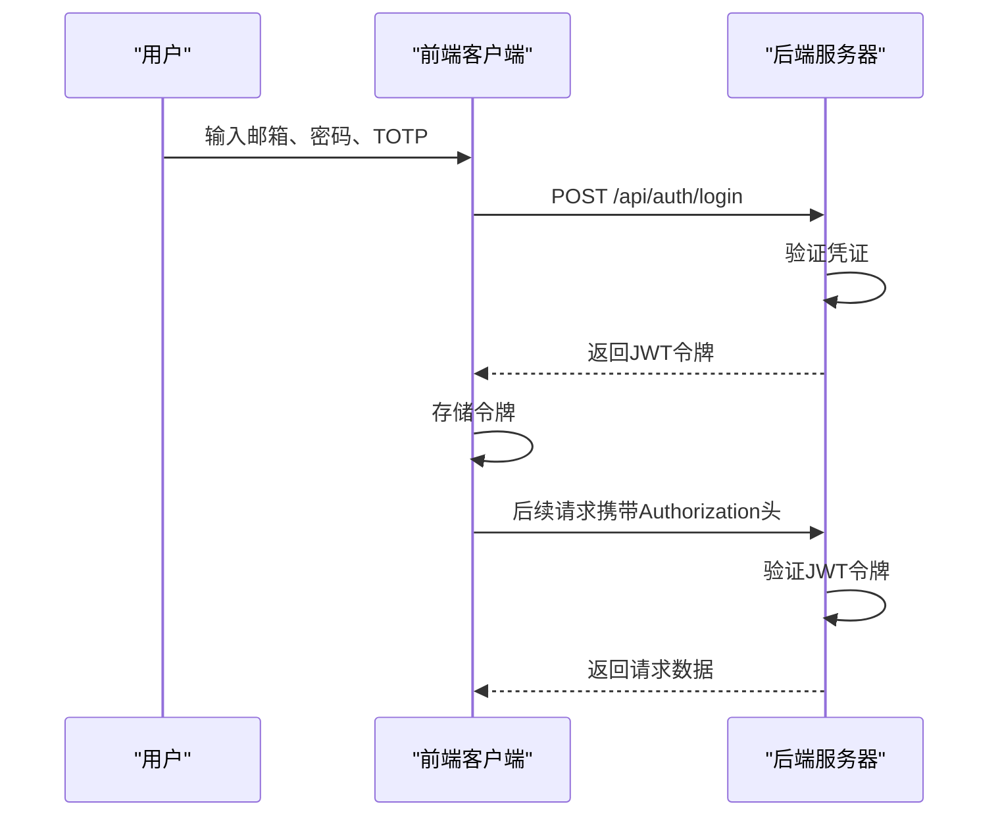
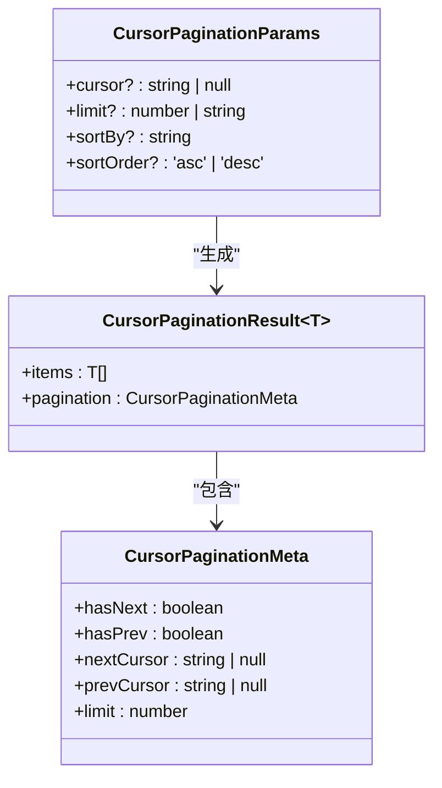
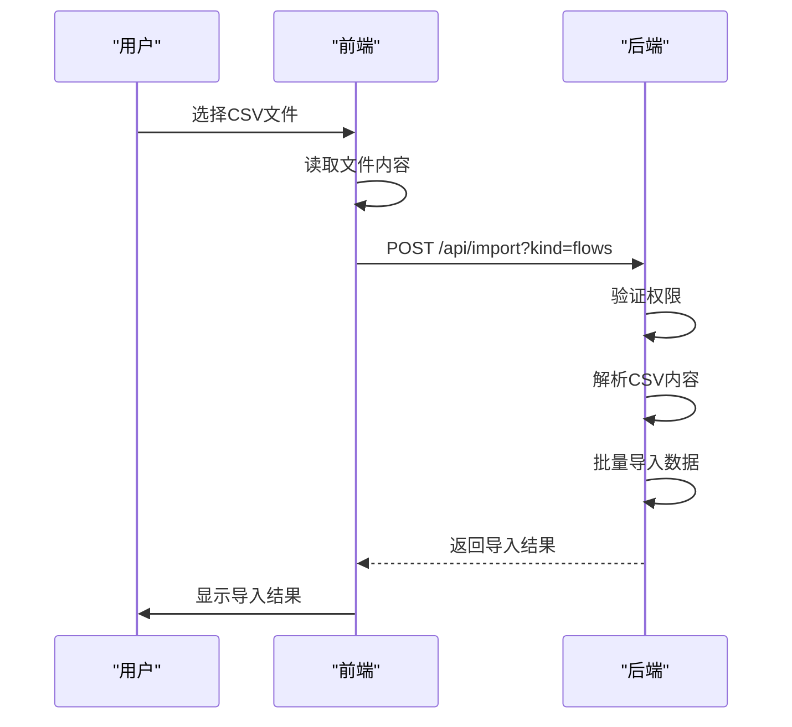
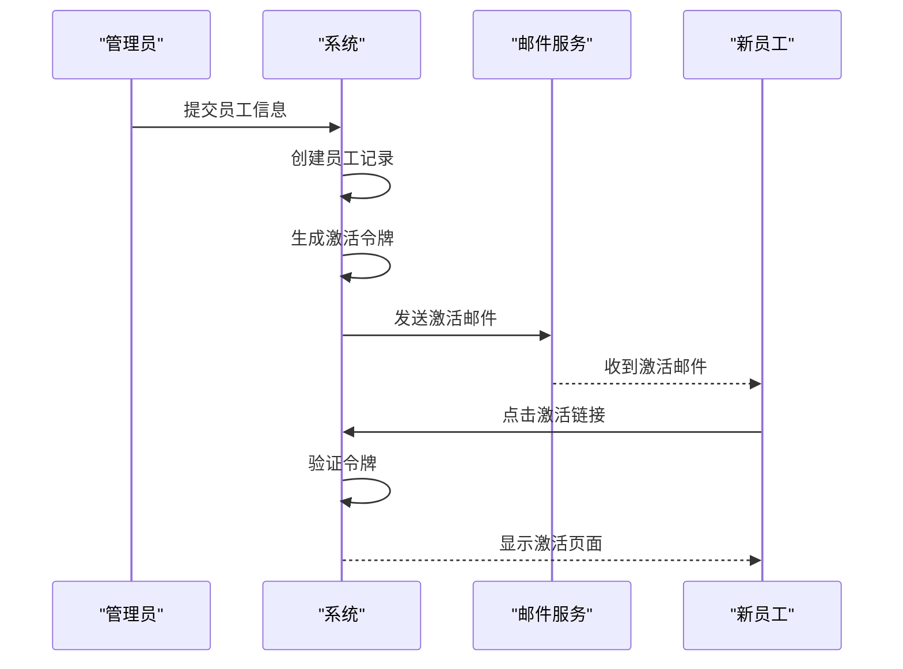
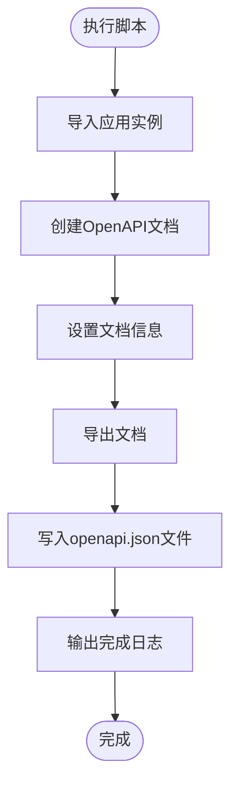
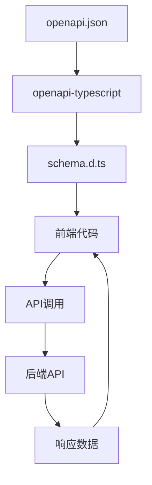

# API参考

<cite>
**本文档引用的文件**   
- [openapi.json](file://backend/openapi.json)
- [export-openapi.ts](file://backend/scripts/export-openapi.ts)
- [schema.d.ts](file://frontend/src/types/schema.d.ts)
- [cursor-pagination.ts](file://backend/src/utils/cursor-pagination.ts)
- [batch.schema.ts](file://backend/src/schemas/batch.schema.ts)
- [auth.ts](file://backend/src/routes/v2/auth.ts)
- [import.ts](file://backend/src/routes/v2/import.ts)
- [master-data.schema.ts](file://backend/src/schemas/master-data.schema.ts)
- [employees.ts](file://backend/src/routes/v2/employees.ts)
- [flows.ts](file://backend/src/routes/v2/flows.ts)
- [common.schema.ts](file://backend/src/schemas/common.schema.ts)
</cite>

## 目录
1. [简介](#简介)
2. [认证机制](#认证机制)
3. [分页机制](#分页机制)
4. [批量操作](#批量操作)
5. [文件导入导出](#文件导入导出)
6. [主数据管理](#主数据管理)
7. [员工管理](#员工管理)
8. [财务流水](#财务流水)
9. [OpenAPI文档维护](#openapi文档维护)
10. [前端类型安全](#前端类型安全)
11. [错误处理](#错误处理)
12. [示例](#示例)

## 简介
本API参考文档基于OpenAPI 3.1规范，为财务管理系统的所有v2接口提供权威说明。所有API端点均要求JWT + TOTP双重认证，确保系统安全。文档详细说明了每个端点的HTTP方法、URL路径、请求参数、请求体结构、响应格式和状态码。

**Section sources**
- [openapi.json](file://backend/openapi.json#L1-L10)

## 认证机制
系统采用JWT + TOTP双重认证机制，所有v2接口均需通过此认证。

### 登录认证
用户登录需要提供邮箱、密码和TOTP验证码。



**Diagram sources**
- [auth.ts](file://backend/src/routes/v2/auth.ts#L147-L177)
- [AuthService.ts](file://backend/src/services/AuthService.ts#L34-L148)

### 认证要求
- **JWT令牌**: 通过`Authorization: Bearer <token>`或`X-Auth-Token`头传递
- **TOTP**: 6位数字验证码，用于高安全操作
- **会话管理**: 采用单点登录机制，新登录会注销旧会话

**Section sources**
- [auth.ts](file://backend/src/routes/v2/auth.ts#L1-L688)
- [AuthService.ts](file://backend/src/services/AuthService.ts#L1-L495)

## 分页机制
系统采用游标分页（cursor-pagination）机制，避免传统offset分页的性能问题，特别适合大数据量场景。

### 游标分页参数


**Diagram sources**
- [cursor-pagination.ts](file://backend/src/utils/cursor-pagination.ts#L12-L40)

### 参数说明
| 参数 | 类型 | 必需 | 默认值 | 说明 |
|------|------|------|--------|------|
| `cursor` | string | 否 | - | 游标值，首次请求不传，后续请求使用上一页返回的`nextCursor` |
| `limit` | number | 否 | 20 | 每页数量，最大100 |
| `sortBy` | string | 否 | createdAt | 排序字段 |
| `sortOrder` | string | 否 | desc | 排序方向，asc(升序)或desc(降序) |

### 响应结构
分页响应包含`results`数组和`pagination`元数据：

```json
{
  "success": true,
  "data": {
    "results": [...],
    "pagination": {
      "hasNext": true,
      "hasPrev": false,
      "nextCursor": "base64编码的游标值",
      "prevCursor": null,
      "limit": 20
    }
  }
}
```

**Section sources**
- [cursor-pagination.ts](file://backend/src/utils/cursor-pagination.ts#L1-L218)

## 批量操作
系统提供通用的批量操作接口，支持删除、激活、停用等批量操作。

### 批量操作请求
```mermaid
classDiagram
class BatchOperationParams {
+ids : string[]
+operation : 'delete' \| 'activate' \| 'deactivate'
}
class BatchResponse {
+successCount : number
+failureCount : number
+failures? : { id : string; reason : string }[]
}
BatchOperationParams --> BatchResponse : "处理"
```

**Diagram sources**
- [batch.schema.ts](file://backend/src/schemas/batch.schema.ts#L6-L32)

### 参数说明
| 字段 | 类型 | 必需 | 说明 |
|------|------|------|------|
| `ids` | string数组 | 是 | 要操作的记录ID列表，至少1个 |
| `operation` | string | 是 | 操作类型：`delete`(删除)、`activate`(激活)、`deactivate`(停用) |

### 响应说明
| 字段 | 类型 | 说明 |
|------|------|------|
| `successCount` | number | 成功操作的数量 |
| `failureCount` | number | 失败操作的数量 |
| `failures` | 对象数组 | 失败详情，包含失败ID和原因 |

**Section sources**
- [batch.schema.ts](file://backend/src/schemas/batch.schema.ts#L1-L32)

## 文件导入导出
系统支持通过CSV文件批量导入数据，目前支持财务流水、应收应付、期初数据等类型的导入。

### 导入接口


**Diagram sources**
- [import.ts](file://backend/src/routes/v2/import.ts#L10-L84)
- [csv.ts](file://backend/src/utils/csv.ts#L8-L14)

### 导入参数
通过查询参数`kind`指定导入类型：
- `flows`: 财务流水
- `AR`: 应收账款
- `AP`: 应付账款
- `opening`: 期初数据

### 请求格式
- **URL**: `/api/import?kind={type}`
- **方法**: POST
- **Content-Type**: text/plain
- **请求体**: CSV文件的纯文本内容

### 示例CSV格式
系统提供示例CSV文件，位于`frontend/public/examples/`目录下：
- `import-flows-example.csv`: 财务流水导入示例
- `import-ap-example.csv`: 应付账款导入示例
- `import-ar-example.csv`: 应收账款导入示例
- `import-opening-example.csv`: 期初数据导入示例

**Section sources**
- [import.ts](file://backend/src/routes/v2/import.ts#L1-L84)
- [csv.ts](file://backend/src/utils/csv.ts#L1-L15)

## 主数据管理
主数据管理接口用于维护系统的基础数据，包括总部、部门、账户、币种、类别等。

### 总部管理
| 端点 | 方法 | 说明 |
|------|------|------|
| `/api/hq` | GET | 获取总部列表 |
| `/api/hq` | POST | 创建总部 |
| `/api/hq/{id}` | PUT | 更新总部 |
| `/api/hq/{id}` | DELETE | 删除总部 |

#### 总部数据结构
```mermaid
classDiagram
class Headquarters {
+id : string
+name : string
+active : number \| null
}
Headquarters : +id : string
Headquarters : +name : string
Headquarters : +active : number \| null
```

**Diagram sources**
- [master-data.schema.ts](file://backend/src/schemas/master-data.schema.ts#L11-L15)
- [departments.ts](file://backend/src/routes/v2/master-data/departments.ts#L22-L66)

### 部门管理
| 端点 | 方法 | 说明 |
|------|------|------|
| `/api/departments` | GET | 获取部门列表 |
| `/api/departments` | POST | 创建部门 |
| `/api/departments/{id}` | PUT | 更新部门 |
| `/api/departments/{id}` | DELETE | 删除部门 |

#### 部门数据结构
```mermaid
classDiagram
class Department {
+id : string
+hqId : string \| null
+name : string
+active : number \| null
+sortOrder : number \| null
}
Department : +id : string
Department : +hqId : string \| null
Department : +name : string
Department : +active : number \| null
Department : +sortOrder : number \| null
```

**Diagram sources**
- [master-data.schema.ts](file://backend/src/schemas/master-data.schema.ts#L23-L29)
- [departments.ts](file://backend/src/routes/v2/master-data/departments.ts#L68-L133)

**Section sources**
- [master-data.schema.ts](file://backend/src/schemas/master-data.schema.ts#L1-L183)
- [departments.ts](file://backend/src/routes/v2/master-data/departments.ts#L1-L439)

## 员工管理
员工管理接口用于维护员工信息，包括创建、查询、更新等操作。

### 员工查询
| 端点 | 方法 | 说明 |
|------|------|------|
| `/api/employees` | GET | 获取员工列表 |
| `/api/employees/{id}` | GET | 获取单个员工信息 |

#### 查询参数
| 参数 | 类型 | 说明 |
|------|------|------|
| `page` | number | 页码 |
| `pageSize` | number | 每页数量 |
| `status` | string | 状态：all, regular, probation, resigned |
| `activeOnly` | string | 是否只查询激活状态：true/false |

### 员工创建
| 端点 | 方法 | 说明 |
|------|------|------|
| `/api/employees` | POST | 创建员工 |

#### 创建员工
创建员工时会自动创建用户账号并发送激活邮件。



**Diagram sources**
- [employees.ts](file://backend/src/routes/v2/employees.ts#L22-L103)
- [employees.ts](file://backend/src/routes/v2/employees.ts#L156-L240)

### 员工更新
| 端点 | 方法 | 说明 |
|------|------|------|
| `/api/employees/{id}` | PUT | 更新员工信息 |
| `/api/employees/{id}/resend-activation` | POST | 重新发送激活邮件 |
| `/api/employees/{id}/reset-totp` | POST | 重置TOTP |

**Section sources**
- [employees.ts](file://backend/src/routes/v2/employees.ts#L1-L602)
- [employee.schema.ts](file://backend/src/schemas/employee.schema.ts#L7-L13)

## 财务流水
财务流水接口用于管理系统的现金流水记录。

### 流水查询
| 端点 | 方法 | 说明 |
|------|------|------|
| `/api/flows` | GET | 获取流水列表 |
| `/api/flows/next-voucher` | GET | 获取下一个凭证号 |

#### 分页参数
使用标准分页参数：
- `page`: 页码
- `pageSize`: 每页数量
- `limit`: 限制数量
- `offset`: 偏移量

### 流水创建
| 端点 | 方法 | 说明 |
|------|------|------|
| `/api/flows` | POST | 创建财务流水 |

#### 流水数据结构
```mermaid
classDiagram
class CashFlow {
+id : string
+voucherNo : string
+bizDate : string
+type : 'income' \| 'expense'
+accountId : string
+categoryId : string
+amountCents : number
+memo : string
+voucherUrls : string[]
}
CashFlow : +id : string
CashFlow : +voucherNo : string
CashFlow : +bizDate : string
CashFlow : +type : 'income' \| 'expense'
CashFlow : +accountId : string
CashFlow : +categoryId : string
CashFlow : +amountCents : number
CashFlow : +memo : string
CashFlow : +voucherUrls : string[]
```

**Diagram sources**
- [flows.ts](file://backend/src/routes/v2/flows.ts#L22-L47)
- [flows.ts](file://backend/src/routes/v2/flows.ts#L98-L126)

**Section sources**
- [flows.ts](file://backend/src/routes/v2/flows.ts#L1-L566)
- [business.schema.ts](file://backend/src/schemas/business.schema.ts#L1-L10)

## OpenAPI文档维护
系统提供脚本自动更新OpenAPI文档，确保API文档与代码保持同步。

### 文档生成脚本


**Diagram sources**
- [export-openapi.ts](file://backend/scripts/export-openapi.ts#L1-L16)

### 脚本执行
运行以下命令生成或更新OpenAPI文档：
```bash
cd backend
npm run export-openapi
```

脚本会：
1. 从应用实例获取OpenAPI 3.1文档
2. 设置文档版本和标题
3. 将文档导出为JSON格式
4. 保存到项目根目录的`openapi.json`文件

**Section sources**
- [export-openapi.ts](file://backend/scripts/export-openapi.ts#L1-L16)

## 前端类型安全
前端通过生成的`schema.d.ts`文件实现类型安全的API调用。

### 类型生成
系统使用`openapi-typescript`工具从`openapi.json`自动生成TypeScript类型定义。

### 类型使用


**Diagram sources**
- [schema.d.ts](file://frontend/src/types/schema.d.ts#L1-L800)

### 类型优势
- **编译时检查**: 在开发阶段发现类型错误
- **自动补全**: IDE提供智能提示
- **文档同步**: 类型定义与API文档保持一致
- **减少错误**: 避免运行时类型错误

**Section sources**
- [schema.d.ts](file://frontend/src/types/schema.d.ts#L1-L9272)

## 错误处理
系统采用统一的错误响应格式，便于前端处理。

### 错误响应结构
```json
{
  "success": false,
  "error": {
    "code": "ERROR_CODE",
    "message": "错误信息",
    "details": {}
  }
}
```

### 常见错误码
| 错误码 | HTTP状态码 | 说明 |
|--------|------------|------|
| `UNAUTHORIZED` | 401 | 未授权 |
| `FORBIDDEN` | 403 | 禁止访问 |
| `NOT_FOUND` | 404 | 资源未找到 |
| `VALIDATION_ERROR` | 400 | 验证错误 |
| `INTERNAL_ERROR` | 500 | 内部服务器错误 |

### 错误处理建议
1. **检查`success`字段**: 所有响应都应先检查`success`是否为`true`
2. **处理特定错误码**: 根据错误码提供相应的用户提示
3. **记录错误日志**: 在开发环境中记录详细的错误信息
4. **优雅降级**: 当API不可用时，提供备用方案或缓存数据

**Section sources**
- [errors.ts](file://backend/src/utils/errors.ts#L1-L50)
- [response.ts](file://backend/src/utils/response.js#L1-L20)

## 示例
### cURL示例
#### 获取员工列表
```bash
curl -X GET "https://api.example.com/api/employees?page=1&pageSize=20" \
  -H "Authorization: Bearer your-jwt-token" \
  -H "Content-Type: application/json"
```

#### 创建财务流水
```bash
curl -X POST "https://api.example.com/api/flows" \
  -H "Authorization: Bearer your-jwt-token" \
  -H "Content-Type: application/json" \
  -d '{
    "voucherNo": "V20240101001",
    "bizDate": "2024-01-01",
    "type": "expense",
    "accountId": "acc-123",
    "categoryId": "cat-456",
    "amountCents": 10000,
    "memo": "办公用品采购"
  }'
```

#### 批量删除员工
```bash
curl -X POST "https://api.example.com/api/employees/batch" \
  -H "Authorization: Bearer your-jwt-token" \
  -H "Content-Type: application/json" \
  -d '{
    "ids": ["emp-123", "emp-456"],
    "operation": "delete"
  }'
```

#### CSV文件导入
```bash
curl -X POST "https://api.example.com/api/import?kind=flows" \
  -H "Authorization: Bearer your-jwt-token" \
  -H "Content-Type: text/plain" \
  --data-binary @flows.csv
```

**Section sources**
- [openapi.json](file://backend/openapi.json#L1-L15768)
- [auth.ts](file://backend/src/routes/v2/auth.ts#L147-L177)
- [flows.ts](file://backend/src/routes/v2/flows.ts#L156-L180)
- [import.ts](file://backend/src/routes/v2/import.ts#L10-L23)