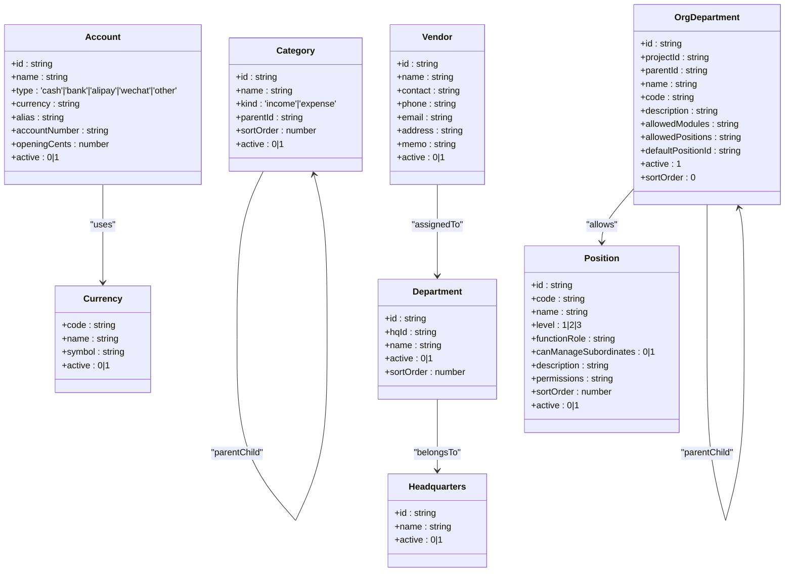
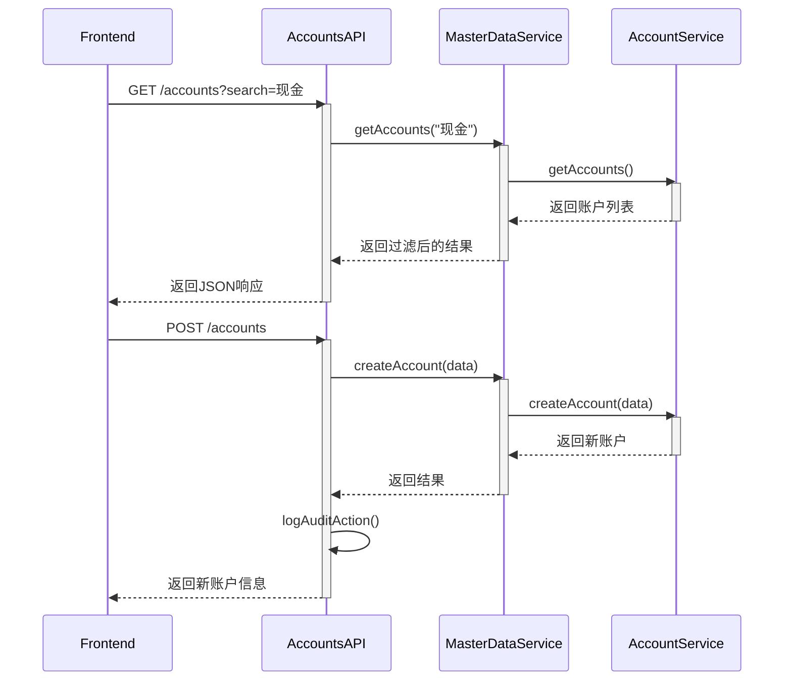
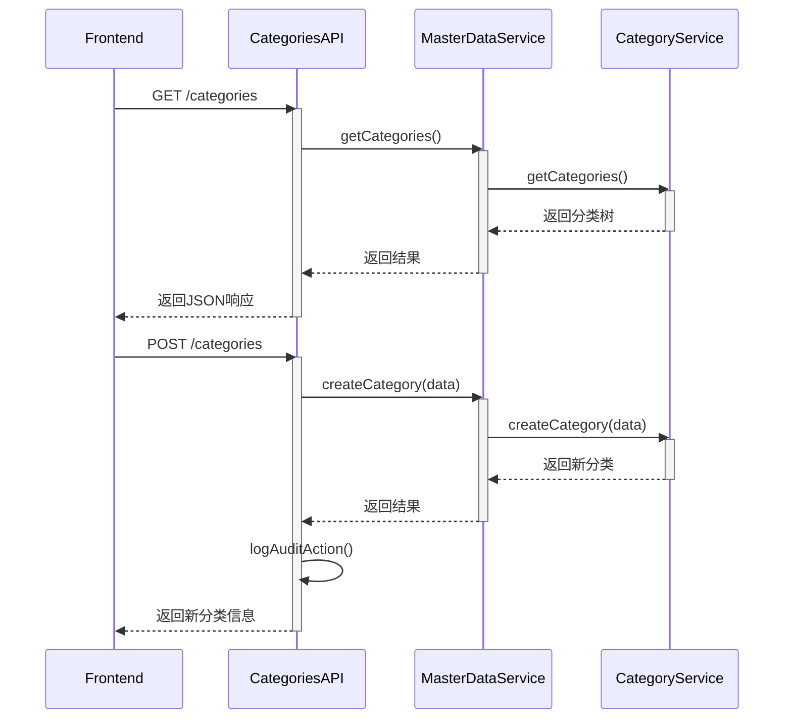
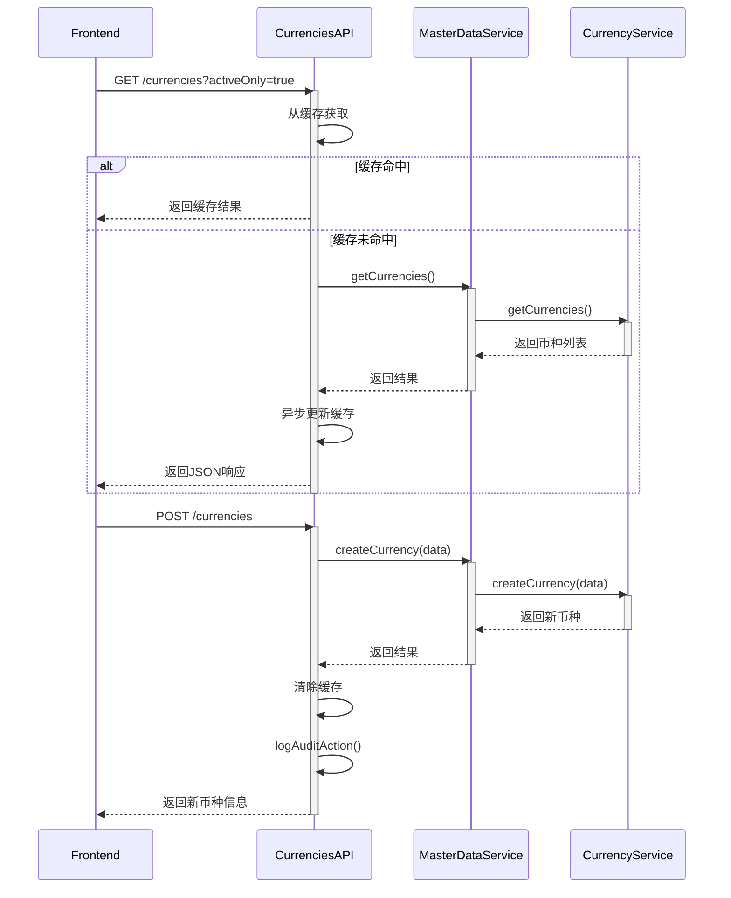
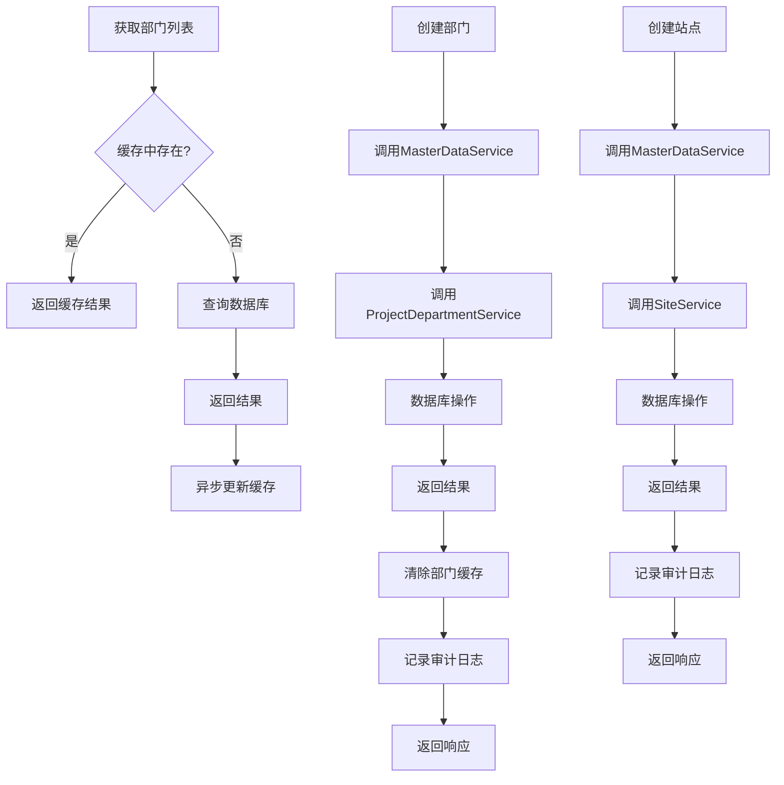
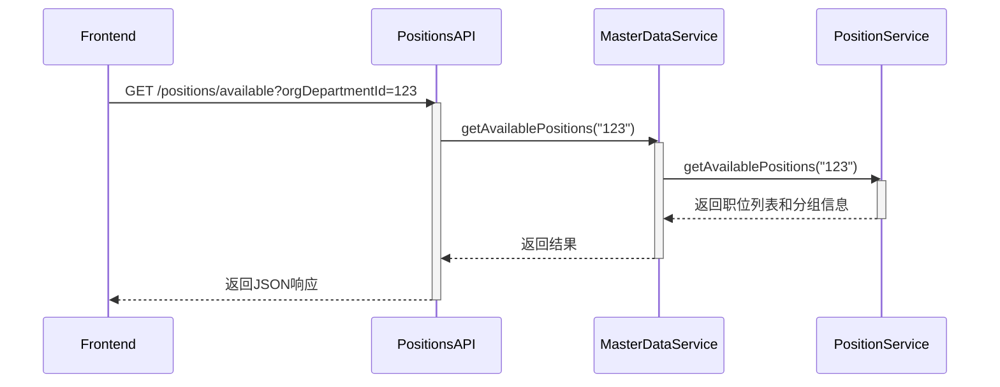
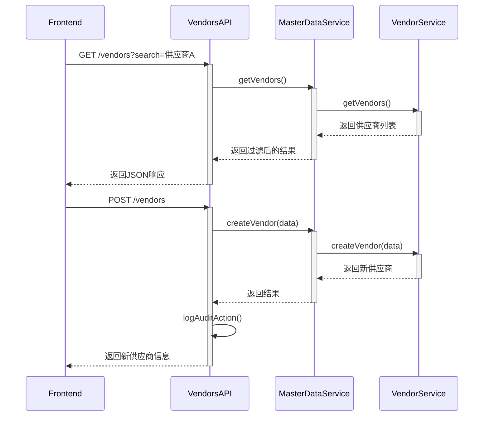
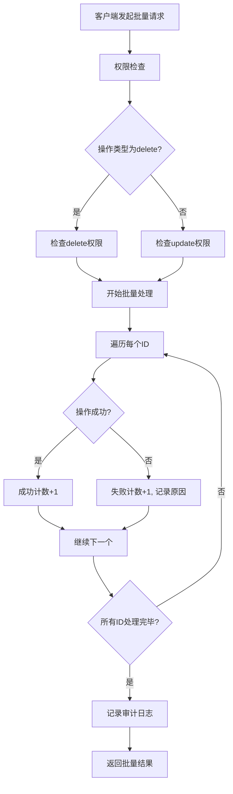

# 主数据管理API

<cite>
**本文档引用的文件**   
- [master-data.schema.ts](file://backend/src/schemas/master-data.schema.ts)
- [master-data.ts](file://backend/src/routes/v2/master-data.ts)
- [accounts.ts](file://backend/src/routes/v2/master-data/accounts.ts)
- [departments.ts](file://backend/src/routes/v2/master-data/departments.ts)
- [headquarters.ts](file://backend/src/routes/v2/master-data/headquarters.ts)
- [currencies.ts](file://backend/src/routes/v2/master-data/currencies.ts)
- [categories.ts](file://backend/src/routes/v2/master-data/categories.ts)
- [positions.ts](file://backend/src/routes/v2/master-data/positions.ts)
- [org-departments.ts](file://backend/src/routes/v2/master-data/org-departments.ts)
- [vendors.ts](file://backend/src/routes/v2/master-data/vendors.ts)
- [MasterDataService.ts](file://backend/src/services/MasterDataService.ts)
- [common.schema.ts](file://backend/src/schemas/common.schema.ts)
- [batch.schema.ts](file://backend/src/schemas/batch.schema.ts)
- [route-helpers.ts](file://backend/src/utils/route-helpers.ts)
- [pagination.ts](file://backend/src/utils/pagination.ts)
</cite>

## 目录
1. [简介](#简介)
2. [主数据资源概览](#主数据资源概览)
3. [核心数据结构与验证规则](#核心数据结构与验证规则)
4. [账户管理API](#账户管理api)
5. [分类管理API](#分类管理api)
6. [币种管理API](#币种管理api)
7. [部门与总部管理API](#部门与总部管理api)
8. [组织部门与职位管理API](#组织部门与职位管理api)
9. [供应商管理API](#供应商管理api)
10. [批量操作API](#批量操作api)
11. [分页查询与最佳实践](#分页查询与最佳实践)
12. [前端集成建议](#前端集成建议)

## 简介

主数据管理API为财务系统提供了一套完整的主数据增删改查接口，涵盖了账户、分类、币种、部门、总部、组织部门、职位、供应商等核心资源。该API基于Hono框架和Zod Schema进行构建，确保了接口的类型安全和数据验证。所有接口均遵循RESTful设计原则，并通过权限中间件进行访问控制。

主数据服务采用门面模式（Facade Pattern），通过`MasterDataService`类统一协调各个具体的主数据服务（如`AccountService`、`DepartmentService`等），为上层路由提供简洁的接口。API路由采用模块化设计，每个资源类型都有独立的路由文件，并通过`master-data.ts`主路由文件进行聚合。

**Section sources**
- [master-data.ts](file://backend/src/routes/v2/master-data.ts#L1-L23)
- [MasterDataService.ts](file://backend/src/services/MasterDataService.ts#L1-L261)

## 主数据资源概览

主数据管理模块包含以下核心资源：

- **账户 (Accounts)**: 用于管理现金、银行、支付宝、微信等各类财务账户。
- **分类 (Categories)**: 用于定义收入和支出的分类体系，支持树状层级结构。
- **币种 (Currencies)**: 用于管理所有支持的货币类型，如人民币(CNY)、美元(USD)等。
- **部门 (Departments)**: 用于组织公司的部门结构。
- **总部 (Headquarters)**: 代表公司的总部实体，部门可以归属于特定的总部。
- **站点 (Sites)**: 代表具体的业务运营地点，与部门相关联。
- **组织部门 (Org Departments)**: 更细粒度的组织单元，用于权限和模块控制。
- **职位 (Positions)**: 定义公司内的各种职位，与权限系统绑定。
- **供应商 (Vendors)**: 管理与公司有业务往来的供应商信息。

这些资源之间存在明确的关联关系，例如部门归属于总部，站点隶属于部门，组织部门可以配置允许的职位列表等。这些关系在API层面通过外键和级联约束来维护数据的一致性。

**Section sources**
- [master-data.schema.ts](file://backend/src/schemas/master-data.schema.ts#L1-L183)
- [master-data.ts](file://backend/src/routes/v2/master-data.ts#L1-L23)

## 核心数据结构与验证规则

所有主数据资源的请求和响应结构都基于Zod Schema进行定义，确保了数据的类型安全和完整性。核心的验证规则在`master-data.schema.ts`文件中定义。

### 通用字段规则
- **ID字段**: 使用`uuidSchema`进行验证，确保为有效的UUID格式。
- **名称字段**: 普遍要求`min(1)`，即不能为空字符串。
- **状态字段**: 使用`z.number().int().min(0).max(1)`表示布尔状态（0为禁用，1为启用），并允许`nullable()`。
- **分页参数**: 在`common.schema.ts`中定义了`paginationSchema`，支持`page`、`pageSize`、`limit`和`offset`参数。

### 资源特定规则
- **账户**: 账户类型(type)为枚举值`['cash', 'bank', 'alipay', 'wechat', 'other']`，币种(currency)必须为3位长度的字符串。
- **分类**: 类别种类(kind)为枚举值`['income', 'expense']`，支持通过`parentId`构建树状结构。
- **币种**: 币种代码(code)必须为3位长度，这是国际标准ISO 4217的要求。
- **供应商**: 邮箱(email)字段使用`email()`方法进行格式验证。
- **职位**: 职位等级(level)限制在1-3级，`permissions`字段为JSON字符串，用于存储权限配置。

这些验证规则在API的请求处理阶段自动执行，如果请求数据不符合Schema定义，将返回400错误和详细的验证错误信息。



**Diagram sources **
- [master-data.schema.ts](file://backend/src/schemas/master-data.schema.ts#L55-L170)

**Section sources**
- [master-data.schema.ts](file://backend/src/schemas/master-data.schema.ts#L1-L183)
- [common.schema.ts](file://backend/src/schemas/common.schema.ts#L1-L234)

## 账户管理API

账户管理API提供了对财务账户的完整CRUD操作，包括账户的创建、查询、更新和删除。

### 获取账户列表
- **HTTP方法**: `GET`
- **端点**: `/api/v2/master-data/accounts`
- **权限**: `system:account:view`
- **请求参数**:
  - `activeOnly` (可选): 过滤仅启用的账户
  - `accountType` (可选): 按账户类型过滤
  - `currency` (可选): 按币种过滤
  - `search` (可选): 按账户名称搜索
- **响应格式**: 返回`accountSchema`数组，包含`currencyName`扩展字段。

### 创建账户
- **HTTP方法**: `POST`
- **端点**: `/api/v2/master-data/accounts`
- **权限**: `system:account:create`
- **请求体**: `createAccountSchema`
- **响应格式**: 返回新创建的账户信息。

### 更新账户
- **HTTP方法**: `PUT`
- **端点**: `/api/v2/master-data/accounts/{id}`
- **权限**: `system:account:update`
- **请求体**: `updateAccountSchema`
- **响应格式**: 空对象，表示成功。

### 删除账户
- **HTTP方法**: `DELETE`
- **端点**: `/api/v2/master-data/accounts/{id}`
- **权限**: `system:account:delete`
- **响应格式**: 空对象，表示成功。

### 获取账户交易记录
- **HTTP方法**: `GET`
- **端点**: `/api/v2/master-data/accounts/{id}/transactions`
- **权限**: `system:account:view`
- **请求参数**: 标准分页参数 (`page`, `limit`)
- **响应格式**: 返回分页的交易记录列表，包含余额、凭证号等信息。



**Diagram sources **
- [accounts.ts](file://backend/src/routes/v2/master-data/accounts.ts#L1-L310)
- [MasterDataService.ts](file://backend/src/services/MasterDataService.ts#L77-L114)

**Section sources**
- [accounts.ts](file://backend/src/routes/v2/master-data/accounts.ts#L1-L310)
- [master-data.schema.ts](file://backend/src/schemas/master-data.schema.ts#L55-L66)

## 分类管理API

分类管理API用于维护收入和支出的分类体系，支持树状层级结构。

### 获取分类列表
- **HTTP方法**: `GET`
- **端点**: `/api/v2/master-data/categories`
- **权限**: 任何已登录用户
- **响应格式**: 返回`categorySchema`数组，包含所有分类及其层级关系。

### 创建分类
- **HTTP方法**: `POST`
- **端点**: `/api/v2/master-data/categories`
- **权限**: `system:category:create`
- **请求体**: `createCategorySchema` (不包含`id`, `sortOrder`, `active`)
- **响应格式**: 返回新创建的分类信息。

### 更新分类
- **HTTP方法**: `PUT`
- **端点**: `/api/v2/master-data/categories/{id}`
- **权限**: `system:category:update`
- **请求体**: `updateCategorySchema` (仅`name`和`kind`可选)
- **响应格式**: 空对象，表示成功。

### 删除分类
- **HTTP方法**: `DELETE`
- **端点**: `/api/v2/master-data/categories/{id}`
- **权限**: `system:category:delete`
- **响应格式**: 空对象，表示成功。

分类的`parentId`字段用于构建树状结构，`sortOrder`字段用于控制同一层级内的排序。系统在创建和更新时会自动处理这些字段。



**Diagram sources **
- [categories.ts](file://backend/src/routes/v2/master-data/categories.ts#L1-L232)
- [MasterDataService.ts](file://backend/src/services/MasterDataService.ts#L223-L239)

**Section sources**
- [categories.ts](file://backend/src/routes/v2/master-data/categories.ts#L1-L232)
- [master-data.schema.ts](file://backend/src/schemas/master-data.schema.ts#L74-L87)

## 币种管理API

币种管理API用于维护系统支持的所有货币类型。

### 获取币种列表
- **HTTP方法**: `GET`
- **端点**: `/api/v2/master-data/currencies`
- **权限**: 任何已登录用户
- **请求参数**:
  - `activeOnly` (可选): 过滤仅启用的币种
  - `search` (可选): 按币种名称或代码搜索
- **响应格式**: 返回`currencySchema`数组。

### 创建币种
- **HTTP方法**: `POST`
- **端点**: `/api/v2/master-data/currencies`
- **权限**: `system:currency:create`
- **请求体**: `createCurrencySchema`
- **响应格式**: 返回新创建的币种信息。

### 更新币种
- **HTTP方法**: `PUT`
- **端点**: `/api/v2/master-data/currencies/{code}`
- **权限**: `system:currency:update`
- **请求体**: `updateCurrencySchema` (不允许更新`code`)
- **响应格式**: 空对象，表示成功。

### 删除币种
- **HTTP方法**: `DELETE`
- **端点**: `/api/v2/master-data/currencies/{code}`
- **权限**: `system:currency:delete`
- **响应格式**: 空对象，表示成功。

币种的`code`字段是主键，因此在更新操作中被排除，确保其不可变性。



**Diagram sources **
- [currencies.ts](file://backend/src/routes/v2/master-data/currencies.ts#L1-L318)
- [MasterDataService.ts](file://backend/src/services/MasterDataService.ts#L171-L186)

**Section sources**
- [currencies.ts](file://backend/src/routes/v2/master-data/currencies.ts#L1-L318)
- [master-data.schema.ts](file://backend/src/schemas/master-data.schema.ts#L92-L100)

## 部门与总部管理API

部门与总部管理API提供了对组织结构的管理功能，包括部门、总部和站点。

### 获取部门列表
- **HTTP方法**: `GET`
- **端点**: `/api/v2/master-data/departments/departments`
- **权限**: 任何已登录用户
- **响应格式**: 返回`departmentSchema`数组，结果被缓存以提高性能。

### 创建部门
- **HTTP方法**: `POST`
- **端点**: `/api/v2/master-data/departments/departments`
- **权限**: `system:department:create`
- **请求体**: `createDepartmentSchema`
- **响应格式**: 返回新创建的部门信息。

### 更新部门
- **HTTP方法**: `PUT`
- **端点**: `/api/v2/master-data/departments/departments/{id}`
- **权限**: `system:department:update`
- **请求体**: `updateDepartmentSchema`
- **响应格式**: 空对象，表示成功。

### 删除部门
- **HTTP方法**: `DELETE`
- **端点**: `/api/v2/master-data/departments/departments/{id}`
- **权限**: `system:department:delete`
- **响应格式**: 空对象，表示成功。

### 获取站点列表
- **HTTP方法**: `GET`
- **端点**: `/api/v2/master-data/departments/sites`
- **权限**: 任何已登录用户
- **请求参数**:
  - `activeOnly` (可选): 过滤仅启用的站点
  - `search` (可选): 按站点名称搜索

### 创建站点
- **HTTP方法**: `POST`
- **端点**: `/api/v2/master-data/departments/sites`
- **权限**: `site:info:create`
- **请求体**: `createSiteSchema`
- **响应格式**: 返回新创建的站点信息。

### 获取总部列表
- **HTTP方法**: `GET`
- **端点**: `/api/v2/master-data/hq`
- **权限**: 任何已登录用户
- **响应格式**: 返回`headquartersSchema`数组。

### 更新总部
- **HTTP方法**: `PUT`
- **端点**: `/api/v2/master-data/hq/{id}`
- **权限**: `system:headquarters:update`
- **请求体**: `updateHeadquartersSchema`
- **响应格式**: 空对象，表示成功。

### 删除总部
- **HTTP方法**: `DELETE`
- **端点**: `/api/v2/master-data/hq/{id}`
- **权限**: `system:headquarters:delete`
- **响应格式**: 空对象，表示成功。

**注意**: 创建总部的API已被禁用，通过`throw Errors.BUSINESS_ERROR('总部配置已禁用')`实现。



**Diagram sources **
- [departments.ts](file://backend/src/routes/v2/master-data/departments.ts#L1-L439)
- [headquarters.ts](file://backend/src/routes/v2/master-data/headquarters.ts#L1-L166)

**Section sources**
- [departments.ts](file://backend/src/routes/v2/master-data/departments.ts#L1-L439)
- [headquarters.ts](file://backend/src/routes/v2/master-data/headquarters.ts#L1-L166)
- [master-data.schema.ts](file://backend/src/schemas/master-data.schema.ts#L23-L47)

## 组织部门与职位管理API

组织部门与职位管理API用于更细粒度的组织结构和权限管理。

### 获取组织部门列表
- **HTTP方法**: `GET`
- **端点**: `/api/v2/master-data/org-departments`
- **权限**: 任何已登录用户
- **请求参数**: `project_id` (可选)
- **响应格式**: 返回扩展的`orgDepartmentSchema`数组，包含关联的职位和项目名称。

### 获取组织部门详情
- **HTTP方法**: `GET`
- **端点**: `/api/v2/master-data/org-departments/{id}`
- **权限**: 任何已登录用户
- **响应格式**: 返回单个组织部门的详细信息。

### 获取职位列表
- **HTTP方法**: `GET`
- **端点**: `/api/v2/master-data/positions`
- **权限**: 任何已登录用户
- **响应格式**: 返回`positionSchema`数组。

### 获取可用职位列表
- **HTTP方法**: `GET`
- **端点**: `/api/v2/master-data/positions/available`
- **权限**: 任何已登录用户
- **请求参数**: `orgDepartmentId` (必填)
- **响应格式**: 返回`availablePositionsResponseSchema`，包含按功能角色分组的职位列表和部门信息。

组织部门的`allowedPositions`和`allowedModules`字段为JSON字符串，用于存储允许的职位和模块列表。`defaultPositionId`字段用于指定该部门的默认职位。



**Diagram sources **
- [positions.ts](file://backend/src/routes/v2/master-data/positions.ts#L1-L88)
- [org-departments.ts](file://backend/src/routes/v2/master-data/org-departments.ts#L1-L126)

**Section sources**
- [positions.ts](file://backend/src/routes/v2/master-data/positions.ts#L1-L88)
- [org-departments.ts](file://backend/src/routes/v2/master-data/org-departments.ts#L1-L126)
- [master-data.schema.ts](file://backend/src/schemas/master-data.schema.ts#L139-L182)

## 供应商管理API

供应商管理API提供了对供应商信息的CRUD操作。

### 获取供应商列表
- **HTTP方法**: `GET`
- **端点**: `/api/v2/master-data/vendors`
- **权限**: 任何已登录用户
- **请求参数**:
  - `activeOnly` (可选): 过滤仅启用的供应商
  - `search` (可选): 按供应商名称搜索
- **响应格式**: 返回`vendorSchema`数组。

### 获取供应商详情
- **HTTP方法**: `GET`
- **端点**: `/api/v2/master-data/vendors/{id}`
- **权限**: 任何已登录用户
- **响应格式**: 返回单个供应商的详细信息。

### 创建供应商
- **HTTP方法**: `POST`
- **端点**: `/api/v2/master-data/vendors`
- **权限**: `system:vendor:create`
- **请求体**: `createVendorSchema`
- **响应格式**: 返回新创建的供应商信息。

### 更新供应商
- **HTTP方法**: `PUT`
- **端点**: `/api/v2/master-data/vendors/{id}`
- **权限**: `system:vendor:update`
- **请求体**: `updateVendorSchema`
- **响应格式**: 空对象，表示成功。

### 删除供应商
- **HTTP方法**: `DELETE`
- **端点**: `/api/v2/master-data/vendors/{id}`
- **权限**: `system:vendor:delete`
- **响应格式**: 空对象，表示成功。



**Diagram sources **
- [vendors.ts](file://backend/src/routes/v2/master-data/vendors.ts#L1-L260)
- [MasterDataService.ts](file://backend/src/services/MasterDataService.ts#L116-L154)

**Section sources**
- [vendors.ts](file://backend/src/routes/v2/master-data/vendors.ts#L1-L260)
- [master-data.schema.ts](file://backend/src/schemas/master-data.schema.ts#L105-L117)

## 批量操作API

批量操作API提供了一种高效处理多个资源实例的方式，目前主要支持币种资源的批量操作。

### 批量操作币种
- **HTTP方法**: `POST`
- **端点**: `/api/v2/master-data/currencies/batch`
- **权限**: 
  - `system:currency:update` (用于所有操作)
  - `system:currency:delete` (仅用于删除操作)
- **请求体**: `batchOperationSchema`
  - `ids`: 要操作的币种代码数组
  - `operation`: 操作类型，可选值为`delete`, `activate`, `deactivate`
- **响应格式**: `batchResponseSchema`，包含成功和失败的计数及失败原因。

此API通过`MasterDataService`的`batchOperation`方法实现，对每个ID进行循环处理，并捕获单个操作的错误，确保部分成功。操作完成后会记录审计日志。



**Diagram sources **
- [currencies.ts](file://backend/src/routes/v2/master-data/currencies.ts#L256-L318)
- [MasterDataService.ts](file://backend/src/services/MasterDataService.ts#L188-L221)
- [batch.schema.ts](file://backend/src/schemas/batch.schema.ts#L1-L32)

**Section sources**
- [currencies.ts](file://backend/src/routes/v2/master-data/currencies.ts#L256-L318)
- [MasterDataService.ts](file://backend/src/services/MasterDataService.ts#L188-L221)
- [batch.schema.ts](file://backend/src/schemas/batch.schema.ts#L1-L32)

## 分页查询与最佳实践

主数据管理API中的列表查询接口（如账户、分类、币种等）均支持分页查询，以提高性能和用户体验。

### 分页参数
分页参数在`common.schema.ts`的`paginationSchema`中定义，支持以下参数：
- `page`: 页码，从1开始，默认为1。
- `pageSize`: 每页大小，默认为20，最大为1000。
- `limit`: 与`pageSize`同义，用于兼容不同习惯。
- `offset`: 偏移量，用于基于偏移的分页。

### 分页响应格式
分页响应包含一个`pagination`对象，其结构如下：
```json
{
  "success": true,
  "data": {
    "items": [...],
    "pagination": {
      "page": 1,
      "pageSize": 20,
      "total": 100,
      "totalPages": 5
    }
  }
}
```

### 最佳实践
1. **合理设置页大小**: 避免设置过大的`pageSize`（如超过100），以免影响性能。
2. **使用缓存**: 对于不常变化的主数据（如币种、分类），前端应实现本地缓存，减少API调用。
3. **增量加载**: 在前端UI中，使用“加载更多”或“无限滚动”模式，而不是一次性加载所有数据。
4. **搜索与过滤**: 利用API提供的查询参数（如`search`, `activeOnly`）在服务端进行过滤，减少传输的数据量。
5. **错误处理**: 处理分页请求时，应捕获可能的400（参数错误）和500（服务器错误）响应。

分页功能通过`route-helpers.ts`中的`createPaginatedHandler`和`parsePagination`函数实现，确保了所有分页接口的一致性。

**Section sources**
- [common.schema.ts](file://backend/src/schemas/common.schema.ts#L25-L30)
- [route-helpers.ts](file://backend/src/utils/route-helpers.ts#L34-L58)
- [pagination.ts](file://backend/src/utils/pagination.ts#L1-L35)

## 前端集成建议

为了高效、安全地集成主数据管理API，建议遵循以下最佳实践：

### 1. 使用TypeScript
利用Zod Schema生成TypeScript类型，确保前端代码的类型安全。例如，可以将`accountSchema`导入并用于定义接口：
```typescript
import { accountSchema } from 'path/to/schemas';
type Account = z.infer<typeof accountSchema>;
```

### 2. 封装API客户端
创建一个统一的API客户端，封装HTTP请求、认证和错误处理逻辑。可以使用`fetch`或`axios`等库。

### 3. 实现缓存策略
对于读取频繁但更新不频繁的主数据（如币种、分类），在前端实现内存缓存或使用`localStorage`，减少对后端的请求压力。

### 4. 错误处理
全局处理API错误，特别是权限错误（403）和验证错误（400）。对于验证错误，应解析响应体中的详细信息并展示给用户。

### 5. 权限控制
在前端UI中，根据用户的权限动态显示或隐藏操作按钮（如创建、编辑、删除），提供更好的用户体验。

### 6. 使用示例
以下是使用`curl`调用创建账户API的示例：
```bash
curl -X POST https://api.example.com/api/v2/master-data/accounts \
  -H "Authorization: Bearer <your_token>" \
  -H "Content-Type: application/json" \
  -d '{
    "name": "现金账户",
    "type": "cash",
    "currency": "CNY",
    "openingCents": 100000
  }'
```

通过遵循这些建议，可以确保前端应用与主数据管理API的稳定、高效集成。

**Section sources**
- [accounts.ts](file://backend/src/routes/v2/master-data/accounts.ts#L216-L269)
- [route-helpers.ts](file://backend/src/utils/route-helpers.ts#L16-L28)
- [errors.ts](file://backend/src/utils/errors.ts)