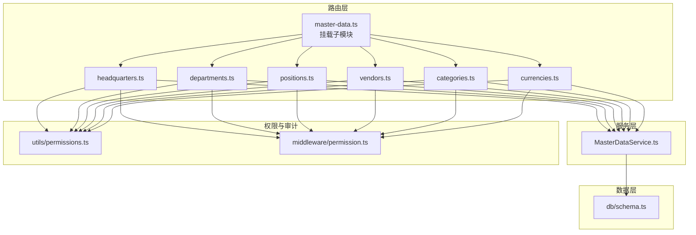
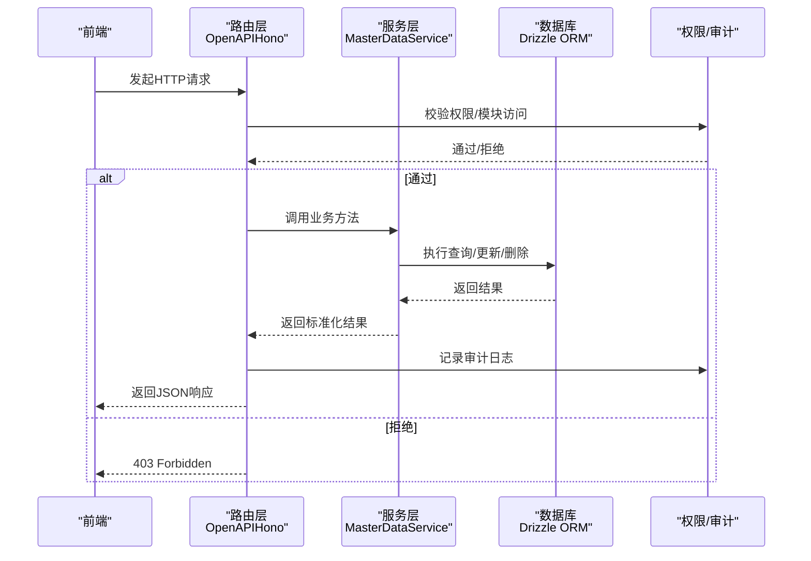
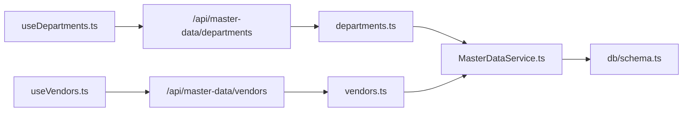

# 主数据管理API

<cite>
**本文引用的文件**
- [backend/src/routes/master-data.ts](file://backend/src/routes/master-data.ts)
- [backend/src/routes/master-data/headquarters.ts](file://backend/src/routes/master-data/headquarters.ts)
- [backend/src/routes/master-data/departments.ts](file://backend/src/routes/master-data/departments.ts)
- [backend/src/routes/master-data/positions.ts](file://backend/src/routes/master-data/positions.ts)
- [backend/src/routes/master-data/vendors.ts](file://backend/src/routes/master-data/vendors.ts)
- [backend/src/routes/master-data/categories.ts](file://backend/src/routes/master-data/categories.ts)
- [backend/src/routes/master-data/currencies.ts](file://backend/src/routes/master-data/currencies.ts)
- [backend/src/schemas/master-data.schema.ts](file://backend/src/schemas/master-data.schema.ts)
- [backend/src/services/MasterDataService.ts](file://backend/src/services/MasterDataService.ts)
- [backend/src/db/schema.ts](file://backend/src/db/schema.ts)
- [backend/src/utils/permissions.ts](file://backend/src/utils/permissions.ts)
- [backend/src/middleware/permission.ts](file://backend/src/middleware/permission.ts)
- [backend/test/routes/master-data.test.ts](file://backend/test/routes/master-data.test.ts)
- [frontend/src/hooks/business/useDepartments.ts](file://frontend/src/hooks/business/useDepartments.ts)
- [frontend/src/hooks/business/useVendors.ts](file://frontend/src/hooks/business/useVendors.ts)
</cite>

## 目录
1. [简介](#简介)
2. [项目结构](#项目结构)
3. [核心组件](#核心组件)
4. [架构总览](#架构总览)
5. [详细组件分析](#详细组件分析)
6. [依赖分析](#依赖分析)
7. [性能考虑](#性能考虑)
8. [故障排查指南](#故障排查指南)
9. [结论](#结论)
10. [附录](#附录)

## 简介
本文件面向后端与前端开发者，系统化梳理“主数据管理API”的设计与实现，覆盖以下核心实体：
- 总部：/api/master-data/hq
- 部门：/api/master-data/departments
- 站点：/api/master-data/sites
- 职位：/api/master-data/positions
- 供应商：/api/master-data/vendors
- 分类：/api/master-data/categories
- 币种：/api/master-data/currencies

重点说明各实体的CRUD端点、请求/响应结构、权限控制、数据完整性约束、active状态管理、以及部门与总部的层级关系。同时提供批量操作与状态管理的实践建议，并给出常见问题的排查路径。

## 项目结构
主数据路由统一挂载在 /api/master-data 下，按实体拆分子路由模块；服务层集中处理业务逻辑；数据库模式定义了各实体表结构；权限工具与中间件负责鉴权与审计日志。

图表来源
- [backend/src/routes/master-data.ts](file://backend/src/routes/master-data.ts#L1-L23)
- [backend/src/routes/master-data/headquarters.ts](file://backend/src/routes/master-data/headquarters.ts#L1-L139)
- [backend/src/routes/master-data/departments.ts](file://backend/src/routes/master-data/departments.ts#L1-L327)
- [backend/src/routes/master-data/positions.ts](file://backend/src/routes/master-data/positions.ts#L1-L65)
- [backend/src/routes/master-data/vendors.ts](file://backend/src/routes/master-data/vendors.ts#L1-L237)
- [backend/src/routes/master-data/categories.ts](file://backend/src/routes/master-data/categories.ts#L1-L155)
- [backend/src/routes/master-data/currencies.ts](file://backend/src/routes/master-data/currencies.ts#L1-L165)
- [backend/src/services/MasterDataService.ts](file://backend/src/services/MasterDataService.ts#L1-L608)
- [backend/src/db/schema.ts](file://backend/src/db/schema.ts#L1-L200)
- [backend/src/utils/permissions.ts](file://backend/src/utils/permissions.ts#L1-L200)
- [backend/src/middleware/permission.ts](file://backend/src/middleware/permission.ts#L1-L39)

章节来源
- [backend/src/routes/master-data.ts](file://backend/src/routes/master-data.ts#L1-L23)

## 核心组件
- 路由聚合器：将各主数据子路由挂载到统一前缀，便于前端统一调用。
- 实体路由：每个实体提供标准CRUD端点，结合OpenAPI路由定义与Zod Schema进行请求校验与响应结构描述。
- 服务层：封装数据访问与业务规则，包括唯一性校验、外键依赖检查、active状态变更、排序与分页策略等。
- 数据模式：定义各实体的表结构、索引与约束，确保一致性与可维护性。
- 权限与审计：通过权限工具与中间件实现细粒度权限控制，并在关键操作记录审计日志。

章节来源
- [backend/src/routes/master-data.ts](file://backend/src/routes/master-data.ts#L1-L23)
- [backend/src/services/MasterDataService.ts](file://backend/src/services/MasterDataService.ts#L1-L608)
- [backend/src/db/schema.ts](file://backend/src/db/schema.ts#L1-L200)
- [backend/src/utils/permissions.ts](file://backend/src/utils/permissions.ts#L1-L200)
- [backend/src/middleware/permission.ts](file://backend/src/middleware/permission.ts#L1-L39)

## 架构总览
主数据API采用“路由-服务-数据”三层架构，配合权限中间件与审计日志，形成清晰的职责边界与安全控制。

图表来源
- [backend/src/routes/master-data/headquarters.ts](file://backend/src/routes/master-data/headquarters.ts#L60-L106)
- [backend/src/routes/master-data/departments.ts](file://backend/src/routes/master-data/departments.ts#L64-L162)
- [backend/src/routes/master-data/positions.ts](file://backend/src/routes/master-data/positions.ts#L27-L65)
- [backend/src/routes/master-data/vendors.ts](file://backend/src/routes/master-data/vendors.ts#L113-L204)
- [backend/src/routes/master-data/categories.ts](file://backend/src/routes/master-data/categories.ts#L58-L122)
- [backend/src/routes/master-data/currencies.ts](file://backend/src/routes/master-data/currencies.ts#L71-L132)
- [backend/src/services/MasterDataService.ts](file://backend/src/services/MasterDataService.ts#L1-L608)
- [backend/src/utils/permissions.ts](file://backend/src/utils/permissions.ts#L1-L200)
- [backend/src/middleware/permission.ts](file://backend/src/middleware/permission.ts#L1-L39)

## 详细组件分析

### 总部 (/api/master-data/hq)
- 端点
  - GET /api/master-data/hq：获取总部列表
  - POST /api/master-data/hq：创建总部（当前路由实现为抛出业务错误，禁止直接创建）
  - PUT /api/master-data/hq/{id}：更新总部（需权限 system.headquarters.update）
  - DELETE /api/master-data/hq/{id}：删除总部（需权限 system.headquarters.delete），实际执行软删除（将active置为0）
- 请求/响应
  - 请求体：创建/更新时使用Zod Schema校验，字段包含名称与active
  - 响应体：返回总部数组或ok标志
- 权限控制
  - 更新与删除需要对应权限；创建端点被显式禁用
- 审计日志
  - 更新与删除会记录审计动作
- active状态
  - 删除时通过将active置0实现软删除

章节来源
- [backend/src/routes/master-data/headquarters.ts](file://backend/src/routes/master-data/headquarters.ts#L1-L139)
- [backend/src/schemas/master-data.schema.ts](file://backend/src/schemas/master-data.schema.ts#L11-L18)
- [backend/src/services/MasterDataService.ts](file://backend/src/services/MasterDataService.ts#L335-L361)

### 部门 (/api/master-data/departments)
- 端点
  - GET /api/master-data/departments：获取部门列表
  - POST /api/master-data/departments：创建部门（需权限 system.department.create）
  - PUT /api/master-data/departments/{id}：更新部门（需权限 system.department.update）
  - DELETE /api/master-data/departments/{id}：删除部门（需权限 system.department.delete）
- 请求/响应
  - 创建/更新使用Zod Schema校验，字段包含名称、总部ID、编码等
  - 响应返回部门对象或ok标志
- 层级关系
  - 部门与总部存在外键关联（departments.hq_id -> headquarters.id）
  - 未提供总部ID时，服务层会自动选择默认总部或创建默认总部
- 依赖检查
  - 删除前检查是否存在站点、员工、组织部门等依赖，若有则阻止删除
- 审计日志
  - 创建/更新/删除均记录审计

章节来源
- [backend/src/routes/master-data/departments.ts](file://backend/src/routes/master-data/departments.ts#L1-L327)
- [backend/src/schemas/master-data.schema.ts](file://backend/src/schemas/master-data.schema.ts#L23-L47)
- [backend/src/services/MasterDataService.ts](file://backend/src/services/MasterDataService.ts#L13-L89)
- [backend/src/db/schema.ts](file://backend/src/db/schema.ts#L73-L81)

### 站点 (/api/master-data/sites)
- 端点
  - GET /api/master-data/sites：获取站点列表（支持activeOnly与search过滤）
  - POST /api/master-data/sites：创建站点（需权限 site.info.create）
  - PUT /api/master-data/sites/{id}：更新站点（需权限 site.info.update）
  - DELETE /api/master-data/sites/{id}：删除站点（需权限 site.info.delete）
- 请求/响应
  - 创建/更新使用Zod Schema校验，字段包含部门ID、站点名称、编码等
  - 响应返回站点对象或ok标志
- 过滤与搜索
  - 支持后端过滤activeOnly与search参数
- 审计日志
  - 创建/更新/删除均记录审计

章节来源
- [backend/src/routes/master-data/departments.ts](file://backend/src/routes/master-data/departments.ts#L164-L327)
- [backend/src/schemas/master-data.schema.ts](file://backend/src/schemas/master-data.schema.ts#L36-L47)
- [backend/src/services/MasterDataService.ts](file://backend/src/services/MasterDataService.ts#L91-L155)

### 职位 (/api/master-data/positions)
- 端点
  - GET /api/master-data/positions：获取职位列表（仅返回active=1，按sortOrder/name排序）
  - GET /api/master-data/positions/available：获取某组织部门可用职位列表（需org_departmentId参数）
- 请求/响应
  - 列表返回职位数组
  - 可用职位接口返回分组后的结果与部门信息
- 权限控制
  - 两个端点均要求用户具备有效职位信息（登录态）
- 业务规则
  - 可用职位根据部门层级（总部/项目）与allowedPositions配置过滤
  - 结果按level分组展示

章节来源
- [backend/src/routes/master-data/positions.ts](file://backend/src/routes/master-data/positions.ts#L1-L65)
- [backend/src/schemas/master-data.schema.ts](file://backend/src/schemas/master-data.schema.ts#L139-L181)
- [backend/src/services/MasterDataService.ts](file://backend/src/services/MasterDataService.ts#L466-L544)
- [backend/src/db/schema.ts](file://backend/src/db/schema.ts#L58-L71)

### 供应商 (/api/master-data/vendors)
- 端点
  - GET /api/master-data/vendors：获取供应商列表（支持activeOnly与search过滤）
  - GET /api/master-data/vendors/{id}：获取供应商详情
  - POST /api/master-data/vendors：创建供应商（需权限 system.department.create）
  - PUT /api/master-data/vendors/{id}：更新供应商（需权限 system.department.update）
  - DELETE /api/master-data/vendors/{id}：删除供应商（需权限 system.department.delete），实际执行软删除（将active置为0）
- 请求/响应
  - 创建/更新使用Zod Schema校验，字段包含名称、联系人、电话、邮箱、地址、备注等
  - 响应返回供应商对象或ok标志
- 过滤与搜索
  - 支持后端过滤activeOnly与search参数
- 审计日志
  - 创建/更新/删除均记录审计

章节来源
- [backend/src/routes/master-data/vendors.ts](file://backend/src/routes/master-data/vendors.ts#L1-L237)
- [backend/src/schemas/master-data.schema.ts](file://backend/src/schemas/master-data.schema.ts#L104-L117)
- [backend/src/services/MasterDataService.ts](file://backend/src/services/MasterDataService.ts#L279-L334)

### 分类 (/api/master-data/categories)
- 端点
  - GET /api/master-data/categories：获取分类列表（按kind/name排序）
  - POST /api/master-data/categories：创建分类（需权限 system.category.create）
  - PUT /api/master-data/categories/{id}：更新分类（需权限 system.category.update）
  - DELETE /api/master-data/categories/{id}：删除分类（需权限 system.category.delete）
- 请求/响应
  - 创建/更新使用Zod Schema校验，字段包含名称、类型（收入/支出）、父级ID等
  - 响应返回分类对象或ok标志
- 依赖检查
  - 删除前检查是否存在业务流水引用，若有则阻止删除
- 审计日志
  - 创建/更新/删除均记录审计

章节来源
- [backend/src/routes/master-data/categories.ts](file://backend/src/routes/master-data/categories.ts#L1-L155)
- [backend/src/schemas/master-data.schema.ts](file://backend/src/schemas/master-data.schema.ts#L73-L87)
- [backend/src/services/MasterDataService.ts](file://backend/src/services/MasterDataService.ts#L415-L464)

### 币种 (/api/master-data/currencies)
- 端点
  - GET /api/master-data/currencies：获取币种列表（支持activeOnly与search过滤）
  - POST /api/master-data/currencies：创建币种（需权限 system.currency.create）
  - PUT /api/master-data/currencies/{code}：更新币种（需权限 system.currency.update）
  - DELETE /api/master-data/currencies/{code}：删除币种（需权限 system.currency.delete）
- 请求/响应
  - 创建/更新使用Zod Schema校验，字段包含3位币种代码与名称等
  - 响应返回币种对象或ok标志
- 依赖检查
  - 删除前检查是否存在账户使用，若有则阻止删除
- 审计日志
  - 创建/更新/删除均记录审计

章节来源
- [backend/src/routes/master-data/currencies.ts](file://backend/src/routes/master-data/currencies.ts#L1-L165)
- [backend/src/schemas/master-data.schema.ts](file://backend/src/schemas/master-data.schema.ts#L90-L100)
- [backend/src/services/MasterDataService.ts](file://backend/src/services/MasterDataService.ts#L363-L414)

### 数据模型与约束
- 表结构与字段
  - 部门：id、hq_id、name、code、active、createdAt、updatedAt
  - 站点：id、departmentId、name、siteCode、active、createdAt、updatedAt
  - 职位：id、code、name、level、functionRole、canManageSubordinates、description、permissions、sortOrder、active、createdAt、updatedAt
  - 供应商：id、name、contact、phone、email、address、memo、active、createdAt、updatedAt
  - 分类：id、name、kind、parentId、sortOrder、active
  - 币种：code（PK）、name、symbol、active
  - 总部：id、name、active
- 约束与索引
  - 职位code唯一
  - 币种code唯一
  - 外键：部门.hq_id -> 总部.id；站点.departmentId -> 部门.id；职位与组织部门、员工等存在关联（在服务层体现）

章节来源
- [backend/src/db/schema.ts](file://backend/src/db/schema.ts#L58-L200)

### 权限控制与审计
- 权限模型
  - 基于职位的模块与操作权限矩阵，支持模块白名单与通配符匹配
  - 部门模块访问控制：总部人员不受限制，其他层级受allowedModules影响
- 中间件保护
  - requirePermission与protectRoute用于路由级权限拦截
- 审计日志
  - 关键操作（创建/更新/删除）记录动作、对象与请求体摘要

章节来源
- [backend/src/utils/permissions.ts](file://backend/src/utils/permissions.ts#L1-L200)
- [backend/src/middleware/permission.ts](file://backend/src/middleware/permission.ts#L1-L39)
- [backend/src/routes/master-data/headquarters.ts](file://backend/src/routes/master-data/headquarters.ts#L92-L138)
- [backend/src/routes/master-data/departments.ts](file://backend/src/routes/master-data/departments.ts#L116-L161)
- [backend/src/routes/master-data/vendors.ts](file://backend/src/routes/master-data/vendors.ts#L163-L204)
- [backend/src/routes/master-data/categories.ts](file://backend/src/routes/master-data/categories.ts#L108-L154)
- [backend/src/routes/master-data/currencies.ts](file://backend/src/routes/master-data/currencies.ts#L118-L164)

## 依赖分析
- 路由到服务
  - 各实体路由通过上下文注入的服务实例调用MasterDataService对应方法
- 服务到数据
  - 服务层基于Drizzle ORM访问schema.ts中定义的SQLite表
- 权限到路由
  - 路由层使用权限工具与中间件进行权限校验
- 前端到路由
  - 前端通过React Query Hook调用相应端点，部分场景支持批量删除

图表来源
- [frontend/src/hooks/business/useDepartments.ts](file://frontend/src/hooks/business/useDepartments.ts#L1-L63)
- [frontend/src/hooks/business/useVendors.ts](file://frontend/src/hooks/business/useVendors.ts#L1-L68)
- [backend/src/routes/master-data/departments.ts](file://backend/src/routes/master-data/departments.ts#L1-L327)
- [backend/src/routes/master-data/vendors.ts](file://backend/src/routes/master-data/vendors.ts#L1-L237)
- [backend/src/services/MasterDataService.ts](file://backend/src/services/MasterDataService.ts#L1-L608)
- [backend/src/db/schema.ts](file://backend/src/db/schema.ts#L1-L200)

章节来源
- [frontend/src/hooks/business/useDepartments.ts](file://frontend/src/hooks/business/useDepartments.ts#L1-L63)
- [frontend/src/hooks/business/useVendors.ts](file://frontend/src/hooks/business/useVendors.ts#L1-L68)
- [backend/src/routes/master-data/departments.ts](file://backend/src/routes/master-data/departments.ts#L1-L327)
- [backend/src/routes/master-data/vendors.ts](file://backend/src/routes/master-data/vendors.ts#L1-L237)
- [backend/src/services/MasterDataService.ts](file://backend/src/services/MasterDataService.ts#L1-L608)

## 性能考虑
- 查询优化
  - 部门与站点列表默认返回全量数据，前端可结合本地过滤减少网络传输
  - 币种与供应商支持search参数，建议在后端进行大小写规范化与模糊匹配
- 缓存策略
  - 前端对主数据设置较长缓存时间（如部门1小时、供应商5分钟），降低重复请求
- 并发与事务
  - 服务层对唯一性检查与依赖检查使用原子查询，避免竞态条件
- 分页与排序
  - 职位列表按sortOrder与name排序，建议在大数据量场景引入分页参数

[本节为通用指导，无需列出具体文件来源]

## 故障排查指南
- 403 Forbidden
  - 检查用户职位权限矩阵与模块白名单配置
  - 确认路由是否正确应用requirePermission或protectRoute
- 409 Conflict/Duplicate
  - 唯一性冲突（如部门名称、币种代码、职位code）
  - 服务层抛出业务异常，前端提示用户修正
- 400 Validation Error
  - 请求体不符合Zod Schema（如必填字段缺失、格式错误）
- 404 Not Found
  - 对象不存在（部门、站点、供应商、分类、币种）
- 409 Business Error
  - 删除失败因存在依赖（站点、员工、组织部门、账户、流水）
- 审计日志
  - 关键操作均有审计记录，可用于追踪问题与回溯

章节来源
- [backend/src/utils/permissions.ts](file://backend/src/utils/permissions.ts#L1-L200)
- [backend/src/services/MasterDataService.ts](file://backend/src/services/MasterDataService.ts#L13-L89)
- [backend/src/routes/master-data/departments.ts](file://backend/src/routes/master-data/departments.ts#L153-L162)
- [backend/src/routes/master-data/vendors.ts](file://backend/src/routes/master-data/vendors.ts#L227-L237)
- [backend/src/routes/master-data/categories.ts](file://backend/src/routes/master-data/categories.ts#L145-L155)
- [backend/src/routes/master-data/currencies.ts](file://backend/src/routes/master-data/currencies.ts#L154-L165)

## 结论
主数据管理API以清晰的路由分层、严格的权限控制与完善的审计机制为基础，结合服务层的业务规则与数据层的约束，提供了稳定可靠的CRUD能力。部门与总部之间通过外键建立层级关系，服务层在创建部门时可自动处理默认总部逻辑。前端通过React Query Hook实现高效的数据获取与缓存，支持批量删除等常用操作。建议在生产环境中持续完善Schema与服务层的校验逻辑，确保数据一致性与安全性。

[本节为总结性内容，无需列出具体文件来源]

## 附录

### 端点一览与请求/响应结构
- 总部
  - GET /api/master-data/hq：返回总部数组
  - POST /api/master-data/hq：当前实现为业务错误（禁止创建）
  - PUT /api/master-data/hq/{id}：请求体含name与active；返回ok
  - DELETE /api/master-data/hq/{id}：返回ok
- 部门
  - GET /api/master-data/departments：返回{ results: Department[] }
  - POST /api/master-data/departments：请求体含name、hqId、code；返回Department
  - PUT /api/master-data/departments/{id}：请求体含name、hqId、active；返回ok
  - DELETE /api/master-data/departments/{id}：返回ok
- 站点
  - GET /api/master-data/sites?activeOnly=true&search=xxx：返回{ results: Site[] }
  - POST /api/master-data/sites：请求体含departmentId、name；返回Site
  - PUT /api/master-data/sites/{id}：请求体含departmentId、name、active；返回ok
  - DELETE /api/master-data/sites/{id}：返回ok
- 职位
  - GET /api/master-data/positions：返回{ results: Position[] }
  - GET /api/master-data/positions/available?org_departmentId=...：返回可用职位分组与部门信息
- 供应商
  - GET /api/master-data/vendors?activeOnly=true&search=xxx：返回{ results: Vendor[] }
  - GET /api/master-data/vendors/{id}：返回Vendor
  - POST /api/master-data/vendors：请求体含name、contact、phone、email、address、memo；返回Vendor
  - PUT /api/master-data/vendors/{id}：返回ok
  - DELETE /api/master-data/vendors/{id}：返回ok
- 分类
  - GET /api/master-data/categories：返回{ results: Category[] }
  - POST /api/master-data/categories：请求体含name、kind、parentId；返回Category
  - PUT /api/master-data/categories/{id}：请求体含name、kind；返回ok
  - DELETE /api/master-data/categories/{id}：返回ok
- 币种
  - GET /api/master-data/currencies?activeOnly=true&search=xxx：返回{ results: Currency[] }
  - POST /api/master-data/currencies：请求体含code、name；返回Currency
  - PUT /api/master-data/currencies/{code}：请求体含name、active；返回ok
  - DELETE /api/master-data/currencies/{code}：返回ok

章节来源
- [backend/src/routes/master-data/headquarters.ts](file://backend/src/routes/master-data/headquarters.ts#L14-L139)
- [backend/src/routes/master-data/departments.ts](file://backend/src/routes/master-data/departments.ts#L16-L327)
- [backend/src/routes/master-data/positions.ts](file://backend/src/routes/master-data/positions.ts#L1-L65)
- [backend/src/routes/master-data/vendors.ts](file://backend/src/routes/master-data/vendors.ts#L1-L237)
- [backend/src/routes/master-data/categories.ts](file://backend/src/routes/master-data/categories.ts#L1-L155)
- [backend/src/routes/master-data/currencies.ts](file://backend/src/routes/master-data/currencies.ts#L1-L165)

### active字段与软删除
- 软删除策略
  - 总部、供应商、币种、分类、部门、站点均支持软删除（将active置为0）
  - 列表查询默认仅返回active=1的记录
- 使用建议
  - 前端在展示时可提供“显示已停用”开关，通过activeOnly参数切换
  - 删除前务必检查依赖，避免业务中断

章节来源
- [backend/src/services/MasterDataService.ts](file://backend/src/services/MasterDataService.ts#L335-L414)
- [backend/src/routes/master-data/departments.ts](file://backend/src/routes/master-data/departments.ts#L190-L205)
- [backend/src/routes/master-data/vendors.ts](file://backend/src/routes/master-data/vendors.ts#L34-L55)

### 批量操作与状态管理
- 批量删除（供应商）
  - 前端通过useBatchDeleteVendor并发调用DELETE /api/master-data/vendors/{id}，随后刷新查询缓存
- 状态管理
  - 通过PUT更新active字段实现启停用
  - 建议在UI中提供批量启停用按钮，并在操作后统一刷新缓存

章节来源
- [frontend/src/hooks/business/useVendors.ts](file://frontend/src/hooks/business/useVendors.ts#L57-L68)
- [backend/src/routes/master-data/vendors.ts](file://backend/src/routes/master-data/vendors.ts#L206-L237)

### 数据完整性约束与依赖检查
- 唯一性
  - 职位code唯一、币种code唯一
- 外键
  - 部门.hq_id -> 总部.id；站点.departmentId -> 部门.id
- 依赖检查
  - 删除部门前检查站点、员工、组织部门数量
  - 删除供应商前检查是否仍被业务使用
  - 删除币种前检查是否仍有账户使用
  - 删除分类前检查是否仍有流水记录

章节来源
- [backend/src/services/MasterDataService.ts](file://backend/src/services/MasterDataService.ts#L71-L89)
- [backend/src/services/MasterDataService.ts](file://backend/src/services/MasterDataService.ts#L268-L277)
- [backend/src/services/MasterDataService.ts](file://backend/src/services/MasterDataService.ts#L403-L413)
- [backend/src/services/MasterDataService.ts](file://backend/src/services/MasterDataService.ts#L455-L464)
- [backend/src/db/schema.ts](file://backend/src/db/schema.ts#L73-L81)
- [backend/src/db/schema.ts](file://backend/src/db/schema.ts#L293-L301)

### 测试参考
- 单元测试覆盖了部门、币种、供应商等端点的基本行为，可作为集成测试的参考模板

章节来源
- [backend/test/routes/master-data.test.ts](file://backend/test/routes/master-data.test.ts#L1-L141)