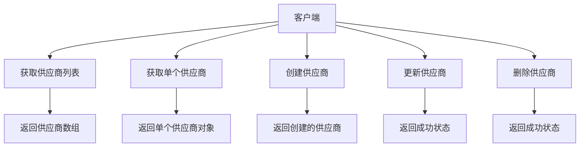
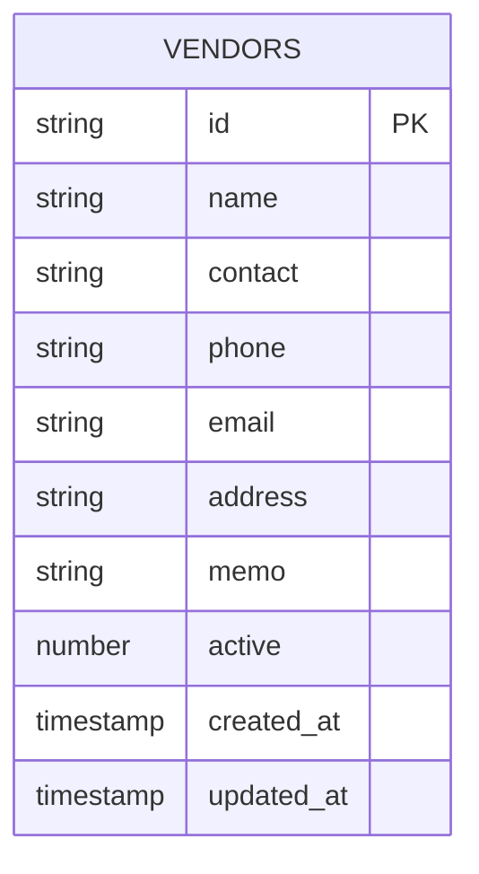
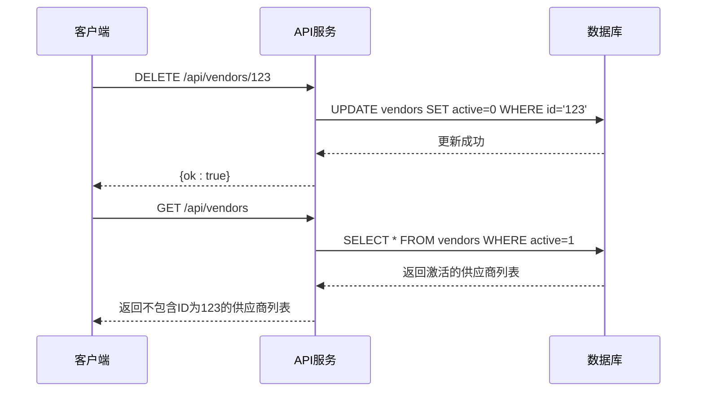
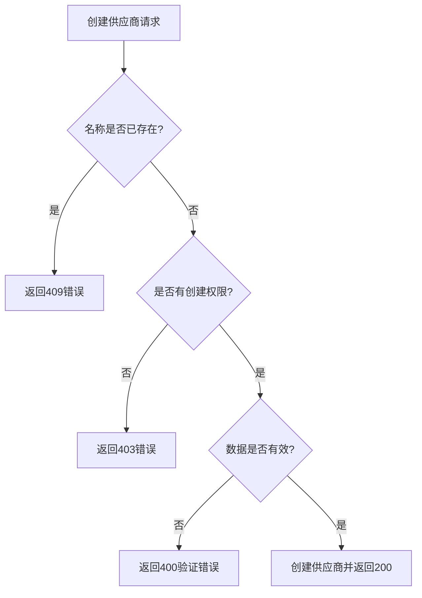
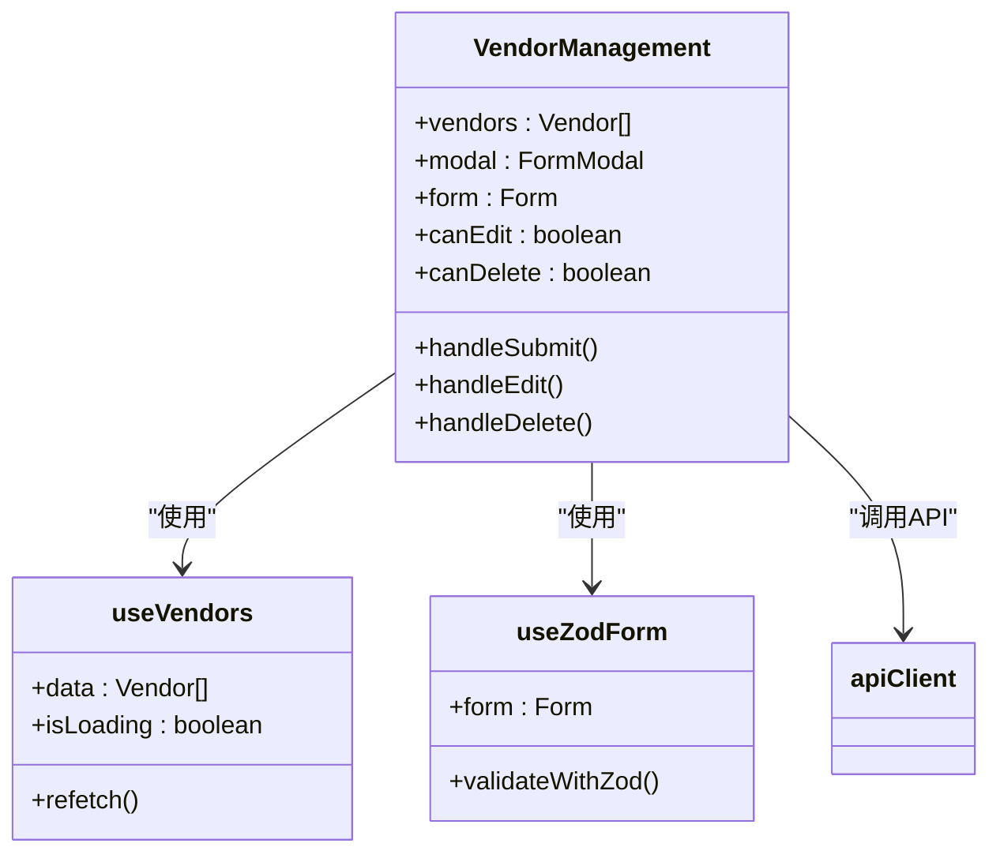

# 供应商管理API

<cite>
**本文档引用的文件**
- [vendors.ts](file://backend/src/routes/master-data/vendors.ts)
- [master-data.schema.ts](file://backend/src/schemas/master-data.schema.ts)
- [MasterDataService.ts](file://backend/src/services/MasterDataService.ts)
- [schema.ts](file://backend/src/db/schema.ts)
- [VendorManagement.tsx](file://frontend/src/features/system/pages/VendorManagement.tsx)
- [useVendors.ts](file://frontend/src/hooks/business/useVendors.ts)
- [vendor.schema.ts](file://frontend/src/validations/vendor.schema.ts)
- [api.ts](file://frontend/src/config/api.ts)
- [errors.ts](file://backend/src/utils/errors.ts)
- [migration_vendors.sql](file://backend/src/db/archive/migration_vendors.sql)
- [domain.ts](file://frontend/src/types/domain.ts)
</cite>

## 目录
1. [简介](#简介)
2. [API端点概览](#api端点概览)
3. [供应商实体结构](#供应商实体结构)
4. [端点详细说明](#端点详细说明)
5. [软删除机制](#软删除机制)
6. [字段用途说明](#字段用途说明)
7. [创建供应商示例](#创建供应商示例)
8. [错误处理](#错误处理)
9. [前端实现](#前端实现)

## 简介
供应商管理API提供了一套完整的供应商管理功能，支持供应商的创建、读取、更新和删除（CRUD）操作。该API设计用于企业财务管理系统，允许用户管理与业务相关的供应商信息。API通过RESTful风格的端点提供服务，支持JSON格式的数据交换。系统实现了软删除机制，确保数据的完整性和可追溯性。

**Section sources**
- [vendors.ts](file://backend/src/routes/master-data/vendors.ts#L1-L237)

## API端点概览
供应商管理API提供以下五个主要端点：

| HTTP方法 | URL路径 | 描述 |
|---------|--------|------|
| GET | /api/vendors | 获取供应商列表 |
| GET | /api/vendors/{id} | 获取单个供应商详情 |
| POST | /api/vendors | 创建新供应商 |
| PUT | /api/vendors/{id} | 更新现有供应商 |
| DELETE | /api/vendors/{id} | 删除供应商（软删除） |

这些端点构成了供应商管理的核心功能，允许系统用户全面管理供应商信息。



**Diagram sources**
- [vendors.ts](file://backend/src/routes/master-data/vendors.ts#L10-L236)

## 供应商实体结构
供应商实体包含以下字段，定义了供应商的基本信息和状态：

| 字段名 | 类型 | 必填 | 描述 | 默认值 |
|-------|------|------|------|-------|
| id | string | 是 | 供应商唯一标识符 | - |
| name | string | 是 | 供应商名称 | - |
| contact | string | 否 | 联系人 | null |
| phone | string | 否 | 电话号码 | null |
| email | string | 否 | 电子邮件 | null |
| address | string | 否 | 地址 | null |
| memo | string | 否 | 备注 | null |
| active | number | 是 | 活动状态（1=启用，0=禁用） | 1 |

供应商的ID使用UUID格式生成，确保全局唯一性。active字段用于实现软删除功能，而不是物理删除记录。



**Diagram sources**
- [schema.ts](file://backend/src/db/schema.ts#L89-L100)
- [master-data.schema.ts](file://backend/src/schemas/master-data.schema.ts#L104-L116)

## 端点详细说明

### 获取供应商列表 (GET /api/vendors)
获取所有供应商的列表。

**请求参数**
- Query参数：
  - activeOnly (string, 可选): 如果为"true"，则只返回激活状态的供应商
  - search (string, 可选): 搜索关键字，用于在供应商名称中进行模糊搜索

**响应格式**
```json
{
  "results": [
    {
      "id": "string",
      "name": "string",
      "contact": "string",
      "phone": "string",
      "email": "string",
      "address": "string",
      "memo": "string",
      "active": 1
    }
  ]
}
```

**Section sources**
- [vendors.ts](file://backend/src/routes/master-data/vendors.ts#L10-L55)

### 获取单个供应商 (GET /api/vendors/{id})
获取指定ID的供应商详情。

**URL参数**
- id (string): 供应商的唯一标识符

**响应格式**
```json
{
  "id": "string",
  "name": "string",
  "contact": "string",
  "phone": "string",
  "email": "string",
  "address": "string",
  "memo": "string",
  "active": 1
}
```

**Section sources**
- [vendors.ts](file://backend/src/routes/master-data/vendors.ts#L57-L87)

### 创建供应商 (POST /api/vendors)
创建一个新的供应商。

**请求体结构**
```json
{
  "name": "string",
  "contact": "string",
  "phone": "string",
  "email": "string",
  "address": "string",
  "memo": "string"
}
```

**响应格式**
```json
{
  "id": "string",
  "name": "string",
  "contact": "string",
  "phone": "string",
  "email": "string",
  "address": "string",
  "memo": "string",
  "active": 1
}
```

**Section sources**
- [vendors.ts](file://backend/src/routes/master-data/vendors.ts#L89-L133)

### 更新供应商 (PUT /api/vendors/{id})
更新现有供应商的信息。

**URL参数**
- id (string): 供应商的唯一标识符

**请求体结构**
```json
{
  "name": "string",
  "contact": "string",
  "phone": "string",
  "email": "string",
  "address": "string",
  "memo": "string"
}
```

**响应格式**
```json
{
  "ok": true
}
```

**Section sources**
- [vendors.ts](file://backend/src/routes/master-data/vendors.ts#L135-L204)

### 删除供应商 (DELETE /api/vendors/{id})
删除指定的供应商（实际上是软删除）。

**URL参数**
- id (string): 供应商的唯一标识符

**响应格式**
```json
{
  "ok": true
}
```

**Section sources**
- [vendors.ts](file://backend/src/routes/master-data/vendors.ts#L206-L236)

## 软删除机制
供应商的删除操作采用软删除机制，而不是物理删除数据库记录。当执行DELETE请求时，系统不会从数据库中移除供应商记录，而是将供应商的active字段值更新为0。

这种设计有以下几个优点：
1. **数据完整性**：保留了与该供应商相关的所有历史交易记录的完整性
2. **可恢复性**：如果误删供应商，可以通过更新active字段值恢复
3. **审计追踪**：保留了删除操作的审计日志，便于追踪
4. **关联数据保护**：避免了因级联删除导致的关联数据丢失

在数据库层面，getVendors方法默认只返回active=1的供应商，从而在应用层面实现了"删除"的效果，但实际上数据仍然保留在数据库中。



**Diagram sources**
- [MasterDataService.ts](file://backend/src/services/MasterDataService.ts#L326-L332)
- [vendors.ts](file://backend/src/routes/master-data/vendors.ts#L226-L236)

## 字段用途说明
供应商信息包含多个字段，每个字段都有特定的用途：

- **name**: 供应商的正式名称，是必填字段，用于标识供应商身份
- **contact**: 供应商的主要联系人姓名，便于业务沟通
- **phone**: 供应商的联系电话，用于紧急情况下的联系
- **email**: 供应商的电子邮件地址，用于正式通信和账单发送
- **address**: 供应商的办公地址或注册地址，用于合同和法律文件
- **memo**: 备注字段，用于记录与供应商相关的特殊信息或注意事项
- **active**: 状态标志位，1表示供应商处于激活状态，0表示已禁用或"删除"

这些字段共同构成了供应商的完整信息档案，支持企业与供应商之间的各种业务往来。

**Section sources**
- [master-data.schema.ts](file://backend/src/schemas/master-data.schema.ts#L104-L116)
- [schema.ts](file://backend/src/db/schema.ts#L89-L100)

## 创建供应商示例
以下是一个创建供应商的JSON示例：

```json
{
  "name": "ABC科技有限公司",
  "contact": "张三",
  "phone": "13800138000",
  "email": "zhangsan@abctech.com",
  "address": "北京市朝阳区某某大厦1001室",
  "memo": "主要供应电子元器件，月结30天"
}
```

成功创建后，API将返回包含ID和active字段的完整供应商对象：

```json
{
  "id": "a1b2c3d4-e5f6-7890-g1h2-i3j4k5l6m7n8",
  "name": "ABC科技有限公司",
  "contact": "张三",
  "phone": "13800138000",
  "email": "zhangsan@abctech.com",
  "address": "北京市朝阳区某某大厦1001室",
  "memo": "主要供应电子元器件，月结30天",
  "active": 1
}
```

**Section sources**
- [vendors.ts](file://backend/src/routes/master-data/vendors.ts#L114-L133)
- [MasterDataService.ts](file://backend/src/services/MasterDataService.ts#L291-L307)

## 错误处理
API实现了完善的错误处理机制，针对不同场景返回相应的错误信息。

### 供应商名称重复
当尝试创建名称已存在的供应商时，系统会返回409冲突错误：

```json
{
  "error": "供应商名称已存在",
  "code": "DUPLICATE"
}
```

前端通过handleConflictError函数处理此类错误，向用户显示友好的错误提示。

### 权限不足
对于没有相应权限的用户尝试执行操作时，系统返回403禁止访问错误：

```json
{
  "error": "权限不足",
  "code": "FORBIDDEN"
}
```

### 验证失败
当请求数据不符合验证规则时，系统返回400验证错误，包含详细的验证失败信息。



**Diagram sources**
- [errors.ts](file://backend/src/utils/errors.ts#L34-L54)
- [vendors.ts](file://backend/src/routes/master-data/vendors.ts#L115-L116)

## 前端实现
前端通过VendorManagement组件实现供应商管理界面，使用Ant Design组件库构建用户界面。

主要功能包括：
- 供应商列表展示
- 新建供应商表单
- 编辑供应商功能
- 单个和批量删除供应商
- 实时搜索和过滤

前端通过useVendors钩子函数管理供应商数据的获取和缓存，使用useZodForm进行表单验证。所有API调用都通过apiClient封装，确保一致的错误处理和认证机制。



**Diagram sources**
- [VendorManagement.tsx](file://frontend/src/features/system/pages/VendorManagement.tsx#L1-L167)
- [useVendors.ts](file://frontend/src/hooks/business/useVendors.ts#L1-L68)