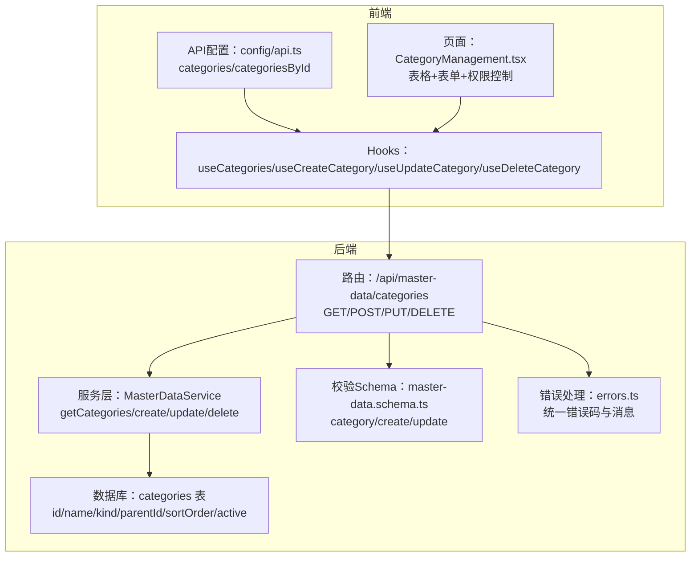
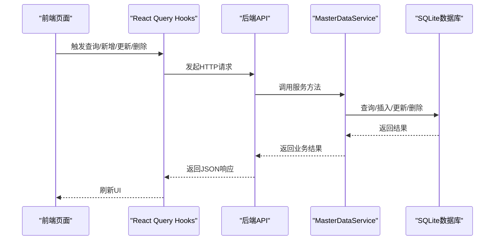
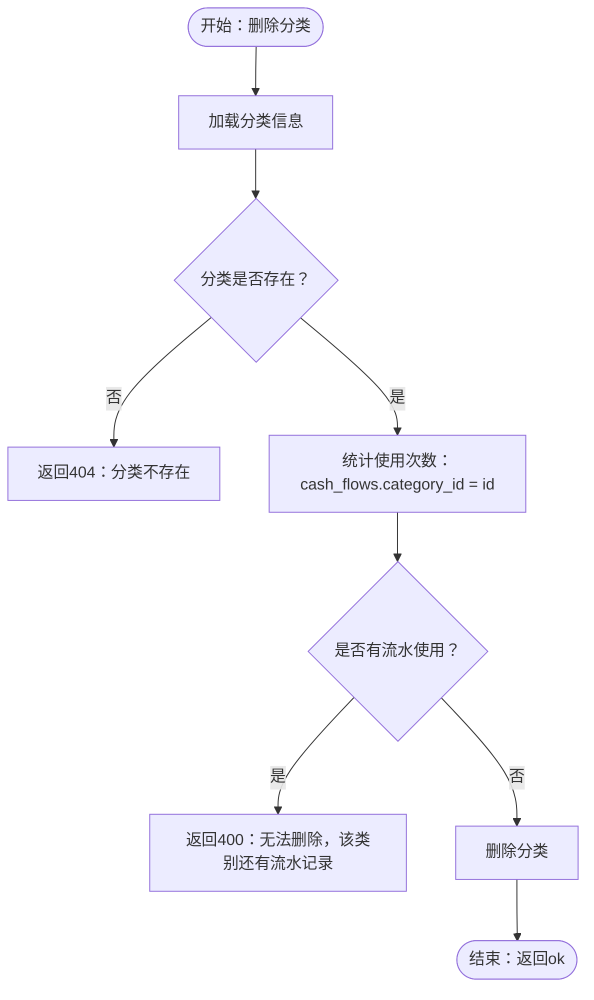
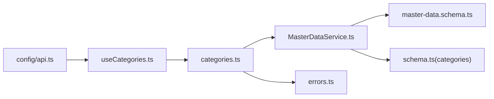

# 分类管理API

<cite>
**本文引用的文件**
- [backend/src/routes/master-data/categories.ts](file://backend/src/routes/master-data/categories.ts)
- [backend/src/services/MasterDataService.ts](file://backend/src/services/MasterDataService.ts)
- [backend/src/db/schema.ts](file://backend/src/db/schema.ts)
- [backend/src/schemas/master-data.schema.ts](file://backend/src/schemas/master-data.schema.ts)
- [backend/src/routes/master-data.ts](file://backend/src/routes/master-data.ts)
- [backend/src/index.ts](file://backend/src/index.ts)
- [frontend/src/config/api.ts](file://frontend/src/config/api.ts)
- [frontend/src/hooks/business/useCategories.ts](file://frontend/src/hooks/business/useCategories.ts)
- [frontend/src/features/system/pages/CategoryManagement.tsx](file://frontend/src/features/system/pages/CategoryManagement.tsx)
- [frontend/src/validations/category.schema.ts](file://frontend/src/validations/category.schema.ts)
- [backend/src/utils/errors.ts](file://backend/src/utils/errors.ts)
- [backend/scripts/export-openapi.ts](file://backend/scripts/export-openapi.ts)
</cite>

## 目录
1. [简介](#简介)
2. [项目结构](#项目结构)
3. [核心组件](#核心组件)
4. [架构总览](#架构总览)
5. [详细组件分析](#详细组件分析)
6. [依赖关系分析](#依赖关系分析)
7. [性能考量](#性能考量)
8. [故障排查指南](#故障排查指南)
9. [结论](#结论)
10. [附录](#附录)

## 简介
本文件面向“分类管理API”的使用者与维护者，系统性说明分类实体的CRUD能力，覆盖以下端点：
- 获取分类列表：GET /api/categories
- 创建分类：POST /api/categories
- 更新分类：PUT /api/categories/{id}
- 删除分类：DELETE /api/categories/{id}

重点解释：
- kind 字段用于区分业务场景（例如“收入”、“支出”），便于财务流水与报表的分类归集。
- parentId 字段实现分类层级结构，支持父子关系的树形展示与过滤。
- 删除分类的完整性约束：若该分类已被财务流水使用，则禁止删除，并返回业务错误提示。

此外，文档提供分类树形结构的JSON示例与常见使用场景，帮助快速理解与集成。

## 项目结构
分类API位于后端路由与服务层，前端通过React Query Hook进行调用；OpenAPI文档由后端自动生成并导出。



图表来源
- [backend/src/routes/master-data/categories.ts](file://backend/src/routes/master-data/categories.ts#L1-L155)
- [backend/src/services/MasterDataService.ts](file://backend/src/services/MasterDataService.ts#L415-L464)
- [backend/src/db/schema.ts](file://backend/src/db/schema.ts#L303-L310)
- [backend/src/schemas/master-data.schema.ts](file://backend/src/schemas/master-data.schema.ts#L70-L87)
- [backend/src/utils/errors.ts](file://backend/src/utils/errors.ts#L34-L54)
- [frontend/src/config/api.ts](file://frontend/src/config/api.ts#L48-L51)
- [frontend/src/hooks/business/useCategories.ts](file://frontend/src/hooks/business/useCategories.ts#L1-L90)
- [frontend/src/features/system/pages/CategoryManagement.tsx](file://frontend/src/features/system/pages/CategoryManagement.tsx#L1-L141)

章节来源
- [backend/src/routes/master-data.ts](file://backend/src/routes/master-data.ts#L1-L23)
- [backend/src/index.ts](file://backend/src/index.ts#L95-L121)

## 核心组件
- 路由层：定义四个端点，分别对应列表查询、创建、更新、删除；对请求体进行OpenAPI Schema校验，并记录审计日志。
- 服务层：实现分类的增删改查逻辑，包含重复名校验、业务完整性检查（删除前检查是否被流水使用）。
- 数据库：categories 表包含 id、name、kind、parentId、sortOrder、active 等字段。
- 前端：通过API配置与React Query Hooks发起请求，页面负责渲染与交互。

章节来源
- [backend/src/routes/master-data/categories.ts](file://backend/src/routes/master-data/categories.ts#L1-L155)
- [backend/src/services/MasterDataService.ts](file://backend/src/services/MasterDataService.ts#L415-L464)
- [backend/src/db/schema.ts](file://backend/src/db/schema.ts#L303-L310)
- [frontend/src/config/api.ts](file://frontend/src/config/api.ts#L48-L51)
- [frontend/src/hooks/business/useCategories.ts](file://frontend/src/hooks/business/useCategories.ts#L1-L90)

## 架构总览
后端采用OpenAPIHono框架，路由挂载于 /api/master-data/categories，服务层通过Drizzle ORM访问SQLite。前端通过配置好的API路径调用后端接口。



图表来源
- [backend/src/routes/master-data/categories.ts](file://backend/src/routes/master-data/categories.ts#L28-L155)
- [backend/src/services/MasterDataService.ts](file://backend/src/services/MasterDataService.ts#L415-L464)
- [frontend/src/hooks/business/useCategories.ts](file://frontend/src/hooks/business/useCategories.ts#L1-L90)
- [frontend/src/config/api.ts](file://frontend/src/config/api.ts#L48-L51)

## 详细组件分析

### 端点定义与行为
- GET /api/categories
  - 功能：获取全部分类列表，按 kind 与 name 排序。
  - 响应：包含 results 数组，元素为分类对象。
  - 权限：无显式权限校验（路由层未做权限拦截）。
  - 前端使用：useCategories Hook 支持按 kind 过滤，返回扁平列表或选项格式。

- POST /api/categories
  - 功能：创建新分类。
  - 请求体：name、kind、parentId（可选）。
  - 响应：返回创建后的分类对象（含 id、name、kind、parentId、active）。
  - 校验：后端使用 createCategorySchema；前端使用 category.schema.ts。
  - 权限：需要 system.category.create 权限。

- PUT /api/categories/{id}
  - 功能：更新分类名称与 kind。
  - 请求体：name（可选）、kind（可选，仅允许 'income' 或 'expense'）。
  - 响应：返回 { ok: true }。
  - 权限：需要 system.category.update 权限。

- DELETE /api/categories/{id}
  - 功能：删除分类。
  - 响应：返回 { ok: true }。
  - 业务约束：若该分类已被财务流水使用（cash_flows.category_id 关联），则拒绝删除并返回业务错误。
  - 权限：需要 system.category.delete 权限。

章节来源
- [backend/src/routes/master-data/categories.ts](file://backend/src/routes/master-data/categories.ts#L10-L155)
- [backend/src/schemas/master-data.schema.ts](file://backend/src/schemas/master-data.schema.ts#L70-L87)
- [frontend/src/validations/category.schema.ts](file://frontend/src/validations/category.schema.ts#L1-L9)
- [frontend/src/hooks/business/useCategories.ts](file://frontend/src/hooks/business/useCategories.ts#L1-L90)

### 数据模型与字段说明
- 分类实体（categories 表）
  - id：主键
  - name：分类名称（唯一性约束）
  - kind：业务类型，取值建议为 'income' 或 'expense'
  - parentId：父分类ID，形成层级结构
  - sortOrder：排序字段（服务层未强制使用）
  - active：启用状态

- 关联关系
  - cash_flows.category_id 外键关联 categories.id，用于删除前的完整性检查。

章节来源
- [backend/src/db/schema.ts](file://backend/src/db/schema.ts#L303-L310)
- [backend/src/services/MasterDataService.ts](file://backend/src/services/MasterDataService.ts#L455-L464)

### 删除分类的完整性检查流程


图表来源
- [backend/src/services/MasterDataService.ts](file://backend/src/services/MasterDataService.ts#L455-L464)
- [backend/src/utils/errors.ts](file://backend/src/utils/errors.ts#L34-L54)

### 前端调用与页面交互
- API路径
  - GET /api/categories
  - POST /api/categories
  - PUT /api/categories/{id}
  - DELETE /api/categories/{id}

- Hooks
  - useCategories：查询列表，支持按 kind 过滤
  - useCreateCategory/useUpdateCategory/useDeleteCategory：Mutation 封装，成功后刷新缓存

- 页面
  - CategoryManagement.tsx 提供新建/编辑弹窗、表格展示、权限控制与冲突错误提示

章节来源
- [frontend/src/config/api.ts](file://frontend/src/config/api.ts#L48-L51)
- [frontend/src/hooks/business/useCategories.ts](file://frontend/src/hooks/business/useCategories.ts#L1-L90)
- [frontend/src/features/system/pages/CategoryManagement.tsx](file://frontend/src/features/system/pages/CategoryManagement.tsx#L1-L141)

## 依赖关系分析
- 路由到服务
  - categoriesRoutes 调用 MasterDataService 的 getCategories/createCategory/updateCategory/deleteCategory 方法。
- 服务到数据库
  - 使用 Drizzle ORM 对 categories 表执行 CRUD 操作。
- 服务到错误处理
  - 使用统一错误工具抛出业务错误与通用错误。
- 前端到路由
  - 通过 config/api.ts 中的 categories 与 categoriesById 路径调用后端。



图表来源
- [backend/src/routes/master-data/categories.ts](file://backend/src/routes/master-data/categories.ts#L28-L155)
- [backend/src/services/MasterDataService.ts](file://backend/src/services/MasterDataService.ts#L415-L464)
- [backend/src/schemas/master-data.schema.ts](file://backend/src/schemas/master-data.schema.ts#L70-L87)
- [backend/src/db/schema.ts](file://backend/src/db/schema.ts#L303-L310)
- [backend/src/utils/errors.ts](file://backend/src/utils/errors.ts#L34-L54)
- [frontend/src/config/api.ts](file://frontend/src/config/api.ts#L48-L51)
- [frontend/src/hooks/business/useCategories.ts](file://frontend/src/hooks/business/useCategories.ts#L1-L90)

## 性能考量
- 列表查询按 kind 与 name 排序，数据库侧已建立索引，适合高频查询。
- 删除前的完整性检查使用 COUNT 查询，复杂度 O(n)（n为流水数量），建议在数据量较大时配合分页与缓存策略。
- 前端使用 React Query 缓存，避免重复请求。

[本节为通用指导，无需列出章节来源]

## 故障排查指南
- 409 冲突：创建/更新时名称重复
  - 现象：返回 DUPLICATE 错误
  - 处理：修改名称后重试

- 404 未找到：分类不存在
  - 现象：返回 NOT_FOUND 错误
  - 处理：确认分类ID是否正确

- 400 业务错误：无法删除，该类别还有流水记录
  - 现象：返回 BUSINESS_ERROR
  - 处理：先清理或迁移使用该分类的流水，再删除

- 403 权限不足：缺少 system.category.create/update/delete 权限
  - 现象：返回 FORBIDDEN
  - 处理：联系管理员授予相应权限

- 400 验证错误：请求体不符合 Schema
  - 现象：返回 VALIDATION_ERROR
  - 处理：根据错误详情修正字段（如 name 非空、kind 合法）

章节来源
- [backend/src/services/MasterDataService.ts](file://backend/src/services/MasterDataService.ts#L415-L464)
- [backend/src/utils/errors.ts](file://backend/src/utils/errors.ts#L34-L54)
- [backend/src/routes/master-data/categories.ts](file://backend/src/routes/master-data/categories.ts#L60-L155)

## 结论
分类管理API提供了完整的CRUD能力，结合 kind 与 parentId 实现了灵活的业务分类体系。删除分类的完整性检查有效保护了数据一致性。前后端分离的设计使API易于扩展与维护，同时通过OpenAPI文档与前端Hooks提升了开发效率与用户体验。

[本节为总结，无需列出章节来源]

## 附录

### API定义与示例

- GET /api/categories
  - 请求：无
  - 响应：{
      "results": [
        {
          "id": "字符串",
          "name": "字符串",
          "kind": "income|expense",
          "parentId": "字符串|null",
          "sortOrder": 整数|null,
          "active": 0|1|null
        }
      ]
    }

- POST /api/categories
  - 请求体：{
      "name": "字符串",
      "kind": "income|expense",
      "parentId": "字符串|null"
    }
  - 响应：{
      "id": "字符串",
      "name": "字符串",
      "kind": "income|expense",
      "parentId": "字符串|null",
      "active": 1
    }

- PUT /api/categories/{id}
  - 请求体：{
      "name": "字符串|可选",
      "kind": "income|expense|可选"
    }
  - 响应：{ "ok": true }

- DELETE /api/categories/{id}
  - 请求：无
  - 响应：{ "ok": true }

- 删除失败示例（业务错误）
  - 响应：{
      "error": "无法删除，该类别还有流水记录",
      "code": "BUSINESS_ERROR"
    }

章节来源
- [backend/src/routes/master-data/categories.ts](file://backend/src/routes/master-data/categories.ts#L10-L155)
- [backend/src/services/MasterDataService.ts](file://backend/src/services/MasterDataService.ts#L415-L464)
- [backend/src/utils/errors.ts](file://backend/src/utils/errors.ts#L34-L54)

### 分类树形结构JSON示例
说明：parentId 为空表示根节点；kind 用于区分“收入/支出”。实际字段以后端返回为准。

```json
[
  {
    "id": "根分类A",
    "name": "收入类目",
    "kind": "income",
    "parentId": null,
    "children": [
      {
        "id": "子分类A1",
        "name": "销售回款",
        "kind": "income",
        "parentId": "根分类A"
      }
    ]
  },
  {
    "id": "根分类B",
    "name": "支出类目",
    "kind": "expense",
    "parentId": null,
    "children": [
      {
        "id": "子分类B1",
        "name": "办公费用",
        "kind": "expense",
        "parentId": "根分类B"
      }
    ]
  }
]
```

[本节为概念性示例，无需列出章节来源]

### 常见使用场景
- 收入/支出分类管理
  - 为“收入”与“支出”分别建立根节点，再按业务细分子类。
- 流水记账
  - 在创建现金流时选择对应分类，kind 与流水类型保持一致，便于报表统计。
- 报表与筛选
  - 前端可通过 useCategories(kind) 获取指定类型的分类列表，用于下拉筛选。

[本节为通用指导，无需列出章节来源]

### OpenAPI文档导出
- 后端提供 OpenAPI 文档导出脚本，可生成 openapi.json 供团队共享与集成测试。

章节来源
- [backend/scripts/export-openapi.ts](file://backend/scripts/export-openapi.ts#L1-L16)