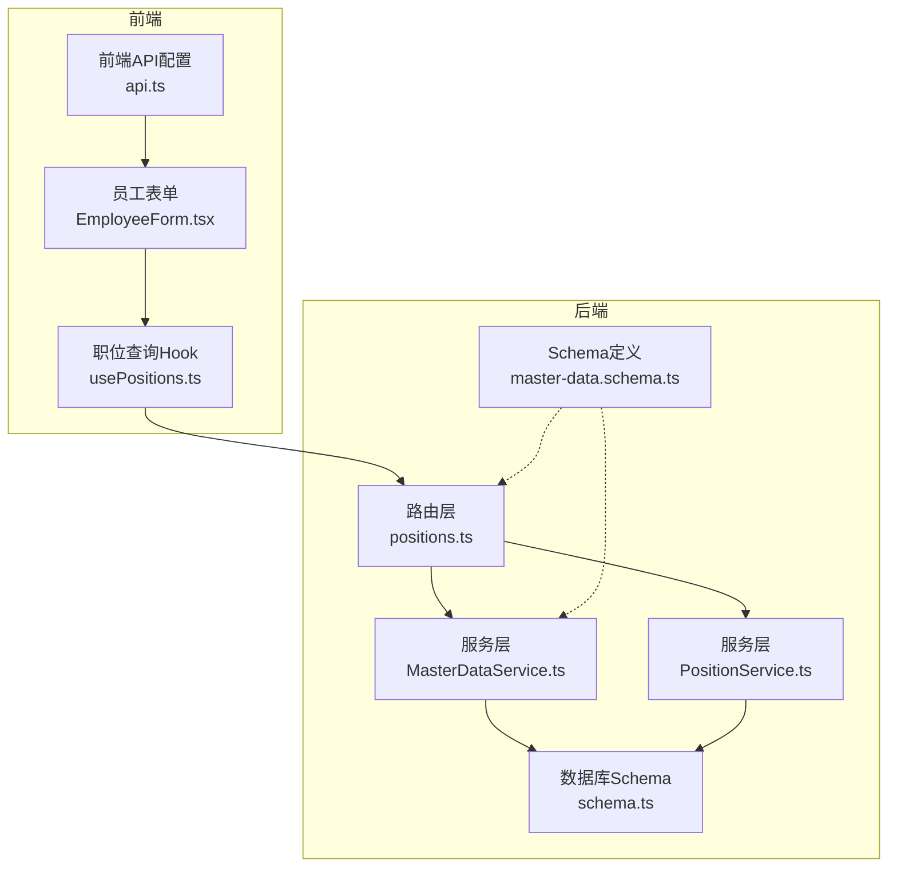
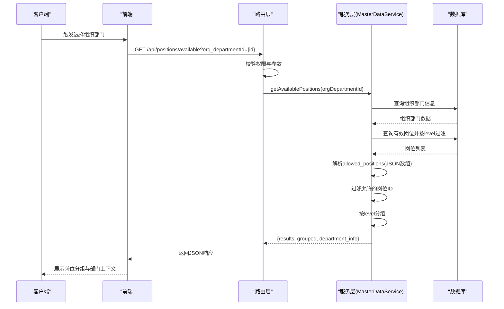
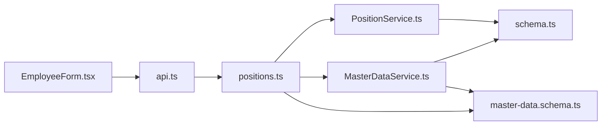

# 岗位管理API

<cite>
**本文引用的文件**
- [backend/src/routes/master-data/positions.ts](file://backend/src/routes/master-data/positions.ts)
- [backend/src/services/MasterDataService.ts](file://backend/src/services/MasterDataService.ts)
- [backend/src/services/PositionService.ts](file://backend/src/services/PositionService.ts)
- [backend/src/schemas/master-data.schema.ts](file://backend/src/schemas/master-data.schema.ts)
- [backend/src/db/schema.ts](file://backend/src/db/schema.ts)
- [backend/openapi.json](file://backend/openapi.json)
- [frontend/src/config/api.ts](file://frontend/src/config/api.ts)
- [frontend/src/features/employees/components/forms/EmployeeForm.tsx](file://frontend/src/features/employees/components/forms/EmployeeForm.tsx)
- [frontend/src/hooks/business/usePositions.ts](file://frontend/src/hooks/business/usePositions.ts)
- [frontend/src/types/domain.ts](file://frontend/src/types/domain.ts)
</cite>

## 目录
1. [简介](#简介)
2. [项目结构](#项目结构)
3. [核心组件](#核心组件)
4. [架构总览](#架构总览)
5. [详细组件分析](#详细组件分析)
6. [依赖关系分析](#依赖关系分析)
7. [性能考量](#性能考量)
8. [故障排查指南](#故障排查指南)
9. [结论](#结论)
10. [附录](#附录)

## 简介
本文件面向岗位管理API的使用者与维护者，系统化说明以下两个端点：
- 获取所有有效岗位：GET /api/positions
- 根据组织部门获取可用岗位：GET /api/positions/available/{orgDepartmentId}

重点解释岗位层级(level)概念：总部职位(level=1)、项目职位(level=2)、组级职位(level=3)，并说明如何依据组织部门类型进行过滤；同时详解allowed_positions字段的JSON数组配置如何限制特定部门可分配的岗位。最后提供响应数据结构示例，包括岗位分组信息与部门上下文信息。

## 项目结构
岗位管理API位于后端路由层与服务层之间，采用OpenAPI路由定义与Drizzle ORM访问SQLite数据库。前端通过统一API配置调用后端接口，并在员工表单中按组织部门动态拉取可用岗位。

图表来源
- [backend/src/routes/master-data/positions.ts](file://backend/src/routes/master-data/positions.ts#L1-L64)
- [backend/src/services/MasterDataService.ts](file://backend/src/services/MasterDataService.ts#L466-L544)
- [backend/src/services/PositionService.ts](file://backend/src/services/PositionService.ts#L1-L36)
- [backend/src/schemas/master-data.schema.ts](file://backend/src/schemas/master-data.schema.ts#L139-L182)
- [backend/src/db/schema.ts](file://backend/src/db/schema.ts#L58-L116)
- [frontend/src/config/api.ts](file://frontend/src/config/api.ts#L27-L28)
- [frontend/src/features/employees/components/forms/EmployeeForm.tsx](file://frontend/src/features/employees/components/forms/EmployeeForm.tsx#L33-L56)
- [frontend/src/hooks/business/usePositions.ts](file://frontend/src/hooks/business/usePositions.ts#L1-L27)

章节来源
- [backend/src/routes/master-data/positions.ts](file://backend/src/routes/master-data/positions.ts#L1-L64)
- [frontend/src/config/api.ts](file://frontend/src/config/api.ts#L27-L28)

## 核心组件
- 路由层：定义两个端点的HTTP方法、请求参数与响应Schema，并进行权限校验与错误处理。
- 服务层：
  - MasterDataService：负责“可用岗位”查询，包含按组织部门类型(level)过滤、allowed_positions限制、按层级分组等逻辑。
  - PositionService：负责“所有有效岗位”的查询与详情读取。
- Schema定义：定义岗位实体、组织部门实体及可用岗位响应结构。
- 数据库Schema：定义positions、org_departments等表结构。

章节来源
- [backend/src/routes/master-data/positions.ts](file://backend/src/routes/master-data/positions.ts#L1-L64)
- [backend/src/services/MasterDataService.ts](file://backend/src/services/MasterDataService.ts#L466-L544)
- [backend/src/services/PositionService.ts](file://backend/src/services/PositionService.ts#L1-L36)
- [backend/src/schemas/master-data.schema.ts](file://backend/src/schemas/master-data.schema.ts#L139-L182)
- [backend/src/db/schema.ts](file://backend/src/db/schema.ts#L58-L116)

## 架构总览
岗位管理API的调用链路如下：

图表来源
- [backend/src/routes/master-data/positions.ts](file://backend/src/routes/master-data/positions.ts#L34-L64)
- [backend/src/services/MasterDataService.ts](file://backend/src/services/MasterDataService.ts#L472-L544)
- [frontend/src/features/employees/components/forms/EmployeeForm.tsx](file://frontend/src/features/employees/components/forms/EmployeeForm.tsx#L33-L56)

## 详细组件分析

### 端点：获取所有有效岗位
- HTTP方法：GET
- URL：/api/positions
- 请求参数：无
- 响应格式：JSON对象，包含results字段，其值为岗位数组。每个岗位对象包含id、code、name、level、functionRole、canManageSubordinates、permissions、sortOrder、active、createdAt、updatedAt等字段。

实现要点
- 路由层对请求进行权限校验，若未通过则返回禁止访问。
- 服务层查询所有active=1的岗位，按sortOrder与name排序。
- 响应Schema定义了岗位结构，包含level范围约束与permissions字段的JSON字符串描述。

章节来源
- [backend/src/routes/master-data/positions.ts](file://backend/src/routes/master-data/positions.ts#L9-L33)
- [backend/src/services/PositionService.ts](file://backend/src/services/PositionService.ts#L14-L24)
- [backend/src/schemas/master-data.schema.ts](file://backend/src/schemas/master-data.schema.ts#L139-L152)

### 端点：根据组织部门获取可用岗位
- HTTP方法：GET
- URL：/api/positions/available
- 查询参数：
  - org_departmentId：组织部门ID（必填）
- 响应格式：JSON对象，包含以下字段：
  - results：岗位数组（已按level、sortOrder、name排序）
  - grouped：按层级分组的岗位映射，键为“总部职位”、“项目职位”、“组级职位”，值为对应岗位数组
  - department_info：部门上下文信息，包含project_id、project_name、department_id、department_name、is_hq

过滤规则与层级说明
- 组织部门类型判断：
  - 若组织部门的projectId为空，则视为总部部门(is_hq=true)，仅返回level=1的岗位
  - 否则视为项目/组级部门，返回level=2或level=3的岗位
- allowed_positions限制：
  - 若组织部门配置了allowed_positions（JSON字符串，解析为岗位ID数组），则仅保留结果集中ID出现在allowedIds中的岗位
- 分组策略：
  - 按level分组，level=1为“总部职位”，level=2为“项目职位”，level=3为“组级职位”

章节来源
- [backend/src/routes/master-data/positions.ts](file://backend/src/routes/master-data/positions.ts#L34-L64)
- [backend/src/services/MasterDataService.ts](file://backend/src/services/MasterDataService.ts#L472-L544)
- [backend/src/schemas/master-data.schema.ts](file://backend/src/schemas/master-data.schema.ts#L171-L182)
- [backend/src/db/schema.ts](file://backend/src/db/schema.ts#L102-L116)

### 岗位层级(level)与allowed_positions字段
- 岗位层级(level)：
  - level=1：总部职位
  - level=2：项目职位
  - level=3：组级职位
- allowed_positions字段：
  - 存储于组织部门表org_departments中，为JSON字符串，表示允许分配给该部门的岗位ID集合
  - 当存在allowed_positions时，服务层会解析该数组并对岗位结果集进行过滤
  - 若解析失败或数组为空，则跳过过滤

章节来源
- [backend/src/schemas/master-data.schema.ts](file://backend/src/schemas/master-data.schema.ts#L157-L169)
- [backend/src/services/MasterDataService.ts](file://backend/src/services/MasterDataService.ts#L506-L516)
- [backend/openapi.json](file://backend/openapi.json#L2264-L2300)

### 响应数据结构示例
- results：岗位数组，每项包含id、code、name、level、functionRole、canManageSubordinates、permissions、sortOrder、active、createdAt、updatedAt
- grouped：按层级分组的对象，如：
  - "总部职位": [岗位A, 岗位B]
  - "项目职位": [岗位C]
  - "组级职位": [岗位D]
- department_info：部门上下文，如：
  - project_id: "hq" 或具体项目ID
  - project_name: "总部" 或项目名称
  - department_id: 组织部门ID
  - department_name: 组织部门名称
  - is_hq: true/false

章节来源
- [backend/src/schemas/master-data.schema.ts](file://backend/src/schemas/master-data.schema.ts#L171-L182)
- [backend/src/services/MasterDataService.ts](file://backend/src/services/MasterDataService.ts#L533-L544)

### 前端集成与使用
- 前端通过统一API配置调用可用岗位端点：
  - GET /api/positions/available?org_departmentId={id}
- 前端在员工表单中根据所选组织部门ID发起请求，并将返回的results与grouped用于界面展示
- 前端Hook与类型定义确保对响应结构的正确处理

章节来源
- [frontend/src/config/api.ts](file://frontend/src/config/api.ts#L27-L28)
- [frontend/src/features/employees/components/forms/EmployeeForm.tsx](file://frontend/src/features/employees/components/forms/EmployeeForm.tsx#L33-L56)
- [frontend/src/hooks/business/usePositions.ts](file://frontend/src/hooks/business/usePositions.ts#L1-L27)
- [frontend/src/types/domain.ts](file://frontend/src/types/domain.ts#L26-L39)

## 依赖关系分析
- 路由层依赖服务层与Schema定义，负责参数校验、权限控制与响应封装
- 服务层依赖数据库Schema，执行查询与过滤逻辑
- 前端依赖API配置与类型定义，完成请求与渲染

图表来源
- [backend/src/routes/master-data/positions.ts](file://backend/src/routes/master-data/positions.ts#L1-L64)
- [backend/src/services/MasterDataService.ts](file://backend/src/services/MasterDataService.ts#L466-L544)
- [backend/src/services/PositionService.ts](file://backend/src/services/PositionService.ts#L1-L36)
- [backend/src/schemas/master-data.schema.ts](file://backend/src/schemas/master-data.schema.ts#L139-L182)
- [backend/src/db/schema.ts](file://backend/src/db/schema.ts#L58-L116)
- [frontend/src/config/api.ts](file://frontend/src/config/api.ts#L27-L28)
- [frontend/src/features/employees/components/forms/EmployeeForm.tsx](file://frontend/src/features/employees/components/forms/EmployeeForm.tsx#L33-L56)

## 性能考量
- 查询优化：
  - 对positions表按level、sortOrder、name排序，减少前端二次排序成本
  - allowed_positions解析与过滤发生在服务层，避免重复网络往返
- 缓存与复用：
  - 前端Hook对职位列表设置缓存时间，降低频繁请求带来的压力
- 建议：
  - 在allowed_positions较大时，考虑在数据库层面建立索引或预处理视图，以提升过滤效率
  - 对高频查询的组织部门ID进行短期缓存，减少跨层调用

[本节为通用建议，无需源码引用]

## 故障排查指南
- 参数缺失：
  - 调用“可用岗位”端点时未传入org_departmentId，将返回参数验证错误
- 权限不足：
  - 路由层在进入业务逻辑前进行权限校验，未通过将返回禁止访问
- 组织部门不存在：
  - 服务层查询组织部门时若不存在，将返回未找到错误
- allowed_positions解析异常：
  - 若allowed_positions不是合法JSON数组，服务层会忽略解析错误并跳过过滤

章节来源
- [backend/src/routes/master-data/positions.ts](file://backend/src/routes/master-data/positions.ts#L55-L64)
- [backend/src/services/MasterDataService.ts](file://backend/src/services/MasterDataService.ts#L472-L488)
- [backend/src/services/MasterDataService.ts](file://backend/src/services/MasterDataService.ts#L506-L516)

## 结论
岗位管理API通过清晰的端点设计与严格的层级过滤机制，实现了总部、项目与组级部门的差异化岗位分配能力。allowed_positions字段提供了灵活的岗位授权控制，结合前端动态请求，能够快速适配不同组织架构下的岗位选择需求。建议在生产环境中配合缓存与索引策略，进一步提升查询性能与用户体验。

[本节为总结性内容，无需源码引用]

## 附录

### API定义与数据模型摘要
- 端点
  - GET /api/positions
    - 请求：无
    - 响应：{ results: 岗位数组 }
  - GET /api/positions/available?org_departmentId={id}
    - 请求：org_departmentId（必填）
    - 响应：{ results, grouped, department_info }
- 岗位实体(Position)
  - 字段：id、code、name、level、functionRole、canManageSubordinates、permissions、sortOrder、active、createdAt、updatedAt
- 组织部门实体(OrgDepartment)
  - 字段：id、projectId、parentId、name、code、description、allowedModules、allowedPositions、defaultPositionId、active、sortOrder
- 可用岗位响应结构
  - results：岗位数组
  - grouped：按层级分组的岗位映射
  - department_info：部门上下文信息

章节来源
- [backend/src/routes/master-data/positions.ts](file://backend/src/routes/master-data/positions.ts#L9-L64)
- [backend/src/schemas/master-data.schema.ts](file://backend/src/schemas/master-data.schema.ts#L139-L182)
- [backend/src/db/schema.ts](file://backend/src/db/schema.ts#L58-L116)