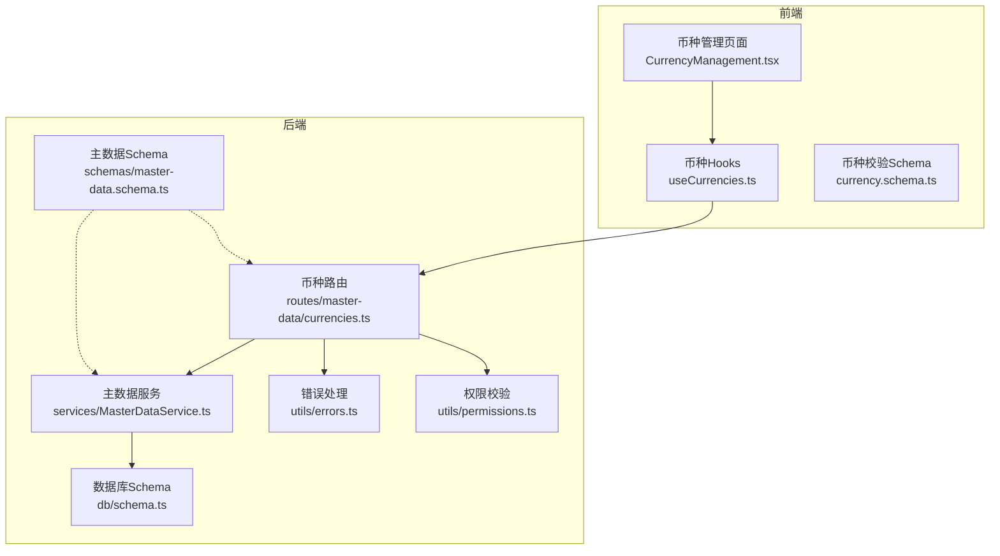
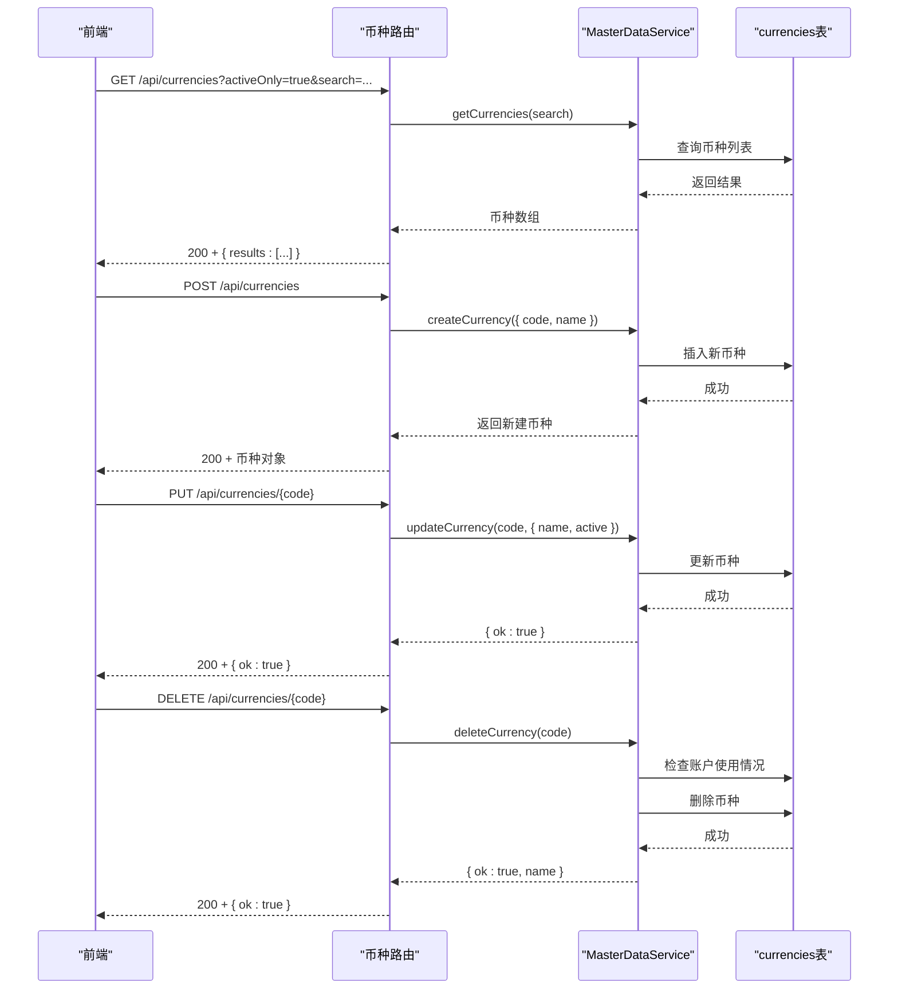
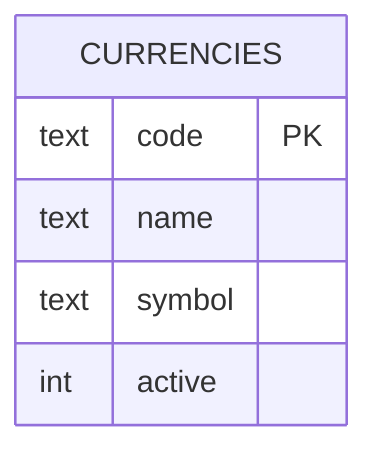
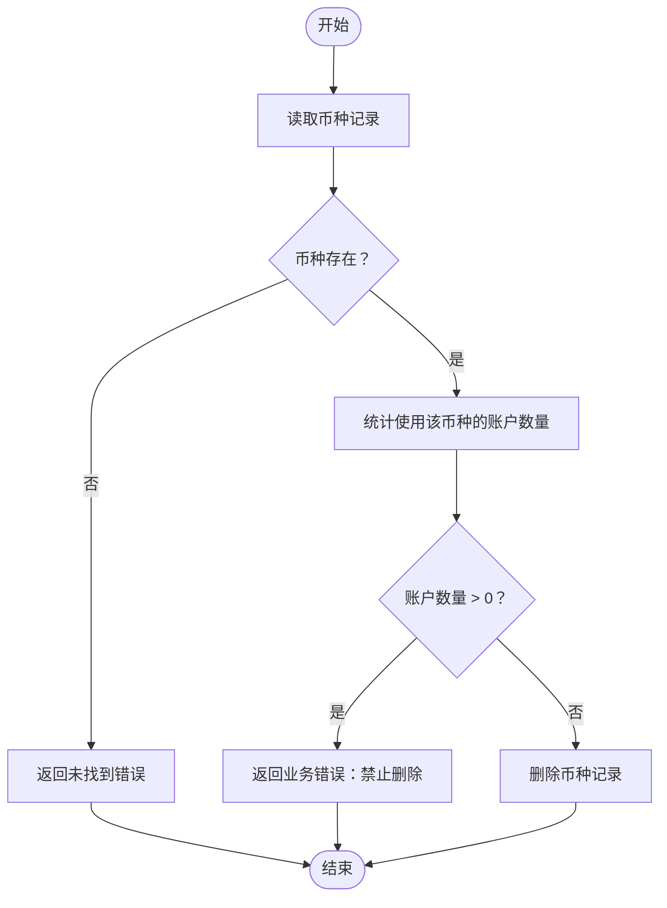
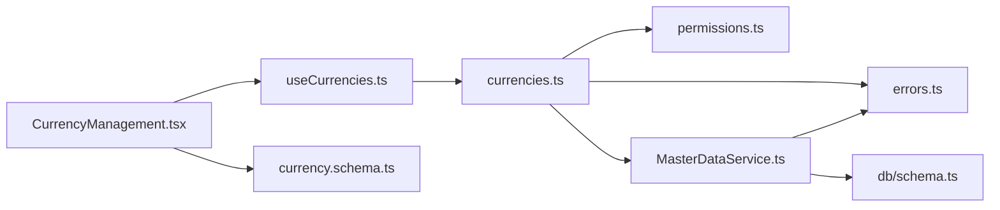

# 币种管理API

<cite>
**本文引用的文件**
- [backend/src/routes/master-data/currencies.ts](file://backend/src/routes/master-data/currencies.ts)
- [backend/src/schemas/master-data.schema.ts](file://backend/src/schemas/master-data.schema.ts)
- [backend/src/services/MasterDataService.ts](file://backend/src/services/MasterDataService.ts)
- [backend/src/db/schema.ts](file://backend/src/db/schema.ts)
- [backend/src/utils/errors.ts](file://backend/src/utils/errors.ts)
- [backend/src/utils/permissions.ts](file://backend/src/utils/permissions.ts)
- [frontend/src/features/system/pages/CurrencyManagement.tsx](file://frontend/src/features/system/pages/CurrencyManagement.tsx)
- [frontend/src/hooks/business/useCurrencies.ts](file://frontend/src/hooks/business/useCurrencies.ts)
- [frontend/src/validations/currency.schema.ts](file://frontend/src/validations/currency.schema.ts)
- [backend/openapi.json](file://backend/openapi.json)
</cite>

## 目录
1. [简介](#简介)
2. [项目结构](#项目结构)
3. [核心组件](#核心组件)
4. [架构总览](#架构总览)
5. [详细组件分析](#详细组件分析)
6. [依赖关系分析](#依赖关系分析)
7. [性能与可用性考虑](#性能与可用性考虑)
8. [故障排查指南](#故障排查指南)
9. [结论](#结论)
10. [附录](#附录)

## 简介
本文件面向币种管理API的使用者与维护者，系统性说明币种实体的CRUD能力与约束规则，重点覆盖：
- 列表查询、创建、更新、删除四个端点的HTTP方法、URL路径、请求体与响应格式
- 币种以“代码（code）”作为唯一标识符的设计理念与实现细节
- 删除币种时的完整性检查策略：当币种仍被账户使用时禁止删除
- 币种的激活状态管理（active）
- 在创建账户时对币种有效性的校验流程
- 标准币种代码的使用建议与示例

## 项目结构
币种管理API位于后端路由层与服务层之间，前端通过React Hook调用API并展示结果。数据库采用SQLite（Drizzle ORM），币种表以code为主键。

图表来源
- [backend/src/routes/master-data/currencies.ts](file://backend/src/routes/master-data/currencies.ts#L1-L165)
- [backend/src/schemas/master-data.schema.ts](file://backend/src/schemas/master-data.schema.ts#L88-L100)
- [backend/src/services/MasterDataService.ts](file://backend/src/services/MasterDataService.ts#L363-L413)
- [backend/src/db/schema.ts](file://backend/src/db/schema.ts#L195-L200)
- [backend/src/utils/errors.ts](file://backend/src/utils/errors.ts#L34-L54)
- [backend/src/utils/permissions.ts](file://backend/src/utils/permissions.ts#L88-L114)
- [frontend/src/features/system/pages/CurrencyManagement.tsx](file://frontend/src/features/system/pages/CurrencyManagement.tsx#L1-L176)
- [frontend/src/hooks/business/useCurrencies.ts](file://frontend/src/hooks/business/useCurrencies.ts#L1-L109)
- [frontend/src/validations/currency.schema.ts](file://frontend/src/validations/currency.schema.ts#L1-L12)

章节来源
- [backend/src/routes/master-data/currencies.ts](file://backend/src/routes/master-data/currencies.ts#L1-L165)
- [backend/src/services/MasterDataService.ts](file://backend/src/services/MasterDataService.ts#L363-L413)
- [backend/src/db/schema.ts](file://backend/src/db/schema.ts#L195-L200)
- [frontend/src/features/system/pages/CurrencyManagement.tsx](file://frontend/src/features/system/pages/CurrencyManagement.tsx#L1-L176)
- [frontend/src/hooks/business/useCurrencies.ts](file://frontend/src/hooks/business/useCurrencies.ts#L1-L109)
- [frontend/src/validations/currency.schema.ts](file://frontend/src/validations/currency.schema.ts#L1-L12)

## 核心组件
- 路由层：定义GET/POST/PUT/DELETE四个端点，负责参数解析、权限校验、审计日志与响应封装
- 服务层：实现币种的增删改查与完整性检查逻辑
- 数据库层：currencies表以code为主键，包含code、name、symbol、active等字段
- Schema层：定义币种请求体与响应体的结构与约束
- 错误与权限：统一错误码与权限校验

章节来源
- [backend/src/routes/master-data/currencies.ts](file://backend/src/routes/master-data/currencies.ts#L10-L164)
- [backend/src/services/MasterDataService.ts](file://backend/src/services/MasterDataService.ts#L363-L413)
- [backend/src/db/schema.ts](file://backend/src/db/schema.ts#L195-L200)
- [backend/src/schemas/master-data.schema.ts](file://backend/src/schemas/master-data.schema.ts#L88-L100)
- [backend/src/utils/errors.ts](file://backend/src/utils/errors.ts#L34-L54)
- [backend/src/utils/permissions.ts](file://backend/src/utils/permissions.ts#L88-L114)

## 架构总览
币种管理API遵循“路由-服务-数据”的分层设计，前端通过React Query Hooks发起请求，后端通过OpenAPI路由定义契约，服务层执行业务逻辑并访问数据库。

图表来源
- [backend/src/routes/master-data/currencies.ts](file://backend/src/routes/master-data/currencies.ts#L10-L164)
- [backend/src/services/MasterDataService.ts](file://backend/src/services/MasterDataService.ts#L365-L413)
- [backend/src/db/schema.ts](file://backend/src/db/schema.ts#L195-L200)

## 详细组件分析

### 端点一览与规范
- 基础路径：/api/currencies
- 支持方法：GET、POST、PUT、DELETE
- 路由与响应契约由OpenAPI路由定义，同时在后端使用Zod Schema进行运行时校验

章节来源
- [backend/src/routes/master-data/currencies.ts](file://backend/src/routes/master-data/currencies.ts#L10-L164)
- [backend/openapi.json](file://backend/openapi.json#L1041-L1417)

#### GET /api/currencies
- 功能：获取币种列表，支持按激活状态与关键词搜索
- 查询参数
  - activeOnly: string，可选；传入"true"仅返回激活的币种
  - search: string，可选；模糊匹配币种代码或名称
- 响应体
  - results: 数组，元素为币种对象
- 后端行为
  - 先从数据库读取全部币种，再在内存中根据activeOnly进行过滤
  - search参数在数据库侧进行大小写无关匹配

章节来源
- [backend/src/routes/master-data/currencies.ts](file://backend/src/routes/master-data/currencies.ts#L10-L45)
- [backend/src/services/MasterDataService.ts](file://backend/src/services/MasterDataService.ts#L365-L375)

#### POST /api/currencies
- 功能：创建新币种
- 请求体
  - code: string，长度3且必须为大写字母
  - name: string，非空
  - symbol: string，可选
- 响应体
  - code: string
  - name: string
  - symbol: string 或 null
  - active: number，默认1（激活）
- 权限要求
  - 需具备系统模块下的currency子模块的create权限
- 业务约束
  - code必须唯一，否则抛出重复错误
  - code在入库前会转换为大写

章节来源
- [backend/src/routes/master-data/currencies.ts](file://backend/src/routes/master-data/currencies.ts#L47-L89)
- [backend/src/schemas/master-data.schema.ts](file://backend/src/schemas/master-data.schema.ts#L88-L100)
- [backend/src/services/MasterDataService.ts](file://backend/src/services/MasterDataService.ts#L377-L389)
- [backend/src/utils/permissions.ts](file://backend/src/utils/permissions.ts#L88-L114)

#### PUT /api/currencies/{code}
- 功能：更新币种信息
- 路径参数
  - code: string，币种代码
- 请求体
  - name: string，可选
  - active: number，可选（0/1）
- 响应体
  - ok: boolean
- 权限要求
  - 需具备系统模块下的currency子模块的update权限
- 业务约束
  - code在更新前会转换为大写
  - 若未提供任何可更新字段，直接返回成功（无变更）

章节来源
- [backend/src/routes/master-data/currencies.ts](file://backend/src/routes/master-data/currencies.ts#L91-L132)
- [backend/src/schemas/master-data.schema.ts](file://backend/src/schemas/master-data.schema.ts#L88-L100)
- [backend/src/services/MasterDataService.ts](file://backend/src/services/MasterDataService.ts#L391-L401)
- [backend/src/utils/permissions.ts](file://backend/src/utils/permissions.ts#L88-L114)

#### DELETE /api/currencies/{code}
- 功能：删除币种
- 路径参数
  - code: string，币种代码
- 响应体
  - ok: boolean
- 权限要求
  - 需具备系统模块下的currency子模块的delete权限
- 完整性检查
  - 若仍有账户使用该币种，则拒绝删除并返回业务错误
  - 删除成功后返回ok: true

章节来源
- [backend/src/routes/master-data/currencies.ts](file://backend/src/routes/master-data/currencies.ts#L134-L164)
- [backend/src/services/MasterDataService.ts](file://backend/src/services/MasterDataService.ts#L403-L413)
- [backend/src/db/schema.ts](file://backend/src/db/schema.ts#L195-L200)

### 币种实体与数据模型
- 数据库表：currencies
  - code: text，主键
  - name: text，非空
  - symbol: text，可选
  - active: integer，默认1
- 前端显示与交互
  - 币种列表页提供“启用/停用”开关与删除按钮
  - 新增/编辑表单使用Zod Schema进行前端校验

图表来源
- [backend/src/db/schema.ts](file://backend/src/db/schema.ts#L195-L200)

章节来源
- [backend/src/db/schema.ts](file://backend/src/db/schema.ts#L195-L200)
- [frontend/src/features/system/pages/CurrencyManagement.tsx](file://frontend/src/features/system/pages/CurrencyManagement.tsx#L1-L176)
- [frontend/src/validations/currency.schema.ts](file://frontend/src/validations/currency.schema.ts#L1-L12)

### 删除币种的完整性检查流程
删除币种时，服务层会先检查是否存在使用该币种的账户，若有则阻止删除并返回业务错误；若无则执行删除。

图表来源
- [backend/src/services/MasterDataService.ts](file://backend/src/services/MasterDataService.ts#L403-L413)

章节来源
- [backend/src/services/MasterDataService.ts](file://backend/src/services/MasterDataService.ts#L403-L413)

### 币种激活状态管理
- active字段用于控制币种是否可用
- 列表查询支持activeOnly参数仅返回激活的币种
- 前端币种管理界面提供“启用/停用”开关，调用PUT更新active

章节来源
- [backend/src/routes/master-data/currencies.ts](file://backend/src/routes/master-data/currencies.ts#L10-L45)
- [backend/src/services/MasterDataService.ts](file://backend/src/services/MasterDataService.ts#L365-L375)
- [frontend/src/features/system/pages/CurrencyManagement.tsx](file://frontend/src/features/system/pages/CurrencyManagement.tsx#L1-L176)

### 在创建账户时验证币种有效性
- 当创建账户时，若未显式提供币种，系统默认使用CNY
- 服务层会查询币种表，要求币种存在且处于激活状态，否则抛出未找到错误
- 这确保了账户引用的币种始终有效

章节来源
- [backend/src/services/MasterDataService.ts](file://backend/src/services/MasterDataService.ts#L220-L243)
- [backend/src/db/schema.ts](file://backend/src/db/schema.ts#L195-L200)

### 标准币种代码使用示例
- 常见标准代码示例：CNY（人民币）、USD（美元）、EUR（欧元）、JPY（日元）、GBP（英镑）、CAD（加拿大元）、AUD（澳大利亚元）、HKD（港币）、SGD（新加坡元）、KRW（韩元）、INR（印度卢比）、THB（泰铢）、VND（越南盾）、IDR（印尼盾）、PHP（菲律宾比索）、MXN（墨西哥比索）、BRL（巴西雷亚尔）、RUB（俄罗斯卢布）、TRY（土耳其里拉）、EGP（埃及镑）、ZAR（南非兰特）
- 使用建议
  - 优先选择ISO 4217标准三字母代码
  - 保持代码大写
  - 在创建币种前先确认是否已存在，避免重复

章节来源
- [backend/src/services/MasterDataService.ts](file://backend/src/services/MasterDataService.ts#L377-L389)
- [frontend/src/validations/currency.schema.ts](file://frontend/src/validations/currency.schema.ts#L1-L12)

## 依赖关系分析
- 路由依赖权限校验与错误处理
- 服务层依赖数据库Schema与错误常量
- 前端依赖API配置与Zod Schema进行表单校验

图表来源
- [backend/src/routes/master-data/currencies.ts](file://backend/src/routes/master-data/currencies.ts#L1-L165)
- [backend/src/utils/permissions.ts](file://backend/src/utils/permissions.ts#L88-L114)
- [backend/src/utils/errors.ts](file://backend/src/utils/errors.ts#L34-L54)
- [backend/src/services/MasterDataService.ts](file://backend/src/services/MasterDataService.ts#L363-L413)
- [backend/src/db/schema.ts](file://backend/src/db/schema.ts#L195-L200)
- [frontend/src/features/system/pages/CurrencyManagement.tsx](file://frontend/src/features/system/pages/CurrencyManagement.tsx#L1-L176)
- [frontend/src/hooks/business/useCurrencies.ts](file://frontend/src/hooks/business/useCurrencies.ts#L1-L109)
- [frontend/src/validations/currency.schema.ts](file://frontend/src/validations/currency.schema.ts#L1-L12)

章节来源
- [backend/src/routes/master-data/currencies.ts](file://backend/src/routes/master-data/currencies.ts#L1-L165)
- [backend/src/services/MasterDataService.ts](file://backend/src/services/MasterDataService.ts#L363-L413)
- [backend/src/db/schema.ts](file://backend/src/db/schema.ts#L195-L200)
- [frontend/src/features/system/pages/CurrencyManagement.tsx](file://frontend/src/features/system/pages/CurrencyManagement.tsx#L1-L176)
- [frontend/src/hooks/business/useCurrencies.ts](file://frontend/src/hooks/business/useCurrencies.ts#L1-L109)
- [frontend/src/validations/currency.schema.ts](file://frontend/src/validations/currency.schema.ts#L1-L12)

## 性能与可用性考虑
- 列表查询支持search参数，但后端会在内存中再次过滤activeOnly，建议在高频场景下结合业务需求评估是否在数据库侧完成过滤
- 删除币种前的完整性检查涉及一次计数查询，通常开销较小；若账户数量巨大，可在数据库层面建立更高效的索引策略
- 前端缓存策略：币种列表与选项使用较长缓存时间，减少重复请求

[本节为通用建议，不直接分析具体文件]

## 故障排查指南
- 400 验证失败
  - 可能原因：请求体字段不符合Schema约束（如code长度、name为空、active值不在0/1范围内）
  - 处理建议：检查前端表单校验与后端Schema定义
- 400 业务错误
  - 可能原因：删除币种时仍有账户使用；创建币种时code重复
  - 处理建议：先清理使用该币种的账户，或更换code
- 403 权限不足
  - 可能原因：当前用户不具备相应模块/子模块/动作的权限
  - 处理建议：检查职位权限配置
- 404 未找到
  - 可能原因：更新或删除时提供的code不存在；创建账户时指定的币种无效
  - 处理建议：确认币种是否已创建且处于激活状态

章节来源
- [backend/src/utils/errors.ts](file://backend/src/utils/errors.ts#L34-L54)
- [backend/src/services/MasterDataService.ts](file://backend/src/services/MasterDataService.ts#L377-L413)
- [backend/src/utils/permissions.ts](file://backend/src/utils/permissions.ts#L88-L114)

## 结论
币种管理API围绕“code作为唯一标识符”的设计，提供了完整的CRUD能力与严格的业务约束。删除币种的完整性检查保障了数据一致性；账户创建时对币种有效性的校验进一步提升了系统的健壮性。配合前端的表单校验与缓存策略，整体体验良好且易于维护。

[本节为总结性内容，不直接分析具体文件]

## 附录

### API端点定义与示例
- GET /api/currencies?activeOnly=true&search=CNY
  - 响应：包含results数组，元素为币种对象
- POST /api/currencies
  - 请求体：{ code, name, symbol? }
  - 响应：币种对象（含code、name、symbol、active）
- PUT /api/currencies/{code}
  - 请求体：{ name?, active? }
  - 响应：{ ok: true }
- DELETE /api/currencies/{code}
  - 响应：{ ok: true }

章节来源
- [backend/src/routes/master-data/currencies.ts](file://backend/src/routes/master-data/currencies.ts#L10-L164)
- [backend/openapi.json](file://backend/openapi.json#L1041-L1417)