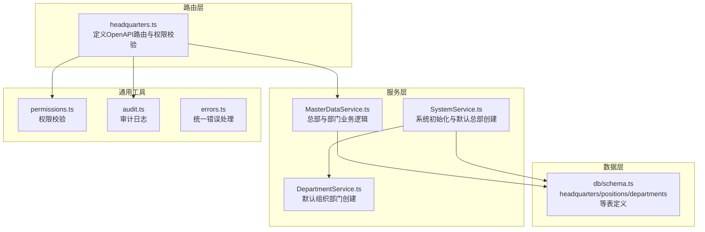
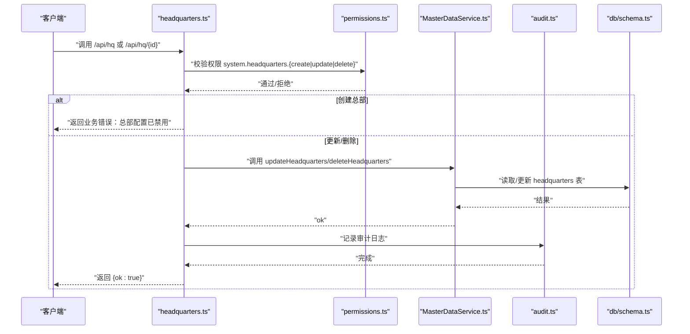
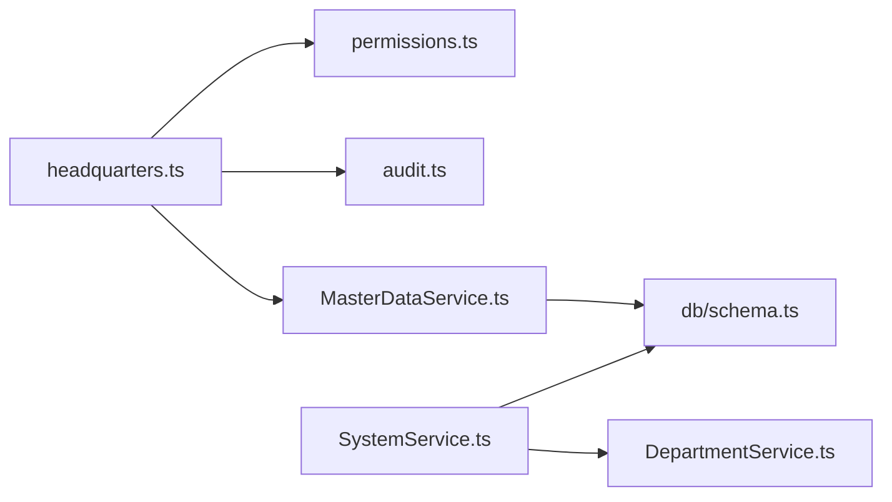
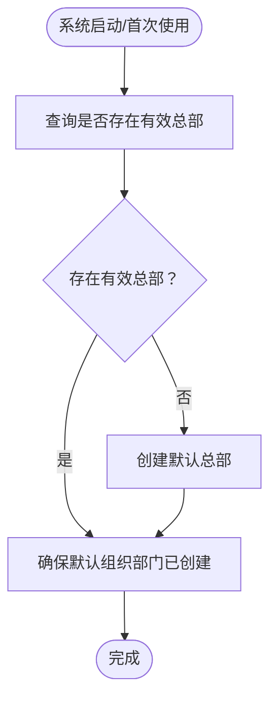

# 总部管理API

<cite>
**本文引用的文件**
- [headquarters.ts](file://backend/src/routes/master-data/headquarters.ts)
- [MasterDataService.ts](file://backend/src/services/MasterDataService.ts)
- [master-data.schema.ts](file://backend/src/schemas/master-data.schema.ts)
- [schema.ts](file://backend/src/db/schema.ts)
- [SystemService.ts](file://backend/src/services/SystemService.ts)
- [DepartmentService.ts](file://backend/src/services/DepartmentService.ts)
- [errors.ts](file://backend/src/utils/errors.ts)
- [permissions.ts](file://backend/src/utils/permissions.ts)
- [audit.ts](file://backend/src/utils/audit.ts)
- [openapi.json](file://backend/openapi.json)
</cite>

## 目录
1. [简介](#简介)
2. [项目结构](#项目结构)
3. [核心组件](#核心组件)
4. [架构总览](#架构总览)
5. [详细组件分析](#详细组件分析)
6. [依赖分析](#依赖分析)
7. [性能考虑](#性能考虑)
8. [故障排查指南](#故障排查指南)
9. [结论](#结论)
10. [附录](#附录)

## 简介
本文件面向总部管理API的使用者与维护者，系统性说明总部实体的CRUD能力与相关业务规则，重点覆盖：
- 获取总部列表（GET /api/hq）
- 创建总部（POST /api/hq）——当前实现为禁用，抛出业务错误
- 更新总部（PUT /api/hq/{id}）——支持重命名与软删除（active=0）
- 删除总部（DELETE /api/hq/{id}）——软删除，将active置为0，并记录审计日志
- 软删除机制与“active”字段语义
- 当系统中无总部时的默认总部自动创建逻辑
- 总部与部门的层级关系，以及创建部门时如何自动关联默认总部
- 请求/响应示例与常见错误处理场景

## 项目结构
总部管理API位于后端路由层与服务层之间，遵循“路由定义 -> 服务调用 -> 数据持久化”的分层设计；同时通过统一的权限校验与审计日志工具保障安全与可追溯性。

图表来源
- [headquarters.ts](file://backend/src/routes/master-data/headquarters.ts#L1-L139)
- [MasterDataService.ts](file://backend/src/services/MasterDataService.ts#L335-L361)
- [SystemService.ts](file://backend/src/services/SystemService.ts#L11-L36)
- [DepartmentService.ts](file://backend/src/services/DepartmentService.ts#L80-L150)
- [schema.ts](file://backend/src/db/schema.ts#L73-L88)
- [permissions.ts](file://backend/src/utils/permissions.ts#L88-L114)
- [audit.ts](file://backend/src/utils/audit.ts#L61-L92)
- [errors.ts](file://backend/src/utils/errors.ts#L34-L54)

章节来源
- [headquarters.ts](file://backend/src/routes/master-data/headquarters.ts#L1-L139)
- [MasterDataService.ts](file://backend/src/services/MasterDataService.ts#L335-L361)
- [SystemService.ts](file://backend/src/services/SystemService.ts#L11-L36)
- [DepartmentService.ts](file://backend/src/services/DepartmentService.ts#L80-L150)
- [schema.ts](file://backend/src/db/schema.ts#L73-L88)

## 核心组件
- 路由模块：定义总部的OpenAPI路由、请求校验、权限校验与审计日志记录。
- 服务模块：封装总部与部门的业务逻辑，包括软删除、默认总部创建、默认组织部门创建。
- 数据层：headquarters表结构与active字段语义。
- 权限与审计：统一的权限校验与审计日志工具。
- 错误处理：统一的错误码与响应结构。

章节来源
- [headquarters.ts](file://backend/src/routes/master-data/headquarters.ts#L1-L139)
- [MasterDataService.ts](file://backend/src/services/MasterDataService.ts#L335-L361)
- [schema.ts](file://backend/src/db/schema.ts#L73-L88)
- [permissions.ts](file://backend/src/utils/permissions.ts#L88-L114)
- [audit.ts](file://backend/src/utils/audit.ts#L61-L92)
- [errors.ts](file://backend/src/utils/errors.ts#L34-L54)

## 架构总览
总部管理API的调用链路如下：

图表来源
- [headquarters.ts](file://backend/src/routes/master-data/headquarters.ts#L30-L139)
- [MasterDataService.ts](file://backend/src/services/MasterDataService.ts#L335-L361)
- [audit.ts](file://backend/src/utils/audit.ts#L61-L92)
- [schema.ts](file://backend/src/db/schema.ts#L73-L88)
- [permissions.ts](file://backend/src/utils/permissions.ts#L88-L114)

## 详细组件分析

### 路由与端点定义
- GET /api/hq
  - 功能：获取总部列表
  - 权限：无需特殊权限（仅校验登录态）
  - 请求体：无
  - 响应：数组，元素为总部对象
  - 参考路径：[headquarters.ts](file://backend/src/routes/master-data/headquarters.ts#L14-L34)

- POST /api/hq
  - 功能：创建总部
  - 权限：无需特殊权限
  - 请求体：总部创建Schema（名称必填，active默认1）
  - 响应：固定结构 { ok: boolean }
  - 实现现状：直接抛出“总部配置已禁用”的业务错误
  - 参考路径：[headquarters.ts](file://backend/src/routes/master-data/headquarters.ts#L36-L63)

- PUT /api/hq/{id}
  - 功能：更新总部（支持改名与软删除）
  - 权限：system.headquarters.update
  - 请求体：总部更新Schema（name可选，active可选）
  - 响应：固定结构 { ok: boolean }
  - 审计：记录更新动作与详情
  - 参考路径：[headquarters.ts](file://backend/src/routes/master-data/headquarters.ts#L65-L106)

- DELETE /api/hq/{id}
  - 功能：删除总部（软删除）
  - 权限：system.headquarters.delete
  - 请求体：无
  - 响应：固定结构 { ok: boolean }
  - 审计：记录删除动作与详情
  - 参考路径：[headquarters.ts](file://backend/src/routes/master-data/headquarters.ts#L108-L139)

章节来源
- [headquarters.ts](file://backend/src/routes/master-data/headquarters.ts#L14-L139)

### 请求/响应与数据模型
- 总部Schema（响应/请求）
  - 字段：id（UUID）、name（字符串，必填）、active（整数0/1，默认1）
  - 参考路径：[master-data.schema.ts](file://backend/src/schemas/master-data.schema.ts#L11-L18)

- OpenAPI导出中的总部字段
  - 字段：id、name、active（默认1）
  - 参考路径：[openapi.json](file://backend/openapi.json#L495-L520)

章节来源
- [master-data.schema.ts](file://backend/src/schemas/master-data.schema.ts#L11-L18)
- [openapi.json](file://backend/openapi.json#L495-L520)

### 业务规则与软删除机制
- active字段语义
  - 1：有效（显示/可用）
  - 0：无效（软删除）
  - 在更新与删除接口中均体现对active字段的处理
  - 参考路径：[MasterDataService.ts](file://backend/src/services/MasterDataService.ts#L341-L361)

- 创建总部被禁用的原因
  - 路由层直接抛出业务错误，提示“总部配置已禁用”
  - 参考路径：[headquarters.ts](file://backend/src/routes/master-data/headquarters.ts#L61-L63)

- 默认总部自动创建逻辑
  - 当系统中不存在有效总部时，系统启动或首次使用时会创建默认总部并生成默认组织部门
  - 参考路径：
    - [SystemService.ts](file://backend/src/services/SystemService.ts#L11-L36)
    - [DepartmentService.ts](file://backend/src/services/DepartmentService.ts#L80-L150)

章节来源
- [MasterDataService.ts](file://backend/src/services/MasterDataService.ts#L341-L361)
- [headquarters.ts](file://backend/src/routes/master-data/headquarters.ts#L61-L63)
- [SystemService.ts](file://backend/src/services/SystemService.ts#L11-L36)
- [DepartmentService.ts](file://backend/src/services/DepartmentService.ts#L80-L150)

### 总部与部门的层级关系
- 表结构关系
  - departments表包含hqId字段，指向headquarters.id
  - 参考路径：[schema.ts](file://backend/src/db/schema.ts#L73-L88)

- 创建部门时自动关联默认总部
  - 若未显式传入hqId，服务层会优先查找现有有效总部，若不存在则创建默认总部并回填hqId
  - 参考路径：[MasterDataService.ts](file://backend/src/services/MasterDataService.ts#L17-L49)

章节来源
- [schema.ts](file://backend/src/db/schema.ts#L73-L88)
- [MasterDataService.ts](file://backend/src/services/MasterDataService.ts#L17-L49)

### 权限与审计
- 权限校验
  - 更新/删除总部需具备 system.headquarters.update 与 system.headquarters.delete 权限
  - 参考路径：[permissions.ts](file://backend/src/utils/permissions.ts#L88-L114)，[headquarters.ts](file://backend/src/routes/master-data/headquarters.ts#L94-L138)

- 审计日志
  - 更新/删除总部后记录审计日志，包含actor、action、entity、entityId、detail、ip、ipLocation等
  - 参考路径：[audit.ts](file://backend/src/utils/audit.ts#L61-L92)，[headquarters.ts](file://backend/src/routes/master-data/headquarters.ts#L104-L137)

章节来源
- [permissions.ts](file://backend/src/utils/permissions.ts#L88-L114)
- [audit.ts](file://backend/src/utils/audit.ts#L61-L92)
- [headquarters.ts](file://backend/src/routes/master-data/headquarters.ts#L94-L138)

### 错误处理
- 统一错误码与响应结构
  - 包含 UNAUTHORIZED、FORBIDDEN、NOT_FOUND、DUPLICATE、VALIDATION_ERROR、BUSINESS_ERROR、INTERNAL_ERROR 等
  - 参考路径：[errors.ts](file://backend/src/utils/errors.ts#L34-L54)

- 典型错误场景
  - 权限不足：返回403，错误码 FORBIDDEN
  - 资源不存在：返回404，错误码 NOT_FOUND
  - 验证失败：返回400，错误码 VALIDATION_ERROR
  - 业务错误（如创建总部被禁用）：返回400，错误码 BUSINESS_ERROR
  - 参考路径：[headquarters.ts](file://backend/src/routes/master-data/headquarters.ts#L61-L63)

章节来源
- [errors.ts](file://backend/src/utils/errors.ts#L34-L54)
- [headquarters.ts](file://backend/src/routes/master-data/headquarters.ts#L61-L63)

## 依赖分析
- 路由层依赖权限校验与审计工具，调用服务层执行业务逻辑
- 服务层依赖数据库Schema进行读写
- 默认总部创建依赖系统服务与部门服务
- OpenAPI导出与Schema保持一致

图表来源
- [headquarters.ts](file://backend/src/routes/master-data/headquarters.ts#L1-L139)
- [MasterDataService.ts](file://backend/src/services/MasterDataService.ts#L335-L361)
- [SystemService.ts](file://backend/src/services/SystemService.ts#L11-L36)
- [DepartmentService.ts](file://backend/src/services/DepartmentService.ts#L80-L150)
- [schema.ts](file://backend/src/db/schema.ts#L73-L88)
- [permissions.ts](file://backend/src/utils/permissions.ts#L88-L114)
- [audit.ts](file://backend/src/utils/audit.ts#L61-L92)

章节来源
- [headquarters.ts](file://backend/src/routes/master-data/headquarters.ts#L1-L139)
- [MasterDataService.ts](file://backend/src/services/MasterDataService.ts#L335-L361)
- [SystemService.ts](file://backend/src/services/SystemService.ts#L11-L36)
- [DepartmentService.ts](file://backend/src/services/DepartmentService.ts#L80-L150)
- [schema.ts](file://backend/src/db/schema.ts#L73-L88)

## 性能考虑
- 查询列表时建议配合分页与筛选参数（如按名称模糊查询），避免一次性返回大量数据
- 审计日志采用异步记录，尽量减少对主流程的影响
- 默认总部创建逻辑仅在首次使用或系统初始化时触发，避免频繁写入

## 故障排查指南
- 403 权限不足
  - 确认当前用户是否具备 system.headquarters.update 或 system.headquarters.delete 权限
  - 参考路径：[permissions.ts](file://backend/src/utils/permissions.ts#L88-L114)

- 404 资源不存在
  - 更新/删除的总部ID不存在
  - 参考路径：[MasterDataService.ts](file://backend/src/services/MasterDataService.ts#L341-L353)

- 400 验证失败
  - 请求体不符合Schema（如名称为空、active值不在0/1范围内）
  - 参考路径：[master-data.schema.ts](file://backend/src/schemas/master-data.schema.ts#L11-L18)

- 400 业务错误：总部配置已禁用
  - 创建总部接口当前被禁用
  - 参考路径：[headquarters.ts](file://backend/src/routes/master-data/headquarters.ts#L61-L63)

- 审计日志缺失
  - 检查审计日志记录是否在异步上下文中执行，确认执行环境支持 waitUntil
  - 参考路径：[audit.ts](file://backend/src/utils/audit.ts#L61-L92)

章节来源
- [permissions.ts](file://backend/src/utils/permissions.ts#L88-L114)
- [MasterDataService.ts](file://backend/src/services/MasterDataService.ts#L341-L353)
- [master-data.schema.ts](file://backend/src/schemas/master-data.schema.ts#L11-L18)
- [headquarters.ts](file://backend/src/routes/master-data/headquarters.ts#L61-L63)
- [audit.ts](file://backend/src/utils/audit.ts#L61-L92)

## 结论
- 总部管理API当前以软删除为核心，active=0即为逻辑删除
- 创建总部接口处于禁用状态，建议通过系统初始化或默认总部创建流程间接实现
- 默认总部与默认组织部门的创建逻辑保证了系统在无总部时的可用性
- 权限与审计贯穿更新/删除流程，确保操作可追溯且受控

## 附录

### 端点一览与示例

- 获取总部列表
  - 方法：GET
  - 路径：/api/hq
  - 示例请求：无
  - 示例响应：数组，元素包含 id、name、active
  - 参考路径：[headquarters.ts](file://backend/src/routes/master-data/headquarters.ts#L14-L34)

- 创建总部
  - 方法：POST
  - 路径：/api/hq
  - 请求体：name（必填）、active（可选，默认1）
  - 响应：{ ok: true }
  - 实际行为：返回业务错误“总部配置已禁用”
  - 参考路径：[headquarters.ts](file://backend/src/routes/master-data/headquarters.ts#L61-L63)

- 更新总部
  - 方法：PUT
  - 路径：/api/hq/{id}
  - 权限：system.headquarters.update
  - 请求体：name（可选）、active（可选）
  - 响应：{ ok: true }
  - 审计：记录更新动作
  - 参考路径：[headquarters.ts](file://backend/src/routes/master-data/headquarters.ts#L94-L106)

- 删除总部
  - 方法：DELETE
  - 路径：/api/hq/{id}
  - 权限：system.headquarters.delete
  - 响应：{ ok: true }
  - 审计：记录删除动作
  - 参考路径：[headquarters.ts](file://backend/src/routes/master-data/headquarters.ts#L129-L139)

### 默认总部与部门创建流程

图表来源
- [SystemService.ts](file://backend/src/services/SystemService.ts#L11-L36)
- [DepartmentService.ts](file://backend/src/services/DepartmentService.ts#L80-L150)