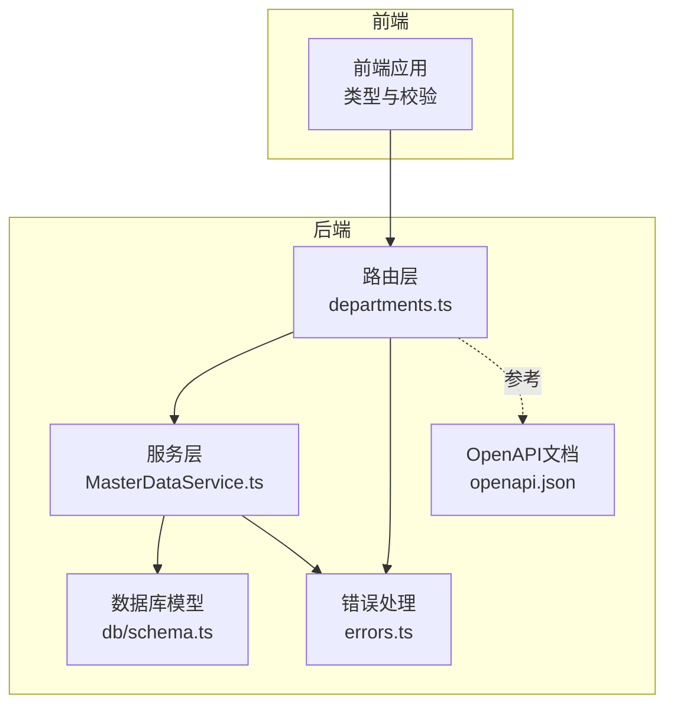
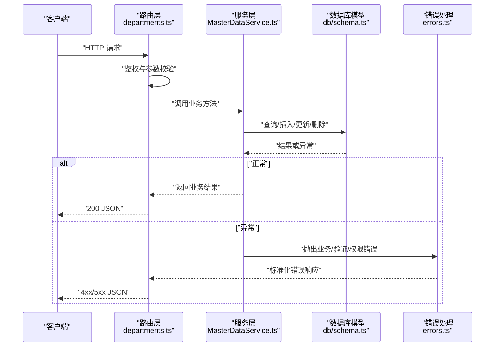
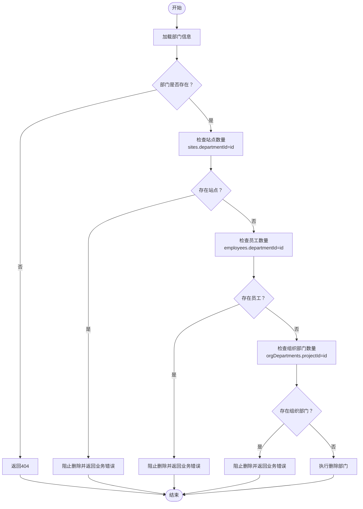
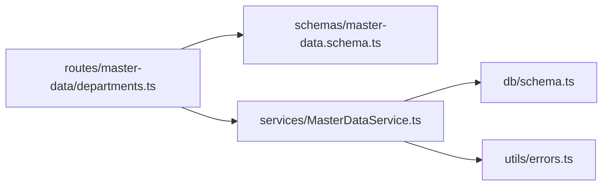

# 部门管理API

<cite>
**本文引用的文件**
- [backend/src/routes/master-data/departments.ts](file://backend/src/routes/master-data/departments.ts)
- [backend/src/services/MasterDataService.ts](file://backend/src/services/MasterDataService.ts)
- [backend/src/schemas/master-data.schema.ts](file://backend/src/schemas/master-data.schema.ts)
- [backend/src/db/schema.ts](file://backend/src/db/schema.ts)
- [backend/src/utils/errors.ts](file://backend/src/utils/errors.ts)
- [backend/openapi.json](file://backend/openapi.json)
- [frontend/src/types/schema.d.ts](file://frontend/src/types/schema.d.ts)
- [backend/test/routes/master-data.test.ts](file://backend/test/routes/master-data.test.ts)
- [backend/test/services/MasterDataService.test.ts](file://backend/test/services/MasterDataService.test.ts)
</cite>

## 目录
1. [简介](#简介)
2. [项目结构](#项目结构)
3. [核心组件](#核心组件)
4. [架构总览](#架构总览)
5. [详细组件分析](#详细组件分析)
6. [依赖分析](#依赖分析)
7. [性能考虑](#性能考虑)
8. [故障排查指南](#故障排查指南)
9. [结论](#结论)
10. [附录](#附录)

## 简介
本文件面向“部门管理API”的使用者与维护者，系统性说明部门实体的CRUD能力，包括：
- 获取部门列表（GET /api/departments）
- 创建部门（POST /api/departments）
- 更新部门（PUT /api/departments/{id}）
- 删除部门（DELETE /api/departments/{id}）

重点覆盖：
- 每个端点的HTTP方法、路径、请求体与响应格式
- 部门与总部的关联关系（hqId字段）及默认行为
- 部门active状态管理
- 删除部门时的级联检查逻辑（站点、员工、组织部门）
- 常见错误码与含义
- 创建与更新的JSON示例路径

## 项目结构
部门管理API位于后端路由层与服务层之间，遵循“OpenAPI路由定义 + 服务层实现 + 数据模型”的分层设计。前端通过类型定义与OpenAPI文档进行契约约束。

图表来源
- [backend/src/routes/master-data/departments.ts](file://backend/src/routes/master-data/departments.ts#L1-L162)
- [backend/src/services/MasterDataService.ts](file://backend/src/services/MasterDataService.ts#L1-L90)
- [backend/src/db/schema.ts](file://backend/src/db/schema.ts#L73-L81)
- [backend/src/utils/errors.ts](file://backend/src/utils/errors.ts#L34-L54)
- [backend/openapi.json](file://backend/openapi.json#L346-L584)

章节来源
- [backend/src/routes/master-data/departments.ts](file://backend/src/routes/master-data/departments.ts#L1-L162)
- [backend/src/services/MasterDataService.ts](file://backend/src/services/MasterDataService.ts#L1-L90)
- [backend/src/db/schema.ts](file://backend/src/db/schema.ts#L73-L81)
- [backend/src/utils/errors.ts](file://backend/src/utils/errors.ts#L34-L54)
- [backend/openapi.json](file://backend/openapi.json#L346-L584)

## 核心组件
- 路由层（departments.ts）：定义OpenAPI路由、参数校验、鉴权与审计日志；调用服务层执行业务逻辑。
- 服务层（MasterDataService.ts）：实现部门CRUD与删除前的级联检查；负责与数据库交互。
- 数据模型（db/schema.ts）：定义departments表结构，包含id、hqId、name、active等字段。
- 校验与类型（master-data.schema.ts）：定义部门实体的请求/响应Schema，约束字段类型与默认值。
- 错误处理（errors.ts）：统一返回错误码与消息，便于前端识别与提示。
- OpenAPI文档（openapi.json）：对外暴露接口契约，供前端与SDK生成工具使用。

章节来源
- [backend/src/routes/master-data/departments.ts](file://backend/src/routes/master-data/departments.ts#L1-L162)
- [backend/src/services/MasterDataService.ts](file://backend/src/services/MasterDataService.ts#L1-L90)
- [backend/src/db/schema.ts](file://backend/src/db/schema.ts#L73-L81)
- [backend/src/schemas/master-data.schema.ts](file://backend/src/schemas/master-data.schema.ts#L20-L32)
- [backend/src/utils/errors.ts](file://backend/src/utils/errors.ts#L34-L54)
- [backend/openapi.json](file://backend/openapi.json#L346-L584)

## 架构总览
部门管理API的调用链路如下：

图表来源
- [backend/src/routes/master-data/departments.ts](file://backend/src/routes/master-data/departments.ts#L65-L162)
- [backend/src/services/MasterDataService.ts](file://backend/src/services/MasterDataService.ts#L13-L89)
- [backend/src/db/schema.ts](file://backend/src/db/schema.ts#L73-L81)
- [backend/src/utils/errors.ts](file://backend/src/utils/errors.ts#L34-L54)

## 详细组件分析

### GET /api/departments
- 方法与路径：GET /api/departments
- 功能：获取所有部门列表
- 鉴权：无显式权限控制（路由层未做权限校验）
- 返回：数组形式的部门对象集合
- 关键实现：
  - 路由层：定义OpenAPI路由与响应Schema
  - 服务层：查询departments表并返回
- 响应字段（节选）：id、hqId、name、active
- 参考路径：
  - [GET /api/departments 定义](file://backend/src/routes/master-data/departments.ts#L16-L38)
  - [服务层查询实现](file://backend/src/services/MasterDataService.ts#L13-L15)

章节来源
- [backend/src/routes/master-data/departments.ts](file://backend/src/routes/master-data/departments.ts#L16-L38)
- [backend/src/services/MasterDataService.ts](file://backend/src/services/MasterDataService.ts#L13-L15)
- [backend/openapi.json](file://backend/openapi.json#L529-L561)

### POST /api/departments
- 方法与路径：POST /api/departments
- 功能：创建新部门
- 鉴权：需要权限 system.department.create
- 请求体字段：
  - name（必填，字符串，最小长度1）
  - hqId（可选，UUID或null）
  - active（可选，整数0/1，默认1）
- 响应体字段：
  - id（UUID）
  - hqId（UUID或null）
  - name（字符串）
  - active（整数1）
- 默认行为：
  - 若未提供hqId，服务层会尝试查找默认总部，若不存在则自动创建一个默认总部并赋给新部门
- 审计日志：记录创建动作与关键字段
- 参考路径：
  - [路由层请求/响应Schema与鉴权](file://backend/src/routes/master-data/departments.ts#L40-L86)
  - [服务层创建逻辑与默认总部策略](file://backend/src/services/MasterDataService.ts#L17-L49)
  - [部门Schema定义](file://backend/src/schemas/master-data.schema.ts#L20-L32)
  - [部门表结构（hqId字段）](file://backend/src/db/schema.ts#L73-L81)
  - [OpenAPI契约（请求/响应）](file://backend/openapi.json#L532-L584)

章节来源
- [backend/src/routes/master-data/departments.ts](file://backend/src/routes/master-data/departments.ts#L40-L86)
- [backend/src/services/MasterDataService.ts](file://backend/src/services/MasterDataService.ts#L17-L49)
- [backend/src/schemas/master-data.schema.ts](file://backend/src/schemas/master-data.schema.ts#L20-L32)
- [backend/src/db/schema.ts](file://backend/src/db/schema.ts#L73-L81)
- [backend/openapi.json](file://backend/openapi.json#L532-L584)

### PUT /api/departments/{id}
- 方法与路径：PUT /api/departments/{id}
- 功能：更新指定部门
- 鉴权：需要权限 system.department.update
- 路径参数：
  - id（UUID，必填）
- 请求体字段：
  - name（可选，字符串，最小长度1）
  - hqId（可选，UUID或null）
  - active（可选，整数0/1）
- 响应体：ok: true
- 业务规则：
  - 当更新name时，需确保同名部门在当前部门外唯一
  - 未提供字段不会被更新
- 审计日志：记录更新动作与变更字段
- 参考路径：
  - [路由层请求/响应Schema与鉴权](file://backend/src/routes/master-data/departments.ts#L88-L131)
  - [服务层更新逻辑与唯一性校验](file://backend/src/services/MasterDataService.ts#L51-L69)
  - [部门Schema定义](file://backend/src/schemas/master-data.schema.ts#L20-L32)

章节来源
- [backend/src/routes/master-data/departments.ts](file://backend/src/routes/master-data/departments.ts#L88-L131)
- [backend/src/services/MasterDataService.ts](file://backend/src/services/MasterDataService.ts#L51-L69)
- [backend/src/schemas/master-data.schema.ts](file://backend/src/schemas/master-data.schema.ts#L20-L32)

### DELETE /api/departments/{id}
- 方法与路径：DELETE /api/departments/{id}
- 功能：删除指定部门
- 鉴权：需要权限 system.department.delete
- 路径参数：
  - id（UUID，必填）
- 响应体：ok: true
- 级联检查逻辑（删除前）：
  - 若部门下存在站点（sites.departmentId），则阻止删除并返回业务错误
  - 若部门下存在员工（employees.departmentId），则阻止删除并返回业务错误
  - 若部门作为项目ID关联了组织部门（orgDepartments.projectId），则阻止删除并返回业务错误
- 审计日志：记录删除动作与部门名称
- 参考路径：
  - [路由层请求/响应Schema与鉴权](file://backend/src/routes/master-data/departments.ts#L132-L162)
  - [服务层删除逻辑与级联检查](file://backend/src/services/MasterDataService.ts#L71-L89)
  - [部门表结构（id、hqId、active）](file://backend/src/db/schema.ts#L73-L81)
  - [站点表结构（departmentId）](file://backend/src/db/schema.ts#L293-L301)
  - [员工表结构（departmentId）](file://backend/src/db/schema.ts#L26-L56)
  - [组织部门表结构（projectId）](file://backend/src/db/schema.ts#L102-L116)

章节来源
- [backend/src/routes/master-data/departments.ts](file://backend/src/routes/master-data/departments.ts#L132-L162)
- [backend/src/services/MasterDataService.ts](file://backend/src/services/MasterDataService.ts#L71-L89)
- [backend/src/db/schema.ts](file://backend/src/db/schema.ts#L73-L81)
- [backend/src/db/schema.ts](file://backend/src/db/schema.ts#L293-L301)
- [backend/src/db/schema.ts](file://backend/src/db/schema.ts#L26-L56)
- [backend/src/db/schema.ts](file://backend/src/db/schema.ts#L102-L116)

### 部门与总部的关联关系（hqId）
- 字段定义：
  - 部门实体包含 hqId 字段，指向总部（headquarters）的UUID
  - 路由层Schema使用 hq_id（snake_case），服务层接收 hqId（camelCase）
- 默认策略：
  - 创建部门时若未提供 hqId，服务层会优先查找现有总部，若不存在则自动创建默认总部并赋给新部门
- 表结构映射：
  - departments 表中存储 hq_id（文本型UUID）
- 参考路径：
  - [部门Schema（hqId）](file://backend/src/schemas/master-data.schema.ts#L20-L32)
  - [部门表结构（hqId）](file://backend/src/db/schema.ts#L73-L81)
  - [创建部门默认总部策略](file://backend/src/services/MasterDataService.ts#L17-L49)
  - [路由层字段映射注释](file://backend/src/routes/master-data/departments.ts#L70-L76)

章节来源
- [backend/src/schemas/master-data.schema.ts](file://backend/src/schemas/master-data.schema.ts#L20-L32)
- [backend/src/db/schema.ts](file://backend/src/db/schema.ts#L73-L81)
- [backend/src/services/MasterDataService.ts](file://backend/src/services/MasterDataService.ts#L17-L49)
- [backend/src/routes/master-data/departments.ts](file://backend/src/routes/master-data/departments.ts#L70-L76)

### 部门active状态管理
- 字段定义：
  - departments.active 为整数0/1，默认1
- 使用场景：
  - 列表查询时可结合其他过滤条件（如站点列表的activeOnly）
  - 更新部门时可切换激活状态
- 参考路径：
  - [部门Schema（active）](file://backend/src/schemas/master-data.schema.ts#L20-L32)
  - [部门表结构（active）](file://backend/src/db/schema.ts#L73-L81)
  - [站点列表过滤activeOnly](file://backend/src/routes/master-data/departments.ts#L166-L205)

章节来源
- [backend/src/schemas/master-data.schema.ts](file://backend/src/schemas/master-data.schema.ts#L20-L32)
- [backend/src/db/schema.ts](file://backend/src/db/schema.ts#L73-L81)
- [backend/src/routes/master-data/departments.ts](file://backend/src/routes/master-data/departments.ts#L166-L205)

### 删除部门的级联检查流程

图表来源
- [backend/src/services/MasterDataService.ts](file://backend/src/services/MasterDataService.ts#L71-L89)
- [backend/src/db/schema.ts](file://backend/src/db/schema.ts#L293-L301)
- [backend/src/db/schema.ts](file://backend/src/db/schema.ts#L26-L56)
- [backend/src/db/schema.ts](file://backend/src/db/schema.ts#L102-L116)

章节来源
- [backend/src/services/MasterDataService.ts](file://backend/src/services/MasterDataService.ts#L71-L89)
- [backend/src/db/schema.ts](file://backend/src/db/schema.ts#L293-L301)
- [backend/src/db/schema.ts](file://backend/src/db/schema.ts#L26-L56)
- [backend/src/db/schema.ts](file://backend/src/db/schema.ts#L102-L116)

### JSON示例（请求/响应）
以下为请求与响应的结构示例，请根据实际字段选择性使用：
- 创建部门（POST /api/departments）
  - 请求体示例字段：name、hqId、active
  - 响应体示例字段：id、hqId、name、active
  - 参考路径：
    - [请求Schema定义](file://backend/src/schemas/master-data.schema.ts#L20-L32)
    - [响应Schema定义](file://backend/src/schemas/master-data.schema.ts#L20-L32)
    - [OpenAPI契约（请求/响应）](file://backend/openapi.json#L532-L584)
- 更新部门（PUT /api/departments/{id}）
  - 请求体示例字段：name、hqId、active
  - 响应体示例字段：ok: true
  - 参考路径：
    - [请求Schema定义](file://backend/src/schemas/master-data.schema.ts#L20-L32)
    - [响应Schema定义](file://backend/src/schemas/master-data.schema.ts#L20-L32)
    - [OpenAPI契约（请求/响应）](file://backend/openapi.json#L548-L581)
- 获取部门列表（GET /api/departments）
  - 响应体示例字段：results[] 包含 id、hqId、name、active
  - 参考路径：
    - [响应Schema定义](file://backend/src/schemas/master-data.schema.ts#L20-L32)
    - [OpenAPI契约（响应）](file://backend/openapi.json#L529-L561)

章节来源
- [backend/src/schemas/master-data.schema.ts](file://backend/src/schemas/master-data.schema.ts#L20-L32)
- [backend/openapi.json](file://backend/openapi.json#L529-L584)

## 依赖分析
- 路由层依赖：
  - 权限校验工具（hasPermission）
  - 审计日志工具（logAuditAction）
  - OpenAPI Schema（departmentSchema/create/update）
  - 服务层实例（MasterDataService）
- 服务层依赖：
  - Drizzle ORM（数据库访问）
  - 错误处理（Errors）
  - 数据库表：departments、sites、employees、orgDepartments
- 数据模型依赖：
  - departments 表（主表）
  - sites 表（外键：departmentId）
  - employees 表（外键：departmentId）
  - orgDepartments 表（外键：projectId）

图表来源
- [backend/src/routes/master-data/departments.ts](file://backend/src/routes/master-data/departments.ts#L1-L162)
- [backend/src/services/MasterDataService.ts](file://backend/src/services/MasterDataService.ts#L1-L90)
- [backend/src/schemas/master-data.schema.ts](file://backend/src/schemas/master-data.schema.ts#L20-L32)
- [backend/src/db/schema.ts](file://backend/src/db/schema.ts#L73-L81)
- [backend/src/utils/errors.ts](file://backend/src/utils/errors.ts#L34-L54)

章节来源
- [backend/src/routes/master-data/departments.ts](file://backend/src/routes/master-data/departments.ts#L1-L162)
- [backend/src/services/MasterDataService.ts](file://backend/src/services/MasterDataService.ts#L1-L90)
- [backend/src/schemas/master-data.schema.ts](file://backend/src/schemas/master-data.schema.ts#L20-L32)
- [backend/src/db/schema.ts](file://backend/src/db/schema.ts#L73-L81)
- [backend/src/utils/errors.ts](file://backend/src/utils/errors.ts#L34-L54)

## 性能考虑
- 查询优化：
  - 获取部门列表为全量扫描，建议在数据量较大时增加索引或分页
- 写入优化：
  - 创建部门时若需要自动创建默认总部，注意避免重复创建
- 删除检查：
  - 删除前的三类计数查询为O(1)级别，建议在数据库层面建立合适的索引以降低COUNT成本

## 故障排查指南
- 常见错误码与含义：
  - 400 VALIDATION_ERROR：请求体字段校验失败（如name为空、active取值不在0/1范围）
  - 400 BUSINESS_ERROR：业务规则触发（如删除部门时仍有关联的站点/员工/组织部门）
  - 404 NOT_FOUND：资源不存在（如要更新/删除的部门不存在）
  - 403 FORBIDDEN：权限不足（缺少 system.department 的对应操作权限）
- 排查步骤：
  - 确认请求体字段符合Schema要求（name必填、active仅0/1）
  - 确认具备相应权限（system.department.create/update/delete）
  - 若删除失败，先检查是否存在站点、员工或组织部门
  - 查看审计日志定位具体操作时间与用户
- 参考路径：
  - [错误类型定义](file://backend/src/utils/errors.ts#L34-L54)
  - [删除前级联检查](file://backend/src/services/MasterDataService.ts#L71-L89)
  - [路由层权限校验](file://backend/src/routes/master-data/departments.ts#L66-L162)

章节来源
- [backend/src/utils/errors.ts](file://backend/src/utils/errors.ts#L34-L54)
- [backend/src/services/MasterDataService.ts](file://backend/src/services/MasterDataService.ts#L71-L89)
- [backend/src/routes/master-data/departments.ts](file://backend/src/routes/master-data/departments.ts#L66-L162)

## 结论
部门管理API提供了完整的CRUD能力，并通过严格的删除前级联检查保障数据完整性。hqId字段支持部门与总部的灵活关联，默认策略可在缺失时自动创建默认总部。配合OpenAPI与Schema，前后端协作清晰，错误处理统一，适合在企业级财务系统中稳定使用。

## 附录

### OpenAPI与前端类型对照
- OpenAPI契约（部门）：请求体字段包含 hq_id、name、active；响应体包含 id、hq_id、name、active
- 前端类型定义（部门）：请求体字段包含 hq_id、name、active；响应体包含 id、hq_id、name、active
- 参考路径：
  - [OpenAPI契约（部门）](file://backend/openapi.json#L532-L584)
  - [前端类型定义（部门）](file://frontend/src/types/schema.d.ts#L502-L531)

章节来源
- [backend/openapi.json](file://backend/openapi.json#L532-L584)
- [frontend/src/types/schema.d.ts](file://frontend/src/types/schema.d.ts#L502-L531)

### 测试参考
- 路由层测试（部门列表与创建）
  - [GET /api/master-data/departments](file://backend/test/routes/master-data.test.ts#L83-L111)
  - [POST /api/master-data/departments](file://backend/test/routes/master-data.test.ts#L97-L110)
- 服务层测试（部门CRUD）
  - [部门创建/获取/更新/删除](file://backend/test/services/MasterDataService.test.ts#L37-L70)

章节来源
- [backend/test/routes/master-data.test.ts](file://backend/test/routes/master-data.test.ts#L83-L111)
- [backend/test/services/MasterDataService.test.ts](file://backend/test/services/MasterDataService.test.ts#L37-L70)