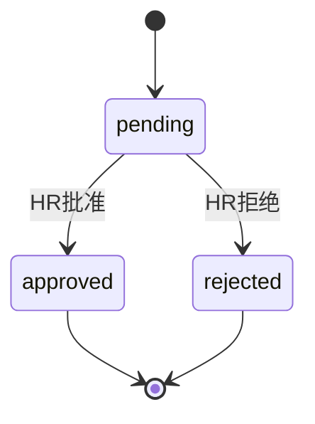
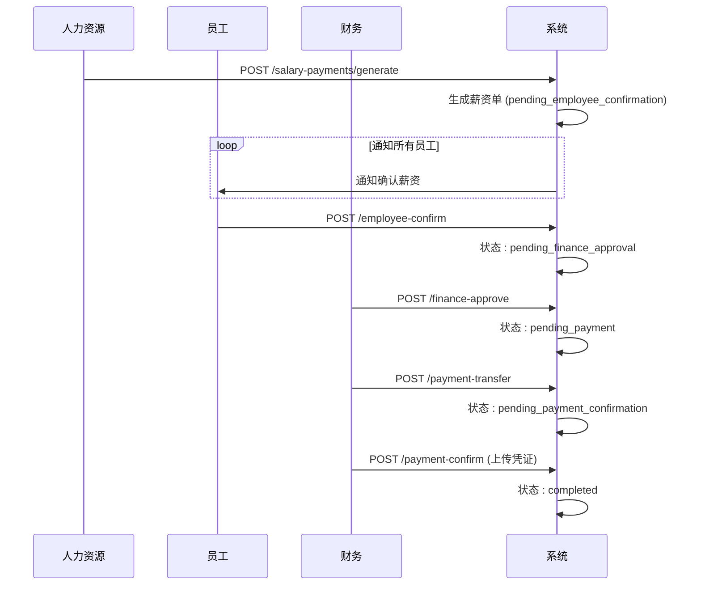
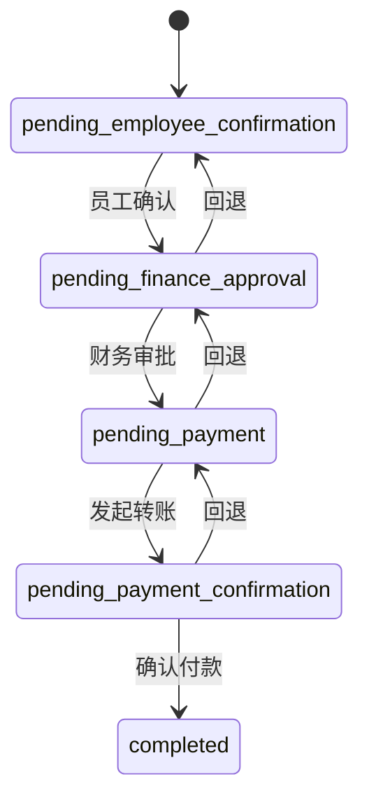

# 人事与薪资API

<cite>
**本文档引用的文件**   
- [employees.ts](file://backend/src/routes/v2/employees.ts)
- [employee-salaries.ts](file://backend/src/routes/v2/employee-salaries.ts)
- [employee-allowances.ts](file://backend/src/routes/v2/employee-allowances.ts)
- [employee-leaves.ts](file://backend/src/routes/v2/employee-leaves.ts)
- [salary-payments.ts](file://backend/src/routes/v2/salary-payments.ts)
- [EmployeeService.ts](file://backend/src/services/EmployeeService.ts)
- [SalaryService.ts](file://backend/src/services/SalaryService.ts)
- [EmployeeLeaveService.ts](file://backend/src/services/EmployeeLeaveService.ts)
- [SalaryPaymentService.ts](file://backend/src/services/SalaryPaymentService.ts)
- [SalaryPaymentGenerationService.ts](file://backend/src/services/SalaryPaymentGenerationService.ts)
- [SalaryPaymentProcessingService.ts](file://backend/src/services/SalaryPaymentProcessingService.ts)
- [state-machine.ts](file://backend/src/utils/state-machine.ts)
- [schema.ts](file://backend/src/db/schema.ts)
- [employee.schema.ts](file://backend/src/schemas/employee.schema.ts)
- [business.schema.ts](file://backend/src/schemas/business.schema.ts)
- [common.schema.ts](file://backend/src/schemas/common.schema.ts)
</cite>

## 目录
1. [简介](#简介)
2. [员工信息管理](#员工信息管理)
3. [薪资配置](#薪资配置)
4. [津贴发放](#津贴发放)
5. [请假管理](#请假管理)
6. [薪资发放](#薪资发放)
7. [数据模型与验证](#数据模型与验证)
8. [典型业务场景](#典型业务场景)

## 简介
本API文档详细说明了人事与薪资管理模块的核心功能，涵盖员工信息管理、薪资配置、津贴发放、请假管理和薪资发放等关键接口。文档深入解析了员工状态机的转换逻辑、薪资计算规则、批处理流程以及敏感字段的加密传输要求，为开发者和系统管理员提供全面的技术参考。

## 员工信息管理

本模块提供员工全生命周期的管理接口，包括员工的创建、查询、更新以及状态变更（转正、离职、复职）。

### 员工状态机
员工状态遵循严格的有限状态机（FSM）进行转换，确保业务流程的合规性。核心状态包括：
- **试用中 (probation)**: 员工入职后的初始状态。
- **正式 (regular)**: 试用期通过后转为正式员工。
- **已离职 (resigned)**: 员工主动或被动离职。

状态转换逻辑由 `EmployeeService` 实现，具体转换规则如下：
- **创建员工**: 状态自动设为 `probation`。
- **转正**: 通过 `POST /employees/{id}/regularize` 接口，将状态从 `probation` 变更为 `regular`。
- **离职**: 通过 `POST /employees/{id}/leave` 接口，将状态从 `probation` 或 `regular` 变更为 `resigned`，同时将 `active` 标记为 `0` 以禁用账户。
- **复职**: 通过 `POST /employees/{id}/rejoin` 接口，将状态从 `resigned` 变更为 `probation`，并重新激活账户。

**Section sources**
- [employees.ts](file://backend/src/routes/v2/employees.ts#L429-L525)
- [EmployeeService.ts](file://backend/src/services/EmployeeService.ts#L485-L564)

## 薪资配置

该模块负责管理员工的基本工资配置，支持多币种和试用/正式两种薪资类型。

### 薪资计算规则
薪资计算基于 `employee_salaries` 表，其核心规则如下：
1. **基本工资**: 员工的月薪金额，存储在 `amountCents` 字段（以分为单位）。
2. **币种支持**: 通过 `currencyId` 字段关联 `currencies` 表，支持多币种薪资。
3. **薪资类型**: 通过 `salaryType` 字段区分 `probation`（试用期）和 `regular`（正式）薪资。
4. **总额计算**: 系统通过 `getEmployeeTotalSalary` 方法，按币种对员工的所有薪资记录进行汇总。

**Section sources**
- [employee-salaries.ts](file://backend/src/routes/v2/employee-salaries.ts)
- [SalaryService.ts](file://backend/src/services/SalaryService.ts#L114-L186)
- [schema.ts](file://backend/src/db/schema.ts#L220-L229)

## 津贴发放

该模块用于管理员工的各类津贴（如住房、交通、餐补等）的配置和发放。

### 津贴管理
- **配置**: 通过 `employee_allowances` 表存储员工的津贴标准，包含 `allowanceType`（津贴类型）、`currencyId`（币种）和 `amountCents`（金额）。
- **发放**: 津贴的发放记录存储在 `allowance_payments` 表中，按年月和津贴类型进行唯一性约束，防止重复发放。

**Section sources**
- [employee-allowances.ts](file://backend/src/routes/v2/employee-allowances.ts)
- [schema.ts](file://backend/src/db/schema.ts#L231-L239)

## 请假管理

该模块处理员工的请假申请、审批和额度控制。

### 审批流程与额度控制
1. **申请**: 员工或HR通过 `POST /employee-leaves` 提交请假申请，状态初始为 `pending`。
2. **审批**: HR通过 `PUT /employee-leaves/{id}/status` 接口将状态更新为 `approved` 或 `rejected`。
3. **额度控制**: 系统通过 `getLeaveStats` 方法统计员工在指定年份内已批准的各类假期天数。年假（`annual`）的额度由员工信息中的 `annualLeaveDays` 字段定义，其他类型的假期（如事假）通常没有固定额度限制，但需经过审批。

**Diagram sources**
- [employee-leaves.ts](file://backend/src/routes/v2/employee-leaves.ts#L126-L175)
- [EmployeeLeaveService.ts](file://backend/src/services/EmployeeLeaveService.ts#L153-L181)

## 薪资发放

这是薪资管理的核心模块，采用批处理和多级审批流程，确保薪资发放的准确性和安全性。

### 批处理流程
薪资发放的批处理流程由 `SalaryPaymentGenerationService` 和 `SalaryPaymentProcessingService` 协同完成，主要步骤如下：

1.  **生成薪资单 (Generate)**:
    - 调用 `POST /salary-payments/generate` 接口。
    - 服务会查询所有在职员工，并根据其入职日期、薪资配置和当月请假记录，计算出应发薪资。
    - 生成 `salary_payments` 记录，状态为 `pending_employee_confirmation`。

2.  **员工确认 (Employee Confirm)**:
    - 员工通过 `POST /salary-payments/{id}/employee-confirm` 确认薪资单。
    - 状态变更为 `pending_finance_approval`。

3.  **财务审批 (Finance Approve)**:
    - 财务人员通过 `POST /salary-payments/{id}/finance-approve` 进行审批。
    - 状态变更为 `pending_payment`。

4.  **支付转账 (Payment Transfer)**:
    - 财务人员通过 `POST /salary-payments/{id}/payment-transfer` 发起转账。
    - 状态变更为 `pending_payment_confirmation`。

5.  **支付确认 (Payment Confirm)**:
    - 财务人员通过 `POST /salary-payments/{id}/payment-confirm` 并上传付款凭证。
    - 状态最终变更为 `completed`。

**Diagram sources**
- [salary-payments.ts](file://backend/src/routes/v2/salary-payments.ts)
- [SalaryPaymentGenerationService.ts](file://backend/src/services/SalaryPaymentGenerationService.ts#L21-L210)
- [SalaryPaymentService.ts](file://backend/src/services/SalaryPaymentService.ts#L117-L236)
- [SalaryPaymentProcessingService.ts](file://backend/src/services/SalaryPaymentProcessingService.ts#L30-L177)

### 状态机
薪资支付的状态流转由 `salaryPaymentStateMachine` 严格控制，确保流程不可逆且符合业务逻辑。

**Diagram sources**
- [state-machine.ts](file://backend/src/utils/state-machine.ts#L48-L54)
- [SalaryPaymentService.ts](file://backend/src/services/SalaryPaymentService.ts)

## 数据模型与验证

### 敏感字段加密传输
系统要求对身份证号、银行账号等敏感字段进行加密传输。虽然在提供的代码中未直接体现加密逻辑，但前端在提交包含 `personalEmail`、`usdtAddress` 等字段的请求时，必须通过HTTPS协议进行传输，确保数据在传输过程中的安全性。

### Schema验证规则
API请求和响应数据均通过Zod Schema进行严格验证，确保数据的完整性和正确性。
- **员工创建**: `CreateEmployeeSchema` 验证员工姓名、邮箱、部门等必填项。
- **薪资发放**: `generateSalaryPaymentsSchema` 验证年份和月份的有效性。
- **请假申请**: `CreateLeaveSchema` 验证请假日期和天数。

**Section sources**
- [employee.schema.ts](file://backend/src/schemas/employee.schema.ts)
- [business.schema.ts](file://backend/src/schemas/business.schema.ts)
- [common.schema.ts](file://backend/src/schemas/common.schema.ts)

## 典型业务场景

### 场景：新员工入职到首次薪资发放
1.  **创建员工**: HR调用 `POST /employees` 创建员工，系统自动创建用户账号和邮箱路由。
2.  **配置薪资**: HR调用 `POST /employee-salaries` 为新员工配置试用期工资。
3.  **生成薪资**: 次月，HR调用 `POST /salary-payments/generate` 生成包含该员工的薪资单。
4.  **员工确认**: 员工登录系统，确认其薪资单。
5.  **财务审批与发放**: 财务部门完成审批、转账和凭证确认，完成薪资发放。

**Section sources**
- [employees.ts](file://backend/src/routes/v2/employees.ts#L156-L240)
- [employee-salaries.ts](file://backend/src/routes/v2/employee-salaries.ts#L91-L155)
- [salary-payments.ts](file://backend/src/routes/v2/salary-payments.ts#L53-L94)