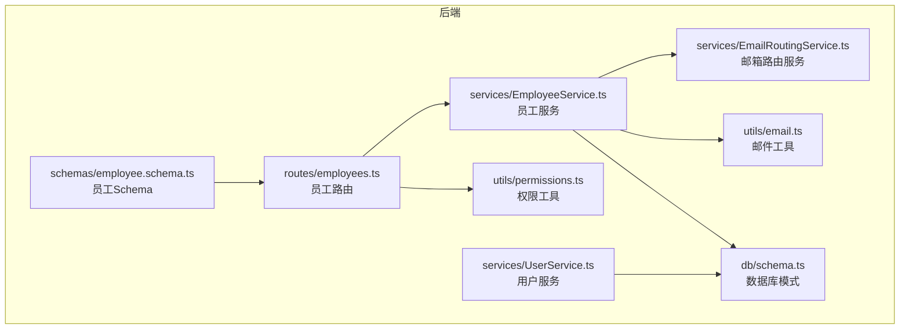
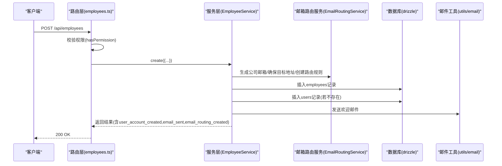
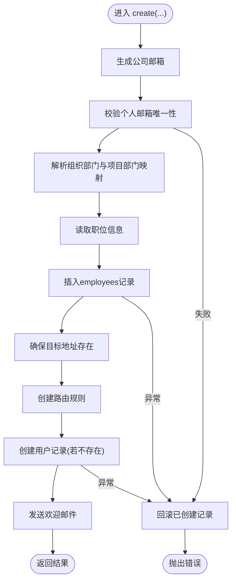
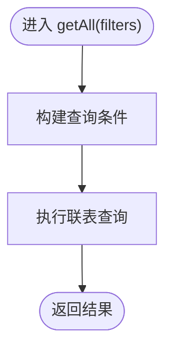
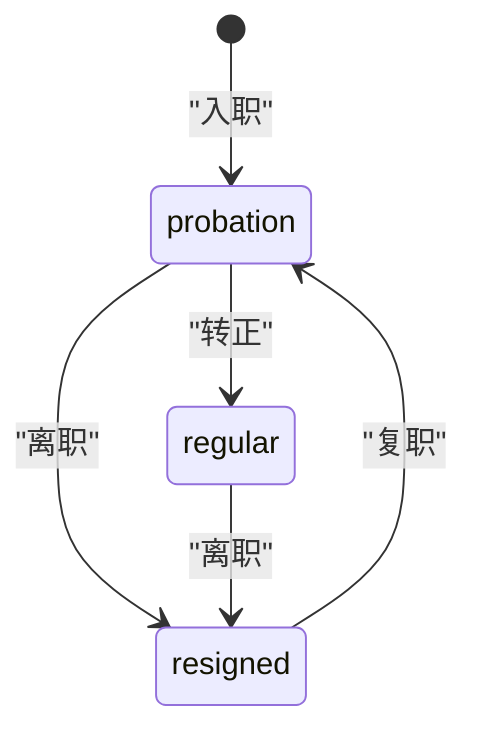
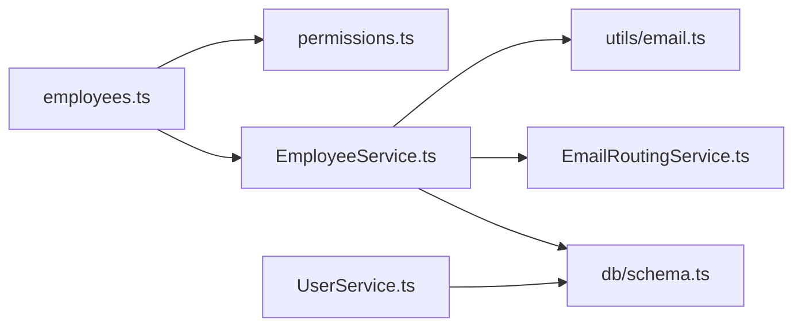

# 员工基本信息管理API

<cite>
**本文引用的文件**
- [backend/src/routes/employees.ts](file://backend/src/routes/employees.ts)
- [backend/src/services/EmployeeService.ts](file://backend/src/services/EmployeeService.ts)
- [backend/src/services/EmailRoutingService.ts](file://backend/src/services/EmailRoutingService.ts)
- [backend/src/services/UserService.ts](file://backend/src/services/UserService.ts)
- [backend/src/schemas/employee.schema.ts](file://backend/src/schemas/employee.schema.ts)
- [backend/src/db/schema.ts](file://backend/src/db/schema.ts)
- [backend/src/utils/permissions.ts](file://backend/src/utils/permissions.ts)
- [backend/src/utils/email.ts](file://backend/src/utils/email.ts)
- [backend/test/routes/employees.test.ts](file://backend/test/routes/employees.test.ts)
- [backend/test/services/EmployeeService.test.ts](file://backend/test/services/EmployeeService.test.ts)
</cite>

## 目录
1. [简介](#简介)
2. [项目结构](#项目结构)
3. [核心组件](#核心组件)
4. [架构总览](#架构总览)
5. [详细组件分析](#详细组件分析)
6. [依赖关系分析](#依赖关系分析)
7. [性能考虑](#性能考虑)
8. [故障排查指南](#故障排查指南)
9. [结论](#结论)
10. [附录](#附录)

## 简介
本文件面向“员工基本信息管理API”，系统性梳理员工的创建、查询、更新等核心操作，并重点说明以下关键流程与机制：
- 创建员工时自动创建用户账号、邮箱路由与发送欢迎邮件的完整流程
- 员工与部门(orgDepartmentId, departmentId)、职位(positionId)的关联机制
- 员工状态(status: probation/regular/resigned)的流转逻辑及相关字段（入职日期joinDate、转正日期regularDate、离职日期leaveDate）
- 复杂字段（如workSchedule工作排班、annualLeaveCycleMonths年假周期）的请求示例与含义
- 权限控制如何基于职位级别(level)限制数据访问范围

## 项目结构
员工相关的核心代码位于后端目录中，主要涉及路由层、服务层、数据库模式、权限与邮件工具等模块。

图表来源
- [backend/src/routes/employees.ts](file://backend/src/routes/employees.ts#L1-L462)
- [backend/src/services/EmployeeService.ts](file://backend/src/services/EmployeeService.ts#L1-L593)
- [backend/src/services/EmailRoutingService.ts](file://backend/src/services/EmailRoutingService.ts#L1-L248)
- [backend/src/services/UserService.ts](file://backend/src/services/UserService.ts#L1-L183)
- [backend/src/schemas/employee.schema.ts](file://backend/src/schemas/employee.schema.ts#L1-L121)
- [backend/src/db/schema.ts](file://backend/src/db/schema.ts#L1-L124)
- [backend/src/utils/permissions.ts](file://backend/src/utils/permissions.ts#L1-L330)
- [backend/src/utils/email.ts](file://backend/src/utils/email.ts#L1-L366)

章节来源
- [backend/src/routes/employees.ts](file://backend/src/routes/employees.ts#L1-L462)
- [backend/src/services/EmployeeService.ts](file://backend/src/services/EmployeeService.ts#L1-L593)
- [backend/src/services/EmailRoutingService.ts](file://backend/src/services/EmailRoutingService.ts#L1-L248)
- [backend/src/services/UserService.ts](file://backend/src/services/UserService.ts#L1-L183)
- [backend/src/schemas/employee.schema.ts](file://backend/src/schemas/employee.schema.ts#L1-L121)
- [backend/src/db/schema.ts](file://backend/src/db/schema.ts#L1-L124)
- [backend/src/utils/permissions.ts](file://backend/src/utils/permissions.ts#L1-L330)
- [backend/src/utils/email.ts](file://backend/src/utils/email.ts#L1-L366)

## 核心组件
- 路由层：提供员工的增删改查与状态变更接口，统一校验权限与参数。
- 服务层：封装员工生命周期管理、邮箱路由与邮件发送、用户同步等业务逻辑。
- 数据库模式：定义employees、users、positions、departments、orgDepartments、userDepartments等核心表结构。
- 权限工具：基于职位层级(level)与职位编码(code)实现数据访问范围控制。
- 邮件工具：封装邮件发送模板与调用流程，支持欢迎邮件与密码重置邮件。
- 邮箱路由服务：对接Cloudflare Email Routing，生成公司邮箱、创建转发规则、确保目标地址存在。

章节来源
- [backend/src/routes/employees.ts](file://backend/src/routes/employees.ts#L1-L462)
- [backend/src/services/EmployeeService.ts](file://backend/src/services/EmployeeService.ts#L1-L593)
- [backend/src/db/schema.ts](file://backend/src/db/schema.ts#L1-L124)
- [backend/src/utils/permissions.ts](file://backend/src/utils/permissions.ts#L1-L330)
- [backend/src/utils/email.ts](file://backend/src/utils/email.ts#L1-L366)
- [backend/src/services/EmailRoutingService.ts](file://backend/src/services/EmailRoutingService.ts#L1-L248)

## 架构总览
员工管理API采用“路由-服务-数据”的分层设计，配合权限与邮件工具完成端到端流程。

图表来源
- [backend/src/routes/employees.ts](file://backend/src/routes/employees.ts#L92-L161)
- [backend/src/services/EmployeeService.ts](file://backend/src/services/EmployeeService.ts#L12-L249)
- [backend/src/services/EmailRoutingService.ts](file://backend/src/services/EmailRoutingService.ts#L33-L162)
- [backend/src/utils/email.ts](file://backend/src/utils/email.ts#L213-L273)

## 详细组件分析

### 员工创建流程（POST /api/employees）
- 请求体字段要点
  - 必填：name、personalEmail、orgDepartmentId、positionId、joinDate
  - 可选：departmentId、phone、address、emergencyContact、emergencyPhone、memo、workSchedule、annualLeaveCycleMonths、annualLeaveDays、probationSalaries、regularSalaries
- 关键处理步骤
  1) 生成公司邮箱：基于姓名与现有邮箱去重，确保唯一性
  2) 校验个人邮箱唯一性
  3) 解析组织部门与项目部门映射，确定实际departmentId
  4) 读取职位信息以确定用户角色
  5) 创建员工记录（默认状态probation，active=1）
  6) 通过EmailRoutingService确保目标地址存在并创建路由规则
  7) 若用户不存在则创建用户记录，并同步user_departments
  8) 通过邮件工具发送欢迎邮件
  9) 返回user_account_created、email_sent、email_routing_created等结果标记
- 错误与回滚
  - 任一步骤失败均尝试回滚已创建的记录（users、user_departments、employees）

图表来源
- [backend/src/services/EmployeeService.ts](file://backend/src/services/EmployeeService.ts#L12-L249)
- [backend/src/services/EmailRoutingService.ts](file://backend/src/services/EmailRoutingService.ts#L75-L162)
- [backend/src/utils/email.ts](file://backend/src/utils/email.ts#L213-L273)

章节来源
- [backend/src/routes/employees.ts](file://backend/src/routes/employees.ts#L92-L161)
- [backend/src/services/EmployeeService.ts](file://backend/src/services/EmployeeService.ts#L12-L249)
- [backend/src/services/EmailRoutingService.ts](file://backend/src/services/EmailRoutingService.ts#L1-L248)
- [backend/src/utils/email.ts](file://backend/src/utils/email.ts#L190-L273)
- [backend/src/schemas/employee.schema.ts](file://backend/src/schemas/employee.schema.ts#L85-L121)

### 员工查询与权限控制（GET /api/employees）
- 查询参数
  - status、departmentId、orgDepartmentId、name、email、positionId、activeOnly、limit、offset
- 权限与访问范围
  - 总部(level=1)：可查看所有员工
  - 项目(level=2)：仅能查看本部门员工
  - 组长(team_leader)：仅能查看本组织部门员工
  - 工程师(team_engineer)：仅能查看自己
- 实现要点
  - 路由层根据职位层级构造过滤条件
  - 服务层执行带条件的联表查询，返回员工详情与用户状态

图表来源
- [backend/src/routes/employees.ts](file://backend/src/routes/employees.ts#L32-L54)
- [backend/src/services/EmployeeService.ts](file://backend/src/services/EmployeeService.ts#L251-L333)
- [backend/src/utils/permissions.ts](file://backend/src/utils/permissions.ts#L266-L323)

章节来源
- [backend/src/routes/employees.ts](file://backend/src/routes/employees.ts#L13-L54)
- [backend/src/services/EmployeeService.ts](file://backend/src/services/EmployeeService.ts#L251-L333)
- [backend/src/utils/permissions.ts](file://backend/src/utils/permissions.ts#L1-L330)

### 员工更新与用户同步（PUT /api/employees/:id）
- 更新字段
  - name、departmentId、orgDepartmentId、positionId、joinDate、probationSalaryCents、regularSalaryCents、allowances、active、phone、personalEmail、usdtAddress、emergencyContact、emergencyPhone、address、memo、birthday、workSchedule、annualLeaveCycleMonths、annualLeaveDays
- 用户同步
  - 若departmentId/orgDepartmentId/positionId变化，同步更新users及user_departments
- 返回
  - 返回{id}

章节来源
- [backend/src/routes/employees.ts](file://backend/src/routes/employees.ts#L207-L271)
- [backend/src/services/EmployeeService.ts](file://backend/src/services/EmployeeService.ts#L423-L493)

### 员工状态流转
- 转正（POST /api/employees/:id/regularize）
  - 字段：regularDate
  - 行为：更新status=regular，设置regularDate
- 离职（POST /api/employees/:id/leave）
  - 字段：leaveDate、reason
  - 行为：更新status=resigned、active=0；同时禁用用户登录
- 复职（POST /api/employees/:id/rejoin）
  - 字段：joinDate
  - 行为：更新status=probation、active=1；启用用户登录

图表来源
- [backend/src/routes/employees.ts](file://backend/src/routes/employees.ts#L274-L377)
- [backend/src/services/EmployeeService.ts](file://backend/src/services/EmployeeService.ts#L497-L546)

章节来源
- [backend/src/routes/employees.ts](file://backend/src/routes/employees.ts#L274-L377)
- [backend/src/services/EmployeeService.ts](file://backend/src/services/EmployeeService.ts#L497-L546)

### 邮箱路由与欢迎邮件发送
- 公司邮箱生成
  - 基于员工姓名生成前缀，结合现有邮箱去重，最终形成唯一@cloudflarets.com邮箱
- 目标地址与路由规则
  - 确保个人邮箱加入Cloudflare Email Routing地址（触发验证）
  - 为公司邮箱创建转发规则到个人邮箱
- 欢迎邮件
  - 使用邮件模板发送包含登录地址、登录邮箱、初始密码等信息的邮件
- 密码重置
  - 生成随机密码并加密存储，发送重置邮件提醒修改密码

章节来源
- [backend/src/services/EmployeeService.ts](file://backend/src/services/EmployeeService.ts#L12-L249)
- [backend/src/services/EmailRoutingService.ts](file://backend/src/services/EmailRoutingService.ts#L33-L162)
- [backend/src/utils/email.ts](file://backend/src/utils/email.ts#L190-L324)

### 复杂字段说明与示例
- workSchedule（工作排班）
  - 类型：任意JSON对象，服务层以字符串形式存储
  - 示例字段：days（工作日数组）、start/end（每日上下班时间）
- annualLeaveCycleMonths（年假周期）
  - 单位：月（6或12），用于年假周期计算
- annualLeaveDays（年假天数）
  - 单位：天，每周期可享有的年假天数
- 其他复杂字段
  - probationSalaries、regularSalaries：按币种与金额的薪资配置（数组）
  - allowances：各类补贴配置（生活、住房、交通、餐补）

请求示例（路径参考）
- 创建员工请求体示例路径：[CreateEmployeeSchema](file://backend/src/schemas/employee.schema.ts#L85-L110)
- 更新员工请求体示例路径：[UpdateEmployeeSchema](file://backend/src/schemas/employee.schema.ts#L46-L70)

章节来源
- [backend/src/schemas/employee.schema.ts](file://backend/src/schemas/employee.schema.ts#L1-L121)
- [backend/src/services/EmployeeService.ts](file://backend/src/services/EmployeeService.ts#L12-L249)

### 权限控制与数据访问范围
- 职位层级(level)
  - 1：总部，可查看所有员工
  - 2：项目，仅能查看本部门员工
  - 3：组，仅能查看本组织部门员工
- 特殊职位
  - team_leader：可查看本组员工
  - team_engineer：仅能查看自己
- 访问范围过滤
  - 路由层在查询时根据用户职位动态拼接WHERE条件
  - 服务层提供getDataAccessFilter辅助函数，返回SQL片段与绑定参数

章节来源
- [backend/src/utils/permissions.ts](file://backend/src/utils/permissions.ts#L1-L330)
- [backend/src/routes/employees.ts](file://backend/src/routes/employees.ts#L32-L54)

## 依赖关系分析
- 路由层依赖服务层与权限工具
- 服务层依赖数据库模式、邮箱路由服务与邮件工具
- 用户服务依赖数据库模式，提供用户与员工的关联查询能力

图表来源
- [backend/src/routes/employees.ts](file://backend/src/routes/employees.ts#L1-L462)
- [backend/src/services/EmployeeService.ts](file://backend/src/services/EmployeeService.ts#L1-L593)
- [backend/src/services/UserService.ts](file://backend/src/services/UserService.ts#L1-L183)
- [backend/src/db/schema.ts](file://backend/src/db/schema.ts#L1-L124)
- [backend/src/utils/permissions.ts](file://backend/src/utils/permissions.ts#L1-L330)
- [backend/src/utils/email.ts](file://backend/src/utils/email.ts#L1-L366)
- [backend/src/services/EmailRoutingService.ts](file://backend/src/services/EmailRoutingService.ts#L1-L248)

章节来源
- [backend/src/routes/employees.ts](file://backend/src/routes/employees.ts#L1-L462)
- [backend/src/services/EmployeeService.ts](file://backend/src/services/EmployeeService.ts#L1-L593)
- [backend/src/services/UserService.ts](file://backend/src/services/UserService.ts#L1-L183)
- [backend/src/db/schema.ts](file://backend/src/db/schema.ts#L1-L124)
- [backend/src/utils/permissions.ts](file://backend/src/utils/permissions.ts#L1-L330)
- [backend/src/utils/email.ts](file://backend/src/utils/email.ts#L1-L366)
- [backend/src/services/EmailRoutingService.ts](file://backend/src/services/EmailRoutingService.ts#L1-L248)

## 性能考虑
- 查询优化
  - 在employees表上对常用过滤字段（status、departmentId、orgDepartmentId、positionId、name、email）建立索引可提升查询效率
- 批量操作
  - D1不支持传统事务，服务层通过回滚策略保证一致性，建议避免单次创建过多资源
- 异步任务
  - 邮件发送与Cloudflare API调用属于外部依赖，建议在高并发场景下引入队列或异步处理

[本节为通用指导，不直接分析具体文件]

## 故障排查指南
- 常见错误
  - 个人邮箱重复：创建员工时报错“个人邮箱已存在”
  - 职位不存在：创建/更新时找不到对应职位
  - 部门不存在：组织部门或项目部门缺失
  - 权限不足：未满足hasPermission或职位层级访问范围
- 排查步骤
  - 检查请求体字段是否符合Schema定义
  - 核对职位、组织部门、项目部门是否存在且有效
  - 确认Cloudflare邮箱路由配置（CF_ACCOUNT_ID、CF_ZONE_ID、CF_API_TOKEN）是否正确
  - 查看审计日志与服务层回滚日志定位问题
- 测试参考
  - 路由层测试：[employees.test.ts](file://backend/test/routes/employees.test.ts#L1-L101)
  - 服务层测试：[EmployeeService.test.ts](file://backend/test/services/EmployeeService.test.ts#L1-L100)

章节来源
- [backend/test/routes/employees.test.ts](file://backend/test/routes/employees.test.ts#L1-L101)
- [backend/test/services/EmployeeService.test.ts](file://backend/test/services/EmployeeService.test.ts#L1-L100)
- [backend/src/services/EmployeeService.ts](file://backend/src/services/EmployeeService.ts#L12-L249)

## 结论
员工基本信息管理API围绕“创建即发账号+邮件+路由”的完整闭环展开，结合职位层级实现精细化的数据访问控制。通过workSchedule与annualLeaveCycleMonths等复杂字段，系统支持灵活的工作安排与年假周期配置。建议在生产环境中完善索引、异步化外部依赖，并持续监控权限与路由配置，确保流程稳定可靠。

[本节为总结性内容，不直接分析具体文件]

## 附录

### API定义与示例（路径参考）
- 创建员工
  - 方法：POST
  - 路径：/api/employees
  - 请求体Schema：[CreateEmployeeSchema](file://backend/src/schemas/employee.schema.ts#L85-L110)
  - 响应体Schema：[CreateEmployeeResponseSchema](file://backend/src/schemas/employee.schema.ts#L112-L121)
- 查询员工
  - 方法：GET
  - 路径：/api/employees
  - 查询参数Schema：[EmployeeQuerySchema](file://backend/src/schemas/employee.schema.ts#L24-L34)
- 更新员工
  - 方法：PUT
  - 路径：/api/employees/:id
  - 请求体Schema：[UpdateEmployeeSchema](file://backend/src/schemas/employee.schema.ts#L46-L70)
- 转正/离职/复职
  - 方法：POST
  - 路径：/api/employees/:id/regularize、/api/employees/:id/leave、/api/employees/:id/rejoin
  - 请求体Schema：[RegularizeEmployeeSchema](file://backend/src/schemas/employee.schema.ts#L72-L75)、[EmployeeLeaveSchema](file://backend/src/schemas/employee.schema.ts#L76-L80)、[EmployeeRejoinSchema](file://backend/src/schemas/employee.schema.ts#L81-L84)

章节来源
- [backend/src/schemas/employee.schema.ts](file://backend/src/schemas/employee.schema.ts#L1-L121)
- [backend/src/routes/employees.ts](file://backend/src/routes/employees.ts#L13-L377)