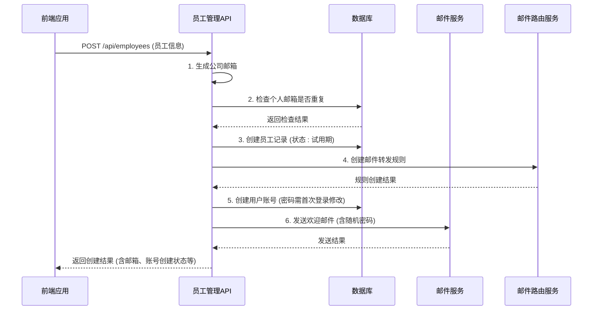
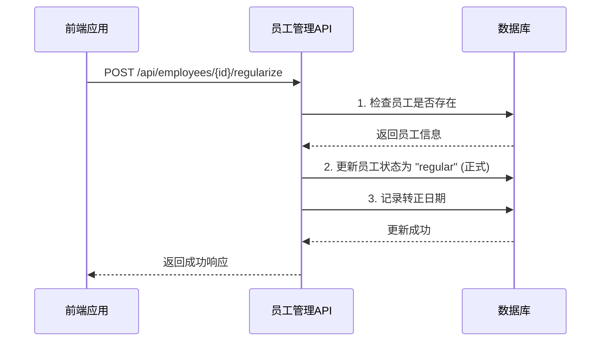
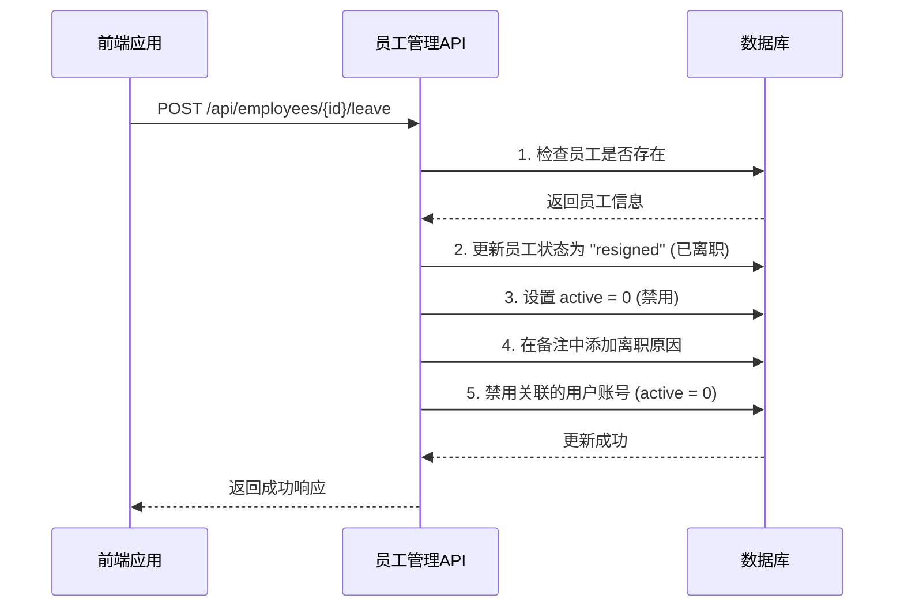
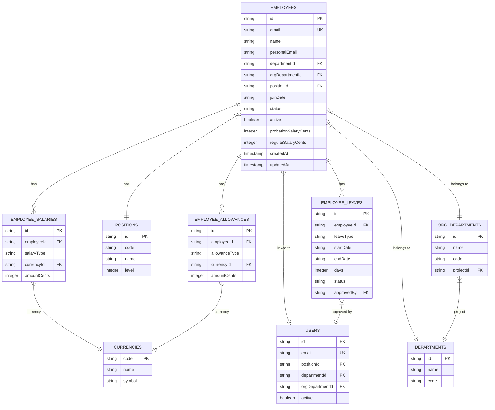
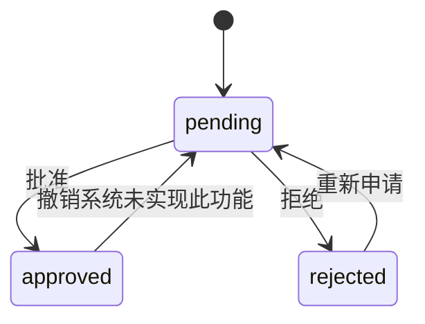

# 员工管理API

<cite>
**本文档引用的文件**
- [employees.ts](file://backend/src/routes/employees.ts)
- [employee-salaries.ts](file://backend/src/routes/employee-salaries.ts)
- [employee-allowances.ts](file://backend/src/routes/employee-allowances.ts)
- [employee-leaves.ts](file://backend/src/routes/employee-leaves.ts)
- [EmployeeService.ts](file://backend/src/services/EmployeeService.ts)
- [SalaryService.ts](file://backend/src/services/SalaryService.ts)
- [AllowanceService.ts](file://backend/src/services/AllowanceService.ts)
- [AnnualLeaveService.ts](file://backend/src/services/AnnualLeaveService.ts)
- [employee.schema.ts](file://backend/src/schemas/employee.schema.ts)
- [schema.ts](file://backend/src/db/schema.ts)
- [permissions.ts](file://backend/src/utils/permissions.ts)
</cite>

## 目录
1. [简介](#简介)
2. [核心API端点](#核心api端点)
3. [员工全生命周期流程](#员工全生命周期流程)
4. [数据模型与关系](#数据模型与关系)
5. [薪资与补贴管理](#薪资与补贴管理)
6. [请假管理](#请假管理)
7. [权限控制](#权限控制)
8. [复杂表单数据提交示例](#复杂表单数据提交示例)

## 简介

本API文档全面介绍了员工管理系统的各项功能，涵盖员工信息管理、薪资配置、补贴管理和请假管理四大核心模块。系统通过`/api/employees`、`/api/employee-salaries`、`/api/employee-allowances`和`/api/employee-leaves`四个主要API端点，实现了对员工从入职到离职的全生命周期管理。API设计遵循RESTful原则，并通过详细的权限控制确保数据安全。

**Section sources**
- [employees.ts](file://backend/src/routes/employees.ts#L1-L462)

## 核心API端点

### 员工信息管理 (/api/employees)

该端点负责员工信息的增删改查操作，是员工管理的核心。

- **GET /employees**: 列出所有员工，支持按状态、部门、姓名等条件过滤。
- **GET /employees/:id**: 根据ID获取单个员工的详细信息。
- **POST /employees**: 创建新员工。此操作会自动创建关联的用户账号，生成公司邮箱，并发送欢迎邮件。
- **PUT /employees/:id**: 更新员工信息。
- **POST /employees/:id/regularize**: 将员工状态从试用期转为正式。
- **POST /employees/:id/leave**: 处理员工离职，更新状态并禁用其登录账号。
- **POST /employees/:id/rejoin**: 处理员工重新入职。
- **POST /employees/:id/reset-password**: 重置员工账号密码并发送邮件。

**Section sources**
- [employees.ts](file://backend/src/routes/employees.ts#L13-L462)

### 薪资管理 (/api/employee-salaries)

该端点用于管理员工的薪资信息，支持多种货币。

- **GET /employee-salaries**: 根据员工ID和薪资类型（试用期/正式）列出薪资记录。
- **POST /employee-salaries**: 创建或更新员工的薪资。如果指定员工和薪资类型下已存在该货币的记录，则会更新该记录。
- **PUT /employee-salaries/batch**: 批量更新员工的薪资，用于一次性配置多种货币的薪资。
- **DELETE /employee-salaries/{id}**: 删除指定的薪资记录。

**Section sources**
- [employee-salaries.ts](file://backend/src/routes/employee-salaries.ts#L45-L251)

### 补贴管理 (/api/employee-allowances)

该端点用于管理员工的各类补贴，如生活、住房、交通和伙食补贴。

- **GET /employee-allowances**: 根据员工ID和补贴类型列出补贴记录。
- **POST /employee-allowances**: 创建或更新员工的补贴。如果指定员工和补贴类型下已存在该货币的记录，则会更新该记录。
- **PUT /employee-allowances/batch**: 批量更新员工的补贴，用于一次性配置多种货币的补贴。
- **DELETE /employee-allowances/{id}**: 删除指定的补贴记录。

**Section sources**
- [employee-allowances.ts](file://backend/src/routes/employee-allowances.ts#L43-L245)

### 请假管理 (/api/employee-leaves)

该端点用于处理员工的请假申请和审批。

- **GET /**: 列出所有请假记录，支持按员工ID和状态过滤。
- **POST /**: 创建新的请假申请，初始状态为“待审批”。
- **PUT /{id}/status**: 更新请假申请的状态，如“批准”或“拒绝”。

**Section sources**
- [employee-leaves.ts](file://backend/src/routes/employee-leaves.ts#L44-L210)

## 员工全生命周期流程

### 员工入职流程

员工入职通过`POST /api/employees`端点完成，这是一个原子性操作，包含多个步骤：



**Diagram sources**
- [employees.ts](file://backend/src/routes/employees.ts#L93-L161)
- [EmployeeService.ts](file://backend/src/services/EmployeeService.ts#L15-L249)

### 员工转正流程

员工转正通过`POST /api/employees/:id/regularize`端点完成。



**Diagram sources**
- [employees.ts](file://backend/src/routes/employees.ts#L274-L307)
- [EmployeeService.ts](file://backend/src/services/EmployeeService.ts#L497-L508)

### 员工离职流程

员工离职通过`POST /api/employees/:id/leave`端点完成。



**Diagram sources**
- [employees.ts](file://backend/src/routes/employees.ts#L309-L342)
- [EmployeeService.ts](file://backend/src/services/EmployeeService.ts#L510-L527)

## 数据模型与关系

员工管理系统的数据模型围绕`employees`表构建，并与多个核心表建立关联。



**Diagram sources**
- [schema.ts](file://backend/src/db/schema.ts#L26-L254)

## 薪资与补贴管理

### 薪资结构

员工的薪资分为“试用期”(`probation`)和“正式”(`regular`)两种类型。每种类型下可以配置多种货币的薪资。薪资信息存储在`employee_salaries`表中。

**薪资计算逻辑**:
- 系统不自动计算薪资总额，而是由HR或财务人员手动配置。
- 当通过`POST /employee-salaries`创建薪资时，如果同一员工、同一薪资类型、同一货币的记录已存在，则会更新该记录而非创建新记录，确保数据唯一性。

### 补贴结构

员工的补贴分为“生活”(`living`)、“住房”(`housing`)、“交通”(`transportation`)和“伙食”(`meal`)四种类型。每种类型下可以配置多种货币的补贴。补贴信息存储在`employee_allowances`表中。

**补贴计算逻辑**:
- 与薪资类似，补贴也是手动配置的。
- 补贴的更新逻辑与薪资一致，通过`POST /employee-allowances`端点，已存在的记录会被更新。

### 批量更新

`/employee-salaries/batch` 和 `/employee-allowances/batch` 端点用于批量更新。其逻辑是：
1.  删除该员工在指定类型下的所有现有记录。
2.  根据请求中的新数据，重新创建所有记录。
这确保了配置的完整性和一致性。

**Section sources**
- [employee-salaries.ts](file://backend/src/routes/employee-salaries.ts#L157-L214)
- [employee-allowances.ts](file://backend/src/routes/employee-allowances.ts#L153-L208)
- [SalaryService.ts](file://backend/src/services/SalaryService.ts#L86-L138)
- [AllowanceService.ts](file://backend/src/services/AllowanceService.ts#L86-L138)

## 请假管理

### 请假状态流转

请假申请的状态机如下：



- **pending (待审批)**: 请假申请创建后的初始状态。
- **approved (已批准)**: 由有权限的主管审批通过。
- **rejected (已拒绝)**: 由有权限的主管审批拒绝。

**Section sources**
- [employee-leaves.ts](file://backend/src/routes/employee-leaves.ts#L24-L26)
- [schema.ts](file://backend/src/db/schema.ts#L247-L248)

### 年假计算逻辑

系统通过`AnnualLeaveService.ts`服务实现年假计算，其核心逻辑如下：

1.  **周期配置**: 年假周期由系统配置决定，可以是6个月或12个月。
2.  **应得天数**: 每个周期内，员工享有固定的年假天数（如5天）。第一周期不享有年假。
3.  **剩余天数**: `剩余天数 = 应得天数 - 已使用天数`。系统在创建请假申请时会调用`validateAnnualLeaveRequest`函数进行校验，确保申请天数不超过剩余天数。
4.  **离职结算**: 员工离职时，系统会按比例计算其应得的年假天数，并根据未休天数进行补偿或扣回。

**Section sources**
- [AnnualLeaveService.ts](file://backend/src/services/AnnualLeaveService.ts#L1-L221)

## 权限控制

系统的权限控制基于角色和部门模块，通过`permissions.ts`工具函数实现。

- **权限检查**: 大多数API端点在执行前都会调用`hasPermission(c, module, subModule, action)`函数进行检查。
- **模块与子模块**: 例如，`/api/employees`端点对应`module='hr'`, `subModule='employee'`。
- **操作**: 包括`create`, `update`, `delete`, `approve`等。
- **数据访问范围**: 除了操作权限，系统还根据用户职位（如总部、项目、组）限制其数据访问范围。例如，项目主管只能查看和管理本项目下的员工。

**Section sources**
- [permissions.ts](file://backend/src/utils/permissions.ts#L88-L114)
- [middleware/permission.ts](file://backend/src/middleware/permission.ts#L12-L18)

## 复杂表单数据提交示例

### 创建员工并配置薪资与补贴

以下是一个创建新员工并同时配置其多币种薪资和补贴的完整JSON请求示例。

```json
{
  "name": "李四",
  "personalEmail": "lisi@gmail.com",
  "orgDepartmentId": "org-dept-001",
  "departmentId": "dept-001",
  "positionId": "pos-001",
  "joinDate": "2024-06-01",
  "birthday": "1995-08-15",
  "phone": "+86 13800138000",
  "address": "北京市朝阳区某街道",
  "emergencyContact": "张三",
  "emergencyPhone": "+86 13900139000",
  "workSchedule": {
    "monday": "09:00-18:00",
    "tuesday": "09:00-18:00",
    "wednesday": "09:00-18:00",
    "thursday": "09:00-18:00",
    "friday": "09:00-18:00",
    "saturday": "off",
    "sunday": "off"
  },
  "annualLeaveCycleMonths": 12,
  "annualLeaveDays": 10,
  "probationSalaries": [
    {
      "currencyId": "CNY",
      "amountCents": 800000
    },
    {
      "currencyId": "USD",
      "amountCents": 100000
    }
  ],
  "regularSalaries": [
    {
      "currencyId": "CNY",
      "amountCents": 1000000
    },
    {
      "currencyId": "USD",
      "amountCents": 120000
    }
  ],
  "livingAllowanceCents": 100000,
  "housingAllowanceCents": 200000,
  "transportationAllowanceCents": 50000,
  "mealAllowanceCents": 30000
}
```

**Section sources**
- [employee.schema.ts](file://backend/src/schemas/employee.schema.ts#L85-L110)
- [EmployeeService.ts](file://backend/src/services/EmployeeService.ts#L15-L249)