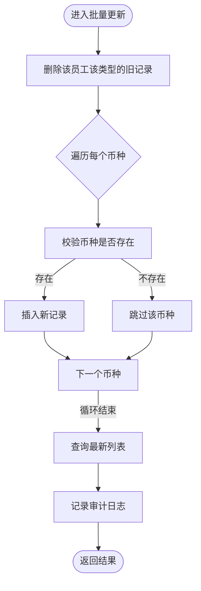

# 员工薪资管理API

<cite>
**本文引用的文件**
- [backend/src/routes/employee-salaries.ts](file://backend/src/routes/employee-salaries.ts)
- [backend/src/services/SalaryService.ts](file://backend/src/services/SalaryService.ts)
- [backend/src/db/schema.ts](file://backend/src/db/schema.ts)
- [backend/src/utils/permissions.ts](file://backend/src/utils/permissions.ts)
- [backend/src/utils/audit.ts](file://backend/src/utils/audit.ts)
- [backend/test/routes/employee-salaries.test.ts](file://backend/test/routes/employee-salaries.test.ts)
- [frontend/src/features/employees/components/modals/SalaryConfigModal.tsx](file://frontend/src/features/employees/components/modals/SalaryConfigModal.tsx)
- [frontend/src/utils/formatters.ts](file://frontend/src/utils/formatters.ts)
</cite>

## 目录
1. [简介](#简介)
2. [项目结构](#项目结构)
3. [核心组件](#核心组件)
4. [架构总览](#架构总览)
5. [详细组件分析](#详细组件分析)
6. [依赖关系分析](#依赖关系分析)
7. [性能考量](#性能考量)
8. [故障排查指南](#故障排查指南)
9. [结论](#结论)
10. [附录](#附录)

## 简介
本文件面向财务与HR系统中的“员工薪资管理API”，围绕以下能力提供完整说明：
- 获取薪资列表：按员工与薪资类型筛选
- 创建或更新薪资：同一员工同类型同币种自动去重更新
- 批量更新薪资：一次请求更新多种币种的薪资
- 删除薪资记录
- 解释薪资类型（试用期/正式）与币种维度设计
- 说明金额以“分为单位”的设计原因与最佳实践
- 提供批量更新多个币种薪资的请求示例路径

## 项目结构
后端采用Hono路由+Drizzle ORM，前端通过Ant Design表单与Zod校验进行交互；测试覆盖了关键路由行为。


图表来源
- [backend/src/routes/employee-salaries.ts](file://backend/src/routes/employee-salaries.ts#L1-L251)
- [backend/src/services/SalaryService.ts](file://backend/src/services/SalaryService.ts#L1-L140)
- [backend/src/db/schema.ts](file://backend/src/db/schema.ts#L202-L211)
- [backend/src/utils/permissions.ts](file://backend/src/utils/permissions.ts#L80-L115)
- [backend/src/utils/audit.ts](file://backend/src/utils/audit.ts#L61-L92)
- [frontend/src/features/employees/components/modals/SalaryConfigModal.tsx](file://frontend/src/features/employees/components/modals/SalaryConfigModal.tsx#L1-L111)
- [frontend/src/utils/formatters.ts](file://frontend/src/utils/formatters.ts#L1-L34)

章节来源
- [backend/src/routes/employee-salaries.ts](file://backend/src/routes/employee-salaries.ts#L1-L251)
- [backend/src/services/SalaryService.ts](file://backend/src/services/SalaryService.ts#L1-L140)
- [backend/src/db/schema.ts](file://backend/src/db/schema.ts#L202-L211)
- [frontend/src/features/employees/components/modals/SalaryConfigModal.tsx](file://frontend/src/features/employees/components/modals/SalaryConfigModal.tsx#L1-L111)

## 核心组件
- 路由层：定义四个核心API，分别处理查询、创建/更新、批量更新、删除。
- 服务层：封装数据库读写、批量更新策略与结果映射。
- 数据库模式：定义员工薪资表结构，含薪资类型、币种、金额（分为单位）、生效日期等字段。
- 权限与审计：路由在关键操作前校验权限，并记录审计日志。
- 前端交互：提供多币种底薪配置弹窗，金额以“元”输入，内部转换为“分”。

章节来源
- [backend/src/routes/employee-salaries.ts](file://backend/src/routes/employee-salaries.ts#L45-L251)
- [backend/src/services/SalaryService.ts](file://backend/src/services/SalaryService.ts#L1-L140)
- [backend/src/db/schema.ts](file://backend/src/db/schema.ts#L202-L211)
- [backend/src/utils/permissions.ts](file://backend/src/utils/permissions.ts#L80-L115)
- [backend/src/utils/audit.ts](file://backend/src/utils/audit.ts#L61-L92)
- [frontend/src/features/employees/components/modals/SalaryConfigModal.tsx](file://frontend/src/features/employees/components/modals/SalaryConfigModal.tsx#L1-L111)

## 架构总览
下图展示API调用链路与数据流：


图表来源
- [backend/src/routes/employee-salaries.ts](file://backend/src/routes/employee-salaries.ts#L45-L251)
- [backend/src/services/SalaryService.ts](file://backend/src/services/SalaryService.ts#L1-L140)
- [backend/src/db/schema.ts](file://backend/src/db/schema.ts#L202-L211)
- [backend/src/utils/permissions.ts](file://backend/src/utils/permissions.ts#L80-L115)
- [backend/src/utils/audit.ts](file://backend/src/utils/audit.ts#L61-L92)

## 详细组件分析

### 路由与API定义
- 查询薪资列表
  - 方法与路径：GET /api/employee-salaries
  - 请求参数：employeeId（必填），salaryType（可选）
  - 返回：results 数组，每项包含 id、employeeId、salaryType、currencyId、amountCents、effectiveDate、createdAt、updatedAt、currencyName、employeeName
- 创建或更新薪资
  - 方法与路径：POST /api/employee-salaries
  - 请求体：employeeId、salaryType（枚举：probation/regular）、currencyId、amountCents
  - 业务逻辑：若同一员工、同一薪资类型、同一币种已存在，则更新金额；否则新建
  - 返回：单条薪资记录
- 批量更新薪资
  - 方法与路径：PUT /api/employee-salaries/batch
  - 请求体：employeeId、salaryType（枚举：probation/regular）、salaries（数组，元素含 currencyId、amountCents）
  - 业务逻辑：先删除该员工该类型的旧记录，再插入新列表
  - 返回：更新后的列表
- 删除薪资
  - 方法与路径：DELETE /api/employee-salaries/{id}
  - 返回：{ ok: true }

章节来源
- [backend/src/routes/employee-salaries.ts](file://backend/src/routes/employee-salaries.ts#L45-L251)

### 服务层实现要点
- list(employeeId, salaryType?)
  - 支持按员工与薪资类型过滤，关联币种与员工名称，按薪资类型与币种排序
- create(data)
  - 插入新记录，返回最新记录
- update(id, { amountCents })
  - 更新金额与更新时间戳，返回最新记录
- delete(id)
  - 删除并返回被删除记录
- batchUpdate(employeeId, salaryType, [{ currencyId, amountCents }])
  - 删除旧记录，逐条校验币种存在性后插入新记录，最后查询并返回最新列表

章节来源
- [backend/src/services/SalaryService.ts](file://backend/src/services/SalaryService.ts#L1-L140)

### 数据库模式
- 员工薪资表（employee_salaries）
  - 字段：id、employeeId、salaryType（'probation' | 'regular'）、currencyId、amountCents、effectiveDate、createdAt、updatedAt
  - 关联：与 currencies 通过 code=currencyId 连接，与 employees 通过 id=employeeId 连接

章节来源
- [backend/src/db/schema.ts](file://backend/src/db/schema.ts#L202-L211)

### 权限与审计
- 权限
  - 创建/更新薪资需要权限：hr.salary.create 或 hr.salary.update
- 审计
  - 对 create/update/delete 操作记录审计日志，包含实体、实体ID、详情、IP与IP归属地

章节来源
- [backend/src/utils/permissions.ts](file://backend/src/utils/permissions.ts#L80-L115)
- [backend/src/utils/audit.ts](file://backend/src/utils/audit.ts#L61-L92)

### 前端交互与金额格式化
- 多币种底薪配置弹窗
  - 输入：币种选择 + 金额（元）
  - 保存：将金额乘以100转换为“分”，发送到批量更新接口
- 金额格式化
  - 将“分”转换为“元”字符串显示（保留两位小数）

章节来源
- [frontend/src/features/employees/components/modals/SalaryConfigModal.tsx](file://frontend/src/features/employees/components/modals/SalaryConfigModal.tsx#L1-L111)
- [frontend/src/utils/formatters.ts](file://frontend/src/utils/formatters.ts#L1-L34)

## 依赖关系分析

```mermaid
classDiagram
class 路由层 {
+GET /employee-salaries
+POST /employee-salaries
+PUT /employee-salaries/batch
+DELETE /employee-salaries/{id}
}
class 服务层 {
+list(employeeId, salaryType?)
+create(data)
+update(id, data)
+delete(id)
+batchUpdate(employeeId, salaryType, salaries)
}
class 数据库模式 {
+employee_salaries
+currencies
+employees
}
class 权限工具 {
+hasPermission(module, subModule, action)
}
class 审计工具 {
+logAuditAction(...)
}
路由层 --> 服务层 : "调用"
服务层 --> 数据库模式 : "读写"
路由层 --> 权限工具 : "校验权限"
路由层 --> 审计工具 : "记录审计"
```

图表来源
- [backend/src/routes/employee-salaries.ts](file://backend/src/routes/employee-salaries.ts#L45-L251)
- [backend/src/services/SalaryService.ts](file://backend/src/services/SalaryService.ts#L1-L140)
- [backend/src/db/schema.ts](file://backend/src/db/schema.ts#L202-L211)
- [backend/src/utils/permissions.ts](file://backend/src/utils/permissions.ts#L80-L115)
- [backend/src/utils/audit.ts](file://backend/src/utils/audit.ts#L61-L92)

章节来源
- [backend/src/routes/employee-salaries.ts](file://backend/src/routes/employee-salaries.ts#L45-L251)
- [backend/src/services/SalaryService.ts](file://backend/src/services/SalaryService.ts#L1-L140)
- [backend/src/db/schema.ts](file://backend/src/db/schema.ts#L202-L211)
- [backend/src/utils/permissions.ts](file://backend/src/utils/permissions.ts#L80-L115)
- [backend/src/utils/audit.ts](file://backend/src/utils/audit.ts#L61-L92)

## 性能考量
- 查询排序：按薪资类型与币种排序，有利于前端展示与对比
- 批量更新策略：先删除旧记录再插入新记录，避免重复插入导致的索引膨胀；建议在高并发场景下对同一员工同一类型加锁或使用事务
- 金额存储：统一以“分”存储，避免浮点误差；前端以“元”输入，内部转换为整数“分”
- 审计日志：异步记录，避免阻塞主流程

[本节为通用指导，不直接分析具体文件]

## 故障排查指南
- 权限不足
  - 现象：返回403
  - 排查：确认用户职位权限是否包含 hr.salary.create/update
- 记录不存在
  - 现象：删除接口返回404
  - 排查：确认id是否存在
- 重复记录问题
  - 现象：创建接口未新增重复币种记录
  - 机制：同一员工、同一薪资类型、同一币种会自动更新而非创建
- 批量更新异常
  - 现象：部分币种未更新
  - 排查：检查币种code是否存在；服务层会对不存在币种跳过插入

章节来源
- [backend/src/routes/employee-salaries.ts](file://backend/src/routes/employee-salaries.ts#L116-L154)
- [backend/src/routes/employee-salaries.ts](file://backend/src/routes/employee-salaries.ts#L183-L213)
- [backend/src/routes/employee-salaries.ts](file://backend/src/routes/employee-salaries.ts#L238-L249)
- [backend/src/services/SalaryService.ts](file://backend/src/services/SalaryService.ts#L86-L138)

## 结论
本API围绕“员工-薪资类型-币种”三元组实现了高效、清晰的薪资管理能力。通过“同类型同币种自动更新”的策略，避免了重复记录；批量更新保证了多币种场景的一致性；前后端金额以“分为单位”的设计，兼顾精度与易用性。配合权限与审计，满足企业合规与安全要求。

[本节为总结，不直接分析具体文件]

## 附录

### API定义与示例路径
- 获取薪资列表
  - 方法：GET
  - 路径：/api/employee-salaries
  - 参数：employeeId（必填），salaryType（可选）
  - 示例请求路径参考：[backend/test/routes/employee-salaries.test.ts](file://backend/test/routes/employee-salaries.test.ts#L52-L76)
- 创建或更新薪资
  - 方法：POST
  - 路径：/api/employee-salaries
  - 请求体字段：employeeId、salaryType（probation/regular）、currencyId、amountCents
  - 示例请求路径参考：[backend/test/routes/employee-salaries.test.ts](file://backend/test/routes/employee-salaries.test.ts#L78-L111)
- 批量更新薪资
  - 方法：PUT
  - 路径：/api/employee-salaries/batch
  - 请求体字段：employeeId、salaryType（probation/regular）、salaries（数组，元素含 currencyId、amountCents）
  - 示例请求路径参考：[backend/test/routes/employee-salaries.test.ts](file://backend/test/routes/employee-salaries.test.ts#L113-L143)
- 删除薪资
  - 方法：DELETE
  - 路径：/api/employee-salaries/{id}
  - 示例请求路径参考：[backend/test/routes/employee-salaries.test.ts](file://backend/test/routes/employee-salaries.test.ts#L145-L155)

章节来源
- [backend/test/routes/employee-salaries.test.ts](file://backend/test/routes/employee-salaries.test.ts#L52-L155)

### 薪资类型说明
- 试用期（probation）
  - 场景：员工刚入职，尚未转正
  - 适用：试用期底薪配置与发放
- 正式（regular）
  - 场景：员工已转正
  - 适用：正式底薪配置与发放

章节来源
- [backend/src/routes/employee-salaries.ts](file://backend/src/routes/employee-salaries.ts#L27-L41)

### 自动更新逻辑流程


图表来源
- [backend/src/routes/employee-salaries.ts](file://backend/src/routes/employee-salaries.ts#L116-L154)

### 批量更新算法流程


图表来源
- [backend/src/services/SalaryService.ts](file://backend/src/services/SalaryService.ts#L86-L138)

### 金额以“分为单位”的设计原因与最佳实践
- 设计原因
  - 避免浮点运算误差，保证财务计算精度
  - 统一存储与传输格式，便于跨语言与跨系统一致性
- 最佳实践
  - 前端以“元”输入，内部乘以100转换为“分”存储
  - 显示时将“分”转换为“元”字符串（保留两位小数）
  - 与前端表单联动，确保输入合法且非负

章节来源
- [frontend/src/features/employees/components/modals/SalaryConfigModal.tsx](file://frontend/src/features/employees/components/modals/SalaryConfigModal.tsx#L27-L61)
- [frontend/src/utils/formatters.ts](file://frontend/src/utils/formatters.ts#L1-L11)
- [backend/src/db/schema.ts](file://backend/src/db/schema.ts#L202-L211)