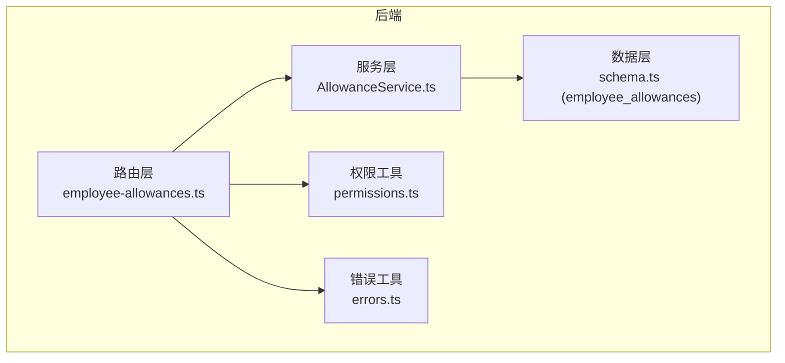
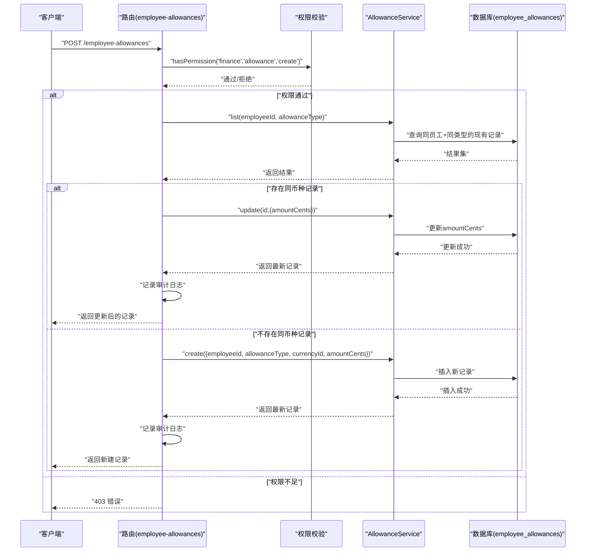
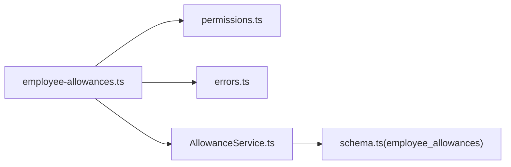

# 员工补贴管理API

<cite>
**本文引用的文件**
- [backend/src/routes/employee-allowances.ts](file://backend/src/routes/employee-allowances.ts)
- [backend/src/services/AllowanceService.ts](file://backend/src/services/AllowanceService.ts)
- [backend/src/db/schema.ts](file://backend/src/db/schema.ts)
- [backend/src/utils/permissions.ts](file://backend/src/utils/permissions.ts)
- [backend/src/utils/errors.ts](file://backend/src/utils/errors.ts)
- [backend/src/routes/employee-salaries.ts](file://backend/src/routes/employee-salaries.ts)
- [backend/src/services/SalaryService.ts](file://backend/src/services/SalaryService.ts)
- [frontend/src/validations/employee.schema.ts](file://frontend/src/validations/employee.schema.ts)
- [frontend/src/features/hr/pages/CreateEmployee.tsx](file://frontend/src/features/hr/pages/CreateEmployee.tsx)
- [backend/test/routes/employee-allowances.test.ts](file://backend/test/routes/employee-allowances.test.ts)
</cite>

## 目录
1. [简介](#简介)
2. [项目结构](#项目结构)
3. [核心组件](#核心组件)
4. [架构总览](#架构总览)
5. [详细组件分析](#详细组件分析)
6. [依赖关系分析](#依赖关系分析)
7. [性能考量](#性能考量)
8. [故障排查指南](#故障排查指南)
9. [结论](#结论)
10. [附录](#附录)

## 简介
本文件面向财务（finance）部门，提供“员工补贴管理API”的权威文档。该API支持以下能力：
- 查询员工补贴：按员工与补贴类型筛选
- 创建或更新单个币种补贴：若同币种已存在则更新，否则新建
- 批量更新某类型补贴：先清空该员工该类型的旧配置，再按传入币种集合写入新配置
- 删除单条补贴记录

同时，本文解释补贴类型（allowanceType）的可扩展设计，支持生活补贴（living）、住房补贴（housing）、交通补贴（transportation）、餐补（meal）等；并对比薪资管理API的设计差异，说明两者在数据模型、权限与流程上的相似性与区别。最后给出为员工配置多种币种补贴的请求示例，并强调该功能由财务部门负责的权限设计。

## 项目结构
后端采用分层架构：
- 路由层：定义OpenAPI路由与请求/响应校验
- 服务层：封装数据库读写与业务逻辑
- 数据层：Drizzle ORM映射SQLite表结构
- 工具层：权限校验、错误处理、审计日志



图表来源
- [backend/src/routes/employee-allowances.ts](file://backend/src/routes/employee-allowances.ts#L1-L245)
- [backend/src/services/AllowanceService.ts](file://backend/src/services/AllowanceService.ts#L1-L140)
- [backend/src/db/schema.ts](file://backend/src/db/schema.ts#L213-L221)
- [backend/src/utils/permissions.ts](file://backend/src/utils/permissions.ts#L80-L114)
- [backend/src/utils/errors.ts](file://backend/src/utils/errors.ts#L34-L54)

章节来源
- [backend/src/routes/employee-allowances.ts](file://backend/src/routes/employee-allowances.ts#L1-L245)
- [backend/src/services/AllowanceService.ts](file://backend/src/services/AllowanceService.ts#L1-L140)
- [backend/src/db/schema.ts](file://backend/src/db/schema.ts#L213-L221)

## 核心组件
- 路由与校验
  - 列表查询、创建/更新、批量更新、删除
  - 使用Zod对请求体与查询参数进行严格校验
- 服务层
  - 提供list、create、update、delete、batchUpdate等方法
  - 批量更新会先清理旧记录，再按传入币种集合插入
- 数据层
  - 表employee_allowances存储员工补贴，字段包括allowanceType、currencyId、amountCents等
- 权限与错误
  - 使用统一权限校验函数与错误构造器
  - 审计日志记录关键操作

章节来源
- [backend/src/routes/employee-allowances.ts](file://backend/src/routes/employee-allowances.ts#L43-L244)
- [backend/src/services/AllowanceService.ts](file://backend/src/services/AllowanceService.ts#L10-L138)
- [backend/src/db/schema.ts](file://backend/src/db/schema.ts#L213-L221)
- [backend/src/utils/permissions.ts](file://backend/src/utils/permissions.ts#L80-L114)
- [backend/src/utils/errors.ts](file://backend/src/utils/errors.ts#L34-L54)

## 架构总览
下面以序列图展示“创建或更新”流程（POST /employee-allowances），体现路由、权限、服务与审计的交互。



图表来源
- [backend/src/routes/employee-allowances.ts](file://backend/src/routes/employee-allowances.ts#L86-L149)
- [backend/src/services/AllowanceService.ts](file://backend/src/services/AllowanceService.ts#L10-L84)
- [backend/src/utils/permissions.ts](file://backend/src/utils/permissions.ts#L80-L114)
- [backend/src/utils/errors.ts](file://backend/src/utils/errors.ts#L34-L54)

## 详细组件分析

### API定义与行为
- 查询员工补贴
  - 方法：GET /employee-allowances
  - 查询参数：employeeId（必填），allowanceType（可选）
  - 返回：results数组，每项包含id、employeeId、allowanceType、currencyId、amountCents、createdAt、updatedAt、currencyName、employeeName
- 创建或更新员工补贴
  - 方法：POST /employee-allowances
  - 请求体：employeeId、allowanceType、currencyId、amountCents
  - 行为：若同员工+同类型+同币种已存在，则更新amountCents；否则新建
  - 返回：单条补贴记录
- 批量更新员工补贴
  - 方法：PUT /employee-allowances/batch
  - 请求体：employeeId、allowanceType、allowances[{currencyId, amountCents}]
  - 行为：先删除该员工该类型的所有旧记录，再按传入币种集合插入新记录
  - 返回：该员工该类型下的全部补贴记录
- 删除员工补贴
  - 方法：DELETE /employee-allowances/{id}
  - 权限：finance.allowance.update
  - 返回：{ok: true}

章节来源
- [backend/src/routes/employee-allowances.ts](file://backend/src/routes/employee-allowances.ts#L43-L244)

### 数据模型与可扩展性
- 表结构
  - 表名：employee_allowances
  - 关键字段：employeeId、allowanceType、currencyId、amountCents、createdAt、updatedAt
- 可扩展性设计
  - allowanceType为字符串字段，可在业务上约定枚举值（如living、housing、transportation、meal等）
  - 批量更新策略天然支持多币种配置：先清空旧配置，再写入新集合
  - 币种约束：服务层在批量更新时会校验币种是否存在，避免脏数据

章节来源
- [backend/src/db/schema.ts](file://backend/src/db/schema.ts#L213-L221)
- [backend/src/services/AllowanceService.ts](file://backend/src/services/AllowanceService.ts#L86-L138)

### 权限与职责边界
- 财务部门专属
  - POST/PUT /employee-allowances：需要权限 finance.allowance.create
  - DELETE /employee-allowances/{id}：需要权限 finance.allowance.update
- HR部门职责
  - 薪资管理API（/employee-salaries）由HR负责，权限为hr.salary.create/update
- 设计差异
  - 薪资API支持probation与regular两种salaryType；补贴API支持多种allowanceType
  - 两者均支持批量更新，但触发权限不同

章节来源
- [backend/src/routes/employee-allowances.ts](file://backend/src/routes/employee-allowances.ts#L113-L149)
- [backend/src/routes/employee-allowances.ts](file://backend/src/routes/employee-allowances.ts#L179-L207)
- [backend/src/routes/employee-allowances.ts](file://backend/src/routes/employee-allowances.ts#L233-L243)
- [backend/src/routes/employee-salaries.ts](file://backend/src/routes/employee-salaries.ts#L117-L154)
- [backend/src/routes/employee-salaries.ts](file://backend/src/routes/employee-salaries.ts#L184-L213)
- [backend/src/routes/employee-salaries.ts](file://backend/src/routes/employee-salaries.ts#L239-L249)

### 多币种配置示例（请求路径）
- 为员工配置多种币种补贴（例如生活、住房、交通、餐补）的请求路径参考：
  - 批量更新接口：PUT /employee-allowances/batch
  - 请求体字段：employeeId、allowanceType（如living/housing/transportation/meal）、allowances[{currencyId, amountCents}]
- 前端侧多币种配置界面
  - 前端页面中针对不同allowanceType（living/housing/transportation/meal）提供币种列表配置
  - 币种列表来源于币种管理接口，确保currencyId有效

章节来源
- [backend/src/routes/employee-allowances.ts](file://backend/src/routes/employee-allowances.ts#L152-L207)
- [frontend/src/features/hr/pages/CreateEmployee.tsx](file://frontend/src/features/hr/pages/CreateEmployee.tsx#L279-L292)
- [frontend/src/validations/employee.schema.ts](file://frontend/src/validations/employee.schema.ts#L30-L48)

### 类图（代码级）
```mermaid
classDiagram
class EmployeeAllowancesRoutes {
+GET "/employee-allowances"
+POST "/employee-allowances"
+PUT "/employee-allowances/batch"
+DELETE "/employee-allowances/{id}"
}
class AllowanceService {
+list(employeeId, allowanceType)
+create(data)
+update(id, data)
+delete(id)
+get(id)
+batchUpdate(employeeId, allowanceType, allowances)
}
class Schema_employee_allowances {
+id
+employeeId
+allowanceType
+currencyId
+amountCents
+createdAt
+updatedAt
}
EmployeeAllowancesRoutes --> AllowanceService : "调用"
AllowanceService --> Schema_employee_allowances : "读写"
```

图表来源
- [backend/src/routes/employee-allowances.ts](file://backend/src/routes/employee-allowances.ts#L43-L244)
- [backend/src/services/AllowanceService.ts](file://backend/src/services/AllowanceService.ts#L10-L138)
- [backend/src/db/schema.ts](file://backend/src/db/schema.ts#L213-L221)

## 依赖关系分析
- 路由依赖权限工具与错误工具
- 服务层依赖数据库Schema
- 前端校验与后端Zod校验相互印证



图表来源
- [backend/src/routes/employee-allowances.ts](file://backend/src/routes/employee-allowances.ts#L1-L245)
- [backend/src/services/AllowanceService.ts](file://backend/src/services/AllowanceService.ts#L1-L140)
- [backend/src/db/schema.ts](file://backend/src/db/schema.ts#L213-L221)
- [backend/src/utils/permissions.ts](file://backend/src/utils/permissions.ts#L80-L114)
- [backend/src/utils/errors.ts](file://backend/src/utils/errors.ts#L34-L54)

章节来源
- [backend/src/routes/employee-allowances.ts](file://backend/src/routes/employee-allowances.ts#L1-L245)
- [backend/src/services/AllowanceService.ts](file://backend/src/services/AllowanceService.ts#L1-L140)
- [backend/src/db/schema.ts](file://backend/src/db/schema.ts#L213-L221)
- [backend/src/utils/permissions.ts](file://backend/src/utils/permissions.ts#L80-L114)
- [backend/src/utils/errors.ts](file://backend/src/utils/errors.ts#L34-L54)

## 性能考量
- 批量更新策略
  - 先删除后插入，适合“全量替换”的场景，避免重复记录与并发冲突
  - 对于大量币种的场景，建议前端按需提交，减少不必要的删除/插入次数
- 查询排序
  - 服务层按allowanceType与currency.code排序，便于前端展示与比对
- 审计日志
  - 每次创建/更新/删除均记录审计，建议结合异步队列或后台任务降低主流程延迟

[本节为通用指导，不直接分析具体文件]

## 故障排查指南
- 常见错误码
  - 403：权限不足（finance.allowance.create/update）
  - 404：删除时记录不存在
  - 400/409：请求参数校验失败或重复
  - 500：服务器内部错误
- 排查步骤
  - 确认当前用户具备finance.allowance相关权限
  - 检查请求体字段：employeeId、allowanceType、currencyId、amountCents
  - 若批量更新失败，确认currencyId在币种表中存在
  - 查看审计日志定位具体操作时间点与详情

章节来源
- [backend/src/utils/errors.ts](file://backend/src/utils/errors.ts#L34-L54)
- [backend/src/routes/employee-allowances.ts](file://backend/src/routes/employee-allowances.ts#L113-L149)
- [backend/src/routes/employee-allowances.ts](file://backend/src/routes/employee-allowances.ts#L179-L207)
- [backend/src/routes/employee-allowances.ts](file://backend/src/routes/employee-allowances.ts#L233-L243)

## 结论
- 员工补贴管理API围绕“allowanceType + currencyId”的组合实现“同类型多币种”配置，支持查询、创建/更新、批量更新与删除
- 该功能由财务部门负责，权限明确，流程清晰
- 与薪资管理API相比，两者在数据模型、权限与流程上相似，但在allowanceType与salaryType的取值与职责归属上有明显差异

[本节为总结，不直接分析具体文件]

## 附录

### API一览（路径与权限）
- GET /employee-allowances
  - 查询参数：employeeId（必填），allowanceType（可选）
  - 返回：results数组
- POST /employee-allowances
  - 请求体：employeeId、allowanceType、currencyId、amountCents
  - 权限：finance.allowance.create
  - 行为：若同员工+同类型+同币种存在则更新，否则新建
- PUT /employee-allowances/batch
  - 请求体：employeeId、allowanceType、allowances[{currencyId, amountCents}]
  - 权限：finance.allowance.create
  - 行为：先清空该员工该类型的所有旧记录，再按传入币种集合插入
- DELETE /employee-allowances/{id}
  - 权限：finance.allowance.update
  - 行为：删除指定补贴记录

章节来源
- [backend/src/routes/employee-allowances.ts](file://backend/src/routes/employee-allowances.ts#L43-L244)

### 与薪资管理API的对比
- 相似点
  - 均支持查询、创建/更新、批量更新、删除
  - 均通过服务层封装数据库操作
- 不同点
  - 薪资API：salaryType限定为probation/regular，权限为hr.salary.create/update
  - 补贴API：allowanceType可扩展为living/housing/transportation/meal等，权限为finance.allowance.create/update

章节来源
- [backend/src/routes/employee-salaries.ts](file://backend/src/routes/employee-salaries.ts#L45-L250)
- [backend/src/services/SalaryService.ts](file://backend/src/services/SalaryService.ts#L10-L138)
- [backend/src/routes/employee-allowances.ts](file://backend/src/routes/employee-allowances.ts#L86-L243)

### 测试用例参考
- 列表、创建、批量更新、删除均有单元测试覆盖，可作为集成测试的参考模板

章节来源
- [backend/test/routes/employee-allowances.test.ts](file://backend/test/routes/employee-allowances.test.ts#L52-L155)