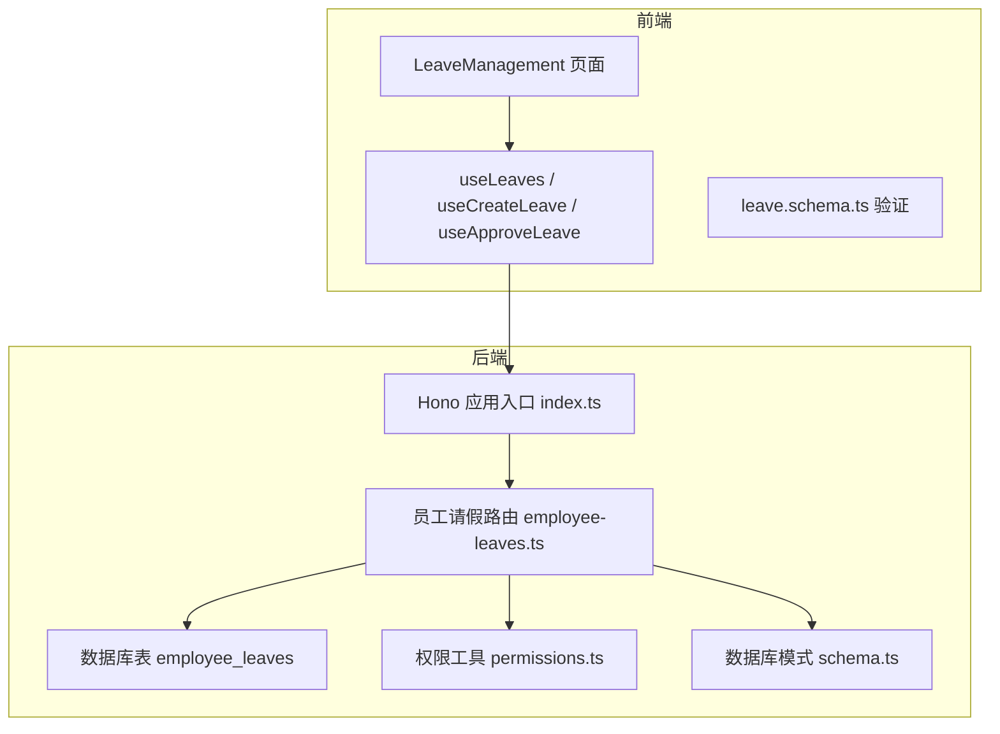
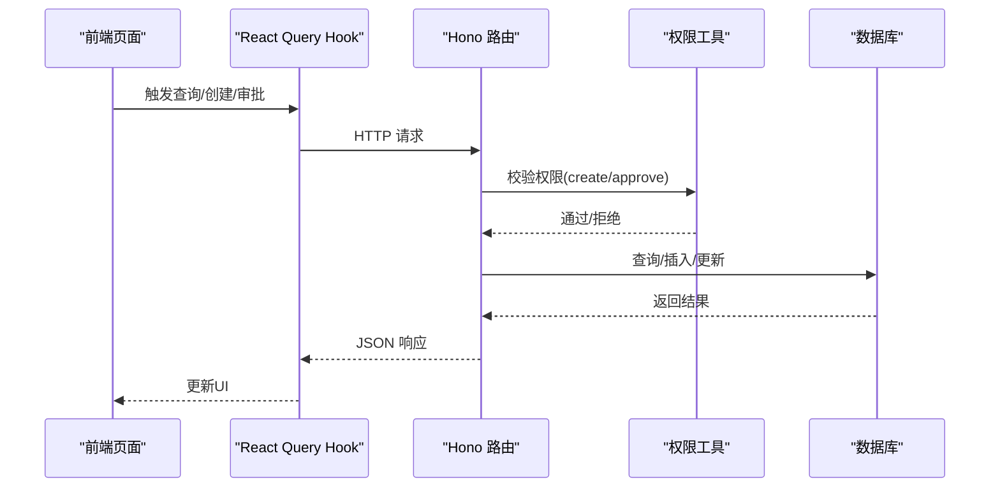
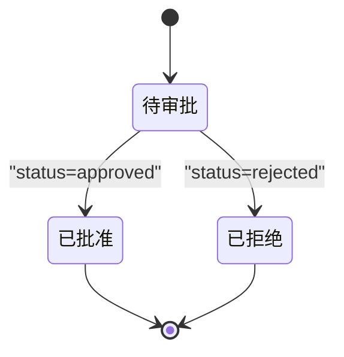

# 员工请假管理API

<cite>
**本文引用的文件**
- [backend/src/routes/employee-leaves.ts](file://backend/src/routes/employee-leaves.ts)
- [backend/src/index.ts](file://backend/src/index.ts)
- [backend/src/db/schema.ts](file://backend/src/db/schema.ts)
- [backend/src/utils/permissions.ts](file://backend/src/utils/permissions.ts)
- [frontend/src/features/hr/pages/LeaveManagement.tsx](file://frontend/src/features/hr/pages/LeaveManagement.tsx)
- [frontend/src/hooks/business/useLeaves.ts](file://frontend/src/hooks/business/useLeaves.ts)
- [frontend/src/validations/leave.schema.ts](file://frontend/src/validations/leave.schema.ts)
- [backend/src/services/AnnualLeaveService.ts](file://backend/src/services/AnnualLeaveService.ts)
</cite>

## 目录
1. [简介](#简介)
2. [项目结构](#项目结构)
3. [核心组件](#核心组件)
4. [架构总览](#架构总览)
5. [详细组件分析](#详细组件分析)
6. [依赖关系分析](#依赖关系分析)
7. [性能考虑](#性能考虑)
8. [故障排查指南](#故障排查指南)
9. [结论](#结论)
10. [附录](#附录)

## 简介
本文件面向“员工请假管理API”的完整使用说明，覆盖以下核心流程：
- 请假申请创建：POST /api/employee-leaves
- 请假查询：GET /api/employee-leaves
- 审批状态更新：PUT /api/employee-leaves/{id}/status

同时，文档详细说明请假状态生命周期（pending → approved 或 rejected）、审批人与审批时间字段的自动填充机制、请假类型与关键字段（leaveType、startDate、endDate、days、reason）的约束与示例，并解释权限控制如何区分“创建”和“审批”的不同权限要求。

## 项目结构
后端采用 Hono + Drizzle ORM 的轻量架构，前端使用 React + Ant Design + TanStack Query 实现请假管理界面与数据交互。请假管理API位于后端路由模块中，数据库表结构定义在 schema 中，权限控制通过中间件与工具函数实现。



图表来源
- [backend/src/index.ts](file://backend/src/index.ts#L118-L119)
- [backend/src/routes/employee-leaves.ts](file://backend/src/routes/employee-leaves.ts#L44-L209)
- [backend/src/db/schema.ts](file://backend/src/db/schema.ts#L240-L254)
- [backend/src/utils/permissions.ts](file://backend/src/utils/permissions.ts#L88-L114)

章节来源
- [backend/src/index.ts](file://backend/src/index.ts#L118-L119)
- [backend/src/routes/employee-leaves.ts](file://backend/src/routes/employee-leaves.ts#L44-L209)
- [backend/src/db/schema.ts](file://backend/src/db/schema.ts#L240-L254)
- [backend/src/utils/permissions.ts](file://backend/src/utils/permissions.ts#L88-L114)

## 核心组件
- 后端路由模块：负责定义三个核心API端点、参数校验、业务处理与响应。
- 数据库表：employee_leaves 存储请假记录，包含状态、审批人、审批时间等字段。
- 权限工具：基于职位与模块权限判断，区分“创建请假”和“审批请假”的权限。
- 前端页面与Hook：提供请假列表、创建、编辑、审批的UI与数据流；使用Zod进行表单校验。

章节来源
- [backend/src/routes/employee-leaves.ts](file://backend/src/routes/employee-leaves.ts#L11-L41)
- [backend/src/db/schema.ts](file://backend/src/db/schema.ts#L240-L254)
- [backend/src/utils/permissions.ts](file://backend/src/utils/permissions.ts#L88-L114)
- [frontend/src/features/hr/pages/LeaveManagement.tsx](file://frontend/src/features/hr/pages/LeaveManagement.tsx#L1-L120)
- [frontend/src/hooks/business/useLeaves.ts](file://frontend/src/hooks/business/useLeaves.ts#L1-L103)
- [frontend/src/validations/leave.schema.ts](file://frontend/src/validations/leave.schema.ts#L1-L32)

## 架构总览
请假管理API的调用链路如下：
- 前端通过 useLeaves/useCreateLeave/useApproveLeave 发起HTTP请求
- Hono 路由根据路径与方法匹配到对应处理器
- 处理器执行权限校验、参数校验、数据库操作与响应构造
- 数据库表 employee_leaves 存储请假记录与状态变更历史



图表来源
- [frontend/src/hooks/business/useLeaves.ts](file://frontend/src/hooks/business/useLeaves.ts#L29-L103)
- [backend/src/routes/employee-leaves.ts](file://backend/src/routes/employee-leaves.ts#L133-L209)
- [backend/src/utils/permissions.ts](file://backend/src/utils/permissions.ts#L88-L114)
- [backend/src/db/schema.ts](file://backend/src/db/schema.ts#L240-L254)

## 详细组件分析

### 1) 请假申请创建（POST /api/employee-leaves）
- 功能要点
  - 参数校验：employeeId、leaveType、startDate、endDate、days、reason、memo
  - 自动填充：status 默认为 pending，createdAt/updatedAt 设为当前时间戳
  - 响应：返回完整请假记录对象
- 关键字段
  - leaveType：请假类型（sick/annual/personal/other）
  - startDate/endDate：字符串日期（YYYY-MM-DD）
  - days：请假天数（数值）
  - reason：请假原因（可选）
  - memo：备注（可选）
- 权限要求
  - 需具备 hr.leave.create 权限
- 示例请求（仅路径与字段说明）
  - 方法：POST
  - 路径：/api/employee-leaves
  - 请求体字段：employeeId、leaveType、startDate、endDate、days、reason、memo
  - 响应体字段：id、employeeId、employeeName、leaveType、startDate、endDate、days、status、reason、memo、approvedBy、approvedAt、createdAt、updatedAt

章节来源
- [backend/src/routes/employee-leaves.ts](file://backend/src/routes/employee-leaves.ts#L106-L150)
- [backend/src/utils/permissions.ts](file://backend/src/utils/permissions.ts#L88-L114)
- [frontend/src/validations/leave.schema.ts](file://frontend/src/validations/leave.schema.ts#L1-L32)

### 2) 请假查询（GET /api/employee-leaves）
- 功能要点
  - 支持按 employeeId、status 过滤
  - 返回列表，包含员工姓名、请假详情、审批信息、时间戳
- 关键字段
  - 查询参数：employeeId、status
  - 响应字段：id、employeeId、employeeName、leaveType、startDate、endDate、days、status、reason、memo、approvedBy、approvedAt、createdAt、updatedAt
- 权限要求
  - 需通过 getUserPosition 校验（内部默认需要登录态）

章节来源
- [backend/src/routes/employee-leaves.ts](file://backend/src/routes/employee-leaves.ts#L44-L104)

### 3) 审批状态更新（PUT /api/employee-leaves/{id}/status）
- 功能要点
  - 支持将 status 更新为 pending、approved、rejected
  - 当 status 变更为 approved 或 rejected 时，自动填充 approvedBy 与 approvedAt 字段为当前用户ID与当前时间戳
  - 支持可选 memo 字段更新
  - 响应：返回 { success: true }
- 关键字段
  - 路径参数：id
  - 请求体：status（枚举）、memo（可选）
  - 响应体：{ success: boolean }
- 权限要求
  - 需具备 hr.leave.approve 权限
  - 审批人与审批时间字段的填充逻辑在处理器中实现

章节来源
- [backend/src/routes/employee-leaves.ts](file://backend/src/routes/employee-leaves.ts#L152-L209)
- [backend/src/utils/permissions.ts](file://backend/src/utils/permissions.ts#L88-L114)

### 4) 请假状态生命周期与字段填充
- 生命周期
  - 创建时：status 默认为 pending
  - 审批时：approvedBy 与 approvedAt 在状态变为 approved 或 rejected 时自动填充
- 字段说明
  - approvedBy：审批人ID（字符串）
  - approvedAt：审批时间戳（整数）
  - status：枚举值（pending/approved/rejected）



图表来源
- [backend/src/routes/employee-leaves.ts](file://backend/src/routes/employee-leaves.ts#L182-L209)

### 5) 请假类型与关键字段约束
- 请假类型（leaveType）
  - 取值范围：sick、annual、personal、other
- 日期与天数
  - startDate/endDate：字符串日期，结束日期不得早于开始日期
  - days：最小0.5天，支持半天
- 原因与备注
  - reason：必填且长度限制
  - memo：可选，长度限制

章节来源
- [frontend/src/validations/leave.schema.ts](file://frontend/src/validations/leave.schema.ts#L1-L32)
- [backend/src/routes/employee-leaves.ts](file://backend/src/routes/employee-leaves.ts#L11-L41)

### 6) 权限控制与角色差异
- 创建权限（create）
  - 路由处理器中通过 hasPermission('hr','leave','create') 校验
- 审批权限（approve）
  - 路由处理器中通过 hasPermission('hr','leave','approve') 校验
- 前端权限展示
  - 页面根据 hasPermission('hr','leave','view') 与 canManageSubordinates 判断显示“编辑/审批”按钮

章节来源
- [backend/src/routes/employee-leaves.ts](file://backend/src/routes/employee-leaves.ts#L133-L149)
- [backend/src/routes/employee-leaves.ts](file://backend/src/routes/employee-leaves.ts#L182-L189)
- [frontend/src/features/hr/pages/LeaveManagement.tsx](file://frontend/src/features/hr/pages/LeaveManagement.tsx#L68-L76)

### 7) 年假相关服务（可选扩展）
- 年假配置与统计
  - 提供年假周期、天数、已用天数、剩余天数等计算能力
  - 支持按周期查询已批准的年假天数
- 使用场景
  - 可在创建年假申请前进行额度校验，避免超额

章节来源
- [backend/src/services/AnnualLeaveService.ts](file://backend/src/services/AnnualLeaveService.ts#L1-L221)

## 依赖关系分析

```mermaid
classDiagram
class 员工请假路由 {
+GET /api/employee-leaves
+POST /api/employee-leaves
+PUT /api/employee-leaves/{id}/status
}
class 权限工具 {
+hasPermission(module, subModule, action)
+getUserPosition()
}
class 数据库表 {
+employee_leaves
}
class 前端Hook {
+useLeaves()
+useCreateLeave()
+useApproveLeave()
}
员工请假路由 --> 权限工具 : "校验权限"
员工请假路由 --> 数据库表 : "读写"
前端Hook --> 员工请假路由 : "HTTP 调用"
```

图表来源
- [backend/src/routes/employee-leaves.ts](file://backend/src/routes/employee-leaves.ts#L44-L209)
- [backend/src/utils/permissions.ts](file://backend/src/utils/permissions.ts#L88-L114)
- [backend/src/db/schema.ts](file://backend/src/db/schema.ts#L240-L254)
- [frontend/src/hooks/business/useLeaves.ts](file://frontend/src/hooks/business/useLeaves.ts#L1-L103)

章节来源
- [backend/src/routes/employee-leaves.ts](file://backend/src/routes/employee-leaves.ts#L44-L209)
- [backend/src/utils/permissions.ts](file://backend/src/utils/permissions.ts#L88-L114)
- [backend/src/db/schema.ts](file://backend/src/db/schema.ts#L240-L254)
- [frontend/src/hooks/business/useLeaves.ts](file://frontend/src/hooks/business/useLeaves.ts#L1-L103)

## 性能考虑
- 查询排序：按创建时间倒序，便于快速定位最新记录
- 分页与缓存：前端使用 React Query 的 staleTime 控制缓存新鲜度
- 数据库索引建议：对 employeeId、status、createdAt 建立索引可提升查询性能（建议在生产环境评估）
- 批量操作：当前API为单条记录操作，若需批量审批/查询，可在路由层扩展

[本节为通用建议，不直接分析具体文件]

## 故障排查指南
- 403 Forbidden
  - 现象：创建/审批时报错
  - 排查：确认当前用户是否具备 hr.leave.create 或 hr.leave.approve 权限
- 400 Bad Request
  - 现象：请求参数不符合约束
  - 排查：检查 leaveType、日期范围、days、reason 等字段是否满足前端与后端校验规则
- 审批字段未填充
  - 现象：approvedBy/approvedAt 为空
  - 排查：仅当 status 更新为 approved 或 rejected 时才会填充；确认请求体 status 是否为上述两值

章节来源
- [backend/src/routes/employee-leaves.ts](file://backend/src/routes/employee-leaves.ts#L133-L149)
- [backend/src/routes/employee-leaves.ts](file://backend/src/routes/employee-leaves.ts#L182-L209)
- [frontend/src/validations/leave.schema.ts](file://frontend/src/validations/leave.schema.ts#L1-L32)

## 结论
本文档系统性地梳理了员工请假管理API的三大核心端点、状态生命周期、权限控制与前后端协作方式。通过严格的参数校验与权限校验，确保请假流程的安全与合规；通过自动填充审批字段，简化审批操作并保证审计可追溯。建议在生产环境中结合数据库索引与前端缓存策略进一步优化性能。

[本节为总结，不直接分析具体文件]

## 附录

### A. API 定义与字段说明
- 创建请假（POST /api/employee-leaves）
  - 请求体字段：employeeId、leaveType、startDate、endDate、days、reason、memo
  - 响应体字段：id、employeeId、employeeName、leaveType、startDate、endDate、days、status、reason、memo、approvedBy、approvedAt、createdAt、updatedAt
- 查询请假（GET /api/employee-leaves）
  - 查询参数：employeeId、status
  - 响应体：数组，元素为上述响应体字段
- 审批状态更新（PUT /api/employee-leaves/{id}/status）
  - 路径参数：id
  - 请求体：status（枚举）、memo（可选）
  - 响应体：{ success: boolean }

章节来源
- [backend/src/routes/employee-leaves.ts](file://backend/src/routes/employee-leaves.ts#L44-L209)

### B. 数据库表结构（employee_leaves）
- 关键字段
  - id、employeeId、leaveType、startDate、endDate、days、status、reason、memo、approvedBy、approvedAt、createdAt、updatedAt

章节来源
- [backend/src/db/schema.ts](file://backend/src/db/schema.ts#L240-L254)

### C. 权限矩阵（简述）
- 创建请假：hr.leave.create
- 审批请假：hr.leave.approve
- 前端按钮显示：hr.leave.view 与 canManageSubordinates

章节来源
- [backend/src/utils/permissions.ts](file://backend/src/utils/permissions.ts#L88-L114)
- [frontend/src/features/hr/pages/LeaveManagement.tsx](file://frontend/src/features/hr/pages/LeaveManagement.tsx#L68-L76)