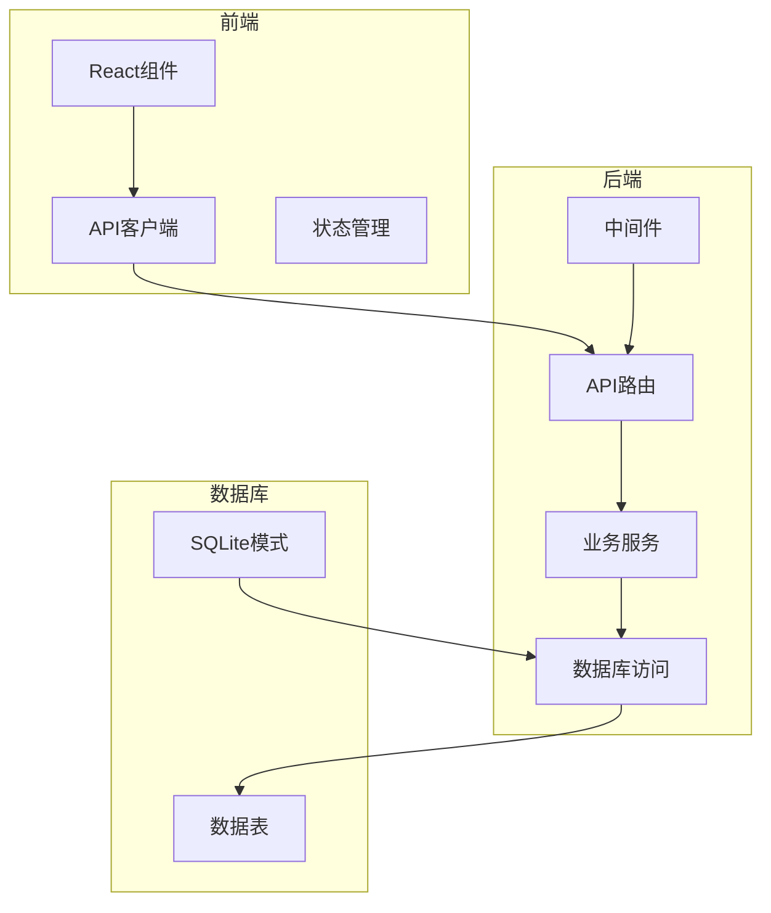
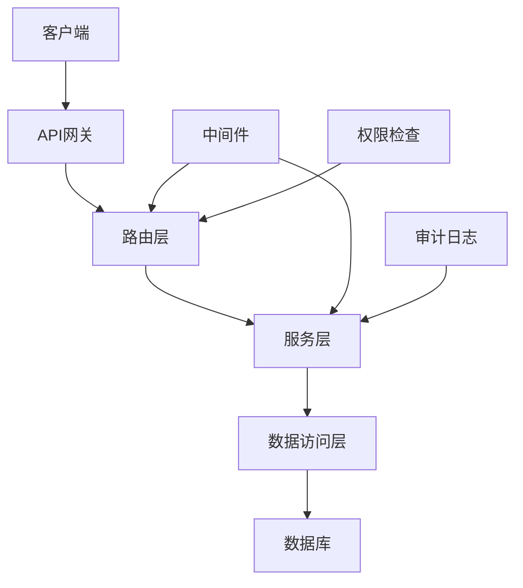
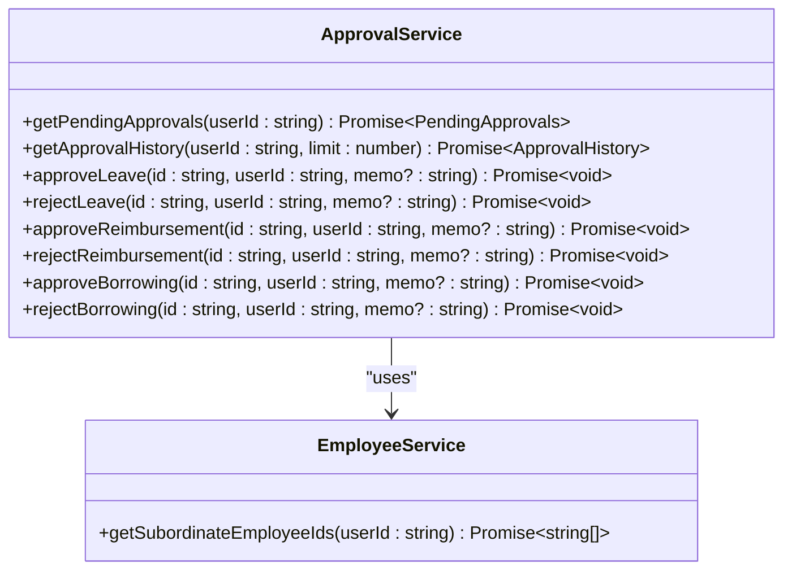
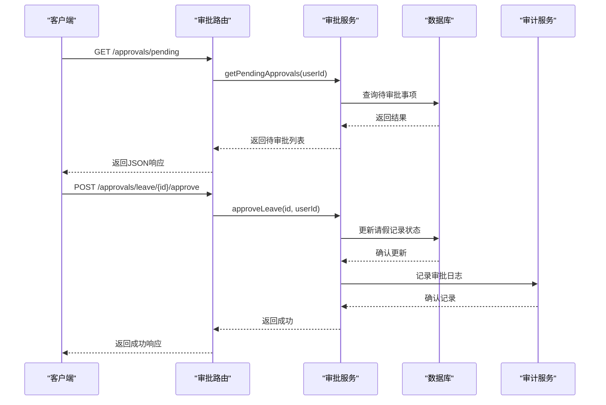
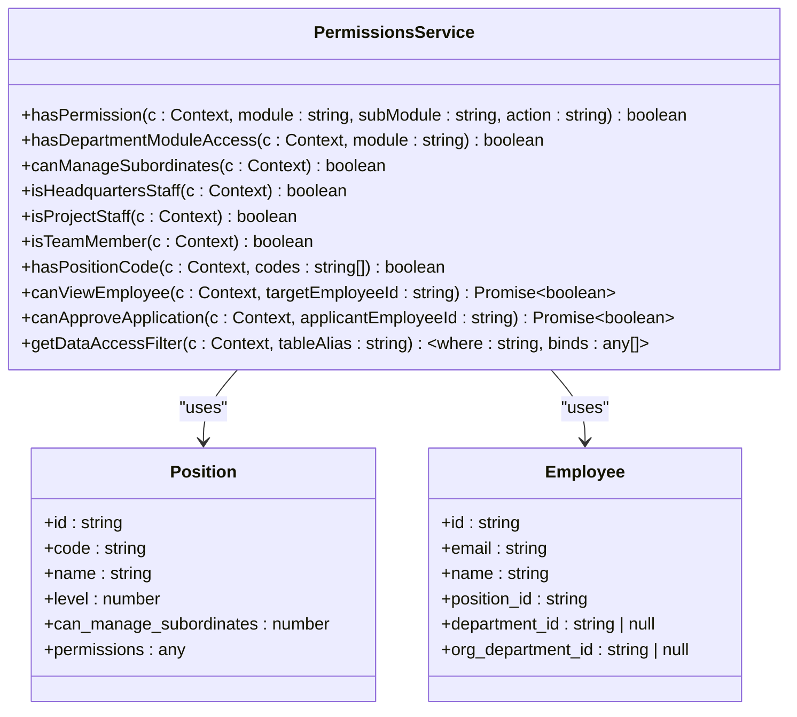
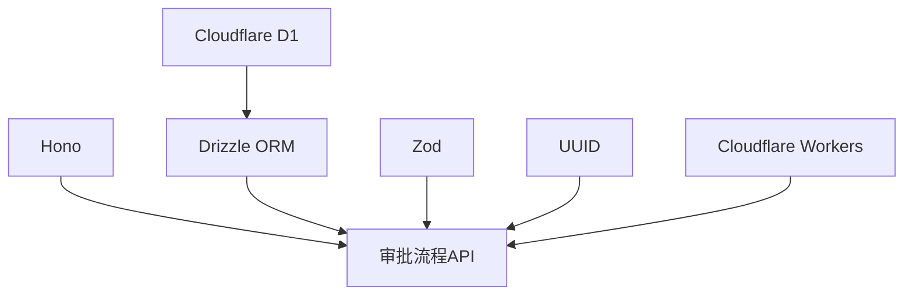

# 审批流程API

<cite>
**本文档引用的文件**
- [approvals.ts](file://backend/src/routes/approvals.ts)
- [ApprovalService.ts](file://backend/src/services/ApprovalService.ts)
- [schema.ts](file://backend/src/db/schema.ts)
- [permissions.ts](file://backend/src/utils/permissions.ts)
- [audit.ts](file://backend/src/utils/audit.ts)
- [employee-leaves.ts](file://backend/src/routes/employee-leaves.ts)
- [flows.ts](file://backend/src/routes/flows.ts)
</cite>

## 目录
1. [简介](#简介)
2. [项目结构](#项目结构)
3. [核心组件](#核心组件)
4. [架构概述](#架构概述)
5. [详细组件分析](#详细组件分析)
6. [依赖分析](#依赖分析)
7. [性能考虑](#性能考虑)
8. [故障排除指南](#故障排除指南)
9. [结论](#结论)

## 简介
本项目是一个财务管理系统，核心功能包括员工管理、薪资计算、报销审批、借支管理、资产管理和财务流水处理。系统采用Hono框架构建API，使用Drizzle ORM进行数据库操作，数据存储在Cloudflare D1数据库中。审批流程是系统的核心功能之一，涵盖了请假、报销、借支等业务场景的审批管理。系统通过基于职位的权限模型实现细粒度的访问控制，确保数据安全和业务合规。前端使用React构建，通过API与后端交互，提供完整的用户界面。

## 项目结构
项目采用分层架构，主要分为前端、后端和数据库三层。后端代码位于`backend/src`目录下，包含路由、服务、数据库模式、中间件和工具函数。前端代码位于`frontend/src`目录下，采用组件化设计，包含页面、组件、hooks和类型定义。数据库模式定义在`backend/src/db/schema.ts`文件中，使用Drizzle ORM进行类型化定义。系统通过OpenAPI规范定义API接口，确保前后端的契约一致性。

**Diagram sources**
- [schema.ts](file://backend/src/db/schema.ts)
- [routes](file://backend/src/routes)
- [services](file://backend/src/services)

**Section sources**
- [project_structure](file://project_structure)
- [schema.ts](file://backend/src/db/schema.ts)

## 核心组件
系统的核心组件包括审批服务、员工服务、财务服务和权限服务。审批服务负责处理所有审批相关的业务逻辑，包括获取待审批事项、处理审批请求等。员工服务管理员工信息和组织架构。财务服务处理财务流水和账户交易。权限服务实现基于职位的访问控制，确保用户只能访问其权限范围内的数据。这些服务通过清晰的接口定义进行交互，保证了系统的可维护性和可扩展性。

**Section sources**
- [ApprovalService.ts](file://backend/src/services/ApprovalService.ts)
- [EmployeeService.ts](file://backend/src/services/EmployeeService.ts)
- [FinanceService.ts](file://backend/src/services/FinanceService.ts)
- [permissions.ts](file://backend/src/utils/permissions.ts)

## 架构概述
系统采用微服务架构风格，尽管目前部署为单体应用，但通过清晰的模块划分实现了服务的解耦。API路由层负责接收HTTP请求并进行初步处理，服务层实现核心业务逻辑，数据访问层负责与数据库交互。中间件处理身份验证、权限检查和审计日志记录。这种分层架构使得系统易于测试和维护，同时也为未来的微服务化改造奠定了基础。

**Diagram sources**
- [routes](file://backend/src/routes)
- [services](file://backend/src/services)
- [middleware](file://backend/src/middleware)

## 详细组件分析

### 审批服务分析
审批服务是系统的核心业务组件，负责处理所有审批相关的操作。服务通过`getPendingApprovals`方法获取当前用户需要审批的事项，包括请假、报销和借支。审批操作通过`approve`和`reject`系列方法实现，每个方法都会更新相应记录的状态并记录审计日志。服务在处理审批请求时会检查用户权限，确保只有有权限的用户才能执行审批操作。

#### 审批服务类图

**Diagram sources**
- [ApprovalService.ts](file://backend/src/services/ApprovalService.ts)
- [EmployeeService.ts](file://backend/src/services/EmployeeService.ts)

#### 审批流程序列图

**Diagram sources**
- [approvals.ts](file://backend/src/routes/approvals.ts)
- [ApprovalService.ts](file://backend/src/services/ApprovalService.ts)
- [audit.ts](file://backend/src/utils/audit.ts)

**Section sources**
- [approvals.ts](file://backend/src/routes/approvals.ts)
- [ApprovalService.ts](file://backend/src/services/ApprovalService.ts)

### 权限服务分析
权限服务实现系统的访问控制机制，基于用户的职位和组织架构来决定其权限范围。服务通过`hasPermission`方法检查用户是否具有执行特定操作的权限，通过`getDataAccessFilter`方法生成数据访问的SQL过滤条件，确保用户只能访问其权限范围内的数据。权限模型支持总部、项目和团队三个层级，不同层级的用户具有不同的数据访问范围。

#### 权限服务类图

**Diagram sources**
- [permissions.ts](file://backend/src/utils/permissions.ts)
- [schema.ts](file://backend/src/db/schema.ts)

**Section sources**
- [permissions.ts](file://backend/src/utils/permissions.ts)

## 依赖分析
系统的主要依赖包括Hono框架、Drizzle ORM、Cloudflare D1数据库、Zod用于数据验证、UUID用于生成唯一标识符。这些依赖通过package.json文件进行管理，确保了版本的一致性和可重复构建。系统还依赖Cloudflare的Workers环境，利用其边缘计算能力提供低延迟的服务。

**Diagram sources**
- [package.json](file://backend/package.json)
- [approvals.ts](file://backend/src/routes/approvals.ts)

**Section sources**
- [package.json](file://backend/package.json)

## 性能考虑
系统在设计时考虑了性能因素，通过合理的数据库索引、缓存机制和异步处理来提高响应速度。数据库查询使用Drizzle ORM的查询构建器，生成高效的SQL语句。对于可能的性能瓶颈，如复杂的审批流程或大量数据查询，系统提供了分页和过滤功能，避免一次性加载过多数据。审计日志的记录使用`waitUntil`方法，确保不会阻塞主请求的响应。

## 故障排除指南
当遇到审批流程相关的问题时，首先检查用户的权限设置是否正确，确保用户具有相应的审批权限。其次检查数据库中的相关记录状态是否正确，避免重复审批或状态不一致。如果问题仍然存在，查看审计日志以获取更多上下文信息。对于API调用失败，检查请求的参数是否符合OpenAPI规范，确保所有必需字段都已提供。

**Section sources**
- [audit.ts](file://backend/src/utils/audit.ts)
- [errors.ts](file://backend/src/utils/errors.ts)

## 结论
该财务管理系统通过清晰的架构设计和模块化实现，提供了一套完整的财务和人力资源管理功能。审批流程作为核心功能，通过服务化的设计和严格的权限控制，确保了业务流程的合规性和数据的安全性。系统的分层架构和依赖管理为未来的扩展和维护提供了良好的基础。通过持续的优化和改进，系统能够满足不断变化的业务需求。