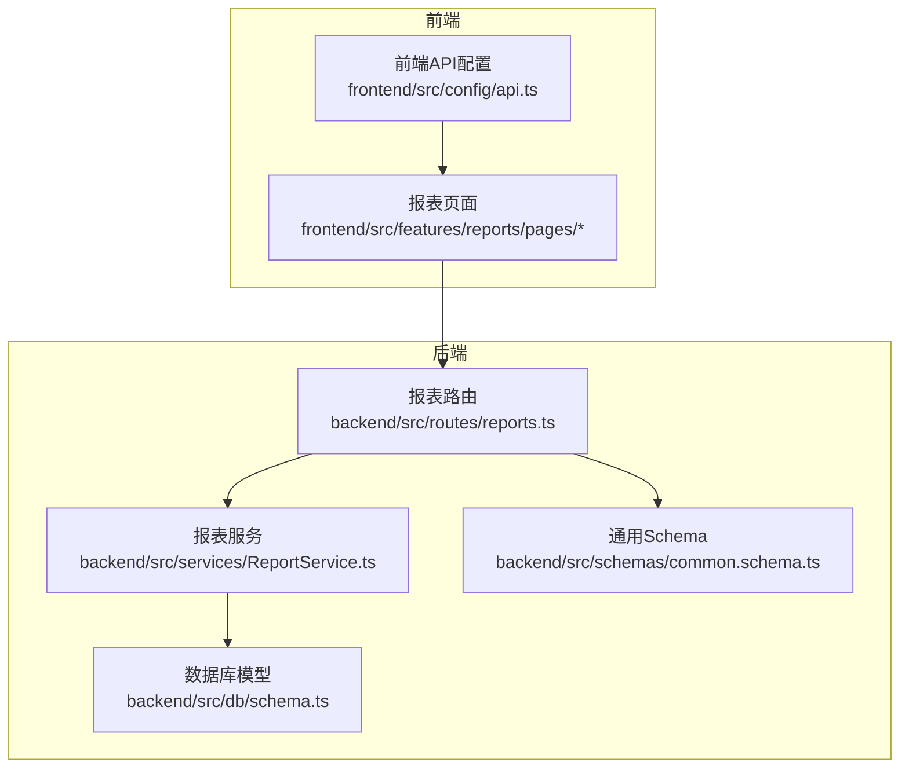
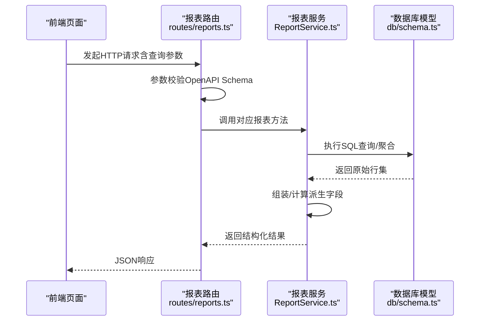
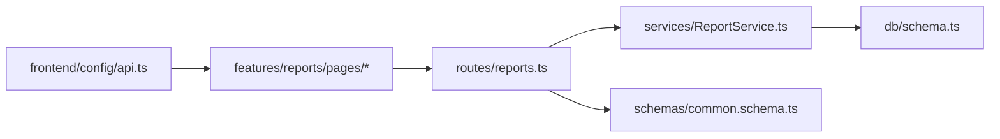

# 报表中心API

<cite>
**本文引用的文件**
- [backend/src/routes/reports.ts](file://backend/src/routes/reports.ts)
- [backend/src/services/ReportService.ts](file://backend/src/services/ReportService.ts)
- [backend/src/schemas/common.schema.ts](file://backend/src/schemas/common.schema.ts)
- [backend/src/db/schema.ts](file://backend/src/db/schema.ts)
- [backend/src/utils/csv.ts](file://backend/src/utils/csv.ts)
- [backend/test/routes/reports.test.ts](file://backend/test/routes/reports.test.ts)
- [frontend/src/config/api.ts](file://frontend/src/config/api.ts)
- [frontend/src/features/reports/pages/ReportDepartmentCash.tsx](file://frontend/src/features/reports/pages/ReportDepartmentCash.tsx)
- [frontend/src/features/reports/pages/ReportEmployeeSalary.tsx](file://frontend/src/features/reports/pages/ReportEmployeeSalary.tsx)
- [frontend/src/features/reports/pages/ReportAPSummary.tsx](file://frontend/src/features/reports/pages/ReportAPSummary.tsx)
- [frontend/src/features/reports/pages/ReportARDetail.tsx](file://frontend/src/features/reports/pages/ReportARDetail.tsx)
- [frontend/src/features/reports/pages/ReportExpenseSummary.tsx](file://frontend/src/features/reports/pages/ReportExpenseSummary.tsx)
- [frontend/src/features/reports/pages/ReportAccountBalance.tsx](file://frontend/src/features/reports/pages/ReportAccountBalance.tsx)
- [frontend/src/features/reports/pages/ReportAnnualLeave.tsx](file://frontend/src/features/reports/pages/ReportAnnualLeave.tsx)
</cite>

## 目录
1. [简介](#简介)
2. [项目结构](#项目结构)
3. [核心组件](#核心组件)
4. [架构总览](#架构总览)
5. [详细组件分析](#详细组件分析)
6. [依赖关系分析](#依赖关系分析)
7. [性能考量](#性能考量)
8. [故障排查指南](#故障排查指南)
9. [结论](#结论)
10. [附录](#附录)

## 简介
本文件系统化梳理“报表中心API”的设计与实现，覆盖财务与运营类报表的接口定义、查询参数、响应结构、数据聚合逻辑与性能优化建议，并说明如何通过API导出报表数据。本文档面向开发者与产品/运营用户，既提供代码级细节，也给出可读性强的说明与图示。

## 项目结构
- 后端路由层：集中定义报表相关HTTP接口，负责参数校验与权限控制。
- 服务层：封装报表业务逻辑，执行数据库查询与聚合计算。
- 数据模型：基于Drizzle ORM映射SQLite表结构，支撑各类报表的数据来源。
- 前端页面：展示报表并调用后端API，部分页面演示了分页与筛选参数的使用。

图表来源
- [frontend/src/config/api.ts](file://frontend/src/config/api.ts#L57-L72)
- [frontend/src/features/reports/pages/ReportDepartmentCash.tsx](file://frontend/src/features/reports/pages/ReportDepartmentCash.tsx#L1-L52)
- [backend/src/routes/reports.ts](file://backend/src/routes/reports.ts#L1-L475)
- [backend/src/services/ReportService.ts](file://backend/src/services/ReportService.ts#L1-L700)
- [backend/src/db/schema.ts](file://backend/src/db/schema.ts#L1-L644)
- [backend/src/schemas/common.schema.ts](file://backend/src/schemas/common.schema.ts#L1-L230)

章节来源
- [backend/src/routes/reports.ts](file://backend/src/routes/reports.ts#L1-L475)
- [backend/src/services/ReportService.ts](file://backend/src/services/ReportService.ts#L1-L700)
- [backend/src/db/schema.ts](file://backend/src/db/schema.ts#L1-L644)
- [backend/src/schemas/common.schema.ts](file://backend/src/schemas/common.schema.ts#L1-L230)
- [frontend/src/config/api.ts](file://frontend/src/config/api.ts#L57-L72)

## 核心组件
- 报表路由层：统一暴露报表接口，使用OpenAPI Hono进行请求参数校验与响应Schema定义；对敏感报表进行权限校验。
- 报表服务层：封装各报表的SQL聚合逻辑，包含多表联接、条件过滤、分组统计与派生字段计算。
- 通用Schema：提供日期范围、单日期、薪资报表查询等通用参数校验。
- 数据库模型：定义cash_flows、ar_ap_docs、accounts、departments、sites、employees、borrowings、repayments、employee_leaves等核心表，支撑各类报表的数据来源。

章节来源
- [backend/src/routes/reports.ts](file://backend/src/routes/reports.ts#L1-L120)
- [backend/src/services/ReportService.ts](file://backend/src/services/ReportService.ts#L1-L120)
- [backend/src/schemas/common.schema.ts](file://backend/src/schemas/common.schema.ts#L57-L90)
- [backend/src/db/schema.ts](file://backend/src/db/schema.ts#L165-L404)

## 架构总览
下图展示报表API从请求到响应的关键流程，以及与服务层、数据库模型的关系。

图表来源
- [backend/src/routes/reports.ts](file://backend/src/routes/reports.ts#L1-L475)
- [backend/src/services/ReportService.ts](file://backend/src/services/ReportService.ts#L1-L700)
- [backend/src/db/schema.ts](file://backend/src/db/schema.ts#L165-L404)

## 详细组件分析

### 1) 现金流报表（部门维度）
- 接口路径：/api/reports/department-cash
- 查询参数
  - start/end：日期范围（YYYY-MM-DD），必填
  - department_ids：逗号分隔的部门ID列表（可选）
- 响应结构
  - 数组，每项包含部门ID/名称、收入/支出/净额、收入/支出笔数等字段
- 聚合逻辑
  - 以部门为维度，连接cash_flows，按日期范围过滤，统计收入/支出金额与笔数，并计算净额
- 性能要点
  - 使用左连接避免遗漏部门
  - 对bizDate与departmentId建立索引可显著提升查询速度
- 分页机制
  - 当前接口未内置分页参数；若数据量大，建议在前端分页或后端增加limit/offset参数

章节来源
- [backend/src/routes/reports.ts](file://backend/src/routes/reports.ts#L76-L106)
- [backend/src/services/ReportService.ts](file://backend/src/services/ReportService.ts#L120-L156)
- [frontend/src/features/reports/pages/ReportDepartmentCash.tsx](file://frontend/src/features/reports/pages/ReportDepartmentCash.tsx#L1-L52)

### 2) 应收应付汇总/明细
- 接口路径
  - /api/reports/ar-ap/summary
  - /api/reports/ar-ap/detail
- 查询参数
  - start/end：日期范围（YYYY-MM-DD），必填
  - kind：枚举值'AR'或'AP'，必填
  - department_id：部门ID（可选）
- 响应结构
  - 汇总：total_cents、settled_cents、by_status（按状态统计）、rows（明细）
  - 明细：rows（包含单据信息与已结金额）
- 聚合逻辑
  - 汇总：按状态统计金额；明细：关联settlements计算已结金额
- 性能要点
  - 对ar_ap_docs的kind、issueDate、departmentId建立索引
  - settlement表按doc_id建立索引

章节来源
- [backend/src/routes/reports.ts](file://backend/src/routes/reports.ts#L145-L212)
- [backend/src/services/ReportService.ts](file://backend/src/services/ReportService.ts#L219-L280)

### 3) 日常支出汇总/明细
- 接口路径
  - /api/reports/expense/summary
  - /api/reports/expense/detail
- 查询参数
  - start/end：日期范围（YYYY-MM-DD），必填
  - category_id：分类ID（可选）
  - department_id：部门ID（可选）
- 响应结构
  - 汇总：rows（按类别统计金额与笔数）
  - 明细：rows（包含流水详情与关联对象信息）
- 聚合逻辑
  - 汇总：按类别聚合支出金额与笔数
  - 明细：连接accounts/categories/departments/sites获取上下文信息
- 性能要点
  - 对cash_flows的bizDate、categoryId、departmentId建立索引

章节来源
- [backend/src/routes/reports.ts](file://backend/src/routes/reports.ts#L214-L275)
- [backend/src/services/ReportService.ts](file://backend/src/services/ReportService.ts#L282-L337)

### 4) 账户余额（时点）
- 接口路径：/api/reports/account-balance
- 查询参数
  - asOf：截止日期（YYYY-MM-DD），必填
- 响应结构
  - rows：账户级明细（期初、当日收入/支出、期末余额等）
  - as_of：截止日期
- 聚合逻辑
  - 计算每个账户的期初余额（来自opening_balances）+ 历史净变动（prior flows）+ 当日流入流出（period flows）
- 性能要点
  - 对cash_flows的bizDate与accountId建立索引
  - opening_balances按ref_id建立索引

章节来源
- [backend/src/routes/reports.ts](file://backend/src/routes/reports.ts#L277-L307)
- [backend/src/services/ReportService.ts](file://backend/src/services/ReportService.ts#L339-L413)

### 5) 借款汇总/明细
- 接口路径
  - /api/reports/borrowing/summary
  - /api/reports/borrowing-detail/{id}
- 查询参数
  - summary：start/end（可选）、userId（可选）
  - detail：id（路径参数）、start/end（可选）
- 响应结构
  - 汇总：按用户聚合借入与还款金额，计算余额
  - 明细：借入记录与还款记录
- 聚合逻辑
  - 汇总：左连users/employees/repayments，按用户分组统计
  - 明细：先查borrowings再查repayments
- 性能要点
  - 对borrowings与repayments的userId/createdAt建立索引

章节来源
- [backend/src/routes/reports.ts](file://backend/src/routes/reports.ts#L309-L373)
- [backend/src/services/ReportService.ts](file://backend/src/services/ReportService.ts#L415-L478)

### 6) 新站点收入（限定天数内）
- 接口路径：/api/reports/new-site-revenue
- 查询参数
  - start/end：日期范围（YYYY-MM-DD），必填
  - days：窗口天数，默认30（可选）
  - department_id：部门ID（可选）
- 响应结构
  - rows：站点维度的收入/支出/净额与创建时间等
- 聚合逻辑
  - 通过SQLite julianday计算站点创建时间窗口内的收入/支出
- 性能要点
  - 对sites的createdAt与departmentId建立索引

章节来源
- [backend/src/routes/reports.ts](file://backend/src/routes/reports.ts#L375-L405)
- [backend/src/services/ReportService.ts](file://backend/src/services/ReportService.ts#L480-L513)

### 7) 员工薪资报表
- 接口路径：/api/reports/employee-salary
- 查询参数
  - year：年份（可选，默认当前年）
  - month：月份（可选，默认全月）
  - department_id：部门ID（可选）
- 响应结构
  - results：按员工/月份派生的实发工资等字段
- 聚合逻辑
  - 基于员工状态与入职日期计算当月工作天数，扣减重叠请假天数，折算实发工资
- 性能要点
  - 对employees的departmentId与joinDate建立索引
  - 对employee_leaves的employeeId/status与日期区间建立索引

章节来源
- [backend/src/routes/reports.ts](file://backend/src/routes/reports.ts#L407-L440)
- [backend/src/services/ReportService.ts](file://backend/src/services/ReportService.ts#L515-L664)
- [frontend/src/features/reports/pages/ReportEmployeeSalary.tsx](file://frontend/src/features/reports/pages/ReportEmployeeSalary.tsx#L1-L247)

### 8) 年假统计报表
- 接口路径：/api/reports/annual-leave
- 查询参数
  - department_id：部门ID（可选）
  - org_department_id：组织部门ID（可选）
- 响应结构
  - results：每位员工的周期、应得/已用/剩余天数、使用率等
  - summary与config（可选）
- 聚合逻辑
  - 基于AnnualLeaveService计算每位员工的年假权益与使用情况
- 性能要点
  - 对employees的departmentId/orgDepartmentId与joinDate建立索引

章节来源
- [backend/src/routes/reports.ts](file://backend/src/routes/reports.ts#L442-L472)
- [backend/src/services/ReportService.ts](file://backend/src/services/ReportService.ts#L666-L699)
- [frontend/src/features/reports/pages/ReportAnnualLeave.tsx](file://frontend/src/features/reports/pages/ReportAnnualLeave.tsx#L1-L243)

### 9) 站点增长（同比/环比）
- 掛口路径：/api/reports/site-growth
- 查询参数
  - start/end：日期范围（YYYY-MM-DD），必填
  - department_id：部门ID（可选）
- 响应结构
  - rows：站点维度的收入/支出/净额、上期收入、增长率
  - prev_range：上期开始/结束日期
- 聚合逻辑
  - 计算当前期与上期（同长度窗口）的收入对比，得出增长率
- 性能要点
  - 对cash_flows的bizDate与siteId建立索引

章节来源
- [backend/src/routes/reports.ts](file://backend/src/routes/reports.ts#L108-L144)
- [backend/src/services/ReportService.ts](file://backend/src/services/ReportService.ts#L158-L217)

### 10) 仪表盘统计
- 接口路径：/api/dashboard/stats
- 查询参数
  - department_id：部门ID（可选）
- 响应结构
  - 今日/本月收入/支出/笔数
  - 账户总数、AR/AP统计、借款统计、最近流水
- 聚合逻辑
  - 基于cash_flows与ar_ap_docs等表进行多维统计
- 性能要点
  - 对cash_flows的bizDate与departmentId建立索引

章节来源
- [backend/src/routes/reports.ts](file://backend/src/routes/reports.ts#L18-L74)
- [backend/src/services/ReportService.ts](file://backend/src/services/ReportService.ts#L12-L118)

## 依赖关系分析
- 路由层依赖服务层与通用Schema
- 服务层依赖数据库模型与Drizzle ORM
- 前端页面依赖API配置与各报表页面组件

图表来源
- [backend/src/routes/reports.ts](file://backend/src/routes/reports.ts#L1-L475)
- [backend/src/services/ReportService.ts](file://backend/src/services/ReportService.ts#L1-L700)
- [backend/src/schemas/common.schema.ts](file://backend/src/schemas/common.schema.ts#L1-L230)
- [backend/src/db/schema.ts](file://backend/src/db/schema.ts#L165-L404)
- [frontend/src/config/api.ts](file://frontend/src/config/api.ts#L57-L72)

章节来源
- [backend/src/routes/reports.ts](file://backend/src/routes/reports.ts#L1-L475)
- [backend/src/services/ReportService.ts](file://backend/src/services/ReportService.ts#L1-L700)
- [frontend/src/config/api.ts](file://frontend/src/config/api.ts#L57-L72)

## 性能考量
- 索引优化
  - cash_flows：bizDate、departmentId、accountId、categoryId
  - ar_ap_docs：kind、issueDate、departmentId、status
  - borrowings/repayments：userId、createdAt
  - sites：departmentId、createdAt
  - employees：departmentId、orgDepartmentId、joinDate
  - employee_leaves：employeeId、status、startDate、endDate
  - accounts：active
- 分页与批量
  - 当前多数报表未内置分页参数；建议在服务层增加limit/offset或page/pageSize参数，前端配合分页控件
- 缓存策略
  - 对高频查询（如仪表盘统计）可引入短期缓存（如1-5分钟），键值包含关键筛选条件
  - 对静态或低频报表（如年假统计）可采用更长缓存
- 异步导出
  - 对大数据量报表建议异步导出，前端轮询任务状态，完成后提供下载链接

[本节为通用指导，无需特定文件来源]

## 故障排查指南
- 权限不足
  - 报表路由在处理前会校验用户岗位与权限；若返回403，请确认登录态与岗位权限
- 参数校验失败
  - 日期格式需为YYYY-MM-DD；枚举值需符合要求；缺失必填参数会导致400
- 数据为空
  - 检查筛选条件是否过严（如部门ID、日期范围）；确认数据库中是否存在匹配记录
- 性能问题
  - 大查询卡顿：检查是否缺少索引；考虑缩小日期范围或增加分页
- 导出问题
  - 当前仓库未提供CSV导出接口；如需导出，请在前端将表格数据转换为CSV或在后端新增导出端点

章节来源
- [backend/src/routes/reports.ts](file://backend/src/routes/reports.ts#L1-L120)
- [backend/test/routes/reports.test.ts](file://backend/test/routes/reports.test.ts#L1-L103)
- [backend/src/utils/csv.ts](file://backend/src/utils/csv.ts#L1-L16)

## 结论
报表中心API围绕财务与运营核心指标提供了完整的查询能力，涵盖现金流、应收应付、费用、账户余额、借款、新站点收入、员工薪资与年假等多个维度。服务层通过Drizzle ORM实现高效聚合，前端页面展示了参数传递与结果渲染的最佳实践。建议后续完善分页、缓存与导出能力，以进一步提升用户体验与系统性能。

[本节为总结性内容，无需特定文件来源]

## 附录

### A. API清单与参数对照
- /api/reports/department-cash
  - 查询参数：start,end,department_ids（可选）
  - 响应：数组（部门维度）
- /api/reports/ar-ap/summary
  - 查询参数：kind,start,end,department_id（可选）
  - 响应：total_cents,settled_cents,by_status,rows
- /api/reports/ar-ap/detail
  - 查询参数：kind,start,end,department_id（可选）
  - 响应：rows
- /api/reports/expense/summary
  - 查询参数：start,end,category_id（可选）,department_id（可选）
  - 响应：rows
- /api/reports/expense/detail
  - 查询参数：start,end,category_id（可选）,department_id（可选）
  - 响应：rows
- /api/reports/account-balance
  - 查询参数：asOf
  - 响应：rows,as_of
- /api/reports/borrowing/summary
  - 查询参数：start（可选）,end（可选）,userId（可选）
  - 响应：rows
- /api/reports/borrowing-detail/{id}
  - 查询参数：start（可选）,end（可选）
  - 响应：borrowings,repayments
- /api/reports/new-site-revenue
  - 查询参数：start,end,days（默认30）,department_id（可选）
  - 响应：rows
- /api/reports/employee-salary
  - 查询参数：year（默认当前年）,month（可选）,department_id（可选）
  - 响应：results
- /api/reports/annual-leave
  - 查询参数：department_id（可选）,org_department_id（可选）
  - 响应：results,summary,config（可选）
- /api/dashboard/stats
  - 查询参数：department_id（可选）
  - 响应：今日/本月统计、账户数、AR/AP统计、借款统计、最近流水

章节来源
- [backend/src/routes/reports.ts](file://backend/src/routes/reports.ts#L18-L472)
- [frontend/src/config/api.ts](file://frontend/src/config/api.ts#L57-L72)

### B. 数据模型与关键字段
- cash_flows：bizDate,type,accountId,categoryId,amountCents,siteId,departmentId
- ar_ap_docs：kind,partyId,siteId,departmentId,issueDate,dueDate,amountCents,docNo,status
- accounts：name,type,currency,accountNumber,active
- departments：name,code,active
- sites：departmentId,name,siteCode,active,createdAt
- employees：departmentId,orgDepartmentId,joinDate,status,probationSalaryCents,regularSalaryCents
- borrowings/repayments：userId,amountCents,createdAt,memo,status
- employee_leaves：employeeId,leaveType,startDate,endDate,days,status

章节来源
- [backend/src/db/schema.ts](file://backend/src/db/schema.ts#L165-L404)

### C. 前端调用示例（路径）
- 报表页面通过前端API配置调用后端接口，例如：
  - 报表页面：[ReportDepartmentCash.tsx](file://frontend/src/features/reports/pages/ReportDepartmentCash.tsx#L1-L52)
  - 报表页面：[ReportEmployeeSalary.tsx](file://frontend/src/features/reports/pages/ReportEmployeeSalary.tsx#L1-L247)
  - 报表页面：[ReportAPSummary.tsx](file://frontend/src/features/reports/pages/ReportAPSummary.tsx#L1-L64)
  - 报表页面：[ReportARDetail.tsx](file://frontend/src/features/reports/pages/ReportARDetail.tsx#L1-L57)
  - 报表页面：[ReportExpenseSummary.tsx](file://frontend/src/features/reports/pages/ReportExpenseSummary.tsx#L1-L56)
  - 报表页面：[ReportAccountBalance.tsx](file://frontend/src/features/reports/pages/ReportAccountBalance.tsx#L1-L379)
  - 报表页面：[ReportAnnualLeave.tsx](file://frontend/src/features/reports/pages/ReportAnnualLeave.tsx#L1-L243)

### D. 导出报表（CSV）建议
- 当前仓库未提供CSV导出端点；如需导出，请参考以下思路：
  - 在后端新增导出接口，接收与报表相同的查询参数，返回CSV流
  - 使用工具函数将JSON结果序列化为CSV（注意转义与换行）
  - 建议采用异步导出，前端轮询任务状态并提供下载链接
- 参考工具
  - CSV解析工具：[csv.ts](file://backend/src/utils/csv.ts#L1-L16)

章节来源
- [backend/src/utils/csv.ts](file://backend/src/utils/csv.ts#L1-L16)