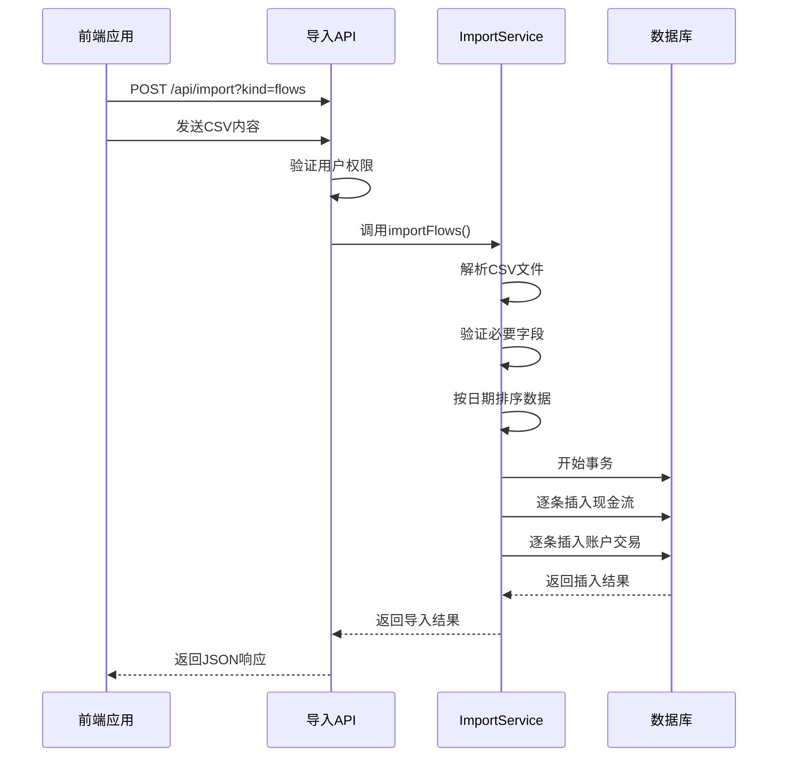
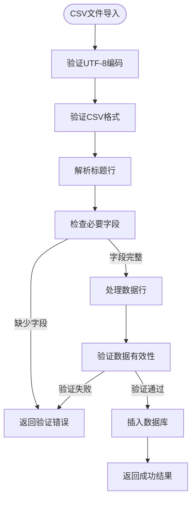
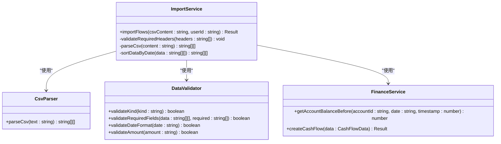
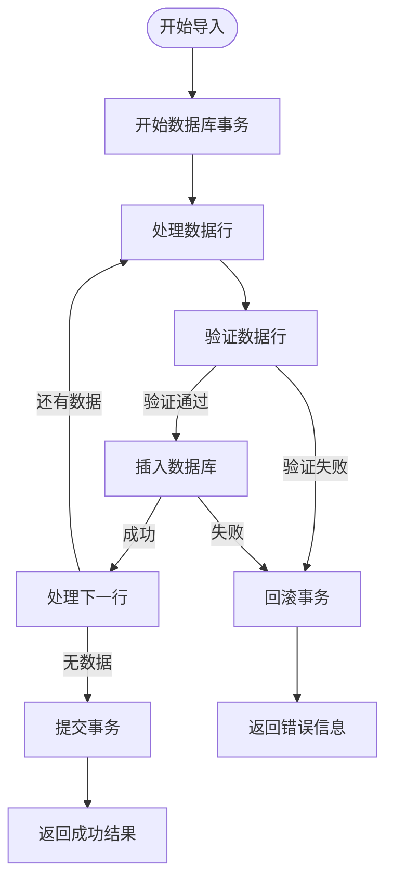

# 数据导入API

<cite>
**本文档引用的文件**
- [import.ts](file://backend/src/routes/import.ts)
- [ImportService.ts](file://backend/src/services/ImportService.ts)
- [common.schema.ts](file://backend/src/schemas/common.schema.ts)
- [csv.ts](file://backend/src/utils/csv.ts)
- [FinanceService.ts](file://backend/src/services/FinanceService.ts)
- [useImport.ts](file://frontend/src/hooks/business/useImport.ts)
- [ImportCenter.tsx](file://frontend/src/features/finance/pages/ImportCenter.tsx)
- [schema.ts](file://backend/src/db/schema.ts)
- [errors.ts](file://backend/src/utils/errors.ts)
- [import-flows-example.csv](file://frontend/public/examples/import-flows-example.csv)
- [import-ar-example.csv](file://frontend/public/examples/import-ar-example.csv)
- [import-ap-example.csv](file://frontend/public/examples/import-ap-example.csv)
- [import-opening-example.csv](file://frontend/public/examples/import-opening-example.csv)
</cite>

## 目录
1. [简介](#简介)
2. [API端点](#api端点)
3. [CSV文件格式要求](#csv文件格式要求)
4. [字段映射规则](#字段映射规则)
5. [数据验证机制](#数据验证机制)
6. [导入模板与示例文件](#导入模板与示例文件)
7. [错误处理与回滚策略](#错误处理与回滚策略)
8. [大文件分块上传与进度查询](#大文件分块上传与进度查询)
9. [导入状态追踪与结果查询](#导入状态追踪与结果查询)

## 简介
本API文档详细描述了财务系统中数据批量导入功能的使用方法。系统支持通过CSV文件批量导入应收账款、应付账款、现金流和期初余额等财务数据。该功能旨在帮助用户高效地将外部财务数据迁移到系统中，确保数据的一致性和完整性。

**Section sources**
- [import.ts](file://backend/src/routes/import.ts)
- [ImportService.ts](file://backend/src/services/ImportService.ts)

## API端点
数据导入API通过POST请求提供，位于`/api/import`路径。该API需要在查询参数中指定导入类型（kind），并以纯文本形式提交CSV文件内容。



**Diagram sources**
- [import.ts](file://backend/src/routes/import.ts#L9-L64)
- [ImportService.ts](file://backend/src/services/ImportService.ts#L12-L110)

**Section sources**
- [import.ts](file://backend/src/routes/import.ts#L9-L64)
- [ImportService.ts](file://backend/src/services/ImportService.ts#L12-L110)

## CSV文件格式要求
CSV文件必须使用UTF-8编码，以逗号分隔字段，每行以换行符结束。文件第一行为字段标题行，后续行为数据行。系统不支持复杂的引号处理，因此字段值中不应包含逗号。

对于不同类型的导入，CSV文件的字段要求有所不同：

- **现金流 (flows)**: 必需字段包括biz_date、type、account_id和amount
- **应收账款 (AR)**: 必需字段包括issue_date和amount
- **应付账款 (AP)**: 必需字段包括issue_date和amount
- **期初余额 (opening)**: 必需字段包括type、ref_id、amount和as_of



**Diagram sources**
- [csv.ts](file://backend/src/utils/csv.ts#L8-L13)
- [ImportService.ts](file://backend/src/services/ImportService.ts#L13-L37)
- [common.schema.ts](file://backend/src/schemas/common.schema.ts#L91-L93)

**Section sources**
- [csv.ts](file://backend/src/utils/csv.ts#L8-L13)
- [ImportService.ts](file://backend/src/services/ImportService.ts#L13-L37)

## 字段映射规则
CSV文件中的字段需要映射到数据库中的相应字段。系统在导入过程中会自动进行字段映射和数据转换。

### 现金流数据映射
| CSV字段 | 数据库字段 | 数据类型 | 说明 |
|--------|---------|--------|------|
| biz_date | cash_flows.biz_date | 字符串 | 业务日期，格式YYYY-MM-DD |
| type | cash_flows.type | 枚举 | 类型：income(收入)、expense(支出) |
| account_id | cash_flows.account_id | 字符串 | 账户ID，关联accounts表 |
| amount | cash_flows.amount_cents | 整数 | 金额，转换为分(乘以100) |
| site_id | cash_flows.site_id | 字符串 | 站点ID，关联sites表 |
| department_id | cash_flows.department_id | 字符串 | 部门ID，关联departments表 |
| counterparty | cash_flows.counterparty | 字符串 | 交易对手 |
| memo | cash_flows.memo | 字符串 | 备注 |
| category_id | cash_flows.category_id | 字符串 | 分类ID，关联categories表 |
| voucher_no | cash_flows.voucher_no | 字符串 | 凭证号 |
| method | cash_flows.method | 字符串 | 支付方式 |

### 应收/应付账款数据映射
| CSV字段 | 数据库字段 | 数据类型 | 说明 |
|--------|---------|--------|------|
| issue_date | ar_ap_docs.issue_date | 字符串 | 开票日期，格式YYYY-MM-DD |
| due_date | ar_ap_docs.due_date | 字符串 | 到期日期，格式YYYY-MM-DD |
| amount | ar_ap_docs.amount_cents | 整数 | 金额，转换为分(乘以100) |
| party_id | ar_ap_docs.party_id | 字符串 | 交易方ID |
| site_id | ar_ap_docs.site_id | 字符串 | 站点ID |
| department_id | ar_ap_docs.department_id | 字符串 | 部门ID |
| memo | ar_ap_docs.memo | 字符串 | 备注 |

### 期初余额数据映射
| CSV字段 | 数据库字段 | 数据类型 | 说明 |
|--------|---------|--------|------|
| type | opening_balances.type | 字符串 | 类型：account(账户) |
| ref_id | opening_balances.ref_id | 字符串 | 关联ID |
| amount | opening_balances.amount_cents | 整数 | 金额，转换为分(乘以100) |
| as_of | opening_balances.as_of | 字符串 | 截止日期，格式YYYY-MM-DD |

**Section sources**
- [ImportService.ts](file://backend/src/services/ImportService.ts#L20-L32)
- [schema.ts](file://backend/src/db/schema.ts#L165-L181)
- [schema.ts](file://backend/src/db/schema.ts#L202-L213)

## 数据验证机制
系统在导入过程中实施多层次的数据验证，确保数据的完整性和一致性。

### 客户端验证
前端在上传文件前会进行基本验证，包括：
- 文件类型必须为CSV
- 文件大小限制（未在代码中明确指定，但通常有默认限制）
- 必填字段的完整性检查

### 服务端验证
后端在处理导入请求时执行严格的验证：

1. **权限验证**: 用户必须具有财务模块的创建权限
2. **类型验证**: kind参数必须为flows、AR、AP或opening之一
3. **数据行验证**: CSV文件必须包含至少一行数据
4. **必要字段验证**: 根据导入类型检查必要字段是否存在
5. **数据格式验证**: 日期格式必须为YYYY-MM-DD，金额必须为有效数字
6. **业务逻辑验证**: 账户ID必须存在于系统中，金额必须大于0



**Diagram sources**
- [import.ts](file://backend/src/routes/import.ts#L52-L63)
- [ImportService.ts](file://backend/src/services/ImportService.ts#L14-L37)
- [errors.ts](file://backend/src/utils/errors.ts#L34-L54)
- [FinanceService.ts](file://backend/src/services/FinanceService.ts#L41-L69)

**Section sources**
- [import.ts](file://backend/src/routes/import.ts#L52-L63)
- [ImportService.ts](file://backend/src/services/ImportService.ts#L14-L37)
- [errors.ts](file://backend/src/utils/errors.ts#L34-L54)

## 导入模板与示例文件
系统提供了多种导入模板和示例文件，用户可以从前端下载并参考这些文件的格式来准备自己的数据。

### 下载链接
- **现金流导入模板**: `/examples/import-flows-example.csv`
- **应收账款导入模板**: `/examples/import-ar-example.csv`
- **应付账款导入模板**: `/examples/import-ap-example.csv`
- **期初余额导入模板**: `/examples/import-opening-example.csv`

### 示例文件内容
**现金流示例 (import-flows-example.csv):**
```
biz_date,type,account_id,amount,site_id,department_id,counterparty,memo,category_id,voucher_no,method
2025-01-15,income,account-id-001,1000.00,site-id-001,dept-id-001,客户A,销售收款,category-id-001,JZ20250115-001,cash
2025-01-16,expense,account-id-002,500.00,site-id-002,dept-id-001,供应商B,采购付款,category-id-002,JZ20250116-001,bank
```

**应收账款示例 (import-ar-example.csv):**
```
issue_date,due_date,amount,party_id,site_id,department_id,memo
2025-01-15,2025-02-15,5000.00,party-id-001,site-id-001,dept-id-001,客户A应收款
2025-01-20,2025-02-20,3000.00,party-id-002,site-id-002,dept-id-001,客户B应收款
```

**应付账款示例 (import-ap-example.csv):**
```
issue_date,due_date,amount,party_id,site_id,department_id,memo
2025-01-10,2025-02-10,2000.00,party-id-003,site-id-001,dept-id-001,供应商C应付款
2025-01-12,2025-02-12,1500.00,party-id-004,site-id-002,dept-id-001,供应商D应付款
```

**期初余额示例 (import-opening-example.csv):**
```
type,ref_id,amount,as_of
account,account-id-001,10000.00,2025-01-01
account,account-id-002,5000.00,2025-01-01
```

**Section sources**
- [ImportCenter.tsx](file://frontend/src/features/finance/pages/ImportCenter.tsx#L17-L22)
- [import-flows-example.csv](file://frontend/public/examples/import-flows-example.csv)
- [import-ar-example.csv](file://frontend/public/examples/import-ar-example.csv)
- [import-ap-example.csv](file://frontend/public/examples/import-ap-example.csv)
- [import-opening-example.csv](file://frontend/public/examples/import-opening-example.csv)

## 错误处理与回滚策略
系统采用严格的错误处理和事务回滚策略，确保数据导入的原子性和一致性。

### 错误类型
系统定义了多种错误类型，包括：

- **验证错误 (400)**: 请求参数或CSV格式不正确
- **权限错误 (403)**: 用户没有导入权限
- **内部错误 (500)**: 服务器处理过程中发生未预期的错误

### 事务处理
所有数据导入操作都在数据库事务中执行。如果在导入过程中发生任何错误，整个事务将被回滚，确保数据库状态的一致性。



### 部分成功处理
目前系统采用"全有或全无"的策略，即要么所有数据都成功导入，要么全部回滚。不支持部分成功的情况。这种设计确保了财务数据的完整性和一致性。

**Diagram sources**
- [ImportService.ts](file://backend/src/services/ImportService.ts#L52-L108)
- [errors.ts](file://backend/src/utils/errors.ts#L78-L85)
- [FinanceService.ts](file://backend/src/services/FinanceService.ts#L41-L69)

**Section sources**
- [ImportService.ts](file://backend/src/services/ImportService.ts#L52-L108)
- [errors.ts](file://backend/src/utils/errors.ts#L78-L85)

## 大文件分块上传与进度查询
目前的API设计不直接支持大文件的分块上传和进度查询。然而，前端实现了一个简单的文件上传界面，用户可以上传完整的CSV文件。

### API调用示例
```typescript
import { useImportData } from '../../hooks/business/useImport'

export function useImportData() {
    return useMutation({
        mutationFn: async ({ kind, text }: { kind: string, text: string }) => {
            const response = await apiClient.post<any>(`${api.import}?kind=${kind}`, text, {
                headers: { 'Content-Type': 'text/csv' }
            })
            return response
        }
    })
}
```

### 前端上传实现
```typescript
const upload = withErrorHandler(
    async () => {
        if (!file) {
            message.error('请选择CSV文件')
            return
        }
        const text = await file.text()
        const result = await importData({ kind, text })
        message.success(`导入成功：${result.inserted}`)
    },
    {
        errorMessage: '导入失败'
    }
)
```

虽然当前实现没有分块上传功能，但可以通过以下方式扩展：
1. 将大文件分割为多个较小的CSV文件分别上传
2. 修改API以支持分块上传和进度跟踪
3. 在后端实现流式处理CSV文件

**Section sources**
- [useImport.ts](file://frontend/src/hooks/business/useImport.ts#L5-L14)
- [ImportCenter.tsx](file://frontend/src/features/finance/pages/ImportCenter.tsx#L34-L47)

## 导入状态追踪与结果查询
导入操作完成后，系统返回一个包含导入结果的JSON响应。目前的实现返回成功插入的记录数量。

### 响应格式
```json
{
    "inserted": 2
}
```

### 状态追踪
系统通过以下方式追踪导入状态：
- **事务控制**: 使用数据库事务确保操作的原子性
- **时间戳**: 为每条记录添加创建时间戳
- **用户追踪**: 记录执行导入操作的用户ID
- **错误日志**: 记录所有导入过程中的错误信息

### 结果查询
虽然当前API不提供专门的导入结果查询接口，但可以通过以下方式查询导入的数据：
1. 使用相应的数据查询API获取导入的记录
2. 通过管理界面查看导入的数据
3. 检查系统日志以获取导入操作的详细信息

未来可以扩展功能，提供专门的导入任务查询接口，返回导入任务的状态、进度和详细结果。

**Section sources**
- [ImportService.ts](file://backend/src/services/ImportService.ts#L110-L111)
- [ImportCenter.tsx](file://frontend/src/features/finance/pages/ImportCenter.tsx#L42)
- [errors.ts](file://backend/src/utils/errors.ts#L63-L77)