# 数据管理API

<cite>
**本文档引用的文件**
- [import.ts](file://backend/src/routes/v2/import.ts)
- [reports.ts](file://backend/src/routes/v2/reports.ts)
- [ImportService.ts](file://backend/src/services/ImportService.ts)
- [ReportService.ts](file://backend/src/services/ReportService.ts)
- [csv.ts](file://backend/src/utils/csv.ts)
- [common.schema.ts](file://backend/src/schemas/common.schema.ts)
- [export.ts](file://backend/src/utils/export.ts)
- [useImport.ts](file://frontend/src/hooks/business/useImport.ts)
- [import-flows-example.csv](file://frontend/public/examples/import-flows-example.csv)
- [import-ar-example.csv](file://frontend/public/examples/import-ar-example.csv)
- [import-ap-example.csv](file://frontend/public/examples/import-ap-example.csv)
</cite>

## 目录
1. [简介](#简介)
2. [数据导入功能](#数据导入功能)
3. [数据导出与报表功能](#数据导出与报表功能)
4. [导入流程与前端集成](#导入流程与前端集成)
5. [大文件处理与后台任务](#大文件处理与后台任务)
6. [错误处理与事务机制](#错误处理与事务机制)
7. [安全与权限控制](#安全与权限控制)

## 简介
本API文档详细说明了财务管理系统的数据导入导出与报表服务。系统提供了CSV批量导入功能，支持应收账款、应付账款、财务流水等数据的批量处理。同时，系统提供了丰富的报表生成功能，支持财务、人事、业务等多维度的数据分析。所有API均基于RESTful设计，使用JSON作为主要数据交换格式，并通过JWT进行身份验证。

## 数据导入功能

### CSV批量导入接口
系统提供统一的CSV批量导入接口，支持多种数据类型的导入。通过`kind`参数指定导入的数据类型，目前支持财务流水（flows）、应收账款（AR）、应付账款（AP）和期初余额（opening）四种类型。

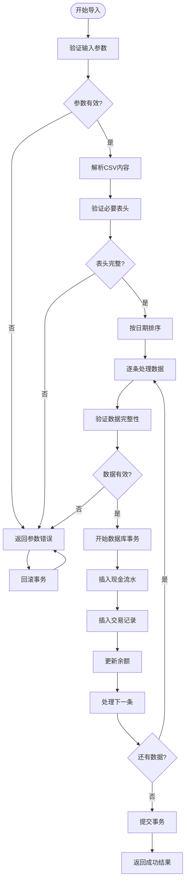

**Diagram sources**
- [import.ts](file://backend/src/routes/v2/import.ts#L10-L83)
- [ImportService.ts](file://backend/src/services/ImportService.ts#L13-L124)

**Section sources**
- [import.ts](file://backend/src/routes/v2/import.ts#L1-L83)
- [ImportService.ts](file://backend/src/services/ImportService.ts#L1-L126)

### 财务流水导入模板
财务流水（flows）的CSV导入模板包含以下字段：

- `biz_date`: 业务日期 (YYYY-MM-DD格式)
- `type`: 流水类型 (income, expense)
- `account_id`: 账户ID
- `amount`: 金额 (以元为单位)
- `site_id`: 站点ID
- `department_id`: 部门ID
- `counterparty`: 交易对方
- `memo`: 备注
- `category_id`: 分类ID
- `voucher_no`: 凭证号
- `method`: 支付方式

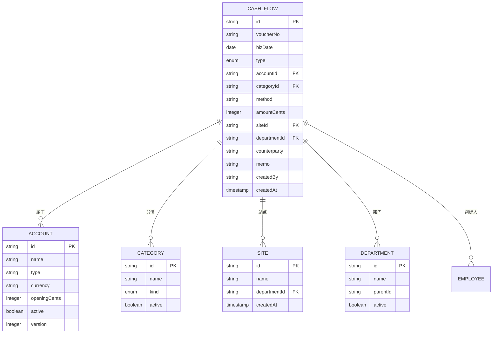

**Diagram sources**
- [import-flows-example.csv](file://frontend/public/examples/import-flows-example.csv#L1-L3)
- [ImportService.ts](file://backend/src/services/ImportService.ts#L23-L35)

### 应收账款导入模板
应收账款（AR）的CSV导入模板包含以下字段：

- `issue_date`: 开票日期 (YYYY-MM-DD格式)
- `due_date`: 到期日期 (YYYY-MM-DD格式)
- `amount`: 金额 (以元为单位)
- `party_id`: 对方单位ID
- `site_id`: 站点ID
- `department_id`: 部门ID
- `memo`: 备注

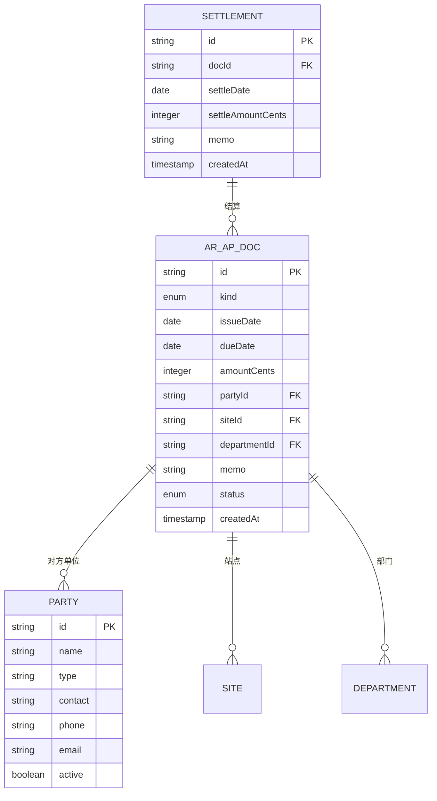

**Diagram sources**
- [import-ar-example.csv](file://frontend/public/examples/import-ar-example.csv#L1-L3)
- [ImportService.ts](file://backend/src/services/ImportService.ts#L13-L124)

### 应付账款导入模板
应付账款（AP）的CSV导入模板与应收账款类似，包含以下字段：

- `issue_date`: 开票日期 (YYYY-MM-DD格式)
- `due_date`: 到期日期 (YYYY-MM-DD格式)
- `amount`: 金额 (以元为单位)
- `party_id`: 对方单位ID
- `site_id`: 站点ID
- `department_id`: 部门ID
- `memo`: 备注


**Diagram sources**
- [import-ap-example.csv](file://frontend/public/examples/import-ap-example.csv#L1-L3)
- [ImportService.ts](file://backend/src/services/ImportService.ts#L13-L124)

## 数据导出与报表功能

### 报表生成接口
系统提供了多种报表生成接口，支持财务、人事、业务等多维度的数据分析。所有报表接口均支持JSON和CSV两种输出格式，用户可以根据需要选择合适的格式。

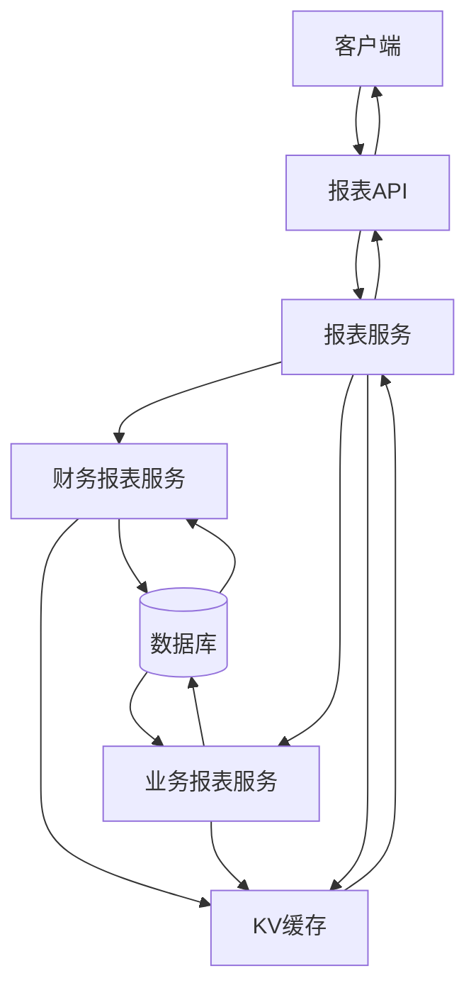

**Diagram sources**
- [reports.ts](file://backend/src/routes/v2/reports.ts#L17-L834)
- [ReportService.ts](file://backend/src/services/ReportService.ts#L13-L85)

**Section sources**
- [reports.ts](file://backend/src/routes/v2/reports.ts#L1-L834)
- [ReportService.ts](file://backend/src/services/ReportService.ts#L1-L85)

### 财务报表
财务报表主要包括应收账款/应付账款汇总与明细、费用汇总与明细、账户余额等。

#### 应收账款/应付账款汇总
- **接口**: GET /reports/ar-summary 或 /reports/ap-summary
- **查询参数**: start, end, departmentId
- **输出**: 总金额、已结算金额、按状态分类的金额、明细行

#### 应收账款/应付账款明细
- **接口**: GET /reports/ar-detail 或 /reports/ap-detail
- **查询参数**: start, end, departmentId
- **输出**: 所有符合条件的应收/应付记录

#### 费用汇总
- **接口**: GET /reports/expense-summary
- **查询参数**: start, end, departmentId
- **输出**: 按分类汇总的费用数据

#### 费用明细
- **接口**: GET /reports/expense-detail
- **查询参数**: start, end, category_id, departmentId
- **输出**: 所有符合条件的费用记录

#### 账户余额
- **接口**: GET /reports/account-balance
- **查询参数**: asOf
- **输出**: 指定日期的账户余额

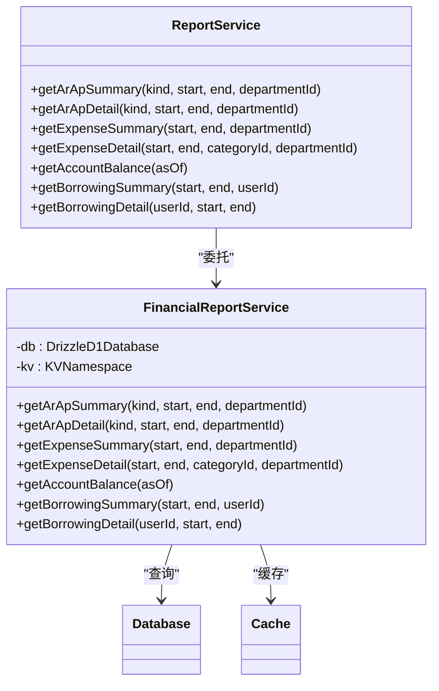

**Diagram sources**
- [reports.ts](file://backend/src/routes/v2/reports.ts#L230-L585)
- [FinancialReportService.ts](file://backend/src/services/FinancialReportService.ts#L22-L200)

### 业务报表
业务报表主要包括部门现金流、站点增长、员工薪资等。

#### 部门现金流
- **接口**: GET /reports/department-cash
- **查询参数**: start, end, departmentIds
- **输出**: 各部门的收入、支出、净现金流

#### 站点增长
- **接口**: GET /reports/site-growth
- **查询参数**: start, end, departmentId
- **输出**: 站点的收入、支出、净现金流及与上期对比的增长率

#### 员工薪资报表
- **接口**: GET /reports/employee-salary
- **查询参数**: year, month, departmentId
- **输出**: 员工的薪资明细

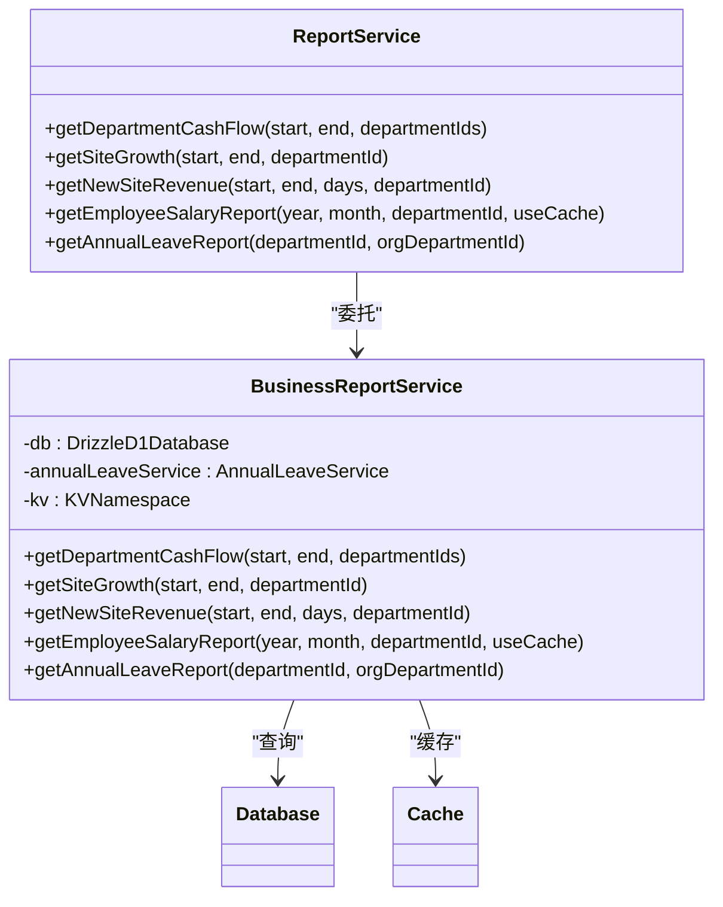

**Diagram sources**
- [reports.ts](file://backend/src/routes/v2/reports.ts#L115-L735)
- [BusinessReportService.ts](file://backend/src/services/BusinessReportService.ts#L21-L200)

### 人事报表
人事报表主要包括年假报表等。

#### 年假报表
- **接口**: GET /reports/annual-leave
- **查询参数**: departmentId, orgDepartmentId
- **输出**: 员工的年假余额和使用情况

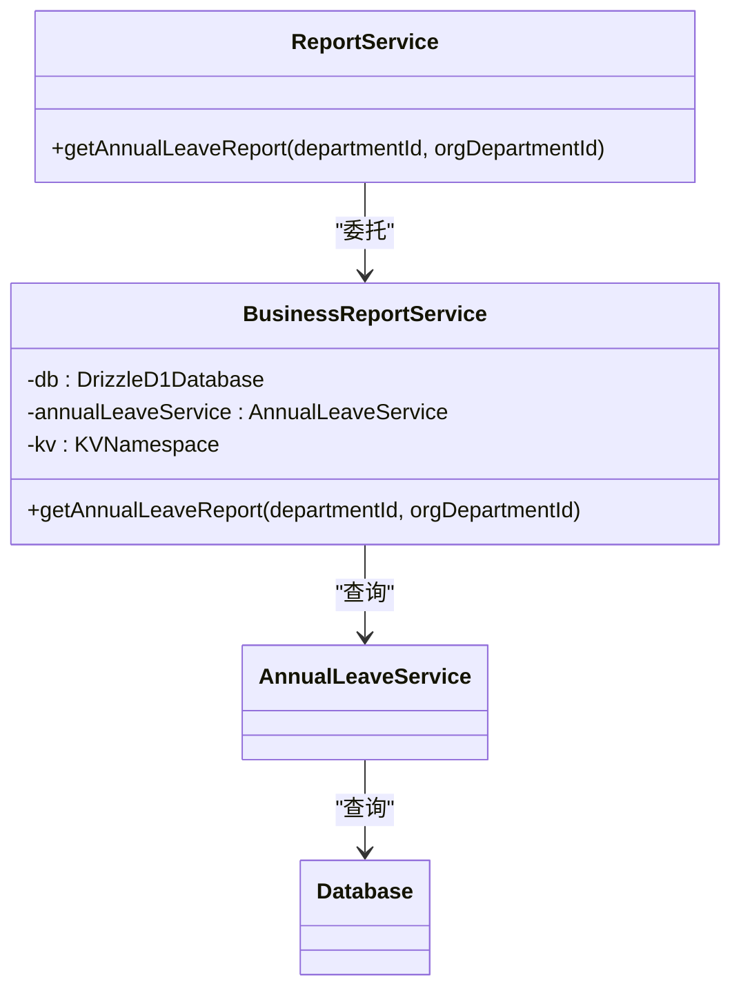

**Diagram sources**
- [reports.ts](file://backend/src/routes/v2/reports.ts#L681-L735)
- [BusinessReportService.ts](file://backend/src/services/BusinessReportService.ts#L21-L200)

## 导入流程与前端集成

### 前端导入流程
前端通过`useImport` Hook与后端导入API进行集成，实现了完整的导入流程。

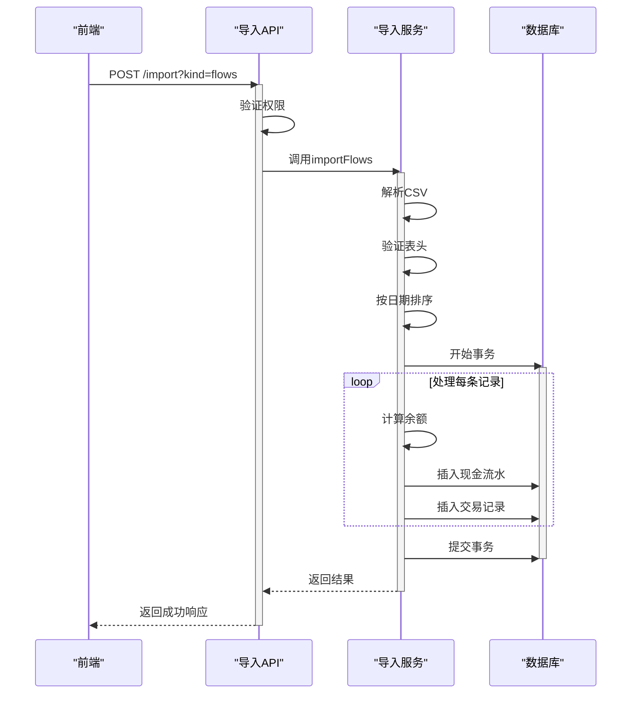

**Diagram sources**
- [import.ts](file://backend/src/routes/v2/import.ts#L69-L83)
- [ImportService.ts](file://backend/src/services/ImportService.ts#L13-L124)
- [useImport.ts](file://frontend/src/hooks/business/useImport.ts#L5-L14)

**Section sources**
- [useImport.ts](file://frontend/src/hooks/business/useImport.ts#L1-L15)

### 导入状态查询
系统支持导入状态的查询，用户可以通过特定接口获取导入任务的进度和结果。

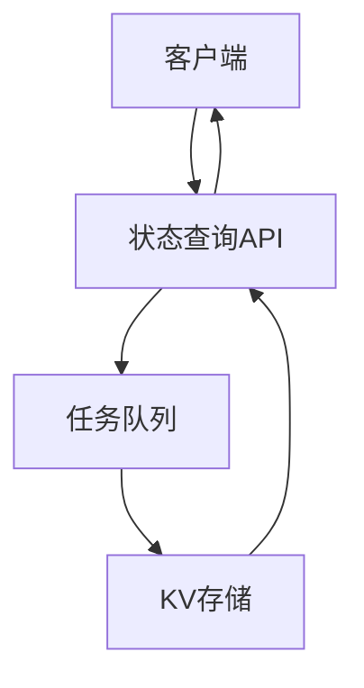

**Section sources**
- [import.ts](file://backend/src/routes/v2/import.ts#L1-L83)

## 大文件处理与后台任务

### 分块上传策略
对于大文件的处理，系统采用分块上传策略，将大文件分割成多个小块进行上传，确保上传过程的稳定性和可靠性。

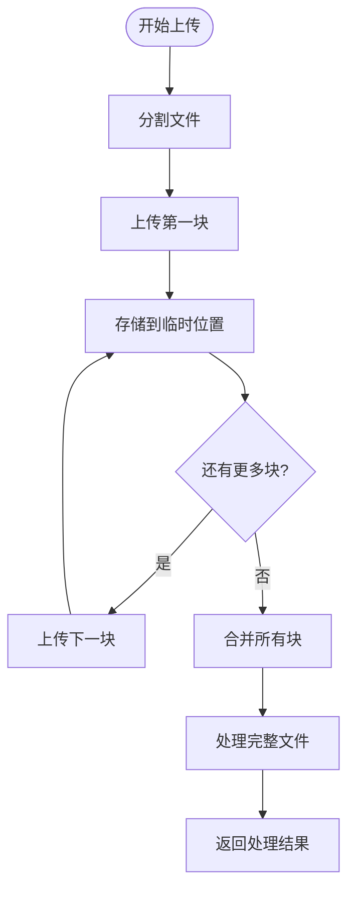

**Section sources**
- [import.ts](file://backend/src/routes/v2/import.ts#L1-L83)

### 后台任务队列
系统使用后台任务队列处理耗时的导入任务，确保前端响应的及时性。

```mermaid
flowchart TD
WebServer["Web服务器"]
TaskQueue["任务队列"]
Worker["后台工作进程"]
KV["KV存储"]
Database[(数据库)]
WebServer --> TaskQueue : "提交任务"
TaskQueue --> Worker : "分发任务"
Worker --> KV : "读取文件"
KV --> Worker
Worker --> Database : "写入数据"
Database --> Worker
Worker --> KV : "存储结果"
KV --> Worker
Worker --> TaskQueue : "标记完成"
```

**Section sources**
- [import.ts](file://backend/src/routes/v2/import.ts#L1-L83)

## 错误处理与事务机制

### 数据校验与错误反馈
系统在导入过程中实施了多层次的数据校验，确保数据的完整性和准确性。

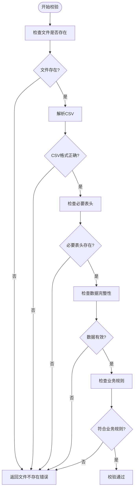

**Diagram sources**
- [ImportService.ts](file://backend/src/services/ImportService.ts#L15-L40)
- [csv.ts](file://backend/src/utils/csv.ts#L8-L14)

### 事务回滚机制
系统采用数据库事务确保数据的一致性，任何一步操作失败都会导致整个事务回滚。

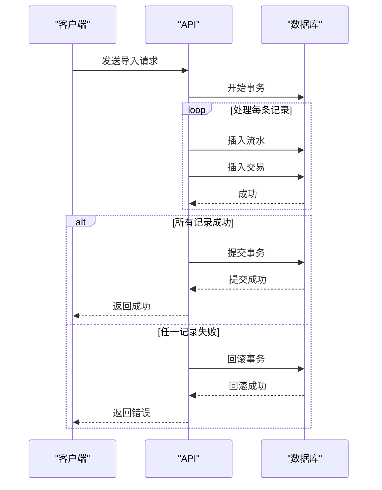

**Diagram sources**
- [ImportService.ts](file://backend/src/services/ImportService.ts#L55-L124)
- [FinanceService.ts](file://backend/src/services/FinanceService.ts#L70-L200)

## 安全与权限控制

### 权限验证
系统在所有敏感操作前都进行权限验证，确保只有授权用户才能执行相应操作。

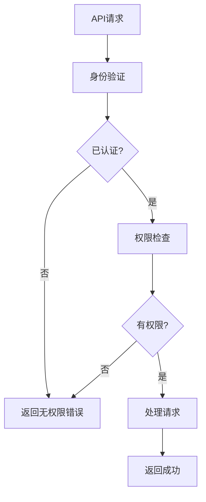

**Diagram sources**
- [import.ts](file://backend/src/routes/v2/import.ts#L70-L72)
- [reports.ts](file://backend/src/routes/v2/reports.ts#L103-L106)

**Section sources**
- [import.ts](file://backend/src/routes/v2/import.ts#L1-L83)
- [reports.ts](file://backend/src/routes/v2/reports.ts#L1-L834)