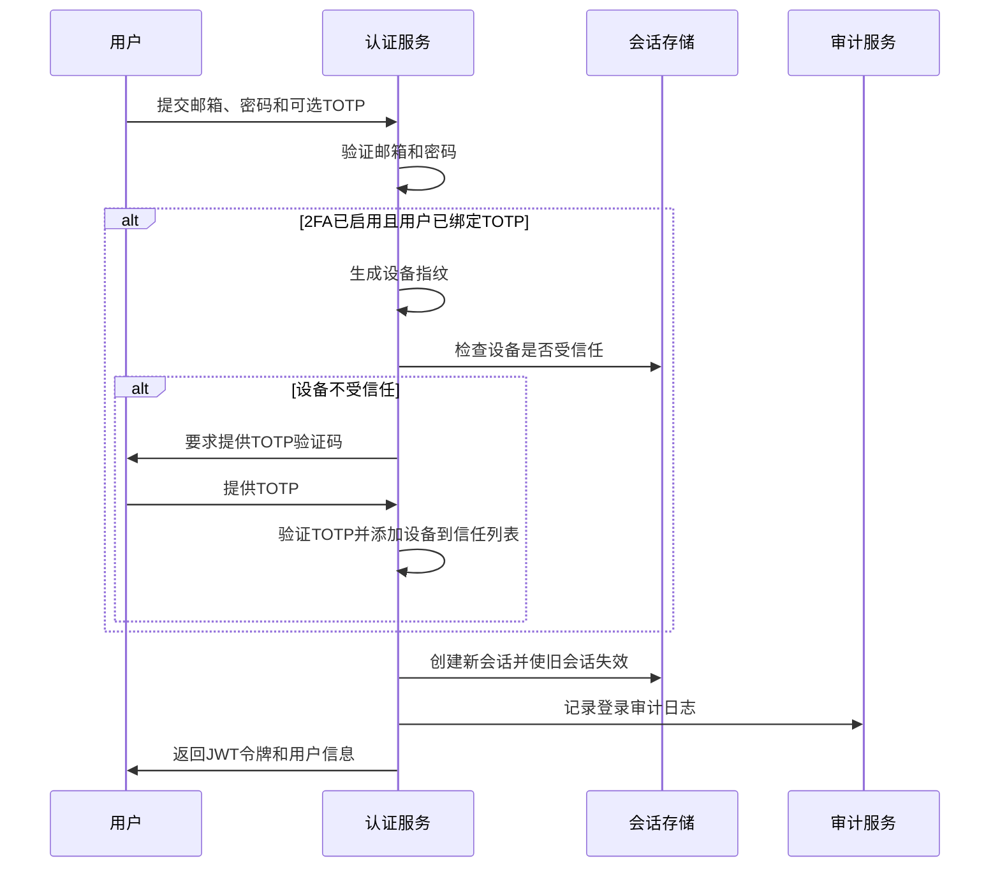
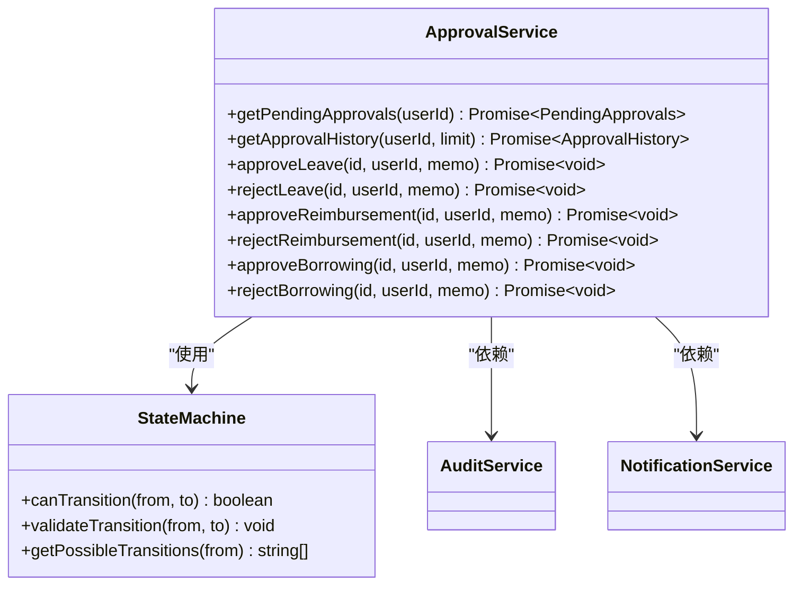
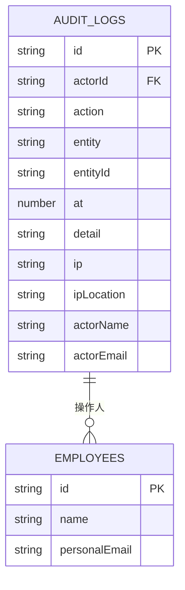
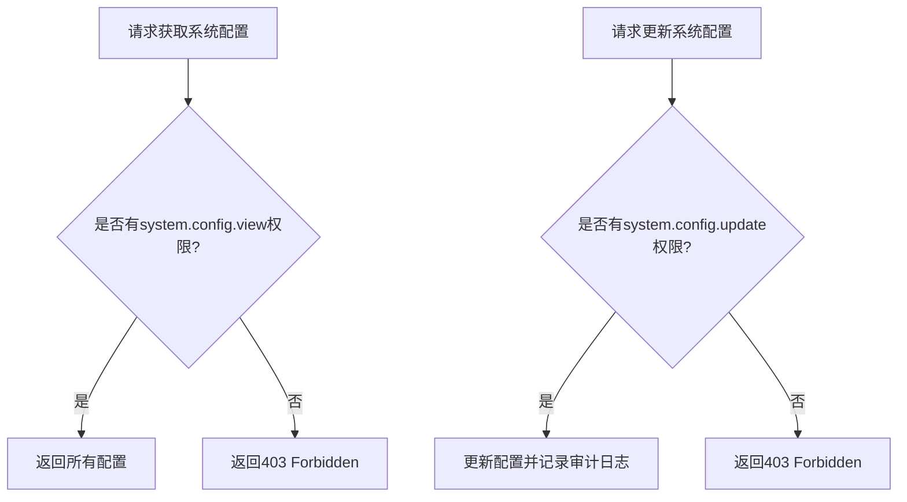
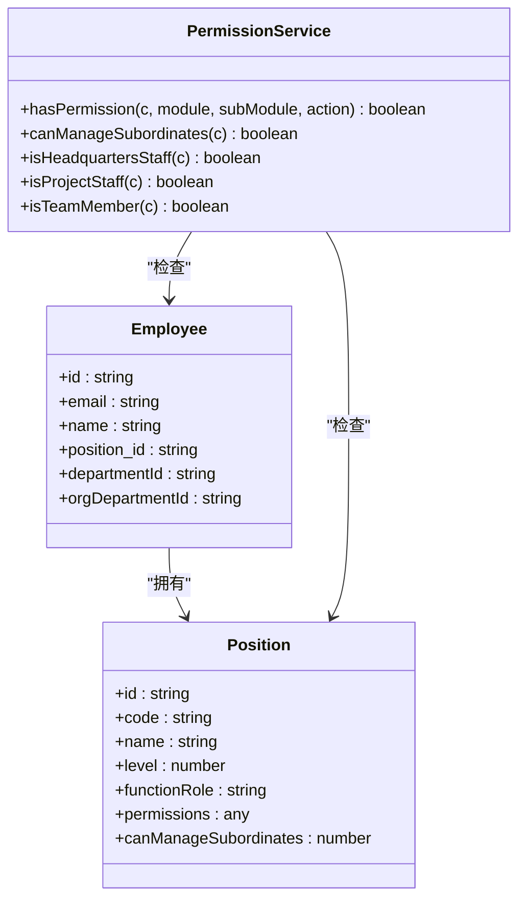

# 系统核心API

<cite>
**本文档引用文件**   
- [auth.ts](file://backend/src/routes/v2/auth.ts)
- [my.ts](file://backend/src/routes/v2/my.ts)
- [approvals.ts](file://backend/src/routes/v2/approvals.ts)
- [audit.ts](file://backend/src/routes/v2/audit.ts)
- [ip-whitelist.ts](file://backend/src/routes/v2/ip-whitelist.ts)
- [system-config.ts](file://backend/src/routes/v2/system-config.ts)
- [position-permissions.ts](file://backend/src/routes/v2/position-permissions.ts)
- [jwt.ts](file://backend/src/utils/jwt.ts)
- [permissions.ts](file://backend/src/utils/permissions.ts)
- [audit.ts](file://backend/src/utils/audit.ts)
- [AuthService.ts](file://backend/src/services/AuthService.ts)
- [ApprovalService.ts](file://backend/src/services/ApprovalService.ts)
- [AuditService.ts](file://backend/src/services/AuditService.ts)
</cite>

## 目录
1. [认证授权](#认证授权)
2. [个人中心](#个人中心)
3. [审批流](#审批流)
4. [审计日志](#审计日志)
5. [IP白名单](#ip白名单)
6. [系统配置](#系统配置)
7. [职位权限管理](#职位权限管理)
8. [安全最佳实践](#安全最佳实践)

## 认证授权

本系统采用JWT+TOTP双因素认证机制，确保用户身份的安全性。认证流程包括登录、刷新令牌、密码重置等端点。

### JWT+TOTP双因素认证流程

系统实现了严格的双因素认证（2FA）流程，结合JWT令牌和基于时间的一次性密码（TOTP）技术。认证流程如下：

1. **登录验证**：用户首先提供邮箱和密码进行身份验证。
2. **2FA检查**：系统检查全局2FA配置，若已启用，则进入下一步。
3. **设备信任检查**：系统通过IP地址和User-Agent生成设备指纹，检查该设备是否已在信任设备列表中。
4. **TOTP验证**：若为新设备，用户必须提供有效的TOTP验证码才能完成登录。
5. **会话创建**：验证通过后，系统创建新的会话，并将旧会话全部失效，实现单点登录（SSO）。

**Diagram sources**
- [auth.ts](file://backend/src/routes/v2/auth.ts#L82-L143)
- [AuthService.ts](file://backend/src/services/AuthService.ts#L34-L148)

### 登录端点

`POST /auth/login` 端点处理用户登录请求。该端点应用了登录速率限制中间件，防止暴力破解攻击。成功登录后，返回包含JWT令牌、用户信息和职位权限的响应。

**Section sources**
- [auth.ts](file://backend/src/routes/v2/auth.ts#L146-L177)

### 刷新令牌

系统通过JWT令牌的自动刷新机制实现会话持久化。JWT令牌的有效期为7天，与会话过期时间一致。当令牌过期时，用户需要重新登录。

**Section sources**
- [jwt.ts](file://backend/src/utils/jwt.ts#L59)

### 密码重置

系统提供了完整的密码重置流程，包括请求重置链接、验证重置令牌和重置密码三个端点。重置链接有效期为1小时，过期后需要重新请求。

**Section sources**
- [auth.ts](file://backend/src/routes/v2/auth.ts#L478-L528)

## 个人中心

个人中心API提供用户个人信息、仪表盘数据、请假、报销、借款等个人相关功能的访问接口。

### 个人仪表盘

`GET /my/dashboard` 端点返回用户的个人仪表盘数据，包括薪资统计、年假信息、待报销金额和借款余额等。

**Section sources**
- [my.ts](file://backend/src/routes/v2/my.ts#L238-L265)

### 个人信息管理

用户可以通过`GET /my/profile`和`PUT /my/profile`端点获取和更新个人信息，如紧急联系人、电话号码等。

**Section sources**
- [my.ts](file://backend/src/routes/v2/my.ts#L582-L652)

## 审批流

审批流API提供多级审批的配置与状态推进机制，支持请假、报销和借款等业务的审批。

### 多级审批配置

系统通过`getPendingApprovals`方法获取当前用户需要审批的待办事项列表。系统根据用户职位和下属关系确定审批权限。

**Diagram sources**
- [approvals.ts](file://backend/src/routes/v2/approvals.ts#L75-L485)
- [ApprovalService.ts](file://backend/src/services/ApprovalService.ts#L31-L644)

### 状态推进机制

审批流程采用状态机模式，确保状态转换的合法性。例如，报销申请的状态流转为：pending → approved/rejected。

**Section sources**
- [state-machine.ts](file://backend/src/utils/state-machine.ts#L73-L77)

## 审计日志

审计日志API提供操作审计的记录格式与查询方式，确保系统操作的可追溯性。

### 操作审计记录格式

审计日志记录包含以下字段：
- `id`: 日志唯一标识
- `actorId`: 操作人ID
- `action`: 操作类型（如login, create, update等）
- `entity`: 实体类型（如user, employee, account等）
- `entityId`: 实体ID
- `at`: 操作时间戳
- `detail`: 操作详情
- `ip`: 操作IP地址
- `ipLocation`: IP归属地

**Diagram sources**
- [audit.ts](file://backend/src/routes/v2/audit.ts#L11-L24)
- [AuditService.ts](file://backend/src/services/AuditService.ts#L8-L62)

### 查询方式

系统提供`GET /audit-logs`端点查询审计日志，支持按操作类型、实体类型、操作人、时间范围等条件过滤。同时提供`GET /audit-logs/options`端点获取过滤选项。

**Section sources**
- [audit.ts](file://backend/src/routes/v2/audit.ts#L27-L61)

## IP白名单

IP白名单API提供IP地址的管理功能，包括添加、删除、批量操作和规则启用/禁用。

### IP白名单管理

系统通过Cloudflare API管理IP白名单规则，确保只有授权IP可以访问系统。管理功能包括：
- 获取IP白名单列表
- 添加单个IP
- 批量添加IP
- 批量删除IP
- 同步Cloudflare规则
- 启用/禁用白名单规则

**Section sources**
- [ip-whitelist.ts](file://backend/src/routes/v2/ip-whitelist.ts#L53-L310)

## 系统配置

系统配置API提供全局参数的读写权限控制策略，确保配置变更的安全性。

### 读写权限控制

系统配置的读写权限通过RBAC模型控制：
- `view`权限：允许读取配置
- `update`权限：允许修改配置

`GET /system-config`端点需要`system.config.view`权限，`PUT /system-config/{key}`端点需要`system.config.update`权限。

**Diagram sources**
- [system-config.ts](file://backend/src/routes/v2/system-config.ts#L60-L183)

## 职位权限管理

职位权限管理API提供基于角色的访问控制（RBAC）模型，实现细粒度的权限管理。

### RBAC模型

系统采用基于职位的权限控制模型，每个职位拥有不同的权限配置。权限结构为：模块.子模块.操作。

**Diagram sources**
- [position-permissions.ts](file://backend/src/routes/v2/position-permissions.ts#L9-L251)
- [permissions.ts](file://backend/src/utils/permissions.ts#L9-L272)

### 权限检查

`hasPermission`函数检查用户是否有指定模块的权限，计算逻辑为：部门允许的模块 ∩ 职位定义的操作权限。

**Section sources**
- [permissions.ts](file://backend/src/utils/permissions.ts#L99-L125)

## 安全最佳实践

### 会话管理

系统实现严格的会话管理策略：
- 单点登录（SSO）：用户登录时，所有旧会话被自动失效
- 会话持久化：会话信息同时存储在KV和D1数据库中，确保高可用性
- 会话过期：会话有效期为7天

**Section sources**
- [AuthService.ts](file://backend/src/services/AuthService.ts#L150-L198)

### 敏感操作二次确认

对于敏感操作，系统采用以下安全措施：
- 双因素认证：关键操作需要TOTP验证
- 审计日志：所有敏感操作都被记录到审计日志中
- 信任设备：用户可以在信任的设备上免除TOTP验证

**Section sources**
- [AuthService.ts](file://backend/src/services/AuthService.ts#L89-L113)
- [audit.ts](file://backend/src/utils/audit.ts#L33-L89)