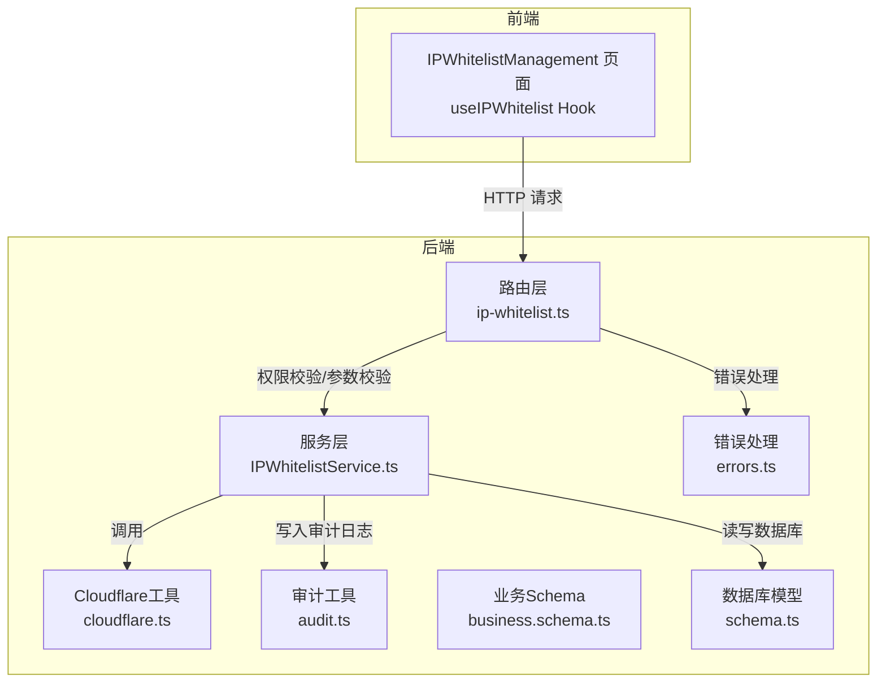
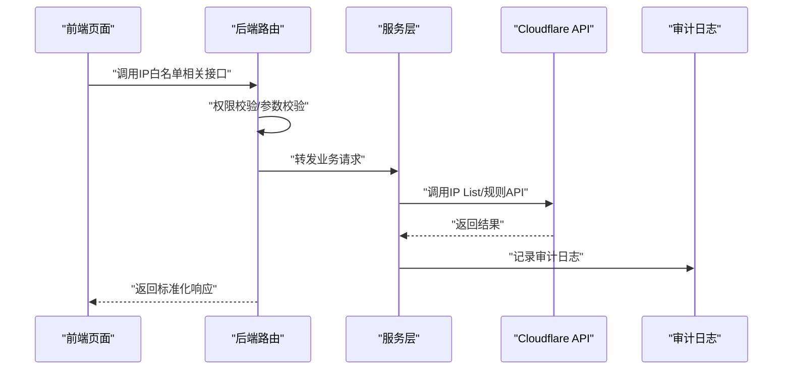
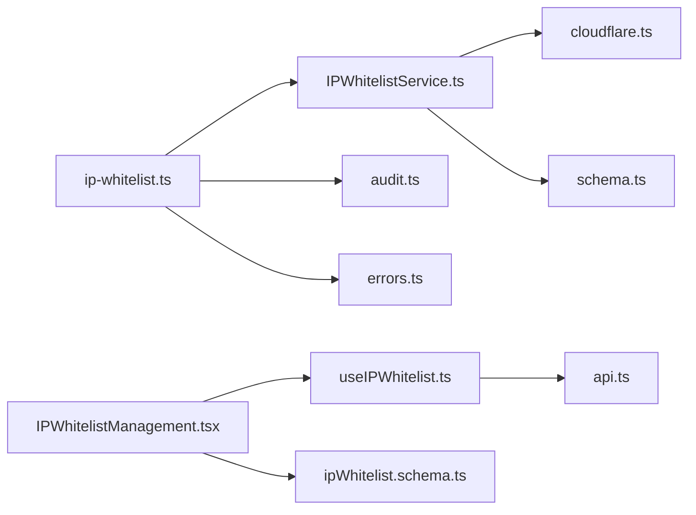

# IP白名单API

<cite>
**本文引用的文件**
- [backend/src/routes/ip-whitelist.ts](file://backend/src/routes/ip-whitelist.ts)
- [backend/src/services/IPWhitelistService.ts](file://backend/src/services/IPWhitelistService.ts)
- [backend/src/utils/cloudflare.ts](file://backend/src/utils/cloudflare.ts)
- [backend/src/utils/audit.ts](file://backend/src/utils/audit.ts)
- [backend/src/utils/errors.ts](file://backend/src/utils/errors.ts)
- [backend/src/utils/validation.ts](file://backend/src/utils/validation.ts)
- [backend/src/schemas/business.schema.ts](file://backend/src/schemas/business.schema.ts)
- [backend/src/db/schema.ts](file://backend/src/db/schema.ts)
- [backend/test/routes/ip-whitelist.test.ts](file://backend/test/routes/ip-whitelist.test.ts)
- [frontend/src/features/system/pages/IPWhitelistManagement.tsx](file://frontend/src/features/system/pages/IPWhitelistManagement.tsx)
- [frontend/src/hooks/business/useIPWhitelist.ts](file://frontend/src/hooks/business/useIPWhitelist.ts)
- [frontend/src/config/api.ts](file://frontend/src/config/api.ts)
- [frontend/src/validations/ipWhitelist.schema.ts](file://frontend/src/validations/ipWhitelist.schema.ts)
</cite>

## 目录
1. [简介](#简介)
2. [项目结构](#项目结构)
3. [核心组件](#核心组件)
4. [架构总览](#架构总览)
5. [详细组件分析](#详细组件分析)
6. [依赖关系分析](#依赖关系分析)
7. [性能考量](#性能考量)
8. [故障排查指南](#故障排查指南)
9. [结论](#结论)
10. [附录](#附录)

## 简介
本文件为“IP白名单管理API”的全面技术文档，覆盖以下端点：
- GET /api/ip-whitelist：获取IP白名单列表
- POST /api/ip-whitelist：添加单个IP
- POST /api/ip-whitelist/batch：批量添加IP
- DELETE /api/ip-whitelist/batch：批量删除IP
- DELETE /api/ip-whitelist/{id}：删除单个IP
- GET /api/ip-whitelist/rule：获取规则状态
- POST /api/ip-whitelist/rule/toggle：切换规则启用/禁用

文档重点说明：
- 如何通过API管理Cloudflare防火墙规则，实现IP访问控制
- 批量操作的响应格式与错误处理机制
- 审计日志记录策略
- 前端调用示例与权限验证流程
- 与Cloudflare API的集成方式及规则启用/禁用的切换逻辑

## 项目结构
后端采用Hono + Drizzle ORM，前端基于React + Ant Design + TanStack Query。IP白名单功能由路由层、服务层、工具层（Cloudflare集成与审计）构成，并通过统一错误处理与权限校验中间件保障安全与一致性。

图表来源
- [backend/src/routes/ip-whitelist.ts](file://backend/src/routes/ip-whitelist.ts#L1-L329)
- [backend/src/services/IPWhitelistService.ts](file://backend/src/services/IPWhitelistService.ts#L1-L138)
- [backend/src/utils/cloudflare.ts](file://backend/src/utils/cloudflare.ts#L1-L876)
- [backend/src/utils/audit.ts](file://backend/src/utils/audit.ts#L1-L92)
- [backend/src/utils/errors.ts](file://backend/src/utils/errors.ts#L1-L114)
- [backend/src/schemas/business.schema.ts](file://backend/src/schemas/business.schema.ts#L516-L547)
- [backend/src/db/schema.ts](file://backend/src/db/schema.ts#L454-L462)

章节来源
- [backend/src/routes/ip-whitelist.ts](file://backend/src/routes/ip-whitelist.ts#L1-L329)
- [backend/src/services/IPWhitelistService.ts](file://backend/src/services/IPWhitelistService.ts#L1-L138)
- [backend/src/utils/cloudflare.ts](file://backend/src/utils/cloudflare.ts#L1-L876)
- [backend/src/utils/audit.ts](file://backend/src/utils/audit.ts#L1-L92)
- [backend/src/utils/errors.ts](file://backend/src/utils/errors.ts#L1-L114)
- [backend/src/schemas/business.schema.ts](file://backend/src/schemas/business.schema.ts#L516-L547)
- [backend/src/db/schema.ts](file://backend/src/db/schema.ts#L454-L462)

## 核心组件
- 路由层（ip-whitelist.ts）：定义各端点、参数校验、权限校验、审计日志记录与响应格式。
- 服务层（IPWhitelistService.ts）：封装对Cloudflare API的调用，负责IP白名单增删改查与规则启停。
- Cloudflare工具（cloudflare.ts）：封装Cloudflare IP List与自定义规则的创建、查询、启停等操作。
- 审计工具（audit.ts）：记录用户操作的审计日志，包含IP与地理位置信息。
- 错误处理（errors.ts）：统一业务错误与异常处理，输出标准化错误响应。
- 数据库模型（schema.ts）：包含IP白名单规则表（ip_whitelist_rule），用于持久化规则状态。

章节来源
- [backend/src/routes/ip-whitelist.ts](file://backend/src/routes/ip-whitelist.ts#L1-L329)
- [backend/src/services/IPWhitelistService.ts](file://backend/src/services/IPWhitelistService.ts#L1-L138)
- [backend/src/utils/cloudflare.ts](file://backend/src/utils/cloudflare.ts#L1-L876)
- [backend/src/utils/audit.ts](file://backend/src/utils/audit.ts#L1-L92)
- [backend/src/utils/errors.ts](file://backend/src/utils/errors.ts#L1-L114)
- [backend/src/db/schema.ts](file://backend/src/db/schema.ts#L454-L462)

## 架构总览
下图展示从前端到后端再到Cloudflare的整体调用链路与关键决策点。

图表来源
- [backend/src/routes/ip-whitelist.ts](file://backend/src/routes/ip-whitelist.ts#L1-L329)
- [backend/src/services/IPWhitelistService.ts](file://backend/src/services/IPWhitelistService.ts#L1-L138)
- [backend/src/utils/cloudflare.ts](file://backend/src/utils/cloudflare.ts#L1-L876)
- [backend/src/utils/audit.ts](file://backend/src/utils/audit.ts#L1-L92)

## 详细组件分析

### 端点与行为概览
- GET /api/ip-whitelist
  - 功能：获取当前IP白名单列表
  - 权限：需要“system/config/update”权限
  - 响应：数组形式的IP条目
- POST /api/ip-whitelist
  - 功能：添加单个IP至白名单
  - 权限：需要“system/config/update”权限
  - 响应：创建成功的单条IP记录
- POST /api/ip-whitelist/batch
  - 功能：批量添加IP
  - 权限：需要“system/config/update”权限
  - 响应：包含成功/失败计数与错误明细的结构化结果
- DELETE /api/ip-whitelist/batch
  - 功能：批量删除IP
  - 权限：需要“system/config/update”权限
  - 响应：包含成功/失败计数的结构化结果
- DELETE /api/ip-whitelist/{id}
  - 功能：删除单个IP
  - 权限：需要“system/config/update”权限
  - 响应：布尔型成功标记
- GET /api/ip-whitelist/rule
  - 功能：获取规则状态（启用/禁用、规则ID、规则集ID）
  - 权限：需要“system/config/update”权限
  - 响应：规则状态对象
- POST /api/ip-whitelist/rule/toggle
  - 功能：切换规则启用/禁用
  - 权限：需要“system/config/update”权限
  - 响应：布尔型成功标记与当前启用状态

章节来源
- [backend/src/routes/ip-whitelist.ts](file://backend/src/routes/ip-whitelist.ts#L50-L329)

### 参数与响应Schema
- 单条IP项Schema
  - 字段：id、ipAddress、description、cloudflareRuleId、createdAt、updatedAt
- 批量添加响应Schema
  - 字段：success、successCount、failedCount、errors（可选）
- 批量删除响应Schema
  - 字段：success、successCount、failedCount
- 规则状态Schema
  - 字段：enabled、ruleId（可选）、rulesetId（可选）

章节来源
- [backend/src/routes/ip-whitelist.ts](file://backend/src/routes/ip-whitelist.ts#L16-L48)
- [backend/src/schemas/business.schema.ts](file://backend/src/schemas/business.schema.ts#L516-L547)

### 权限与错误处理
- 权限校验
  - 所有端点均要求具备“system/config/update”权限，否则返回403
- 错误处理
  - 统一错误类与中间件，区分业务错误、验证错误与未预期错误
  - 错误响应包含错误码、消息与可选详情

章节来源
- [backend/src/routes/ip-whitelist.ts](file://backend/src/routes/ip-whitelist.ts#L69-L113)
- [backend/src/utils/errors.ts](file://backend/src/utils/errors.ts#L1-L114)

### 审计日志
- 日志内容
  - 操作者ID、动作、实体、实体ID、详情、客户端IP与IP归属地
- 触发时机
  - 新增/批量新增、批量删除、删除单条、切换规则、同步等操作
- 异步落盘
  - 使用执行上下文的waitUntil保证日志异步写入，不影响主流程

章节来源
- [backend/src/utils/audit.ts](file://backend/src/utils/audit.ts#L1-L92)
- [backend/src/routes/ip-whitelist.ts](file://backend/src/routes/ip-whitelist.ts#L109-L156)
- [backend/src/routes/ip-whitelist.ts](file://backend/src/routes/ip-whitelist.ts#L191-L200)
- [backend/src/routes/ip-whitelist.ts](file://backend/src/routes/ip-whitelist.ts#L262-L264)
- [backend/src/routes/ip-whitelist.ts](file://backend/src/routes/ip-whitelist.ts#L325-L327)

### 与Cloudflare的集成
- IP List管理
  - 自动获取或创建名为“caiwu_whitelist”的IP List
  - 支持添加单个IP、批量添加、批量删除、查询列表
- 自定义规则管理
  - 自动获取/创建Zone级规则集（phase=http_request_firewall_custom）
  - 在规则集中创建或复用规则，表达式为“not ip.src in $caiwu_whitelist”
  - 切换规则启用/禁用时，更新规则集整体，而非单条规则
- 规则状态
  - 通过Cloudflare API实时拉取规则状态，若不存在则自动创建

章节来源
- [backend/src/utils/cloudflare.ts](file://backend/src/utils/cloudflare.ts#L33-L116)
- [backend/src/utils/cloudflare.ts](file://backend/src/utils/cloudflare.ts#L118-L211)
- [backend/src/utils/cloudflare.ts](file://backend/src/utils/cloudflare.ts#L213-L308)
- [backend/src/utils/cloudflare.ts](file://backend/src/utils/cloudflare.ts#L310-L456)
- [backend/src/utils/cloudflare.ts](file://backend/src/utils/cloudflare.ts#L458-L492)
- [backend/src/utils/cloudflare.ts](file://backend/src/utils/cloudflare.ts#L494-L618)
- [backend/src/utils/cloudflare.ts](file://backend/src/utils/cloudflare.ts#L620-L749)
- [backend/src/utils/cloudflare.ts](file://backend/src/utils/cloudflare.ts#L751-L876)

### 服务层实现要点
- getIPList：从Cloudflare拉取IP列表，转换为统一结构返回
- addIP：去重校验后添加，返回Cloudflare返回的条目ID
- batchAddIPs：批量添加前进行重复校验，返回结构化统计与错误明细
- batchDeleteIPs：批量删除，返回结构化统计
- deleteIP：删除单个IP
- getRuleStatus：返回规则启用状态
- toggleRule：切换规则启用/禁用，更新规则集整体

章节来源
- [backend/src/services/IPWhitelistService.ts](file://backend/src/services/IPWhitelistService.ts#L1-L138)

### 前端调用与UI交互
- 页面组件
  - IPWhitelistManagement：展示规则状态卡片与IP列表，支持添加、批量添加、批量删除、同步、切换规则
- Hooks
  - useIPWhitelist：查询IP列表
  - useIPRuleStatus：查询规则状态
  - useAddIP、useBatchAddIP、useBatchDeleteIP、useDeleteIP、useSyncIPWhitelist：封装增删改查与批量操作
  - useToggleIPRule：切换规则启用/禁用
- API配置
  - 前端通过api.ts集中管理后端API路径
- 表单校验
  - 前端使用正则校验IPv4/IPv6与CIDR格式

章节来源
- [frontend/src/features/system/pages/IPWhitelistManagement.tsx](file://frontend/src/features/system/pages/IPWhitelistManagement.tsx#L1-L359)
- [frontend/src/hooks/business/useIPWhitelist.ts](file://frontend/src/hooks/business/useIPWhitelist.ts#L1-L151)
- [frontend/src/config/api.ts](file://frontend/src/config/api.ts#L1-L179)
- [frontend/src/validations/ipWhitelist.schema.ts](file://frontend/src/validations/ipWhitelist.schema.ts#L1-L33)

### 批量操作响应格式与错误处理
- 批量添加响应
  - success：布尔，表示整体是否成功
  - successCount：成功数量
  - failedCount：失败数量
  - errors：失败明细数组（可选）
- 批量删除响应
  - success：布尔，表示整体是否成功
  - successCount：成功数量
  - failedCount：失败数量
- 错误处理
  - 当Cloudflare返回错误或网络异常时，服务层抛出业务错误，统一由错误中间件返回标准化错误响应

章节来源
- [backend/src/routes/ip-whitelist.ts](file://backend/src/routes/ip-whitelist.ts#L27-L48)
- [backend/src/services/IPWhitelistService.ts](file://backend/src/services/IPWhitelistService.ts#L58-L107)
- [backend/src/utils/errors.ts](file://backend/src/utils/errors.ts#L1-L114)

### 规则启用/禁用切换逻辑
- 若规则不存在，先自动创建规则集与规则
- 切换时，读取现有规则集，定位目标规则，仅更新enabled字段，其余字段保持不变
- 通过PUT规则集整体更新，确保原子性与一致性

章节来源
- [backend/src/utils/cloudflare.ts](file://backend/src/utils/cloudflare.ts#L620-L749)

## 依赖关系分析
- 路由层依赖服务层与工具层，同时引入权限校验与审计日志
- 服务层依赖Cloudflare工具与数据库模型
- 前端依赖API配置与Hooks，表单校验依赖正则

图表来源
- [backend/src/routes/ip-whitelist.ts](file://backend/src/routes/ip-whitelist.ts#L1-L329)
- [backend/src/services/IPWhitelistService.ts](file://backend/src/services/IPWhitelistService.ts#L1-L138)
- [backend/src/utils/cloudflare.ts](file://backend/src/utils/cloudflare.ts#L1-L876)
- [backend/src/utils/audit.ts](file://backend/src/utils/audit.ts#L1-L92)
- [backend/src/utils/errors.ts](file://backend/src/utils/errors.ts#L1-L114)
- [backend/src/db/schema.ts](file://backend/src/db/schema.ts#L454-L462)
- [frontend/src/hooks/business/useIPWhitelist.ts](file://frontend/src/hooks/business/useIPWhitelist.ts#L1-L151)
- [frontend/src/config/api.ts](file://frontend/src/config/api.ts#L1-L179)
- [frontend/src/validations/ipWhitelist.schema.ts](file://frontend/src/validations/ipWhitelist.schema.ts#L1-L33)
- [frontend/src/features/system/pages/IPWhitelistManagement.tsx](file://frontend/src/features/system/pages/IPWhitelistManagement.tsx#L1-L359)

## 性能考量
- 异步审计日志：通过执行上下文waitUntil异步写入，避免阻塞请求
- Cloudflare API幂等性：批量添加/删除采用Cloudflare原生批量接口，减少往返次数
- 规则切换：仅更新规则集整体，避免多次小请求
- 前端缓存：查询接口使用React Query缓存策略，降低重复请求

章节来源
- [backend/src/utils/audit.ts](file://backend/src/utils/audit.ts#L61-L92)
- [backend/src/utils/cloudflare.ts](file://backend/src/utils/cloudflare.ts#L213-L308)
- [backend/src/utils/cloudflare.ts](file://backend/src/utils/cloudflare.ts#L310-L456)
- [backend/src/utils/cloudflare.ts](file://backend/src/utils/cloudflare.ts#L620-L749)
- [frontend/src/hooks/business/useIPWhitelist.ts](file://frontend/src/hooks/business/useIPWhitelist.ts#L25-L54)

## 故障排查指南
- 常见错误
  - 403 权限不足：确认当前用户具备“system/config/update”权限
  - 400 验证失败：检查请求体字段与格式（IP地址需符合IPv4/IPv6/CIDR）
  - 409 重复：添加IP时Cloudflare侧已存在该IP
  - 500 服务器内部错误：Cloudflare API不可达或返回异常
- 审计日志
  - 检查审计日志表，定位操作人、时间、详情与客户端IP
- 规则状态
  - 若规则未创建，切换时会自动创建；若失败，检查Cloudflare凭据与Zone ID配置
- 前端调试
  - 使用React DevTools与浏览器网络面板，确认请求路径、请求体与响应体
  - 检查Hooks中的错误提示与消息提示

章节来源
- [backend/src/utils/errors.ts](file://backend/src/utils/errors.ts#L1-L114)
- [backend/src/utils/audit.ts](file://backend/src/utils/audit.ts#L1-L92)
- [backend/src/utils/cloudflare.ts](file://backend/src/utils/cloudflare.ts#L1-L876)
- [frontend/src/features/system/pages/IPWhitelistManagement.tsx](file://frontend/src/features/system/pages/IPWhitelistManagement.tsx#L1-L359)

## 结论
本API通过统一的路由层、服务层与Cloudflare集成，实现了IP白名单的全生命周期管理，并以标准化的响应格式、完善的错误处理与审计日志保障了可用性与可追溯性。前端通过Hooks与页面组件提供了直观的操作体验，配合权限校验与参数校验，确保系统安全稳定运行。

## 附录

### 端点一览与示例
- GET /api/ip-whitelist
  - 请求：无
  - 响应：数组，元素包含id、ipAddress、description、cloudflareRuleId、createdAt、updatedAt
- POST /api/ip-whitelist
  - 请求体：{ ipAddress: string, description?: string }
  - 响应：单条IP记录
- POST /api/ip-whitelist/batch
  - 请求体：{ ips: [{ ip: string, description?: string }] }
  - 响应：{ success: boolean, successCount: number, failedCount: number, errors?: [{ ip: string, error: string }] }
- DELETE /api/ip-whitelist/batch
  - 请求体：{ ids: string[] }
  - 响应：{ success: boolean, successCount: number, failedCount: number }
- DELETE /api/ip-whitelist/{id}
  - 路径参数：id
  - 响应：{ ok: boolean }
- GET /api/ip-whitelist/rule
  - 响应：{ enabled: boolean, ruleId?: string, rulesetId?: string }
- POST /api/ip-whitelist/rule/toggle
  - 请求体：{ enabled: boolean }
  - 响应：{ ok: boolean, enabled: boolean }

章节来源
- [backend/src/routes/ip-whitelist.ts](file://backend/src/routes/ip-whitelist.ts#L50-L329)
- [backend/src/schemas/business.schema.ts](file://backend/src/schemas/business.schema.ts#L516-L547)

### 前端调用示例（概念性）
- 添加单个IP
  - 使用useAddIP，传入{ ip_address, description }
- 批量添加IP
  - 使用useBatchAddIP，传入[{ ip, description? }]
- 批量删除IP
  - 使用useBatchDeleteIP，传入ids数组
- 删除单个IP
  - 使用useDeleteIP，传入id
- 切换规则
  - 使用useToggleIPRule，传入true/false
- 同步IP
  - 使用useSyncIPWhitelist，触发同步

章节来源
- [frontend/src/hooks/business/useIPWhitelist.ts](file://frontend/src/hooks/business/useIPWhitelist.ts#L80-L151)
- [frontend/src/config/api.ts](file://frontend/src/config/api.ts#L118-L125)

### 测试参考
- 单元测试覆盖了各端点的基本行为与权限校验
- 建议在集成测试中补充Cloudflare凭据缺失、网络异常等边界场景

章节来源
- [backend/test/routes/ip-whitelist.test.ts](file://backend/test/routes/ip-whitelist.test.ts#L1-L148)