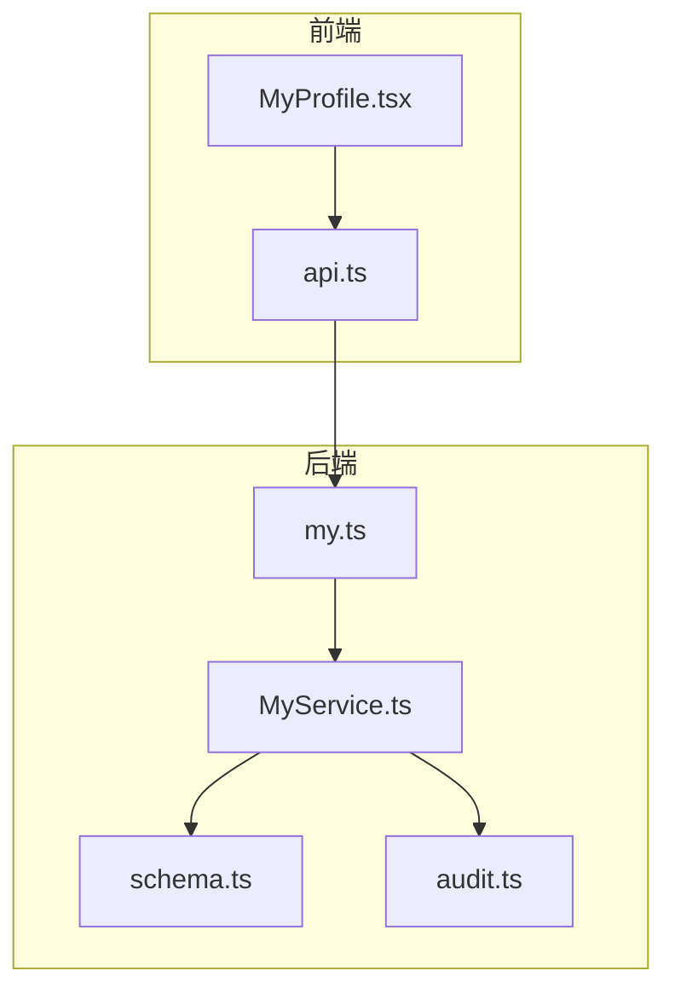
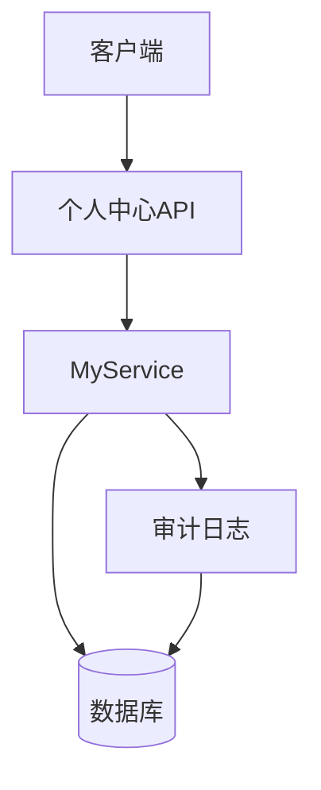
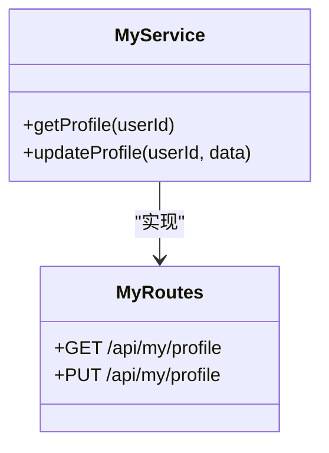
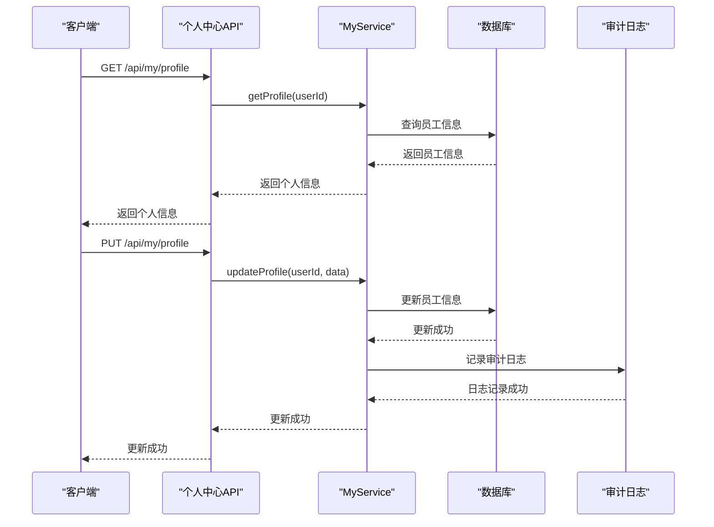
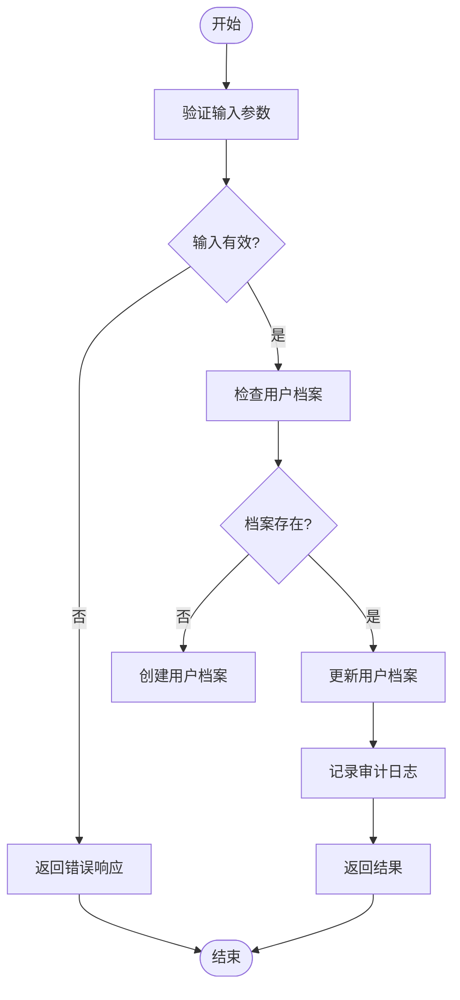
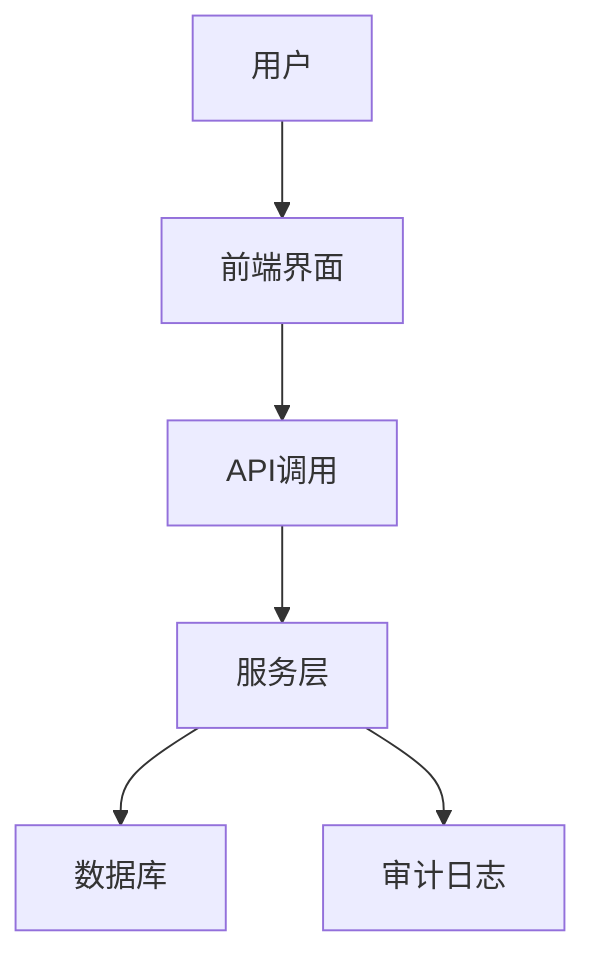
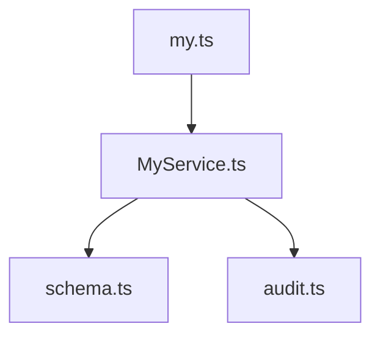

# 个人中心API

<cite>
**本文档引用的文件**   
- [my.ts](file://backend/src/routes/my.ts)
- [MyService.ts](file://backend/src/services/MyService.ts)
- [schema.ts](file://backend/src/db/schema.ts)
- [MyProfile.tsx](file://frontend/src/features/my/pages/MyProfile.tsx)
- [api.ts](file://frontend/src/config/api.ts)
- [audit.ts](file://backend/src/utils/audit.ts)
</cite>

## 目录
1. [简介](#简介)
2. [项目结构](#项目结构)
3. [核心组件](#核心组件)
4. [架构概述](#架构概述)
5. [详细组件分析](#详细组件分析)
6. [依赖分析](#依赖分析)
7. [性能考虑](#性能考虑)
8. [故障排除指南](#故障排除指南)
9. [结论](#结论)

## 简介
本文档详细介绍了个人中心API的实现，重点涵盖`GET /api/my/profile`（获取个人信息）和`PUT /api/my/profile`（更新个人信息）端点。文档详细说明了如何通过API读取和修改用户的个人资料，包括姓名、联系方式、紧急联系人等信息。同时解释了数据的来源（员工表、用户表关联）和更新时的审计日志记录。提供了前端表单集成示例和数据验证规则，并重点描述了个人信息更新的安全性和隐私保护措施。

## 项目结构
项目结构清晰地分为前端和后端两个主要部分。后端API位于`backend/src/routes/my.ts`，前端组件位于`frontend/src/features/my/pages/MyProfile.tsx`。API的定义和实现通过OpenAPI规范进行描述，确保了前后端的一致性。

**Diagram sources**
- [my.ts](file://backend/src/routes/my.ts#L542-L566)
- [MyProfile.tsx](file://frontend/src/features/my/pages/MyProfile.tsx#L1-L163)
- [api.ts](file://frontend/src/config/api.ts#L152-L160)

**Section sources**
- [my.ts](file://backend/src/routes/my.ts)
- [MyProfile.tsx](file://frontend/src/features/my/pages/MyProfile.tsx)

## 核心组件
个人中心API的核心功能由`my.ts`中的路由定义和`MyService.ts`中的服务实现组成。`GET /api/my/profile`端点用于获取用户的个人信息，而`PUT /api/my/profile`端点用于更新用户的个人信息。这些端点通过`MyService`类中的`getProfile`和`updateProfile`方法实现。

**Section sources**
- [my.ts](file://backend/src/routes/my.ts#L542-L566)
- [MyService.ts](file://backend/src/services/MyService.ts#L473-L548)

## 架构概述
个人中心API的架构基于Hono框架，使用Zod进行数据验证。API通过`MyService`类与数据库进行交互，获取和更新用户信息。审计日志记录通过`audit.ts`中的`logAuditAction`函数实现，确保每次更新操作都被记录。

**Diagram sources**
- [my.ts](file://backend/src/routes/my.ts#L542-L566)
- [MyService.ts](file://backend/src/services/MyService.ts#L473-L548)
- [audit.ts](file://backend/src/utils/audit.ts#L61-L91)

## 详细组件分析

### 个人信息获取与更新分析
个人信息的获取和更新功能通过`MyService`类中的`getProfile`和`updateProfile`方法实现。`getProfile`方法从数据库中获取用户的个人信息，包括姓名、邮箱、电话、职位、部门等。`updateProfile`方法则允许用户更新其电话、紧急联系人和紧急联系电话。

#### 对象导向组件：

**Diagram sources**
- [MyService.ts](file://backend/src/services/MyService.ts#L473-L548)
- [my.ts](file://backend/src/routes/my.ts#L542-L566)

#### API/服务组件：

**Diagram sources**
- [my.ts](file://backend/src/routes/my.ts#L542-L566)
- [MyService.ts](file://backend/src/services/MyService.ts#L473-L548)
- [audit.ts](file://backend/src/utils/audit.ts#L61-L91)

#### 复杂逻辑组件：

**Diagram sources**
- [MyService.ts](file://backend/src/services/MyService.ts#L473-L548)
- [audit.ts](file://backend/src/utils/audit.ts#L61-L91)

**Section sources**
- [MyService.ts](file://backend/src/services/MyService.ts#L473-L548)
- [my.ts](file://backend/src/routes/my.ts#L542-L566)

### 概念概述
个人中心API的设计旨在提供一个安全、高效的用户个人信息管理接口。通过严格的权限控制和审计日志记录，确保用户数据的安全性和完整性。

## 依赖分析
个人中心API依赖于多个后端组件，包括`MyService`、`schema.ts`和`audit.ts`。`MyService`负责业务逻辑的实现，`schema.ts`定义了数据库表结构，`audit.ts`负责审计日志的记录。

**Diagram sources**
- [my.ts](file://backend/src/routes/my.ts#L6)
- [MyService.ts](file://backend/src/services/MyService.ts#L8)
- [schema.ts](file://backend/src/db/schema.ts)
- [audit.ts](file://backend/src/utils/audit.ts#L4)

**Section sources**
- [my.ts](file://backend/src/routes/my.ts)
- [MyService.ts](file://backend/src/services/MyService.ts)
- [schema.ts](file://backend/src/db/schema.ts)
- [audit.ts](file://backend/src/utils/audit.ts)

## 性能考虑
个人中心API在设计时考虑了性能优化。通过使用Drizzle ORM进行数据库查询，确保了查询的高效性。同时，审计日志的记录使用了异步操作，避免阻塞主流程。

## 故障排除指南
在使用个人中心API时，可能会遇到以下问题：
- **权限不足**：确保用户具有访问个人中心API的权限。
- **数据验证失败**：检查请求体中的数据是否符合API定义的格式。
- **审计日志未记录**：检查`audit.ts`中的`logAuditAction`函数是否正确调用。

**Section sources**
- [my.ts](file://backend/src/routes/my.ts#L542-L566)
- [MyService.ts](file://backend/src/services/MyService.ts#L473-L548)
- [audit.ts](file://backend/src/utils/audit.ts#L61-L91)

## 结论
个人中心API通过清晰的架构设计和严格的权限控制，提供了一个安全、高效的用户个人信息管理接口。通过详细的文档和示例，开发者可以轻松地集成和使用该API，确保用户数据的安全性和完整性。