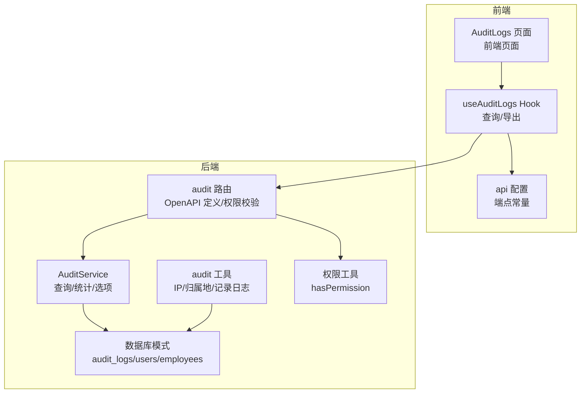
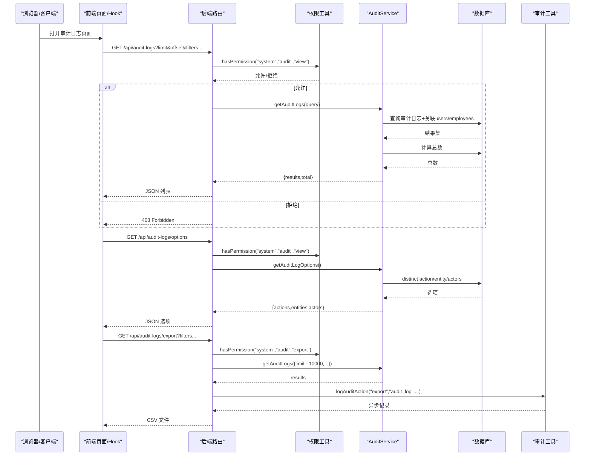
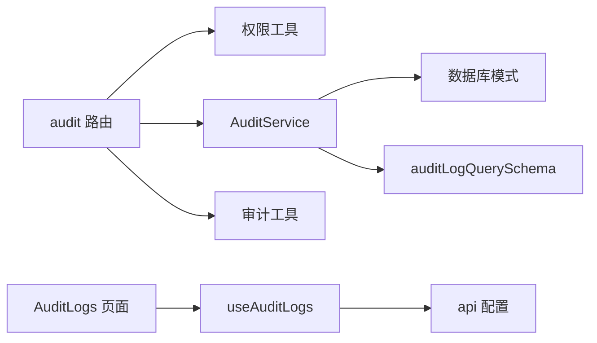

# 审计日志API

<cite>
**本文引用的文件**
- [backend/src/routes/audit.ts](file://backend/src/routes/audit.ts)
- [backend/src/services/AuditService.ts](file://backend/src/services/AuditService.ts)
- [backend/src/utils/audit.ts](file://backend/src/utils/audit.ts)
- [backend/src/db/schema.ts](file://backend/src/db/schema.ts)
- [backend/src/schemas/common.schema.ts](file://backend/src/schemas/common.schema.ts)
- [backend/src/middleware/permission.ts](file://backend/src/middleware/permission.ts)
- [backend/src/utils/permissions.ts](file://backend/src/utils/permissions.ts)
- [backend/test/routes/audit.test.ts](file://backend/test/routes/audit.test.ts)
- [frontend/src/features/system/pages/AuditLogs.tsx](file://frontend/src/features/system/pages/AuditLogs.tsx)
- [frontend/src/hooks/business/useAuditLogs.ts](file://frontend/src/hooks/business/useAuditLogs.ts)
- [frontend/src/config/api.ts](file://frontend/src/config/api.ts)
</cite>

## 目录
1. [简介](#简介)
2. [项目结构](#项目结构)
3. [核心组件](#核心组件)
4. [架构总览](#架构总览)
5. [详细组件分析](#详细组件分析)
6. [依赖关系分析](#依赖关系分析)
7. [性能考量](#性能考量)
8. [故障排查指南](#故障排查指南)
9. [结论](#结论)
10. [附录](#附录)

## 简介
本文件为“审计日志API”的全面技术文档，覆盖以下端点：
- GET /api/audit-logs：获取审计日志列表，支持按操作类型、实体类型、操作人、时间范围等条件过滤，支持分页与总数统计
- GET /api/audit-logs/options：获取过滤选项（操作类型、实体类型、操作人）
- GET /api/audit-logs/export：导出审计日志为CSV，支持最多1万条记录

文档还详细说明了字段含义（操作人、IP地址、IP归属地等）、数据关联查询（员工、用户）、安全控制（权限校验）、性能优化策略与常见问题排查方法。

## 项目结构
审计日志相关代码分布在后端路由、服务层、工具与数据库模式，以及前端页面与Hook中，形成清晰的职责分离：
- 后端路由：定义API端点、请求校验、权限控制与导出响应
- 服务层：封装数据库查询、聚合统计与过滤逻辑
- 工具层：统一记录审计日志并采集IP与归属地信息
- 前端页面与Hook：提供UI交互、分页与导出下载

图表来源
- [backend/src/routes/audit.ts](file://backend/src/routes/audit.ts#L41-L161)
- [backend/src/services/AuditService.ts](file://backend/src/services/AuditService.ts#L1-L113)
- [backend/src/utils/audit.ts](file://backend/src/utils/audit.ts#L1-L92)
- [backend/src/db/schema.ts](file://backend/src/db/schema.ts#L633-L644)
- [backend/src/middleware/permission.ts](file://backend/src/middleware/permission.ts#L1-L39)
- [backend/src/utils/permissions.ts](file://backend/src/utils/permissions.ts#L80-L114)
- [frontend/src/features/system/pages/AuditLogs.tsx](file://frontend/src/features/system/pages/AuditLogs.tsx#L1-L182)
- [frontend/src/hooks/business/useAuditLogs.ts](file://frontend/src/hooks/business/useAuditLogs.ts#L1-L116)
- [frontend/src/config/api.ts](file://frontend/src/config/api.ts#L73-L77)

章节来源
- [backend/src/routes/audit.ts](file://backend/src/routes/audit.ts#L41-L161)
- [backend/src/services/AuditService.ts](file://backend/src/services/AuditService.ts#L1-L113)
- [backend/src/utils/audit.ts](file://backend/src/utils/audit.ts#L1-L92)
- [backend/src/db/schema.ts](file://backend/src/db/schema.ts#L633-L644)
- [frontend/src/features/system/pages/AuditLogs.tsx](file://frontend/src/features/system/pages/AuditLogs.tsx#L1-L182)
- [frontend/src/hooks/business/useAuditLogs.ts](file://frontend/src/hooks/business/useAuditLogs.ts#L1-L116)
- [frontend/src/config/api.ts](file://frontend/src/config/api.ts#L73-L77)

## 核心组件
- 审计日志路由与权限控制
  - 定义三个端点：列表、选项、导出
  - 对“查看”和“导出”分别进行权限校验
- 审计服务
  - 支持多条件过滤（操作类型、实体类型、操作人、时间范围）
  - 关联查询用户与员工表，补充操作人姓名与邮箱
  - 提供总数统计与分页
- 审计工具
  - 自动采集客户端IP与IP归属地（来自Cloudflare请求头）
  - 异步记录审计日志，避免阻塞主流程
- 数据库模式
  - 审计日志表包含操作人ID、操作类型、实体类型、实体ID、时间戳、详情、IP与IP归属地
  - 与users、employees表建立关联，用于显示操作人信息
- 前端集成
  - 页面提供过滤器（操作类型、实体类型、操作人关键词、时间范围）
  - 支持分页与导出CSV

章节来源
- [backend/src/routes/audit.ts](file://backend/src/routes/audit.ts#L41-L161)
- [backend/src/services/AuditService.ts](file://backend/src/services/AuditService.ts#L1-L113)
- [backend/src/utils/audit.ts](file://backend/src/utils/audit.ts#L1-L92)
- [backend/src/db/schema.ts](file://backend/src/db/schema.ts#L633-L644)
- [frontend/src/features/system/pages/AuditLogs.tsx](file://frontend/src/features/system/pages/AuditLogs.tsx#L1-L182)
- [frontend/src/hooks/business/useAuditLogs.ts](file://frontend/src/hooks/business/useAuditLogs.ts#L1-L116)

## 架构总览
下图展示审计日志API的调用链路与数据流向：

图表来源
- [backend/src/routes/audit.ts](file://backend/src/routes/audit.ts#L41-L161)
- [backend/src/services/AuditService.ts](file://backend/src/services/AuditService.ts#L1-L113)
- [backend/src/utils/audit.ts](file://backend/src/utils/audit.ts#L61-L92)
- [backend/src/middleware/permission.ts](file://backend/src/middleware/permission.ts#L12-L37)
- [backend/src/utils/permissions.ts](file://backend/src/utils/permissions.ts#L80-L114)

## 详细组件分析

### 审计日志路由与端点
- GET /api/audit-logs
  - 请求体：查询参数（见“查询参数Schema”）
  - 响应：{ results: 审计日志数组, total: 数字 }
  - 权限：需要“system.audit.view”
  - 处理流程：校验权限 -> 解析查询 -> 调用服务层 -> 返回JSON
- GET /api/audit-logs/options
  - 响应：{ actions: 字符串[], entities: 字符串[], actors: {id,name,email}[] }
  - 权限：需要“system.audit.view”
  - 处理流程：校验权限 -> 查询distinct值 -> 返回选项
- GET /api/audit-logs/export
  - 请求体：查询参数（最大导出10000条）
  - 响应：CSV文件（UTF-8带BOM），文件名为“audit-logs-YYYY-MM-DD.csv”
  - 权限：需要“system.audit.export”
  - 处理流程：校验权限 -> 生成CSV -> 设置Content-Type与Content-Disposition -> 返回

章节来源
- [backend/src/routes/audit.ts](file://backend/src/routes/audit.ts#L41-L161)
- [backend/src/schemas/common.schema.ts](file://backend/src/schemas/common.schema.ts#L188-L201)
- [backend/src/middleware/permission.ts](file://backend/src/middleware/permission.ts#L12-L37)
- [backend/src/utils/permissions.ts](file://backend/src/utils/permissions.ts#L80-L114)

### 审计服务：查询、统计与选项
- 查询逻辑
  - 条件拼装：action、entity、actorId、actor_keyword（模糊匹配员工姓名或用户邮箱）、start_time、end_time
  - 关联查询：左连接users与employees，补充操作人姓名与邮箱
  - 排序：按时间倒序
  - 分页：默认limit=100，offset=0；支持自定义
  - 总数：对相同条件执行count(*)统计
- 选项逻辑
  - distinct action、entity
  - actors：基于auditLogs.actorId内连接users与employees，去重排序

章节来源
- [backend/src/services/AuditService.ts](file://backend/src/services/AuditService.ts#L1-L113)
- [backend/src/db/schema.ts](file://backend/src/db/schema.ts#L633-L644)

### 审计工具：IP采集与异步记录
- IP与归属地采集
  - 优先读取Cloudflare请求头（cf-connecting-ip、cf-ipcountry、cf-ipcity）
  - 若无则回退到x-forwarded-for
  - 归属地字符串为城市与国家组合
- 日志记录
  - 支持传入显式IP/归属地，否则自动采集
  - 使用waitUntil确保在执行上下文中异步写入，避免阻塞响应
  - 记录时会同时记录操作类型、实体类型、实体ID、详情等

章节来源
- [backend/src/utils/audit.ts](file://backend/src/utils/audit.ts#L1-L92)

### 数据模型与字段说明
- 审计日志表（audit_logs）
  - 字段：id、actorId、action、entity、entityId、at（时间戳）、detail、ip、ipLocation
  - 关联：actorId -> users.id；users.email -> employees.email
- 前端返回字段
  - id、actorId、action、entity、entityId、at、detail、ip、ipLocation、actorName、actorEmail
  - 其中actorName与actorEmail来自关联查询结果

章节来源
- [backend/src/db/schema.ts](file://backend/src/db/schema.ts#L633-L644)
- [backend/src/services/AuditService.ts](file://backend/src/services/AuditService.ts#L44-L56)
- [frontend/src/features/system/pages/AuditLogs.tsx](file://frontend/src/features/system/pages/AuditLogs.tsx#L58-L109)

### 前端集成：页面、Hook与API配置
- 页面（AuditLogs）
  - 提供过滤器：操作类型、实体类型、操作人关键词、时间范围
  - 分页：每页大小与当前页码
  - 导出：触发CSV下载
- Hook（useAuditLogs）
  - 查询：构建URL参数，调用GET /api/audit-logs
  - 选项：GET /api/audit-logs/options
  - 导出：GET /api/audit-logs/export，Blob响应
- API配置
  - 定义了审计日志相关端点常量

章节来源
- [frontend/src/features/system/pages/AuditLogs.tsx](file://frontend/src/features/system/pages/AuditLogs.tsx#L1-L182)
- [frontend/src/hooks/business/useAuditLogs.ts](file://frontend/src/hooks/business/useAuditLogs.ts#L1-L116)
- [frontend/src/config/api.ts](file://frontend/src/config/api.ts#L73-L77)

## 依赖关系分析
- 路由依赖
  - 权限工具：hasPermission
  - 服务层：AuditService
  - 审计工具：logAuditAction（导出后记录导出行为）
- 服务层依赖
  - 数据库模式：audit_logs、users、employees
  - 查询条件：基于common.schema中的auditLogQuerySchema
- 前端依赖
  - API配置：api.auditLogs、api.auditLogsOptions、api.auditLogsExport
  - Hook：useAuditLogs、useAuditLogOptions、useExportAuditLogs

图表来源
- [backend/src/routes/audit.ts](file://backend/src/routes/audit.ts#L41-L161)
- [backend/src/services/AuditService.ts](file://backend/src/services/AuditService.ts#L1-L113)
- [backend/src/utils/audit.ts](file://backend/src/utils/audit.ts#L61-L92)
- [backend/src/schemas/common.schema.ts](file://backend/src/schemas/common.schema.ts#L188-L201)
- [frontend/src/hooks/business/useAuditLogs.ts](file://frontend/src/hooks/business/useAuditLogs.ts#L1-L116)
- [frontend/src/config/api.ts](file://frontend/src/config/api.ts#L73-L77)

章节来源
- [backend/src/routes/audit.ts](file://backend/src/routes/audit.ts#L41-L161)
- [backend/src/services/AuditService.ts](file://backend/src/services/AuditService.ts#L1-L113)
- [backend/src/schemas/common.schema.ts](file://backend/src/schemas/common.schema.ts#L188-L201)
- [frontend/src/hooks/business/useAuditLogs.ts](file://frontend/src/hooks/business/useAuditLogs.ts#L1-L116)
- [frontend/src/config/api.ts](file://frontend/src/config/api.ts#L73-L77)

## 性能考量
- 查询性能
  - 当前实现对每个过滤条件都拼接为WHERE子句，并在审计日志表上进行关联查询
  - 建议在审计日志表上建立复合索引（例如：action、entity、at、actorId），以提升过滤与排序性能
- 分页与总数
  - 默认limit=100，避免一次性返回大量数据
  - 总数统计采用与查询相同的条件，建议在高频查询场景下考虑缓存总数
- 导出性能
  - 导出限制为最多10000条，避免超大数据量导出导致内存压力
  - CSV生成在内存中拼接，建议在数据量较大时提示用户缩小时间范围或减少导出条数
- 异步记录
  - 审计日志记录使用waitUntil异步执行，避免阻塞主流程，提高响应速度

章节来源
- [backend/src/services/AuditService.ts](file://backend/src/services/AuditService.ts#L1-L113)
- [backend/src/routes/audit.ts](file://backend/src/routes/audit.ts#L115-L160)
- [backend/src/utils/audit.ts](file://backend/src/utils/audit.ts#L61-L92)

## 故障排查指南
- 403 Forbidden
  - 现象：访问审计日志端点返回403
  - 可能原因：当前用户缺少“system.audit.view”或“system.audit.export”权限
  - 处理：确认职位权限配置，确保具备相应模块与操作权限
- 导出为空或数量异常
  - 现象：导出CSV内容为空或少于预期
  - 可能原因：查询条件过于严格、时间范围过大、数据库中无匹配数据
  - 处理：缩小时间范围、调整过滤条件、确认导出上限为10000条
- IP与归属地为空
  - 现象：IP地址与IP归属地字段为空
  - 可能原因：请求未经过Cloudflare或缺少相关请求头
  - 处理：确认部署环境与请求链路，确保Cloudflare请求头可用
- 前端无法加载选项
  - 现象：操作类型、实体类型、操作人下拉框为空
  - 可能原因：后端未返回选项或网络错误
  - 处理：检查OPTIONS端点权限与后端日志，确认数据库中存在相关数据

章节来源
- [backend/src/middleware/permission.ts](file://backend/src/middleware/permission.ts#L12-L37)
- [backend/src/utils/permissions.ts](file://backend/src/utils/permissions.ts#L80-L114)
- [backend/test/routes/audit.test.ts](file://backend/test/routes/audit.test.ts#L1-L100)
- [backend/src/utils/audit.ts](file://backend/src/utils/audit.ts#L1-L34)

## 结论
本审计日志API提供了完整的日志查询、过滤与导出能力，结合权限控制与异步记录机制，既满足合规审计需求，又兼顾性能与用户体验。建议后续在数据库层面增加索引、优化导出策略，并完善异常监控与告警，以进一步提升稳定性与可观测性。

## 附录

### API定义与参数说明
- GET /api/audit-logs
  - 查询参数（均可选）
    - action：操作类型
    - entity：实体类型
    - actorId：操作人用户ID（UUID）
    - actor_keyword：操作人关键词（模糊匹配员工姓名或用户邮箱）
    - start_time：开始时间（毫秒时间戳）
    - end_time：结束时间（毫秒时间戳）
    - limit：每页条数，默认100，最大1000
    - offset：偏移量，默认0
  - 响应
    - results：审计日志数组
    - total：总数
- GET /api/audit-logs/options
  - 响应
    - actions：操作类型数组
    - entities：实体类型数组
    - actors：操作人数组（含id、name、email）
- GET /api/audit-logs/export
  - 查询参数同上
  - 响应：CSV文件（UTF-8带BOM）

章节来源
- [backend/src/schemas/common.schema.ts](file://backend/src/schemas/common.schema.ts#L188-L201)
- [backend/src/routes/audit.ts](file://backend/src/routes/audit.ts#L41-L161)

### 字段说明
- 审计日志字段
  - id：日志ID
  - actorId：操作人用户ID
  - action：操作类型（如创建、更新、删除、登录等）
  - entity：实体类型（如用户、账户、费用等）
  - entityId：实体ID
  - at：时间戳（毫秒）
  - detail：详情（JSON字符串或文本）
  - ip：IP地址
  - ipLocation：IP归属地（城市、国家）
  - actorName：操作人姓名（来自员工表）
  - actorEmail：操作人邮箱（来自用户表）

章节来源
- [backend/src/db/schema.ts](file://backend/src/db/schema.ts#L633-L644)
- [backend/src/services/AuditService.ts](file://backend/src/services/AuditService.ts#L44-L56)
- [frontend/src/features/system/pages/AuditLogs.tsx](file://frontend/src/features/system/pages/AuditLogs.tsx#L58-L109)

### 权限与安全控制
- 权限要求
  - 查看审计日志：system.audit.view
  - 导出审计日志：system.audit.export
- 实现方式
  - 路由层使用hasPermission进行校验
  - 导出完成后记录一次“export”行为日志，便于二次审计

章节来源
- [backend/src/middleware/permission.ts](file://backend/src/middleware/permission.ts#L12-L37)
- [backend/src/utils/permissions.ts](file://backend/src/utils/permissions.ts#L80-L114)
- [backend/src/routes/audit.ts](file://backend/src/routes/audit.ts#L115-L160)
- [backend/src/utils/audit.ts](file://backend/src/utils/audit.ts#L61-L92)

### 前端使用要点
- 页面提供四种过滤器：操作类型、实体类型、操作人关键词、时间范围
- 分页：每页默认20条，支持切换页码与页大小
- 导出：点击导出按钮后自动下载CSV文件

章节来源
- [frontend/src/features/system/pages/AuditLogs.tsx](file://frontend/src/features/system/pages/AuditLogs.tsx#L1-L182)
- [frontend/src/hooks/business/useAuditLogs.ts](file://frontend/src/hooks/business/useAuditLogs.ts#L1-L116)
- [frontend/src/config/api.ts](file://frontend/src/config/api.ts#L73-L77)