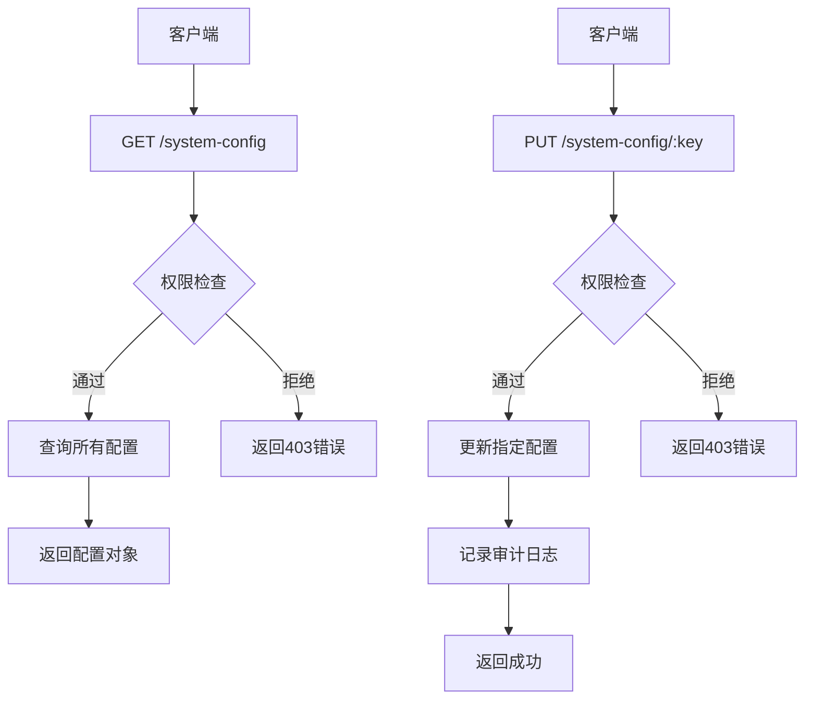
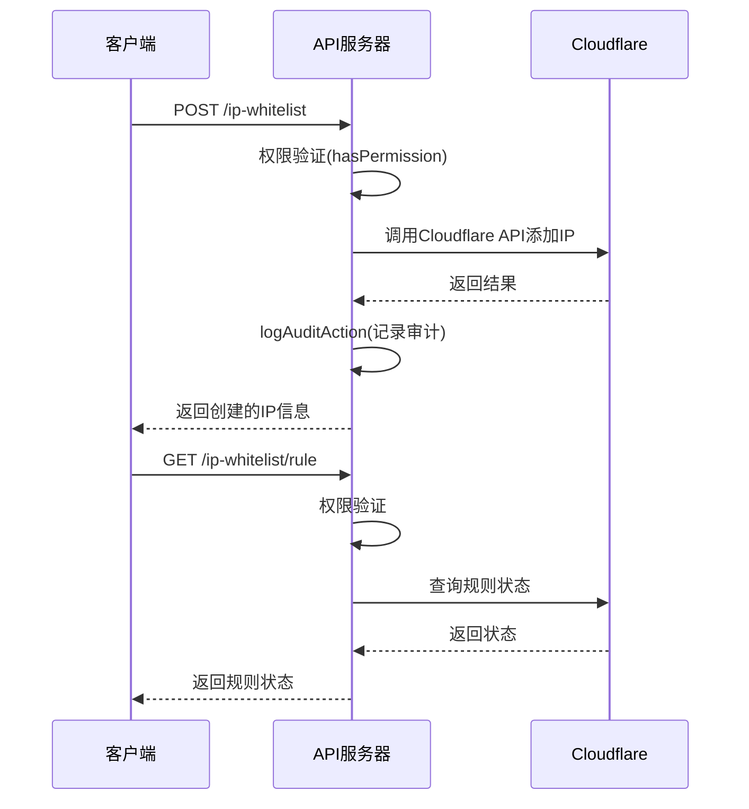
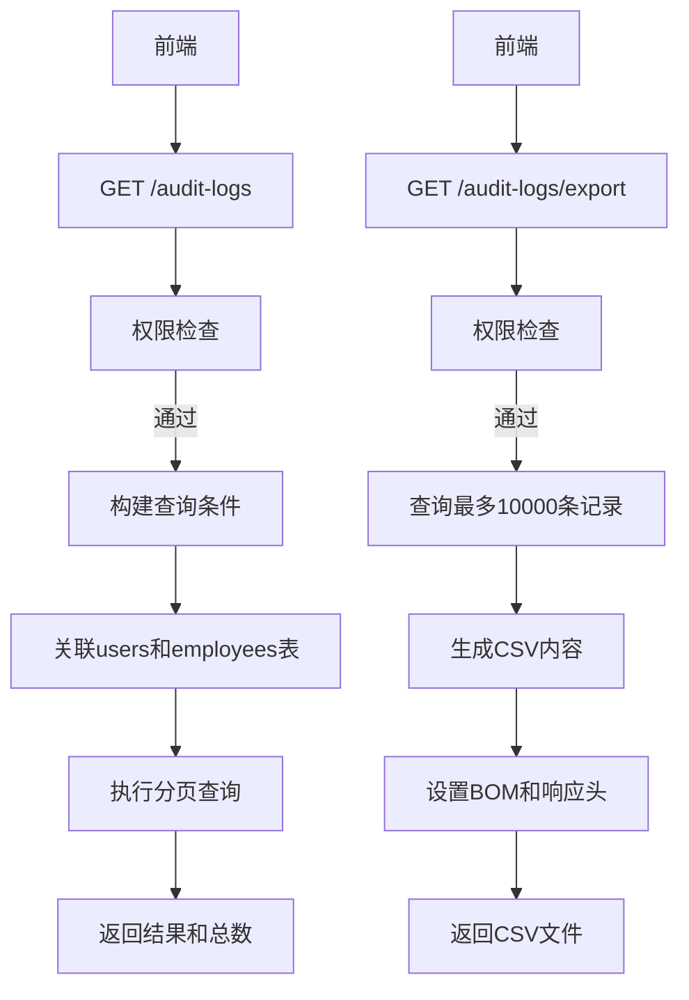
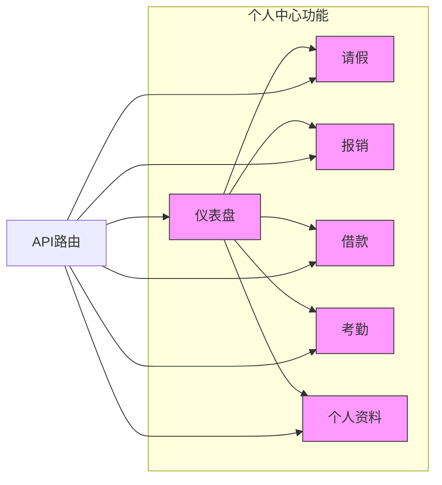
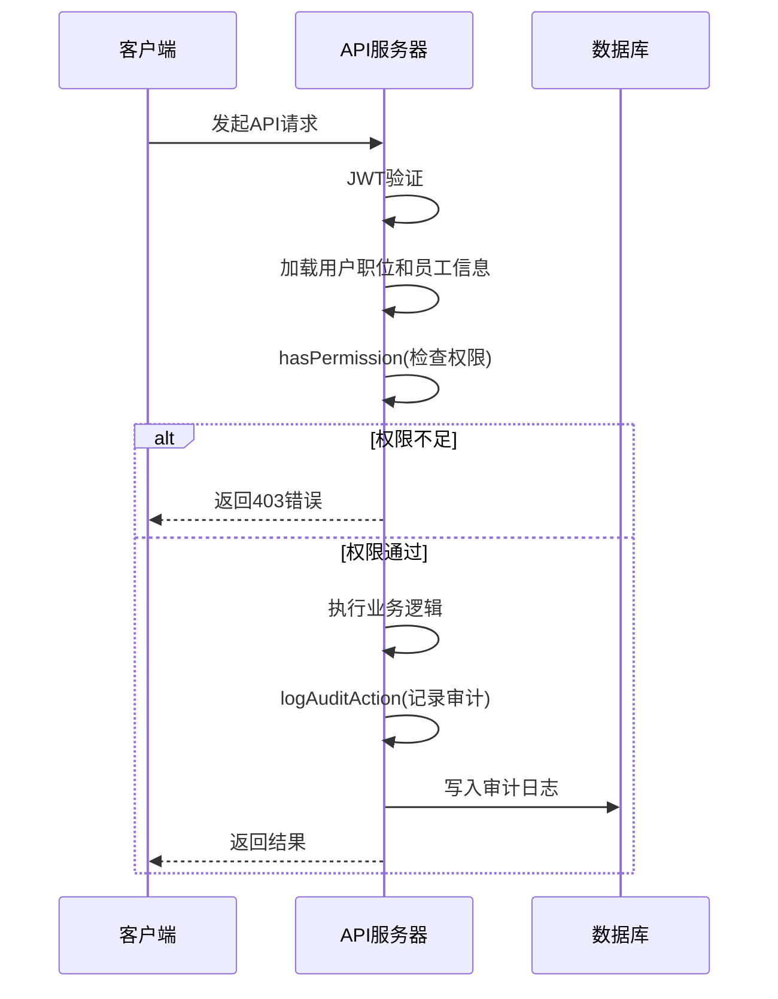
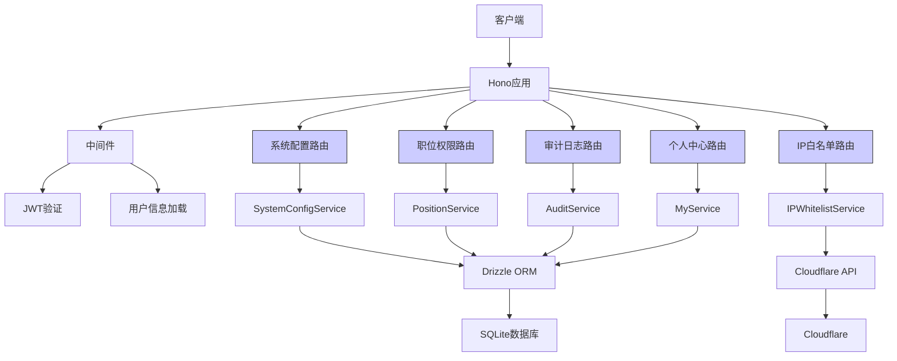

# 系统管理API

<cite>
**本文档引用的文件**   
- [system-config.ts](file://backend/src/routes/system-config.ts)
- [ip-whitelist.ts](file://backend/src/routes/ip-whitelist.ts)
- [position-permissions.ts](file://backend/src/routes/position-permissions.ts)
- [audit.ts](file://backend/src/routes/audit.ts)
- [my.ts](file://backend/src/routes/my.ts)
- [permissions.ts](file://backend/src/utils/permissions.ts)
- [audit.ts](file://backend/src/utils/audit.ts)
- [SystemConfigService.ts](file://backend/src/services/SystemConfigService.ts)
- [IPWhitelistService.ts](file://backend/src/services/IPWhitelistService.ts)
- [AuditService.ts](file://backend/src/services/AuditService.ts)
- [schema.ts](file://backend/src/db/schema.ts)
</cite>

## 目录
1. [简介](#简介)
2. [系统配置](#系统配置)
3. [IP白名单](#ip白名单)
4. [职位权限](#职位权限)
5. [审计日志](#审计日志)
6. [个人中心](#个人中心)
7. [安全与权限验证机制](#安全与权限验证机制)
8. [架构概览](#架构概览)

## 简介
本系统管理API文档涵盖了财务系统中的核心管理功能，包括系统配置、IP白名单、职位权限、审计日志和个人中心等模块。这些API为系统管理员提供了全面的系统级参数配置、访问控制策略管理、基于职位的权限体系定义、审计日志查询以及用户自助服务功能。

系统采用基于职位的权限控制模型（RBAC），通过六种核心职位（总部主管、总部专员、项目主管、项目专员、组长、工程师）实现精细化的权限管理。所有管理操作均被记录在审计日志中，确保操作的可追溯性和安全性。API设计遵循RESTful原则，使用JSON作为数据交换格式，并通过中间件实现统一的权限验证和审计日志记录。

**Section sources**
- [system-config.ts](file://backend/src/routes/system-config.ts)
- [ip-whitelist.ts](file://backend/src/routes/ip-whitelist.ts)
- [position-permissions.ts](file://backend/src/routes/position-permissions.ts)
- [audit.ts](file://backend/src/routes/audit.ts)
- [my.ts](file://backend/src/routes/my.ts)

## 系统配置
系统配置API（`/api/system-config`）允许管理员查询和更新系统级参数。这些参数存储在数据库的`system_config`表中，支持任意类型的值（通过JSON存储），并包含描述信息和更新记录。

该API提供了对所有系统配置的读写访问，包括检查特定功能（如邮件通知）是否启用。所有配置更新操作都会被记录在审计日志中，确保变更的可追溯性。



**Diagram sources**
- [system-config.ts](file://backend/src/routes/system-config.ts)
- [SystemConfigService.ts](file://backend/src/services/SystemConfigService.ts)
- [schema.ts](file://backend/src/db/schema.ts)

**Section sources**
- [system-config.ts](file://backend/src/routes/system-config.ts#L32-L197)
- [SystemConfigService.ts](file://backend/src/services/SystemConfigService.ts#L1-L60)

## IP白名单
IP白名单API（`/api/ip-whitelist`）通过与Cloudflare的集成，实现对系统访问的IP地址控制。该功能不直接在本地数据库中存储IP列表，而是通过调用Cloudflare API来管理其IP列表（IP List）和规则（Ruleset）。

管理员可以执行添加单个IP、批量添加IP、删除IP、批量删除IP以及同步Cloudflare列表等操作。此外，还可以查询当前的IP白名单规则状态并进行启用/禁用切换。所有操作均需`system.config.update`权限，并会被记录在审计日志中。



**Diagram sources**
- [ip-whitelist.ts](file://backend/src/routes/ip-whitelist.ts)
- [IPWhitelistService.ts](file://backend/src/services/IPWhitelistService.ts)
- [schema.ts](file://backend/src/db/schema.ts)

**Section sources**
- [ip-whitelist.ts](file://backend/src/routes/ip-whitelist.ts#L51-L329)
- [IPWhitelistService.ts](file://backend/src/services/IPWhitelistService.ts#L1-L138)

## 职位权限
职位权限API（`/api/position-permissions`）用于管理系统的职位体系和权限配置。系统基于六种核心职位模型（总部主管、总部专员、项目主管、项目专员、组长、工程师），每个职位拥有不同的权限级别（level）和管理下属的能力。

通过此API，管理员可以创建、读取、更新和删除职位。每个职位的权限以JSON格式存储，定义了该职位在各个模块（如hr、finance、system等）和子模块上的具体操作权限（view、create、update、delete等）。所有对职位的变更操作都会被记录在审计日志中。

```mermaid
classDiagram
class Position {
+id : string
+code : string
+name : string
+level : number
+functionRole : string
+permissions : any
+description : string
+sortOrder : number
+active : number
+canManageSubordinates : number
+createdAt : number
+updatedAt : number
}
class PositionService {
+getPositions() : Promise~Array~
+getPosition(id : string) : Promise~Object~
+createPosition(data : Object) : Promise~Object~
+updatePosition(id : string, data : Object) : Promise~Object~
+deletePosition(id : string) : Promise~void~
}
class PositionPermissionsRoutes {
+GET /position-permissions
+GET /position-permissions/{id}
+POST /position-permissions
+PUT /position-permissions/{id}
+DELETE /position-permissions/{id}
}
PositionPermissionsRoutes --> PositionService : "调用"
PositionService --> Position : "管理"
```

**Diagram sources**
- [position-permissions.ts](file://backend/src/routes/position-permissions.ts)
- [schema.ts](file://backend/src/db/schema.ts)

**Section sources**
- [position-permissions.ts](file://backend/src/routes/position-permissions.ts#L32-L207)
- [schema.ts](file://backend/src/db/schema.ts#L58-L71)

## 审计日志
审计日志API（`/api/audit-logs`）提供了对系统所有关键操作的查询和导出功能。所有管理操作（如配置更改、IP白名单修改、职位变更等）都会通过`logAuditAction`函数记录到`audit_logs`表中。

该API支持按操作类型、实体类型、操作人、时间范围等条件进行过滤查询，并提供分页功能。此外，还提供了获取过滤选项的接口，以及将审计日志导出为CSV文件的功能（最多导出10,000条记录）。导出操作本身也会被记录在审计日志中。



**Diagram sources**
- [audit.ts](file://backend/src/routes/audit.ts)
- [AuditService.ts](file://backend/src/services/AuditService.ts)
- [schema.ts](file://backend/src/db/schema.ts)

**Section sources**
- [audit.ts](file://backend/src/routes/audit.ts#L42-L161)
- [AuditService.ts](file://backend/src/services/AuditService.ts#L1-L113)
- [schema.ts](file://backend/src/db/schema.ts#L633-L643)

## 个人中心
个人中心API（`/api/my`）为普通用户提供了一系列自助服务功能，包括个人仪表盘、请假、报销、借款、考勤等。这些API允许用户查询和管理自己的信息，但不涉及系统级管理功能。

主要功能包括：获取个人仪表盘数据、管理请假申请、提交报销请求、申请借款、查看薪资和津贴、管理个人资产、更新个人信息以及进行考勤打卡。所有创建和更新操作都会被记录在审计日志中，确保操作的可追溯性。



**Section sources**
- [my.ts](file://backend/src/routes/my.ts#L234-L777)

## 安全与权限验证机制
系统的安全与权限验证机制是其核心组成部分，确保了所有API调用的安全性和合规性。该机制主要由权限验证和审计日志两大部分构成。

### 权限验证
权限验证通过`hasPermission`函数实现，该函数基于用户的职位（Position）和部门模块访问权限进行双重检查。首先检查用户所在部门是否允许访问目标模块，然后检查用户的职位是否具有执行特定操作（view、create、update、delete等）的权限。权限信息以JSON格式存储在职位记录中。

### 审计日志
所有关键操作都会通过`logAuditAction`函数记录到审计日志中。该函数会自动收集操作人、操作类型、实体类型、实体ID、操作详情、IP地址和IP归属地等信息。IP信息通过Cloudflare的请求头（如`cf-connecting-ip`、`cf-ipcountry`）获取，确保了日志的完整性和可追溯性。



**Diagram sources**
- [permissions.ts](file://backend/src/utils/permissions.ts)
- [audit.ts](file://backend/src/utils/audit.ts)

**Section sources**
- [permissions.ts](file://backend/src/utils/permissions.ts#L88-L114)
- [audit.ts](file://backend/src/utils/audit.ts#L61-L92)

## 架构概览
系统管理API的整体架构基于Hono框架，采用模块化的路由设计。每个管理功能（系统配置、IP白名单、职位权限等）都有独立的路由文件和对应的服务类，实现了关注点分离。

权限验证和审计日志通过中间件和工具函数在各个路由中统一调用，确保了安全机制的一致性。数据访问通过Drizzle ORM进行，与SQLite数据库交互。IP白名单功能通过调用Cloudflare API实现，展示了系统与外部服务的集成能力。



**Diagram sources**
- [system-config.ts](file://backend/src/routes/system-config.ts)
- [ip-whitelist.ts](file://backend/src/routes/ip-whitelist.ts)
- [position-permissions.ts](file://backend/src/routes/position-permissions.ts)
- [audit.ts](file://backend/src/routes/audit.ts)
- [my.ts](file://backend/src/routes/my.ts)
- [permissions.ts](file://backend/src/utils/permissions.ts)
- [audit.ts](file://backend/src/utils/audit.ts)