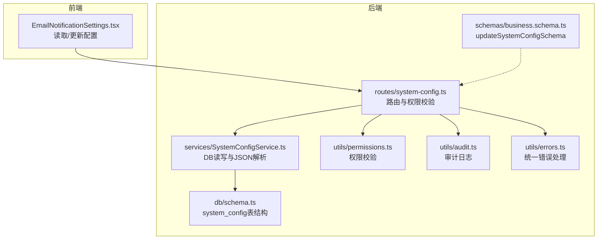
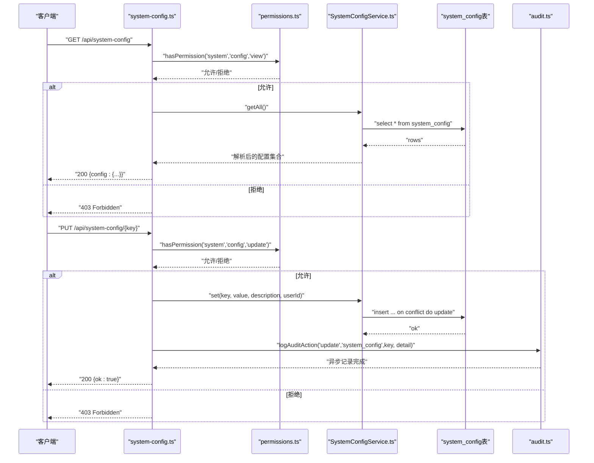
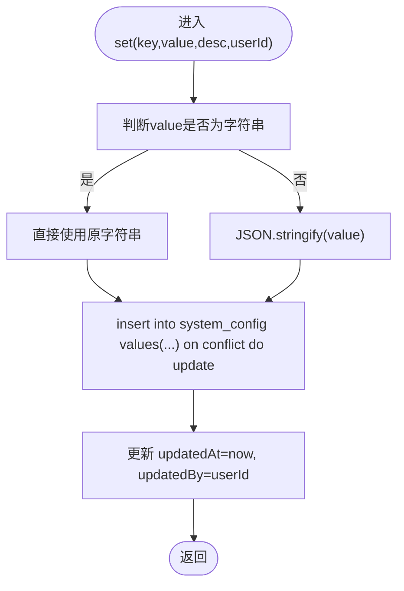
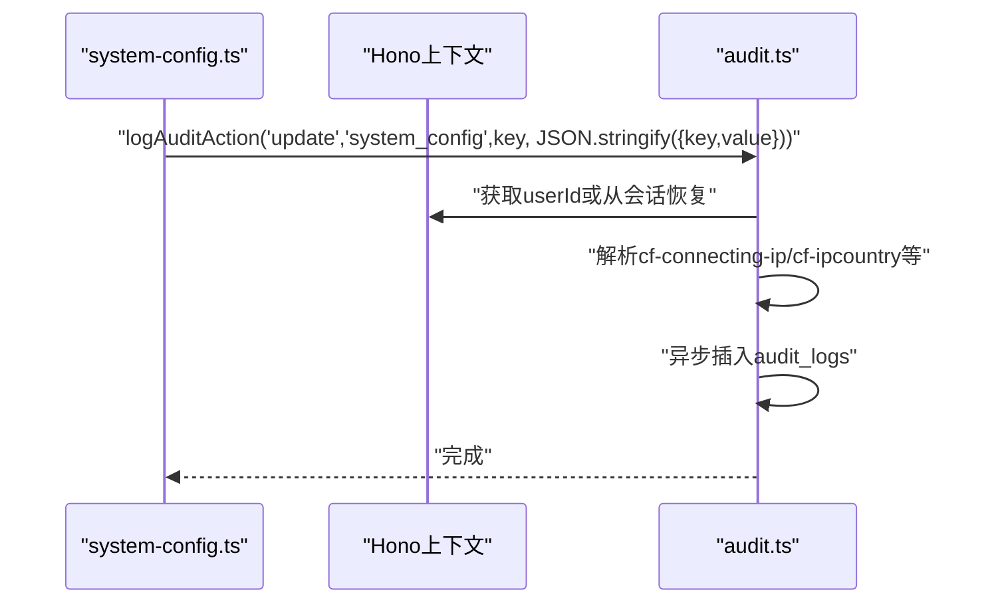
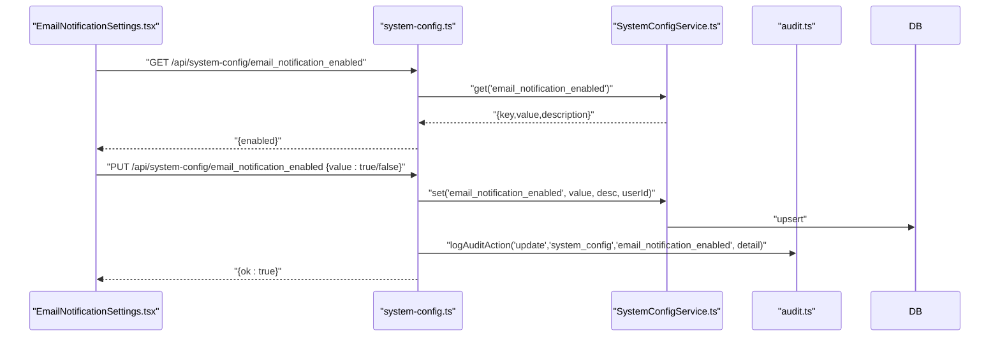
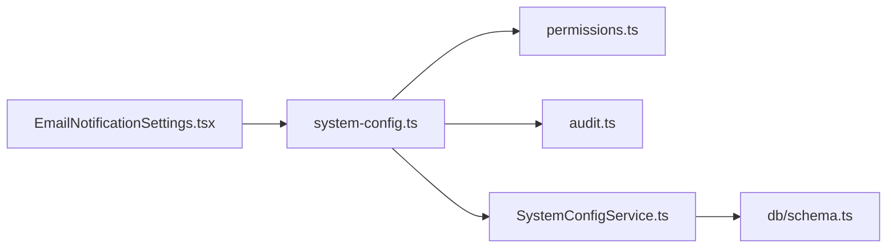
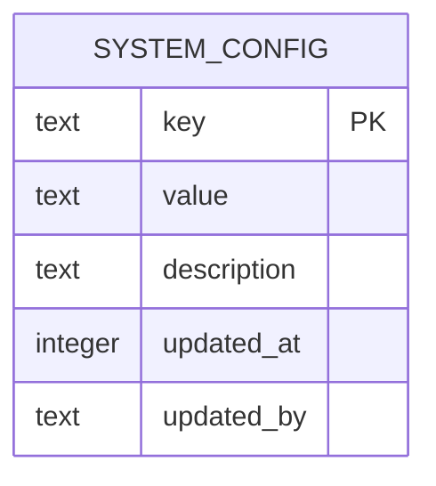

# 系统配置API

<cite>
**本文引用的文件**
- [backend/src/routes/system-config.ts](file://backend/src/routes/system-config.ts)
- [backend/src/services/SystemConfigService.ts](file://backend/src/services/SystemConfigService.ts)
- [backend/src/utils/audit.ts](file://backend/src/utils/audit.ts)
- [backend/src/utils/permissions.ts](file://backend/src/utils/permissions.ts)
- [backend/src/utils/errors.ts](file://backend/src/utils/errors.ts)
- [backend/src/schemas/business.schema.ts](file://backend/src/schemas/business.schema.ts)
- [backend/src/db/schema.ts](file://backend/src/db/schema.ts)
- [frontend/src/features/system/pages/EmailNotificationSettings.tsx](file://frontend/src/features/system/pages/EmailNotificationSettings.tsx)
- [backend/test/system-config.test.ts](file://backend/test/system-config.test.ts)
</cite>

## 目录
1. [简介](#简介)
2. [项目结构](#项目结构)
3. [核心组件](#核心组件)
4. [架构总览](#架构总览)
5. [详细组件分析](#详细组件分析)
6. [依赖关系分析](#依赖关系分析)
7. [性能考量](#性能考量)
8. [故障排查指南](#故障排查指南)
9. [结论](#结论)
10. [附录](#附录)

## 简介
本文件面向系统配置API的使用者与维护者，系统性梳理以下端点与能力：
- GET /api/system-config：获取全部系统配置（按键聚合为对象）
- GET /api/system-config/{key}：获取特定配置项
- PUT /api/system-config/{key}：更新系统配置项
- 配置值的JSON解析与存储机制
- 数据库upsert操作（冲突更新）
- 审计日志记录与变更追踪
- 权限验证与错误处理
- 实际使用场景：启用/禁用邮件通知功能

## 项目结构
系统配置API位于后端路由层，服务层负责数据库交互，工具层提供审计日志与权限校验，前端页面通过Hook调用API实现配置开关。

图表来源
- [backend/src/routes/system-config.ts](file://backend/src/routes/system-config.ts#L1-L197)
- [backend/src/services/SystemConfigService.ts](file://backend/src/services/SystemConfigService.ts#L1-L60)
- [backend/src/utils/permissions.ts](file://backend/src/utils/permissions.ts#L80-L114)
- [backend/src/utils/audit.ts](file://backend/src/utils/audit.ts#L61-L92)
- [backend/src/utils/errors.ts](file://backend/src/utils/errors.ts#L34-L54)
- [backend/src/schemas/business.schema.ts](file://backend/src/schemas/business.schema.ts#L548-L555)
- [backend/src/db/schema.ts](file://backend/src/db/schema.ts#L1-L10)

章节来源
- [backend/src/routes/system-config.ts](file://backend/src/routes/system-config.ts#L1-L197)
- [backend/src/services/SystemConfigService.ts](file://backend/src/services/SystemConfigService.ts#L1-L60)
- [backend/src/utils/permissions.ts](file://backend/src/utils/permissions.ts#L80-L114)
- [backend/src/utils/audit.ts](file://backend/src/utils/audit.ts#L61-L92)
- [backend/src/utils/errors.ts](file://backend/src/utils/errors.ts#L34-L54)
- [backend/src/schemas/business.schema.ts](file://backend/src/schemas/business.schema.ts#L548-L555)
- [backend/src/db/schema.ts](file://backend/src/db/schema.ts#L1-L10)

## 核心组件
- 路由层（system-config.ts）
  - 提供三个端点：获取全部配置、获取特定配置、更新配置
  - 在每个端点执行权限校验，并在更新时记录审计日志
- 服务层（SystemConfigService.ts）
  - 读取：对value进行JSON解析，失败则回退为原始字符串
  - 写入：将value序列化为字符串，使用upsert（冲突更新）写入数据库
- 工具层
  - 权限校验：hasPermission(“system”, “config”, “view|update”)
  - 审计日志：logAuditAction，记录操作人、实体、实体ID、详情、IP与IP归属地
  - 错误处理：Errors.FORBIDDEN/NOT_FOUND/INTERNAL_ERROR等
- 数据模型（db/schema.ts）
  - system_config表：key（主键）、value（文本）、description、updatedAt、updatedBy

章节来源
- [backend/src/routes/system-config.ts](file://backend/src/routes/system-config.ts#L60-L197)
- [backend/src/services/SystemConfigService.ts](file://backend/src/services/SystemConfigService.ts#L9-L58)
- [backend/src/utils/permissions.ts](file://backend/src/utils/permissions.ts#L88-L114)
- [backend/src/utils/audit.ts](file://backend/src/utils/audit.ts#L61-L92)
- [backend/src/utils/errors.ts](file://backend/src/utils/errors.ts#L34-L54)
- [backend/src/db/schema.ts](file://backend/src/db/schema.ts#L1-L10)

## 架构总览
系统配置API采用“路由-服务-数据库”的分层设计，配合权限与审计工具，形成安全、可观测的配置管理闭环。

图表来源
- [backend/src/routes/system-config.ts](file://backend/src/routes/system-config.ts#L60-L197)
- [backend/src/services/SystemConfigService.ts](file://backend/src/services/SystemConfigService.ts#L37-L58)
- [backend/src/utils/permissions.ts](file://backend/src/utils/permissions.ts#L88-L114)
- [backend/src/utils/audit.ts](file://backend/src/utils/audit.ts#L61-L92)
- [backend/src/db/schema.ts](file://backend/src/db/schema.ts#L1-L10)

## 详细组件分析

### 路由与端点
- GET /api/system-config
  - 权限：system.config.view
  - 行为：读取全部配置，将结果聚合为键值对对象返回
- GET /api/system-config/{key}
  - 权限：system.config.view
  - 行为：读取单个配置项，未找到返回404
- PUT /api/system-config/{key}
  - 权限：system.config.update
  - 请求体：updateSystemConfigSchema（value任意类型，description可选）
  - 行为：写入或更新配置，记录审计日志

章节来源
- [backend/src/routes/system-config.ts](file://backend/src/routes/system-config.ts#L60-L197)
- [backend/src/schemas/business.schema.ts](file://backend/src/schemas/business.schema.ts#L548-L555)

### 服务层：SystemConfigService
- get(key)
  - 读取单条记录，尝试对value进行JSON.parse，失败则返回原始字符串
- getAll()
  - 读取全部记录，逐条尝试JSON.parse
- set(key, value, description, userId)
  - 将value序列化为字符串（字符串保持原样）
  - 使用insert ... on conflict do update执行upsert
  - 更新updatedAt与updatedBy字段

图表来源
- [backend/src/services/SystemConfigService.ts](file://backend/src/services/SystemConfigService.ts#L37-L58)

章节来源
- [backend/src/services/SystemConfigService.ts](file://backend/src/services/SystemConfigService.ts#L9-L58)

### 权限验证与错误处理
- 权限校验
  - hasPermission("system","config","view|update")决定是否放行
- 错误处理
  - FORBIDDEN：权限不足
  - NOT_FOUND：配置项不存在（GET /{key}）
  - INTERNAL_ERROR：服务未初始化等内部错误

章节来源
- [backend/src/utils/permissions.ts](file://backend/src/utils/permissions.ts#L88-L114)
- [backend/src/utils/errors.ts](file://backend/src/utils/errors.ts#L34-L54)
- [backend/src/routes/system-config.ts](file://backend/src/routes/system-config.ts#L86-L96)
- [backend/src/routes/system-config.ts](file://backend/src/routes/system-config.ts#L137-L151)
- [backend/src/routes/system-config.ts](file://backend/src/routes/system-config.ts#L184-L196)

### 审计日志与变更追踪
- 记录内容
  - actorId：操作人ID（优先从上下文，否则从会话获取）
  - action：update
  - entity：system_config
  - entityId：配置键
  - detail：JSON字符串化的{key, value}
  - ip/ipLocation：从Cloudflare请求头解析
- 异步记录
  - 使用waitUntil确保日志记录不阻塞响应

图表来源
- [backend/src/routes/system-config.ts](file://backend/src/routes/system-config.ts#L146-L149)
- [backend/src/utils/audit.ts](file://backend/src/utils/audit.ts#L61-L92)

章节来源
- [backend/src/utils/audit.ts](file://backend/src/utils/audit.ts#L36-L58)
- [backend/src/utils/audit.ts](file://backend/src/utils/audit.ts#L61-L92)
- [backend/src/routes/system-config.ts](file://backend/src/routes/system-config.ts#L146-L149)

### 配置值的JSON解析机制
- 读取时：尝试JSON.parse，失败则保留原始字符串
- 写入时：非字符串先JSON.stringify，再存入数据库
- 这保证了布尔、数字、对象等复杂类型的持久化与还原

章节来源
- [backend/src/services/SystemConfigService.ts](file://backend/src/services/SystemConfigService.ts#L13-L21)
- [backend/src/services/SystemConfigService.ts](file://backend/src/services/SystemConfigService.ts#L23-L35)
- [backend/src/services/SystemConfigService.ts](file://backend/src/services/SystemConfigService.ts#L37-L49)

### 数据库upsert操作
- 使用insert ... on conflict do update，以key为主键冲突目标
- 更新字段：value、description、updatedAt、updatedBy

章节来源
- [backend/src/services/SystemConfigService.ts](file://backend/src/services/SystemConfigService.ts#L41-L57)
- [backend/src/db/schema.ts](file://backend/src/db/schema.ts#L1-L10)

### 实际使用场景：启用/禁用邮件通知
- 前端页面通过Hook读取键“email_notification_enabled”，根据value为true或字符串“true”判定是否启用
- 用户切换开关时，调用PUT /api/system-config/email_notification_enabled，传入布尔值作为value
- 后端将value序列化为字符串并upsert，同时记录审计日志

图表来源
- [frontend/src/features/system/pages/EmailNotificationSettings.tsx](file://frontend/src/features/system/pages/EmailNotificationSettings.tsx#L10-L28)
- [backend/src/routes/system-config.ts](file://backend/src/routes/system-config.ts#L33-L58)
- [backend/src/routes/system-config.ts](file://backend/src/routes/system-config.ts#L136-L151)
- [backend/src/services/SystemConfigService.ts](file://backend/src/services/SystemConfigService.ts#L37-L58)
- [backend/src/utils/audit.ts](file://backend/src/utils/audit.ts#L61-L92)

章节来源
- [frontend/src/features/system/pages/EmailNotificationSettings.tsx](file://frontend/src/features/system/pages/EmailNotificationSettings.tsx#L10-L28)
- [backend/test/system-config.test.ts](file://backend/test/system-config.test.ts#L50-L55)

## 依赖关系分析
- 路由依赖权限工具与审计工具，以及服务层
- 服务层依赖数据库schema与Drizzle ORM
- 前端依赖系统配置Hook与UI组件

图表来源
- [backend/src/routes/system-config.ts](file://backend/src/routes/system-config.ts#L1-L197)
- [backend/src/services/SystemConfigService.ts](file://backend/src/services/SystemConfigService.ts#L1-L60)
- [backend/src/utils/permissions.ts](file://backend/src/utils/permissions.ts#L88-L114)
- [backend/src/utils/audit.ts](file://backend/src/utils/audit.ts#L61-L92)
- [backend/src/db/schema.ts](file://backend/src/db/schema.ts#L1-L10)
- [frontend/src/features/system/pages/EmailNotificationSettings.tsx](file://frontend/src/features/system/pages/EmailNotificationSettings.tsx#L10-L28)

章节来源
- [backend/src/routes/system-config.ts](file://backend/src/routes/system-config.ts#L1-L197)
- [backend/src/services/SystemConfigService.ts](file://backend/src/services/SystemConfigService.ts#L1-L60)
- [backend/src/utils/permissions.ts](file://backend/src/utils/permissions.ts#L88-L114)
- [backend/src/utils/audit.ts](file://backend/src/utils/audit.ts#L61-L92)
- [backend/src/db/schema.ts](file://backend/src/db/schema.ts#L1-L10)
- [frontend/src/features/system/pages/EmailNotificationSettings.tsx](file://frontend/src/features/system/pages/EmailNotificationSettings.tsx#L10-L28)

## 性能考量
- 读取全部配置时，服务层对每条记录进行JSON解析，建议控制配置数量或在前端缓存
- upsert操作基于主键冲突更新，避免重复插入，减少索引扫描
- 审计日志采用异步记录，避免阻塞主流程

[本节为通用指导，无需列出章节来源]

## 故障排查指南
- 403 Forbidden
  - 检查当前用户是否具备system.config.view或system.config.update权限
  - 参考：[backend/src/utils/permissions.ts](file://backend/src/utils/permissions.ts#L88-L114)
- 404 Not Found
  - GET /api/system-config/{key}时，配置键不存在
  - 参考：[backend/src/routes/system-config.ts](file://backend/src/routes/system-config.ts#L184-L196)
- 500 Internal Error
  - 服务未初始化或数据库异常
  - 参考：[backend/src/routes/system-config.ts](file://backend/src/routes/system-config.ts#L51-L57)
- 审计日志缺失
  - 确认请求路径触发了logAuditAction
  - 检查Cloudflare请求头是否可用，确认waitUntil是否被调用
  - 参考：[backend/src/utils/audit.ts](file://backend/src/utils/audit.ts#L61-L92)

章节来源
- [backend/src/utils/permissions.ts](file://backend/src/utils/permissions.ts#L88-L114)
- [backend/src/utils/errors.ts](file://backend/src/utils/errors.ts#L34-L54)
- [backend/src/utils/audit.ts](file://backend/src/utils/audit.ts#L61-L92)
- [backend/src/routes/system-config.ts](file://backend/src/routes/system-config.ts#L51-L57)
- [backend/src/routes/system-config.ts](file://backend/src/routes/system-config.ts#L184-L196)

## 结论
系统配置API通过清晰的路由、稳健的服务层与完善的工具链，实现了配置的读取、更新与审计。其JSON解析与upsert机制兼顾灵活性与一致性，权限与审计保障了安全性与可追溯性。结合前端开关组件，可快速落地如邮件通知开关等常见业务场景。

[本节为总结性内容，无需列出章节来源]

## 附录

### API定义与行为摘要
- GET /api/system-config
  - 权限：system.config.view
  - 返回：{ config: { [key]: value } }
- GET /api/system-config/{key}
  - 权限：system.config.view
  - 返回：{ key, value, description }
  - 未找到：404
- PUT /api/system-config/{key}
  - 权限：system.config.update
  - 请求体：{ value: any, description?: string }
  - 返回：{ ok: true }
  - 审计：记录update操作与详情

章节来源
- [backend/src/routes/system-config.ts](file://backend/src/routes/system-config.ts#L60-L197)
- [backend/src/schemas/business.schema.ts](file://backend/src/schemas/business.schema.ts#L548-L555)

### 数据模型

图表来源
- [backend/src/db/schema.ts](file://backend/src/db/schema.ts#L1-L10)