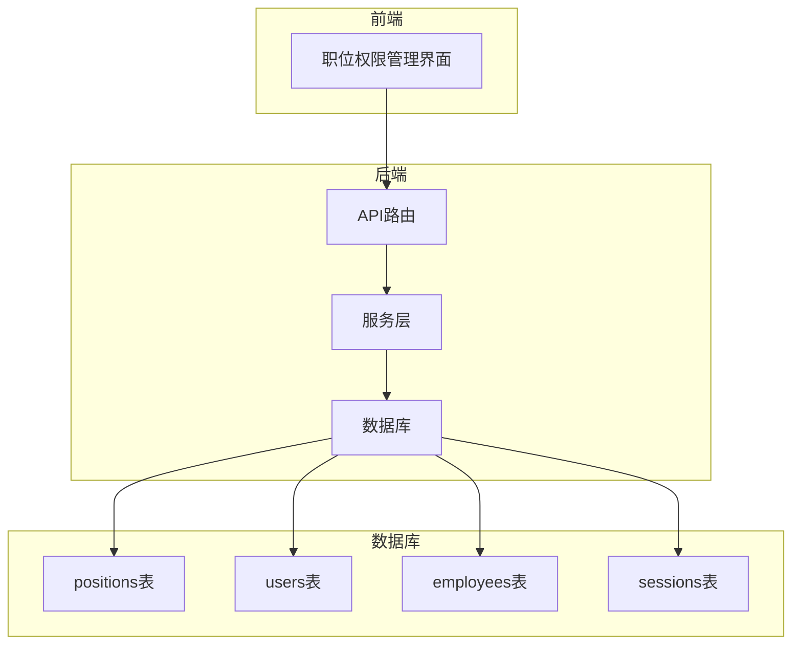
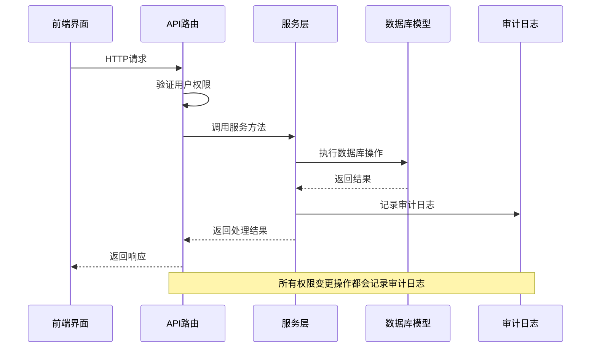
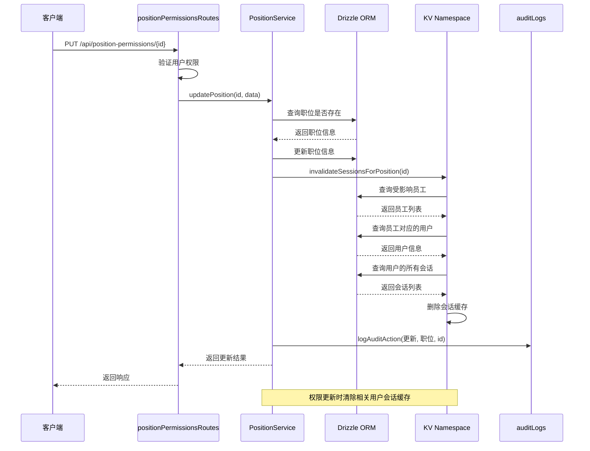
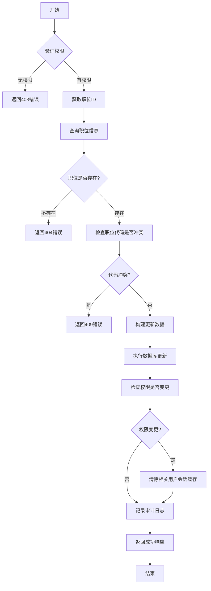
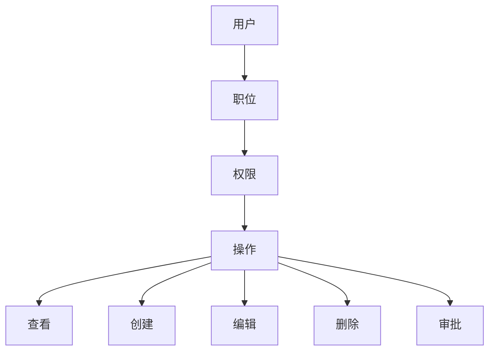
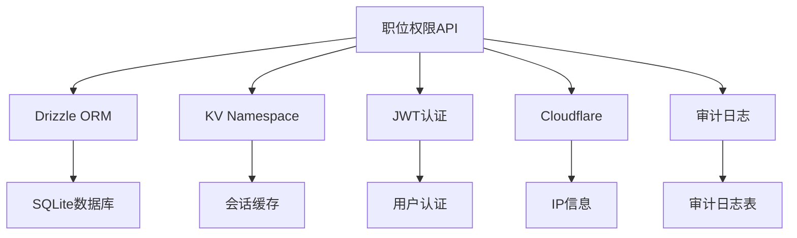

# 职位权限API

<cite>
**本文档引用文件**   
- [position-permissions.ts](file://backend/src/routes/position-permissions.ts)
- [PositionService.ts](file://backend/src/services/PositionService.ts)
- [permissions.ts](file://backend/src/utils/permissions.ts)
- [schema.ts](file://backend/src/db/schema.ts)
- [business.schema.ts](file://backend/src/schemas/business.schema.ts)
- [audit.ts](file://backend/src/utils/audit.ts)
- [PositionPermissionsManagement.tsx](file://frontend/src/features/system/pages/PositionPermissionsManagement.tsx)
</cite>

## 目录
1. [简介](#简介)
2. [项目结构](#项目结构)
3. [核心组件](#核心组件)
4. [架构概述](#架构概述)
5. [详细组件分析](#详细组件分析)
6. [依赖分析](#依赖分析)
7. [性能考虑](#性能考虑)
8. [故障排除指南](#故障排除指南)
9. [结论](#结论)
10. [附录](#附录)（如有必要）

## 简介
本文档详细介绍了基于职位的权限管理API（RBAC），涵盖职位的创建、查询、更新和删除等操作。系统通过职位代码（如hq_manager、project_manager）和层级（总部、项目、组）实现精细化的权限控制。每个职位可配置模块化权限，包括财务、人事、资产等模块的具体操作权限。系统实现了完整的审计追踪机制，所有权限变更操作都会记录到审计日志中。当职位权限更新时，系统会自动清除相关用户的会话缓存，确保权限变更立即生效。

## 项目结构
该职位权限管理系统是财务系统的一部分，主要包含后端API路由、服务层、数据库模型和前端管理界面。后端采用Hono框架实现RESTful API，通过Drizzle ORM操作SQLite数据库。前端使用React和Ant Design构建管理界面，提供直观的权限配置功能。



**图表来源**
- [position-permissions.ts](file://backend/src/routes/position-permissions.ts#L1-L207)
- [PositionService.ts](file://backend/src/services/PositionService.ts#L1-L180)
- [schema.ts](file://backend/src/db/schema.ts#L1-L644)

**章节来源**
- [position-permissions.ts](file://backend/src/routes/position-permissions.ts#L1-L207)
- [PositionService.ts](file://backend/src/services/PositionService.ts#L1-L180)
- [schema.ts](file://backend/src/db/schema.ts#L1-L644)

## 核心组件
职位权限管理系统由API路由、服务层、数据库模型和权限验证工具组成。API路由定义了五个核心端点：获取所有职位、获取职位详情、创建职位、更新职位和删除职位。服务层实现了业务逻辑，包括职位的CRUD操作和会话缓存清除。数据库模型定义了positions表的结构，存储职位代码、名称、层级和权限配置等信息。权限验证工具提供了基于职位的访问控制功能。

**章节来源**
- [position-permissions.ts](file://backend/src/routes/position-permissions.ts#L1-L207)
- [PositionService.ts](file://backend/src/services/PositionService.ts#L1-L180)

## 架构概述
系统采用分层架构，从前端界面到后端服务再到数据库存储。前端通过HTTP请求调用后端API，后端API路由接收请求并进行权限验证，然后调用服务层处理业务逻辑，最后通过数据库模型访问SQLite数据库。权限验证贯穿整个调用链，确保只有授权用户才能执行相应操作。



**图表来源**
- [position-permissions.ts](file://backend/src/routes/position-permissions.ts#L1-L207)
- [PositionService.ts](file://backend/src/services/PositionService.ts#L1-L180)
- [audit.ts](file://backend/src/utils/audit.ts#L1-L92)

## 详细组件分析
### 职位管理分析
职位权限管理API提供了完整的职位生命周期管理功能，包括创建、查询、更新和删除操作。系统通过层级化的权限模型实现精细化的访问控制。

#### 对象导向组件：
```mermaid
classDiagram
class Position {
+string id
+string code
+string name
+number level
+string functionRole
+any permissions
+string description
+number sortOrder
+number active
+number createdAt
+number updatedAt
}
class PositionService {
+getPositions() Position[]
+getPosition(id) Position
+createPosition(data) Position
+updatePosition(id, data) Position
+deletePosition(id) void
-invalidateSessionsForPosition(id) void
}
class PositionPermissionsRoutes {
+get /position-permissions
+get /position-permissions/{id}
+post /position-permissions
+put /position-permissions/{id}
+delete /position-permissions/{id}
}
PositionService --> Position : "管理"
PositionPermissionsRoutes --> PositionService : "调用"
```

**图表来源**
- [PositionService.ts](file://backend/src/services/PositionService.ts#L8-L180)
- [position-permissions.ts](file://backend/src/routes/position-permissions.ts#L8-L207)
- [schema.ts](file://backend/src/db/schema.ts#L58-L71)

#### API/服务组件：


**图表来源**
- [position-permissions.ts](file://backend/src/routes/position-permissions.ts#L130-L171)
- [PositionService.ts](file://backend/src/services/PositionService.ts#L73-L113)
- [audit.ts](file://backend/src/utils/audit.ts#L61-L92)

#### 复杂逻辑组件：


**图表来源**
- [PositionService.ts](file://backend/src/services/PositionService.ts#L73-L113)
- [position-permissions.ts](file://backend/src/routes/position-permissions.ts#L160-L170)

**章节来源**
- [position-permissions.ts](file://backend/src/routes/position-permissions.ts#L1-L207)
- [PositionService.ts](file://backend/src/services/PositionService.ts#L1-L180)

### 概念概述
基于职位的权限管理（RBAC）是一种通过为用户分配职位来控制其系统访问权限的机制。每个职位定义了一组权限，这些权限决定了用户可以执行的操作。当用户被分配到某个职位时，他们继承该职位的所有权限。这种模型简化了权限管理，因为管理员只需管理职位的权限，而不是为每个用户单独配置权限。



## 依赖分析
职位权限管理系统依赖于多个核心组件和外部服务。系统通过Drizzle ORM与SQLite数据库交互，使用KV Namespace作为会话缓存，通过JWT进行用户认证，并利用Cloudflare的请求头获取IP信息用于审计日志。



**图表来源**
- [PositionService.ts](file://backend/src/services/PositionService.ts#L1-L180)
- [middleware.ts](file://backend/src/middleware.ts#L1-L82)
- [audit.ts](file://backend/src/utils/audit.ts#L1-L92)

**章节来源**
- [PositionService.ts](file://backend/src/services/PositionService.ts#L1-L180)
- [middleware.ts](file://backend/src/middleware.ts#L1-L82)
- [audit.ts](file://backend/src/utils/audit.ts#L1-L92)

## 性能考虑
系统在设计时考虑了性能优化。首先，通过KV Namespace缓存会话数据，减少了数据库查询次数。其次，在更新职位权限时，系统会异步清除相关用户的会话缓存，避免阻塞主请求流程。此外，数据库查询使用了适当的索引，如positions表的code字段唯一索引，确保查询效率。审计日志记录也采用异步方式，通过c.executionCtx.waitUntil确保日志记录不会影响主业务流程的响应时间。

## 故障排除指南
当遇到职位权限管理问题时，可以按照以下步骤进行排查：首先检查用户是否具有相应的操作权限，然后查看数据库中职位记录是否存在，接着确认权限配置是否正确，最后检查审计日志以了解操作历史。如果权限变更后未立即生效，可能是会话缓存未及时清除，可以尝试重新登录或手动清除会话。

**章节来源**
- [position-permissions.ts](file://backend/src/routes/position-permissions.ts#L51-L52)
- [PositionService.ts](file://backend/src/services/PositionService.ts#L26-L36)
- [audit.ts](file://backend/src/utils/audit.ts#L61-L92)

## 结论
职位权限管理系统提供了一套完整的基于职位的访问控制解决方案。系统通过清晰的API设计、合理的数据模型和完善的审计机制，实现了对用户权限的精细化管理。前端管理界面提供了直观的权限配置功能，后端服务确保了操作的安全性和可靠性。系统的模块化设计和分层架构使其易于维护和扩展，为财务系统的安全运行提供了有力保障。

## 附录
### API端点详情
| 端点 | 方法 | 描述 | 权限要求 |
|------|------|------|----------|
| /api/position-permissions | GET | 获取所有职位 | system:position:view |
| /api/position-permissions/{id} | GET | 获取职位详情 | system:position:view |
| /api/position-permissions | POST | 创建职位 | system:position:create |
| /api/position-permissions/{id} | PUT | 更新职位 | system:position:update |
| /api/position-permissions/{id} | DELETE | 删除职位 | system:position:delete |

### 权限模块配置
```json
{
  "finance": {
    "label": "财务模块",
    "subModules": {
      "flow": { "label": "资金流水", "actions": ["view", "create", "update", "delete", "export"] },
      "transfer": { "label": "账户转账", "actions": ["view", "create"] },
      "ar": { "label": "应收管理", "actions": ["view", "create", "update", "delete"] },
      "ap": { "label": "应付管理", "actions": ["view", "create", "update", "delete"] }
    }
  },
  "hr": {
    "label": "人事模块",
    "subModules": {
      "employee": { "label": "员工管理", "actions": ["view", "create", "update", "delete", "view_sensitive"] },
      "salary": { "label": "薪资查看", "actions": ["view", "create"] },
      "leave": { "label": "请假管理", "actions": ["view", "create", "update", "delete", "approve"] }
    }
  }
}
```

**章节来源**
- [PositionPermissionsManagement.tsx](file://frontend/src/features/system/pages/PositionPermissionsManagement.tsx#L29-L96)
- [position-permissions.ts](file://backend/src/routes/position-permissions.ts#L51-L52)