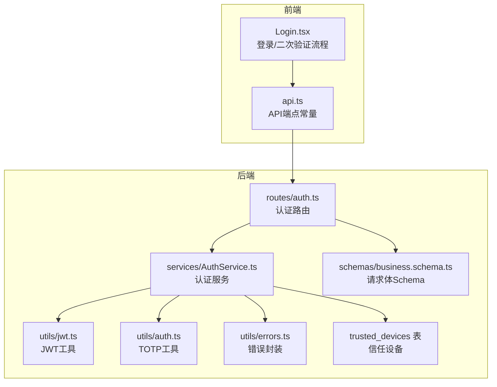
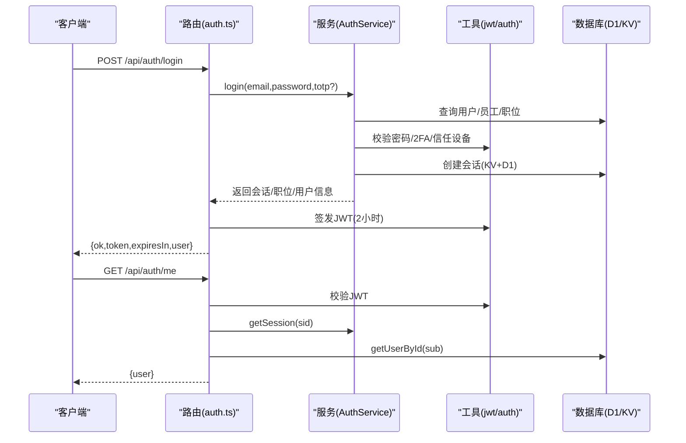
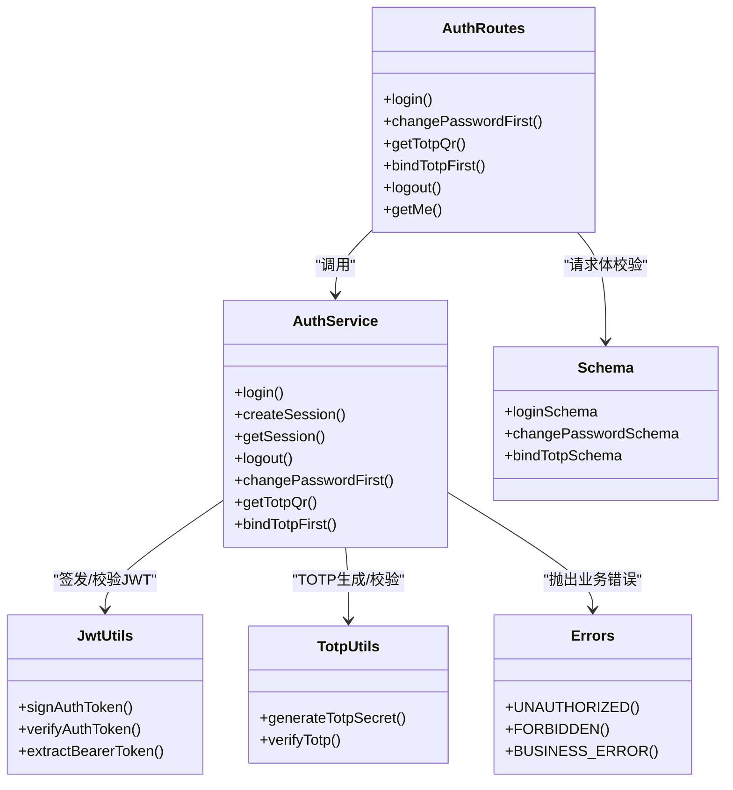

# 认证API

<cite>
**本文引用的文件列表**
- [backend/src/routes/auth.ts](file://backend/src/routes/auth.ts)
- [backend/src/services/AuthService.ts](file://backend/src/services/AuthService.ts)
- [backend/src/utils/auth.ts](file://backend/src/utils/auth.ts)
- [backend/src/utils/jwt.ts](file://backend/src/utils/jwt.ts)
- [backend/src/utils/errors.ts](file://backend/src/utils/errors.ts)
- [backend/src/schemas/business.schema.ts](file://backend/src/schemas/business.schema.ts)
- [backend/src/db/migration_trusted_devices.sql](file://backend/src/db/migration_trusted_devices.sql)
- [frontend/src/features/auth/pages/Login.tsx](file://frontend/src/features/auth/pages/Login.tsx)
- [frontend/src/config/api.ts](file://frontend/src/config/api.ts)
- [backend/test/routes/auth.test.ts](file://backend/test/routes/auth.test.ts)
- [backend/test/services/AuthService.test.ts](file://backend/test/services/AuthService.test.ts)
</cite>

## 目录
1. [简介](#简介)
2. [项目结构](#项目结构)
3. [核心组件](#核心组件)
4. [架构总览](#架构总览)
5. [详细组件分析](#详细组件分析)
6. [依赖关系分析](#依赖关系分析)
7. [性能与安全考量](#性能与安全考量)
8. [故障排查指南](#故障排查指南)
9. [结论](#结论)
10. [附录](#附录)

## 简介
本文件为“认证API”的完整技术文档，覆盖以下端点：
- 登录：/api/auth/login
- 首次修改密码：/api/auth/change-password-first
- 获取TOTP二维码：/api/auth/get-totp-qr
- 绑定TOTP（首次）：/api/auth/bind-totp-first
- 登出：/api/auth/logout
- 获取当前用户信息：/api/auth/me

文档重点说明：
- 每个端点的HTTP方法、请求参数、请求体结构与响应格式
- JWT令牌的签发、有效期与刷新机制
- 基于TOTP的双因素认证流程（含信任设备策略）
- 前端调用示例与二次验证登录场景
- 错误码与常见问题排查

## 项目结构
认证相关代码主要分布在后端路由、服务层、工具类与前端页面中，整体采用分层设计：
- 路由层：定义OpenAPI路由与请求/响应结构
- 服务层：实现业务逻辑（登录、会话、TOTP、绑定等）
- 工具层：JWT签名/校验、TOTP生成/校验、错误封装
- 前端：登录页按状态驱动实现二次验证流程

图表来源
- [backend/src/routes/auth.ts](file://backend/src/routes/auth.ts#L123-L386)
- [backend/src/services/AuthService.ts](file://backend/src/services/AuthService.ts#L29-L131)
- [backend/src/utils/jwt.ts](file://backend/src/utils/jwt.ts#L56-L118)
- [backend/src/utils/auth.ts](file://backend/src/utils/auth.ts#L1-L16)
- [backend/src/utils/errors.ts](file://backend/src/utils/errors.ts#L34-L54)
- [backend/src/schemas/business.schema.ts](file://backend/src/schemas/business.schema.ts#L745-L780)
- [backend/src/db/migration_trusted_devices.sql](file://backend/src/db/migration_trusted_devices.sql#L1-L16)

章节来源
- [backend/src/routes/auth.ts](file://backend/src/routes/auth.ts#L123-L386)
- [frontend/src/features/auth/pages/Login.tsx](file://frontend/src/features/auth/pages/Login.tsx#L1-L258)
- [frontend/src/config/api.ts](file://frontend/src/config/api.ts#L1-L26)

## 核心组件
- 路由与端点
  - 登录、首次修改密码、获取TOTP二维码、绑定TOTP、登出、获取当前用户信息
- 服务层
  - 登录流程（密码校验、首次登录标记、2FA策略、信任设备、会话创建）
  - 会话管理（KV/D1双写、单点登录清理、过期检查）
  - TOTP流程（生成密钥、校验、绑定）
- 工具层
  - JWT签发/校验（HS256，2小时有效期）
  - TOTP生成/校验（otplib）
  - 统一错误封装（401/403/400/500）

章节来源
- [backend/src/routes/auth.ts](file://backend/src/routes/auth.ts#L123-L386)
- [backend/src/services/AuthService.ts](file://backend/src/services/AuthService.ts#L29-L131)
- [backend/src/utils/jwt.ts](file://backend/src/utils/jwt.ts#L56-L118)
- [backend/src/utils/auth.ts](file://backend/src/utils/auth.ts#L1-L16)
- [backend/src/utils/errors.ts](file://backend/src/utils/errors.ts#L34-L54)

## 架构总览
认证API采用“路由-服务-工具-存储”分层架构：
- 路由负责请求解析与响应格式化，并调用服务层
- 服务层执行业务规则（密码、2FA、信任设备、会话）
- 工具层提供JWT与TOTP能力
- 存储层包含D1与KV，用于用户、会话与信任设备数据

图表来源
- [backend/src/routes/auth.ts](file://backend/src/routes/auth.ts#L123-L386)
- [backend/src/services/AuthService.ts](file://backend/src/services/AuthService.ts#L133-L207)
- [backend/src/utils/jwt.ts](file://backend/src/utils/jwt.ts#L72-L111)

## 详细组件分析

### 登录 /api/auth/login
- 方法与路径
  - POST /api/auth/login
- 请求体
  - email: 字符串，必填
  - password: 字符串，必填
  - totp: 字符串，可选（新设备首次登录或已绑定TOTP时需要）
- 响应
  - 成功：返回 token、expiresIn、user
  - 失败：返回 mustChangePassword/needTotp/needBindTotp 标记与 message
  - 异常：返回 error 与 code
- 业务逻辑要点
  - 密码校验
  - 首次登录标记（mustChangePassword）
  - 2FA策略（系统配置开关，默认开启）
  - 信任设备指纹生成与校验
  - 会话创建（单点登录清理、KV/D1双写）
  - JWT签发（2小时有效期）
- 前端调用示例
  - 使用 /api/auth/login-password（别名）进行登录，根据返回的状态切换到“首次修改密码”或“二次验证”流程

章节来源
- [backend/src/routes/auth.ts](file://backend/src/routes/auth.ts#L123-L174)
- [backend/src/routes/auth.ts](file://backend/src/routes/auth.ts#L175-L208)
- [backend/src/services/AuthService.ts](file://backend/src/services/AuthService.ts#L29-L131)
- [backend/src/utils/jwt.ts](file://backend/src/utils/jwt.ts#L56-L90)
- [frontend/src/features/auth/pages/Login.tsx](file://frontend/src/features/auth/pages/Login.tsx#L34-L74)
- [frontend/src/config/api.ts](file://frontend/src/config/api.ts#L11-L14)

### 首次修改密码 /api/auth/change-password-first
- 方法与路径
  - POST /api/auth/change-password-first
- 请求体
  - email: 字符串，必填
  - oldPassword: 字符串，可选（首次修改密码时可为空）
  - newPassword: 字符串，至少6位
  - totpCode: 字符串，6位，可选（若用户已绑定TOTP则需要）
- 响应
  - 成功：返回 { status: "success" }
- 业务逻辑要点
  - 校验用户存在与“首次登录需改密”标记
  - 若已绑定TOTP，需校验验证码
  - 更新密码哈希、清除mustChangePassword、标记passwordChanged
  - 审计日志

章节来源
- [backend/src/routes/auth.ts](file://backend/src/routes/auth.ts#L175-L208)
- [backend/src/services/AuthService.ts](file://backend/src/services/AuthService.ts#L209-L253)

### 获取TOTP二维码 /api/auth/get-totp-qr
- 方法与路径
  - POST /api/auth/get-totp-qr
- 请求体
  - email: 字符串，必填
  - password: 字符串，必填
- 响应
  - secret: 生成的TOTP密钥
  - otpauthUrl: 二维码内容链接
  - qrCode: SVG二维码数据URL
- 业务逻辑要点
  - 校验用户存在与密码
  - 生成TOTP密钥与otpauthUrl
  - 生成SVG二维码数据URL

章节来源
- [backend/src/routes/auth.ts](file://backend/src/routes/auth.ts#L209-L242)
- [backend/src/services/AuthService.ts](file://backend/src/services/AuthService.ts#L255-L281)
- [backend/src/utils/auth.ts](file://backend/src/utils/auth.ts#L1-L16)

### 绑定TOTP（首次） /api/auth/bind-totp-first
- 方法与路径
  - POST /api/auth/bind-totp-first
- 请求体
  - email: 字符串，必填
  - password: 字符串，必填
  - secret: 字符串，必填
  - totp: 字符串，必填（6位）
- 响应
  - 成功：返回 token、expiresIn、user（自动登录）
  - 失败：返回错误信息
- 业务逻辑要点
  - 校验用户存在与密码
  - 校验TOTP验证码
  - 将secret写入用户表
  - 自动登录并返回JWT

章节来源
- [backend/src/routes/auth.ts](file://backend/src/routes/auth.ts#L244-L281)
- [backend/src/services/AuthService.ts](file://backend/src/services/AuthService.ts#L283-L305)

### 登出 /api/auth/logout
- 方法与路径
  - POST /api/auth/logout
- 请求体
  - 无（使用Authorization头或Cookie携带JWT）
- 响应
  - { ok: true }
- 业务逻辑要点
  - 解析JWT，取出sid
  - 删除对应会话（KV/D1）
  - 清理历史Cookie

章节来源
- [backend/src/routes/auth.ts](file://backend/src/routes/auth.ts#L283-L316)
- [backend/src/utils/jwt.ts](file://backend/src/utils/jwt.ts#L92-L111)
- [backend/src/services/AuthService.ts](file://backend/src/services/AuthService.ts#L200-L207)

### 获取当前用户信息 /api/auth/me
- 方法与路径
  - GET /api/auth/me
- 请求体
  - 无（使用Authorization头或Cookie携带JWT）
- 响应
  - { user: 当前用户信息或null }
- 业务逻辑要点
  - 解析JWT，校验过期
  - 通过sid查找会话，校验有效性
  - 通过sub查询用户与职位，组装返回

章节来源
- [backend/src/routes/auth.ts](file://backend/src/routes/auth.ts#L318-L386)
- [backend/src/services/AuthService.ts](file://backend/src/services/AuthService.ts#L177-L199)

## 依赖关系分析

图表来源
- [backend/src/routes/auth.ts](file://backend/src/routes/auth.ts#L123-L386)
- [backend/src/services/AuthService.ts](file://backend/src/services/AuthService.ts#L29-L305)
- [backend/src/utils/jwt.ts](file://backend/src/utils/jwt.ts#L56-L118)
- [backend/src/utils/auth.ts](file://backend/src/utils/auth.ts#L1-L16)
- [backend/src/utils/errors.ts](file://backend/src/utils/errors.ts#L34-L54)
- [backend/src/schemas/business.schema.ts](file://backend/src/schemas/business.schema.ts#L745-L780)

章节来源
- [backend/src/routes/auth.ts](file://backend/src/routes/auth.ts#L123-L386)
- [backend/src/services/AuthService.ts](file://backend/src/services/AuthService.ts#L29-L305)
- [backend/src/utils/jwt.ts](file://backend/src/utils/jwt.ts#L56-L118)
- [backend/src/utils/auth.ts](file://backend/src/utils/auth.ts#L1-L16)
- [backend/src/utils/errors.ts](file://backend/src/utils/errors.ts#L34-L54)
- [backend/src/schemas/business.schema.ts](file://backend/src/schemas/business.schema.ts#L745-L780)

## 性能与安全考量
- JWT令牌
  - 签发：HS256，2小时有效期
  - 传输：支持Authorization头或自定义x-caiwu-token头，同时兼容Cookie
  - 刷新：未实现自动刷新，建议前端在过期前轮询或重新登录
- 会话与单点登录
  - 登录时清理该用户的旧会话（KV/D1），确保单点登录
- 信任设备与2FA
  - 新设备登录需TOTP验证，验证成功后加入信任设备
  - 信任设备默认90天有效期，后续登录可免TOTP
- 错误处理
  - 统一错误封装，区分业务错误与验证错误
- 前端最佳实践
  - 登录成功后保存token，请求受保护接口时附带Authorization头
  - 二次验证流程中，先获取二维码再提交验证码
  - 登出时清理本地存储与Cookie

章节来源
- [backend/src/utils/jwt.ts](file://backend/src/utils/jwt.ts#L56-L118)
- [backend/src/services/AuthService.ts](file://backend/src/services/AuthService.ts#L133-L175)
- [backend/src/db/migration_trusted_devices.sql](file://backend/src/db/migration_trusted_devices.sql#L1-L16)
- [frontend/src/features/auth/pages/Login.tsx](file://frontend/src/features/auth/pages/Login.tsx#L98-L131)

## 故障排查指南
- 常见错误码与含义
  - 401 未授权：凭证错误、TOTP错误、JWT签名无效或过期
  - 403 权限不足：员工记录停用或未找到职位权限
  - 400 业务错误：已绑定TOTP、请求参数不合法
  - 500 服务器内部错误：未预期异常
- 排查步骤
  - 登录失败：确认邮箱/密码正确，检查mustChangePassword/needTotp/needBindTotp状态
  - 二次验证失败：确认TOTP验证码6位且与secret匹配
  - JWT过期：重新登录获取新token
  - 信任设备问题：确认设备指纹与UA/IP一致，或移除信任设备后重新验证
- 测试参考
  - 后端测试覆盖了登录、二次验证、首次改密等关键路径

章节来源
- [backend/src/utils/errors.ts](file://backend/src/utils/errors.ts#L34-L54)
- [backend/test/routes/auth.test.ts](file://backend/test/routes/auth.test.ts#L38-L114)
- [backend/test/services/AuthService.test.ts](file://backend/test/services/AuthService.test.ts#L42-L143)

## 结论
本认证API围绕“密码+TOTP”的双因子登录设计，结合信任设备策略降低用户体验成本，同时通过JWT与会话管理保障安全性。前端通过状态机驱动实现首次改密与二次验证流程，配合统一错误处理提升稳定性。建议在生产环境中：
- 明确2FA开关策略
- 严格管理JWT密钥与过期策略
- 加强前端对过期与错误的提示与重试

## 附录

### 端点一览与请求/响应说明
- 登录 /api/auth/login
  - 请求体：{ email, password, totp? }
  - 响应：{ ok, token?, expiresIn?, user?, mustChangePassword?, needTotp?, needBindTotp?, message? }
- 首次修改密码 /api/auth/change-password-first
  - 请求体：{ email, oldPassword?, newPassword, totpCode? }
  - 响应：{ status: "success" }
- 获取TOTP二维码 /api/auth/get-totp-qr
  - 请求体：{ email, password }
  - 响应：{ secret, otpauthUrl, qrCode }
- 绑定TOTP（首次） /api/auth/bind-totp-first
  - 请求体：{ email, password, secret, totp }
  - 响应：{ ok, token, expiresIn, user } 或错误
- 登出 /api/auth/logout
  - 请求体：无
  - 响应：{ ok: true }
- 获取当前用户信息 /api/auth/me
  - 请求体：无
  - 响应：{ user }

章节来源
- [backend/src/routes/auth.ts](file://backend/src/routes/auth.ts#L123-L386)
- [backend/src/schemas/business.schema.ts](file://backend/src/schemas/business.schema.ts#L745-L780)

### 前端调用示例（概念流程）
- 步骤1：登录
  - POST /api/auth/login-password，携带 { email, password }
  - 根据返回状态：
    - mustChangePassword → 跳转“首次修改密码”
    - needBindTotp → 跳转“绑定TOTP”，先获取二维码
    - needTotp → 跳转“二次验证”，输入6位验证码
- 步骤2：首次修改密码
  - POST /api/auth/change-password-first，携带 { email, newPassword }
  - 成功后进入“绑定TOTP/二次验证”流程
- 步骤3：绑定TOTP
  - POST /api/auth/get-totp-qr，获取二维码
  - POST /api/auth/bind-totp-first，提交 { email, password, secret, totp }
  - 成功后返回token并跳转首页
- 步骤4：二次验证登录
  - POST /api/auth/login-password，携带 { email, password, totp }
  - 成功后返回token并跳转首页
- 步骤5：登出
  - POST /api/auth/logout，携带Authorization头
  - 清理本地存储与Cookie

章节来源
- [frontend/src/features/auth/pages/Login.tsx](file://frontend/src/features/auth/pages/Login.tsx#L34-L131)
- [frontend/src/config/api.ts](file://frontend/src/config/api.ts#L11-L21)