# 财务操作API

<cite>
**本文档引用的文件**   
- [flows.ts](file://backend/src/routes/v2/flows.ts)
- [account-transfers.ts](file://backend/src/routes/v2/account-transfers.ts)
- [ar-ap.ts](file://backend/src/routes/v2/ar-ap.ts)
- [borrowings.ts](file://backend/src/routes/v2/borrowings.ts)
- [FinanceService.ts](file://backend/src/services/FinanceService.ts)
- [ArApService.ts](file://backend/src/services/ArApService.ts)
- [BorrowingService.ts](file://backend/src/services/BorrowingService.ts)
- [AccountTransferService.ts](file://backend/src/services/AccountTransferService.ts)
- [optimistic-lock.ts](file://backend/src/utils/optimistic-lock.ts)
- [state-machine.ts](file://backend/src/utils/state-machine.ts)
- [amount-validator.ts](file://backend/src/utils/amount-validator.ts)
- [schema.ts](file://backend/src/db/schema.ts)
- [business.schema.ts](file://backend/src/schemas/business.schema.ts)
</cite>

## 目录
1. [简介](#简介)
2. [财务流水管理](#财务流水管理)
3. [账户转账管理](#账户转账管理)
4. [应收应付管理](#应收应付管理)
5. [借款管理](#借款管理)
6. [核心机制](#核心机制)
7. [错误处理策略](#错误处理策略)

## 简介
本API文档详细说明了财务操作相关的核心接口，包括财务流水、账户转账、应收应付和借款管理。系统通过严格的权限控制、数据验证和并发控制机制，确保财务数据的一致性和安全性。所有财务交易均通过凭证号（voucherNo）进行唯一标识，并支持红冲（冲正）操作以纠正错误记录。

**Section sources**
- [flows.ts](file://backend/src/routes/v2/flows.ts#L1-L566)
- [account-transfers.ts](file://backend/src/routes/v2/account-transfers.ts#L1-L235)
- [ar-ap.ts](file://backend/src/routes/v2/ar-ap.ts#L1-L626)
- [borrowings.ts](file://backend/src/routes/v2/borrowings.ts#L1-L379)

## 财务流水管理
财务流水（flows）API用于记录企业的所有现金流入和流出。每条流水记录都包含业务日期、交易类型、金额、关联账户和凭证等关键信息。

### 创建财务流水
创建财务流水的API端点为`POST /flows`。请求体必须包含账户ID、业务日期、交易类型（income/expense）、金额（以分为单位）和凭证URL。系统会自动生成唯一的凭证号。

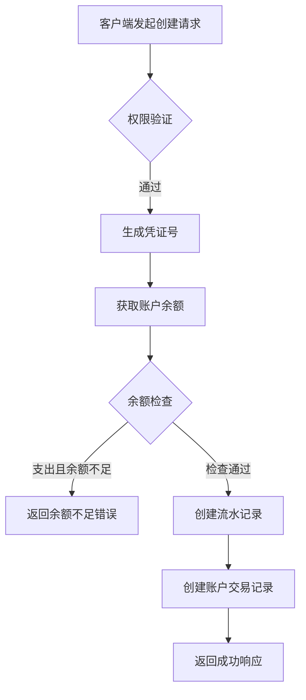

**Diagram sources**
- [flows.ts](file://backend/src/routes/v2/flows.ts#L327-L426)
- [FinanceService.ts](file://backend/src/services/FinanceService.ts#L70-L229)

### 流水红冲流程
红冲（reverse）操作用于冲正错误的财务流水。该操作会创建一条金额相等但方向相反的新流水，并标记原始流水为已冲正状态。

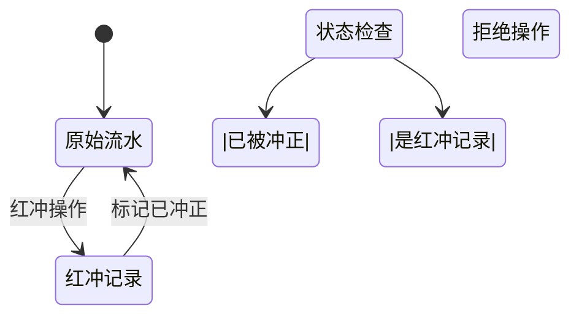

**Diagram sources**
- [flows.ts](file://backend/src/routes/v2/flows.ts#L494-L565)
- [FinanceService.ts](file://backend/src/services/FinanceService.ts#L285-L437)

**Section sources**
- [flows.ts](file://backend/src/routes/v2/flows.ts#L494-L565)
- [FinanceService.ts](file://backend/src/services/FinanceService.ts#L285-L437)

## 账户转账管理
账户转账（account-transfers）API用于处理不同账户之间的资金转移。转账操作会同时在转出账户和转入账户生成相应的交易记录。

### 转账创建流程
创建账户转账的API端点为`POST /account-transfers`。系统会验证转出和转入账户，并计算各自的余额变化。

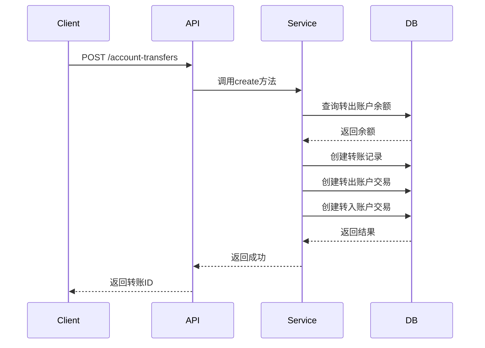

**Diagram sources**
- [account-transfers.ts](file://backend/src/routes/v2/account-transfers.ts#L119-L184)
- [AccountTransferService.ts](file://backend/src/services/AccountTransferService.ts#L44-L124)

**Section sources**
- [account-transfers.ts](file://backend/src/routes/v2/account-transfers.ts#L119-L184)
- [AccountTransferService.ts](file://backend/src/services/AccountTransferService.ts#L44-L124)

## 应收应付管理
应收应付（AR/AP）管理API用于处理企业的应收账款和应付账款。系统通过单据（doc）和结算（settlement）两个核心概念来管理账款。

### AR/AP单据状态机
AR/AP单据的状态转换遵循严格的规则，确保账款处理的正确性。

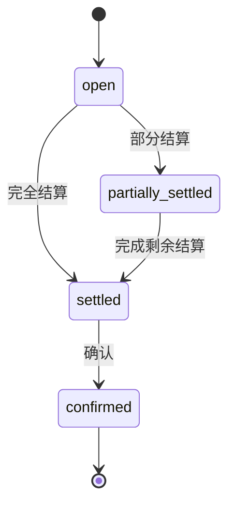

**Diagram sources**
- [ar-ap.ts](file://backend/src/routes/v2/ar-ap.ts#L163-L220)
- [ArApService.ts](file://backend/src/services/ArApService.ts#L84-L118)

### 确认流程
确认AR/AP单据会触发财务流水的创建和账款的结算。

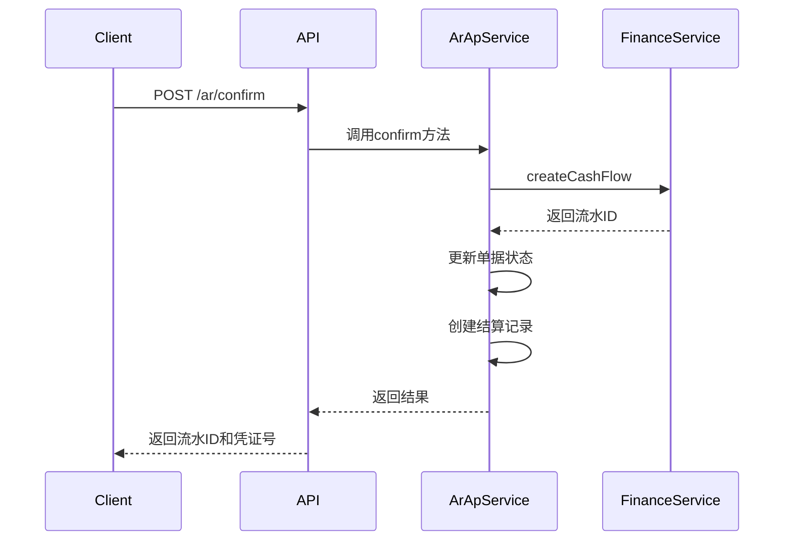

**Diagram sources**
- [ar-ap.ts](file://backend/src/routes/v2/ar-ap.ts#L372-L437)
- [ArApService.ts](file://backend/src/services/ArApService.ts#L178-L243)

**Section sources**
- [ar-ap.ts](file://backend/src/routes/v2/ar-ap.ts#L372-L437)
- [ArApService.ts](file://backend/src/services/ArApService.ts#L178-L243)

## 借款管理
借款管理API用于处理员工的借款和还款。系统通过借款（borrowing）和还款（repayment）两个核心实体来管理借款生命周期。

### 借款状态机
借款记录的状态转换遵循预定义的流程。

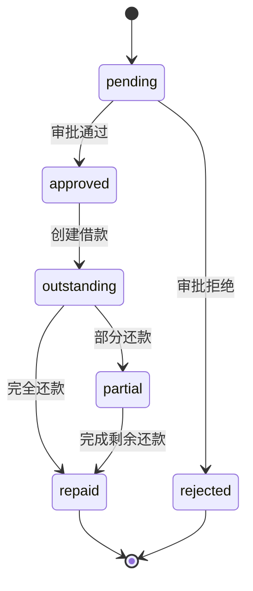

**Diagram sources**
- [state-machine.ts](file://backend/src/utils/state-machine.ts#L56-L67)
- [borrowings.ts](file://backend/src/routes/v2/borrowings.ts#L148-L209)

### 借款与还款流程
借款和还款操作通过独立的API端点进行管理。

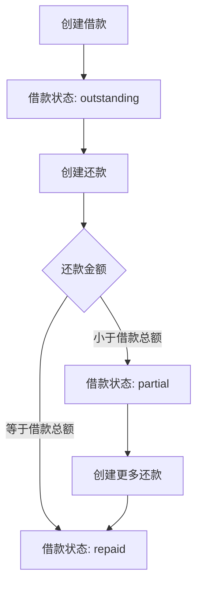

**Diagram sources**
- [borrowings.ts](file://backend/src/routes/v2/borrowings.ts#L148-L209)
- [BorrowingService.ts](file://backend/src/services/BorrowingService.ts#L109-L136)

**Section sources**
- [borrowings.ts](file://backend/src/routes/v2/borrowings.ts#L148-L209)
- [BorrowingService.ts](file://backend/src/services/BorrowingService.ts#L109-L136)

## 核心机制
本节详细说明财务操作中的关键机制，包括金额验证、账户余额检查、乐观锁控制等。

### 交易金额验证
系统通过`amount-validator.ts`文件中的工具函数对交易金额进行严格验证。

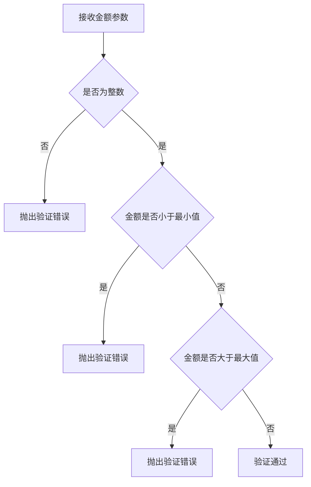

**Diagram sources**
- [amount-validator.ts](file://backend/src/utils/amount-validator.ts#L11-L39)
- [business.schema.ts](file://backend/src/schemas/business.schema.ts#L19-L20)

### 账户余额检查
在创建财务流水时，系统会检查账户余额以确保不会出现负余额。

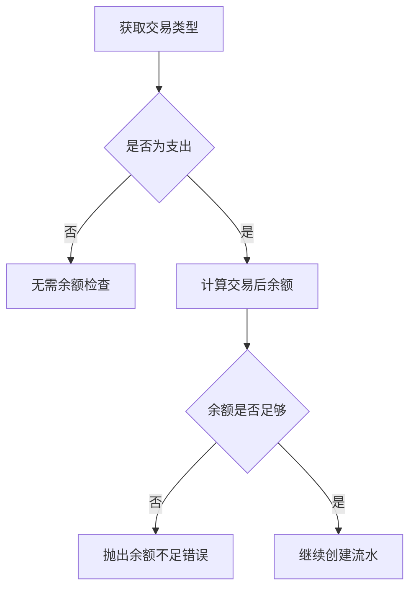

**Diagram sources**
- [FinanceService.ts](file://backend/src/services/FinanceService.ts#L173-L186)
- [schema.ts](file://backend/src/db/schema.ts#L146-L147)

### 乐观锁控制
系统使用乐观锁机制防止并发修改导致的数据冲突。

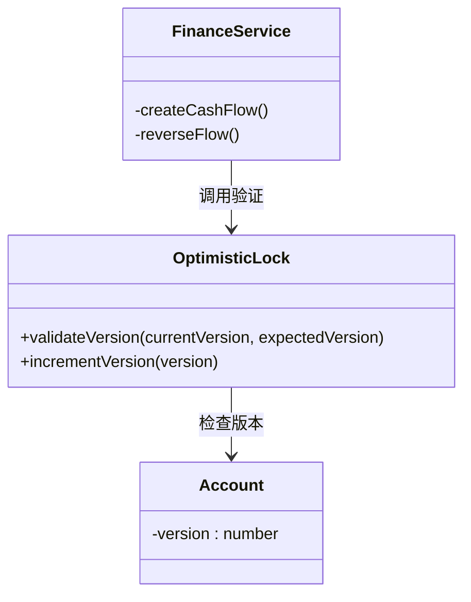

**Diagram sources**
- [optimistic-lock.ts](file://backend/src/utils/optimistic-lock.ts#L16-L39)
- [FinanceService.ts](file://backend/src/services/FinanceService.ts#L146-L165)

**Section sources**
- [optimistic-lock.ts](file://backend/src/utils/optimistic-lock.ts#L16-L39)
- [FinanceService.ts](file://backend/src/services/FinanceService.ts#L146-L165)

## 错误处理策略
系统采用分层的错误处理策略，确保财务操作的可靠性和数据一致性。

### 错误分类
财务操作中的错误主要分为以下几类：

| 错误类型 | HTTP状态码 | 错误码 | 说明 |
|---------|----------|-------|------|
| 验证错误 | 400 | VALIDATION_ERROR | 请求参数验证失败 |
| 权限错误 | 403 | FORBIDDEN | 用户无权执行操作 |
| 业务错误 | 400 | BUSINESS_ERROR | 业务逻辑错误 |
| 并发冲突 | 409 | BUS_CONCURRENT_MODIFICATION | 数据被其他用户修改 |

**Section sources**
- [errors.ts](file://backend/src/utils/errors.js)
- [errorCodes.ts](file://backend/src/constants/errorCodes.ts)

### 幂等性保证
所有创建操作都通过事务和唯一约束来保证幂等性。系统通过以下方式实现：

1. 使用UUID作为记录ID，确保全局唯一
2. 在关键表上设置唯一索引（如凭证号）
3. 使用数据库事务确保操作的原子性
4. 对于重复请求，返回已存在的记录而非创建新记录

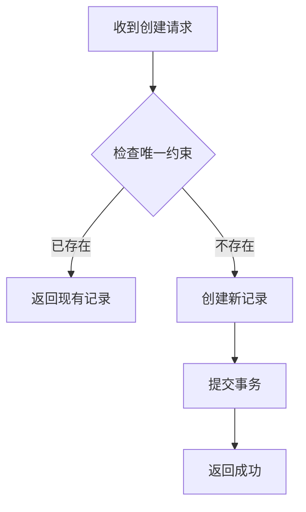

**Section sources**
- [FinanceService.ts](file://backend/src/services/FinanceService.ts#L88-L229)
- [ArApService.ts](file://backend/src/services/ArApService.ts#L95-L117)

## 结论
本财务操作API系统通过严谨的设计和实现，提供了完整的财务交易管理功能。系统采用乐观锁、事务控制和状态机等机制，确保了财务数据的一致性和安全性。所有操作都经过严格的权限验证和数据校验，有效防止了非法操作和数据错误。通过清晰的API设计和详细的错误处理，系统为财务人员提供了可靠的操作界面。