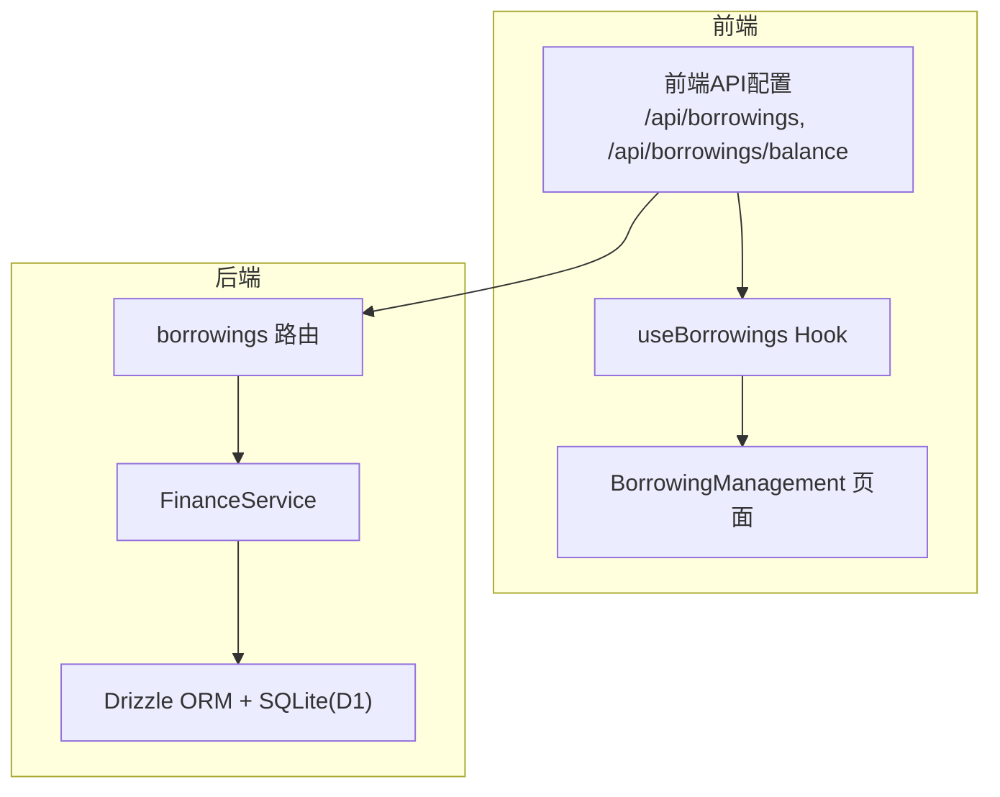
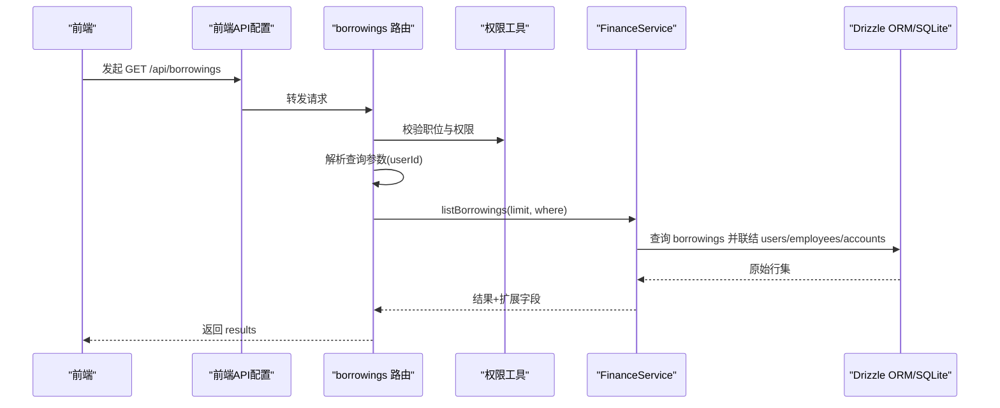
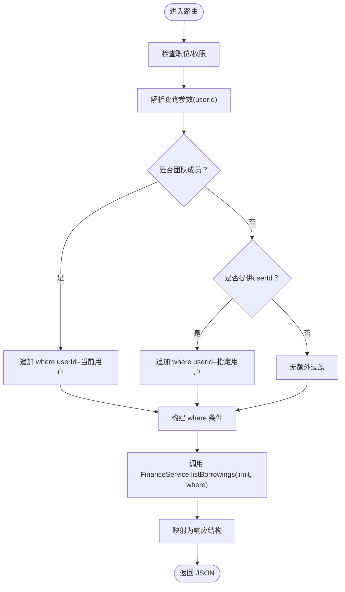
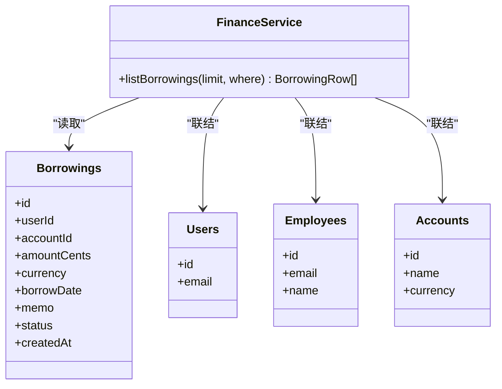
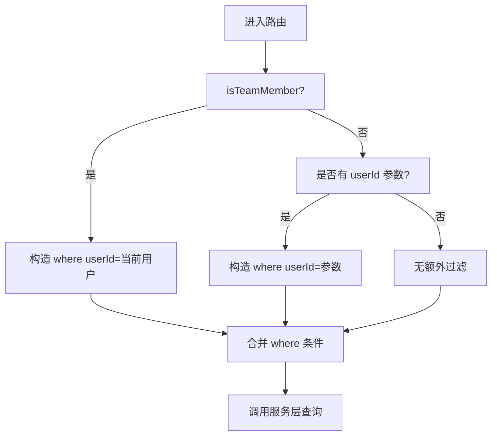
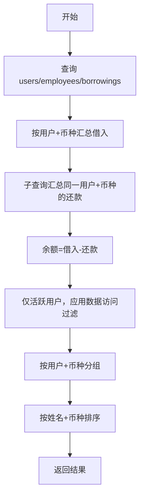
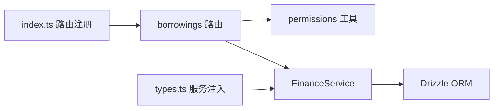

# 借款查询

<cite>
**本文引用的文件**
- [backend/src/routes/borrowings.ts](file://backend/src/routes/borrowings.ts)
- [backend/src/services/FinanceService.ts](file://backend/src/services/FinanceService.ts)
- [backend/src/schemas/common.schema.ts](file://backend/src/schemas/common.schema.ts)
- [backend/src/utils/permissions.ts](file://backend/src/utils/permissions.ts)
- [backend/src/db/schema.ts](file://backend/src/db/schema.ts)
- [backend/src/index.ts](file://backend/src/index.ts)
- [backend/src/types.ts](file://backend/src/types.ts)
- [frontend/src/config/api.ts](file://frontend/src/config/api.ts)
- [frontend/src/hooks/business/useBorrowings.ts](file://frontend/src/hooks/business/useBorrowings.ts)
- [frontend/src/features/finance/pages/BorrowingManagement.tsx](file://frontend/src/features/finance/pages/BorrowingManagement.tsx)
</cite>

## 目录
1. [简介](#简介)
2. [项目结构](#项目结构)
3. [核心组件](#核心组件)
4. [架构总览](#架构总览)
5. [详细组件分析](#详细组件分析)
6. [依赖关系分析](#依赖关系分析)
7. [性能考量](#性能考量)
8. [故障排查指南](#故障排查指南)
9. [结论](#结论)
10. [附录](#附录)

## 简介
本文件面向“借款查询”功能，围绕以下目标展开：
- 通过 GET /api/borrowings 端点查询借款记录，使用 borrowingQuerySchema 对请求参数进行校验。
- FinanceService.listBorrowings 服务方法从数据库获取借款数据，并关联借款人姓名、邮箱与账户信息。
- 查询时的数据权限控制逻辑：团队成员仅能查看自己的借款记录，管理员（总部人员）可查看全部。
- 借款余额查询端点 GET /api/borrowings/balance 计算每个用户的未偿还借款总额，并按币种分组。
- 提供完整的查询示例（按用户ID过滤、获取余额）、分页与排序说明。

## 项目结构
- 后端路由层：在 borrowings 路由中定义查询接口、余额接口及审批状态更新接口。
- 服务层：FinanceService 提供 listBorrowings 等金融相关能力。
- 数据层：Drizzle ORM 映射 borrowings、repayments、users、employees、accounts 等表。
- 前端：通过 useBorrowings Hook 调用 /api/borrowings，页面展示借款列表。

图表来源
- [backend/src/routes/borrowings.ts](file://backend/src/routes/borrowings.ts#L70-L132)
- [backend/src/services/FinanceService.ts](file://backend/src/services/FinanceService.ts#L439-L480)
- [backend/src/db/schema.ts](file://backend/src/db/schema.ts#L328-L395)
- [frontend/src/config/api.ts](file://frontend/src/config/api.ts#L79-L81)

章节来源
- [backend/src/index.ts](file://backend/src/index.ts#L93-L121)
- [backend/src/routes/borrowings.ts](file://backend/src/routes/borrowings.ts#L70-L132)
- [backend/src/services/FinanceService.ts](file://backend/src/services/FinanceService.ts#L439-L480)
- [backend/src/db/schema.ts](file://backend/src/db/schema.ts#L328-L395)
- [frontend/src/config/api.ts](file://frontend/src/config/api.ts#L79-L81)

## 核心组件
- 借款查询端点：GET /api/borrowings
  - 请求参数：userId（可选，UUID）
  - 响应：results 数组，每条记录包含借款人姓名、邮箱、账户名称与币种等扩展字段
- 借款余额端点：GET /api/borrowings/balance
  - 响应：按用户与币种分组的未偿还余额统计
- FinanceService.listBorrowings
  - 从 borrowings 表读取数据，同时联结 users、employees、accounts，补充显示信息
- 数据权限控制
  - isTeamMember 控制：团队成员仅能查看自己的借款记录
  - getDataAccessFilter 控制：管理员（总部人员）可查看全部；非总部人员按组织层级过滤

章节来源
- [backend/src/routes/borrowings.ts](file://backend/src/routes/borrowings.ts#L70-L132)
- [backend/src/routes/borrowings.ts](file://backend/src/routes/borrowings.ts#L313-L376)
- [backend/src/services/FinanceService.ts](file://backend/src/services/FinanceService.ts#L439-L480)
- [backend/src/utils/permissions.ts](file://backend/src/utils/permissions.ts#L140-L146)
- [backend/src/utils/permissions.ts](file://backend/src/utils/permissions.ts#L266-L323)

## 架构总览
下图展示了从前端到后端路由、服务与数据库的整体调用链路。

图表来源
- [frontend/src/config/api.ts](file://frontend/src/config/api.ts#L79-L81)
- [backend/src/routes/borrowings.ts](file://backend/src/routes/borrowings.ts#L70-L132)
- [backend/src/services/FinanceService.ts](file://backend/src/services/FinanceService.ts#L439-L480)
- [backend/src/utils/permissions.ts](file://backend/src/utils/permissions.ts#L140-L146)

## 详细组件分析

### 借款查询端点（GET /api/borrowings）
- 请求参数校验
  - 使用 borrowingQuerySchema，支持可选 userId（UUID）
- 数据权限
  - 若当前用户为团队成员：强制追加 where 条件为当前用户ID
  - 若非团队成员且携带 userId：按该用户过滤
  - 否则返回空结果
- 排序与分页
  - 默认按 borrowDate、createdAt 降序
  - 服务层默认 limit=200
- 关联信息
  - 服务层联结 users、employees、accounts，返回扩展字段（如 borrower_name、borrower_email、accountName、account_currency）

图表来源
- [backend/src/routes/borrowings.ts](file://backend/src/routes/borrowings.ts#L70-L132)
- [backend/src/services/FinanceService.ts](file://backend/src/services/FinanceService.ts#L439-L480)

章节来源
- [backend/src/routes/borrowings.ts](file://backend/src/routes/borrowings.ts#L70-L132)
- [backend/src/schemas/common.schema.ts](file://backend/src/schemas/common.schema.ts#L144-L150)
- [backend/src/services/FinanceService.ts](file://backend/src/services/FinanceService.ts#L439-L480)

### FinanceService.listBorrowings 实现要点
- 查询 borrowings 表，按 borrowDate、createdAt 降序，limit=200
- 收集 userIds、accountIds，批量查询 users、accounts
- 将 users 的 email 映射到 employees，获取 borrowerName
- 返回包含扩展字段的对象数组，便于路由层直接映射

图表来源
- [backend/src/services/FinanceService.ts](file://backend/src/services/FinanceService.ts#L439-L480)
- [backend/src/db/schema.ts](file://backend/src/db/schema.ts#L328-L395)

章节来源
- [backend/src/services/FinanceService.ts](file://backend/src/services/FinanceService.ts#L439-L480)
- [backend/src/db/schema.ts](file://backend/src/db/schema.ts#L328-L395)

### 数据权限控制逻辑
- isTeamMember：判断当前用户是否为团队成员，用于限制“仅看自己”
- getDataAccessFilter：根据职位层级生成 where 条件
  - 总部人员(level=1)：无限制
  - 项目人员(level=2)：按 department_id 过滤
  - 组长(team_leader)：按 org_department_id 过滤
  - 工程师(team_engineer)：仅本人

图表来源
- [backend/src/routes/borrowings.ts](file://backend/src/routes/borrowings.ts#L90-L110)
- [backend/src/utils/permissions.ts](file://backend/src/utils/permissions.ts#L140-L146)
- [backend/src/utils/permissions.ts](file://backend/src/utils/permissions.ts#L266-L323)

章节来源
- [backend/src/routes/borrowings.ts](file://backend/src/routes/borrowings.ts#L90-L110)
- [backend/src/utils/permissions.ts](file://backend/src/utils/permissions.ts#L140-L146)
- [backend/src/utils/permissions.ts](file://backend/src/utils/permissions.ts#L266-L323)

### 借款余额查询端点（GET /api/borrowings/balance）
- 功能：按用户与币种统计未偿还余额
- 计算逻辑：
  - 总借入：按用户与币种求和 borrowings.amountCents
  - 已还款：子查询统计同一用户同币种下的 repayments 总和
  - 余额：两者差额
- 过滤条件：
  - 仅统计 active 用户
  - 应用数据访问过滤（总部人员无限制，其他层级按组织维度过滤）
- 排序：按员工姓名与币种排序

图表来源
- [backend/src/routes/borrowings.ts](file://backend/src/routes/borrowings.ts#L313-L376)

章节来源
- [backend/src/routes/borrowings.ts](file://backend/src/routes/borrowings.ts#L313-L376)

### 前端集成与使用
- 前端通过 useBorrowings Hook 调用 /api/borrowings，自动将响应中的 results 字段作为数据源
- 页面 BorrowingManagement 展示列表，包含借款人、邮箱、账户、金额、日期、备注等列
- 借款余额端点 /api/borrowings/balance 在前端对应 api.borrowingsBalance

章节来源
- [frontend/src/hooks/business/useBorrowings.ts](file://frontend/src/hooks/business/useBorrowings.ts#L7-L16)
- [frontend/src/config/api.ts](file://frontend/src/config/api.ts#L79-L81)
- [frontend/src/features/finance/pages/BorrowingManagement.tsx](file://frontend/src/features/finance/pages/BorrowingManagement.tsx#L72-L91)

## 依赖关系分析
- 路由依赖
  - borrowings 路由注册在 /api 下，经由全局中间件鉴权与 DI 注入
- 服务依赖
  - FinanceService 依赖 Drizzle ORM 与数据库连接
- 权限依赖
  - 路由层依赖权限工具（isTeamMember、getDataAccessFilter）
- 类型与注入
  - AppVariables 中注入 services.finance，路由通过 c.var.services.finance 调用

图表来源
- [backend/src/index.ts](file://backend/src/index.ts#L93-L121)
- [backend/src/routes/borrowings.ts](file://backend/src/routes/borrowings.ts#L70-L132)
- [backend/src/services/FinanceService.ts](file://backend/src/services/FinanceService.ts#L439-L480)
- [backend/src/types.ts](file://backend/src/types.ts#L20-L61)

章节来源
- [backend/src/index.ts](file://backend/src/index.ts#L93-L121)
- [backend/src/types.ts](file://backend/src/types.ts#L20-L61)

## 性能考量
- 查询限制
  - listBorrowings 默认 limit=200，避免一次性返回过多数据
- 关联查询
  - 服务层对 users、accounts、employees 做批量查询，减少 N+1 查询风险
- 排序
  - 默认按时间倒序，利于前端分页与增量加载
- 余额查询
  - 使用子查询统计还款，建议确保 borrowings 与 repayments 上建立合适的索引以提升性能

[本节为通用指导，无需列出章节来源]

## 故障排查指南
- 403 Forbidden
  - 可能原因：用户未登录或无相应权限
  - 处理：确认 hasPermission 校验与职位层级
- 无数据返回
  - 团队成员视角：仅能看到自己的记录；若当前用户ID缺失，将返回空结果
  - 非团队成员但未传 userId：无额外过滤，可能返回空
- 余额统计异常
  - 检查用户是否 active
  - 检查币种是否一致（余额按币种分组）
  - 检查数据访问过滤是否生效（总部人员无限制）

章节来源
- [backend/src/routes/borrowings.ts](file://backend/src/routes/borrowings.ts#L90-L110)
- [backend/src/routes/borrowings.ts](file://backend/src/routes/borrowings.ts#L313-L376)
- [backend/src/utils/permissions.ts](file://backend/src/utils/permissions.ts#L266-L323)

## 结论
- 借款查询端点通过 borrowingQuerySchema 进行参数校验，结合权限工具实现“仅看自己”与“全量查看”的差异化控制。
- FinanceService.listBorrowings 提供高效的数据联结与扩展字段映射，满足前端展示需求。
- 借款余额端点按用户与币种分组统计未偿还余额，并应用数据访问过滤，保证数据安全与准确性。
- 前端通过统一 API 配置与 Hook 完成调用与展示，形成清晰的前后端协作流程。

[本节为总结性内容，无需列出章节来源]

## 附录

### 查询示例与参数说明
- 查询借款记录（GET /api/borrowings）
  - 参数：userId（可选，UUID）
  - 示例：GET /api/borrowings?userId=<用户ID>
  - 响应：results 数组，包含借款人姓名、邮箱、账户名称与币种等字段
- 获取借款余额（GET /api/borrowings/balance）
  - 参数：无
  - 示例：GET /api/borrowings/balance
  - 响应：按用户与币种分组的未偿还余额统计

章节来源
- [backend/src/routes/borrowings.ts](file://backend/src/routes/borrowings.ts#L70-L132)
- [backend/src/routes/borrowings.ts](file://backend/src/routes/borrowings.ts#L313-L376)
- [backend/src/schemas/common.schema.ts](file://backend/src/schemas/common.schema.ts#L144-L150)
- [frontend/src/config/api.ts](file://frontend/src/config/api.ts#L79-L81)

### 分页与排序说明
- 分页
  - 服务层默认 limit=200；前端可通过分页控件进行翻页
- 排序
  - 默认按 borrowDate、createdAt 降序
  - 余额查询按员工姓名与币种排序

章节来源
- [backend/src/services/FinanceService.ts](file://backend/src/services/FinanceService.ts#L439-L480)
- [backend/src/routes/borrowings.ts](file://backend/src/routes/borrowings.ts#L313-L376)