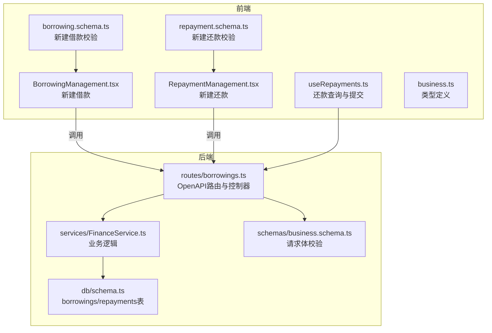
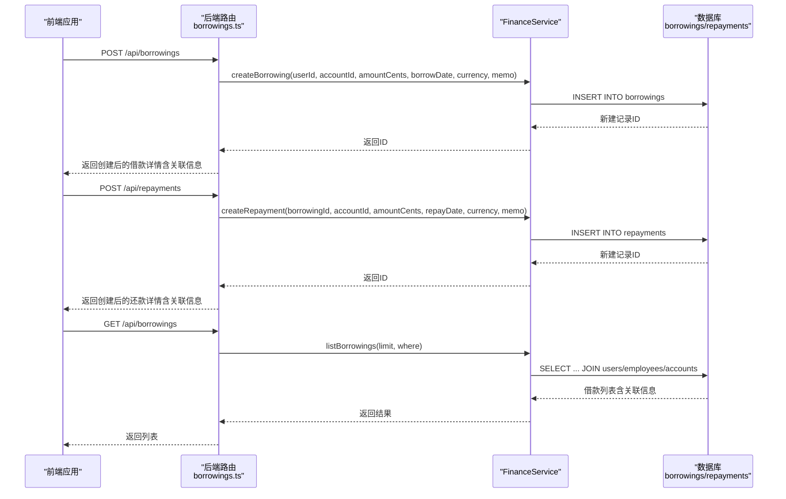
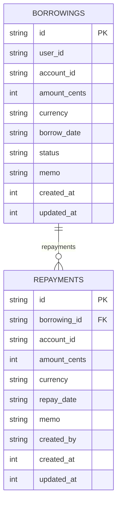
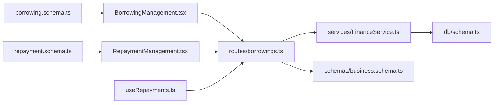

# 借款管理

<cite>
**本文引用的文件**
- [backend/src/routes/borrowings.ts](file://backend/src/routes/borrowings.ts)
- [backend/src/services/FinanceService.ts](file://backend/src/services/FinanceService.ts)
- [backend/src/db/schema.ts](file://backend/src/db/schema.ts)
- [backend/src/schemas/business.schema.ts](file://backend/src/schemas/business.schema.ts)
- [frontend/src/features/finance/pages/BorrowingManagement.tsx](file://frontend/src/features/finance/pages/BorrowingManagement.tsx)
- [frontend/src/features/finance/pages/RepaymentManagement.tsx](file://frontend/src/features/finance/pages/RepaymentManagement.tsx)
- [frontend/src/validations/borrowing.schema.ts](file://frontend/src/validations/borrowing.schema.ts)
- [frontend/src/validations/repayment.schema.ts](file://frontend/src/validations/repayment.schema.ts)
- [frontend/src/hooks/business/useRepayments.ts](file://frontend/src/hooks/business/useRepayments.ts)
- [frontend/src/types/business.ts](file://frontend/src/types/business.ts)
</cite>

## 目录
1. [简介](#简介)
2. [项目结构](#项目结构)
3. [核心组件](#核心组件)
4. [架构总览](#架构总览)
5. [详细组件分析](#详细组件分析)
6. [依赖关系分析](#依赖关系分析)
7. [性能考量](#性能考量)
8. [故障排查指南](#故障排查指南)
9. [结论](#结论)
10. [附录](#附录)

## 简介
本文件面向财务系统中的“借款管理”功能，围绕以下目标进行完整说明：
- 创建员工借款记录（POST /api/borrowings），字段包括借款人ID（userId）、借款账户（accountId）、借款金额（amountCents，接口层接收amount并转换为分）、借款日期（borrowDate）、币种（currency）、备注（memo）等。
- 明确借款状态（status）生命周期：outstanding（未偿还）→ partially_repaid（部分偿还）→ repaid（已偿还）。当前后端默认创建时状态为 outstanding；部分/全部偿还由还款记录驱动余额计算，最终状态由余额决定。
- 还款（repayment）机制：通过 POST /api/repayments 记录还款，系统写入还款记录并更新借款余额；前端通过 React Query 触发查询失效，联动刷新借款列表与账户余额。
- 通过 GET /api/borrowings 查询借款记录，并返回关联的借款人姓名与账户信息。
- 提供完整的业务示例：创建借款、多次部分还款、最终结清、查询与展示。

## 项目结构
借款管理涉及后端路由、服务层、数据库模型与前端页面/校验/钩子的协同。

图表来源
- [backend/src/routes/borrowings.ts](file://backend/src/routes/borrowings.ts#L70-L189)
- [backend/src/services/FinanceService.ts](file://backend/src/services/FinanceService.ts#L438-L528)
- [backend/src/db/schema.ts](file://backend/src/db/schema.ts#L328-L395)
- [backend/src/schemas/business.schema.ts](file://backend/src/schemas/business.schema.ts#L218-L229)
- [frontend/src/features/finance/pages/BorrowingManagement.tsx](file://frontend/src/features/finance/pages/BorrowingManagement.tsx#L1-L150)
- [frontend/src/features/finance/pages/RepaymentManagement.tsx](file://frontend/src/features/finance/pages/RepaymentManagement.tsx#L1-L157)
- [frontend/src/validations/borrowing.schema.ts](file://frontend/src/validations/borrowing.schema.ts#L1-L14)
- [frontend/src/validations/repayment.schema.ts](file://frontend/src/validations/repayment.schema.ts#L1-L14)
- [frontend/src/hooks/business/useRepayments.ts](file://frontend/src/hooks/business/useRepayments.ts#L1-L30)
- [frontend/src/types/business.ts](file://frontend/src/types/business.ts#L55-L85)

章节来源
- [backend/src/routes/borrowings.ts](file://backend/src/routes/borrowings.ts#L70-L189)
- [backend/src/services/FinanceService.ts](file://backend/src/services/FinanceService.ts#L438-L528)
- [backend/src/db/schema.ts](file://backend/src/db/schema.ts#L328-L395)
- [backend/src/schemas/business.schema.ts](file://backend/src/schemas/business.schema.ts#L218-L229)
- [frontend/src/features/finance/pages/BorrowingManagement.tsx](file://frontend/src/features/finance/pages/BorrowingManagement.tsx#L1-L150)
- [frontend/src/features/finance/pages/RepaymentManagement.tsx](file://frontend/src/features/finance/pages/RepaymentManagement.tsx#L1-L157)
- [frontend/src/validations/borrowing.schema.ts](file://frontend/src/validations/borrowing.schema.ts#L1-L14)
- [frontend/src/validations/repayment.schema.ts](file://frontend/src/validations/repayment.schema.ts#L1-L14)
- [frontend/src/hooks/business/useRepayments.ts](file://frontend/src/hooks/business/useRepayments.ts#L1-L30)
- [frontend/src/types/business.ts](file://frontend/src/types/business.ts#L55-L85)

## 核心组件
- 后端路由与控制器
  - GET /api/borrowings：列出借款，返回包含借款人姓名、账户名称与币种等关联信息。
  - POST /api/borrowings：创建借款，接收 userId、accountId、amount（分转换为 amountCents）、borrowDate、currency、memo。
  - GET /api/repayments：列出还款，支持按 borrowingId 过滤。
  - POST /api/repayments：创建还款，接收 borrowingId、accountId、amount（分转换为 amountCents）、repayDate、currency、memo。
  - GET /api/borrowings/balance：按用户统计余额（已借/已还/余额）。
- 服务层
  - FinanceService.listBorrowings：联表获取借款人与账户信息，组装返回。
  - FinanceService.createBorrowing：插入 borrowings 表，默认状态 outstanding。
  - FinanceService.createRepayment：插入 repayments 表。
- 数据库模型
  - borrowings：存储借款主信息，含状态字段 status。
  - repayments：存储还款明细，关联 borrowings。
- 前端
  - BorrowingManagement 页面：表单校验与提交，调用后端创建借款。
  - RepaymentManagement 页面：表单校验与提交，调用后端创建还款。
  - useRepayments 钩子：统一查询与提交还款，提交成功后触发查询失效，联动刷新借款与账户。

章节来源
- [backend/src/routes/borrowings.ts](file://backend/src/routes/borrowings.ts#L70-L189)
- [backend/src/services/FinanceService.ts](file://backend/src/services/FinanceService.ts#L438-L528)
- [backend/src/db/schema.ts](file://backend/src/db/schema.ts#L328-L395)
- [frontend/src/features/finance/pages/BorrowingManagement.tsx](file://frontend/src/features/finance/pages/BorrowingManagement.tsx#L1-L150)
- [frontend/src/features/finance/pages/RepaymentManagement.tsx](file://frontend/src/features/finance/pages/RepaymentManagement.tsx#L1-L157)
- [frontend/src/hooks/business/useRepayments.ts](file://frontend/src/hooks/business/useRepayments.ts#L1-L30)

## 架构总览
下图展示了从客户端到后端服务与数据库的整体流程。

图表来源
- [backend/src/routes/borrowings.ts](file://backend/src/routes/borrowings.ts#L70-L189)
- [backend/src/services/FinanceService.ts](file://backend/src/services/FinanceService.ts#L438-L528)
- [backend/src/db/schema.ts](file://backend/src/db/schema.ts#L328-L395)

## 详细组件分析

### 借款创建（POST /api/borrowings）
- 请求体字段
  - userId：借款人用户ID（UUID）
  - accountId：资金账户ID（UUID）
  - amount：金额（浮点，单位为货币基本单位）
  - borrowDate：借款日期（字符串，YYYY-MM-DD）
  - currency：币种（3位代码，如 CNY、USD、EUR、USDT）
  - memo：备注（可选）
- 处理流程
  - 路由层校验权限与请求体（金额>0、日期有效、币种3位）。
  - 将 amount 乘以 100 并四舍五入为整数存入 amountCents。
  - 调用 FinanceService.createBorrowing 插入 borrowings 表，默认状态 outstanding。
  - 返回包含关联信息的借款详情（借款人姓名、账户名称、币种等）。
- 关键路径
  - 路由定义与请求体校验：[backend/src/routes/borrowings.ts](file://backend/src/routes/borrowings.ts#L134-L189)
  - 服务层插入逻辑：[backend/src/services/FinanceService.ts](file://backend/src/services/FinanceService.ts#L482-L504)
  - 请求体Schema定义：[backend/src/schemas/business.schema.ts](file://backend/src/schemas/business.schema.ts#L218-L229)
  - 前端新建借款页面与校验：[frontend/src/features/finance/pages/BorrowingManagement.tsx](file://frontend/src/features/finance/pages/BorrowingManagement.tsx#L1-L150)，[frontend/src/validations/borrowing.schema.ts](file://frontend/src/validations/borrowing.schema.ts#L1-L14)

章节来源
- [backend/src/routes/borrowings.ts](file://backend/src/routes/borrowings.ts#L134-L189)
- [backend/src/services/FinanceService.ts](file://backend/src/services/FinanceService.ts#L482-L504)
- [backend/src/schemas/business.schema.ts](file://backend/src/schemas/business.schema.ts#L218-L229)
- [frontend/src/features/finance/pages/BorrowingManagement.tsx](file://frontend/src/features/finance/pages/BorrowingManagement.tsx#L1-L150)
- [frontend/src/validations/borrowing.schema.ts](file://frontend/src/validations/borrowing.schema.ts#L1-L14)

### 借款查询（GET /api/borrowings）
- 查询参数
  - userId：可选，仅查询指定用户的借款。
- 返回字段
  - id、userId、borrower_id、accountId、amountCents、currency、borrowDate、memo、createdAt、borrower_name、borrower_email、accountName、account_currency。
- 处理流程
  - 路由层根据是否为组员设置数据访问限制。
  - 调用 FinanceService.listBorrowings，联表 users/employees/accounts 获取关联信息。
  - 返回结果数组。
- 关键路径
  - 路由与查询逻辑：[backend/src/routes/borrowings.ts](file://backend/src/routes/borrowings.ts#L70-L133)
  - 服务层联表查询与组装：[backend/src/services/FinanceService.ts](file://backend/src/services/FinanceService.ts#L438-L480)
  - 前端表格展示与筛选：[frontend/src/features/finance/pages/BorrowingManagement.tsx](file://frontend/src/features/finance/pages/BorrowingManagement.tsx#L1-L150)

章节来源
- [backend/src/routes/borrowings.ts](file://backend/src/routes/borrowings.ts#L70-L133)
- [backend/src/services/FinanceService.ts](file://backend/src/services/FinanceService.ts#L438-L480)
- [frontend/src/features/finance/pages/BorrowingManagement.tsx](file://frontend/src/features/finance/pages/BorrowingManagement.tsx#L1-L150)

### 还款创建（POST /api/repayments）
- 请求体字段
  - borrowingId：借款记录ID（UUID）
  - accountId：资金账户ID（UUID）
  - amount：金额（浮点）
  - repayDate：还款日期（字符串，YYYY-MM-DD）
  - currency：币种（3位代码）
  - memo：备注（可选）
- 处理流程
  - 路由层校验权限与请求体（金额>0、日期有效、币种3位）。
  - 将 amount 乘以 100 并四舍五入为整数存入 amountCents。
  - 调用 FinanceService.createRepayment 插入 repayments 表。
  - 返回包含关联信息的还款详情（借款人姓名、账户名称、币种、创建人等）。
- 前端联动
  - useCreateRepayment 成功后使查询失效，刷新还款、借款与账户余额。
- 关键路径
  - 路由定义与请求体校验：[backend/src/routes/borrowings.ts](file://backend/src/routes/borrowings.ts#L253-L311)
  - 服务层插入逻辑：[backend/src/services/FinanceService.ts](file://backend/src/services/FinanceService.ts#L506-L528)
  - 请求体Schema定义：[backend/src/schemas/business.schema.ts](file://backend/src/schemas/business.schema.ts#L380-L391)
  - 前端新建还款页面与校验：[frontend/src/features/finance/pages/RepaymentManagement.tsx](file://frontend/src/features/finance/pages/RepaymentManagement.tsx#L1-L157)，[frontend/src/validations/repayment.schema.ts](file://frontend/src/validations/repayment.schema.ts#L1-L14)
  - 查询失效与联动刷新：[frontend/src/hooks/business/useRepayments.ts](file://frontend/src/hooks/business/useRepayments.ts#L1-L30)

章节来源
- [backend/src/routes/borrowings.ts](file://backend/src/routes/borrowings.ts#L253-L311)
- [backend/src/services/FinanceService.ts](file://backend/src/services/FinanceService.ts#L506-L528)
- [backend/src/schemas/business.schema.ts](file://backend/src/schemas/business.schema.ts#L380-L391)
- [frontend/src/features/finance/pages/RepaymentManagement.tsx](file://frontend/src/features/finance/pages/RepaymentManagement.tsx#L1-L157)
- [frontend/src/validations/repayment.schema.ts](file://frontend/src/validations/repayment.schema.ts#L1-L14)
- [frontend/src/hooks/business/useRepayments.ts](file://frontend/src/hooks/business/useRepayments.ts#L1-L30)

### 借款状态生命周期与余额计算
- 状态定义
  - 默认状态：outstanding（未偿还）
  - 部分/全部偿还：由还款累计金额与借款金额比较决定，最终可能呈现 repaid（已偿还）或 partially_repaid（部分偿还）。
- 余额统计
  - GET /api/borrowings/balance：按用户与币种统计 total_borrowed_cents、total_repaid_cents、balance_cents。
- 关键路径
  - 状态字段定义：[backend/src/db/schema.ts](file://backend/src/db/schema.ts#L328-L342)
  - 余额统计逻辑：[backend/src/routes/borrowings.ts](file://backend/src/routes/borrowings.ts#L313-L377)
  - 前端类型定义（状态枚举）：[frontend/src/types/business.ts](file://frontend/src/types/business.ts#L55-L71)

章节来源
- [backend/src/db/schema.ts](file://backend/src/db/schema.ts#L328-L342)
- [backend/src/routes/borrowings.ts](file://backend/src/routes/borrowings.ts#L313-L377)
- [frontend/src/types/business.ts](file://frontend/src/types/business.ts#L55-L71)

### 借款与还款的数据模型

图表来源
- [backend/src/db/schema.ts](file://backend/src/db/schema.ts#L328-L395)

章节来源
- [backend/src/db/schema.ts](file://backend/src/db/schema.ts#L328-L395)

## 依赖关系分析
- 路由依赖
  - borrowings.ts 依赖 FinanceService 完成业务逻辑；依赖业务Schema与通用Schema进行请求体与查询参数校验。
- 服务层依赖
  - FinanceService 依赖 db/schema.ts 中的 borrowings/repayments 表结构。
- 前端依赖
  - 页面组件依赖验证Schema与React Query钩子；类型定义来自前端类型文件。
- 权限与审计
  - 路由层对关键操作进行权限校验；创建借款/还款后记录审计日志。

图表来源
- [backend/src/routes/borrowings.ts](file://backend/src/routes/borrowings.ts#L70-L189)
- [backend/src/services/FinanceService.ts](file://backend/src/services/FinanceService.ts#L438-L528)
- [backend/src/db/schema.ts](file://backend/src/db/schema.ts#L328-L395)
- [backend/src/schemas/business.schema.ts](file://backend/src/schemas/business.schema.ts#L218-L229)
- [frontend/src/features/finance/pages/BorrowingManagement.tsx](file://frontend/src/features/finance/pages/BorrowingManagement.tsx#L1-L150)
- [frontend/src/features/finance/pages/RepaymentManagement.tsx](file://frontend/src/features/finance/pages/RepaymentManagement.tsx#L1-L157)
- [frontend/src/validations/borrowing.schema.ts](file://frontend/src/validations/borrowing.schema.ts#L1-L14)
- [frontend/src/validations/repayment.schema.ts](file://frontend/src/validations/repayment.schema.ts#L1-L14)
- [frontend/src/hooks/business/useRepayments.ts](file://frontend/src/hooks/business/useRepayments.ts#L1-L30)

章节来源
- [backend/src/routes/borrowings.ts](file://backend/src/routes/borrowings.ts#L70-L189)
- [backend/src/services/FinanceService.ts](file://backend/src/services/FinanceService.ts#L438-L528)
- [backend/src/db/schema.ts](file://backend/src/db/schema.ts#L328-L395)
- [backend/src/schemas/business.schema.ts](file://backend/src/schemas/business.schema.ts#L218-L229)
- [frontend/src/features/finance/pages/BorrowingManagement.tsx](file://frontend/src/features/finance/pages/BorrowingManagement.tsx#L1-L150)
- [frontend/src/features/finance/pages/RepaymentManagement.tsx](file://frontend/src/features/finance/pages/RepaymentManagement.tsx#L1-L157)
- [frontend/src/validations/borrowing.schema.ts](file://frontend/src/validations/borrowing.schema.ts#L1-L14)
- [frontend/src/validations/repayment.schema.ts](file://frontend/src/validations/repayment.schema.ts#L1-L14)
- [frontend/src/hooks/business/useRepayments.ts](file://frontend/src/hooks/business/useRepayments.ts#L1-L30)

## 性能考量
- 查询限制
  - 列表查询默认限制条数，避免一次性返回过多数据。
- 联表查询
  - 借款列表联表 users/employees/accounts，建议确保相关字段建立索引以提升查询效率。
- 事务与一致性
  - 还款创建后应保证账户余额与现金流一致，建议在服务层或事务中完成相关联的会计分录。
- 缓存与失效
  - 前端提交还款后主动失效相关查询（还款、借款、账户），避免显示陈旧数据。

## 故障排查指南
- 权限不足
  - 创建借款/还款需具备 finance.borrowing.create 权限；若报错请检查用户角色与权限配置。
- 参数校验失败
  - 金额必须大于0、日期格式有效、币种为3位代码；请核对前端表单校验与后端Schema。
- 数据访问限制
  - 组员仅能查看本人相关记录；若查询为空，请确认当前登录用户身份与数据范围。
- 状态未更新
  - 部分/全部偿还不会自动改变状态字段，余额统计基于累计金额计算；请通过余额接口确认状态变化。

章节来源
- [backend/src/routes/borrowings.ts](file://backend/src/routes/borrowings.ts#L70-L189)
- [backend/src/schemas/business.schema.ts](file://backend/src/schemas/business.schema.ts#L218-L229)
- [frontend/src/validations/borrowing.schema.ts](file://frontend/src/validations/borrowing.schema.ts#L1-L14)
- [frontend/src/validations/repayment.schema.ts](file://frontend/src/validations/repayment.schema.ts#L1-L14)

## 结论
本系统通过清晰的路由、服务与数据模型实现了借款与还款的完整闭环：前端负责表单与交互，后端负责权限、校验与业务逻辑，数据库提供稳定的数据结构。状态生命周期由余额驱动，便于追踪与审计。建议在生产环境中完善权限与审计策略，并持续优化查询性能与缓存策略。

## 附录

### API 定义与示例

- 创建借款（POST /api/borrowings）
  - 请求体字段
    - userId：借款人用户ID（UUID）
    - accountId：资金账户ID（UUID）
    - amount：金额（浮点，单位为货币基本单位）
    - borrowDate：借款日期（YYYY-MM-DD）
    - currency：币种（3位代码）
    - memo：备注（可选）
  - 示例
    - 请求：POST /api/borrowings
    - 响应：包含 id、userId、borrower_name、borrower_email、accountId、accountName、amountCents、currency、borrowDate、memo、createdAt 等字段。
  - 关键路径
    - [backend/src/routes/borrowings.ts](file://backend/src/routes/borrowings.ts#L134-L189)
    - [backend/src/services/FinanceService.ts](file://backend/src/services/FinanceService.ts#L482-L504)
    - [backend/src/schemas/business.schema.ts](file://backend/src/schemas/business.schema.ts#L218-L229)
    - [frontend/src/features/finance/pages/BorrowingManagement.tsx](file://frontend/src/features/finance/pages/BorrowingManagement.tsx#L1-L150)

- 查询借款（GET /api/borrowings）
  - 查询参数
    - userId：可选，仅查询指定用户的借款。
  - 响应字段
    - results：数组，包含 id、userId、borrower_id、accountId、amountCents、currency、borrowDate、memo、createdAt、borrower_name、borrower_email、accountName、account_currency。
  - 关键路径
    - [backend/src/routes/borrowings.ts](file://backend/src/routes/borrowings.ts#L70-L133)
    - [backend/src/services/FinanceService.ts](file://backend/src/services/FinanceService.ts#L438-L480)
    - [frontend/src/features/finance/pages/BorrowingManagement.tsx](file://frontend/src/features/finance/pages/BorrowingManagement.tsx#L1-L150)

- 创建还款（POST /api/repayments）
  - 请求体字段
    - borrowingId：借款记录ID（UUID）
    - accountId：资金账户ID（UUID）
    - amount：金额（浮点）
    - repayDate：还款日期（YYYY-MM-DD）
    - currency：币种（3位代码）
    - memo：备注（可选）
  - 响应字段
    - 包含 id、borrowingId、accountId、amountCents、currency、repayDate、memo、createdBy、createdAt、userId、borrower_name、borrower_email、accountName、account_currency、creator_name。
  - 关键路径
    - [backend/src/routes/borrowings.ts](file://backend/src/routes/borrowings.ts#L253-L311)
    - [backend/src/services/FinanceService.ts](file://backend/src/services/FinanceService.ts#L506-L528)
    - [backend/src/schemas/business.schema.ts](file://backend/src/schemas/business.schema.ts#L380-L391)
    - [frontend/src/features/finance/pages/RepaymentManagement.tsx](file://frontend/src/features/finance/pages/RepaymentManagement.tsx#L1-L157)
    - [frontend/src/hooks/business/useRepayments.ts](file://frontend/src/hooks/business/useRepayments.ts#L1-L30)

- 借款余额（GET /api/borrowings/balance）
  - 响应字段
    - results：数组，包含 userId、borrower_name、borrower_email、currency、total_borrowed_cents、total_repaid_cents、balance_cents。
  - 关键路径
    - [backend/src/routes/borrowings.ts](file://backend/src/routes/borrowings.ts#L313-L377)

### 业务场景示例

- 创建一笔借款
  - 步骤
    - 前端填写借款人、账户、金额、日期、币种、备注。
    - 调用 POST /api/borrowings 创建。
    - 返回包含关联信息的借款详情。
  - 关键路径
    - [frontend/src/features/finance/pages/BorrowingManagement.tsx](file://frontend/src/features/finance/pages/BorrowingManagement.tsx#L1-L150)
    - [backend/src/routes/borrowings.ts](file://backend/src/routes/borrowings.ts#L134-L189)

- 多次部分还款
  - 步骤
    - 前端选择同一笔借款，多次提交 POST /api/repayments。
    - 每次提交后，前端查询失效，刷新还款与借款列表。
  - 关键路径
    - [frontend/src/features/finance/pages/RepaymentManagement.tsx](file://frontend/src/features/finance/pages/RepaymentManagement.tsx#L1-L157)
    - [frontend/src/hooks/business/useRepayments.ts](file://frontend/src/hooks/business/useRepayments.ts#L1-L30)
    - [backend/src/routes/borrowings.ts](file://backend/src/routes/borrowings.ts#L253-L311)

- 最终结清与状态更新
  - 步骤
    - 当累计还款金额等于借款金额时，余额统计显示 balance_cents 为0，状态可视为 repaid。
  - 关键路径
    - [backend/src/routes/borrowings.ts](file://backend/src/routes/borrowings.ts#L313-L377)
    - [backend/src/db/schema.ts](file://backend/src/db/schema.ts#L328-L342)