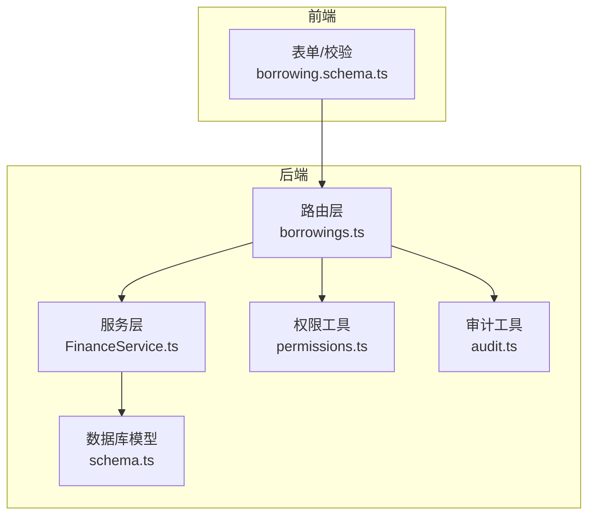
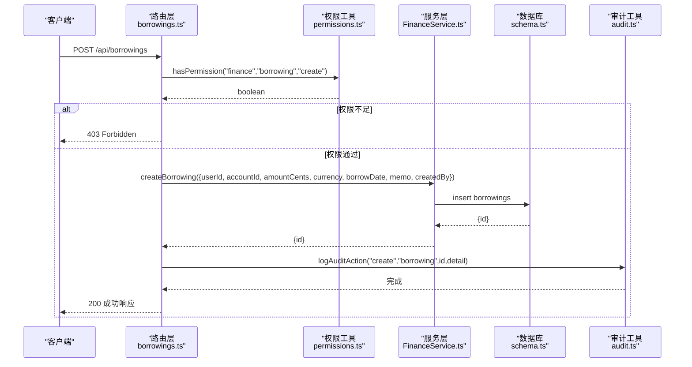
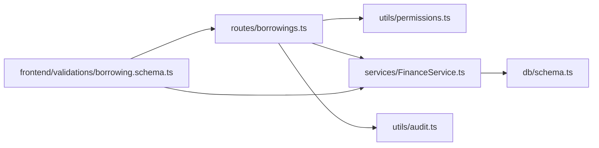

# 创建借款

<cite>
**本文引用的文件**
- [backend/src/routes/borrowings.ts](file://backend/src/routes/borrowings.ts)
- [backend/src/services/FinanceService.ts](file://backend/src/services/FinanceService.ts)
- [backend/src/utils/permissions.ts](file://backend/src/utils/permissions.ts)
- [backend/src/utils/audit.ts](file://backend/src/utils/audit.ts)
- [backend/src/schemas/business.schema.ts](file://backend/src/schemas/business.schema.ts)
- [backend/src/db/schema.ts](file://backend/src/db/schema.ts)
- [frontend/src/validations/borrowing.schema.ts](file://frontend/src/validations/borrowing.schema.ts)
- [frontend/src/types/business.ts](file://frontend/src/types/business.ts)
</cite>

## 目录
1. [简介](#简介)
2. [项目结构](#项目结构)
3. [核心组件](#核心组件)
4. [架构总览](#架构总览)
5. [详细组件分析](#详细组件分析)
6. [依赖关系分析](#依赖关系分析)
7. [性能考量](#性能考量)
8. [故障排查指南](#故障排查指南)
9. [结论](#结论)
10. [附录](#附录)

## 简介
本文件面向“创建员工借款记录”场景，围绕后端路由与服务层的协作，系统化说明以下内容：
- 接口定义与请求体字段
- 借款状态生命周期（未偿还 → 部分偿还 → 已偿还）
- FinanceService.createBorrowing 的数据库写入逻辑与金额精度（以分为单位）
- 权限校验机制 hasPermission
- 审计日志记录 logAuditAction
- 请求示例、成功响应格式与常见错误处理

## 项目结构
后端采用 Hono + Drizzle ORM 架构，前端使用 Zod 校验与类型约束。借款相关的关键位置如下：
- 路由层：/api/borrowings 的 POST 请求由 borrowingsRoutes 处理
- 服务层：FinanceService 提供 createBorrowing 等核心业务方法
- 权限与审计：权限检查与审计日志分别由权限工具与审计工具负责
- 数据模型：borrowings 表定义了借款记录的字段与默认状态

图表来源
- [backend/src/routes/borrowings.ts](file://backend/src/routes/borrowings.ts#L134-L189)
- [backend/src/services/FinanceService.ts](file://backend/src/services/FinanceService.ts#L482-L504)
- [backend/src/utils/permissions.ts](file://backend/src/utils/permissions.ts#L88-L114)
- [backend/src/utils/audit.ts](file://backend/src/utils/audit.ts#L61-L91)
- [backend/src/db/schema.ts](file://backend/src/db/schema.ts#L328-L342)

章节来源
- [backend/src/routes/borrowings.ts](file://backend/src/routes/borrowings.ts#L134-L189)
- [backend/src/services/FinanceService.ts](file://backend/src/services/FinanceService.ts#L482-L504)
- [backend/src/utils/permissions.ts](file://backend/src/utils/permissions.ts#L88-L114)
- [backend/src/utils/audit.ts](file://backend/src/utils/audit.ts#L61-L91)
- [backend/src/db/schema.ts](file://backend/src/db/schema.ts#L328-L342)

## 核心组件
- 路由层（POST /api/borrowings）
  - 负责接收请求体、执行权限校验、调用服务层创建借款、记录审计日志，并返回标准化响应。
- 服务层（FinanceService.createBorrowing）
  - 将金额转换为“分”的整数后写入数据库，设置初始状态为“未偿还”，并返回新记录 ID。
- 权限工具（hasPermission）
  - 基于职位权限配置进行细粒度授权检查，要求具备 finance.borrowing.create 权限。
- 审计工具（logAuditAction）
  - 记录操作者、动作、实体、实体 ID 与详情，同时采集 IP 与 IP 归属地信息。
- 数据模型（borrowings）
  - 字段包含 userId、accountId、amountCents、currency、borrowDate、memo、status 等；默认状态为 outstanding。

章节来源
- [backend/src/routes/borrowings.ts](file://backend/src/routes/borrowings.ts#L134-L189)
- [backend/src/services/FinanceService.ts](file://backend/src/services/FinanceService.ts#L482-L504)
- [backend/src/utils/permissions.ts](file://backend/src/utils/permissions.ts#L88-L114)
- [backend/src/utils/audit.ts](file://backend/src/utils/audit.ts#L61-L91)
- [backend/src/db/schema.ts](file://backend/src/db/schema.ts#L328-L342)

## 架构总览
下图展示了“创建借款”的端到端调用序列，包括权限校验、服务写入与审计记录。

图表来源
- [backend/src/routes/borrowings.ts](file://backend/src/routes/borrowings.ts#L160-L189)
- [backend/src/utils/permissions.ts](file://backend/src/utils/permissions.ts#L88-L114)
- [backend/src/services/FinanceService.ts](file://backend/src/services/FinanceService.ts#L482-L504)
- [backend/src/utils/audit.ts](file://backend/src/utils/audit.ts#L61-L91)
- [backend/src/db/schema.ts](file://backend/src/db/schema.ts#L328-L342)

## 详细组件分析

### 接口定义与请求体字段
- 路由路径：/api/borrowings
- 方法：POST
- 请求体字段（来自后端 Schema 与前端校验）：
  - userId：借款人用户 ID（UUID）
  - accountId：借款账户 ID（UUID）
  - amount：借款金额（浮点数，前端最小值为 0.01）
  - currency：币种代码（3 位 ISO 代码）
  - borrowDate：借款日期（字符串，需为有效日期）
  - memo：备注（可选）
- 响应体字段（来自后端响应 Schema）：
  - id、userId、borrower_id、accountId、amountCents、currency、borrowDate、memo、createdAt、borrower_name、borrower_email、accountName、account_currency

注意
- 金额字段在请求体中为 amount（元），服务层会将其转换为“分”的整数（amountCents）再入库。
- 响应体中的 amountCents 为整数，单位为分。

章节来源
- [backend/src/routes/borrowings.ts](file://backend/src/routes/borrowings.ts#L134-L189)
- [backend/src/schemas/business.schema.ts](file://backend/src/schemas/business.schema.ts#L219-L229)
- [frontend/src/validations/borrowing.schema.ts](file://frontend/src/validations/borrowing.schema.ts#L4-L11)
- [backend/src/db/schema.ts](file://backend/src/db/schema.ts#L328-L342)

### 借款状态生命周期
- 默认状态：outstanding（未偿还）
- 生命周期流转（基于现有代码与类型定义）：
  - outstanding（未偿还） → partially_repaid（部分偿还） → repaid（已偿还）
- 说明
  - 当前路由层仅负责创建借款，默认状态为 outstanding。
  - 部分偿还与已偿还状态在现有代码中未直接暴露为创建接口的状态字段，通常通过还款流程与余额统计推导得出。

章节来源
- [backend/src/services/FinanceService.ts](file://backend/src/services/FinanceService.ts#L482-L504)
- [backend/src/db/schema.ts](file://backend/src/db/schema.ts#L328-L342)
- [frontend/src/types/business.ts](file://frontend/src/types/business.ts#L55-L71)

### FinanceService.createBorrowing 的实现要点
- 参数转换
  - 将请求体中的 amount（元）乘以 100 并取整，得到 amountCents（分）存入数据库。
- 默认状态
  - 新建记录的 status 默认为 outstanding。
- 返回值
  - 返回新建记录的 id，用于后续审计日志与查询。

章节来源
- [backend/src/routes/borrowings.ts](file://backend/src/routes/borrowings.ts#L160-L173)
- [backend/src/services/FinanceService.ts](file://backend/src/services/FinanceService.ts#L482-L504)
- [backend/src/db/schema.ts](file://backend/src/db/schema.ts#L328-L342)

### 权限检查机制 hasPermission
- 路由层在处理创建请求前，调用 hasPermission(c, 'finance', 'borrowing', 'create') 进行授权检查。
- 若无权限，抛出 403 错误。
- 权限判断依据职位权限配置与部门模块访问策略。

章节来源
- [backend/src/routes/borrowings.ts](file://backend/src/routes/borrowings.ts#L160-L162)
- [backend/src/utils/permissions.ts](file://backend/src/utils/permissions.ts#L88-L114)

### 审计日志记录 logAuditAction
- 在创建成功后，路由层调用 logAuditAction 记录审计日志。
- 日志内容包含：actorId、action（create）、entity（borrowing）、entityId（新建记录 id）、detail（JSON 字符串，包含 userId、accountId、amountCents 等）。
- 同时采集客户端 IP 与 IP 归属地信息，保证日志可追溯。

章节来源
- [backend/src/routes/borrowings.ts](file://backend/src/routes/borrowings.ts#L174-L174)
- [backend/src/utils/audit.ts](file://backend/src/utils/audit.ts#L61-L91)

### 请求与响应示例
- 请求示例（JSON）
  - 说明：amount 为元，服务层会转换为 amountCents（分）。
  - 字段：userId、accountId、amount、currency、borrowDate、memo（可选）
- 成功响应示例（JSON）
  - 字段：id、userId、borrower_id、accountId、amountCents、currency、borrowDate、memo、createdAt、borrower_name、borrower_email、accountName、account_currency

章节来源
- [backend/src/routes/borrowings.ts](file://backend/src/routes/borrowings.ts#L134-L189)
- [backend/src/schemas/business.schema.ts](file://backend/src/schemas/business.schema.ts#L219-L229)
- [backend/src/db/schema.ts](file://backend/src/db/schema.ts#L328-L342)

### 常见错误与处理
- 权限不足
  - 现象：403 Forbidden
  - 原因：当前用户不具备 finance.borrowing.create 权限
  - 处理：授予相应职位权限或调整用户所属部门模块
- 必填字段缺失或格式错误
  - 现象：400 Bad Request（由 Zod 校验抛出）
  - 原因：userId、accountId、amount、currency、borrowDate 缺失或格式不合法
  - 处理：补齐必填项并修正格式（如日期格式、币种代码长度）
- 金额非法
  - 现象：前端校验报错（最小值为 0.01）
  - 处理：确保金额大于 0

章节来源
- [backend/src/routes/borrowings.ts](file://backend/src/routes/borrowings.ts#L160-L162)
- [frontend/src/validations/borrowing.schema.ts](file://frontend/src/validations/borrowing.schema.ts#L4-L11)

## 依赖关系分析
- 路由层依赖
  - 权限工具：用于授权检查
  - 服务层：用于业务处理与数据库写入
  - 审计工具：用于记录审计日志
  - 数据模型：用于字段定义与默认状态
- 服务层依赖
  - Drizzle ORM：用于数据库操作
  - 数据模型：用于插入 borrowings 记录
- 前端依赖
  - Zod 校验：用于请求体校验
  - 类型定义：用于状态与字段约束

图表来源
- [backend/src/routes/borrowings.ts](file://backend/src/routes/borrowings.ts#L134-L189)
- [backend/src/utils/permissions.ts](file://backend/src/utils/permissions.ts#L88-L114)
- [backend/src/services/FinanceService.ts](file://backend/src/services/FinanceService.ts#L482-L504)
- [backend/src/utils/audit.ts](file://backend/src/utils/audit.ts#L61-L91)
- [backend/src/db/schema.ts](file://backend/src/db/schema.ts#L328-L342)
- [frontend/src/validations/borrowing.schema.ts](file://frontend/src/validations/borrowing.schema.ts#L4-L11)

## 性能考量
- 金额转换为整数（分）存储，避免浮点误差，提升对账与统计准确性。
- 审计日志采用 waitUntil 异步记录，降低主流程延迟。
- 数据库写入为单条 insert，开销较小；若批量创建建议在上层聚合后再调用服务层。

## 故障排查指南
- 403 Forbidden
  - 检查用户职位权限配置是否包含 finance.borrowing.create
  - 确认部门模块访问策略允许 finance 模块
- 400 Bad Request
  - 核对请求体字段是否齐全且格式正确（日期、币种代码、金额）
  - 前端校验器会提示具体字段问题
- 审计日志未记录
  - 检查审计工具是否正常初始化，确认 executionCtx.waitUntil 是否可用
  - 确认 detail 参数是否包含关键字段（userId、accountId、amountCents）

章节来源
- [backend/src/utils/permissions.ts](file://backend/src/utils/permissions.ts#L88-L114)
- [frontend/src/validations/borrowing.schema.ts](file://frontend/src/validations/borrowing.schema.ts#L4-L11)
- [backend/src/utils/audit.ts](file://backend/src/utils/audit.ts#L61-L91)

## 结论
- 创建借款接口通过严格的权限校验与前端校验保障数据质量。
- 服务层统一将金额转换为“分”存储，确保财务精度。
- 审计日志贯穿创建流程，便于追踪与合规。
- 借款状态默认 outstanding，后续可通过还款流程与余额统计推导出 partial_repaid 与 repaid。

## 附录
- 字段对照
  - 请求体：amount（元） → 服务层转换为 amountCents（分）
  - 响应体：amountCents（分）为整数
- 状态对照
  - 默认：outstanding（未偿还）
  - 流转：partially_repaid（部分偿还） → repaid（已偿还）