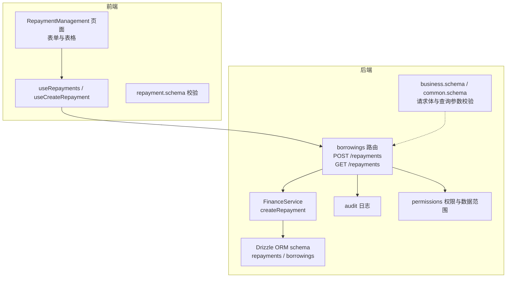
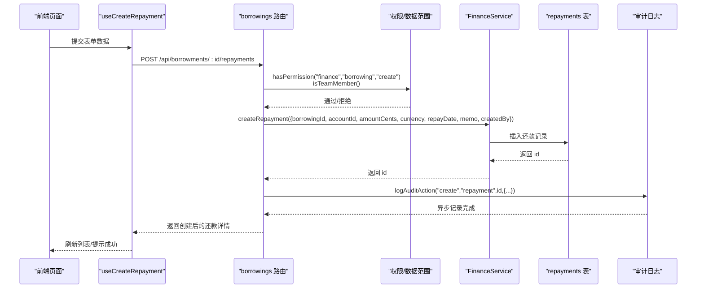
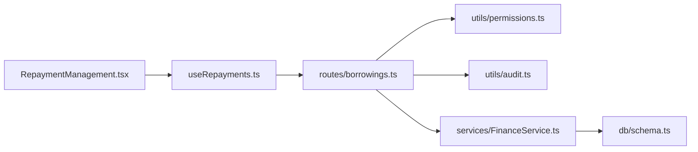
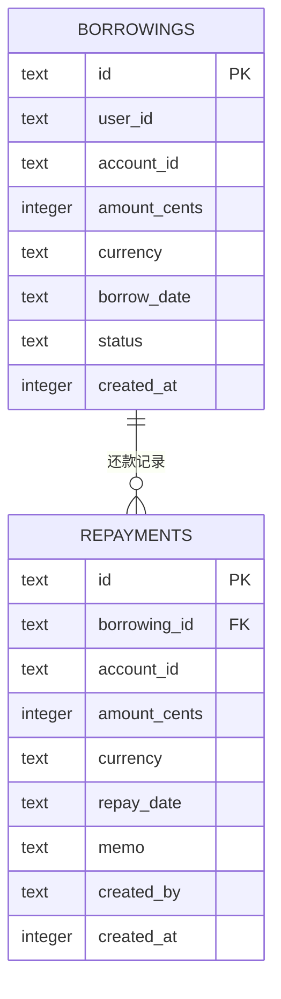

# 管理还款

<cite>
**本文引用的文件**
- [backend/src/routes/borrowings.ts](file://backend/src/routes/borrowings.ts)
- [backend/src/services/FinanceService.ts](file://backend/src/services/FinanceService.ts)
- [backend/src/schemas/business.schema.ts](file://backend/src/schemas/business.schema.ts)
- [backend/src/schemas/common.schema.ts](file://backend/src/schemas/common.schema.ts)
- [backend/src/db/schema.ts](file://backend/src/db/schema.ts)
- [backend/src/utils/audit.ts](file://backend/src/utils/audit.ts)
- [backend/src/utils/permissions.ts](file://backend/src/utils/permissions.ts)
- [frontend/src/features/finance/pages/RepaymentManagement.tsx](file://frontend/src/features/finance/pages/RepaymentManagement.tsx)
- [frontend/src/hooks/business/useRepayments.ts](file://frontend/src/hooks/business/useRepayments.ts)
- [frontend/src/validations/repayment.schema.ts](file://frontend/src/validations/repayment.schema.ts)
- [backend/test/services/FinanceService.test.ts](file://backend/test/services/FinanceService.test.ts)
</cite>

## 目录
1. [简介](#简介)
2. [项目结构](#项目结构)
3. [核心组件](#核心组件)
4. [架构总览](#架构总览)
5. [详细组件分析](#详细组件分析)
6. [依赖关系分析](#依赖关系分析)
7. [性能考量](#性能考量)
8. [故障排查指南](#故障排查指南)
9. [结论](#结论)
10. [附录](#附录)

## 简介
本文件面向“还款管理”API的完整文档，覆盖以下要点：
- 通过 POST /api/borrowings/:id/repayments 记录还款的请求体字段与语义（还款账户 accountId、还款金额 amountCents、还款日期 repayDate 等）。
- FinanceService.createRepayment 服务方法如何创建还款记录并关联到原始借款记录。
- GET /api/repayments 的还款记录查询实现，包括按借款ID过滤与权限控制（isTeamMember）。
- 还款记录对借款余额的影响与计算逻辑。
- 审计日志对还款操作的记录机制。
- 多笔还款与部分还款的业务场景示例，以及常见验证错误与权限问题的处理建议。

## 项目结构
围绕“还款”的前后端协作涉及如下关键位置：
- 后端路由层：定义还款创建与查询接口、参数校验、权限控制与审计日志。
- 服务层：FinanceService 提供 createRepayment 等核心业务方法。
- 数据层：Drizzle ORM 映射 repayments、borrowings 等表结构。
- 前端页面与表单：提供还款录入界面、查询列表与提交交互。

图表来源
- [backend/src/routes/borrowings.ts](file://backend/src/routes/borrowings.ts#L192-L311)
- [backend/src/services/FinanceService.ts](file://backend/src/services/FinanceService.ts#L506-L528)
- [backend/src/schemas/business.schema.ts](file://backend/src/schemas/business.schema.ts#L380-L391)
- [backend/src/schemas/common.schema.ts](file://backend/src/schemas/common.schema.ts#L145-L157)
- [backend/src/db/schema.ts](file://backend/src/db/schema.ts#L384-L395)
- [backend/src/utils/audit.ts](file://backend/src/utils/audit.ts#L61-L92)
- [backend/src/utils/permissions.ts](file://backend/src/utils/permissions.ts#L140-L147)

章节来源
- [backend/src/routes/borrowings.ts](file://backend/src/routes/borrowings.ts#L192-L311)
- [backend/src/services/FinanceService.ts](file://backend/src/services/FinanceService.ts#L506-L528)
- [backend/src/schemas/business.schema.ts](file://backend/src/schemas/business.schema.ts#L380-L391)
- [backend/src/schemas/common.schema.ts](file://backend/src/schemas/common.schema.ts#L145-L157)
- [backend/src/db/schema.ts](file://backend/src/db/schema.ts#L384-L395)
- [backend/src/utils/audit.ts](file://backend/src/utils/audit.ts#L61-L92)
- [backend/src/utils/permissions.ts](file://backend/src/utils/permissions.ts#L140-L147)
- [frontend/src/features/finance/pages/RepaymentManagement.tsx](file://frontend/src/features/finance/pages/RepaymentManagement.tsx#L1-L157)
- [frontend/src/hooks/business/useRepayments.ts](file://frontend/src/hooks/business/useRepayments.ts#L1-L31)
- [frontend/src/validations/repayment.schema.ts](file://frontend/src/validations/repayment.schema.ts#L1-L14)

## 核心组件
- 路由与控制器
  - POST /api/borrowings/:id/repayments：创建还款记录，请求体字段包括 borrowingId、accountId、amount、currency、repayDate、memo 等。
  - GET /api/repayments：查询还款记录，支持按 borrowingId 过滤，内部应用 isTeamMember 权限与数据范围控制。
- 服务层
  - FinanceService.createRepayment：将还款记录写入 repayments 表，返回新记录 id。
- 数据层
  - repayments 表：存储还款记录（borrowingId、accountId、amountCents、currency、repayDate、memo、createdBy、createdAt 等）。
  - borrowings 表：存储原始借款记录（userId、accountId、amountCents、currency、borrowDate、status 等）。
- 前端
  - RepaymentManagement 页面：提供新建还款表单、列表展示与刷新。
  - useRepayments/useCreateRepayment：封装查询与提交逻辑，提交成功后触发相关缓存失效。
  - repayment.schema：前端表单校验规则（金额>0、日期有效、币种与账户选择等）。

章节来源
- [backend/src/routes/borrowings.ts](file://backend/src/routes/borrowings.ts#L192-L311)
- [backend/src/services/FinanceService.ts](file://backend/src/services/FinanceService.ts#L506-L528)
- [backend/src/db/schema.ts](file://backend/src/db/schema.ts#L384-L395)
- [frontend/src/features/finance/pages/RepaymentManagement.tsx](file://frontend/src/features/finance/pages/RepaymentManagement.tsx#L1-L157)
- [frontend/src/hooks/business/useRepayments.ts](file://frontend/src/hooks/business/useRepayments.ts#L1-L31)
- [frontend/src/validations/repayment.schema.ts](file://frontend/src/validations/repayment.schema.ts#L1-L14)

## 架构总览
下面的序列图展示了“创建还款”的端到端流程，包括权限校验、请求体校验、服务层持久化与审计日志。

图表来源
- [backend/src/routes/borrowings.ts](file://backend/src/routes/borrowings.ts#L253-L311)
- [backend/src/services/FinanceService.ts](file://backend/src/services/FinanceService.ts#L506-L528)
- [backend/src/utils/audit.ts](file://backend/src/utils/audit.ts#L61-L92)
- [backend/src/utils/permissions.ts](file://backend/src/utils/permissions.ts#L88-L114)

## 详细组件分析

### 1) 接口定义与请求体字段
- POST /api/borrowings/:id/repayments
  - 请求体字段
    - borrowingId：UUID，关联到 borrowings 的 id。
    - accountId：UUID，资金账户。
    - amount：数值，单位为货币基本单位（例如元/美元），后端转换为 cents 存储。
    - currency：3 字母币种代码（如 CNY、USD、EUR、USDT）。
    - repayDate：日期字符串 YYYY-MM-DD。
    - memo：可选备注。
  - 响应体字段
    - id、borrowingId、accountId、amountCents、currency、repayDate、memo、createdBy、createdAt、userId、borrower_name、borrower_email、accountName、account_currency、creator_name。
- GET /api/repayments
  - 查询参数
    - borrowingId：可选，按借款记录过滤。
  - 响应体字段
    - results 数组，每项包含上述还款记录字段。

章节来源
- [backend/src/routes/borrowings.ts](file://backend/src/routes/borrowings.ts#L192-L251)
- [backend/src/schemas/business.schema.ts](file://backend/src/schemas/business.schema.ts#L380-L391)
- [backend/src/schemas/common.schema.ts](file://backend/src/schemas/common.schema.ts#L145-L157)
- [backend/src/db/schema.ts](file://backend/src/db/schema.ts#L384-L395)

### 2) FinanceService.createRepayment 实现
- 方法签名
  - createRepayment({ borrowingId, accountId, amountCents, currency, repayDate, memo?, createdBy? })
- 处理逻辑
  - 生成唯一 id。
  - 将 amount 从“基本单位”转换为“分”（cents）后入库。
  - 写入 repayments 表，返回 id。
- 关联关系
  - 通过 borrowingId 与 borrowings 表建立外键关系（schema 层定义）。
- 业务影响
  - 新增还款记录，后续可通过 GET /api/borrowings/balance 计算余额（见下节）。

章节来源
- [backend/src/services/FinanceService.ts](file://backend/src/services/FinanceService.ts#L506-L528)
- [backend/src/db/schema.ts](file://backend/src/db/schema.ts#L384-L395)

### 3) 还款记录查询与权限控制
- GET /api/repayments
  - 权限控制
    - 若调用者为 isTeamMember，则仅能查看与自身相关的还款记录（通过关联 borrowings.user_id 进行过滤）。
    - 若非 isTeamMember，则可按 borrowingId 参数过滤。
  - 查询逻辑
    - 支持按 borrowingId 过滤；若未提供则返回全部（受 isTeamMember 限制）。
    - 结果包含账户、借款人、创建人等关联信息。
- 前端交互
  - useRepayments：拉取还款列表，useCreateRepayment：提交新建还款并触发缓存失效。

章节来源
- [backend/src/routes/borrowings.ts](file://backend/src/routes/borrowings.ts#L192-L251)
- [backend/src/utils/permissions.ts](file://backend/src/utils/permissions.ts#L140-L147)
- [frontend/src/hooks/business/useRepayments.ts](file://frontend/src/hooks/business/useRepayments.ts#L1-L31)

### 4) 还款对借款余额的影响与计算
- 余额计算逻辑
  - GET /api/borrowings/balance 按用户与币种维度统计：
    - total_borrowed_cents：该用户该币种下的总借款金额（sum(borrowings.amountCents)）。
    - total_repaid_cents：该用户该币种下所有与之关联的还款金额总和（子查询汇总 repayments.amountCents）。
    - balance_cents：两者差额。
  - 该接口还会应用数据访问过滤（getDataAccessFilter），确保不同层级用户只能看到其有权访问的数据。
- 影响说明
  - 每新增一笔还款，都会计入 total_repaid_cents，从而减少 balance_cents。
  - 当某币种下余额为 0 时，查询结果不会包含该条目（having balance_cents != 0）。

章节来源
- [backend/src/routes/borrowings.ts](file://backend/src/routes/borrowings.ts#L313-L377)
- [backend/src/utils/permissions.ts](file://backend/src/utils/permissions.ts#L273-L323)

### 5) 审计日志记录
- 在 POST /api/borrowings/:id/repayments 成功创建后，路由层调用 logAuditAction 记录审计日志。
- 审计内容包含操作类型（create）、实体（repayment）、实体 id、详细信息（如金额、账户、借款记录等）。
- 审计日志异步写入，避免阻塞主流程。

章节来源
- [backend/src/routes/borrowings.ts](file://backend/src/routes/borrowings.ts#L279-L310)
- [backend/src/utils/audit.ts](file://backend/src/utils/audit.ts#L61-L92)

### 6) 前端交互与表单校验
- 表单字段
  - borrowing_id、currency、accountId、amount、repay_date、memo。
- 校验规则
  - amount > 0；repay_date 为有效日期；currency、accountId、borrowing_id 必填。
- 交互行为
  - 新建按钮仅在具备 finance.borrowing.create 权限时显示。
  - 提交成功后刷新还款列表与相关缓存。

章节来源
- [frontend/src/features/finance/pages/RepaymentManagement.tsx](file://frontend/src/features/finance/pages/RepaymentManagement.tsx#L1-L157)
- [frontend/src/validations/repayment.schema.ts](file://frontend/src/validations/repayment.schema.ts#L1-L14)
- [frontend/src/hooks/business/useRepayments.ts](file://frontend/src/hooks/business/useRepayments.ts#L1-L31)

### 7) 示例与业务场景
- 多笔还款
  - 场景：同一笔借款分多次偿还，每次 POST /api/borrowings/:id/repayments 创建一条还款记录。
  - 影响：balance_cents 逐步减少，最终可能归零。
- 部分还款
  - 场景：借款金额较大，先偿还部分金额，剩余部分继续还款。
  - 影响：balance_cents 为剩余未还金额。
- 完整流程示例（步骤化）
  1) 前端发起 POST /api/borrowings/:id/repayments，携带 borrowingId、accountId、amount、currency、repayDate、memo。
  2) 后端校验权限与参数，调用 FinanceService.createRepayment。
  3) 写入 repayments 表，记录审计日志。
  4) 返回创建后的还款详情。
  5) 前端刷新列表，必要时刷新余额统计。

章节来源
- [backend/test/services/FinanceService.test.ts](file://backend/test/services/FinanceService.test.ts#L214-L236)
- [backend/src/routes/borrowings.ts](file://backend/src/routes/borrowings.ts#L253-L311)
- [backend/src/services/FinanceService.ts](file://backend/src/services/FinanceService.ts#L506-L528)

## 依赖关系分析
- 组件耦合
  - 路由层依赖权限工具（hasPermission、isTeamMember）与审计工具（logAuditAction）。
  - 服务层依赖 Drizzle ORM schema（repayments、borrowings）。
  - 前端依赖后端 API 与 React Query 缓存策略。
- 外部依赖
  - Cloudflare Workers 环境（用于审计日志的 IP 信息获取）。
  - Drizzle ORM（SQLite）用于数据持久化。

图表来源
- [backend/src/routes/borrowings.ts](file://backend/src/routes/borrowings.ts#L192-L311)
- [backend/src/utils/permissions.ts](file://backend/src/utils/permissions.ts#L88-L114)
- [backend/src/utils/audit.ts](file://backend/src/utils/audit.ts#L61-L92)
- [backend/src/services/FinanceService.ts](file://backend/src/services/FinanceService.ts#L506-L528)
- [backend/src/db/schema.ts](file://backend/src/db/schema.ts#L384-L395)
- [frontend/src/features/finance/pages/RepaymentManagement.tsx](file://frontend/src/features/finance/pages/RepaymentManagement.tsx#L1-L157)
- [frontend/src/hooks/business/useRepayments.ts](file://frontend/src/hooks/business/useRepayments.ts#L1-L31)

## 性能考量
- 查询优化
  - GET /api/repayments 对 borrowings 与 accounts 等表进行联结查询，建议在相关列上建立索引（如 repayments.borrowing_id、repayments.account_id）以提升排序与过滤性能。
- 余额计算
  - GET /api/borrowings/balance 使用子查询汇总还款金额，数据量大时建议：
    - 为 borrowings.user_id、borrowings.currency 建立复合索引；
    - 对 repayments.borrowing_id 建立索引；
    - 考虑定期物化余额统计或缓存热点用户/币种组合。
- 审计日志
  - logAuditAction 使用 waitUntil 异步记录，避免阻塞响应；建议对审计表建立索引以便后续审计查询。

[本节为通用指导，无需具体文件来源]

## 故障排查指南
- 常见验证错误
  - amount 必须大于 0；currency 必须为 3 字母代码；repayDate 必须为 YYYY-MM-DD 且有效。
  - 前端 repayment.schema 已做基础校验，后端 business.schema 亦会再次校验。
- 权限问题
  - 无 finance.borrowing.create 权限将被拒绝（FORBIDDEN）。
  - isTeamMember 用户仅能查看与自身相关的还款记录；若查询不到数据，请确认当前登录用户与借款记录的归属关系。
- 数据范围限制
  - 非总部人员受 getDataAccessFilter 限制，仅能看到其所在组织层级允许访问的数据。
- 审计日志异常
  - 审计日志异步记录，若出现缺失，检查 IP 信息获取与 waitUntil 的可用性。

章节来源
- [backend/src/schemas/business.schema.ts](file://backend/src/schemas/business.schema.ts#L380-L391)
- [backend/src/schemas/common.schema.ts](file://backend/src/schemas/common.schema.ts#L145-L157)
- [backend/src/utils/permissions.ts](file://backend/src/utils/permissions.ts#L88-L114)
- [backend/src/utils/audit.ts](file://backend/src/utils/audit.ts#L61-L92)

## 结论
- 还款管理通过明确的请求体字段与严格的权限/校验机制，确保数据一致性与安全性。
- FinanceService.createRepayment 将还款记录与原始借款建立清晰关联，配合 GET /api/borrowings/balance 实现余额计算。
- 审计日志贯穿创建流程，便于追踪与合规。
- 前端提供直观的表单与列表，结合缓存失效策略保障用户体验。

[本节为总结性内容，无需具体文件来源]

## 附录

### A. 字段对照与复杂度分析
- 字段映射
  - 前端 amount（基本单位）→ 后端 amountCents（分）。
  - 币种 currency 采用 3 字母代码。
- 复杂度
  - createRepayment：O(1) 插入。
  - GET /api/repayments：取决于联结与过滤条件，建议建立索引。
  - GET /api/borrowings/balance：子查询汇总，建议索引优化。

章节来源
- [backend/src/services/FinanceService.ts](file://backend/src/services/FinanceService.ts#L506-L528)
- [backend/src/routes/borrowings.ts](file://backend/src/routes/borrowings.ts#L192-L377)

### B. 数据模型关系图

图表来源
- [backend/src/db/schema.ts](file://backend/src/db/schema.ts#L328-L342)
- [backend/src/db/schema.ts](file://backend/src/db/schema.ts#L384-L395)