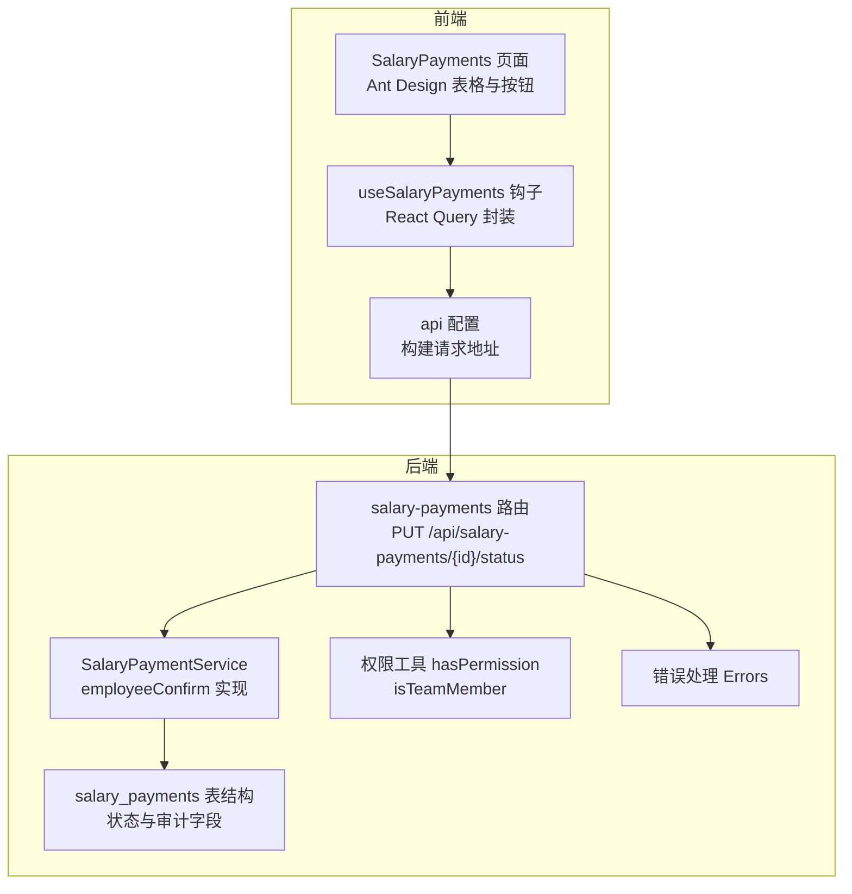
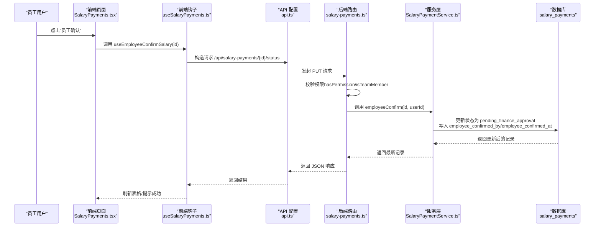
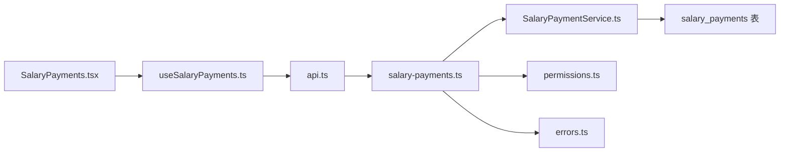

# 员工确认流程

<cite>
**本文引用的文件**
- [backend/src/routes/salary-payments.ts](file://backend/src/routes/salary-payments.ts)
- [backend/src/services/SalaryPaymentService.ts](file://backend/src/services/SalaryPaymentService.ts)
- [backend/src/db/schema.ts](file://backend/src/db/schema.ts)
- [backend/src/db/schema.sql](file://backend/src/db/schema.sql)
- [backend/src/utils/permissions.ts](file://backend/src/utils/permissions.ts)
- [backend/src/utils/errors.ts](file://backend/src/utils/errors.ts)
- [backend/src/index.ts](file://backend/src/index.ts)
- [frontend/src/features/hr/pages/SalaryPayments.tsx](file://frontend/src/features/hr/pages/SalaryPayments.tsx)
- [frontend/src/hooks/business/useSalaryPayments.ts](file://frontend/src/hooks/business/useSalaryPayments.ts)
- [frontend/src/config/api.ts](file://frontend/src/config/api.ts)
</cite>

## 目录
1. [简介](#简介)
2. [项目结构](#项目结构)
3. [核心组件](#核心组件)
4. [架构总览](#架构总览)
5. [详细组件分析](#详细组件分析)
6. [依赖关系分析](#依赖关系分析)
7. [性能考量](#性能考量)
8. [故障排查指南](#故障排查指南)
9. [结论](#结论)

## 简介
本文件面向“员工确认工资发放”流程，围绕后端 PUT /api/salary-payments/{id}/status 接口触发的状态流转展开，重点说明：
- 员工确认动作如何将状态从 pending_employee_confirmation 变更为 pending_finance_approval；
- employeeConfirm 服务方法的实现细节（状态更新、确认人与时间戳记录）；
- 前端交互模式（员工如何查看工资明细并进行确认操作）；
- 权限验证逻辑（确保只有相关员工或管理员可执行确认操作）；
- 成功确认与错误处理的响应示例（例如对已完成或已删除的工资记录进行确认时的行为）。

## 项目结构
本项目采用前后端分离架构，后端基于 Hono + Drizzle ORM，前端基于 React + Ant Design + TanStack Query。与“员工确认工资发放”直接相关的模块包括：
- 后端路由层：salary-payments 路由负责状态变更入口；
- 后端服务层：SalaryPaymentService 提供业务逻辑；
- 数据模型：salary_payments 表及关联字段；
- 前端页面：HR 薪资管理页面展示并触发确认；
- 前端钩子：useSalaryPayments 提供 API 调用封装；
- 权限与错误处理：权限工具与统一错误处理。

图表来源
- [backend/src/routes/salary-payments.ts](file://backend/src/routes/salary-payments.ts#L134-L196)
- [backend/src/services/SalaryPaymentService.ts](file://backend/src/services/SalaryPaymentService.ts#L240-L252)
- [backend/src/db/schema.ts](file://backend/src/db/schema.ts#L256-L276)
- [frontend/src/features/hr/pages/SalaryPayments.tsx](file://frontend/src/features/hr/pages/SalaryPayments.tsx#L341-L386)
- [frontend/src/hooks/business/useSalaryPayments.ts](file://frontend/src/hooks/business/useSalaryPayments.ts#L84-L94)
- [frontend/src/config/api.ts](file://frontend/src/config/api.ts#L107-L118)

章节来源
- [backend/src/routes/salary-payments.ts](file://backend/src/routes/salary-payments.ts#L134-L196)
- [backend/src/services/SalaryPaymentService.ts](file://backend/src/services/SalaryPaymentService.ts#L240-L252)
- [backend/src/db/schema.ts](file://backend/src/db/schema.ts#L256-L276)
- [frontend/src/features/hr/pages/SalaryPayments.tsx](file://frontend/src/features/hr/pages/SalaryPayments.tsx#L341-L386)
- [frontend/src/hooks/business/useSalaryPayments.ts](file://frontend/src/hooks/business/useSalaryPayments.ts#L84-L94)
- [frontend/src/config/api.ts](file://frontend/src/config/api.ts#L107-L118)

## 核心组件
- 后端路由：salary-payments 路由中定义了 PUT /api/salary-payments/{id}/status，并根据 body.status 分派到不同服务方法；其中 employee_confirmed 对应 employeeConfirm。
- 服务方法：employeeConfirm 执行状态更新、记录确认人与时间戳，并返回最新记录。
- 数据模型：salary_payments 表包含状态字段与审计字段（employee_confirmed_by、employee_confirmed_at 等），用于记录确认人的用户标识与确认时间。
- 前端页面：HR 薪资管理页面在状态为 pending_employee_confirmation 时显示“员工确认”按钮，点击后调用 useEmployeeConfirmSalary 钩子发起请求。
- 权限验证：路由层使用 hasPermission/isTeamMember 进行权限校验；同时后端在 GET /salary-payments/{id} 中预留了员工拥有者校验逻辑（注释提示）。

章节来源
- [backend/src/routes/salary-payments.ts](file://backend/src/routes/salary-payments.ts#L134-L196)
- [backend/src/services/SalaryPaymentService.ts](file://backend/src/services/SalaryPaymentService.ts#L240-L252)
- [backend/src/db/schema.ts](file://backend/src/db/schema.ts#L256-L276)
- [frontend/src/features/hr/pages/SalaryPayments.tsx](file://frontend/src/features/hr/pages/SalaryPayments.tsx#L341-L386)
- [frontend/src/hooks/business/useSalaryPayments.ts](file://frontend/src/hooks/business/useSalaryPayments.ts#L84-L94)

## 架构总览
下图展示了从员工点击确认到服务层更新状态的端到端流程。

图表来源
- [frontend/src/features/hr/pages/SalaryPayments.tsx](file://frontend/src/features/hr/pages/SalaryPayments.tsx#L341-L386)
- [frontend/src/hooks/business/useSalaryPayments.ts](file://frontend/src/hooks/business/useSalaryPayments.ts#L84-L94)
- [frontend/src/config/api.ts](file://frontend/src/config/api.ts#L107-L118)
- [backend/src/routes/salary-payments.ts](file://backend/src/routes/salary-payments.ts#L134-L196)
- [backend/src/services/SalaryPaymentService.ts](file://backend/src/services/SalaryPaymentService.ts#L240-L252)
- [backend/src/db/schema.ts](file://backend/src/db/schema.ts#L256-L276)

## 详细组件分析

### 后端路由：PUT /api/salary-payments/{id}/status
- 路由定义：接收 id 参数与 body.status，支持 employee_confirmed、finance_approved、paid 三种状态值。
- 权限控制：当 status 为 employee_confirmed 时，路由层不强制要求特定角色，但会读取当前用户 ID 并传递给服务层；其他状态需要 finance 模块的相应权限。
- 状态分派：根据 body.status 调用对应服务方法（employeeConfirm/financeApprove/paymentTransfer/paymentConfirm）。

章节来源
- [backend/src/routes/salary-payments.ts](file://backend/src/routes/salary-payments.ts#L134-L196)

### 服务层：employeeConfirm(id, userId)
- 功能：将记录状态更新为 pending_finance_approval，并记录 employee_confirmed_by 与 employee_confirmed_at 字段。
- 数据一致性：通过 this.get(id) 返回最新记录，保证前端拿到的是更新后的状态与审计信息。
- 注意：服务层未在此处做“仅本人可确认”的校验，权限与拥有者校验建议在路由层完成。

章节来源
- [backend/src/services/SalaryPaymentService.ts](file://backend/src/services/SalaryPaymentService.ts#L240-L252)

### 数据模型：salary_payments
- 关键字段：status、employee_confirmed_by、employee_confirmed_at 等，用于记录员工确认状态与审计信息。
- 状态枚举：包含 pending_employee_confirmation、pending_finance_approval、pending_payment、pending_payment_confirmation、completed 等。

章节来源
- [backend/src/db/schema.ts](file://backend/src/db/schema.ts#L256-L276)
- [backend/src/db/schema.sql](file://backend/src/db/schema.sql#L258-L295)

### 前端交互：员工确认按钮与调用链
- 页面逻辑：当某条记录状态为 pending_employee_confirmation 时，渲染“员工确认”按钮；点击后调用 useEmployeeConfirmSalary。
- 钩子实现：useEmployeeConfirmSalary 使用 mutationFn 调用 api.salaryPaymentsStatus(id) 的 POST 接口（注意：当前路由定义为 PUT，但前端钩子构造的是 POST，详见后续“错误处理与兼容性”部分）。
- 刷新策略：成功后通过 queryClient.invalidateQueries 刷新列表。

章节来源
- [frontend/src/features/hr/pages/SalaryPayments.tsx](file://frontend/src/features/hr/pages/SalaryPayments.tsx#L341-L386)
- [frontend/src/hooks/business/useSalaryPayments.ts](file://frontend/src/hooks/business/useSalaryPayments.ts#L84-L94)
- [frontend/src/config/api.ts](file://frontend/src/config/api.ts#L107-L118)

### 权限验证逻辑
- 路由层权限：hasPermission 与 isTeamMember 用于判断用户是否具备 finance/salary 模块的相应操作权限；对于非 employee_confirmed 状态，路由层会显式校验权限。
- 用户上下文：getUserId 获取当前用户 ID，employeeConfirm 会将其写入 employee_confirmed_by。
- 拥有者校验：在 GET /salary-payments/{id} 路由中预留了“用户是否拥有该记录”的校验逻辑（注释提示），建议在服务层或路由层完善以防止越权访问。

章节来源
- [backend/src/utils/permissions.ts](file://backend/src/utils/permissions.ts#L88-L114)
- [backend/src/routes/salary-payments.ts](file://backend/src/routes/salary-payments.ts#L114-L130)

### 失败与边界场景处理
- 已删除记录：删除接口仅允许删除处于 pending_employee_confirmation 的记录；对已完成或已删除记录进行确认不会生效（因为确认接口不接受已删除状态）。
- 已完成记录：若记录已处于 completed 状态，employee_confirm 流程不会改变其状态；finance_approve 会在服务层检查 allocationStatus 与 pendingAllocations，避免在未满足前提时推进。
- 错误响应：统一错误处理返回标准结构（包含错误码与消息），便于前端提示。

章节来源
- [backend/src/services/SalaryPaymentService.ts](file://backend/src/services/SalaryPaymentService.ts#L340-L352)
- [backend/src/utils/errors.ts](file://backend/src/utils/errors.ts#L34-L54)

## 依赖关系分析
- 路由依赖服务层：salary-payments 路由依赖 SalaryPaymentService 的 employeeConfirm 方法。
- 服务层依赖数据库：通过 Drizzle ORM 操作 salary_payments 表，更新状态与审计字段。
- 前端依赖后端 API：前端通过 api.ts 中的 salaryPaymentsStatus 构建请求，调用后端路由。
- 权限与错误处理：路由层依赖权限工具与错误处理模块。

图表来源
- [backend/src/routes/salary-payments.ts](file://backend/src/routes/salary-payments.ts#L134-L196)
- [backend/src/services/SalaryPaymentService.ts](file://backend/src/services/SalaryPaymentService.ts#L240-L252)
- [backend/src/db/schema.ts](file://backend/src/db/schema.ts#L256-L276)
- [frontend/src/features/hr/pages/SalaryPayments.tsx](file://frontend/src/features/hr/pages/SalaryPayments.tsx#L341-L386)
- [frontend/src/hooks/business/useSalaryPayments.ts](file://frontend/src/hooks/business/useSalaryPayments.ts#L84-L94)
- [frontend/src/config/api.ts](file://frontend/src/config/api.ts#L107-L118)
- [backend/src/utils/permissions.ts](file://backend/src/utils/permissions.ts#L88-L114)
- [backend/src/utils/errors.ts](file://backend/src/utils/errors.ts#L34-L54)

## 性能考量
- 事务与批量：生成薪资单时使用事务包裹，减少并发冲突风险；employeeConfirm 为单条记录更新，开销较小。
- 查询与排序：列表查询按年、月降序排列，有利于前端分页与展示；建议在高频查询上增加索引（如 year、month、status、employeeId）。
- 前端缓存：React Query 默认缓存策略可减少重复请求；确认成功后主动失效查询，确保状态及时同步。

[本节为通用建议，无需列出具体文件来源]

## 故障排查指南
- 员工确认按钮不可见
  - 检查记录状态是否为 pending_employee_confirmation；
  - 确认前端页面渲染逻辑与权限判断。
- 点击确认无响应
  - 检查 useEmployeeConfirmSalary 的 mutationFn 是否正确调用 api.salaryPaymentsStatus；
  - 确认后端路由是否接受该请求（当前路由定义为 PUT，前端构造为 POST，可能需要统一）。
- 权限不足
  - 确认用户是否具备 finance/salary 模块的相应权限；
  - 对于非 employee_confirmed 状态，路由层会进行权限校验。
- 状态未更新
  - 检查 employeeConfirm 是否被调用；
  - 确认数据库审计字段是否写入（employee_confirmed_by/employee_confirmed_at）。

章节来源
- [frontend/src/features/hr/pages/SalaryPayments.tsx](file://frontend/src/features/hr/pages/SalaryPayments.tsx#L341-L386)
- [frontend/src/hooks/business/useSalaryPayments.ts](file://frontend/src/hooks/business/useSalaryPayments.ts#L84-L94)
- [backend/src/routes/salary-payments.ts](file://backend/src/routes/salary-payments.ts#L134-L196)
- [backend/src/services/SalaryPaymentService.ts](file://backend/src/services/SalaryPaymentService.ts#L240-L252)

## 结论
- 员工确认流程通过 PUT /api/salary-payments/{id}/status 触发，将状态从 pending_employee_confirmation 变更为 pending_finance_approval；
- employeeConfirm 服务方法负责状态更新与审计字段记录，返回最新记录；
- 前端 HR 页面在合适状态下显示“员工确认”按钮并调用 useEmployeeConfirmSalary；
- 权限验证在路由层完成，建议在 GET /salary-payments/{id} 中完善“拥有者校验”；
- 对已完成或已删除的记录进行确认不会生效，错误处理返回标准结构，便于前端提示。