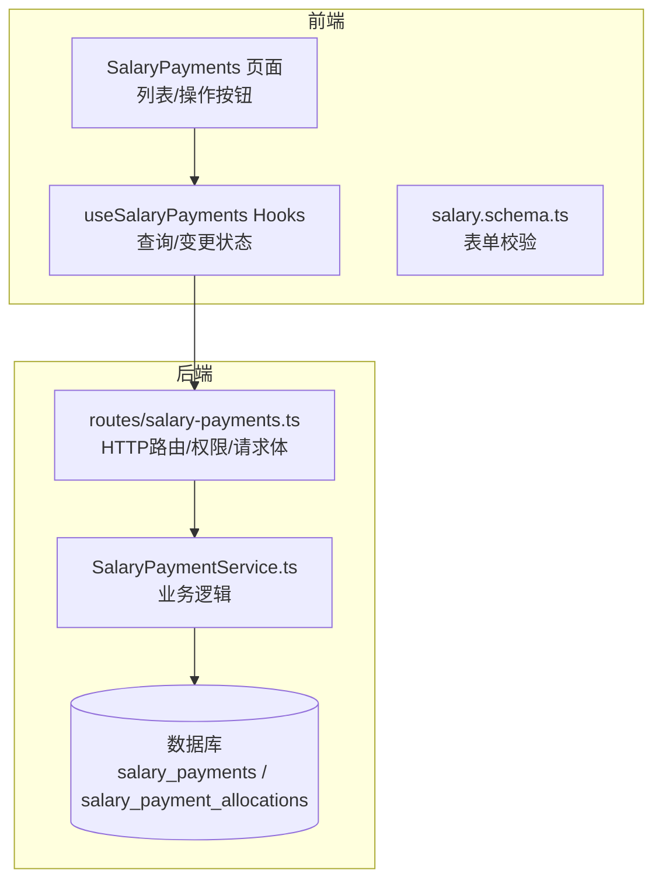
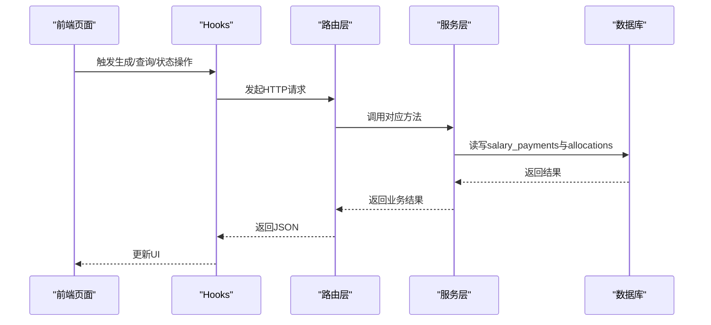
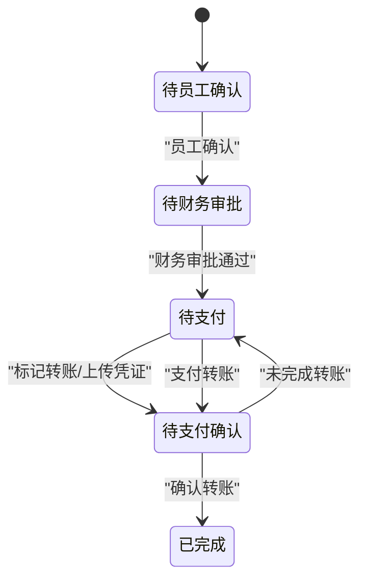
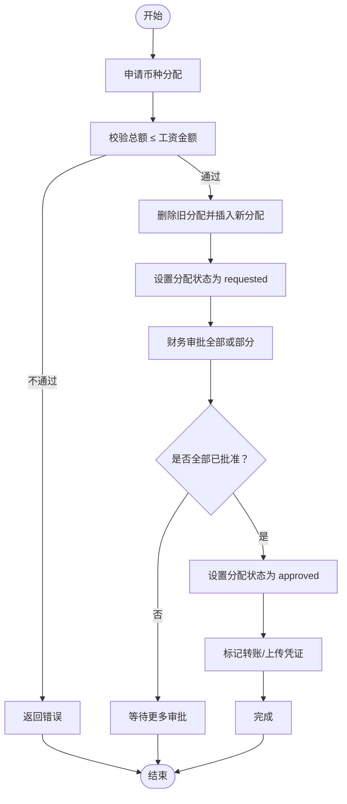
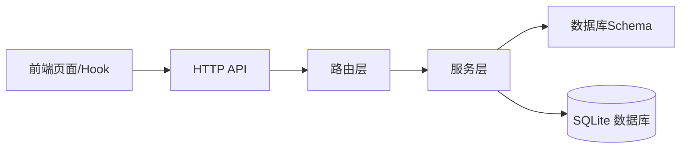
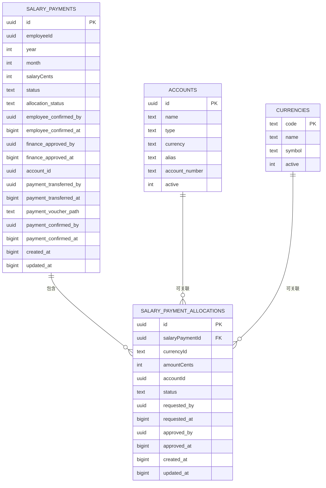

# 工资发放

<cite>
**本文引用的文件**
- [backend/src/routes/salary-payments.ts](file://backend/src/routes/salary-payments.ts)
- [backend/src/services/SalaryPaymentService.ts](file://backend/src/services/SalaryPaymentService.ts)
- [backend/src/db/schema.ts](file://backend/src/db/schema.ts)
- [backend/src/schemas/business.schema.ts](file://backend/src/schemas/business.schema.ts)
- [frontend/src/features/hr/pages/SalaryPayments.tsx](file://frontend/src/features/hr/pages/SalaryPayments.tsx)
- [frontend/src/hooks/business/useSalaryPayments.ts](file://frontend/src/hooks/business/useSalaryPayments.ts)
- [frontend/src/validations/salary.schema.ts](file://frontend/src/validations/salary.schema.ts)
- [backend/test/routes/salary-payments.test.ts](file://backend/test/routes/salary-payments.test.ts)
- [backend/test/services/SalaryPaymentService.test.ts](file://backend/test/services/SalaryPaymentService.test.ts)
</cite>

## 目录
1. [简介](#简介)
2. [项目结构](#项目结构)
3. [核心组件](#核心组件)
4. [架构总览](#架构总览)
5. [详细组件分析](#详细组件分析)
6. [依赖关系分析](#依赖关系分析)
7. [性能考量](#性能考量)
8. [故障排查指南](#故障排查指南)
9. [结论](#结论)
10. [附录](#附录)

## 简介
本文件面向“工资发放”业务，系统性梳理后端API与前端交互，覆盖以下关键内容：
- 创建工资发放记录的接口与字段说明
- 工资发放的状态机流转：待员工确认 → 待财务审批 → 待支付 → 待支付确认 → 已完成
- 多币种与多账户的工资分配机制
- 查询与展示：GET /api/salary-payments 支持按年、月、状态、员工筛选
- 完整流程示例：生成、员工确认、财务审批、转账标记、凭证确认
- 特殊场景：工资调整与补发的处理建议

## 项目结构
围绕工资发放的核心模块分布如下：
- 后端路由层：定义HTTP接口、权限校验、请求体与响应体的OpenAPI Schema
- 服务层：实现业务逻辑（生成、状态推进、分配、转账、确认、删除）
- 数据层：Drizzle ORM映射SQLite表结构（工资单、分配明细、员工、账户、币种等）
- 前端页面与Hooks：提供生成、查询、状态操作、分配审批、转账确认等UI与调用

图表来源
- [backend/src/routes/salary-payments.ts](file://backend/src/routes/salary-payments.ts#L1-L313)
- [backend/src/services/SalaryPaymentService.ts](file://backend/src/services/SalaryPaymentService.ts#L1-L453)
- [backend/src/db/schema.ts](file://backend/src/db/schema.ts#L256-L291)
- [frontend/src/features/hr/pages/SalaryPayments.tsx](file://frontend/src/features/hr/pages/SalaryPayments.tsx#L1-L690)
- [frontend/src/hooks/business/useSalaryPayments.ts](file://frontend/src/hooks/business/useSalaryPayments.ts#L1-L155)
- [frontend/src/validations/salary.schema.ts](file://frontend/src/validations/salary.schema.ts#L1-L23)

章节来源
- [backend/src/routes/salary-payments.ts](file://backend/src/routes/salary-payments.ts#L1-L313)
- [backend/src/services/SalaryPaymentService.ts](file://backend/src/services/SalaryPaymentService.ts#L1-L453)
- [backend/src/db/schema.ts](file://backend/src/db/schema.ts#L256-L291)
- [frontend/src/features/hr/pages/SalaryPayments.tsx](file://frontend/src/features/hr/pages/SalaryPayments.tsx#L1-L690)
- [frontend/src/hooks/business/useSalaryPayments.ts](file://frontend/src/hooks/business/useSalaryPayments.ts#L1-L155)
- [frontend/src/validations/salary.schema.ts](file://frontend/src/validations/salary.schema.ts#L1-L23)

## 核心组件
- 路由与权限
  - GET /api/salary-payments：分页查询，支持year、month、status、employeeId过滤
  - POST /api/salary-payments/generate：批量生成当月工资单
  - PUT /api/salary-payments/{id}/status：推进状态（员工确认、财务审批、支付）
  - POST /api/salary-payments/{id}/allocations：申请币种分配
  - PUT /api/salary-payments/{id}/allocations/status：审批/拒绝币种分配
  - DELETE /api/salary-payments/{id}：删除未生效的工资单
- 服务层
  - generate：计算应发金额、扣减请假天数、插入工资单并初始化状态
  - employeeConfirm / financeApprove / paymentTransfer / paymentConfirm：状态推进
  - requestAllocation / approveAllocation / rejectAllocation：币种分配生命周期
  - list / get：查询与详情
- 数据模型
  - salary_payments：主表，含员工、年、月、金额、状态、分配状态、各环节经办人时间戳
  - salary_payment_allocations：分配明细，含币种、金额、账户、状态、经办人时间戳
  - accounts / currencies：账户与币种基础数据

章节来源
- [backend/src/routes/salary-payments.ts](file://backend/src/routes/salary-payments.ts#L1-L313)
- [backend/src/services/SalaryPaymentService.ts](file://backend/src/services/SalaryPaymentService.ts#L1-L453)
- [backend/src/db/schema.ts](file://backend/src/db/schema.ts#L256-L291)

## 架构总览
下图展示从前端到后端再到数据库的整体调用链路与状态机：

图表来源
- [backend/src/routes/salary-payments.ts](file://backend/src/routes/salary-payments.ts#L1-L313)
- [backend/src/services/SalaryPaymentService.ts](file://backend/src/services/SalaryPaymentService.ts#L1-L453)
- [frontend/src/features/hr/pages/SalaryPayments.tsx](file://frontend/src/features/hr/pages/SalaryPayments.tsx#L1-L690)
- [frontend/src/hooks/business/useSalaryPayments.ts](file://frontend/src/hooks/business/useSalaryPayments.ts#L1-L155)

## 详细组件分析

### 1) 接口与字段说明
- 生成工资单（POST /api/salary-payments/generate）
  - 请求体字段：year（整数）、month（整数）
  - 行为：扫描有效员工、过滤已存在记录、批量计算应发金额（考虑入职当月工作日与请假扣减）、插入工资单并初始化状态为“待员工确认”
- 查询工资单（GET /api/salary-payments）
  - 查询参数：year、month、status、employeeId
  - 返回：每条记录包含员工姓名、部门名称、分配明细等
- 状态推进（PUT /api/salary-payments/{id}/status）
  - 支持状态：employee_confirmed（员工确认）、finance_approved（财务审批）、paid（支付）
  - paid时支持两种路径：
    - 提供凭证路径（payment_voucher_path）
    - 指定账户ID（accountId）进行转账标记
- 币种分配（POST /api/salary-payments/{id}/allocations）
  - 请求体：allocations 数组，元素包含 currencyId（3位币种代码）、amountCents、accountId（可选）
  - 行为：校验总额不超过工资金额，删除旧分配，插入新分配，设置分配状态为“requested”
- 分配审批（PUT /api/salary-payments/{id}/allocations/status）
  - 支持 approve/reject
  - approve时可全批或指定分配ID
  - reject时必须提供分配ID列表

章节来源
- [backend/src/routes/salary-payments.ts](file://backend/src/routes/salary-payments.ts#L1-L313)
- [backend/src/schemas/business.schema.ts](file://backend/src/schemas/business.schema.ts#L395-L462)
- [backend/src/services/SalaryPaymentService.ts](file://backend/src/services/SalaryPaymentService.ts#L1-L453)

### 2) 工资发放状态机
状态流转如下：
- pending_employee_confirmation（待员工确认）
- pending_finance_approval（待财务审批）
- pending_payment（待支付）
- pending_payment_confirmation（待支付确认）
- completed（已完成）

图表来源
- [backend/src/services/SalaryPaymentService.ts](file://backend/src/services/SalaryPaymentService.ts#L240-L338)
- [backend/src/routes/salary-payments.ts](file://backend/src/routes/salary-payments.ts#L135-L196)

章节来源
- [backend/src/services/SalaryPaymentService.ts](file://backend/src/services/SalaryPaymentService.ts#L240-L338)
- [backend/src/routes/salary-payments.ts](file://backend/src/routes/salary-payments.ts#L135-L196)

### 3) 工资分配（多币种/多账户）机制
- 申请分配
  - 仅当工资单处于“待员工确认”或“待财务审批”且分配状态为“pending/requested”时允许申请
  - 申请时会删除旧分配并插入新分配
  - 分配金额之和不得超过工资金额
- 审批分配
  - 财务审批通过后，若所有分配均为“approved”，则将工资单分配状态置为“approved”
  - 若存在未审批项，则需全部审批完成后才可进入“待支付”
- 支付转账
  - 当分配状态为“approved”时，可选择账户进行转账标记
  - 转账后进入“待支付确认”，等待凭证上传或确认

图表来源
- [backend/src/services/SalaryPaymentService.ts](file://backend/src/services/SalaryPaymentService.ts#L354-L451)
- [backend/src/routes/salary-payments.ts](file://backend/src/routes/salary-payments.ts#L198-L284)

章节来源
- [backend/src/services/SalaryPaymentService.ts](file://backend/src/services/SalaryPaymentService.ts#L354-L451)
- [backend/src/routes/salary-payments.ts](file://backend/src/routes/salary-payments.ts#L198-L284)

### 4) 查询与展示（GET /api/salary-payments）
- 支持过滤条件：year、month、status、employeeId
- 返回字段包含：工资单基本信息、员工姓名、部门名称、分配明细
- 前端页面根据状态渲染颜色与操作按钮，支持凭证预览

章节来源
- [backend/src/routes/salary-payments.ts](file://backend/src/routes/salary-payments.ts#L16-L47)
- [backend/src/services/SalaryPaymentService.ts](file://backend/src/services/SalaryPaymentService.ts#L169-L212)
- [frontend/src/features/hr/pages/SalaryPayments.tsx](file://frontend/src/features/hr/pages/SalaryPayments.tsx#L1-L690)

### 5) 完整流程示例

- 场景一：常规发放
  1) 生成工资单：POST /api/salary-payments/generate（year, month）
  2) 员工确认：PUT /api/salary-payments/{id}/status（status=employee_confirmed）
  3) 财务审批：PUT /api/salary-payments/{id}/status（status=finance_approved）
  4) 标记转账：PUT /api/salary-payments/{id}/status（status=paid，accountId）
  5) 凭证确认：PUT /api/salary-payments/{id}/status（status=paid，payment_voucher_path）

- 场景二：多币种分配
  1) 申请分配：POST /api/salary-payments/{id}/allocations（allocations）
  2) 财务审批：PUT /api/salary-payments/{id}/allocations/status（approve_all=true）
  3) 标记转账：PUT /api/salary-payments/{id}/status（status=paid，accountId）
  4) 凭证确认：PUT /api/salary-payments/{id}/status（status=paid，payment_voucher_path）

- 场景三：补发/调整
  - 重新生成工资单（或删除旧记录后重新生成），确保新金额与分配方案正确
  - 如需调整分配，重复“申请分配 → 审批 → 支付”的流程

章节来源
- [backend/src/routes/salary-payments.ts](file://backend/src/routes/salary-payments.ts#L135-L196)
- [backend/src/services/SalaryPaymentService.ts](file://backend/src/services/SalaryPaymentService.ts#L14-L167)
- [backend/test/routes/salary-payments.test.ts](file://backend/test/routes/salary-payments.test.ts#L73-L156)
- [backend/test/services/SalaryPaymentService.test.ts](file://backend/test/services/SalaryPaymentService.test.ts#L50-L103)

## 依赖关系分析
- 路由层依赖服务层提供的方法，负责权限校验与请求体Schema校验
- 服务层依赖Drizzle ORM访问salary_payments与salary_payment_allocations表
- 前端通过Hooks封装HTTP请求，统一处理查询与状态变更

图表来源
- [backend/src/routes/salary-payments.ts](file://backend/src/routes/salary-payments.ts#L1-L313)
- [backend/src/services/SalaryPaymentService.ts](file://backend/src/services/SalaryPaymentService.ts#L1-L453)
- [backend/src/db/schema.ts](file://backend/src/db/schema.ts#L256-L291)
- [frontend/src/hooks/business/useSalaryPayments.ts](file://frontend/src/hooks/business/useSalaryPayments.ts#L1-L155)

章节来源
- [backend/src/routes/salary-payments.ts](file://backend/src/routes/salary-payments.ts#L1-L313)
- [backend/src/services/SalaryPaymentService.ts](file://backend/src/services/SalaryPaymentService.ts#L1-L453)
- [backend/src/db/schema.ts](file://backend/src/db/schema.ts#L256-L291)
- [frontend/src/hooks/business/useSalaryPayments.ts](file://frontend/src/hooks/business/useSalaryPayments.ts#L1-L155)

## 性能考量
- 生成工资单涉及多表联查与批量插入，建议在月末批量执行并控制并发
- 查询接口支持多条件过滤，建议对常用查询字段建立索引（如year、month、status、employeeId）
- 分配审批采用事务，避免中间态数据不一致
- 前端查询使用React Query缓存，减少重复请求

## 故障排查指南
- 权限不足
  - 财务审批/分配审批/转账确认/删除等接口均有限制，需确保当前用户具备相应权限
- 状态前置条件
  - 财务审批前必须完成“员工确认”
  - 支付前必须完成“分配审批”（分配状态为“approved”）
- 参数校验
  - 申请分配时，总金额不得超出工资金额
  - 支付时必须提供凭证路径或账户ID
- 删除限制
  - 仅“待员工确认”状态的工资单可删除

章节来源
- [backend/src/routes/salary-payments.ts](file://backend/src/routes/salary-payments.ts#L135-L196)
- [backend/src/services/SalaryPaymentService.ts](file://backend/src/services/SalaryPaymentService.ts#L254-L338)

## 结论
本系统通过清晰的API边界与严谨的服务层逻辑，实现了从生成、确认、审批、分配到支付的完整闭环。多币种与多账户的分配机制满足国际化与多样化支付需求，前端页面直观呈现状态与操作入口，配合严格的权限与状态前置校验，保障了业务的合规与稳定。

## 附录

### A. 字段与Schema参考
- 生成工资单请求体
  - year：整数，范围2000-2100
  - month：整数，范围1-12
- 申请币种分配请求体
  - allocations：数组
    - currencyId：3位币种代码
    - amountCents：正整数
    - accountId：可选，账户ID
- 支付状态推进请求体
  - status：枚举（employee_confirmed、finance_approved、paid）
  - payment_voucher_path：可选，凭证URL
  - accountId：可选，账户ID

章节来源
- [backend/src/schemas/business.schema.ts](file://backend/src/schemas/business.schema.ts#L395-L462)
- [backend/src/routes/salary-payments.ts](file://backend/src/routes/salary-payments.ts#L135-L196)

### B. 数据模型概览

图表来源
- [backend/src/db/schema.ts](file://backend/src/db/schema.ts#L256-L291)
- [backend/src/db/schema.ts](file://backend/src/db/schema.ts#L146-L156)
- [backend/src/db/schema.ts](file://backend/src/db/schema.ts#L195-L200)