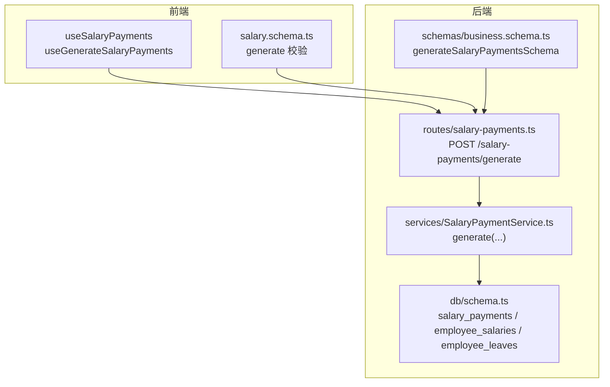
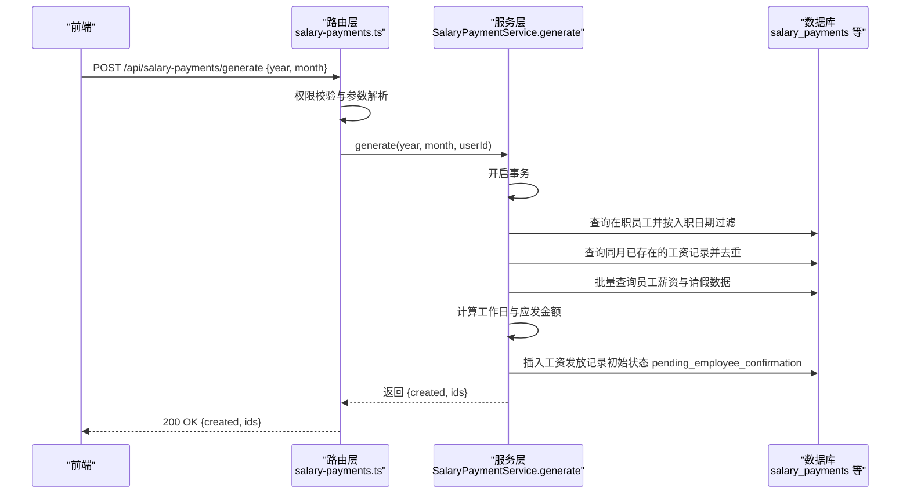
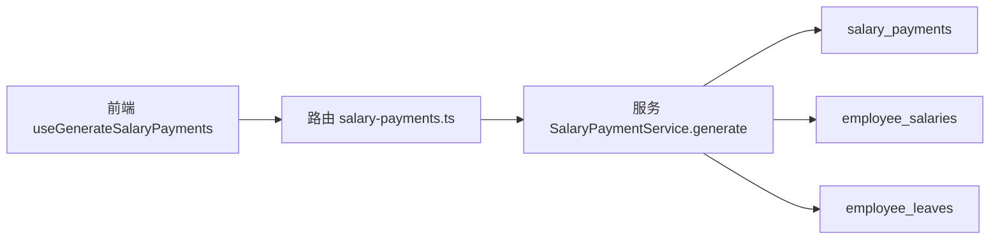
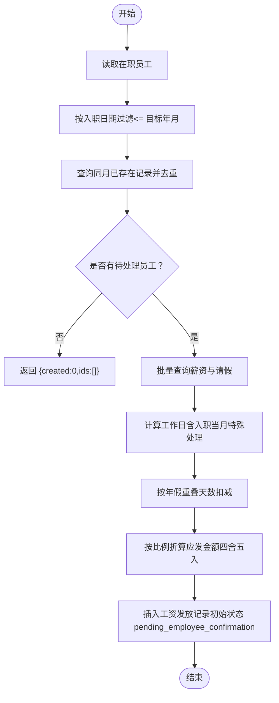

# 工资发放生成

<cite>
**本文引用的文件**
- [backend/src/routes/salary-payments.ts](file://backend/src/routes/salary-payments.ts)
- [backend/src/services/SalaryPaymentService.ts](file://backend/src/services/SalaryPaymentService.ts)
- [backend/src/db/schema.ts](file://backend/src/db/schema.ts)
- [backend/src/schemas/business.schema.ts](file://backend/src/schemas/business.schema.ts)
- [backend/test/routes/salary-payments.test.ts](file://backend/test/routes/salary-payments.test.ts)
- [backend/test/services/SalaryPaymentService.test.ts](file://backend/test/services/SalaryPaymentService.test.ts)
- [frontend/src/hooks/business/useSalaryPayments.ts](file://frontend/src/hooks/business/useSalaryPayments.ts)
- [frontend/src/validations/salary.schema.ts](file://frontend/src/validations/salary.schema.ts)
</cite>

## 目录
1. [简介](#简介)
2. [项目结构](#项目结构)
3. [核心组件](#核心组件)
4. [架构总览](#架构总览)
5. [详细组件分析](#详细组件分析)
6. [依赖关系分析](#依赖关系分析)
7. [性能考量](#性能考量)
8. [故障排查指南](#故障排查指南)
9. [结论](#结论)
10. [附录](#附录)

## 简介
本文件面向“工资发放生成”功能，围绕 POST /api/salary-payments/generate 接口，系统性阐述如何批量生成指定年月的工资发放记录。内容涵盖：
- 生成逻辑：筛选符合条件的在职员工、排除已存在的工资记录、批量获取员工薪资与请假数据、计算实际应发工资（考虑入职日期与请假天数）
- 事务处理机制：确保生成过程的数据一致性
- 请求参数与示例：year、month 的使用
- 生成后状态流转：初始状态为 pending_employee_confirmation，等待员工确认
- 错误处理场景：如重复生成相同月份工资的处理方式

## 项目结构
该功能由后端路由层、服务层与数据库模式共同实现，前端提供调用与校验。

图表来源
- [backend/src/routes/salary-payments.ts](file://backend/src/routes/salary-payments.ts#L50-L87)
- [backend/src/services/SalaryPaymentService.ts](file://backend/src/services/SalaryPaymentService.ts#L14-L167)
- [backend/src/schemas/business.schema.ts](file://backend/src/schemas/business.schema.ts#L392-L407)
- [backend/src/db/schema.ts](file://backend/src/db/schema.ts#L256-L276)

章节来源
- [backend/src/routes/salary-payments.ts](file://backend/src/routes/salary-payments.ts#L50-L87)
- [backend/src/services/SalaryPaymentService.ts](file://backend/src/services/SalaryPaymentService.ts#L14-L167)
- [backend/src/db/schema.ts](file://backend/src/db/schema.ts#L256-L276)
- [backend/src/schemas/business.schema.ts](file://backend/src/schemas/business.schema.ts#L392-L407)
- [frontend/src/hooks/business/useSalaryPayments.ts](file://frontend/src/hooks/business/useSalaryPayments.ts#L71-L82)
- [frontend/src/validations/salary.schema.ts](file://frontend/src/validations/salary.schema.ts#L1-L6)

## 核心组件
- 路由层：定义 /api/salary-payments/generate 接口，负责权限校验、参数解析与调用服务层
- 服务层：实现生成逻辑，包含事务控制、数据筛选、批量查询、计算与插入
- 数据库模式：salary_payments、employee_salaries、employee_leaves 等表结构
- 前端：提供生成请求的调用与参数校验

章节来源
- [backend/src/routes/salary-payments.ts](file://backend/src/routes/salary-payments.ts#L50-L87)
- [backend/src/services/SalaryPaymentService.ts](file://backend/src/services/SalaryPaymentService.ts#L14-L167)
- [backend/src/db/schema.ts](file://backend/src/db/schema.ts#L256-L276)
- [frontend/src/hooks/business/useSalaryPayments.ts](file://frontend/src/hooks/business/useSalaryPayments.ts#L71-L82)

## 架构总览
生成流程从路由进入，经服务层执行事务，最终写入工资发放表。前端负责发起请求并进行参数校验。

图表来源
- [backend/src/routes/salary-payments.ts](file://backend/src/routes/salary-payments.ts#L50-L87)
- [backend/src/services/SalaryPaymentService.ts](file://backend/src/services/SalaryPaymentService.ts#L14-L167)

## 详细组件分析

### 路由层：POST /api/salary-payments/generate
- 职责
  - 定义接口与请求体 schema（year、month）
  - 权限校验（finance.salary.create）
  - 参数解析与调用服务层 generate
  - 返回生成结果（created 数量与记录 id 列表）

- 关键点
  - 使用 OpenAPI 路由定义与 zod 校验 generateSalaryPaymentsSchema
  - 调用 c.get('services').salaryPayment.generate 并返回结果

章节来源
- [backend/src/routes/salary-payments.ts](file://backend/src/routes/salary-payments.ts#L50-L87)
- [backend/src/schemas/business.schema.ts](file://backend/src/schemas/business.schema.ts#L392-L407)

### 服务层：SalaryPaymentService.generate
- 事务处理
  - 使用数据库事务包裹整个生成流程，保证原子性与一致性

- 员工筛选
  - 获取 active=1 的员工
  - 过滤条件：入职日期不得晚于目标年月（即允许当月入职）

- 去重处理
  - 查询同月已存在的工资记录，基于 employeeId/year/month 去重

- 批量数据获取
  - 批量查询员工薪资（支持多币种，优先 USDT，否则按币种排序取第一条）
  - 批量查询当月已批准的请假记录（overlap 计算）

- 实际应发计算
  - 计算工作日：当月总天数；若入职当月，则按入职日到月底天数
  - 请假扣减：仅对年假进行扣减，计算 overlap 天数
  - 应发金额：按比例折算（四舍五入）

- 插入记录
  - 写入 salary_payments，初始状态为 pending_employee_confirmation，allocationStatus 为 pending

- 返回值
  - { created, ids }：本次生成的记录数量与 id 列表

章节来源
- [backend/src/services/SalaryPaymentService.ts](file://backend/src/services/SalaryPaymentService.ts#L14-L167)
- [backend/src/db/schema.ts](file://backend/src/db/schema.ts#L256-L276)

### 数据模型：salary_payments 与关联表
- salary_payments 字段要点
  - year、month：年月维度
  - salaryCents：应发金额（分）
  - status：当前状态（生成时为 pending_employee_confirmation）
  - allocationStatus：分配状态（生成时为 pending）

- 关联表
  - salaryPaymentAllocations：记录分配详情（币种、金额、账户等）
  - employeeSalaries：员工薪资配置（多币种）
  - employeeLeaves：员工请假记录（审批通过且与当月有重叠）

章节来源
- [backend/src/db/schema.ts](file://backend/src/db/schema.ts#L256-L276)
- [backend/src/db/schema.ts](file://backend/src/db/schema.ts#L278-L291)

### 前端集成与参数校验
- 调用
  - useGenerateSalaryPayments 钩子封装 POST /salary-payments/generate
- 参数校验
  - year：2000-2100
  - month：1-12

章节来源
- [frontend/src/hooks/business/useSalaryPayments.ts](file://frontend/src/hooks/business/useSalaryPayments.ts#L71-L82)
- [frontend/src/validations/salary.schema.ts](file://frontend/src/validations/salary.schema.ts#L1-L6)

### 生成请求示例
- 方法与路径
  - POST /api/salary-payments/generate
- 请求体字段
  - year：整数，范围 2000-2100
  - month：整数，范围 1-12
- 成功响应
  - { created: number, ids: string[] }

章节来源
- [backend/src/routes/salary-payments.ts](file://backend/src/routes/salary-payments.ts#L50-L87)
- [backend/src/schemas/business.schema.ts](file://backend/src/schemas/business.schema.ts#L392-L407)
- [frontend/src/validations/salary.schema.ts](file://frontend/src/validations/salary.schema.ts#L1-L6)

### 生成后状态流转
- 初始状态
  - pending_employee_confirmation：等待员工确认
- 后续状态（非本文重点，但与生成状态相关）
  - pending_finance_approval：员工确认后进入财务审批
  - pending_payment / pending_payment_confirmation：财务审批后进入支付流程
  - completed：支付凭证确认后完成

章节来源
- [backend/src/services/SalaryPaymentService.ts](file://backend/src/services/SalaryPaymentService.ts#L149-L160)

### 错误处理场景
- 重复生成相同月份工资
  - 服务层会先查询同月已存在记录并去重，若无待处理员工则直接返回 { created: 0, ids: [] }
- 其他常见错误
  - 权限不足：路由层在权限校验失败时抛出禁止访问
  - 删除限制：仅允许删除处于 pending_employee_confirmation 的记录
  - 支付流程前置校验：财务审批前要求分配状态已批准且所有分配均已审批

章节来源
- [backend/src/services/SalaryPaymentService.ts](file://backend/src/services/SalaryPaymentService.ts#L340-L352)
- [backend/src/routes/salary-payments.ts](file://backend/src/routes/salary-payments.ts#L50-L87)

## 依赖关系分析
- 路由依赖服务层：salary-payments.ts 依赖 c.get('services').salaryPayment.generate
- 服务层依赖数据库模式：SalaryPaymentService 操作 salary_payments、employee_salaries、employee_leaves 等
- 前端依赖路由与校验：useGenerateSalaryPayments 与 salary.schema.ts

图表来源
- [backend/src/routes/salary-payments.ts](file://backend/src/routes/salary-payments.ts#L50-L87)
- [backend/src/services/SalaryPaymentService.ts](file://backend/src/services/SalaryPaymentService.ts#L14-L167)
- [backend/src/db/schema.ts](file://backend/src/db/schema.ts#L256-L276)

## 性能考量
- 批量查询优化
  - 对员工薪资与请假采用 inArray 批量查询，减少多次往返
- 分组与去重
  - 使用 Map 与 Set 快速分组与去重，避免循环内重复计算
- 事务边界
  - 将筛选、查询、计算、插入置于同一事务中，降低并发冲突风险
- 可扩展建议
  - 若员工规模增长，可考虑分页批量处理或索引优化（year、month、employeeId 上建立合适索引）

## 故障排查指南
- 生成结果为空
  - 检查是否存在满足入职日期条件的在职员工
  - 检查是否已有同月同员工的工资记录
- 金额异常
  - 确认员工薪资配置（多币种优先级与排序）
  - 确认请假 overlap 计算是否覆盖当月
- 权限问题
  - 确认调用方具备 finance.salary.create 权限
- 删除失败
  - 仅允许删除处于 pending_employee_confirmation 的记录

章节来源
- [backend/src/services/SalaryPaymentService.ts](file://backend/src/services/SalaryPaymentService.ts#L14-L167)
- [backend/src/services/SalaryPaymentService.ts](file://backend/src/services/SalaryPaymentService.ts#L340-L352)
- [backend/src/routes/salary-payments.ts](file://backend/src/routes/salary-payments.ts#L50-L87)

## 结论
POST /api/salary-payments/generate 提供了高效、一致的批量工资生成能力。通过严格的入职日期过滤、请假扣减与多币种薪资处理，结合数据库事务保障，确保生成结果准确可靠。生成后的记录初始状态为 pending_employee_confirmation，后续由员工与财务流程推进至完成。

## 附录

### 生成逻辑流程图

图表来源
- [backend/src/services/SalaryPaymentService.ts](file://backend/src/services/SalaryPaymentService.ts#L14-L167)