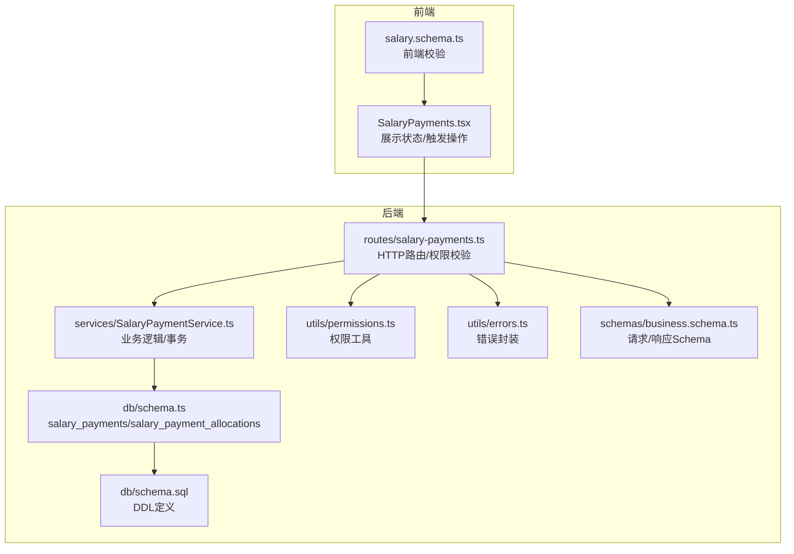
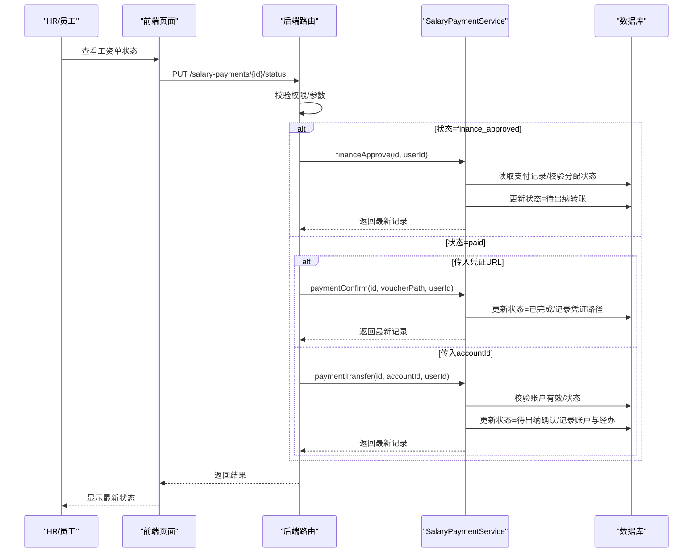
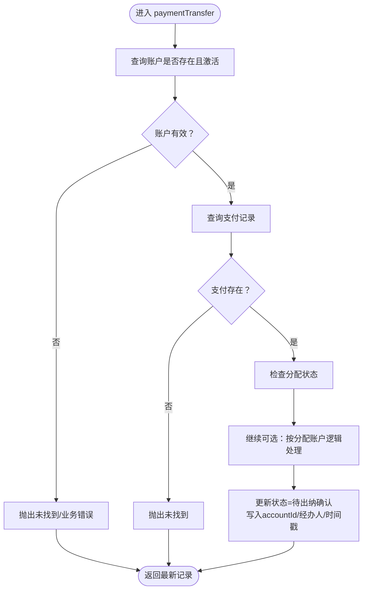
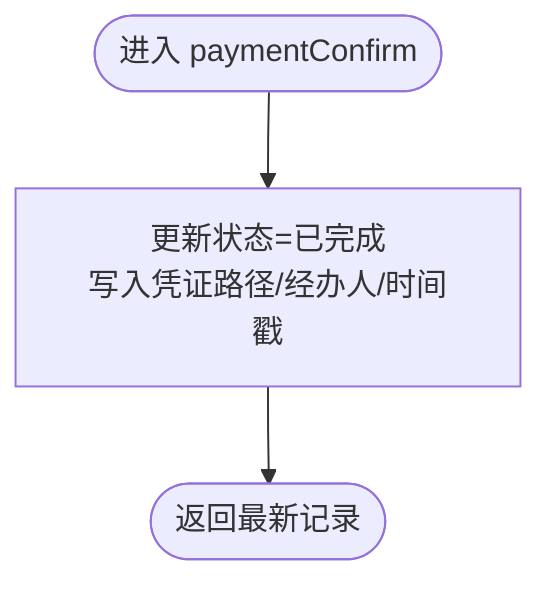
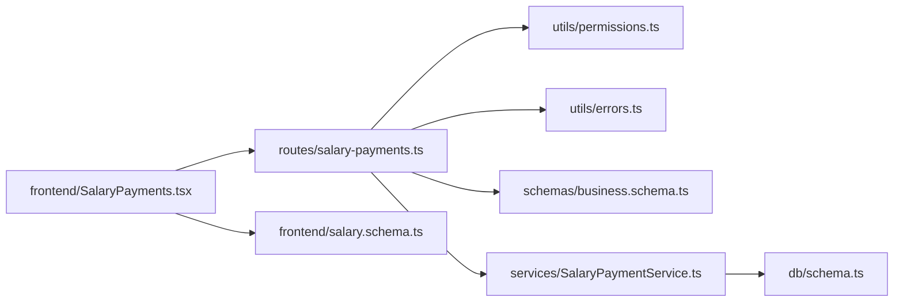

# 工资支付执行

<cite>
**本文引用的文件**
- [SalaryPaymentService.ts](file://backend/src/services/SalaryPaymentService.ts)
- [salary-payments.ts](file://backend/src/routes/salary-payments.ts)
- [business.schema.ts](file://backend/src/schemas/business.schema.ts)
- [permissions.ts](file://backend/src/utils/permissions.ts)
- [errors.ts](file://backend/src/utils/errors.ts)
- [schema.ts](file://backend/src/db/schema.ts)
- [schema.sql](file://backend/src/db/schema.sql)
- [SalaryPayments.tsx](file://frontend/src/features/hr/pages/SalaryPayments.tsx)
- [salary.schema.ts](file://frontend/src/validations/salary.schema.ts)
</cite>

## 目录
1. [简介](#简介)
2. [项目结构](#项目结构)
3. [核心组件](#核心组件)
4. [架构总览](#架构总览)
5. [详细组件分析](#详细组件分析)
6. [依赖关系分析](#依赖关系分析)
7. [性能考量](#性能考量)
8. [故障排查指南](#故障排查指南)
9. [结论](#结论)
10. [附录](#附录)

## 简介
本文件面向财务与HR流程执行者，系统性说明“工资支付执行”的完整流程，重点围绕两条关键服务方法：
- paymentTransfer：用于通过指定账户执行支付转账，将支付状态推进至“待出纳确认”。
- paymentConfirm：用于通过上传凭证路径完成支付确认，将状态最终更新为“已完成”。

文档同时覆盖权限要求、安全校验（账户状态、凭证路径）、错误处理策略与回滚考虑，并提供从财务审批完成到最终支付确认的完整API调用序列示例。

## 项目结构
后端采用分层设计：
- 路由层：salary-payments.ts 定义HTTP接口与权限校验。
- 服务层：SalaryPaymentService.ts 实现业务逻辑（状态推进、校验、事务）。
- 数据层：schema.ts/schema.sql 定义表结构与字段。
- 前端：SalaryPayments.tsx 展示状态与触发操作；salary.schema.ts 提供前端校验。

图表来源
- [salary-payments.ts](file://backend/src/routes/salary-payments.ts#L1-L313)
- [SalaryPaymentService.ts](file://backend/src/services/SalaryPaymentService.ts#L1-L453)
- [schema.ts](file://backend/src/db/schema.ts#L256-L291)
- [schema.sql](file://backend/src/db/schema.sql#L258-L295)
- [permissions.ts](file://backend/src/utils/permissions.ts#L80-L114)
- [errors.ts](file://backend/src/utils/errors.ts#L34-L54)
- [business.schema.ts](file://backend/src/schemas/business.schema.ts#L683-L690)
- [SalaryPayments.tsx](file://frontend/src/features/hr/pages/SalaryPayments.tsx#L18-L40)
- [salary.schema.ts](file://frontend/src/validations/salary.schema.ts#L1-L22)

章节来源
- [salary-payments.ts](file://backend/src/routes/salary-payments.ts#L1-L313)
- [SalaryPaymentService.ts](file://backend/src/services/SalaryPaymentService.ts#L1-L453)
- [schema.ts](file://backend/src/db/schema.ts#L256-L291)
- [schema.sql](file://backend/src/db/schema.sql#L258-L295)
- [SalaryPayments.tsx](file://frontend/src/features/hr/pages/SalaryPayments.tsx#L18-L40)
- [salary.schema.ts](file://frontend/src/validations/salary.schema.ts#L1-L22)

## 核心组件
- 路由层（salary-payments.ts）
  - 提供统一的状态更新入口：/salary-payments/{id}/status
  - 根据请求体中的 status 字段分派到不同服务方法：
    - employee_confirmed → employeeConfirm
    - finance_approved → financeApprove
    - paid → paymentTransfer 或 paymentConfirm（二选一）
  - 对 finance_approved/paid 场景进行权限校验与参数校验。

- 服务层（SalaryPaymentService.ts）
  - paymentTransfer：校验账户有效性与状态，推进状态至“待出纳确认”，记录经办人与时间戳。
  - paymentConfirm：校验凭证路径并推进状态至“已完成”，记录经办人与时间戳。
  - 其他相关方法：employeeConfirm、financeApprove、requestAllocation、approveAllocation、rejectAllocation、delete 等。

- 数据层（schema.ts/schema.sql）
  - salary_payments：存储工资支付主记录与状态机字段。
  - salary_payment_allocations：存储币种分配明细与状态。

- 前端（SalaryPayments.tsx/salary.schema.ts）
  - 前端展示状态标签与颜色映射。
  - 前端校验：转账时校验账户ID；确认时校验凭证URL非空。

章节来源
- [salary-payments.ts](file://backend/src/routes/salary-payments.ts#L134-L196)
- [SalaryPaymentService.ts](file://backend/src/services/SalaryPaymentService.ts#L289-L338)
- [schema.ts](file://backend/src/db/schema.ts#L256-L291)
- [schema.sql](file://backend/src/db/schema.sql#L258-L295)
- [SalaryPayments.tsx](file://frontend/src/features/hr/pages/SalaryPayments.tsx#L18-L40)
- [salary.schema.ts](file://frontend/src/validations/salary.schema.ts#L1-L22)

## 架构总览
下图展示从财务审批完成到最终支付确认的关键调用链路与状态流转。

图表来源
- [salary-payments.ts](file://backend/src/routes/salary-payments.ts#L134-L196)
- [SalaryPaymentService.ts](file://backend/src/services/SalaryPaymentService.ts#L254-L338)
- [schema.ts](file://backend/src/db/schema.ts#L256-L276)

## 详细组件分析

### paymentTransfer 方法
用途与调用时机
- 用途：通过指定 accountId 将支付状态推进到“待出纳确认”，并记录经办人与时间戳。
- 调用时机：当财务审批完成后，出纳在系统中选择转账账户并标记转账。

关键行为
- 校验账户是否存在且处于激活状态。
- 读取支付记录，若分配状态为“已批准”，可按原逻辑处理分配账户（简化实现中直接更新主记录）。
- 更新状态为“待出纳确认”，写入 accountId、经办人与时间戳。

图表来源
- [SalaryPaymentService.ts](file://backend/src/services/SalaryPaymentService.ts#L289-L323)

章节来源
- [SalaryPaymentService.ts](file://backend/src/services/SalaryPaymentService.ts#L289-L323)
- [salary-payments.ts](file://backend/src/routes/salary-payments.ts#L180-L189)
- [business.schema.ts](file://backend/src/schemas/business.schema.ts#L683-L690)

### paymentConfirm 方法
用途与调用时机
- 用途：通过上传凭证路径完成支付确认，将状态最终更新为“已完成”。
- 调用时机：出纳完成银行转账后，在系统中上传凭证URL并确认。

关键行为
- 更新状态为“已完成”，记录凭证路径、经办人与时间戳。
- 前端对凭证URL进行非空校验，后端路由在调用服务前确保传入了凭证路径。

图表来源
- [SalaryPaymentService.ts](file://backend/src/services/SalaryPaymentService.ts#L325-L338)

章节来源
- [SalaryPaymentService.ts](file://backend/src/services/SalaryPaymentService.ts#L325-L338)
- [salary-payments.ts](file://backend/src/routes/salary-payments.ts#L180-L189)
- [salary.schema.ts](file://frontend/src/validations/salary.schema.ts#L20-L22)

### 权限要求与安全验证
- 权限要求
  - finance_approved：需要 finance.salary.approve 权限。
  - paid（凭证确认）：需要 finance.salary.approve 权限。
  - paid（转账标记）：需要 finance.salary.update 权限。
- 账户状态检查
  - paymentTransfer 会校验账户存在且激活，避免使用停用账户。
- 凭证文件验证
  - paymentConfirm 接收凭证路径（URL），服务层直接写入；前端校验凭证URL非空。
- 错误处理
  - 使用统一错误封装（400/403/404/500），便于前端识别与提示。

章节来源
- [salary-payments.ts](file://backend/src/routes/salary-payments.ts#L171-L196)
- [permissions.ts](file://backend/src/utils/permissions.ts#L80-L114)
- [errors.ts](file://backend/src/utils/errors.ts#L34-L54)
- [SalaryPaymentService.ts](file://backend/src/services/SalaryPaymentService.ts#L289-L338)
- [salary.schema.ts](file://frontend/src/validations/salary.schema.ts#L20-L22)

### 支付执行的完整API调用序列示例
以下为从财务审批完成到最终支付确认的完整流程示例（不含具体凭证URL）：
1. 生成工资单（非本文重点，略）
2. 员工确认（非本文重点，略）
3. 财务审批
   - 请求：PUT /salary-payments/{id}/status
   - 参数：{ status: "finance_approved" }
   - 结果：状态=待出纳转账
4. 出纳转账标记
   - 请求：PUT /salary-payments/{id}/status
   - 参数：{ status: "paid", accountId: "<账户ID>" }
   - 结果：状态=待出纳确认
5. 出纳确认凭证
   - 请求：PUT /salary-payments/{id}/status
   - 参数：{ status: "paid", payment_voucher_path: "<凭证URL>" }
   - 结果：状态=已完成

章节来源
- [salary-payments.ts](file://backend/src/routes/salary-payments.ts#L134-L196)
- [SalaryPaymentService.ts](file://backend/src/services/SalaryPaymentService.ts#L254-L338)

### 错误处理与回滚考虑
- 常见错误
  - 未找到资源：抛出404（NOT_FOUND）
  - 权限不足：抛出403（FORBIDDEN）
  - 业务异常：如账户停用、分配未批准、参数缺失等，抛出400（BUSINESS_ERROR）
- 回滚考虑
  - 当前服务方法未显式实现“状态回退”逻辑；若需回滚，可在上层路由或业务流程中增加“撤销/驳回”动作，或在服务层新增回滚方法。
  - 若出现凭证URL无效或非URL的情况，应由前端校验与路由层拦截，避免进入服务层。

章节来源
- [errors.ts](file://backend/src/utils/errors.ts#L34-L54)
- [salary-payments.ts](file://backend/src/routes/salary-payments.ts#L171-L196)
- [SalaryPaymentService.ts](file://backend/src/services/SalaryPaymentService.ts#L289-L338)

## 依赖关系分析
- 路由层依赖
  - 权限工具：hasPermission
  - 错误封装：Errors
  - 请求Schema：salaryPaymentActionSchema、salaryPaymentTransferSchema
- 服务层依赖
  - 数据库：salary_payments、salary_payment_allocations
  - 错误封装：Errors
- 前端依赖
  - 页面：展示状态与触发操作
  - 校验：转账账户必填、凭证URL必填

图表来源
- [salary-payments.ts](file://backend/src/routes/salary-payments.ts#L1-L313)
- [permissions.ts](file://backend/src/utils/permissions.ts#L80-L114)
- [errors.ts](file://backend/src/utils/errors.ts#L34-L54)
- [business.schema.ts](file://backend/src/schemas/business.schema.ts#L683-L690)
- [SalaryPaymentService.ts](file://backend/src/services/SalaryPaymentService.ts#L1-L453)
- [schema.ts](file://backend/src/db/schema.ts#L256-L291)
- [SalaryPayments.tsx](file://frontend/src/features/hr/pages/SalaryPayments.tsx#L18-L40)
- [salary.schema.ts](file://frontend/src/validations/salary.schema.ts#L1-L22)

## 性能考量
- 事务边界：服务层多处使用事务包裹（如生成、分配、删除），保证一致性与原子性。
- 查询优化：状态推进涉及少量更新操作，建议在 salary_payments 上建立必要索引（如 status、employee_id、year/month）以提升查询效率。
- 前端交互：凭证上传采用前端校验与异步上传，减少无效请求。

[本节为通用建议，无需特定文件来源]

## 故障排查指南
- 无法标记转账
  - 检查账户ID是否有效且激活；若账户停用，将触发业务错误。
  - 确认当前支付状态是否允许转账标记。
- 无法确认支付
  - 确认是否传入有效的凭证URL；前端已做非空校验。
  - 确认当前支付状态是否允许确认。
- 权限被拒绝
  - 确认当前用户是否具备 finance.salary.approve 或 finance.salary.update 权限。
- 状态异常
  - 检查分配状态是否已批准；若未批准，财务审批将被阻止。

章节来源
- [SalaryPaymentService.ts](file://backend/src/services/SalaryPaymentService.ts#L289-L338)
- [salary-payments.ts](file://backend/src/routes/salary-payments.ts#L171-L196)
- [permissions.ts](file://backend/src/utils/permissions.ts#L80-L114)
- [salary.schema.ts](file://frontend/src/validations/salary.schema.ts#L1-L22)

## 结论
本文系统梳理了工资支付执行流程中 paymentTransfer 与 paymentConfirm 的职责、调用时机、权限与安全校验、错误处理与回滚考虑，并给出了从财务审批完成到最终支付确认的完整API调用序列。建议在生产环境中配合必要的索引与审计日志，进一步提升可观测性与稳定性。

[本节为总结，无需特定文件来源]

## 附录
- 状态机字段说明
  - salary_payments.status：pending_employee_confirmation → pending_finance_approval → pending_payment → pending_payment_confirmation → completed
  - salary_payments.allocation_status：pending → requested → approved

章节来源
- [schema.ts](file://backend/src/db/schema.ts#L256-L276)
- [schema.sql](file://backend/src/db/schema.sql#L258-L295)
- [SalaryPayments.tsx](file://frontend/src/features/hr/pages/SalaryPayments.tsx#L18-L40)