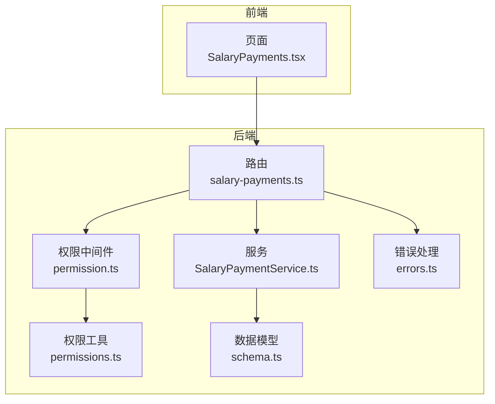
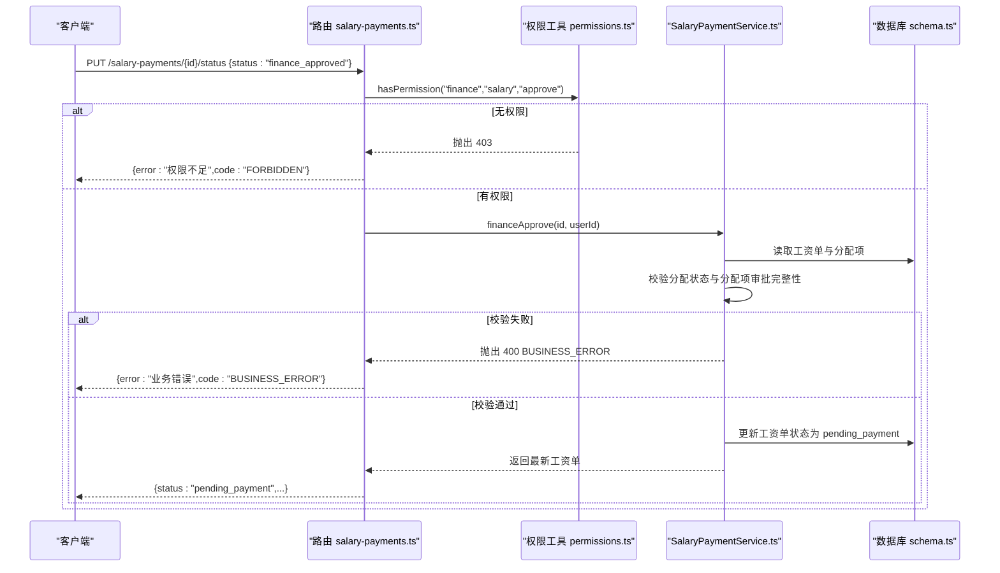
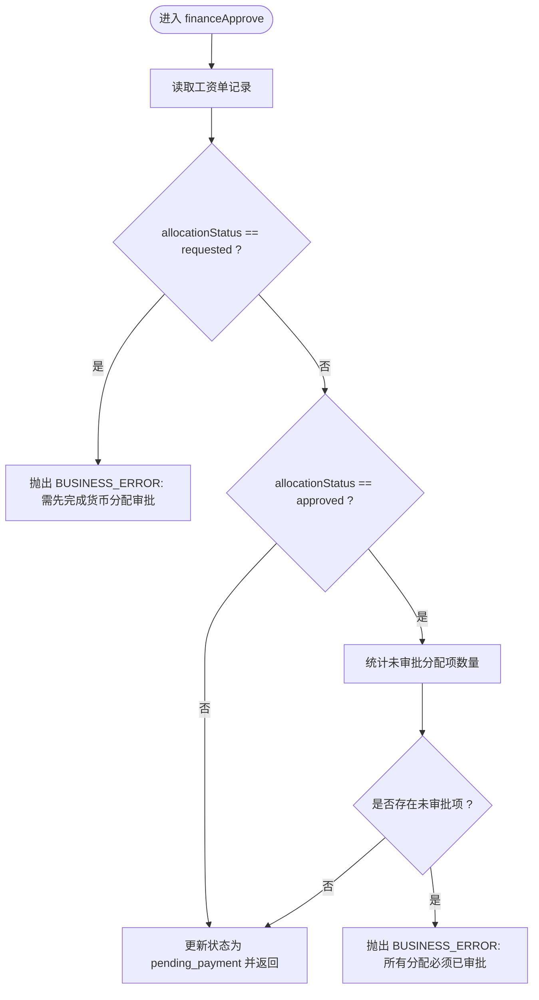
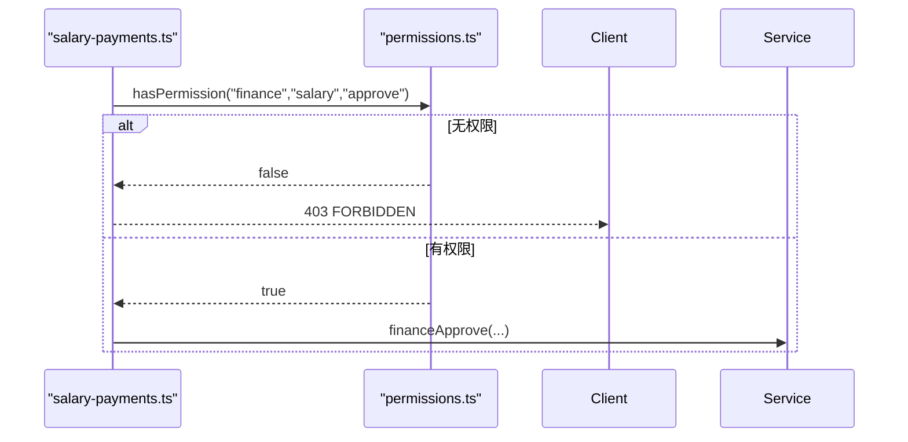
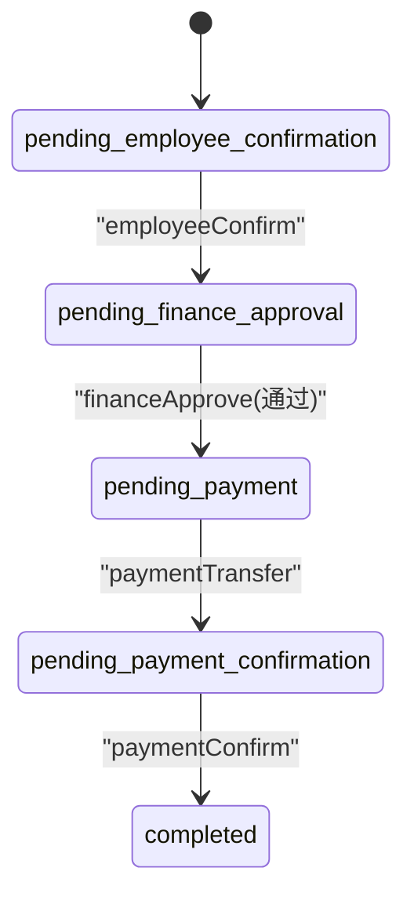
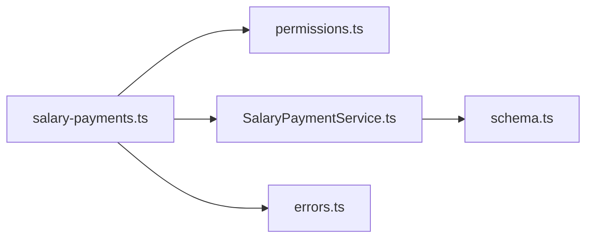

# 财务审批流程

<cite>
**本文引用的文件**
- [SalaryPaymentService.ts](file://backend/src/services/SalaryPaymentService.ts)
- [salary-payments.ts](file://backend/src/routes/salary-payments.ts)
- [permission.ts](file://backend/src/middleware/permission.ts)
- [permissions.ts](file://backend/src/utils/permissions.ts)
- [errors.ts](file://backend/src/utils/errors.ts)
- [schema-business.ts](file://backend/src/schemas/business.schema.ts)
- [schema.ts](file://backend/src/db/schema.ts)
- [SalaryPaymentService.test.ts](file://backend/test/services/SalaryPaymentService.test.ts)
- [SalaryPayments.tsx](file://frontend/src/features/hr/pages/SalaryPayments.tsx)
</cite>

## 目录
1. [简介](#简介)
2. [项目结构](#项目结构)
3. [核心组件](#核心组件)
4. [架构概览](#架构概览)
5. [详细组件分析](#详细组件分析)
6. [依赖分析](#依赖分析)
7. [性能考虑](#性能考虑)
8. [故障排查指南](#故障排查指南)
9. [结论](#结论)
10. [附录](#附录)

## 简介
本文件面向财务审批工资发放流程，聚焦 financeApprove 服务方法的业务逻辑与权限控制，涵盖：
- 审批前校验：货币分配状态与分配项审批完整性
- 状态流转：从 pending_finance_approval 到 pending_payment
- 权限控制：finance.salary.approve 权限要求
- 数据验证规则：禁止审批未完成货币分配的工资单
- API 调用示例与成功/失败响应
- 与其他子流程（货币分配）的交互关系
- 常见失败原因与解决方案

## 项目结构
围绕“工资发放”主流程，后端主要涉及以下模块：
- 路由层：salary-payments 路由负责状态变更接口
- 服务层：SalaryPaymentService 提供生成、审批、转账、确认等核心能力
- 中间件与权限：permission.ts 与 permissions.ts 提供权限检查
- 错误处理：errors.ts 统一错误码与响应
- 数据模型：db/schema.ts 定义工资单与分配表结构
- 前端展示：SalaryPayments.tsx 展示状态标签与颜色映射

图表来源
- [salary-payments.ts](file://backend/src/routes/salary-payments.ts#L134-L196)
- [SalaryPaymentService.ts](file://backend/src/services/SalaryPaymentService.ts#L254-L287)
- [permission.ts](file://backend/src/middleware/permission.ts#L1-L39)
- [permissions.ts](file://backend/src/utils/permissions.ts#L80-L114)
- [errors.ts](file://backend/src/utils/errors.ts#L34-L54)
- [schema.ts](file://backend/src/db/schema.ts#L256-L276)
- [SalaryPayments.tsx](file://frontend/src/features/hr/pages/SalaryPayments.tsx#L18-L40)

章节来源
- [salary-payments.ts](file://backend/src/routes/salary-payments.ts#L134-L196)
- [SalaryPaymentService.ts](file://backend/src/services/SalaryPaymentService.ts#L254-L287)
- [schema.ts](file://backend/src/db/schema.ts#L256-L276)

## 核心组件
- 路由层 salary-payments.ts
  - 提供 PUT /salary-payments/{id}/status 接口，根据 body.status 分派到不同服务方法
  - 对 finance_approved 场景进行权限校验（finance.salary.approve）
- 服务层 SalaryPaymentService.ts
  - financeApprove(id, userId)：执行审批逻辑与状态更新
  - requestAllocation/approveAllocation/rejectAllocation：货币分配相关流程
- 权限工具 permissions.ts
  - hasPermission(c, module, subModule, action)：判断用户是否具备 finance.salary.approve 权限
- 错误处理 errors.ts
  - 提供统一错误类型（BUSINESS_ERROR/FORBIDDEN/NOT_FOUND 等）

章节来源
- [salary-payments.ts](file://backend/src/routes/salary-payments.ts#L134-L196)
- [SalaryPaymentService.ts](file://backend/src/services/SalaryPaymentService.ts#L254-L287)
- [permissions.ts](file://backend/src/utils/permissions.ts#L80-L114)
- [errors.ts](file://backend/src/utils/errors.ts#L34-L54)

## 架构概览
财务审批工资发放的整体流程如下：
- 生成工资单：由路由层触发服务层生成逻辑，初始状态为 pending_employee_confirmation
- 员工确认：服务层 employeeConfirm 将状态推进至 pending_finance_approval
- 财务审批：服务层 financeApprove 校验分配状态与分配项审批完整性，通过后推进至 pending_payment
- 出纳转账/确认：服务层 paymentTransfer/paymentConfirm 完成资金划转与凭证确认

图表来源
- [salary-payments.ts](file://backend/src/routes/salary-payments.ts#L166-L194)
- [permissions.ts](file://backend/src/utils/permissions.ts#L80-L114)
- [SalaryPaymentService.ts](file://backend/src/services/SalaryPaymentService.ts#L254-L287)
- [schema.ts](file://backend/src/db/schema.ts#L256-L276)

## 详细组件分析

### financeApprove 方法业务逻辑
- 输入参数
  - id：工资单 ID
  - userId：当前审批人 ID
- 核心校验
  - 若 allocationStatus 为 requested，则抛出业务错误，提示需先完成货币分配审批
  - 若 allocationStatus 为 approved，则统计该工资单下未审批的分配项数量，若仍有未审批项则抛出业务错误
- 状态更新
  - 成功通过校验后，将工资单状态更新为 pending_payment，并记录审批人与时间戳
- 返回结果
  - 返回更新后的工资单详情

图表来源
- [SalaryPaymentService.ts](file://backend/src/services/SalaryPaymentService.ts#L254-L287)

章节来源
- [SalaryPaymentService.ts](file://backend/src/services/SalaryPaymentService.ts#L254-L287)

### 权限控制
- 路由层在处理 finance_approved 时，显式检查用户是否具备 finance.salary.approve 权限
- 权限工具 hasPermission 支持模块/子模块/动作的三段式权限判定
- 未满足权限时，统一返回 403 FORBIDDEN

图表来源
- [salary-payments.ts](file://backend/src/routes/salary-payments.ts#L171-L179)
- [permissions.ts](file://backend/src/utils/permissions.ts#L80-L114)

章节来源
- [salary-payments.ts](file://backend/src/routes/salary-payments.ts#L171-L179)
- [permissions.ts](file://backend/src/utils/permissions.ts#L80-L114)

### 数据验证规则
- 不允许审批未完成货币分配的工资单
  - 当 allocationStatus 为 requested 时直接拒绝
  - 当 allocationStatus 为 approved 时，若仍存在未审批的分配项，拒绝
- 货币分配请求与审批
  - requestAllocation：校验分配总额不超过工资总额，校验币种与账户一致性
  - approveAllocation：支持全部批准或按分配项 ID 批准，自动回写 allocationStatus 为 approved

章节来源
- [SalaryPaymentService.ts](file://backend/src/services/SalaryPaymentService.ts#L254-L287)
- [SalaryPaymentService.ts](file://backend/src/services/SalaryPaymentService.ts#L354-L403)
- [SalaryPaymentService.ts](file://backend/src/services/SalaryPaymentService.ts#L405-L440)

### API 调用示例与响应
- 请求路径
  - PUT /salary-payments/{id}/status
  - 请求体
    - status: "finance_approved"
    - 其他字段（如 payment_voucher_path、accountId）在 paid 场景下使用
- 成功响应
  - 返回工资单对象，其中 status 字段为 "pending_payment"
- 失败响应
  - 403 FORBIDDEN：用户不具备 finance.salary.approve 权限
  - 400 BUSINESS_ERROR：未完成货币分配或分配项未全部审批
  - 404 NOT_FOUND：工资单不存在

章节来源
- [salary-payments.ts](file://backend/src/routes/salary-payments.ts#L166-L194)
- [errors.ts](file://backend/src/utils/errors.ts#L34-L54)

### 与其他子流程的交互关系
- 与货币分配流程的耦合点
  - 工资单在生成后默认 allocationStatus 为 pending
  - 员工确认后进入 pending_finance_approval，此时必须确保分配已获批
  - 货币分配请求与审批完成后，allocationStatus 才能变为 approved
- 状态流转图

图表来源
- [schema.ts](file://backend/src/db/schema.ts#L256-L276)
- [SalaryPaymentService.ts](file://backend/src/services/SalaryPaymentService.ts#L240-L338)

### 前端状态展示
- 前端 SalaryPayments.tsx 使用状态标签与颜色映射，便于识别当前所处阶段
- 例如：pending_finance_approval 显示为“待财务确认”，颜色为蓝色

章节来源
- [SalaryPayments.tsx](file://frontend/src/features/hr/pages/SalaryPayments.tsx#L18-L40)

## 依赖分析
- 组件耦合
  - 路由层依赖权限工具与服务层
  - 服务层依赖数据库模型与错误处理
  - 权限工具依赖用户上下文与职位权限配置
- 外部依赖
  - Drizzle ORM 进行数据库查询与事务
  - Zod Schema 用于请求体校验（在路由层定义）

图表来源
- [salary-payments.ts](file://backend/src/routes/salary-payments.ts#L134-L196)
- [permissions.ts](file://backend/src/utils/permissions.ts#L80-L114)
- [SalaryPaymentService.ts](file://backend/src/services/SalaryPaymentService.ts#L1-L40)
- [schema.ts](file://backend/src/db/schema.ts#L256-L276)
- [errors.ts](file://backend/src/utils/errors.ts#L34-L54)

章节来源
- [salary-payments.ts](file://backend/src/routes/salary-payments.ts#L134-L196)
- [permissions.ts](file://backend/src/utils/permissions.ts#L80-L114)
- [SalaryPaymentService.ts](file://backend/src/services/SalaryPaymentService.ts#L1-L40)
- [schema.ts](file://backend/src/db/schema.ts#L256-L276)
- [errors.ts](file://backend/src/utils/errors.ts#L34-L54)

## 性能考虑
- 单次审批仅涉及少量数据库读写与一次更新，复杂度低
- 分配项审批统计采用聚合查询，避免逐条遍历
- 建议
  - 在高并发场景下，确保数据库连接池与索引合理（如 salary_payments.id、salaryPaymentAllocations.salaryPaymentId）
  - 对于批量分配审批，优先使用 approve_all 以减少多次往返

[本节为通用建议，无需列出具体文件来源]

## 故障排查指南
- 常见失败原因
  - 无 finance.salary.approve 权限：返回 403
  - 工资单不存在：返回 404
  - 货币分配尚未完成：返回 400 BUSINESS_ERROR（提示需先完成分配审批）
  - 分配项中存在未审批项：返回 400 BUSINESS_ERROR（提示所有分配必须已审批）
- 解决方案
  - 确认用户具备 finance.salary.approve 权限
  - 在发起财务审批前，先完成货币分配请求与审批
  - 确保所有分配项均处于 approved 状态后再进行财务审批

章节来源
- [salary-payments.ts](file://backend/src/routes/salary-payments.ts#L171-L179)
- [SalaryPaymentService.ts](file://backend/src/services/SalaryPaymentService.ts#L254-L287)
- [errors.ts](file://backend/src/utils/errors.ts#L34-L54)

## 结论
financeApprove 方法通过严格的前置校验与清晰的状态流转，确保财务审批仅在货币分配完成的前提下进行。配合权限控制与统一错误处理，系统在保证业务正确性的同时，提供了明确的失败反馈与修复指引。前端状态展示进一步提升了可观测性与用户体验。

[本节为总结性内容，无需列出具体文件来源]

## 附录

### API 规范要点
- 路由：PUT /salary-payments/{id}/status
- 权限：finance.salary.approve
- 参数：status="finance_approved"
- 成功：返回工资单对象，status="pending_payment"
- 失败：403/400/404，携带错误码与消息

章节来源
- [salary-payments.ts](file://backend/src/routes/salary-payments.ts#L134-L196)
- [schema-business.ts](file://backend/src/schemas/business.schema.ts#L683-L689)