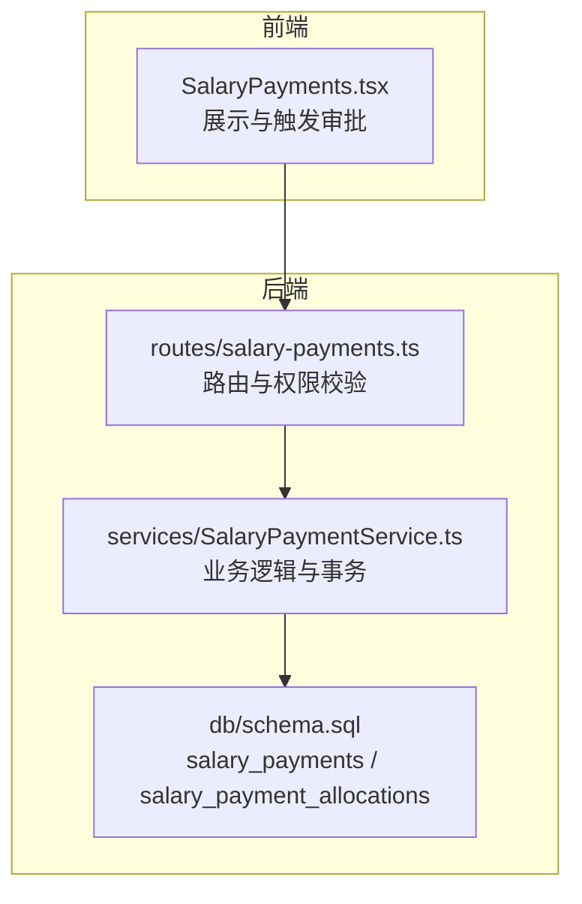
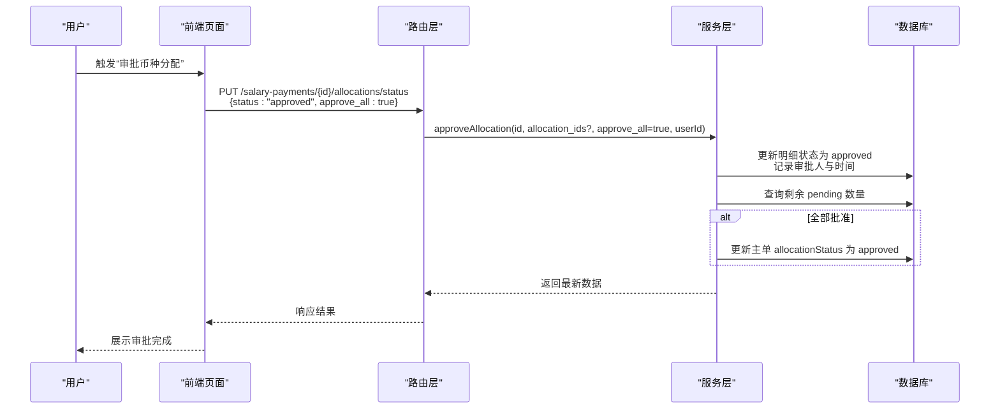
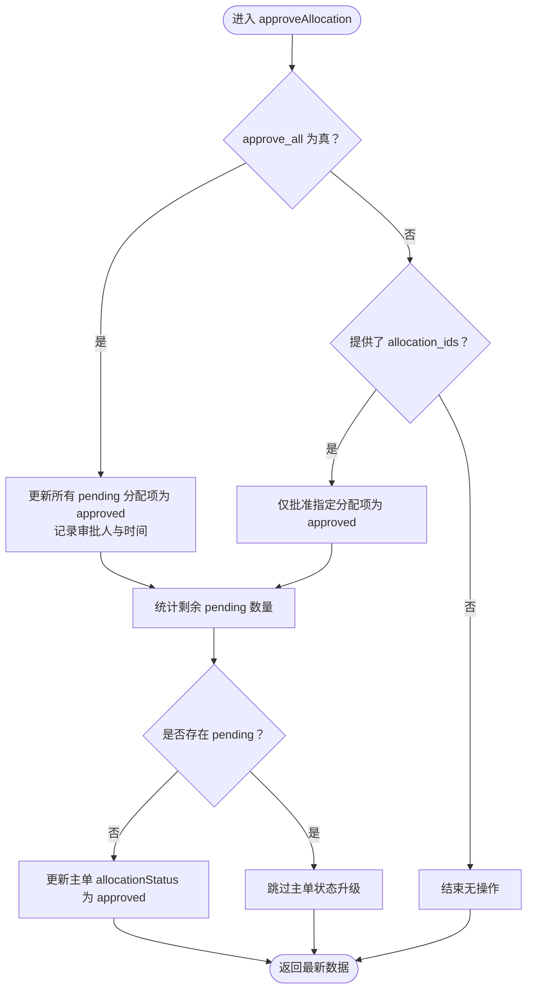
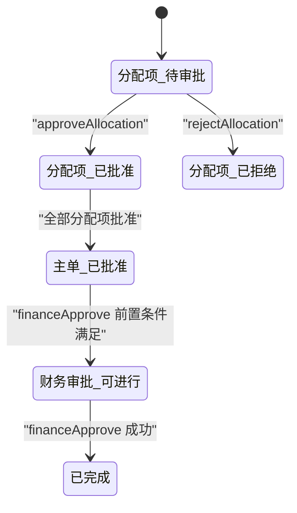

# 货币分配审批

<cite>
**本文引用的文件**
- [backend/src/routes/salary-payments.ts](file://backend/src/routes/salary-payments.ts)
- [backend/src/services/SalaryPaymentService.ts](file://backend/src/services/SalaryPaymentService.ts)
- [backend/src/db/schema.sql](file://backend/src/db/schema.sql)
- [backend/test/services/SalaryPaymentService.test.ts](file://backend/test/services/SalaryPaymentService.test.ts)
- [backend/test/routes/salary-payments.test.ts](file://backend/test/routes/salary-payments.test.ts)
- [frontend/src/features/hr/pages/SalaryPayments.tsx](file://frontend/src/features/hr/pages/SalaryPayments.tsx)
</cite>

## 目录
1. [简介](#简介)
2. [项目结构](#项目结构)
3. [核心组件](#核心组件)
4. [架构总览](#架构总览)
5. [组件详解](#组件详解)
6. [依赖关系分析](#依赖关系分析)
7. [性能考量](#性能考量)
8. [故障排查指南](#故障排查指南)
9. [结论](#结论)
10. [附录](#附录)

## 简介
本文件围绕“工资发放货币分配审批”流程进行全面技术文档化，重点覆盖：
- 通过 PUT /api/salary-payments/{id}/allocations/status 进行审批的两种模式：批量审批（approve_all）与指定分配项审批（allocation_ids）
- SalaryPaymentService 中 approveAllocation 与 rejectAllocation 的实现差异，包括状态转换逻辑、审批人记录与事务处理
- 审批状态机：从分配项“pending”到“approved/rejected”的转换，以及当所有分配项均被批准时主工资单 allocationStatus 自动升级为“approved”的机制
- 审批操作对后续财务审批流程的影响，特别是 financeApprove 方法对 allocationStatus 的依赖关系
- 提供完整的审批操作示例，涵盖批准全部分配项与拒绝特定分配项的场景

## 项目结构
该功能涉及后端路由、服务层与数据库表结构，前端页面提供交互入口。关键位置如下：
- 后端路由：salary-payments 路由定义了请求体校验与权限控制，并将审批请求转发至服务层
- 服务层：SalaryPaymentService 实现 approveAllocation/rejectAllocation 的业务逻辑与事务处理
- 数据库：salary_payments 与 salary_payment_allocations 表承载主单与分配明细的状态字段
- 前端：HR 页面根据状态显示“申请币种分配”“审批币种分配”等按钮，驱动用户操作

图表来源
- [backend/src/routes/salary-payments.ts](file://backend/src/routes/salary-payments.ts#L235-L284)
- [backend/src/services/SalaryPaymentService.ts](file://backend/src/services/SalaryPaymentService.ts#L405-L451)
- [backend/src/db/schema.sql](file://backend/src/db/schema.sql#L258-L295)

章节来源
- [backend/src/routes/salary-payments.ts](file://backend/src/routes/salary-payments.ts#L235-L284)
- [backend/src/services/SalaryPaymentService.ts](file://backend/src/services/SalaryPaymentService.ts#L405-L451)
- [backend/src/db/schema.sql](file://backend/src/db/schema.sql#L258-L295)

## 核心组件
- 路由层（salary-payments.ts）
  - 定义 PUT /api/salary-payments/{id}/allocations/status 接口，参数包含 status、allocation_ids、approve_all
  - 权限校验：仅具备 finance:salary:approve 权限方可调用
  - 分支逻辑：status 为 approved 调用 approveAllocation；否则要求提供 allocation_ids 并调用 rejectAllocation
- 服务层（SalaryPaymentService.ts）
  - approveAllocation：支持 approve_all 或指定 allocation_ids 批量批准；完成后检测是否全部批准，若是则更新主单 allocationStatus 为 approved
  - rejectAllocation：拒绝指定分配项，不自动提升主单状态
  - financeApprove：财务审批前置条件为 allocationStatus 不为 requested；若为 approved 则要求所有分配项均为 approved
- 数据层（schema.sql）
  - 主表 salary_payments：包含 allocation_status 字段
  - 明细表 salary_payment_allocations：包含 status 字段及审批人记录字段

章节来源
- [backend/src/routes/salary-payments.ts](file://backend/src/routes/salary-payments.ts#L235-L284)
- [backend/src/services/SalaryPaymentService.ts](file://backend/src/services/SalaryPaymentService.ts#L405-L451)
- [backend/src/db/schema.sql](file://backend/src/db/schema.sql#L258-L295)

## 架构总览
审批流程从“申请币种分配”开始，进入“审批币种分配”，最终影响“财务审批”。主单与明细状态协同工作，确保业务合规性。

图表来源
- [backend/src/routes/salary-payments.ts](file://backend/src/routes/salary-payments.ts#L235-L284)
- [backend/src/services/SalaryPaymentService.ts](file://backend/src/services/SalaryPaymentService.ts#L405-L439)
- [backend/src/db/schema.sql](file://backend/src/db/schema.sql#L258-L295)

## 组件详解

### 路由层：PUT /api/salary-payments/{id}/allocations/status
- 请求体字段
  - status：枚举值 approved 或 rejected
  - allocation_ids：数组，用于拒绝或指定批准
  - approve_all：布尔值，用于批量批准
- 权限控制：仅具备 finance:salary:approve 权限可调用
- 业务分支
  - status 为 approved：调用服务层 approveAllocation，支持 approve_all 或 allocation_ids
  - status 为 rejected：要求提供 allocation_ids，调用服务层 rejectAllocation

章节来源
- [backend/src/routes/salary-payments.ts](file://backend/src/routes/salary-payments.ts#L235-L284)

### 服务层：SalaryPaymentService
- approveAllocation
  - 事务处理：在单个事务内执行
  - 批量批准策略
    - approve_all 为 true：将同一主单下所有状态为 pending 的分配项统一批准
    - 指定分配项：仅批准传入的 allocation_ids
  - 审批人记录：设置 approved_by 与 approved_at
  - 状态升级：当主单下不再存在 pending 分配项时，将主单 allocationStatus 升级为 approved
- rejectAllocation
  - 对指定分配项设置状态为 rejected，并记录审批人信息
  - 不自动提升主单 allocationStatus
- financeApprove
  - 前置条件：主单 allocationStatus 不能为 requested
  - 若主单 allocationStatus 为 approved：要求所有分配项均为 approved，否则抛出业务错误
  - 成功后将主单 status 升级为 pending_payment

图表来源
- [backend/src/services/SalaryPaymentService.ts](file://backend/src/services/SalaryPaymentService.ts#L405-L439)

章节来源
- [backend/src/services/SalaryPaymentService.ts](file://backend/src/services/SalaryPaymentService.ts#L405-L451)

### 数据模型与状态机
- 主表 salary_payments
  - allocation_status：pending、requested、approved
- 明细表 salary_payment_allocations
  - status：pending、approved、rejected
  - 审批人记录字段：approved_by、approved_at
- 状态转换规则
  - 分配项：pending → approved 或 rejected
  - 主单：当所有分配项均为 approved 时，主单 allocationStatus 从 requested 或 pending 升级为 approved
  - 财务审批：financeApprove 要求主单 allocationStatus 不为 requested；若为 approved，要求所有分配项均为 approved

图表来源
- [backend/src/db/schema.sql](file://backend/src/db/schema.sql#L258-L295)
- [backend/src/services/SalaryPaymentService.ts](file://backend/src/services/SalaryPaymentService.ts#L254-L287)
- [backend/src/services/SalaryPaymentService.ts](file://backend/src/services/SalaryPaymentService.ts#L405-L439)

章节来源
- [backend/src/db/schema.sql](file://backend/src/db/schema.sql#L258-L295)
- [backend/src/services/SalaryPaymentService.ts](file://backend/src/services/SalaryPaymentService.ts#L254-L287)
- [backend/src/services/SalaryPaymentService.ts](file://backend/src/services/SalaryPaymentService.ts#L405-L439)

### 前端交互与示例
- 申请币种分配
  - 前端在“待审批”状态下允许 HR 用户发起“申请币种分配”，提交后主单 allocationStatus 变为 requested
- 审批币种分配
  - 当主单处于“待财务审批”且 allocationStatus 为 requested 时，财务用户可见“审批币种分配”按钮
  - 支持“全部批准”（approve_all: true）或勾选多个分配项后“部分批准”
- 财务审批
  - financeApprove 仅在主单 allocationStatus 不为 requested 时可用
  - 若主单 allocationStatus 为 approved，需确保所有分配项均为 approved

章节来源
- [frontend/src/features/hr/pages/SalaryPayments.tsx](file://frontend/src/features/hr/pages/SalaryPayments.tsx#L360-L384)
- [frontend/src/features/hr/pages/SalaryPayments.tsx](file://frontend/src/features/hr/pages/SalaryPayments.tsx#L524-L640)

## 依赖关系分析
- 路由层依赖服务层：将审批请求分派给 SalaryPaymentService
- 服务层依赖数据库：读取与更新主单与明细表
- 前端依赖路由层：通过接口触发审批动作
- 状态依赖：financeApprove 依赖主单 allocationStatus 与分配项状态一致性

图表来源
- [backend/src/routes/salary-payments.ts](file://backend/src/routes/salary-payments.ts#L235-L284)
- [backend/src/services/SalaryPaymentService.ts](file://backend/src/services/SalaryPaymentService.ts#L405-L451)
- [backend/src/db/schema.sql](file://backend/src/db/schema.sql#L258-L295)

章节来源
- [backend/src/routes/salary-payments.ts](file://backend/src/routes/salary-payments.ts#L235-L284)
- [backend/src/services/SalaryPaymentService.ts](file://backend/src/services/SalaryPaymentService.ts#L254-L287)
- [backend/src/services/SalaryPaymentService.ts](file://backend/src/services/SalaryPaymentService.ts#L405-L451)

## 性能考量
- 事务边界：approveAllocation 在单事务内完成分配项更新与主单状态判断，避免中间态并发问题
- 查询优化：approveAllocation 使用一次计数查询判断是否全部批准，减少额外循环
- 前端渲染：前端按状态动态显示按钮，降低无效请求

## 故障排查指南
- “缺少分配项 ID”错误
  - 拒绝场景必须提供 allocation_ids，否则抛出业务错误
- “币种分配必须先获得批准”错误
  - financeApprove 前主单 allocationStatus 不能为 requested
- “所有分配必须已批准”错误
  - 主单 allocationStatus 为 approved 时，仍需确保所有分配项均为 approved
- “总分配金额超过工资金额”
  - 申请分配时，前端与服务层均会校验总和不超过主单 salaryCents

章节来源
- [backend/src/routes/salary-payments.ts](file://backend/src/routes/salary-payments.ts#L267-L283)
- [backend/src/services/SalaryPaymentService.ts](file://backend/src/services/SalaryPaymentService.ts#L254-L287)
- [backend/src/services/SalaryPaymentService.ts](file://backend/src/services/SalaryPaymentService.ts#L405-L451)
- [backend/test/services/SalaryPaymentService.test.ts](file://backend/test/services/SalaryPaymentService.test.ts#L78-L103)

## 结论
- 两种审批模式互补：approve_all 适合快速批量通过，allocation_ids 适合精细化控制
- approveAllocation 与 rejectAllocation 的实现差异清晰：前者在事务内批量更新并可能提升主单状态，后者仅针对指定项拒绝
- financeApprove 严格依赖分配状态一致性，确保财务审批安全
- 建议在前端明确提示审批结果与下一步操作，提升用户体验

## 附录

### 审批操作示例

- 场景一：批准全部分配项
  - 步骤
    - 前端点击“审批币种分配”，选择“全部批准”
    - 路由层接收 { status: "approved", approve_all: true }
    - 服务层 approveAllocation 将所有 pending 分配项批准，并在全部批准后将主单 allocationStatus 升级为 approved
  - 预期结果
    - 主单 allocationStatus 为 approved
    - 所有分配项 status 为 approved
  - 参考路径
    - [backend/src/routes/salary-payments.ts](file://backend/src/routes/salary-payments.ts#L235-L284)
    - [backend/src/services/SalaryPaymentService.ts](file://backend/src/services/SalaryPaymentService.ts#L405-L439)
    - [backend/test/services/SalaryPaymentService.test.ts](file://backend/test/services/SalaryPaymentService.test.ts#L78-L103)

- 场景二：拒绝特定分配项
  - 步骤
    - 前端勾选若干分配项，点击“审批币种分配”，选择“部分拒绝”
    - 路由层接收 { status: "rejected", allocation_ids: [...] }
    - 服务层 rejectAllocation 将指定分配项状态设为 rejected，并记录审批人
  - 预期结果
    - 被选中的分配项 status 为 rejected
    - 主单 allocationStatus 不受影响
  - 参考路径
    - [backend/src/routes/salary-payments.ts](file://backend/src/routes/salary-payments.ts#L267-L283)
    - [backend/src/services/SalaryPaymentService.ts](file://backend/src/services/SalaryPaymentService.ts#L442-L451)

- 场景三：财务审批前置条件
  - 步骤
    - 主单 allocationStatus 为 requested 时，financeApprove 不允许
    - 必须先 approveAllocation 将主单 allocationStatus 升级为 approved
    - 若主单 allocationStatus 已为 approved，需确保所有分配项均为 approved
  - 参考路径
    - [backend/src/services/SalaryPaymentService.ts](file://backend/src/services/SalaryPaymentService.ts#L254-L287)