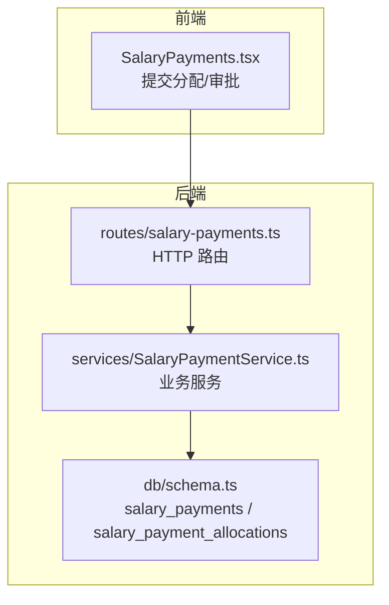
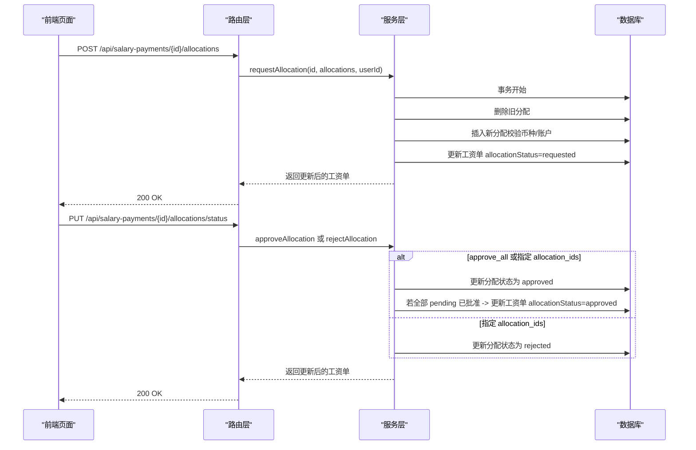
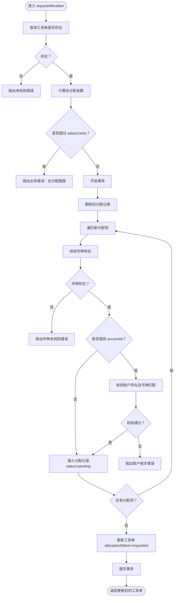
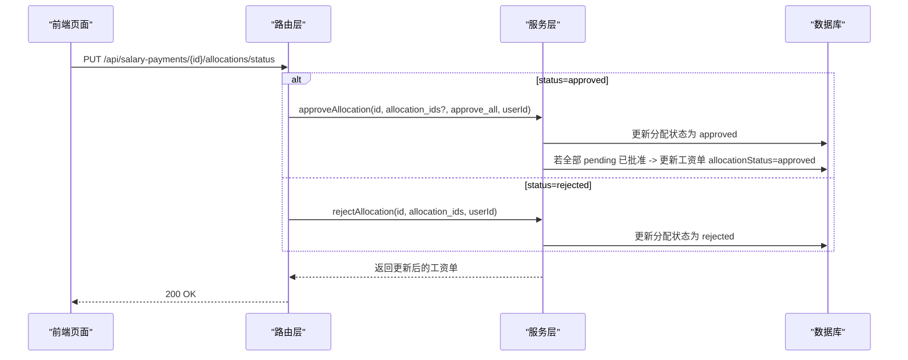
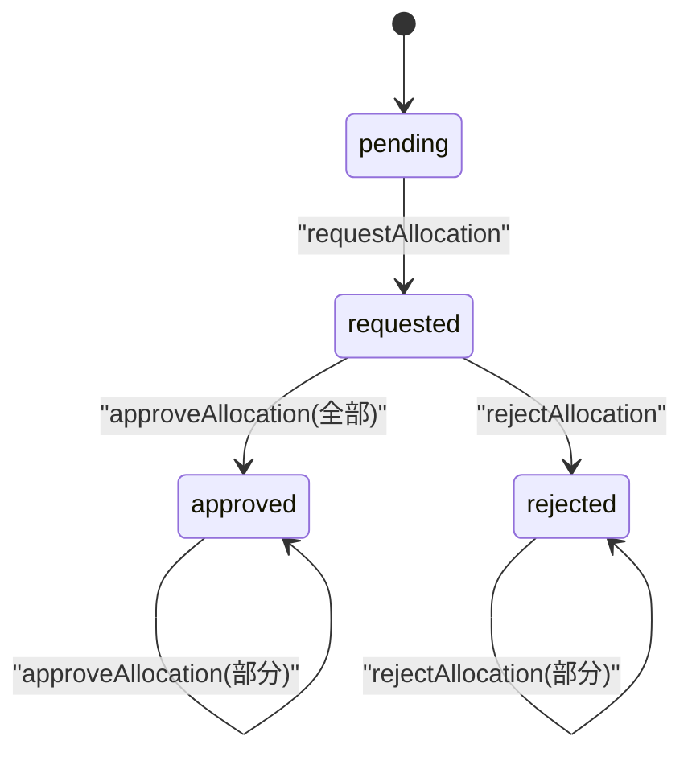
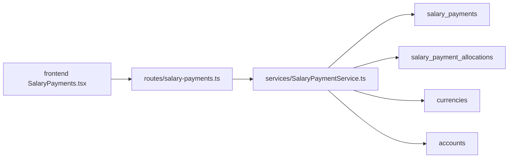

# 货币分配管理

<cite>
**本文引用的文件**
- [routes/salary-payments.ts](file://backend/src/routes/salary-payments.ts)
- [services/SalaryPaymentService.ts](file://backend/src/services/SalaryPaymentService.ts)
- [schemas/business.schema.ts](file://backend/src/schemas/business.schema.ts)
- [db/schema.ts](file://backend/src/db/schema.ts)
- [openapi.json](file://backend/openapi.json)
- [test/services/SalaryPaymentService.test.ts](file://backend/test/services/SalaryPaymentService.test.ts)
- [frontend/features/hr/pages/SalaryPayments.tsx](file://frontend/src/features/hr/pages/SalaryPayments.tsx)
</cite>

## 目录
1. [简介](#简介)
2. [项目结构](#项目结构)
3. [核心组件](#核心组件)
4. [架构总览](#架构总览)
5. [详细组件分析](#详细组件分析)
6. [依赖关系分析](#依赖关系分析)
7. [性能考量](#性能考量)
8. [故障排查指南](#故障排查指南)
9. [结论](#结论)
10. [附录](#附录)

## 简介
本文件系统化梳理“多币种工资支付”的货币分配机制，围绕以下目标展开：
- 解释通过 POST /api/salary-payments/{id}/allocations 请求分配与 PUT /api/salary-payments/{id}/allocations/status 审批的全流程。
- 深入解析 requestAllocation 服务方法的实现要点：总金额校验、币种与账户校验、事务性数据操作。
- 对比 approveAllocation 与 rejectAllocation 的差异与适用场景。
- 阐述分配状态机：pending → requested → approved/rejected，并说明分配状态如何影响主工资单的审批流程。
- 提供多币种分配的完整示例，覆盖不同币种金额分配与指定支付账户的场景。

## 项目结构
该功能由后端路由层、服务层、数据库模型与前端页面协同完成：
- 路由层负责暴露 API 并进行权限与参数校验。
- 服务层封装业务逻辑，执行事务性写入与状态流转。
- 数据库模型定义工资单与分配明细表结构。
- 前端页面负责用户交互与调用后端接口。

图表来源
- [routes/salary-payments.ts](file://backend/src/routes/salary-payments.ts#L198-L284)
- [services/SalaryPaymentService.ts](file://backend/src/services/SalaryPaymentService.ts#L354-L451)
- [db/schema.ts](file://backend/src/db/schema.ts#L256-L295)

章节来源
- [routes/salary-payments.ts](file://backend/src/routes/salary-payments.ts#L198-L284)
- [services/SalaryPaymentService.ts](file://backend/src/services/SalaryPaymentService.ts#L354-L451)
- [db/schema.ts](file://backend/src/db/schema.ts#L256-L295)

## 核心组件
- 路由层（POST /api/salary-payments/{id}/allocations）
  - 参数校验：路径参数 id 必填，请求体包含 allocations 数组。
  - 权限控制：仅允许具备相应权限的用户发起请求。
  - 调用服务：将分配请求转发给服务层的 requestAllocation 方法。
- 路由层（PUT /api/salary-payments/{id}/allocations/status）
  - 参数校验：status 枚举为 approved/rejected，支持 approve_all 或指定 allocation_ids。
  - 权限控制：仅财务审批权限用户可操作。
  - 调用服务：approveAllocation 或 rejectAllocation。
- 服务层（requestAllocation）
  - 校验：总分配金额不得超出工资单总金额。
  - 校验：币种存在且有效；若指定账户，则账户存在且币种匹配。
  - 事务：先删除旧分配，再批量插入新分配，并更新工资单 allocationStatus 为 requested。
- 服务层（approveAllocation）
  - 支持两种模式：approve_all（全部批准）或按指定 allocation_ids 批量批准。
  - 若所有 pending 分配均被批准，则更新工资单 allocationStatus 为 approved。
- 服务层（rejectAllocation）
  - 按指定 allocation_ids 将对应分配标记为 rejected。
- 数据库模型
  - salary_payments：主表，包含 allocation_status 字段。
  - salary_payment_allocations：分配明细表，包含 currencyId、amountCents、accountId、status 等字段。

章节来源
- [routes/salary-payments.ts](file://backend/src/routes/salary-payments.ts#L198-L284)
- [services/SalaryPaymentService.ts](file://backend/src/services/SalaryPaymentService.ts#L354-L451)
- [db/schema.ts](file://backend/src/db/schema.ts#L256-L295)

## 架构总览
下图展示从前端到数据库的调用链路与状态流转。

图表来源
- [routes/salary-payments.ts](file://backend/src/routes/salary-payments.ts#L198-L284)
- [services/SalaryPaymentService.ts](file://backend/src/services/SalaryPaymentService.ts#L354-L451)

## 详细组件分析

### POST /api/salary-payments/{id}/allocations（请求分配）
- 功能：为指定工资单提交多币种分配方案。
- 请求体结构要点（来自 OpenAPI 与 Schema）：
  - allocations：数组，元素包含 currencyId（3 字母）、amountCents（正整数）、accountId（可选）。
- 服务方法 requestAllocation 的关键步骤：
  - 校验工资单存在。
  - 计算总分配金额并确保不超过 salaryCents。
  - 开启事务：
    - 删除旧分配记录。
    - 校验每个分配项的币种存在；若提供 accountId，校验账户存在且币种一致。
    - 插入新的分配记录，并设置状态为 pending。
    - 更新工资单 allocationStatus 为 requested。
- 错误处理：
  - 工资单不存在返回未找到。
  - 总分配超限抛业务错误。
  - 币种或账户不存在/不匹配时抛业务错误。

图表来源
- [services/SalaryPaymentService.ts](file://backend/src/services/SalaryPaymentService.ts#L354-L403)
- [openapi.json](file://backend/openapi.json#L7095-L7159)
- [schemas/business.schema.ts](file://backend/src/schemas/business.schema.ts#L453-L463)

章节来源
- [routes/salary-payments.ts](file://backend/src/routes/salary-payments.ts#L198-L232)
- [services/SalaryPaymentService.ts](file://backend/src/services/SalaryPaymentService.ts#L354-L403)
- [openapi.json](file://backend/openapi.json#L7095-L7159)
- [schemas/business.schema.ts](file://backend/src/schemas/business.schema.ts#L453-L463)

### PUT /api/salary-payments/{id}/allocations/status（审批/拒绝）
- 功能：对工资单的分配进行审批或拒绝。
- 请求体结构要点：
  - status：枚举 approved 或 rejected。
  - approve_all：布尔，当为 true 时批准全部 pending 分配。
  - allocation_ids：数组，指定要批准/拒绝的具体分配记录 ID。
- 服务方法 approveAllocation 与 rejectAllocation：
  - approveAllocation：
    - approve_all=true：将该工资单下所有 status=pending 的分配更新为 approved，并在全部批准后更新工资单 allocationStatus=approved。
    - 指定 allocation_ids：仅批准这些 ID 的分配。
  - rejectAllocation：
    - 仅支持指定 allocation_ids，将这些分配标记为 rejected。
- 权限与约束：
  - 仅具备财务审批权限的用户可操作。
  - 拒绝时必须提供 allocation_ids。
  - 若工资单仍处于 requested 状态，financeApprove 会阻止进入下一阶段。

图表来源
- [routes/salary-payments.ts](file://backend/src/routes/salary-payments.ts#L235-L284)
- [services/SalaryPaymentService.ts](file://backend/src/services/SalaryPaymentService.ts#L405-L451)

章节来源
- [routes/salary-payments.ts](file://backend/src/routes/salary-payments.ts#L235-L284)
- [services/SalaryPaymentService.ts](file://backend/src/services/SalaryPaymentService.ts#L405-L451)

### 分配状态机与对主工资单的影响
- 分配状态机：
  - 初始：pending（未请求分配）
  - 请求后：requested（等待审批）
  - 审批后：approved（全部批准）
  - 拒绝后：rejected（部分或全部拒绝）
- 对主工资单审批流程的影响：
  - financeApprove 在进入下一阶段前会检查：
    - 若 allocationStatus 仍为 requested，抛出业务错误，要求先完成分配审批。
    - 若 allocationStatus 为 approved，还会进一步检查是否存在未批准的分配，若有则阻止进入支付阶段。
  - 仅当分配全部 approved 且工资单处于 pending_finance_approval 时，才能进入 pending_payment。

图表来源
- [services/SalaryPaymentService.ts](file://backend/src/services/SalaryPaymentService.ts#L254-L287)
- [services/SalaryPaymentService.ts](file://backend/src/services/SalaryPaymentService.ts#L405-L451)

章节来源
- [services/SalaryPaymentService.ts](file://backend/src/services/SalaryPaymentService.ts#L254-L287)
- [services/SalaryPaymentService.ts](file://backend/src/services/SalaryPaymentService.ts#L405-L451)

### 多币种分配示例（含指定支付账户）
- 示例一：USDT + CNY 两币种分配
  - 分配方案：
    - USDT：amountCents=50000
    - CNY：amountCents=100000
  - 前端校验：分配总额 ≤ 工资单总金额。
  - 服务端校验：USDT 与 CNY 均为有效币种；若为某一分配指定了 accountId，则账户币种需与 currencyId 匹配。
  - 结果：插入两条分配记录，status=pending；工资单 allocationStatus=requested。
- 示例二：指定支付账户
  - 在分配项中提供 accountId，服务端会校验账户存在且币种一致。
  - 若分配已批准，后续支付时可优先使用该账户（具体使用策略由业务决定）。
- 示例三：全部批准与部分批准
  - 全部批准：approve_all=true，将所有 pending 分配批准，并更新工资单 allocationStatus=approved。
  - 部分批准：提供 allocation_ids，仅批准其中几条分配。
  - 拒绝：提供 allocation_ids，将指定分配标记为 rejected。

章节来源
- [frontend/features/hr/pages/SalaryPayments.tsx](file://frontend/src/features/hr/pages/SalaryPayments.tsx#L165-L200)
- [services/SalaryPaymentService.ts](file://backend/src/services/SalaryPaymentService.ts#L354-L451)
- [openapi.json](file://backend/openapi.json#L7095-L7159)

## 依赖关系分析
- 路由层依赖服务层：
  - POST /allocations 调用 requestAllocation。
  - PUT /allocations/status 调用 approveAllocation 或 rejectAllocation。
- 服务层依赖数据库模型：
  - 读取/更新 salary_payments。
  - 读取/插入/更新 salary_payment_allocations。
  - 校验 currencies 与 accounts。
- 前端依赖 OpenAPI 规范：
  - 使用 OpenAPI 中定义的请求体结构与响应结构进行交互。

图表来源
- [routes/salary-payments.ts](file://backend/src/routes/salary-payments.ts#L198-L284)
- [services/SalaryPaymentService.ts](file://backend/src/services/SalaryPaymentService.ts#L354-L451)
- [db/schema.ts](file://backend/src/db/schema.ts#L256-L295)

章节来源
- [routes/salary-payments.ts](file://backend/src/routes/salary-payments.ts#L198-L284)
- [services/SalaryPaymentService.ts](file://backend/src/services/SalaryPaymentService.ts#L354-L451)
- [db/schema.ts](file://backend/src/db/schema.ts#L256-L295)

## 性能考量
- 事务一致性：分配请求与工资单状态更新在单个事务内完成，保证原子性。
- 批量写入：在 approve_all 模式下，一次性更新多条分配记录，减少多次往返。
- 查询优化：列表与详情查询中对相关表进行联接，避免 N+1 查询问题。
- 前端校验：在提交前进行总额校验，减少无效请求。

## 故障排查指南
- “总分配超过工资单金额”
  - 现象：服务端抛出业务错误。
  - 排查：确认前端输入的 amountCents 是否超过 salaryCents；必要时调整分配比例。
- “币种未找到”
  - 现象：服务端抛出币种未找到错误。
  - 排查：确认 currencyId 是否为有效 3 字母代码；检查 currencies 表。
- “账户不存在或币种不匹配”
  - 现象：服务端抛出账户相关错误。
  - 排查：确认 accountId 存在；若提供 accountId，其币种需与 currencyId 一致。
- “分配未批准即进入支付阶段”
  - 现象：financeApprove 抛出业务错误。
  - 排查：确保分配已全部批准（allocationStatus=approved），且无 pending 分配。
- “拒绝时缺少 allocation_ids”
  - 现象：路由层抛出业务错误。
  - 排查：拒绝操作必须提供 allocation_ids 数组。

章节来源
- [services/SalaryPaymentService.ts](file://backend/src/services/SalaryPaymentService.ts#L354-L451)
- [routes/salary-payments.ts](file://backend/src/routes/salary-payments.ts#L235-L284)

## 结论
该模块通过清晰的 API 与严谨的服务层实现，实现了多币种工资分配的全生命周期管理。请求分配与审批分离、事务性写入、严格的币种与账户校验，以及明确的状态机与前置校验，共同保障了业务的正确性与可审计性。建议在生产环境中配合完善的日志与监控，以便快速定位异常并优化性能。

## 附录
- OpenAPI 定义位置参考：
  - POST /api/salary-payments/{id}/allocations：[openapi.json](file://backend/openapi.json#L7095-L7159)
  - PUT /api/salary-payments/{id}/allocations/status：[openapi.json](file://backend/openapi.json#L7161-L7216)
- 单元测试参考：
  - 分配工作流测试：[SalaryPaymentService.test.ts](file://backend/test/services/SalaryPaymentService.test.ts#L78-L103)