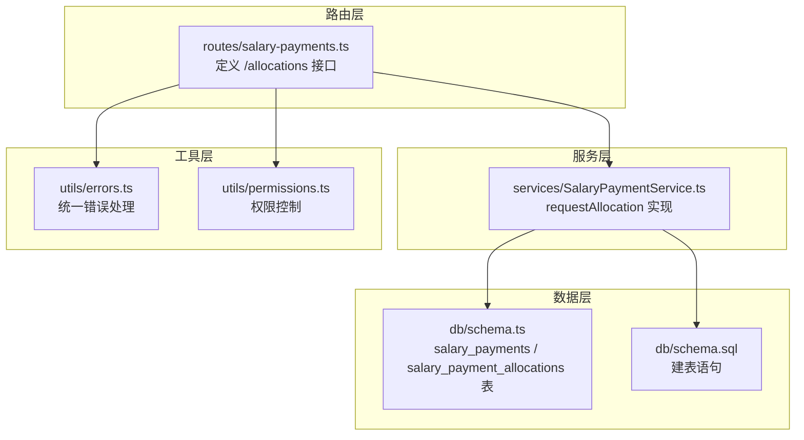
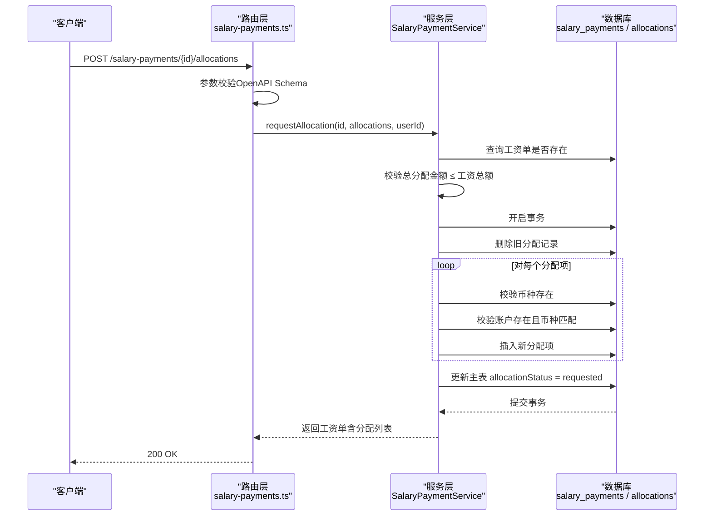
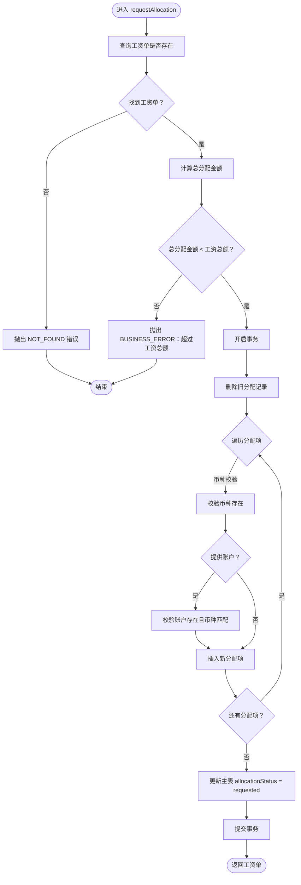
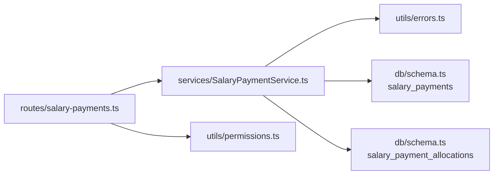

# 货币分配请求

<cite>
**本文引用的文件**
- [SalaryPaymentService.ts](file://backend/src/services/SalaryPaymentService.ts)
- [salary-payments.ts](file://backend/src/routes/salary-payments.ts)
- [business.schema.ts](file://backend/src/schemas/business.schema.ts)
- [schema.ts](file://backend/src/db/schema.ts)
- [schema.sql](file://backend/src/db/schema.sql)
- [errors.ts](file://backend/src/utils/errors.ts)
- [permissions.ts](file://backend/src/utils/permissions.ts)
- [SalaryPaymentService.test.ts](file://backend/test/services/SalaryPaymentService.test.ts)
- [salary-payments.test.ts](file://backend/test/routes/salary-payments.test.ts)
- [openapi.json](file://backend/openapi.json)
</cite>

## 目录
1. [简介](#简介)
2. [项目结构](#项目结构)
3. [核心组件](#核心组件)
4. [架构总览](#架构总览)
5. [详细组件分析](#详细组件分析)
6. [依赖关系分析](#依赖关系分析)
7. [性能考量](#性能考量)
8. [故障排查指南](#故障排查指南)
9. [结论](#结论)
10. [附录](#附录)

## 简介
本文档围绕“POST /api/salary-payments/{id}/allocations”发起的工资发放货币分配请求进行深入解析，重点聚焦于 SalaryPaymentService 中的 requestAllocation 方法实现。内容涵盖：
- 请求参数验证逻辑：总金额与工资总额校验、货币有效性检查、账户与货币匹配验证
- 事务性操作流程：先删除旧的分配记录，再插入新的分配项，并更新主工资单的 allocationStatus 为 requested
- 多币种分配请求示例：在同一工资单上同时分配 USDT 和 USD 并指定不同支付账户
- 常见失败场景与错误处理机制

## 项目结构
后端采用分层设计：
- 路由层：salary-payments.ts 定义 API 接口与参数校验
- 服务层：SalaryPaymentService.ts 实现业务逻辑与数据库事务
- 数据层：schema.ts 定义表结构，schema.sql 提供建表语句
- 工具层：errors.ts 统一错误码与响应格式，permissions.ts 提供权限控制

图表来源
- [salary-payments.ts](file://backend/src/routes/salary-payments.ts#L198-L232)
- [SalaryPaymentService.ts](file://backend/src/services/SalaryPaymentService.ts#L354-L403)
- [schema.ts](file://backend/src/db/schema.ts#L256-L291)
- [schema.sql](file://backend/src/db/schema.sql#L258-L295)
- [errors.ts](file://backend/src/utils/errors.ts#L34-L54)
- [permissions.ts](file://backend/src/utils/permissions.ts#L88-L114)

章节来源
- [salary-payments.ts](file://backend/src/routes/salary-payments.ts#L198-L232)
- [SalaryPaymentService.ts](file://backend/src/services/SalaryPaymentService.ts#L354-L403)
- [schema.ts](file://backend/src/db/schema.ts#L256-L291)
- [schema.sql](file://backend/src/db/schema.sql#L258-L295)

## 核心组件
- 路由层：salary-payments.ts 的 /allocations POST 路由负责接收请求、参数校验与调用服务层
- 服务层：SalaryPaymentService.requestAllocation 负责验证、事务执行与状态更新
- 数据层：salary_payments 与 salary_payment_allocations 表承载工资单与分配明细
- 工具层：Errors 统一错误码，permissions 控制访问权限

章节来源
- [salary-payments.ts](file://backend/src/routes/salary-payments.ts#L198-L232)
- [SalaryPaymentService.ts](file://backend/src/services/SalaryPaymentService.ts#L354-L403)
- [schema.ts](file://backend/src/db/schema.ts#L256-L291)
- [errors.ts](file://backend/src/utils/errors.ts#L34-L54)

## 架构总览
请求从路由进入，经参数校验后调用服务层方法，服务层在事务内完成旧分配清理、新分配写入与主表状态更新，最终返回带分配详情的工资单对象。

图表来源
- [salary-payments.ts](file://backend/src/routes/salary-payments.ts#L198-L232)
- [SalaryPaymentService.ts](file://backend/src/services/SalaryPaymentService.ts#L354-L403)
- [business.schema.ts](file://backend/src/schemas/business.schema.ts#L453-L463)
- [schema.ts](file://backend/src/db/schema.ts#L256-L291)

## 详细组件分析

### 路由层：/allocations POST
- 路径与方法：POST /salary-payments/{id}/allocations
- 参数校验：使用 requestSalaryAllocationsSchema，要求 allocations 数组非空，每项包含长度为3的 currencyId、正整数 amountCents，accountId 可选
- 权限控制：当前路由未显式检查权限，但其他路由展示了 hasPermission 的使用方式
- 调用服务：将 id、allocations、userId 传入服务层 requestAllocation

章节来源
- [salary-payments.ts](file://backend/src/routes/salary-payments.ts#L198-L232)
- [business.schema.ts](file://backend/src/schemas/business.schema.ts#L453-L463)
- [openapi.json](file://backend/openapi.json#L7095-L7135)

### 服务层：requestAllocation 方法
- 输入：工资单 id、分配数组（币种、金额、可选账户）、申请人 userId
- 校验与事务：
  - 校验总分配金额不超过工资单 salaryCents
  - 在事务内删除旧分配记录
  - 对每个分配项：
    - 校验币种存在
    - 若提供 accountId，则校验账户存在且币种一致
    - 插入新分配项，状态为 pending
  - 更新主表 allocationStatus 为 requested
- 输出：返回包含分配列表的工资单对象

图表来源
- [SalaryPaymentService.ts](file://backend/src/services/SalaryPaymentService.ts#L354-L403)

章节来源
- [SalaryPaymentService.ts](file://backend/src/services/SalaryPaymentService.ts#L354-L403)

### 数据模型与约束
- 主表 salary_payments
  - 关键字段：id、employeeId、year、month、salaryCents、allocationStatus
  - allocationStatus 默认值为 pending，分配请求后更新为 requested
- 明细表 salary_payment_allocations
  - 关键字段：id、salaryPaymentId、currencyId、amountCents、accountId、status
  - status 默认值为 pending

章节来源
- [schema.ts](file://backend/src/db/schema.ts#L256-L291)
- [schema.sql](file://backend/src/db/schema.sql#L258-L295)

### 参数验证与错误处理
- 参数验证
  - OpenAPI Schema 要求 currencyId 为3位字母代码，amountCents 为正整数，allocations 非空
  - 业务层进一步校验总分配金额不得超出工资总额
- 错误处理
  - NOT_FOUND：工资单不存在、币种不存在、账户不存在
  - BUSINESS_ERROR：总分配金额超限、账户币种不匹配、分配请求前需先审批等
  - 统一错误响应格式由 errors.ts 提供

章节来源
- [business.schema.ts](file://backend/src/schemas/business.schema.ts#L453-L463)
- [SalaryPaymentService.ts](file://backend/src/services/SalaryPaymentService.ts#L354-L403)
- [errors.ts](file://backend/src/utils/errors.ts#L34-L54)

### 多币种分配请求示例
- 场景：同一工资单同时分配 USDT 与 USD
- 步骤：
  1) 准备分配数组：包含两条记录，分别指定 currencyId 为 USDT 与 USD，amountCents 分别为对应金额
  2) 可选：为每条记录指定 accountId，确保账户币种与 currencyId 一致
  3) 发起请求：POST /salary-payments/{id}/allocations
  4) 服务层在事务内删除旧分配、插入新分配并更新主表状态为 requested
- 测试参考：后端测试用例展示了单币种分配与后续审批流程

章节来源
- [SalaryPaymentService.test.ts](file://backend/test/services/SalaryPaymentService.test.ts#L78-L104)
- [salary-payments.test.ts](file://backend/test/routes/salary-payments.test.ts#L158-L172)

## 依赖关系分析
- 路由依赖服务层：salary-payments.ts 通过 c.get('services').salaryPayment 调用 requestAllocation
- 服务层依赖数据库：读取工资单、币种、账户，写入分配明细，更新主表
- 服务层依赖错误工具：Errors 统一抛出业务与系统错误
- 服务层依赖权限工具：其他路由展示了 hasPermission 的使用，分配请求路由未显式检查

图表来源
- [salary-payments.ts](file://backend/src/routes/salary-payments.ts#L198-L232)
- [SalaryPaymentService.ts](file://backend/src/services/SalaryPaymentService.ts#L354-L403)
- [errors.ts](file://backend/src/utils/errors.ts#L34-L54)
- [permissions.ts](file://backend/src/utils/permissions.ts#L88-L114)
- [schema.ts](file://backend/src/db/schema.ts#L256-L291)

章节来源
- [salary-payments.ts](file://backend/src/routes/salary-payments.ts#L198-L232)
- [SalaryPaymentService.ts](file://backend/src/services/SalaryPaymentService.ts#L354-L403)
- [errors.ts](file://backend/src/utils/errors.ts#L34-L54)
- [permissions.ts](file://backend/src/utils/permissions.ts#L88-L114)
- [schema.ts](file://backend/src/db/schema.ts#L256-L291)

## 性能考量
- 单次请求批量插入：服务层对每个分配项逐一校验并插入，若分配项较多，建议前端合并合理分批，避免单次请求过大
- 事务边界：整个分配过程在单个事务内完成，保证一致性，但会持有锁直到提交
- 查询优化：币种与账户查询为 O(1) 查找，建议确保相关字段具备索引（如 currencies.code、accounts.id）

## 故障排查指南
- 常见失败场景
  - 工资单不存在：返回 NOT_FOUND
  - 总分配金额超过工资总额：返回 BUSINESS_ERROR
  - 币种不存在：返回 NOT_FOUND
  - 提供了账户但账户币种与币种不一致：返回 BUSINESS_ERROR
  - 账户不存在：返回 NOT_FOUND
- 排查步骤
  - 确认工资单 id 正确且存在
  - 核对 allocations 中各币种是否在系统中启用
  - 核对 accountId 是否存在且与 currencyId 一致
  - 检查请求体格式是否符合 OpenAPI Schema
- 错误响应
  - 统一使用错误码与消息，便于前端提示与日志追踪

章节来源
- [SalaryPaymentService.ts](file://backend/src/services/SalaryPaymentService.ts#L354-L403)
- [errors.ts](file://backend/src/utils/errors.ts#L34-L54)

## 结论
POST /api/salary-payments/{id}/allocations 的分配流程通过严格的参数校验与事务保障，实现了安全可靠的多币种分配能力。服务层在单事务内完成旧记录清理、新记录插入与主表状态更新，确保数据一致性。配合统一的错误处理与权限控制，整体流程清晰、可维护性强。

## 附录
- API 定义参考：openapi.json 中对 /api/salary-payments/{id}/allocations 的请求体与参数进行了规范
- 测试用例参考：后端测试覆盖了分配请求与审批流程的关键路径

章节来源
- [openapi.json](file://backend/openapi.json#L7095-L7135)
- [SalaryPaymentService.test.ts](file://backend/test/services/SalaryPaymentService.test.ts#L78-L104)
- [salary-payments.test.ts](file://backend/test/routes/salary-payments.test.ts#L158-L172)