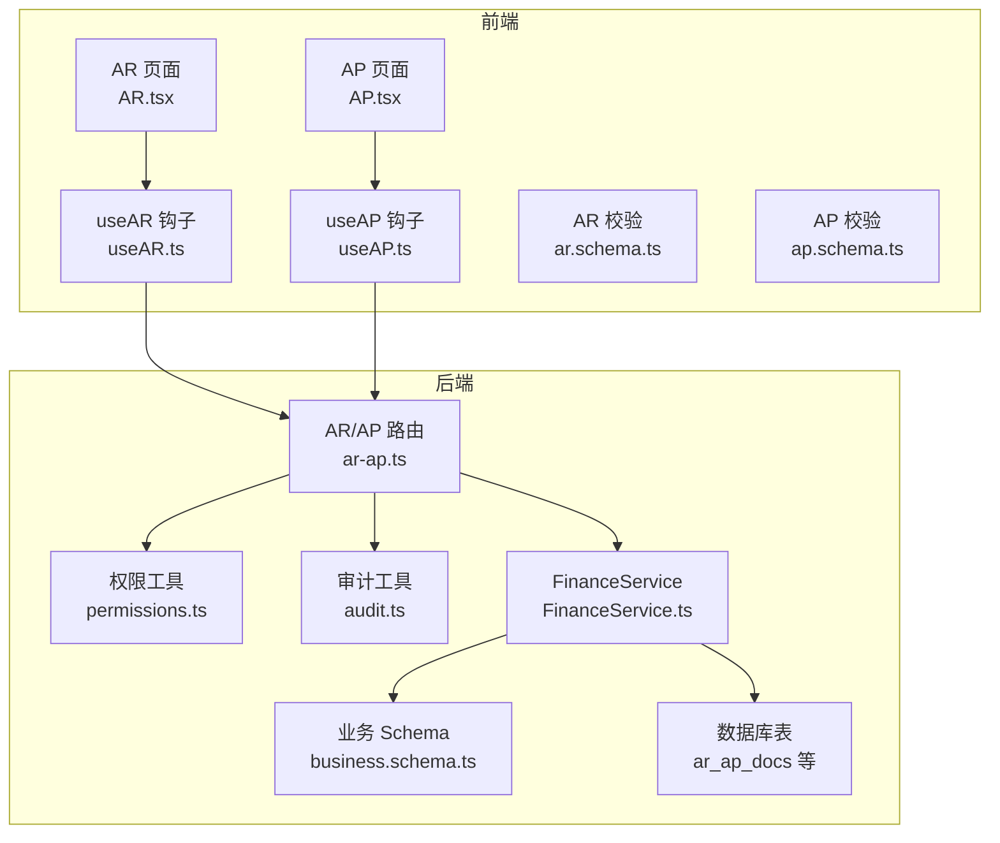
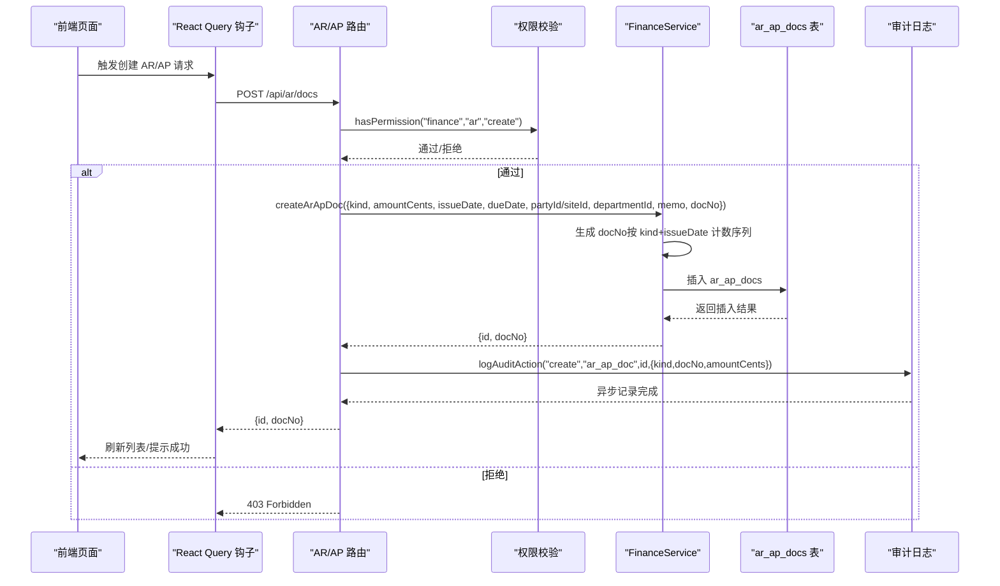
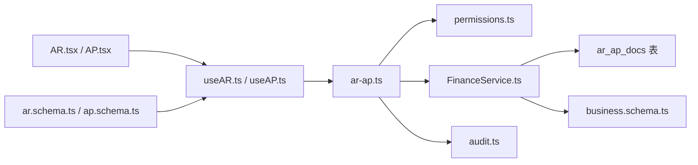
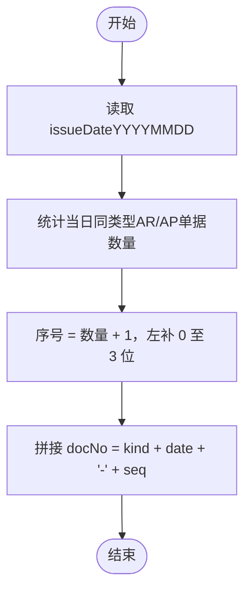
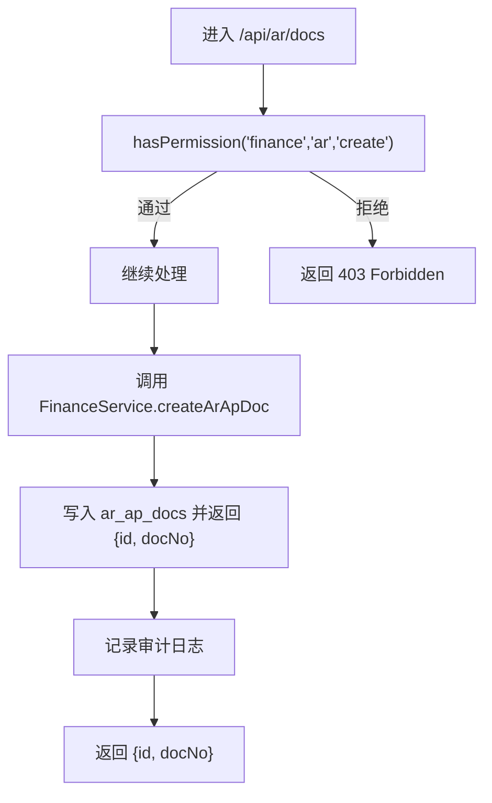

# 创建应收应付账款

<cite>
**本文引用的文件**
- [backend/src/routes/ar-ap.ts](file://backend/src/routes/ar-ap.ts)
- [backend/src/services/FinanceService.ts](file://backend/src/services/FinanceService.ts)
- [backend/src/schemas/business.schema.ts](file://backend/src/schemas/business.schema.ts)
- [backend/src/utils/permissions.ts](file://backend/src/utils/permissions.ts)
- [backend/src/utils/audit.ts](file://backend/src/utils/audit.ts)
- [backend/src/db/schema.ts](file://backend/src/db/schema.ts)
- [frontend/src/validations/ar.schema.ts](file://frontend/src/validations/ar.schema.ts)
- [frontend/src/validations/ap.schema.ts](file://frontend/src/validations/ap.schema.ts)
- [frontend/src/hooks/business/useAR.ts](file://frontend/src/hooks/business/useAR.ts)
- [frontend/src/hooks/business/useAP.ts](file://frontend/src/hooks/business/useAP.ts)
- [frontend/src/features/finance/pages/AR.tsx](file://frontend/src/features/finance/pages/AR.tsx)
- [frontend/src/features/finance/pages/AP.tsx](file://frontend/src/features/finance/pages/AP.tsx)
</cite>

## 目录
1. [简介](#简介)
2. [项目结构](#项目结构)
3. [核心组件](#核心组件)
4. [架构总览](#架构总览)
5. [详细组件分析](#详细组件分析)
6. [依赖关系分析](#依赖关系分析)
7. [性能与并发特性](#性能与并发特性)
8. [故障排查指南](#故障排查指南)
9. [结论](#结论)
10. [附录：示例与最佳实践](#附录示例与最佳实践)

## 简介
本文档面向财务与前端开发人员，系统化说明通过 POST /api/ar/docs 接口创建应收账款（AR）与应付账款（AP）单据的全流程，包括：
- 请求参数与校验规则（amountCents、issueDate、dueDate、partyId/siteId、departmentId、memo 等）
- 单据编号 docNo 的自动生成逻辑（按 AR/AP 类型与开票日期生成唯一编号）
- 权限验证机制（需具备 finance.ar.create 权限）
- 成功响应（返回单据 ID 与单据编号）
- 审计日志记录
- 前端调用示例与常见场景

## 项目结构
后端采用 Hono + Zod OpenAPI 定义路由与校验，FinanceService 提供业务逻辑，权限与审计分别由独立工具模块负责。前端通过 React Query 与 Ant Design 表单驱动调用。

图表来源
- [backend/src/routes/ar-ap.ts](file://backend/src/routes/ar-ap.ts#L1-L184)
- [backend/src/services/FinanceService.ts](file://backend/src/services/FinanceService.ts#L269-L345)
- [backend/src/schemas/business.schema.ts](file://backend/src/schemas/business.schema.ts#L161-L174)
- [backend/src/utils/permissions.ts](file://backend/src/utils/permissions.ts#L80-L114)
- [backend/src/utils/audit.ts](file://backend/src/utils/audit.ts#L61-L92)
- [backend/src/db/schema.ts](file://backend/src/db/schema.ts#L312-L326)

章节来源
- [backend/src/routes/ar-ap.ts](file://backend/src/routes/ar-ap.ts#L1-L184)
- [backend/src/services/FinanceService.ts](file://backend/src/services/FinanceService.ts#L269-L345)
- [backend/src/schemas/business.schema.ts](file://backend/src/schemas/business.schema.ts#L161-L174)
- [backend/src/utils/permissions.ts](file://backend/src/utils/permissions.ts#L80-L114)
- [backend/src/utils/audit.ts](file://backend/src/utils/audit.ts#L61-L92)
- [backend/src/db/schema.ts](file://backend/src/db/schema.ts#L312-L326)

## 核心组件
- 路由层（POST /api/ar/docs）：接收请求、进行权限校验、调用服务层、记录审计日志并返回结果。
- 服务层（FinanceService.createArApDoc）：生成 docNo、写入 ar_ap_docs 表、返回 id 与 docNo。
- 校验层（Zod Schema）：对请求体进行强类型与业务规则校验。
- 权限工具（hasPermission）：基于职位权限矩阵判断是否具备 finance.ar.create 权限。
- 审计工具（logAuditAction）：异步记录操作审计，包含用户、实体、详情与 IP 信息。
- 数据模型（ar_ap_docs 表）：存储 AR/AP 单据的核心字段。

章节来源
- [backend/src/routes/ar-ap.ts](file://backend/src/routes/ar-ap.ts#L140-L184)
- [backend/src/services/FinanceService.ts](file://backend/src/services/FinanceService.ts#L269-L345)
- [backend/src/schemas/business.schema.ts](file://backend/src/schemas/business.schema.ts#L161-L174)
- [backend/src/utils/permissions.ts](file://backend/src/utils/permissions.ts#L80-L114)
- [backend/src/utils/audit.ts](file://backend/src/utils/audit.ts#L61-L92)
- [backend/src/db/schema.ts](file://backend/src/db/schema.ts#L312-L326)

## 架构总览
下图展示从前端到后端的调用链路与关键处理步骤。

图表来源
- [backend/src/routes/ar-ap.ts](file://backend/src/routes/ar-ap.ts#L140-L184)
- [backend/src/services/FinanceService.ts](file://backend/src/services/FinanceService.ts#L269-L345)
- [backend/src/utils/permissions.ts](file://backend/src/utils/permissions.ts#L80-L114)
- [backend/src/utils/audit.ts](file://backend/src/utils/audit.ts#L61-L92)
- [backend/src/db/schema.ts](file://backend/src/db/schema.ts#L312-L326)

## 详细组件分析

### 接口定义与请求参数
- 接口路径：POST /api/ar/docs
- 功能：创建 AR/AP 单据
- 请求体字段（来自 Zod Schema）：
  - kind：枚举值 AR/AP
  - partyId：相关方 ID（可选）
  - siteId：站点 ID（可选）
  - departmentId：部门 ID（可选）
  - issueDate：开票日期（可选，默认取当前日期）
  - dueDate：到期日期（可选）
  - amountCents：金额（分，必须为正整数）
  - docNo：单据编号（可选，未提供时由后端生成）
  - memo：备注（可选）

章节来源
- [backend/src/routes/ar-ap.ts](file://backend/src/routes/ar-ap.ts#L140-L184)
- [backend/src/schemas/business.schema.ts](file://backend/src/schemas/business.schema.ts#L161-L174)

### 单据编号生成逻辑（docNo）
- 生成策略：基于单据类型（AR/AP）与 issueDate（YYYY-MM-DD）统计当天同类型的数量，序号从 001 开始递增，最终格式为 "{kind}{dateWithoutHyphen}-{seq}"。
- 示例：
  - AR20250405-001
  - AP20250405-001
- 生成位置：FinanceService.getNextDocNo

章节来源
- [backend/src/services/FinanceService.ts](file://backend/src/services/FinanceService.ts#L269-L282)

### 权限验证机制
- 路由层在处理 POST /api/ar/docs 前调用 hasPermission(c, 'finance', 'ar', 'create') 进行鉴权。
- 若无权限，直接抛出 403 Forbidden。
- 权限来源：职位权限矩阵（permissions 字段），支持模块级与子模块级权限控制。

章节来源
- [backend/src/routes/ar-ap.ts](file://backend/src/routes/ar-ap.ts#L166-L166)
- [backend/src/utils/permissions.ts](file://backend/src/utils/permissions.ts#L80-L114)

### 审计日志记录
- 成功创建后，路由层调用 logAuditAction 记录审计事件，包含：
  - actorId：当前用户 ID
  - action：create
  - entity：ar_ap_doc
  - entityId：新创建单据 ID
  - detail：JSON 字符串（包含 kind、docNo、amountCents）
- 审计日志异步写入，避免阻塞主流程。

章节来源
- [backend/src/routes/ar-ap.ts](file://backend/src/routes/ar-ap.ts#L181-L182)
- [backend/src/utils/audit.ts](file://backend/src/utils/audit.ts#L61-L92)

### 数据模型与状态
- ar_ap_docs 表字段要点：
  - id、kind、partyId、siteId、departmentId、issueDate、dueDate、amountCents、docNo、memo、status、createdAt、updatedAt
- 默认状态：创建时 status 设为 open
- docNo 唯一性：由生成逻辑保证同一日期同类型唯一

章节来源
- [backend/src/db/schema.ts](file://backend/src/db/schema.ts#L312-L326)
- [backend/src/services/FinanceService.ts](file://backend/src/services/FinanceService.ts#L329-L345)

### 前端调用与表单校验
- AR 页面（AR.tsx）与 AP 页面（AP.tsx）分别通过 useAR/useAP 钩子发起 POST /api/ar/docs 请求。
- 前端表单校验：
  - AR：siteId、issueDate、dueDate、amount、memo
  - AP：party、issueDate、dueDate、amount、memo
- 前端将金额从元转换为分（乘以 100），日期格式化为 YYYY-MM-DD。

章节来源
- [frontend/src/features/finance/pages/AR.tsx](file://frontend/src/features/finance/pages/AR.tsx#L53-L66)
- [frontend/src/features/finance/pages/AP.tsx](file://frontend/src/features/finance/pages/AP.tsx#L40-L56)
- [frontend/src/hooks/business/useAR.ts](file://frontend/src/hooks/business/useAR.ts#L43-L52)
- [frontend/src/hooks/business/useAP.ts](file://frontend/src/hooks/business/useAP.ts#L19-L28)
- [frontend/src/validations/ar.schema.ts](file://frontend/src/validations/ar.schema.ts#L1-L30)
- [frontend/src/validations/ap.schema.ts](file://frontend/src/validations/ap.schema.ts#L1-L23)

## 依赖关系分析
- 路由依赖：
  - 权限工具：用于鉴权
  - 服务层：用于业务处理
  - 审计工具：用于记录审计
- 服务层依赖：
  - 数据库（ar_ap_docs 表）
  - Zod Schema（输入校验）
- 前端依赖：
  - React Query 钩子
  - Ant Design 表单
  - Zod 校验器

图表来源
- [backend/src/routes/ar-ap.ts](file://backend/src/routes/ar-ap.ts#L140-L184)
- [backend/src/services/FinanceService.ts](file://backend/src/services/FinanceService.ts#L269-L345)
- [backend/src/utils/permissions.ts](file://backend/src/utils/permissions.ts#L80-L114)
- [backend/src/utils/audit.ts](file://backend/src/utils/audit.ts#L61-L92)
- [backend/src/db/schema.ts](file://backend/src/db/schema.ts#L312-L326)
- [frontend/src/hooks/business/useAR.ts](file://frontend/src/hooks/business/useAR.ts#L43-L52)
- [frontend/src/hooks/business/useAP.ts](file://frontend/src/hooks/business/useAP.ts#L19-L28)
- [frontend/src/validations/ar.schema.ts](file://frontend/src/validations/ar.schema.ts#L1-L30)
- [frontend/src/validations/ap.schema.ts](file://frontend/src/validations/ap.schema.ts#L1-L23)

## 性能与并发特性
- 单据编号生成采用数据库计数方式，按 kind+issueDate 聚合，序列号从 001 递增，天然具备原子性与唯一性。
- 审计日志通过异步等待（waitUntil）提交，不影响主请求响应时间。
- 前端使用 React Query 缓存与失效策略，减少重复请求。

章节来源
- [backend/src/services/FinanceService.ts](file://backend/src/services/FinanceService.ts#L269-L282)
- [backend/src/utils/audit.ts](file://backend/src/utils/audit.ts#L61-L92)

## 故障排查指南
- 403 Forbidden：检查当前用户是否具备 finance.ar.create 权限；确认职位权限矩阵配置正确。
- 参数校验失败：检查请求体字段类型与约束（如 amountCents 必须为正整数、日期格式、kind 仅限 AR/AP）。
- docNo 重复或异常：确认 issueDate 与 kind 是否正确；若手动传入 docNo，请确保唯一性。
- 审计日志缺失：确认执行上下文存在 waitUntil；检查审计工具日志输出。

章节来源
- [backend/src/routes/ar-ap.ts](file://backend/src/routes/ar-ap.ts#L166-L166)
- [backend/src/schemas/business.schema.ts](file://backend/src/schemas/business.schema.ts#L161-L174)
- [backend/src/utils/audit.ts](file://backend/src/utils/audit.ts#L61-L92)

## 结论
POST /api/ar/docs 是创建 AR/AP 单据的统一入口，具备完善的权限控制、强类型校验、自动编号与审计记录能力。前端通过表单与钩子简化调用流程，建议在生产环境严格遵循权限与校验规则，确保数据一致性与合规性。

## 附录：示例与最佳实践

### 请求参数与验证规则摘要
- kind：AR/AP
- amountCents：正整数（分）
- issueDate：可选，默认当天
- dueDate：可选
- partyId/siteId/departmentId：可选，用于关联相关方/站点/部门
- memo：可选
- docNo：可选，未提供时由后端生成

章节来源
- [backend/src/schemas/business.schema.ts](file://backend/src/schemas/business.schema.ts#L161-L174)

### 单据编号生成流程（算法）

图表来源
- [backend/src/services/FinanceService.ts](file://backend/src/services/FinanceService.ts#L269-L282)

### 权限检查流程

图表来源
- [backend/src/routes/ar-ap.ts](file://backend/src/routes/ar-ap.ts#L166-L182)
- [backend/src/utils/permissions.ts](file://backend/src/utils/permissions.ts#L80-L114)

### 前端调用示例（概念性）
- AR 新建：
  - 路径：POST /api/ar/docs
  - 请求体：{ kind: "AR", siteId, issueDate, dueDate, amountCents, memo }
  - 成功响应：{ id, docNo }
- AP 新建：
  - 路径：POST /api/ar/docs
  - 请求体：{ kind: "AP", partyId, issueDate, dueDate, amountCents, memo }
  - 成功响应：{ id, docNo }

章节来源
- [frontend/src/features/finance/pages/AR.tsx](file://frontend/src/features/finance/pages/AR.tsx#L53-L66)
- [frontend/src/features/finance/pages/AP.tsx](file://frontend/src/features/finance/pages/AP.tsx#L40-L56)
- [frontend/src/hooks/business/useAR.ts](file://frontend/src/hooks/business/useAR.ts#L43-L52)
- [frontend/src/hooks/business/useAP.ts](file://frontend/src/hooks/business/useAP.ts#L19-L28)