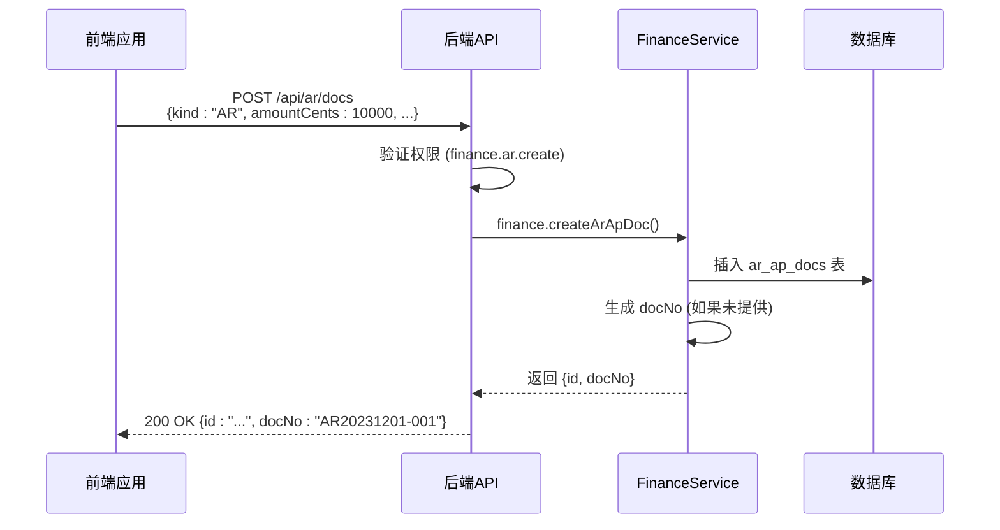
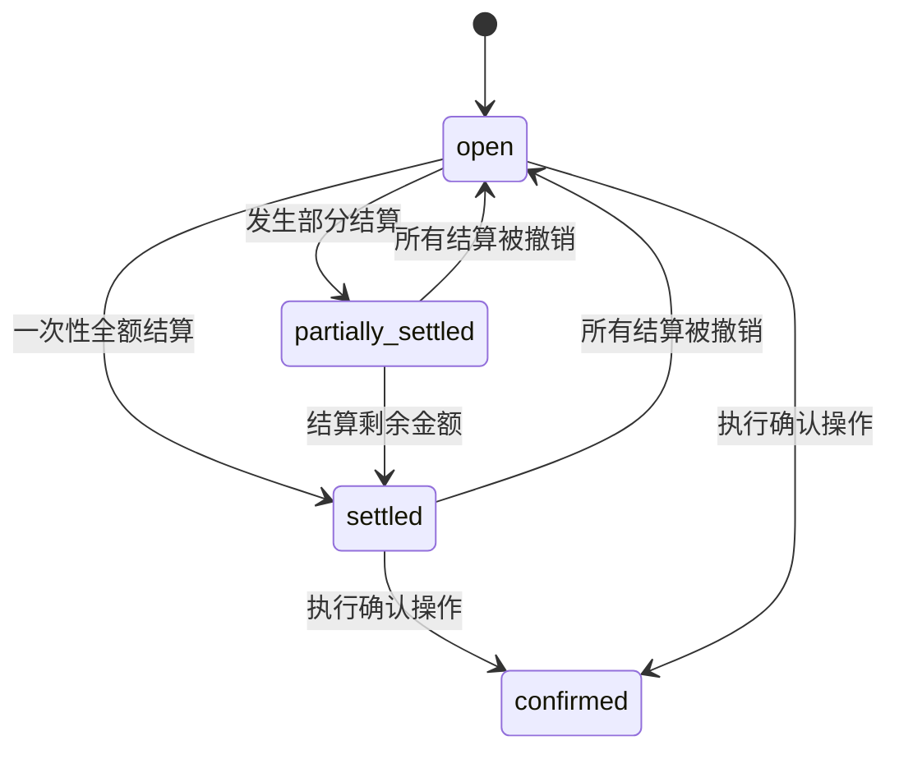
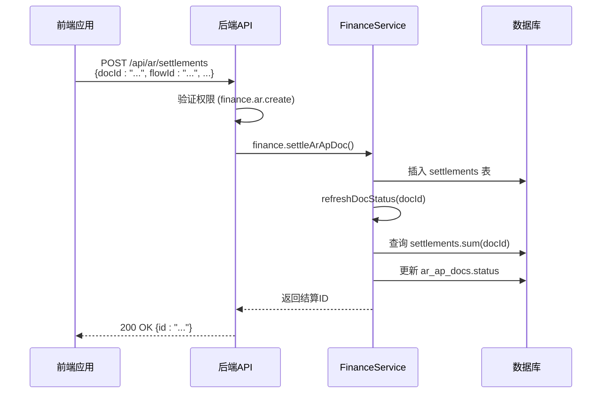
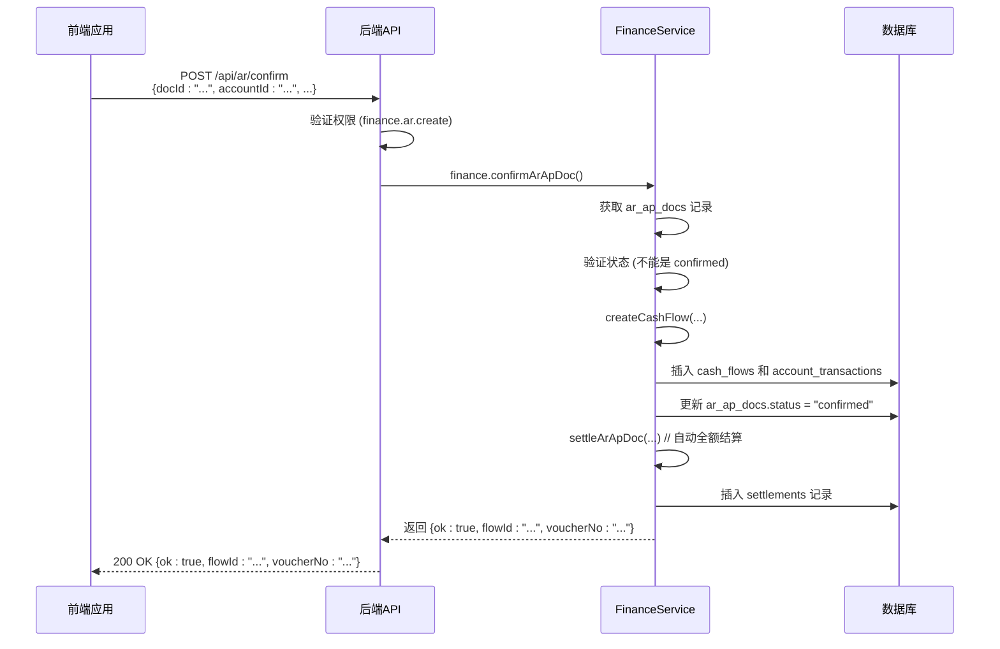
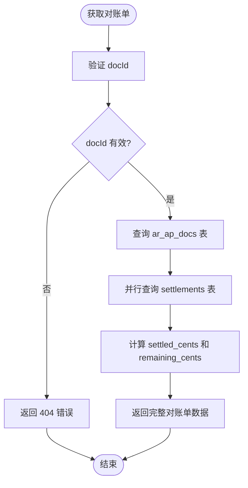

# 应收应付账款

<cite>
**本文档引用的文件**   
- [ar-ap.ts](file://backend/src/routes/ar-ap.ts)
- [business.schema.ts](file://backend/src/schemas/business.schema.ts)
- [FinanceService.ts](file://backend/src/services/FinanceService.ts)
- [schema.ts](file://backend/src/db/schema.ts)
- [AR.tsx](file://frontend/src/features/finance/pages/AR.tsx)
- [AP.tsx](file://frontend/src/features/finance/pages/AP.tsx)
- [ar.schema.ts](file://frontend/src/validations/ar.schema.ts)
- [ap.schema.ts](file://frontend/src/validations/ap.schema.ts)
- [api.ts](file://frontend/src/config/api.ts)
- [useAR.ts](file://frontend/src/hooks/business/useAR.ts)
- [useAP.ts](file://frontend/src/hooks/business/useAP.ts)
- [business.ts](file://frontend/src/types/business.ts)
</cite>

## 目录
1. [简介](#简介)
2. [创建应收应付账款单据](#创建应收应付账款单据)
3. [单据状态机](#单据状态机)
4. [结算机制](#结算机制)
5. [确认流程](#确认流程)
6. [查询与报表](#查询与报表)
7. [完整示例](#完整示例)

## 简介
应收应付账款（AR/AP）模块是财务系统的核心功能，用于管理企业与客户（应收账款AR）和供应商（应付账款AP）之间的财务往来。该模块通过RESTful API提供创建、查询、结算和确认单据的功能，确保财务数据的准确性和可追溯性。系统通过状态机严格管理单据的生命周期，并通过与现金流记录的关联，实现从应收应付到实际收入/支出的转化。

**Section sources**
- [ar-ap.ts](file://backend/src/routes/ar-ap.ts#L1-L353)
- [business.schema.ts](file://backend/src/schemas/business.schema.ts#L164-L174)

## 创建应收应付账款单据
通过 `POST /api/ar/docs` 接口创建新的应收（AR）或应付（AP）单据。请求体必须包含以下字段：

- **kind**: 单据类型，必须为 `AR` (应收账款) 或 `AP` (应付账款)。
- **amountCents**: 金额，以分为单位的整数，必须大于0。
- **issueDate**: 开票日期，格式为 `YYYY-MM-DD`。
- **dueDate**: 到期日期，格式为 `YYYY-MM-DD`，可选。
- **partyId**: 相关方ID，对于AR是客户ID，对于AP是供应商ID，可选。
- **siteId**: 站点ID，用于关联业务发生地，可选。
- **departmentId**: 部门ID，用于成本中心核算，可选。
- **docNo**: 单据编号，可选。如果未提供，系统将根据日期和类型自动生成（如 `AR20231201-001`）。
- **memo**: 备注信息，可选。

成功创建后，API将返回新单据的ID和单据编号。



**Diagram sources **
- [ar-ap.ts](file://backend/src/routes/ar-ap.ts#L140-L183)
- [FinanceService.ts](file://backend/src/services/FinanceService.ts#L314-L345)
- [schema.ts](file://backend/src/db/schema.ts#L312-L326)

## 单据状态机
应收应付账款单据遵循严格的状态流转逻辑，确保财务流程的合规性。状态机定义了单据从创建到最终确认的完整生命周期。

### 状态定义
- **open (开放)**: 单据已创建，但尚未进行任何结算或确认。
- **partially_settled (部分结算)**: 单据已收到部分款项，但未完全结清。
- **settled (已结算)**: 单据的全部金额已通过结算记录核销。
- **confirmed (已确认)**: 单据已确认，生成了对应的现金流记录，并完成了最终的财务入账。

### 状态流转逻辑
状态流转由系统自动触发，不可手动修改。核心逻辑如下：

1.  **初始状态**: 所有新创建的单据状态均为 `open`。
2.  **结算触发状态变更**:
    *   当单据的**已结算金额**等于其**总金额**时，状态自动变为 `settled`。
    *   当单据的**已结算金额**大于0但小于总金额时，状态变为 `partially_settled`。
    *   如果已结算金额再次变为0（例如，所有结算被撤销），状态将回退到 `open`。
3.  **确认操作**:
    *   只有状态为 `open` 或 `settled` 的单据才能被确认。
    *   一旦执行确认操作，单据状态将直接变为 `confirmed`，并锁定，不可再进行结算或修改。



**Diagram sources **
- [FinanceService.ts](file://backend/src/services/FinanceService.ts#L347-L366)
- [schema.ts](file://backend/src/db/schema.ts#L323)

## 结算机制
结算（Settlement）是将应收/应付单据与具体的现金流记录（Cash Flow）关联起来的过程，用于核销债务或确认收款。

### 结算流程
通过 `POST /api/ar/settlements` 接口进行结算。请求体包含：
- **docId**: 要结算的应收/应付单据ID。
- **flowId**: 关联的现金流记录ID（例如，一笔收款或付款记录）。
- **settleAmountCents**: 本次结算的金额（以分为单位）。
- **settleDate**: 结算日期，可选，默认为当前日期。

### 核心逻辑
1.  **创建结算记录**: 系统在 `settlements` 表中创建一条新记录，关联 `docId` 和 `flowId`。
2.  **更新单据状态**: 系统调用 `refreshDocStatus(docId)` 方法，重新计算该单据的总已结算金额，并根据计算结果自动更新单据状态（`open` -> `partially_settled` -> `settled`）。
3.  **幂等性**: 同一笔现金流记录（`flowId`）可以分多次结算不同的单据，但不能对同一单据重复结算。



**Diagram sources **
- [ar-ap.ts](file://backend/src/routes/ar-ap.ts#L216-L255)
- [FinanceService.ts](file://backend/src/services/FinanceService.ts#L368-L386)
- [schema.ts](file://backend/src/db/schema.ts#L397-L404)

## 确认流程
确认（Confirm）是应收应付账款流程的最终步骤，它将一笔应收/应付单据正式转化为一笔实际的收入或支出，并生成相应的现金流记录。

### 确认流程
通过 `POST /api/ar/confirm` 接口进行确认。请求体包含：
- **docId**: 要确认的应收/应付单据ID。
- **accountId**: 关联的银行或现金账户ID。
- **categoryId**: 关联的收入/支出类别ID。
- **bizDate**: 业务发生日期。
- **voucherUrl**: 凭证文件的URL（必须上传）。
- **method**: 支付方式，可选。
- **memo**: 备注，可选。

### 核心逻辑
1.  **验证**: 检查单据是否存在且未被确认。
2.  **创建现金流**: 调用 `createCashFlow` 方法，根据单据的 `kind` (AR->income, AP->expense) 创建一笔新的现金流记录。
3.  **更新单据状态**: 将单据状态直接更新为 `confirmed`。
4.  **自动结算**: 系统会自动调用 `settleArApDoc` 方法，使用上一步创建的现金流记录（`flowId`）对单据进行全额结算，确保状态机的完整性。



**Diagram sources **
- [ar-ap.ts](file://backend/src/routes/ar-ap.ts#L302-L348)
- [FinanceService.ts](file://backend/src/services/FinanceService.ts#L388-L435)
- [schema.ts](file://backend/src/db/schema.ts#L165-L181)

## 查询与报表
系统提供了丰富的API来查询应收应付账款单据及其相关数据。

### 获取单据列表
- **API**: `GET /api/ar/docs`
- **参数**:
    - `kind`: 过滤类型 (`AR` 或 `AP`)。
    - `status`: 过滤状态。
- **返回**: 包含单据列表的JSON对象，每个单据对象都包含 `settled_cents` (已结算金额) 和 `status` (状态) 字段。

### 获取对账单 (Statement)
- **API**: `GET /api/ar/statement?docId={id}`
- **返回**: 返回单据的详细信息、所有相关的结算记录、总已结算金额和剩余金额。



**Diagram sources **
- [ar-ap.ts](file://backend/src/routes/ar-ap.ts#L258-L298)
- [FinanceService.ts](file://backend/src/services/FinanceService.ts#L284-L312)

## 完整示例
以下是一个完整的业务流程示例，展示如何创建、结算和确认一笔应收账款。

### 1. 创建应收账款
```http
POST /api/ar/docs
Content-Type: application/json

{
  "kind": "AR",
  "amountCents": 50000,
  "issueDate": "2023-12-01",
  "dueDate": "2023-12-31",
  "siteId": "site-001",
  "memo": "12月服务费"
}
```
**响应**:
```json
{
  "id": "ar-123",
  "docNo": "AR20231201-001"
}
```

### 2. 查询单据列表
```http
GET /api/ar/docs?kind=AR
```
**响应**:
```json
{
  "results": [
    {
      "id": "ar-123",
      "kind": "AR",
      "docNo": "AR20231201-001",
      "issueDate": "2023-12-01",
      "dueDate": "2023-12-31",
      "amountCents": 50000,
      "status": "open",
      "settled_cents": 0,
      "siteName": "北京分公司"
    }
  ]
}
```

### 3. 进行部分结算
```http
POST /api/ar/settlements
Content-Type: application/json

{
  "docId": "ar-123",
  "flowId": "flow-456",
  "settleAmountCents": 20000,
  "settleDate": "2023-12-15"
}
```
**响应**:
```json
{
  "id": "settle-789"
}
```
此时，单据状态变为 `partially_settled`。

### 4. 确认单据
```http
POST /api/ar/confirm
Content-Type: application/json

{
  "docId": "ar-123",
  "accountId": "acc-001",
  "categoryId": "cat-002",
  "bizDate": "2023-12-31",
  "voucherUrl": "https://example.com/vouchers/inv-123.webp",
  "memo": "12月服务费确认"
}
```
**响应**:
```json
{
  "ok": true,
  "flowId": "flow-001",
  "voucherNo": "JZ20231231-001"
}
```
此时，单据状态变为 `confirmed`，并生成了一笔ID为 `flow-001` 的收入记录。