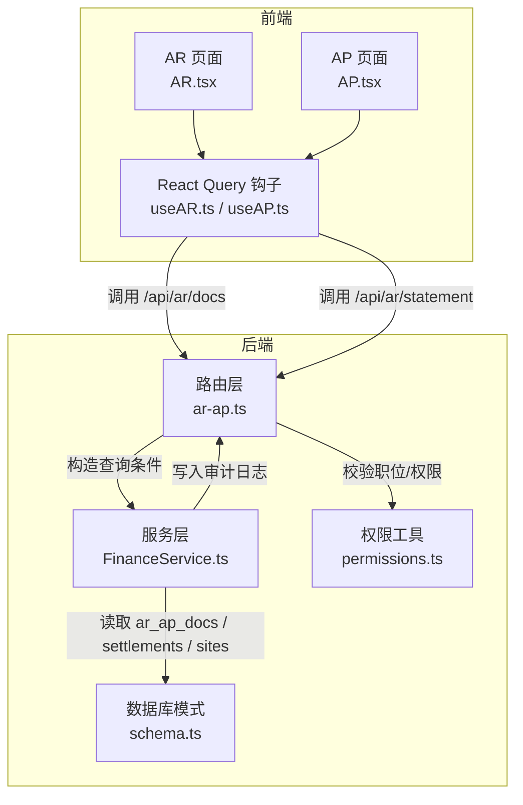
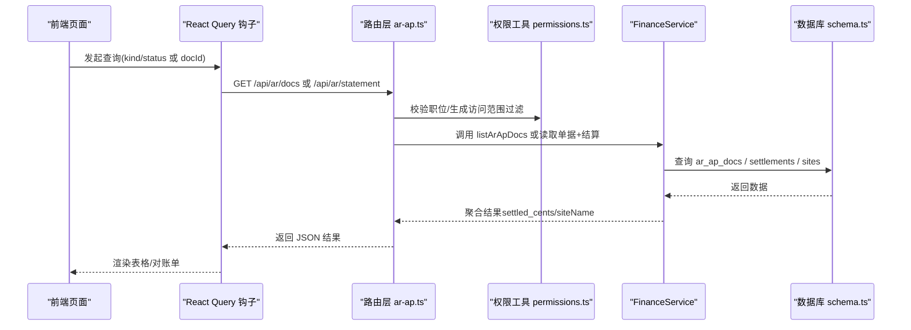
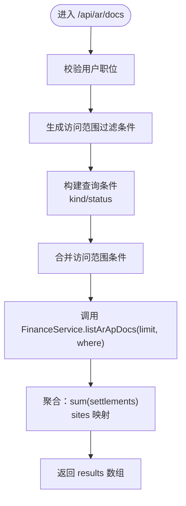
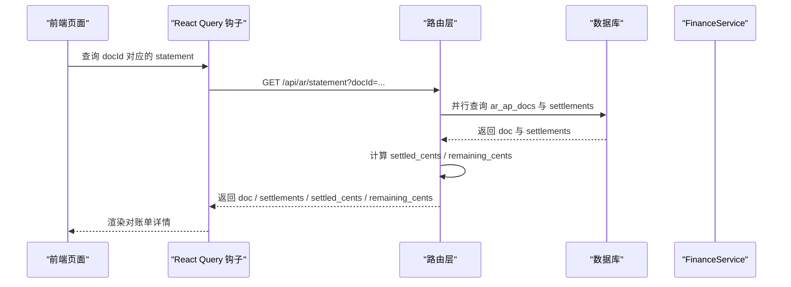
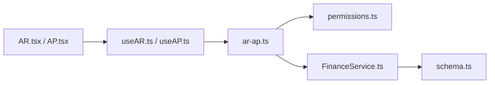

# 查询应收应付账款

<cite>
**本文引用的文件**
- [backend/src/routes/ar-ap.ts](file://backend/src/routes/ar-ap.ts)
- [backend/src/services/FinanceService.ts](file://backend/src/services/FinanceService.ts)
- [backend/src/db/schema.ts](file://backend/src/db/schema.ts)
- [backend/src/utils/permissions.ts](file://backend/src/utils/permissions.ts)
- [backend/src/schemas/business.schema.ts](file://backend/src/schemas/business.schema.ts)
- [frontend/src/features/finance/pages/AR.tsx](file://frontend/src/features/finance/pages/AR.tsx)
- [frontend/src/features/finance/pages/AP.tsx](file://frontend/src/features/finance/pages/AP.tsx)
- [frontend/src/hooks/business/useAR.ts](file://frontend/src/hooks/business/useAR.ts)
- [frontend/src/hooks/business/useAP.ts](file://frontend/src/hooks/business/useAP.ts)
- [frontend/src/types/schema.d.ts](file://frontend/src/types/schema.d.ts)
</cite>

## 目录
1. [简介](#简介)
2. [项目结构](#项目结构)
3. [核心组件](#核心组件)
4. [架构总览](#架构总览)
5. [详细组件分析](#详细组件分析)
6. [依赖关系分析](#依赖关系分析)
7. [性能考量](#性能考量)
8. [故障排查指南](#故障排查指南)
9. [结论](#结论)
10. [附录](#附录)

## 简介
本文件面向“应收应付账款查询”功能，围绕以下目标展开：
- 通过 GET /api/ar/docs 接口查询应收账款与应付账款单据列表，并支持按单据类型 kind（AR/AP）与状态 status 过滤。
- 解释数据访问权限控制机制：系统基于用户职位层级自动过滤可见范围。
- 描述返回数据结构：单据基本信息（id、kind、docNo、amountCents 等）及扩展字段（settled_cents、siteName）。
- 通过 GET /api/ar/statement 获取单据对账单：包含单据信息、全部结算记录、已结算金额与剩余金额。
- 提供典型查询场景示例：按类型过滤、按状态过滤、获取特定单据对账单，以及请求参数与响应数据说明。

## 项目结构
后端采用 Hono + Drizzle ORM 的轻量架构，路由层负责接口定义与鉴权/过滤，服务层封装数据库访问逻辑，前端通过 React Query 钩子调用接口并渲染表格与详情。



图表来源
- [backend/src/routes/ar-ap.ts](file://backend/src/routes/ar-ap.ts#L57-L137)
- [backend/src/services/FinanceService.ts](file://backend/src/services/FinanceService.ts#L284-L312)
- [backend/src/db/schema.ts](file://backend/src/db/schema.ts#L312-L404)
- [backend/src/utils/permissions.ts](file://backend/src/utils/permissions.ts#L266-L323)
- [frontend/src/features/finance/pages/AR.tsx](file://frontend/src/features/finance/pages/AR.tsx#L1-L339)
- [frontend/src/features/finance/pages/AP.tsx](file://frontend/src/features/finance/pages/AP.tsx#L1-L247)
- [frontend/src/hooks/business/useAR.ts](file://frontend/src/hooks/business/useAR.ts#L1-L41)
- [frontend/src/hooks/business/useAP.ts](file://frontend/src/hooks/business/useAP.ts#L1-L41)

章节来源
- [backend/src/routes/ar-ap.ts](file://backend/src/routes/ar-ap.ts#L57-L137)
- [backend/src/services/FinanceService.ts](file://backend/src/services/FinanceService.ts#L284-L312)
- [backend/src/db/schema.ts](file://backend/src/db/schema.ts#L312-L404)
- [backend/src/utils/permissions.ts](file://backend/src/utils/permissions.ts#L266-L323)
- [frontend/src/features/finance/pages/AR.tsx](file://frontend/src/features/finance/pages/AR.tsx#L1-L339)
- [frontend/src/features/finance/pages/AP.tsx](file://frontend/src/features/finance/pages/AP.tsx#L1-L247)
- [frontend/src/hooks/business/useAR.ts](file://frontend/src/hooks/business/useAR.ts#L1-L41)
- [frontend/src/hooks/business/useAP.ts](file://frontend/src/hooks/business/useAP.ts#L1-L41)

## 核心组件
- 路由与接口
  - GET /api/ar/docs：查询 AR/AP 单据列表，支持 kind、status 过滤，返回扩展字段 settled_cents、siteName。
  - GET /api/ar/statement：获取单据对账单，返回单据、结算记录、已结算金额与剩余金额。
- 服务层
  - FinanceService.listArApDocs：聚合单据、结算汇总与站点名称，返回扩展结果。
  - FinanceService.refreshDocStatus：根据结算总额刷新单据状态。
- 数据库模式
  - ar_ap_docs：单据主表（kind、docNo、amountCents、status 等）。
  - settlements：结算记录表（docId、flowId、settleAmountCents 等）。
  - sites：站点表（用于映射 siteName）。
- 权限与访问控制
  - getDataAccessFilter：依据用户职位层级生成 SQL 过滤条件，确保用户仅能看到其授权范围内的数据。

章节来源
- [backend/src/routes/ar-ap.ts](file://backend/src/routes/ar-ap.ts#L57-L137)
- [backend/src/routes/ar-ap.ts](file://backend/src/routes/ar-ap.ts#L258-L300)
- [backend/src/services/FinanceService.ts](file://backend/src/services/FinanceService.ts#L284-L312)
- [backend/src/services/FinanceService.ts](file://backend/src/services/FinanceService.ts#L347-L366)
- [backend/src/db/schema.ts](file://backend/src/db/schema.ts#L312-L404)
- [backend/src/utils/permissions.ts](file://backend/src/utils/permissions.ts#L266-L323)

## 架构总览
下图展示从前端到后端接口、服务层与数据库的整体流程，以及权限过滤与数据聚合的关键节点。



图表来源
- [backend/src/routes/ar-ap.ts](file://backend/src/routes/ar-ap.ts#L57-L137)
- [backend/src/routes/ar-ap.ts](file://backend/src/routes/ar-ap.ts#L258-L300)
- [backend/src/utils/permissions.ts](file://backend/src/utils/permissions.ts#L266-L323)
- [backend/src/services/FinanceService.ts](file://backend/src/services/FinanceService.ts#L284-L312)
- [backend/src/db/schema.ts](file://backend/src/db/schema.ts#L312-L404)

## 详细组件分析

### 接口一：GET /api/ar/docs（查询单据列表）
- 请求参数
  - kind：可选，枚举 AR/AP，用于按单据类型过滤。
  - status：可选，字符串，用于按单据状态过滤。
- 访问控制
  - 路由层先校验用户职位存在性，再通过 getDataAccessFilter 生成 SQL 过滤条件，确保用户仅能看到其授权范围内的数据。
- 处理逻辑
  - 将 kind、status 作为额外条件拼接到 where 子句中。
  - 使用 FinanceService.listArApDocs(limit, whereClause) 聚合：
    - 单据基础信息
    - 每笔单据的已结算金额（按 docId 求和）
    - 站点名称（按 siteId 映射）
- 响应结构
  - results：数组，每项包含：
    - id、kind、docNo、partyId、siteId、departmentId、issueDate、dueDate、amountCents、status、memo、createdAt
    - settled_cents：已结算金额（整数分）
    - siteName：站点名称（字符串或 null）



图表来源
- [backend/src/routes/ar-ap.ts](file://backend/src/routes/ar-ap.ts#L80-L136)
- [backend/src/services/FinanceService.ts](file://backend/src/services/FinanceService.ts#L284-L312)
- [backend/src/utils/permissions.ts](file://backend/src/utils/permissions.ts#L266-L323)

章节来源
- [backend/src/routes/ar-ap.ts](file://backend/src/routes/ar-ap.ts#L57-L137)
- [backend/src/services/FinanceService.ts](file://backend/src/services/FinanceService.ts#L284-L312)
- [backend/src/utils/permissions.ts](file://backend/src/utils/permissions.ts#L266-L323)
- [frontend/src/types/schema.d.ts](file://frontend/src/types/schema.d.ts#L2056-L2081)

### 接口二：GET /api/ar/statement（获取单据对账单）
- 请求参数
  - docId：必填，单据 ID（UUID）。
- 处理逻辑
  - 并行查询单据与结算记录，计算已结算金额与剩余金额：
    - settled_cents = sum(settlements.settleAmountCents)
    - remaining_cents = doc.amountCents - settled_cents
- 响应结构
  - doc：单据信息（id、kind、docNo、partyId、siteId、departmentId、issueDate、dueDate、amountCents、status、memo、createdAt）
  - settlements：结算记录数组（id、docId、flowId、settleAmountCents、settleDate、createdAt）
  - settled_cents：已结算金额（整数分）
  - remaining_cents：剩余金额（整数分）



图表来源
- [backend/src/routes/ar-ap.ts](file://backend/src/routes/ar-ap.ts#L258-L300)
- [backend/src/db/schema.ts](file://backend/src/db/schema.ts#L312-L404)

章节来源
- [backend/src/routes/ar-ap.ts](file://backend/src/routes/ar-ap.ts#L258-L300)
- [frontend/src/features/finance/pages/AR.tsx](file://frontend/src/features/finance/pages/AR.tsx#L1-L339)
- [frontend/src/hooks/business/useAR.ts](file://frontend/src/hooks/business/useAR.ts#L1-L41)

### 数据访问权限控制机制
- 用户必须具备有效职位信息，否则拒绝访问。
- 根据职位层级生成访问范围过滤条件：
  - 总部人员（level=1）：可访问全部数据（where='1=1'）。
  - 项目人员（level=2）：仅能访问本项目数据（按 department_id 过滤）。
  - 组长（team_leader）：仅能访问本组数据（按 org_department_id 过滤）。
  - 工程师（team_engineer）：仅能访问自己的数据（按 id 过滤）。
- 当用户不具备有效职位时，过滤条件将强制为 where='1=0'，从而返回空集。

```mermaid
flowchart TD
A["获取用户职位"] --> B{"是否存在职位？"}
B -- 否 --> D["where='1=0'拒绝访问"]
B -- 是 --> C{"职位层级"}
C --> |总部(level=1)| E["where='1=1'全部可见"]
C --> |项目(level=2)| F["where=department_id=?"]
C --> |组长(team_leader)| G["where=org_department_id=?"]
C --> |工程师(team_engineer)| H["where=id=?"]
```

图表来源
- [backend/src/utils/permissions.ts](file://backend/src/utils/permissions.ts#L266-L323)
- [backend/src/routes/ar-ap.ts](file://backend/src/routes/ar-ap.ts#L80-L101)

章节来源
- [backend/src/utils/permissions.ts](file://backend/src/utils/permissions.ts#L266-L323)
- [backend/src/routes/ar-ap.ts](file://backend/src/routes/ar-ap.ts#L80-L101)

### 数据模型与字段说明
- ar_ap_docs（单据主表）
  - 字段：id、kind（AR/AP）、docNo、partyId、siteId、departmentId、issueDate、dueDate、amountCents、status、memo、createdAt
- settlements（结算记录）
  - 字段：id、docId、flowId、settleAmountCents、settleDate、createdAt
- sites（站点）
  - 字段：id、name、siteCode 等（用于映射 siteName）

章节来源
- [backend/src/db/schema.ts](file://backend/src/db/schema.ts#L312-L404)

### 前端集成与示例
- AR 页面
  - 使用 useARDocs 通过 GET /api/ar/docs?kind=AR 获取应收列表。
  - 使用 useARStatement 通过 GET /api/ar/statement?docId=... 获取对账单。
- AP 页面
  - 使用 useAPDocs 通过 GET /api/ar/docs?kind=AP 获取应付列表。
- 示例请求与响应（路径引用）
  - 列表查询：GET /api/ar/docs?kind=AR&status=open
    - 响应结构参考：[results 数组字段定义](file://frontend/src/types/schema.d.ts#L2056-L2081)
  - 对账单查询：GET /api/ar/statement?docId={单据ID}
    - 响应结构参考：[statement 响应定义](file://backend/src/routes/ar-ap.ts#L258-L300)

章节来源
- [frontend/src/features/finance/pages/AR.tsx](file://frontend/src/features/finance/pages/AR.tsx#L1-L339)
- [frontend/src/features/finance/pages/AP.tsx](file://frontend/src/features/finance/pages/AP.tsx#L1-L247)
- [frontend/src/hooks/business/useAR.ts](file://frontend/src/hooks/business/useAR.ts#L1-L41)
- [frontend/src/hooks/business/useAP.ts](file://frontend/src/hooks/business/useAP.ts#L1-L41)
- [frontend/src/types/schema.d.ts](file://frontend/src/types/schema.d.ts#L2056-L2081)

## 依赖关系分析
- 路由层依赖权限工具生成访问范围过滤条件，并调用服务层执行查询。
- 服务层依赖数据库模式进行联表查询与聚合。
- 前端通过钩子与路由层交互，路由层与服务层解耦，便于扩展与测试。



图表来源
- [backend/src/routes/ar-ap.ts](file://backend/src/routes/ar-ap.ts#L57-L137)
- [backend/src/utils/permissions.ts](file://backend/src/utils/permissions.ts#L266-L323)
- [backend/src/services/FinanceService.ts](file://backend/src/services/FinanceService.ts#L284-L312)
- [backend/src/db/schema.ts](file://backend/src/db/schema.ts#L312-L404)
- [frontend/src/hooks/business/useAR.ts](file://frontend/src/hooks/business/useAR.ts#L1-L41)
- [frontend/src/hooks/business/useAP.ts](file://frontend/src/hooks/business/useAP.ts#L1-L41)

章节来源
- [backend/src/routes/ar-ap.ts](file://backend/src/routes/ar-ap.ts#L57-L137)
- [backend/src/services/FinanceService.ts](file://backend/src/services/FinanceService.ts#L284-L312)
- [backend/src/db/schema.ts](file://backend/src/db/schema.ts#L312-L404)
- [frontend/src/hooks/business/useAR.ts](file://frontend/src/hooks/business/useAR.ts#L1-L41)
- [frontend/src/hooks/business/useAP.ts](file://frontend/src/hooks/business/useAP.ts#L1-L41)

## 性能考量
- 列表查询
  - 使用 Promise.all 并行查询结算汇总与站点映射，减少往返次数。
  - 通过限制查询条数（默认 200）避免一次性返回过多数据。
- 对账单查询
  - 并行查询单据与结算记录，降低延迟。
- 权限过滤
  - 在 SQL 层直接应用过滤条件，避免在应用层二次筛选。

章节来源
- [backend/src/services/FinanceService.ts](file://backend/src/services/FinanceService.ts#L284-L312)
- [backend/src/routes/ar-ap.ts](file://backend/src/routes/ar-ap.ts#L278-L299)

## 故障排查指南
- 403 Forbidden
  - 现象：接口返回 403。
  - 可能原因：用户未登录或缺少职位信息。
  - 处理建议：确认登录态与职位信息是否正确。
- 404 Not Found
  - 现象：查询对账单时报错。
  - 可能原因：docId 不存在或无访问权限。
  - 处理建议：检查 docId 是否正确，确认用户权限范围。
- 无数据返回
  - 现象：列表为空。
  - 可能原因：kind/status 过滤条件过于严格，或用户所在层级无可见数据。
  - 处理建议：移除过滤条件或调整权限范围。

章节来源
- [backend/src/routes/ar-ap.ts](file://backend/src/routes/ar-ap.ts#L80-L136)
- [backend/src/routes/ar-ap.ts](file://backend/src/routes/ar-ap.ts#L278-L289)
- [backend/src/utils/permissions.ts](file://backend/src/utils/permissions.ts#L266-L323)

## 结论
本功能通过清晰的路由层、服务层与数据库层协作，实现了：
- 支持按单据类型与状态过滤的列表查询；
- 基于用户职位层级的数据访问控制；
- 返回扩展字段（settled_cents、siteName）的列表与对账单；
- 前端通过 React Query 钩子便捷地消费接口并渲染界面。
建议在生产环境中结合缓存策略与索引优化进一步提升性能，并持续完善权限与审计日志。

## 附录
- 常见查询场景示例（路径引用）
  - 按单据类型过滤：GET /api/ar/docs?kind=AR
  - 按状态过滤：GET /api/ar/docs?status=open
  - 获取特定单据对账单：GET /api/ar/statement?docId={单据ID}

章节来源
- [backend/src/routes/ar-ap.ts](file://backend/src/routes/ar-ap.ts#L57-L137)
- [backend/src/routes/ar-ap.ts](file://backend/src/routes/ar-ap.ts#L258-L300)
- [frontend/src/types/schema.d.ts](file://frontend/src/types/schema.d.ts#L2056-L2081)