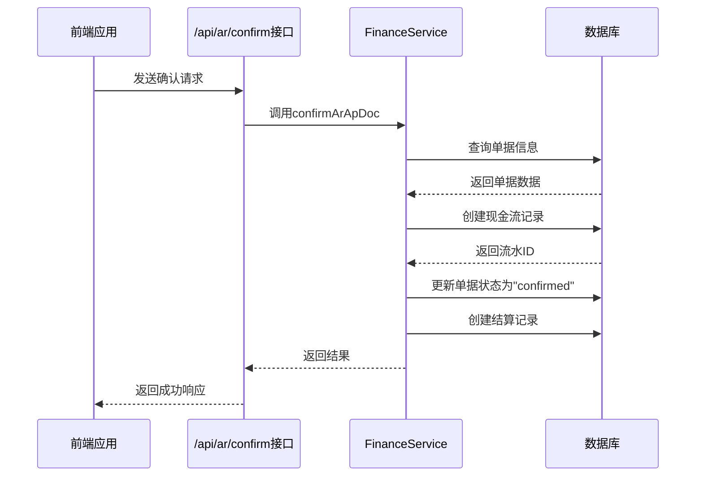
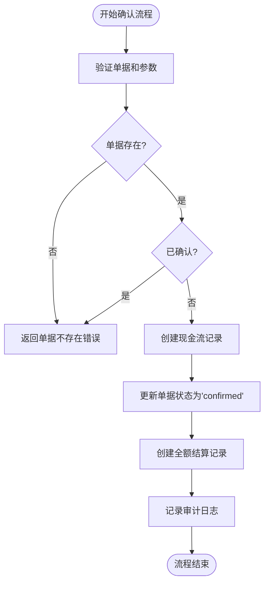

# 确认应收应付账款

<cite>
**本文档引用的文件**   
- [ar-ap.ts](file://backend/src/routes/ar-ap.ts)
- [business.schema.ts](file://backend/src/schemas/business.schema.ts)
- [FinanceService.ts](file://backend/src/services/FinanceService.ts)
- [schema.ts](file://backend/src/db/schema.ts)
- [api.ts](file://frontend/src/config/api.ts)
- [dtos.ts](file://frontend/src/types/dtos.ts)
- [errors.ts](file://backend/src/utils/errors.ts)
- [audit.ts](file://backend/src/utils/audit.ts)
</cite>

## 目录
1. [简介](#简介)
2. [接口说明](#接口说明)
3. [业务规则验证](#业务规则验证)
4. [确认后系统操作](#确认后系统操作)
5. [现金流记录生成逻辑](#现金流记录生成逻辑)
6. [使用示例](#使用示例)
7. [对财务报表的影响](#对财务报表的影响)
8. [错误处理](#错误处理)
9. [审计日志](#审计日志)

## 简介
本文档详细说明了如何通过POST /api/ar-ap/confirm接口将应收账款或应付账款单据确认为实际财务交易。文档涵盖了请求参数的使用方法、业务规则验证、确认成功后系统自动执行的操作、现金流记录的生成逻辑，并提供了具体的使用示例和对财务报表的影响分析。

## 接口说明
确认应收应付账款接口通过POST /api/ar-ap/confirm端点实现，用于将应收账款（AR）或应付账款（AP）单据从"未确认"状态转变为"已确认"状态，从而生成实际的财务交易。

### 请求参数
确认接口接受以下JSON格式的请求体参数：

- **docId**: 单据ID，用于标识要确认的应收账款或应付账款单据。
- **accountId**: 账户ID，指定交易发生的具体账户。
- **bizDate**: 业务日期，记录交易发生的日期。
- **categoryId**: 分类ID，用于对交易进行分类。
- **method**: 支付方式，描述交易的支付手段。
- **voucherUrl**: 凭证URL，指向交易凭证文件的链接。
- **memo**: 备注，提供关于交易的额外信息。

### 请求示例
```json
{
  "docId": "doc-123",
  "accountId": "acc-456",
  "bizDate": "2023-12-01",
  "categoryId": "cat-789",
  "method": "银行转账",
  "voucherUrl": "https://example.com/voucher/123",
  "memo": "客户A的货款"
}
```

### 响应格式
成功确认后，系统返回包含以下信息的JSON响应：
- **ok**: 布尔值，表示操作是否成功。
- **flowId**: 生成的现金流记录ID。
- **voucherNo**: 自动生成的凭证号。

**Section sources**
- [ar-ap.ts](file://backend/src/routes/ar-ap.ts#L302-L348)
- [business.schema.ts](file://backend/src/schemas/business.schema.ts#L187-L198)

## 业务规则验证
在确认应收应付账款单据之前，系统会执行一系列业务规则验证以确保数据的完整性和正确性。

### 单据存在性检查
系统首先验证提供的`docId`是否对应一个存在的单据。如果单据不存在，系统将返回"单据不存在"的错误。

### 单据状态检查
系统检查单据的当前状态。如果单据已经处于"已确认"（confirmed）状态，则不允许重复确认，系统将返回"单据已确认"的业务错误。

### 账户有效性检查
系统验证`accountId`对应账户的存在性和有效性。如果账户不存在或已被停用，系统将返回"账户不存在或已停用"的错误。

### 参数验证
所有请求参数都经过严格的格式验证：
- `docId`和`accountId`必须是有效的UUID格式。
- `bizDate`必须是有效的日期格式（YYYY-MM-DD）。
- `voucherUrl`必须是有效的URL格式。

**Section sources**
- [FinanceService.ts](file://backend/src/services/FinanceService.ts#L388-L403)
- [business.schema.ts](file://backend/src/schemas/business.schema.ts#L187-L198)

## 确认后系统操作
当应收应付账款单据成功确认后，系统会自动执行一系列操作来更新相关财务数据。

### 更新单据状态
系统将单据的状态从"open"（未确认）更新为"confirmed"（已确认）。这一状态变更标志着该单据已从一个预期交易转变为实际的财务交易。

### 创建现金流记录
系统根据单据的类型（AR或AP）创建相应的现金流记录：
- 对于应收账款（AR），创建"收入"（income）类型的现金流记录。
- 对于应付账款（AP），创建"支出"（expense）类型的现金流记录。

### 创建全额结算记录
系统自动创建一条全额结算记录，将单据的全部金额与新创建的现金流记录关联起来。这确保了单据的金额被完全结算。



**Diagram sources**
- [FinanceService.ts](file://backend/src/services/FinanceService.ts#L388-L434)
- [ar-ap.ts](file://backend/src/routes/ar-ap.ts#L328-L347)

## 现金流记录生成逻辑
当确认应收应付账款时，系统会生成相应的现金流记录，这些记录是财务核算的基础。

### 凭证号自动生成
系统使用`getNextVoucherNo`函数自动生成凭证号。凭证号的格式为`JZYYYYMMDD-XXX`，其中：
- `JZ`是凭证类型的前缀。
- `YYYYMMDD`是业务日期的数字表示。
- `XXX`是当天的序列号，从001开始递增。

例如，2023年12月1日的第一笔交易凭证号为`JZ20231201-001`。

### 余额计算
系统在创建现金流记录时，会精确计算账户余额：
1. 首先查询指定业务日期之前的账户余额。
2. 根据交易类型（收入或支出）计算新的余额：
   - 收入：新余额 = 原余额 + 交易金额
   - 支出：新余额 = 原余额 - 交易金额
3. 在`account_transactions`表中记录交易前后的余额变化。

### 数据库操作流程


**Diagram sources**
- [FinanceService.ts](file://backend/src/services/FinanceService.ts#L70-L127)
- [FinanceService.ts](file://backend/src/services/FinanceService.ts#L27-L38)

## 使用示例
以下提供确认应收账款和应付账款的具体示例。

### 确认应收账款示例
**场景**: 确认客户A的应收账款

**请求体**:
```json
{
  "docId": "ar-001",
  "accountId": "acc-1001",
  "bizDate": "2023-12-01",
  "categoryId": "inc-101",
  "method": "银行转账",
  "voucherUrl": "https://example.com/vouchers/ar-001.pdf",
  "memo": "客户A的11月货款"
}
```

**响应**:
```json
{
  "ok": true,
  "flowId": "flow-123",
  "voucherNo": "JZ20231201-001"
}
```

### 确认应付账款示例
**场景**: 确认供应商B的应付账款

**请求体**:
```json
{
  "docId": "ap-002",
  "accountId": "acc-1002",
  "bizDate": "2023-12-02",
  "categoryId": "exp-202",
  "method": "电汇",
  "voucherUrl": "https://example.com/vouchers/ap-002.pdf",
  "memo": "采购原材料费用"
}
```

**响应**:
```json
{
  "ok": true,
  "flowId": "flow-124",
  "voucherNo": "JZ20231202-001"
}
```

**Section sources**
- [dtos.ts](file://frontend/src/types/dtos.ts#L112-L119)
- [api.ts](file://frontend/src/config/api.ts#L50-L55)

## 对财务报表的影响
确认应收应付账款操作会对多个财务报表产生直接影响。

### 资产负债表
- **应收账款确认**: 减少"应收账款"资产，增加"银行存款"或"现金"资产。
- **应付账款确认**: 减少"应付账款"负债，减少"银行存款"或"现金"资产。

### 利润表
- **应收账款确认**: 增加"营业收入"，影响当期利润。
- **应付账款确认**: 增加"营业成本"或"费用"，影响当期利润。

### 现金流量表
- 无论应收账款还是应付账款确认，都会在"经营活动产生的现金流量"中体现相应的现金流入或流出。

### 账户余额
相关账户的余额会立即更新，反映最新的财务状况。用户可以在账户明细中查看到新生成的交易记录。

## 错误处理
系统实现了完善的错误处理机制，确保在出现问题时能够提供清晰的反馈。

### 业务错误
- **单据不存在**: 当提供的`docId`在系统中找不到对应记录时返回。
- **单据已确认**: 当尝试确认一个已经处于"已确认"状态的单据时返回。
- **账户不存在或已停用**: 当`accountId`对应的账户无效时返回。

### 验证错误
- **参数格式错误**: 当请求参数不符合预期格式（如无效的日期或URL）时返回。
- **必填字段缺失**: 当必需的参数未提供时返回。

错误响应包含错误代码和详细信息，帮助用户快速定位和解决问题。

**Section sources**
- [errors.ts](file://backend/src/utils/errors.ts#L34-L54)
- [FinanceService.ts](file://backend/src/services/FinanceService.ts#L398-L403)

## 审计日志
每次确认操作都会被记录在审计日志中，确保操作的可追溯性。

### 日志记录内容
审计日志包含以下关键信息：
- **操作者**: 执行确认操作的用户ID。
- **操作类型**: "confirm"。
- **实体类型**: "ar_ap_doc"。
- **实体ID**: 被确认的单据ID。
- **详细信息**: 包含生成的流水ID和凭证号。
- **IP地址**: 操作者的IP地址。
- **IP归属地**: 操作者的地理位置信息。

### 安全性考虑
审计日志采用异步写入方式，确保即使日志记录失败也不会影响主业务流程，同时保证了操作的可审计性。

**Section sources**
- [audit.ts](file://backend/src/utils/audit.ts#L61-L91)
- [ar-ap.ts](file://backend/src/routes/ar-ap.ts#L343-L345)