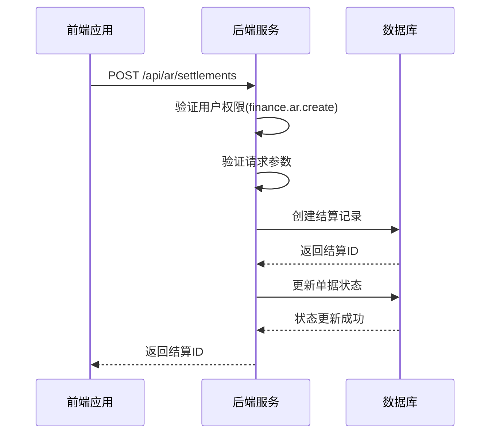
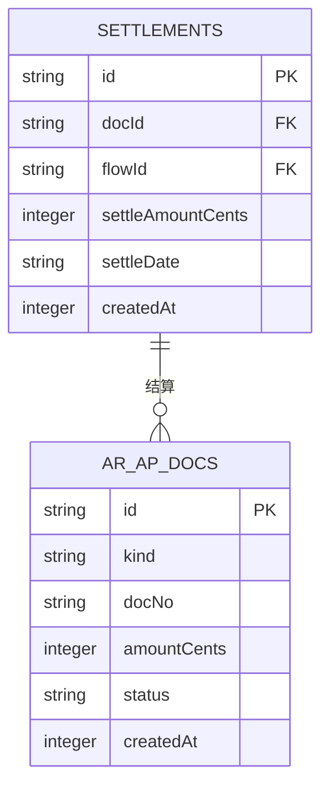
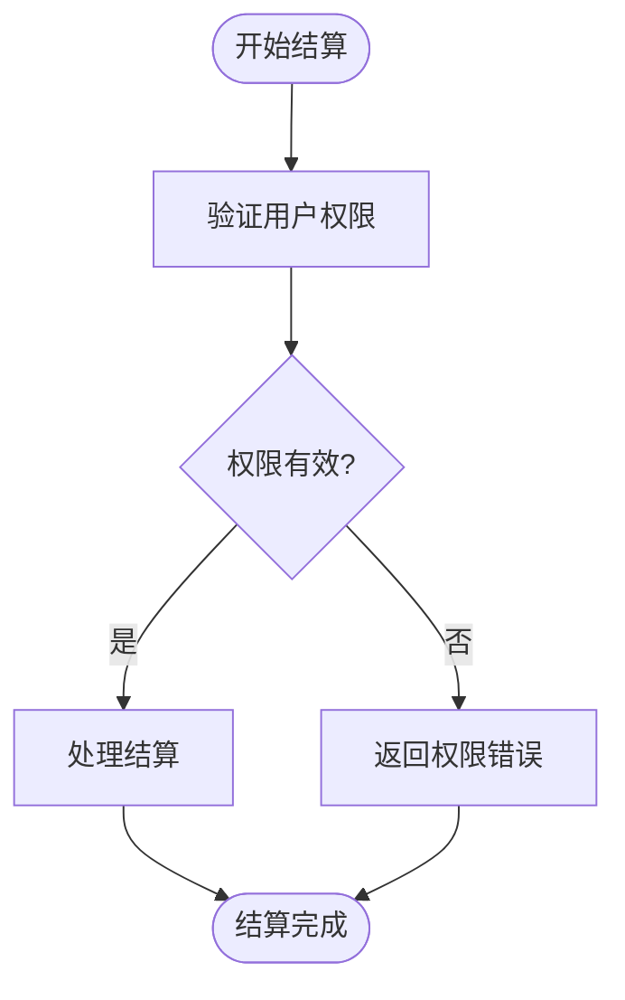
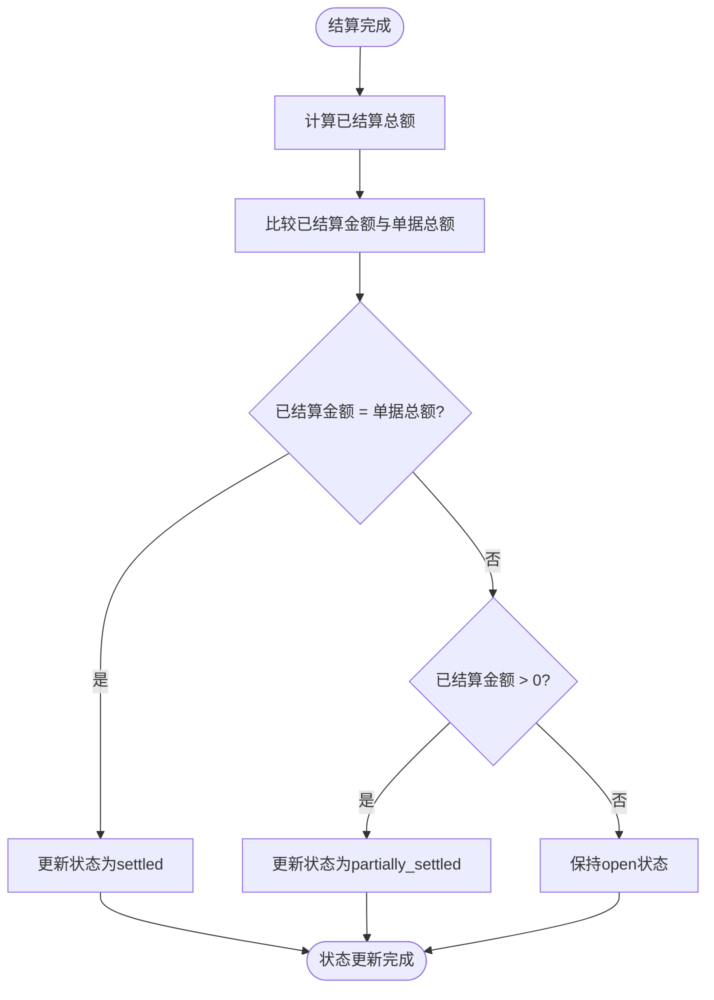
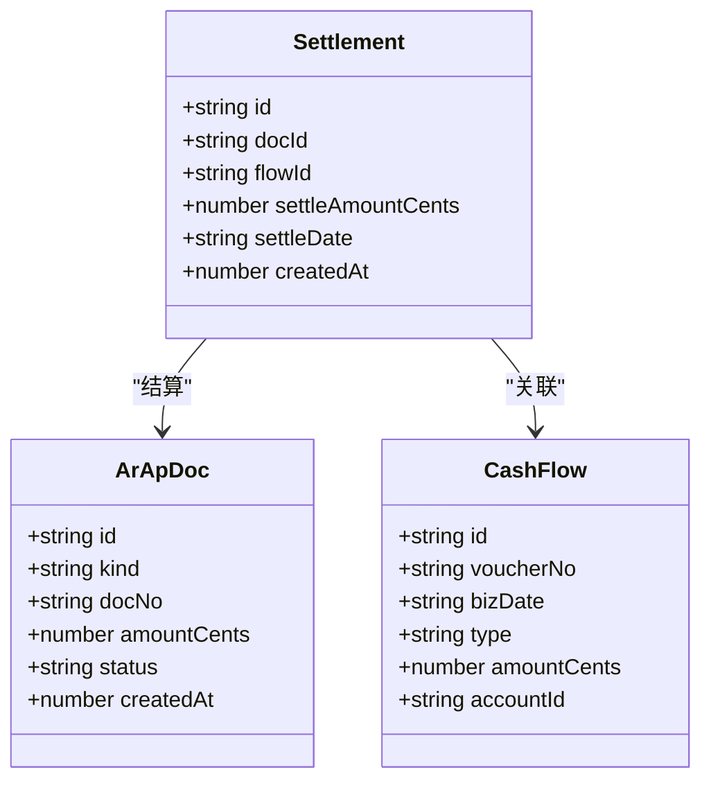
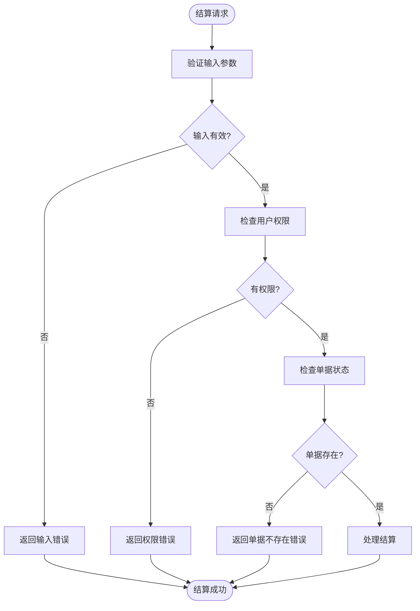

# 结算应收应付账款

<cite>
**本文档引用的文件**   
- [ar-ap.ts](file://backend/src/routes/ar-ap.ts)
- [FinanceService.ts](file://backend/src/services/FinanceService.ts)
- [business.schema.ts](file://backend/src/schemas/business.schema.ts)
- [schema.ts](file://backend/src/db/schema.ts)
- [permissions.ts](file://backend/src/utils/permissions.ts)
- [AR.tsx](file://frontend/src/features/finance/pages/AR.tsx)
- [useAR.ts](file://frontend/src/hooks/business/useAR.ts)
- [api.ts](file://frontend/src/config/api.ts)
- [ar.schema.ts](file://frontend/src/validations/ar.schema.ts)
- [dtos.ts](file://frontend/src/types/dtos.ts)
</cite>

## 目录
1. [简介](#简介)
2. [结算接口概述](#结算接口概述)
3. [请求参数详解](#请求参数详解)
4. [权限验证机制](#权限验证机制)
5. [结算状态更新逻辑](#结算状态更新逻辑)
6. [结算记录与现金流关联](#结算记录与现金流关联)
7. [部分结算示例](#部分结算示例)
8. [全额结算示例](#全额结算示例)
9. [错误处理与验证](#错误处理与验证)

## 简介
本文档详细说明了如何通过POST /api/ar-ap/:id/settle接口将应收账款或应付账款与现金流记录关联进行结算。文档涵盖了请求参数的使用方法、权限验证要求、结算后状态更新逻辑以及结算记录与现金流的关联机制。通过具体示例展示了部分结算和全额结算的实现方式，为开发人员和财务人员提供了完整的结算功能使用指南。

## 结算接口概述
结算接口用于将应收账款或应付账款与现金流记录进行关联，实现账款的核销。该接口通过POST请求调用，将指定的现金流记录与应收应付账款单据进行关联，完成结算操作。



**Diagram sources**
- [ar-ap.ts](file://backend/src/routes/ar-ap.ts#L216-L255)
- [FinanceService.ts](file://backend/src/services/FinanceService.ts#L368-L386)

**Section sources**
- [ar-ap.ts](file://backend/src/routes/ar-ap.ts#L216-L255)
- [FinanceService.ts](file://backend/src/services/FinanceService.ts#L368-L386)

## 请求参数详解
结算接口接受以下请求参数：

- **docId**: 单据ID，标识要结算的应收账款或应付账款单据
- **flowId**: 现金流ID，标识与结算关联的现金流记录
- **settleAmountCents**: 结算金额（单位为分），表示本次结算的金额
- **settleDate**: 结算日期，表示结算发生的日期



**Diagram sources**
- [schema.ts](file://backend/src/db/schema.ts#L397-L404)
- [business.schema.ts](file://backend/src/schemas/business.schema.ts#L179-L184)

**Section sources**
- [business.schema.ts](file://backend/src/schemas/business.schema.ts#L179-L184)
- [dtos.ts](file://frontend/src/types/dtos.ts#L121-L125)

## 权限验证机制
结算操作需要用户具有特定的权限才能执行。系统通过权限验证中间件检查用户是否具有执行结算操作的权限。



**Diagram sources**
- [ar-ap.ts](file://backend/src/routes/ar-ap.ts#L243)
- [permissions.ts](file://backend/src/utils/permissions.ts#L88-L114)

**Section sources**
- [ar-ap.ts](file://backend/src/routes/ar-ap.ts#L243)
- [permissions.ts](file://backend/src/utils/permissions.ts#L88-L114)

## 结算状态更新逻辑
结算完成后，系统会自动更新单据的状态。状态更新逻辑根据已结算金额与单据总额的关系来确定：

- 当结算金额等于单据总额时，状态变为'settled'（已结算）
- 当结算金额大于0但小于总额时，状态变为'partially_settled'（部分结算）
- 当没有结算记录时，状态保持'open'（未结算）



**Diagram sources**
- [FinanceService.ts](file://backend/src/services/FinanceService.ts#L347-L366)
- [schema.ts](file://backend/src/db/schema.ts#L323)

**Section sources**
- [FinanceService.ts](file://backend/src/services/FinanceService.ts#L347-L366)

## 结算记录与现金流关联
结算记录与现金流的关联机制确保了财务数据的一致性和可追溯性。每次结算都会创建一条结算记录，该记录关联到特定的应收应付账款单据和现金流记录。



**Diagram sources**
- [schema.ts](file://backend/src/db/schema.ts#L312-L326)
- [schema.ts](file://backend/src/db/schema.ts#L397-L404)
- [schema.ts](file://backend/src/db/schema.ts#L165-L181)

**Section sources**
- [schema.ts](file://backend/src/db/schema.ts#L312-L326)
- [schema.ts](file://backend/src/db/schema.ts#L397-L404)

## 部分结算示例
部分结算是指结算金额小于单据总额的情况。以下是一个部分结算的具体示例：

**请求示例：**
```json
POST /api/ar/settlements
{
  "docId": "ar-001",
  "flowId": "cf-001",
  "settleAmountCents": 50000,
  "settleDate": "2024-01-15"
}
```

**响应示例：**
```json
{
  "id": "st-001"
}
```

**结算后单据状态：**
- 单据总额：100,000分（1,000元）
- 已结算金额：50,000分（500元）
- 剩余金额：50,000分（500元）
- 单据状态：partially_settled

**Section sources**
- [AR.tsx](file://frontend/src/features/finance/pages/AR.tsx#L97-L110)
- [useAR.ts](file://frontend/src/hooks/business/useAR.ts#L70-L72)

## 全额结算示例
全额结算是指结算金额等于单据总额的情况。以下是一个全额结算的具体示例：

**请求示例：**
```json
POST /api/ar/settlements
{
  "docId": "ar-002",
  "flowId": "cf-002",
  "settleAmountCents": 80000,
  "settleDate": "2024-01-20"
}
```

**响应示例：**
```json
{
  "id": "st-002"
}
```

**结算后单据状态：**
- 单据总额：80,000分（800元）
- 已结算金额：80,000分（800元）
- 剩余金额：0分（0元）
- 单据状态：settled

**Section sources**
- [AR.tsx](file://frontend/src/features/finance/pages/AR.tsx#L97-L110)
- [useAR.ts](file://frontend/src/hooks/business/useAR.ts#L70-L72)

## 错误处理与验证
系统在结算过程中实施了严格的错误处理和验证机制，确保数据的完整性和安全性。



**Diagram sources**
- [ar-ap.ts](file://backend/src/routes/ar-ap.ts#L243-L254)
- [business.schema.ts](file://backend/src/schemas/business.schema.ts#L180-L183)

**Section sources**
- [ar-ap.ts](file://backend/src/routes/ar-ap.ts#L243-L254)
- [business.schema.ts](file://backend/src/schemas/business.schema.ts#L180-L183)