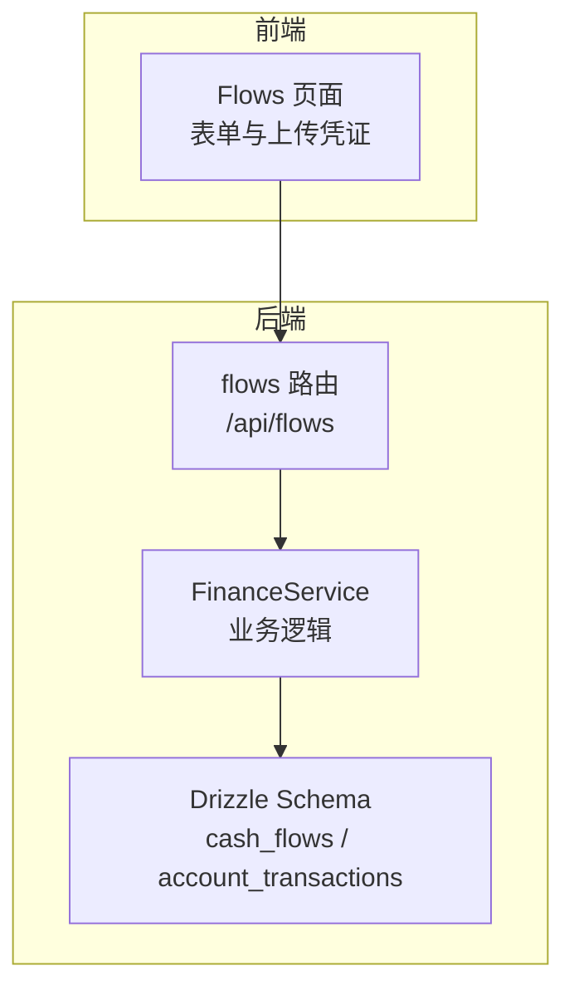
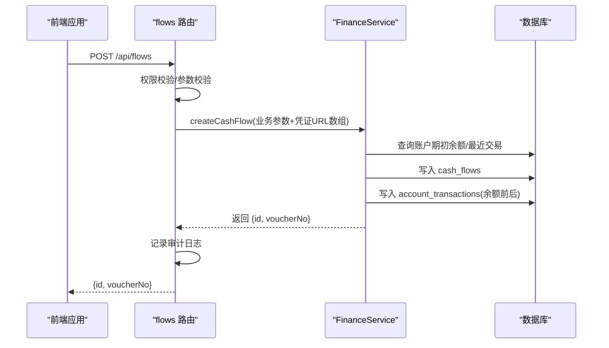
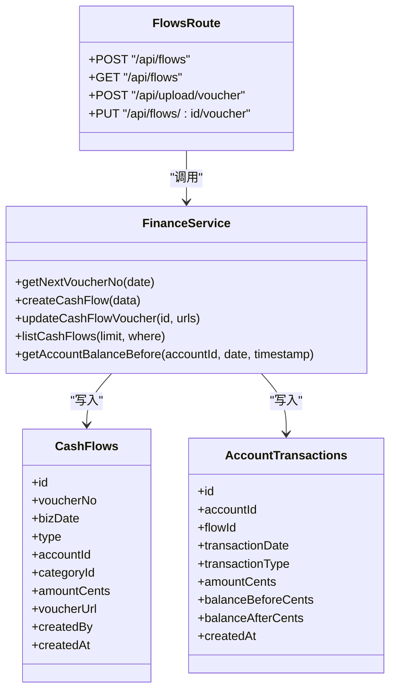

# 现金流管理

<cite>
**本文引用的文件**
- [flows.ts](file://backend/src/routes/flows.ts)
- [FinanceService.ts](file://backend/src/services/FinanceService.ts)
- [schema.ts](file://backend/src/db/schema.ts)
- [business.schema.ts](file://backend/src/schemas/business.schema.ts)
- [errors.ts](file://backend/src/utils/errors.ts)
- [audit.ts](file://backend/src/utils/audit.ts)
- [flow.schema.ts](file://frontend/src/validations/flow.schema.ts)
- [Flows.tsx](file://frontend/src/features/finance/pages/Flows.tsx)
- [finance-core.test.ts](file://backend/test/routes/finance-core.test.ts)
- [schema.sql](file://backend/src/db/schema.sql)
</cite>

## 目录
1. [简介](#简介)
2. [项目结构](#项目结构)
3. [核心组件](#核心组件)
4. [架构总览](#架构总览)
5. [详细组件分析](#详细组件分析)
6. [依赖关系分析](#依赖关系分析)
7. [性能考量](#性能考量)
8. [故障排查指南](#故障排查指南)
9. [结论](#结论)
10. [附录](#附录)

## 简介
本文件面向“现金流管理API”的使用者与维护者，系统性说明以下内容：
- 创建现金流记录的POST接口：/api/flows 的请求体字段、业务日期bizDate、交易类型type、账户ID accountId、金额amountCents、分类ID categoryId 等必填项。
- 凭证号生成规则：JZYYYYMMDD-XXX 格式，按业务日期内流水计数。
- 余额计算机制：基于 accountTransactions 表的 balanceBeforeCents 和 balanceAfterCents 字段，依据账户历史交易推导。
- 查询现金流记录：GET /api/flows 支持按日期范围、账户、分类等条件过滤（当前实现采用服务层简单列表，复杂过滤逻辑在路由层保留原始SQL）。
- 凭证附件存储：以JSON数组形式序列化存储于 cash_flows.voucherUrl 字段。
- 审计跟踪：通过 createdBy 字段与 createdAt 时间戳记录创建人与创建时间，并在关键动作记录审计日志。
- 错误处理：统一错误封装与全局错误中间件，覆盖验证、业务、权限与服务器错误。

## 项目结构
后端采用 Hono + Drizzle ORM 架构，路由层负责HTTP协议与OpenAPI校验，服务层封装业务逻辑，数据库层由SQLite schema定义。

图表来源
- [flows.ts](file://backend/src/routes/flows.ts#L1-L424)
- [FinanceService.ts](file://backend/src/services/FinanceService.ts#L1-L200)
- [schema.ts](file://backend/src/db/schema.ts#L165-L200)

章节来源
- [flows.ts](file://backend/src/routes/flows.ts#L1-L120)
- [FinanceService.ts](file://backend/src/services/FinanceService.ts#L1-L120)
- [schema.ts](file://backend/src/db/schema.ts#L165-L200)

## 核心组件
- 路由层（flows 路由）：定义 /api/flows 的创建、凭证上传/下载、凭证更新、查询等接口；对请求进行权限校验与Zod校验；调用 FinanceService 执行业务逻辑；记录审计日志。
- 服务层（FinanceService）：实现凭证号生成、余额计算、现金流与账户交易记录写入、凭证URL JSON序列化更新等。
- 数据层（Drizzle Schema）：cash_flows 与 account_transactions 表结构，支撑凭证号、余额、附件等字段。
- 前端（Flows 页面）：表单收集bizDate、type、accountId、amount、categoryId、memo、voucherUrls等，调用后端API完成创建与凭证上传。

章节来源
- [flows.ts](file://backend/src/routes/flows.ts#L302-L424)
- [FinanceService.ts](file://backend/src/services/FinanceService.ts#L28-L136)
- [schema.ts](file://backend/src/db/schema.ts#L165-L200)
- [Flows.tsx](file://frontend/src/features/finance/pages/Flows.tsx#L1-L120)

## 架构总览

图表来源
- [flows.ts](file://backend/src/routes/flows.ts#L302-L374)
- [FinanceService.ts](file://backend/src/services/FinanceService.ts#L71-L128)
- [schema.ts](file://backend/src/db/schema.ts#L165-L200)

## 详细组件分析

### 接口：POST /api/flows（创建现金流）
- 请求体字段
  - 必填：bizDate、type、accountId、amountCents、categoryId、voucherUrls（或 voucherUrl，向后兼容）
  - 可选：method、siteId、departmentId、ownerScope、counterparty、memo、createdBy
- 业务逻辑
  - 若未提供 voucherNo，则按 bizDate 生成 JZYYYYMMDD-XXX 凭证号。
  - 计算余额：取账户在 bizDate 当前时间点之前的最后一条交易的 balanceAfterCents，若无则取账户 openingCents，再根据 income/expense 计算 balanceBeforeCents 与 balanceAfterCents。
  - 写入 cash_flows 并同时写入 account_transactions。
  - 将 voucherUrls 序列化为JSON字符串存入 cash_flows.voucherUrl。
  - 记录审计日志（创建现金流）。
- 权限与错误
  - 需具备 finance.flow.create 权限；否则抛出 403。
  - 参数校验失败抛出 400；业务异常抛出 400；服务器异常抛出 500。

章节来源
- [flows.ts](file://backend/src/routes/flows.ts#L302-L374)
- [business.schema.ts](file://backend/src/schemas/business.schema.ts#L11-L36)
- [FinanceService.ts](file://backend/src/services/FinanceService.ts#L28-L128)
- [errors.ts](file://backend/src/utils/errors.ts#L34-L54)
- [audit.ts](file://backend/src/utils/audit.ts#L61-L92)

### 凭证号生成规则
- 规则：JZYYYYMMDD-XXX
  - YYYYMMDD：业务日期
  - XXX：当日流水序号，从001开始
- 实现：按 bizDate 统计当日已有记录数量，加1后补零到3位，拼接得到 voucherNo。

章节来源
- [FinanceService.ts](file://backend/src/services/FinanceService.ts#L28-L39)

### 余额计算机制
- 计算步骤
  - 在 account_transactions 中查找账户在 bizDate 之前、或同一天但在当前时间点之前的最后一条交易。
  - 若找到，取其 balanceAfterCents 作为本次 balanceBeforeCents；否则取 accounts.openingCents 作为期初余额。
  - 根据 type（income/expense）计算 delta，并得到 balanceAfterCents。
  - 写入两条记录：cash_flows 与 account_transactions。
- 字段说明
  - accountTransactions.balanceBeforeCents / balanceAfterCents：余额前后值
  - accounts.openingCents：期初余额

章节来源
- [FinanceService.ts](file://backend/src/services/FinanceService.ts#L41-L69)
- [schema.ts](file://backend/src/db/schema.ts#L183-L193)

### 查询接口：GET /api/flows
- 功能：列出现金流记录，支持按用户所属层级过滤（总部/项目/个人）。
- 过滤逻辑（当前实现）
  - HQ：可见全部
  - 项目级：按 department_id 过滤
  - 团队及更低：仅可见本人创建的记录
- 返回字段：包含 voucherNo、bizDate、type、accountId、categoryId、method、amountCents、siteId、departmentId、counterparty、memo、voucherUrls（数组）、createdBy、createdAt、accountName、categoryName 等。
- 附件解析：cash_flows.voucherUrl 存储JSON数组；若为字符串则解析为单元素数组，兼容旧数据。

章节来源
- [flows.ts](file://backend/src/routes/flows.ts#L82-L196)
- [schema.ts](file://backend/src/db/schema.ts#L165-L181)

### 凭证附件（voucherUrls）存储与更新
- 存储方式：cash_flows.voucherUrl 以JSON数组字符串存储，数组元素为凭证URL。
- 上传与解析
  - 上传接口：/api/upload/voucher，返回 url 与 key。
  - 前端将上传后的URL加入数组，提交到 /api/flows。
  - 更新凭证：PUT /api/flows/{id}/voucher，接收 voucherUrls 或 voucherUrl（向后兼容），写回JSON数组。
- 前端行为：Flows 页面支持多图上传并转换为WebP，最终提交 voucherUrls 数组。

章节来源
- [flows.ts](file://backend/src/routes/flows.ts#L199-L301)
- [flows.ts](file://backend/src/routes/flows.ts#L376-L423)
- [Flows.tsx](file://frontend/src/features/finance/pages/Flows.tsx#L148-L168)
- [flow.schema.ts](file://frontend/src/validations/flow.schema.ts#L1-L30)

### 审计跟踪与创建信息
- 审计日志：关键动作（如创建/更新凭证）通过 logAuditAction 记录 actor、action、entity、entityId、detail、IP与位置信息。
- 创建信息：cash_flows.createdBy 与 createdAt 字段记录创建人与创建时间；FinanceService 默认 createdBy 为 system，路由层传入当前用户ID。

章节来源
- [audit.ts](file://backend/src/utils/audit.ts#L61-L92)
- [flows.ts](file://backend/src/routes/flows.ts#L302-L374)
- [FinanceService.ts](file://backend/src/services/FinanceService.ts#L96-L112)

### 错误处理机制
- 统一错误类与常用工厂方法：UNAUTHORIZED、FORBIDDEN、NOT_FOUND、DUPLICATE、VALIDATION_ERROR、BUSINESS_ERROR、INTERNAL_ERROR。
- 全局错误中间件：捕获业务错误与Zod校验错误，输出结构化JSON响应；未预期错误记录错误日志并返回500。

章节来源
- [errors.ts](file://backend/src/utils/errors.ts#L1-L114)
- [flows.ts](file://backend/src/routes/flows.ts#L302-L374)

## 依赖关系分析

图表来源
- [flows.ts](file://backend/src/routes/flows.ts#L302-L423)
- [FinanceService.ts](file://backend/src/services/FinanceService.ts#L28-L136)
- [schema.ts](file://backend/src/db/schema.ts#L165-L200)

章节来源
- [flows.ts](file://backend/src/routes/flows.ts#L302-L423)
- [FinanceService.ts](file://backend/src/services/FinanceService.ts#L28-L136)
- [schema.ts](file://backend/src/db/schema.ts#L165-L200)

## 性能考量
- 查询性能：cash_flows 表已建立索引（account_id、biz_date、type），建议在高频过滤场景下结合业务日期与账户维度使用。
- 余额计算：getAccountBalanceBefore 通过复合条件排序取最近交易，注意在大表上应确保 transaction_date 与 created_at 索引有效。
- 事务一致性：创建现金流与账户交易写入在同一事务中执行，保证余额前后一致。

章节来源
- [schema.sql](file://backend/src/db/schema.sql#L297-L314)
- [FinanceService.ts](file://backend/src/services/FinanceService.ts#L41-L69)

## 故障排查指南
- 400 验证错误
  - 检查请求体字段是否满足 createCashFlowSchema 与 createCashFlowSchema 的校验规则（如 type、amountCents、voucherUrls/voucherUrl 至少一个）。
- 403 权限不足
  - 确认当前用户具备 finance.flow.create 或 finance.flow.update 权限。
- 404 资源不存在
  - 可能为账户、分类、站点等关联资源缺失。
- 余额异常
  - 检查账户 openingCents 是否正确；确认 account_transactions 是否存在更早交易导致 balanceBeforeCents 不一致。
- 凭证URL解析异常
  - cash_flows.voucherUrl 为JSON数组；若为字符串需兼容解析为数组。

章节来源
- [business.schema.ts](file://backend/src/schemas/business.schema.ts#L11-L36)
- [errors.ts](file://backend/src/utils/errors.ts#L34-L54)
- [flows.ts](file://backend/src/routes/flows.ts#L82-L196)

## 结论
现金流管理API围绕“凭证号生成、余额计算、凭证附件存储、审计跟踪”构建了完整的业务闭环。通过路由层的权限与校验、服务层的业务逻辑与事务控制、数据库层的结构化设计，实现了高内聚、低耦合的模块化架构。建议在生产环境中持续完善查询过滤与分页策略，并加强余额计算的边界条件测试。

## 附录

### API定义与示例

- POST /api/flows（创建现金流）
  - 请求体字段
    - bizDate：业务日期（YYYY-MM-DD）
    - type：交易类型（income 或 expense）
    - accountId：账户ID
    - amountCents：金额（分）
    - categoryId：分类ID
    - voucherUrls：凭证URL数组（至少1个）
    - 可选：method、siteId、departmentId、ownerScope、counterparty、memo、createdBy
  - 成功响应：{ id, voucherNo }
  - 示例（创建收入）
    - bizDate: "2025-04-01"
    - type: "income"
    - accountId: "<账户ID>"
    - amountCents: 100000
    - categoryId: "<分类ID>"
    - voucherUrls: ["http://example.com/voucher1.webp"]
    - memo: "销售回款"
  - 示例（创建支出）
    - bizDate: "2025-04-01"
    - type: "expense"
    - accountId: "<账户ID>"
    - amountCents: 50000
    - categoryId: "<分类ID>"
    - voucherUrls: ["http://example.com/voucher2.webp"]
    - memo: "办公用品采购"

- GET /api/flows（查询现金流）
  - 支持按日期范围、账户、分类等条件过滤（当前实现按用户层级过滤）
  - 返回字段：见“查询接口：GET /api/flows”

- POST /api/upload/voucher（凭证上传）
  - 上传图片（WebP），返回 { url, key }

- PUT /api/flows/{id}/voucher（更新凭证）
  - 请求体：voucherUrls 或 voucherUrl（向后兼容）

章节来源
- [flows.ts](file://backend/src/routes/flows.ts#L82-L196)
- [flows.ts](file://backend/src/routes/flows.ts#L199-L301)
- [flows.ts](file://backend/src/routes/flows.ts#L376-L423)
- [finance-core.test.ts](file://backend/test/routes/finance-core.test.ts#L155-L185)