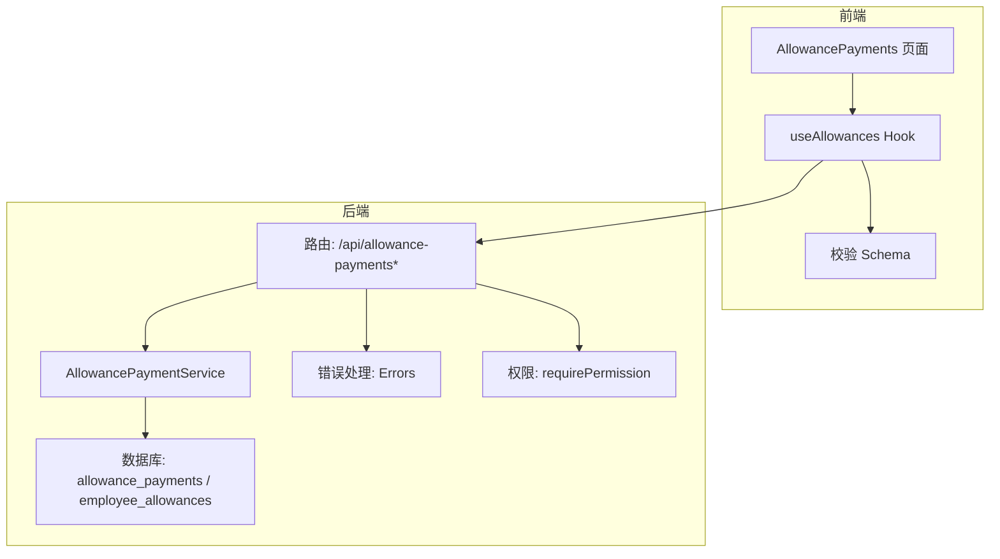
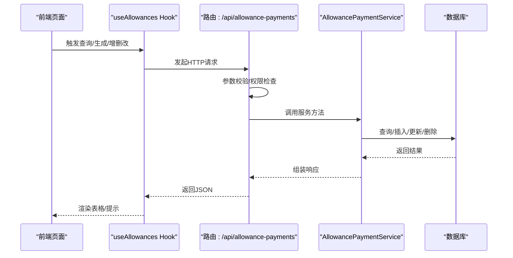
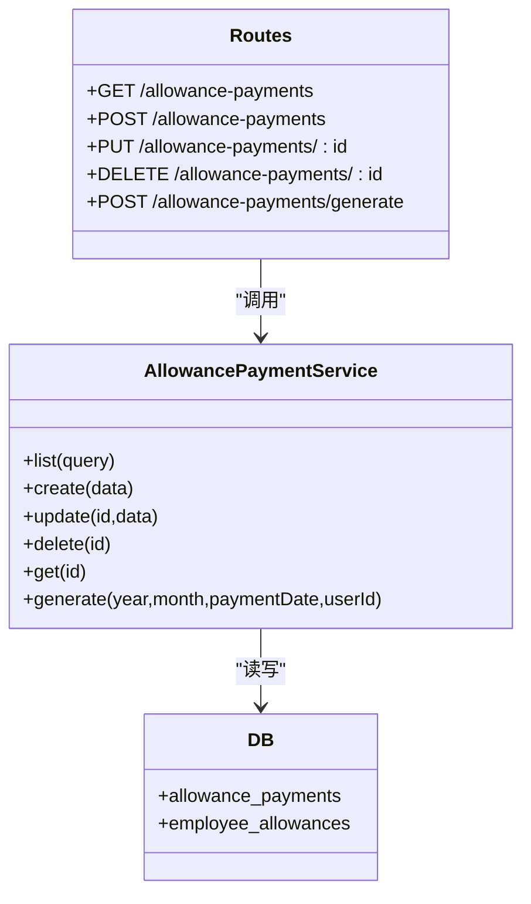
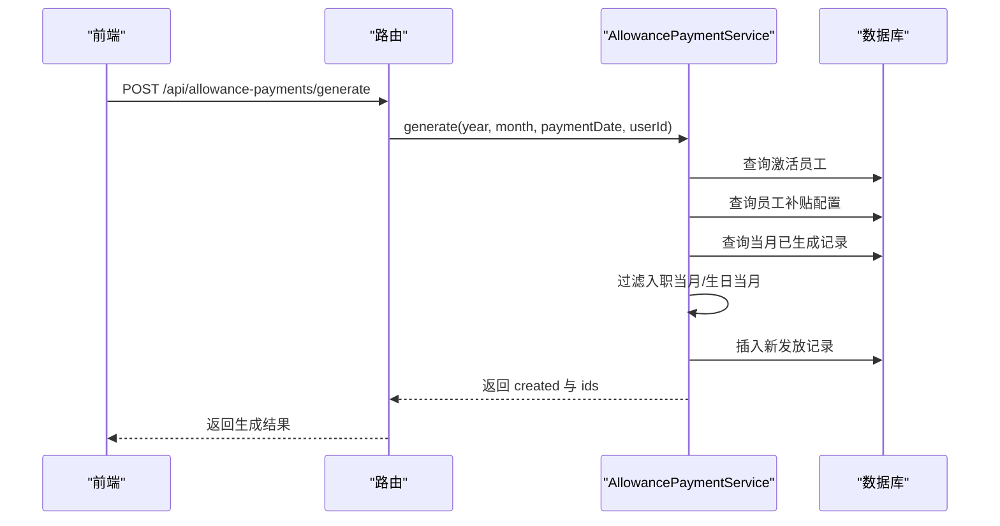

# 补贴发放

<cite>
**本文引用的文件列表**
- [backend/src/routes/allowance-payments.ts](file://backend/src/routes/allowance-payments.ts)
- [backend/src/services/AllowancePaymentService.ts](file://backend/src/services/AllowancePaymentService.ts)
- [backend/src/db/schema.ts](file://backend/src/db/schema.ts)
- [backend/src/schemas/business.schema.ts](file://backend/src/schemas/business.schema.ts)
- [backend/src/utils/errors.ts](file://backend/src/utils/errors.ts)
- [backend/src/middleware/permission.ts](file://backend/src/middleware/permission.ts)
- [frontend/src/features/hr/pages/AllowancePayments.tsx](file://frontend/src/features/hr/pages/AllowancePayments.tsx)
- [frontend/src/hooks/business/useAllowances.ts](file://frontend/src/hooks/business/useAllowances.ts)
- [frontend/src/validations/allowance.schema.ts](file://frontend/src/validations/allowance.schema.ts)
- [backend/test/routes/allowance-payments.test.ts](file://backend/test/routes/allowance-payments.test.ts)
</cite>

## 目录
1. [简介](#简介)
2. [项目结构](#项目结构)
3. [核心组件](#核心组件)
4. [架构总览](#架构总览)
5. [详细组件分析](#详细组件分析)
6. [依赖关系分析](#依赖关系分析)
7. [性能考量](#性能考量)
8. [故障排查指南](#故障排查指南)
9. [结论](#结论)
10. [附录](#附录)

## 简介
本文件面向“补贴发放”功能，系统性说明后端 API 与前端交互的完整流程，包括：
- 创建补贴发放记录（POST /api/allowance-payments）
- 查询补贴发放记录（GET /api/allowance-payments，支持按员工、年份、月份、补贴类型过滤）
- 生成补贴发放（POST /api/allowance-payments/generate）
- 补贴类型分类管理（生活、住房、交通、餐补、生日）
- 与工资发放的关系及一次性/定期补贴处理
- 错误处理与重复发放控制

## 项目结构
围绕“补贴发放”的前后端关键文件分布如下：
- 后端路由与服务：/backend/src/routes/allowance-payments.ts、/backend/src/services/AllowancePaymentService.ts
- 数据模型：/backend/src/db/schema.ts（包含 allowance_payments、employee_allowances 等）
- 前端页面与 Hook：/frontend/src/features/hr/pages/AllowancePayments.tsx、/frontend/src/hooks/business/useAllowances.ts、/frontend/src/validations/allowance.schema.ts
- 校验与错误处理：/backend/src/schemas/business.schema.ts、/backend/src/utils/errors.ts、/backend/src/middleware/permission.ts
- 单元测试：/backend/test/routes/allowance-payments.test.ts

图表来源
- [backend/src/routes/allowance-payments.ts](file://backend/src/routes/allowance-payments.ts#L62-L367)
- [backend/src/services/AllowancePaymentService.ts](file://backend/src/services/AllowancePaymentService.ts#L1-L189)
- [backend/src/db/schema.ts](file://backend/src/db/schema.ts#L223-L238)
- [frontend/src/features/hr/pages/AllowancePayments.tsx](file://frontend/src/features/hr/pages/AllowancePayments.tsx#L1-L550)
- [frontend/src/hooks/business/useAllowances.ts](file://frontend/src/hooks/business/useAllowances.ts#L1-L99)
- [frontend/src/validations/allowance.schema.ts](file://frontend/src/validations/allowance.schema.ts#L1-L28)
- [backend/src/utils/errors.ts](file://backend/src/utils/errors.ts#L34-L54)
- [backend/src/middleware/permission.ts](file://backend/src/middleware/permission.ts#L12-L37)

章节来源
- [backend/src/routes/allowance-payments.ts](file://backend/src/routes/allowance-payments.ts#L62-L367)
- [backend/src/services/AllowancePaymentService.ts](file://backend/src/services/AllowancePaymentService.ts#L1-L189)
- [backend/src/db/schema.ts](file://backend/src/db/schema.ts#L223-L238)
- [frontend/src/features/hr/pages/AllowancePayments.tsx](file://frontend/src/features/hr/pages/AllowancePayments.tsx#L1-L550)
- [frontend/src/hooks/business/useAllowances.ts](file://frontend/src/hooks/business/useAllowances.ts#L1-L99)
- [frontend/src/validations/allowance.schema.ts](file://frontend/src/validations/allowance.schema.ts#L1-L28)
- [backend/src/utils/errors.ts](file://backend/src/utils/errors.ts#L34-L54)
- [backend/src/middleware/permission.ts](file://backend/src/middleware/permission.ts#L12-L37)

## 核心组件
- 路由层：提供 GET/POST/PUT/DELETE 接口，负责参数校验、权限控制、审计日志与响应封装。
- 服务层：封装数据库访问逻辑，包括列表查询、创建、更新、删除、批量生成。
- 数据模型：定义 allowance_payments 与 employee_allowances 表结构，支撑补贴配置与发放。
- 前端页面：提供补贴发放的查询、生成、新增、编辑、删除等交互。
- 校验与错误：统一的 Zod 校验与错误码返回，保证接口一致性。

章节来源
- [backend/src/routes/allowance-payments.ts](file://backend/src/routes/allowance-payments.ts#L62-L367)
- [backend/src/services/AllowancePaymentService.ts](file://backend/src/services/AllowancePaymentService.ts#L1-L189)
- [backend/src/db/schema.ts](file://backend/src/db/schema.ts#L223-L238)
- [frontend/src/features/hr/pages/AllowancePayments.tsx](file://frontend/src/features/hr/pages/AllowancePayments.tsx#L1-L550)
- [frontend/src/validations/allowance.schema.ts](file://frontend/src/validations/allowance.schema.ts#L1-L28)
- [backend/src/utils/errors.ts](file://backend/src/utils/errors.ts#L34-L54)

## 架构总览
下图展示从前端到后端再到数据库的整体调用链路与职责分工。

图表来源
- [frontend/src/features/hr/pages/AllowancePayments.tsx](file://frontend/src/features/hr/pages/AllowancePayments.tsx#L1-L550)
- [frontend/src/hooks/business/useAllowances.ts](file://frontend/src/hooks/business/useAllowances.ts#L1-L99)
- [backend/src/routes/allowance-payments.ts](file://backend/src/routes/allowance-payments.ts#L62-L367)
- [backend/src/services/AllowancePaymentService.ts](file://backend/src/services/AllowancePaymentService.ts#L1-L189)
- [backend/src/db/schema.ts](file://backend/src/db/schema.ts#L223-L238)

## 详细组件分析

### API 定义与字段说明
- 创建补贴发放记录（POST /api/allowance-payments）
  - 请求体字段
    - employeeId: 员工ID（字符串）
    - year: 年份（整数）
    - month: 月份（整数）
    - allowanceType: 补贴类型（枚举：living、housing、transportation、meal、birthday）
    - currencyId: 币种代码（3位字母）
    - amountCents: 金额（分）
    - paymentDate: 发放日期（字符串）
    - paymentMethod: 发放方式（可选，cash 或 transfer）
    - voucherUrl: 凭证URL（可选）
    - memo: 备注（可选）
  - 响应字段
    - id、employeeId、year、month、allowanceType、currencyId、amountCents、paymentDate、paymentMethod、voucherUrl、memo、createdBy、createdAt、updatedAt、employeeName、departmentName、currencyName、createdByName
  - 权限要求
    - 需具备 finance.allowance.create 权限
  - 重复发放控制
    - 同一员工、年份、月份、补贴类型、币种不允许重复创建，重复时返回冲突错误

- 查询补贴发放记录（GET /api/allowance-payments）
  - 查询参数
    - year: 年份（字符串）
    - month: 月份（字符串）
    - employeeId: 员工ID（字符串）
    - allowanceType: 补贴类型（字符串）
  - 响应
    - results: 数组，元素为上述响应字段集合

- 生成补贴发放（POST /api/allowance-payments/generate）
  - 请求体字段
    - year: 年份
    - month: 月份
    - paymentDate: 发放日期
  - 响应
    - created: 生成数量
    - ids: 生成记录ID数组
  - 生成规则
    - 基于当前激活员工与其配置的员工补贴（employee_allowances）进行匹配
    - 过滤掉当月入职但未满月的员工
    - 生日补贴仅在生日当月发放
    - 若同员工同类型同币种同年月已存在发放记录则跳过

- 更新/删除
  - PUT /api/allowance-payments/{id}
  - DELETE /api/allowance-payments/{id}

章节来源
- [backend/src/routes/allowance-payments.ts](file://backend/src/routes/allowance-payments.ts#L41-L61)
- [backend/src/routes/allowance-payments.ts](file://backend/src/routes/allowance-payments.ts#L62-L136)
- [backend/src/routes/allowance-payments.ts](file://backend/src/routes/allowance-payments.ts#L138-L190)
- [backend/src/routes/allowance-payments.ts](file://backend/src/routes/allowance-payments.ts#L192-L262)
- [backend/src/routes/allowance-payments.ts](file://backend/src/routes/allowance-payments.ts#L264-L367)
- [backend/src/schemas/business.schema.ts](file://backend/src/schemas/business.schema.ts#L467-L514)
- [backend/src/schemas/business.schema.ts](file://backend/src/schemas/business.schema.ts#L403-L407)
- [backend/src/services/AllowancePaymentService.ts](file://backend/src/services/AllowancePaymentService.ts#L40-L76)
- [backend/src/services/AllowancePaymentService.ts](file://backend/src/services/AllowancePaymentService.ts#L122-L187)

### 补贴类型与分类管理
- 支持的补贴类型
  - living：生活补贴
  - housing：住房补贴
  - transportation：交通补贴
  - meal：餐补
  - birthday：生日补贴
- 类型约束
  - 创建与生成接口均限制 allowanceType 为上述枚举之一
  - 生日补贴在生成时按员工生日当月自动筛选

章节来源
- [backend/src/schemas/business.schema.ts](file://backend/src/schemas/business.schema.ts#L467-L478)
- [backend/src/services/AllowancePaymentService.ts](file://backend/src/services/AllowancePaymentService.ts#L158-L165)

### 与工资发放的关联性
- 关联点
  - 两者均以“年+月”作为周期维度
  - 生成流程均基于员工配置与历史记录进行匹配与去重
- 差异点
  - 工资发放（salary_payments）关注薪资与分配状态，而补贴发放（allowance_payments）关注各类补贴的发放明细
  - 补贴发放支持一次性（如生日）与定期（如生活、住房、交通、餐补）两种场景

章节来源
- [backend/src/db/schema.ts](file://backend/src/db/schema.ts#L256-L276)
- [backend/src/services/AllowancePaymentService.ts](file://backend/src/services/AllowancePaymentService.ts#L122-L187)

### 一次性与定期补贴处理
- 定期补贴
  - 每月固定生成，依据员工配置的补贴项与币种
- 一次性补贴
  - 生日补贴仅在员工生日当月生成
  - 当月入职且未满月的员工不生成任何补贴

章节来源
- [backend/src/services/AllowancePaymentService.ts](file://backend/src/services/AllowancePaymentService.ts#L149-L165)

### 示例与最佳实践
- 创建补贴发放记录
  - 使用 POST /api/allowance-payments，传入 employeeId、year、month、allowanceType、currencyId、amountCents、paymentDate 等字段
  - 若重复创建同一员工同类型同币种同年月的记录，将收到冲突错误
- 查询与筛选
  - GET /api/allowance-payments 支持按年份、月份、员工、补贴类型过滤
  - 前端页面提供年、月、类型、员工的筛选器，便于快速定位
- 生成补贴发放
  - POST /api/allowance-payments/generate，输入年、月、发放日期
  - 生成完成后返回 created 与 ids，前端可提示生成条数

章节来源
- [frontend/src/features/hr/pages/AllowancePayments.tsx](file://frontend/src/features/hr/pages/AllowancePayments.tsx#L1-L550)
- [frontend/src/hooks/business/useAllowances.ts](file://frontend/src/hooks/business/useAllowances.ts#L1-L99)
- [backend/test/routes/allowance-payments.test.ts](file://backend/test/routes/allowance-payments.test.ts#L1-L179)

## 依赖关系分析
- 路由依赖
  - 权限中间件：requirePermission 用于鉴权
  - 错误处理：Errors 提供统一错误码与消息
  - 审计日志：logAuditAction 记录关键操作
- 服务依赖
  - 数据库：Drizzle ORM 对 allowance_payments、employee_allowances 等表进行读写
  - 重复校验：创建前按“员工+年+月+类型+币种”去重
- 前端依赖
  - useAllowances Hook 将查询参数映射为 URL 查询串
  - 校验 Schema 保障前端输入合法

图表来源
- [backend/src/routes/allowance-payments.ts](file://backend/src/routes/allowance-payments.ts#L62-L367)
- [backend/src/services/AllowancePaymentService.ts](file://backend/src/services/AllowancePaymentService.ts#L1-L189)
- [backend/src/db/schema.ts](file://backend/src/db/schema.ts#L223-L238)

章节来源
- [backend/src/routes/allowance-payments.ts](file://backend/src/routes/allowance-payments.ts#L62-L367)
- [backend/src/services/AllowancePaymentService.ts](file://backend/src/services/AllowancePaymentService.ts#L1-L189)
- [backend/src/db/schema.ts](file://backend/src/db/schema.ts#L223-L238)

## 性能考量
- 查询优化
  - 列表查询支持按年、月、员工、类型过滤，建议在高频查询场景下确保相关字段建立索引
- 生成流程
  - 生成时先拉取所有激活员工与员工补贴配置，再与现有发放记录做集合比对，避免重复
- 建议
  - 对 allowance_payments 的 year、month、employeeId、allowanceType、currencyId 建立复合索引以提升查询与去重效率

[本节为通用建议，无需特定文件来源]

## 故障排查指南
- 403 权限不足
  - 确认当前用户具备 finance.allowance.create 权限
- 409 重复创建
  - 同一员工、年份、月份、补贴类型、币种已存在发放记录，请勿重复创建
- 404 资源不存在
  - 更新或删除不存在的发放记录时出现
- 400 验证失败
  - 请求体字段不符合约束（如年份、月份范围，金额必须大于0，币种为3位代码等）

章节来源
- [backend/src/utils/errors.ts](file://backend/src/utils/errors.ts#L34-L54)
- [backend/src/routes/allowance-payments.ts](file://backend/src/routes/allowance-payments.ts#L192-L262)
- [backend/src/routes/allowance-payments.ts](file://backend/src/routes/allowance-payments.ts#L264-L367)
- [backend/src/services/AllowancePaymentService.ts](file://backend/src/services/AllowancePaymentService.ts#L40-L76)

## 结论
本功能通过清晰的路由与服务分层，结合严格的参数校验与权限控制，实现了补贴发放的全生命周期管理。前端提供直观的筛选与生成能力，后端在生成与创建阶段均内置去重与一致性保障，满足一次性（生日）与定期（生活、住房、交通、餐补）两类场景需求。

[本节为总结，无需特定文件来源]

## 附录

### API 字段对照表
- 创建/更新请求体字段
  - employeeId、year、month、allowanceType、currencyId、amountCents、paymentDate、paymentMethod、voucherUrl、memo
- 列表查询参数
  - year、month、employeeId、allowanceType
- 生成请求体
  - year、month、paymentDate
- 响应字段
  - id、employeeId、year、month、allowanceType、currencyId、amountCents、paymentDate、paymentMethod、voucherUrl、memo、createdBy、createdAt、updatedAt、employeeName、departmentName、currencyName、createdByName

章节来源
- [backend/src/routes/allowance-payments.ts](file://backend/src/routes/allowance-payments.ts#L41-L61)
- [backend/src/routes/allowance-payments.ts](file://backend/src/routes/allowance-payments.ts#L62-L136)
- [backend/src/routes/allowance-payments.ts](file://backend/src/routes/allowance-payments.ts#L138-L190)
- [backend/src/routes/allowance-payments.ts](file://backend/src/routes/allowance-payments.ts#L192-L262)
- [backend/src/routes/allowance-payments.ts](file://backend/src/routes/allowance-payments.ts#L264-L367)
- [backend/src/schemas/business.schema.ts](file://backend/src/schemas/business.schema.ts#L467-L514)
- [backend/src/schemas/business.schema.ts](file://backend/src/schemas/business.schema.ts#L403-L407)

### 生成流程时序图

图表来源
- [frontend/src/features/hr/pages/AllowancePayments.tsx](file://frontend/src/features/hr/pages/AllowancePayments.tsx#L108-L126)
- [backend/src/routes/allowance-payments.ts](file://backend/src/routes/allowance-payments.ts#L138-L190)
- [backend/src/services/AllowancePaymentService.ts](file://backend/src/services/AllowancePaymentService.ts#L122-L187)