# 财务管理API

<cite>
**本文档引用的文件**   
- [flows.ts](file://backend/src/routes/flows.ts)
- [account-transfers.ts](file://backend/src/routes/account-transfers.ts)
- [ar-ap.ts](file://backend/src/routes/ar-ap.ts)
- [borrowings.ts](file://backend/src/routes/borrowings.ts)
- [expense-reimbursements.ts](file://backend/src/routes/expense-reimbursements.ts)
- [salary-payments.ts](file://backend/src/routes/salary-payments.ts)
- [allowance-payments.ts](file://backend/src/routes/allowance-payments.ts)
- [import.ts](file://backend/src/routes/import.ts)
- [FinanceService.ts](file://backend/src/services/FinanceService.ts)
- [ImportService.ts](file://backend/src/services/ImportService.ts)
- [SalaryPaymentService.ts](file://backend/src/services/SalaryPaymentService.ts)
- [AllowancePaymentService.ts](file://backend/src/services/AllowancePaymentService.ts)
- [business.schema.ts](file://backend/src/schemas/business.schema.ts)
- [schema.ts](file://backend/src/db/schema.ts)
- [audit.ts](file://backend/src/utils/audit.ts)
- [csv.ts](file://backend/src/utils/csv.ts)
</cite>

## 目录
1. [简介](#简介)
2. [现金流管理](#现金流管理)
3. [账户转账](#账户转账)
4. [应收应付账款](#应收应付账款)
5. [借款与还款](#借款与还款)
6. [费用报销](#费用报销)
7. [工资发放](#工资发放)
8. [补贴发放](#补贴发放)
9. [批量导入](#批量导入)
10. [审计跟踪与合规性](#审计跟踪与合规性)

## 简介
本API文档详细描述了财务管理系统的各项核心功能，包括现金流、账户转账、应收应付账款、借款、费用报销、工资发放和补贴发放等。系统通过RESTful API提供完整的财务交易管理能力，支持资金流动追溯、余额计算、批量处理和审计跟踪。

**Section sources**
- [flows.ts](file://backend/src/routes/flows.ts#L1-L424)
- [account-transfers.ts](file://backend/src/routes/account-transfers.ts#L1-L209)
- [ar-ap.ts](file://backend/src/routes/ar-ap.ts#L1-L353)

## 现金流管理

### 数据模型
现金流记录存储在`cash_flows`表中，包含以下关键字段：
- `id`: 唯一标识符
- `voucherNo`: 凭证编号，格式为JZYYYYMMDD-XXX
- `bizDate`: 业务日期
- `type`: 类型（income/expense）
- `accountId`: 账户ID
- `amountCents`: 金额（分）
- `balanceAfterCents`: 交易后余额（分）
- `createdBy`: 创建人
- `createdAt`: 创建时间

关联的账户交易记录存储在`account_transactions`表中，用于追踪账户余额变化。

### 状态机与会计处理
现金流创建时会自动触发以下会计处理：
1. 计算交易前余额
2. 创建现金流记录
3. 创建账户交易记录，更新余额

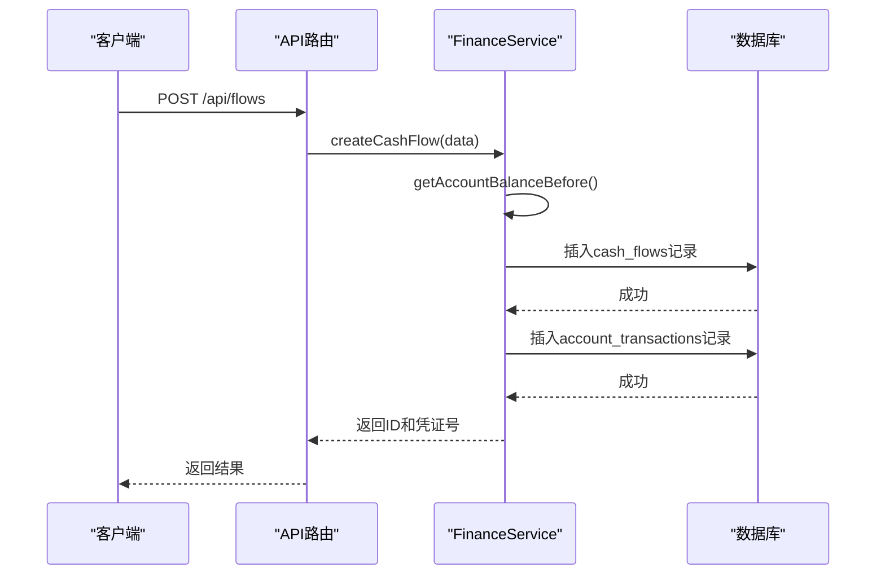

**Diagram sources**
- [flows.ts](file://backend/src/routes/flows.ts#L302-L373)
- [FinanceService.ts](file://backend/src/services/FinanceService.ts#L71-L127)

### 资金流动追溯与余额计算
系统通过`account_transactions`表实现资金流动追溯。余额计算遵循以下规则：
- 交易前余额 = 最近一笔交易的余额或账户期初余额
- 交易后余额 = 交易前余额 + 收入金额 - 支出金额

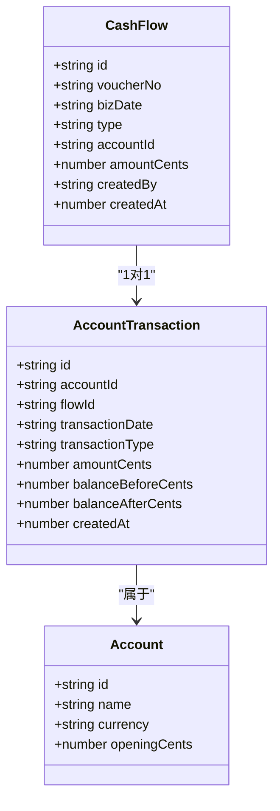

**Diagram sources**
- [schema.ts](file://backend/src/db/schema.ts#L165-L181)
- [FinanceService.ts](file://backend/src/services/FinanceService.ts#L41-L69)

**Section sources**
- [flows.ts](file://backend/src/routes/flows.ts#L1-L424)
- [FinanceService.ts](file://backend/src/services/FinanceService.ts#L26-L152)
- [schema.ts](file://backend/src/db/schema.ts#L165-L193)

## 账户转账

### 数据模型
账户转账记录存储在`account_transfers`表中，包含以下关键字段：
- `id`: 唯一标识符
- `transferDate`: 转账日期
- `fromAccountId`: 转出账户ID
- `toAccountId`: 转入账户ID
- `fromAmountCents`: 转出金额（分）
- `toAmountCents`: 转入金额（分）
- `exchangeRate`: 汇率

### 状态机与会计处理
账户转账会创建三笔记录：
1. 账户转账主记录
2. 转出账户的交易记录（支出）
3. 转入账户的交易记录（收入）

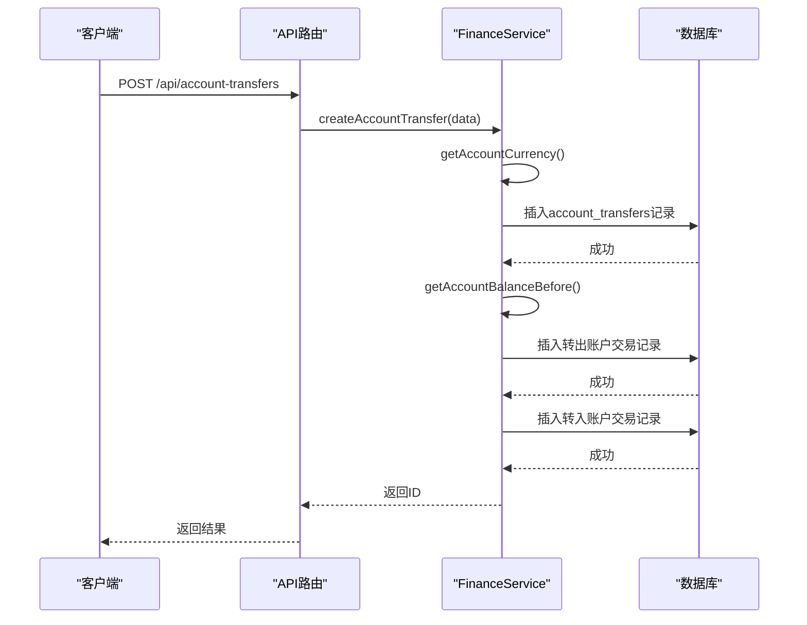

**Diagram sources**
- [account-transfers.ts](file://backend/src/routes/account-transfers.ts#L112-L161)
- [FinanceService.ts](file://backend/src/services/FinanceService.ts#L181-L243)

### 资金流动追溯与余额计算
账户转账的资金流动通过`account_transactions`表中的`transactionType`字段区分：
- `transfer_out`: 转出交易
- `transfer_in`: 转入交易

余额计算与现金流相同，确保资金流动的完整追溯。

**Section sources**
- [account-transfers.ts](file://backend/src/routes/account-transfers.ts#L1-L209)
- [FinanceService.ts](file://backend/src/services/FinanceService.ts#L138-L267)
- [schema.ts](file://backend/src/db/schema.ts#L183-L193)

## 应收应付账款

### 数据模型
应收应付账款记录存储在`ar_ap_docs`表中，包含以下关键字段：
- `id`: 唯一标识符
- `kind`: 类型（AR/AP）
- `docNo`: 单据编号
- `amountCents`: 金额（分）
- `status`: 状态（open/partially_settled/settled/confirmed）
- `issueDate`: 开票日期
- `dueDate`: 到期日期

结算记录存储在`settlements`表中，关联现金流记录。

### 状态机与会计处理
应收应付账款的状态机如下：
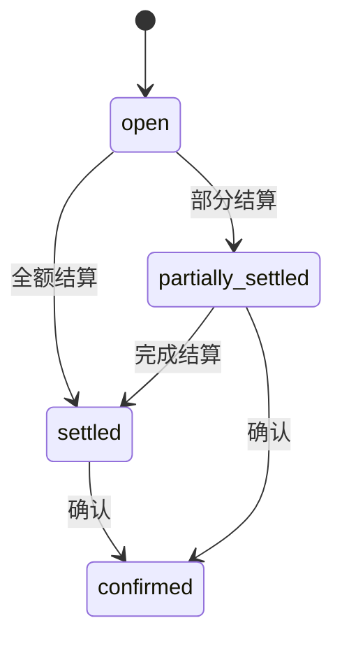

会计处理流程：
1. 创建应收/应付单据
2. 通过结算关联现金流
3. 确认时更新状态并创建最终现金流

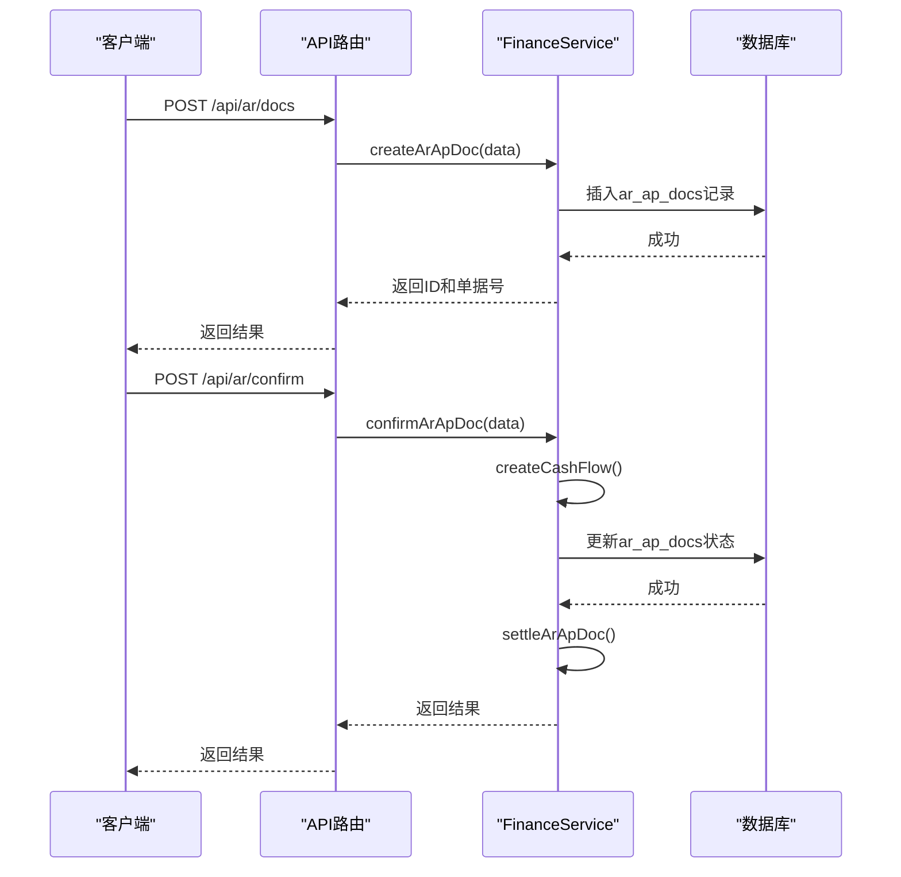

**Diagram sources**
- [ar-ap.ts](file://backend/src/routes/ar-ap.ts#L139-L183)
- [FinanceService.ts](file://backend/src/services/FinanceService.ts#L314-L435)

### 资金流动追溯与余额计算
通过`settlements`表建立应收应付账款与现金流的关联，实现完整的资金流动追溯。余额计算基于已结算金额。

**Section sources**
- [ar-ap.ts](file://backend/src/routes/ar-ap.ts#L1-L353)
- [FinanceService.ts](file://backend/src/services/FinanceService.ts#L269-L366)
- [schema.ts](file://backend/src/db/schema.ts#L312-L326)

## 借款与还款

### 数据模型
借款记录存储在`borrowings`表中，包含以下关键字段：
- `id`: 唯一标识符
- `userId`: 借款人ID
- `accountId`: 借款账户ID
- `amountCents`: 借款金额（分）
- `currency`: 币种
- `borrowDate`: 借款日期
- `status`: 状态（outstanding/approved/rejected）

还款记录存储在`repayments`表中，关联借款记录。

### 状态机与会计处理
借款审批状态机：
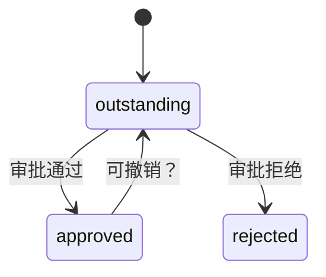

会计处理：
- 借款：增加借款人负债
- 还款：减少借款人负债，更新账户余额

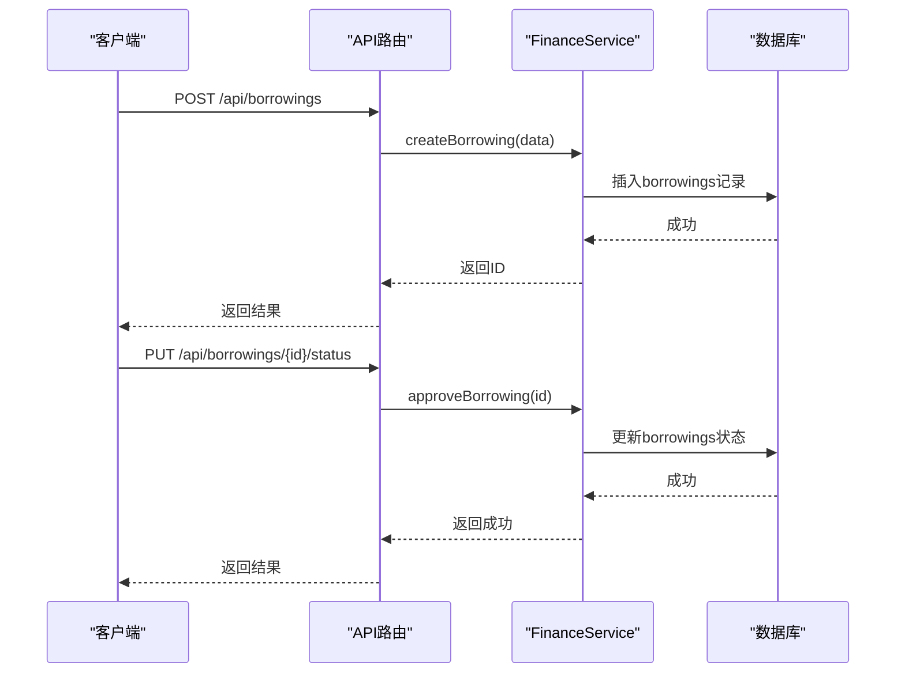

**Diagram sources**
- [borrowings.ts](file://backend/src/routes/borrowings.ts#L135-L190)
- [FinanceService.ts](file://backend/src/services/FinanceService.ts#L438-L504)

### 资金流动追溯与余额计算
通过`borrowings`和`repayments`表实现借款生命周期的完整追溯。余额计算基于借款总额减去还款总额。

**Section sources**
- [borrowings.ts](file://backend/src/routes/borrowings.ts#L1-L443)
- [FinanceService.ts](file://backend/src/services/FinanceService.ts#L437-L528)
- [schema.ts](file://backend/src/db/schema.ts#L328-L342)

## 费用报销

### 数据模型
费用报销记录存储在`expense_reimbursements`表中，包含以下关键字段：
- `id`: 唯一标识符
- `employeeId`: 员工ID
- `expenseType`: 费用类型
- `amountCents`: 金额（分）
- `expenseDate`: 费用日期
- `status`: 状态（pending/approved/rejected/paid）
- `approvedBy`: 审批人
- `approvedAt`: 审批时间

### 状态机与会计处理
费用报销状态机：
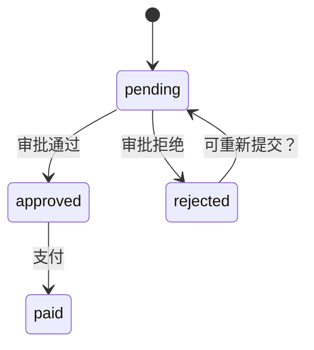

会计处理：
- 审批通过：准备支付
- 支付：创建现金流记录

**Section sources**
- [expense-reimbursements.ts](file://backend/src/routes/expense-reimbursements.ts#L1-L263)
- [schema.ts](file://backend/src/db/schema.ts#L352-L368)

## 工资发放

### 数据模型
工资发放记录存储在`salary_payments`表中，包含以下关键字段：
- `id`: 唯一标识符
- `employeeId`: 员工ID
- `year`: 年份
- `month`: 月份
- `salaryCents`: 工资金额（分）
- `status`: 状态（pending_employee_confirmation/pending_finance_approval/pending_payment/completed）
- `allocationStatus`: 分配状态（pending/requested/approved）

### 状态机与会计处理
工资发放状态机：
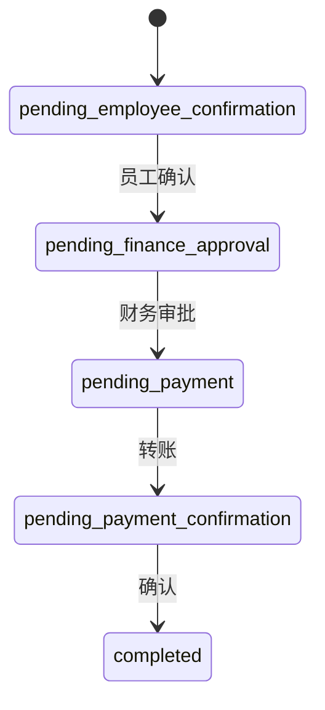

会计处理：
- 生成工资单：基于员工薪资配置
- 支付：创建账户转账记录

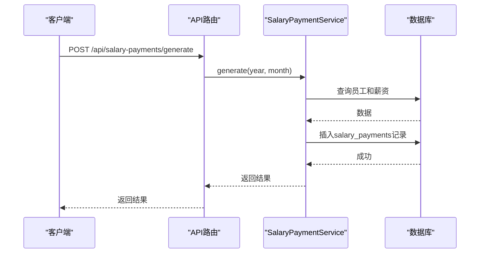

**Diagram sources**
- [salary-payments.ts](file://backend/src/routes/salary-payments.ts#L50-L86)
- [SalaryPaymentService.ts](file://backend/src/services/SalaryPaymentService.ts#L14-L166)

### 资金流动追溯与余额计算
通过`salary_payments`和`salary_payment_allocations`表实现工资发放的完整追溯。余额计算基于实际支付金额。

**Section sources**
- [salary-payments.ts](file://backend/src/routes/salary-payments.ts#L1-L313)
- [SalaryPaymentService.ts](file://backend/src/services/SalaryPaymentService.ts#L1-L453)
- [schema.ts](file://backend/src/db/schema.ts#L256-L276)

## 补贴发放

### 数据模型
补贴发放记录存储在`allowance_payments`表中，包含以下关键字段：
- `id`: 唯一标识符
- `employeeId`: 员工ID
- `year`: 年份
- `month`: 月份
- `allowanceType`: 补贴类型
- `amountCents`: 金额（分）
- `paymentDate`: 支付日期

### 状态机与会计处理
补贴发放流程：
1. 生成：基于员工补贴配置
2. 创建：手动创建单笔补贴
3. 支付：更新支付状态

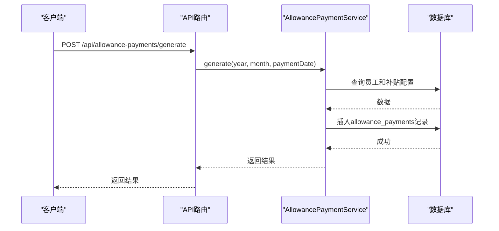

**Diagram sources**
- [allowance-payments.ts](file://backend/src/routes/allowance-payments.ts#L138-L189)
- [AllowancePaymentService.ts](file://backend/src/services/AllowancePaymentService.ts#L122-L186)

### 资金流动追溯与余额计算
通过`allowance_payments`表实现补贴发放的完整追溯。余额计算基于实际支付金额。

**Section sources**
- [allowance-payments.ts](file://backend/src/routes/allowance-payments.ts#L1-L367)
- [AllowancePaymentService.ts](file://backend/src/services/AllowancePaymentService.ts#L1-L189)
- [schema.ts](file://backend/src/db/schema.ts#L223-L238)

## 批量导入

### API使用示例
批量导入API支持从CSV文件导入现金流数据。

**请求示例：**
```
POST /api/import?kind=flows
Content-Type: text/plain

biz_date,type,account_id,amount,site_id,department_id,counterparty,memo,category_id,voucher_no,method
2023-01-01,income,acc001,1000.00,site001,dept001,客户A,销售收款,cat001,V001,银行转账
2023-01-02,expense,acc001,500.00,site001,dept001,供应商B,办公用品,cat002,V002,现金
```

**响应示例：**
```json
{
  "inserted": 2
}
```

### 处理逻辑
批量导入处理流程：
1. 解析CSV内容
2. 验证必要字段
3. 按日期排序
4. 逐条处理，确保余额计算正确
5. 在事务中提交所有记录

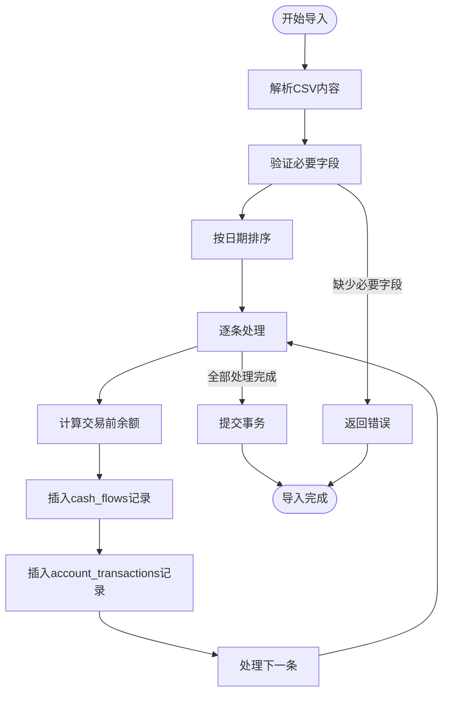

**Diagram sources**
- [import.ts](file://backend/src/routes/import.ts#L1-L65)
- [ImportService.ts](file://backend/src/services/ImportService.ts#L1-L113)
- [csv.ts](file://backend/src/utils/csv.ts#L1-L16)

**Section sources**
- [import.ts](file://backend/src/routes/import.ts#L1-L65)
- [ImportService.ts](file://backend/src/services/ImportService.ts#L1-L113)
- [csv.ts](file://backend/src/utils/csv.ts#L1-L16)

## 审计跟踪与合规性

### 审计跟踪实现
系统通过`auditLogs`表记录所有关键操作，包含以下字段：
- `actorId`: 操作人ID
- `action`: 操作类型（create/update/delete等）
- `entity`: 实体类型
- `entityId`: 实体ID
- `at`: 操作时间
- `detail`: 详细信息
- `ip`: IP地址
- `ipLocation`: IP归属地

### 合规性要求
1. **操作审计**：所有财务交易创建、修改、删除操作均记录审计日志
2. **数据追溯**：通过关联表实现完整的资金流动追溯
3. **权限控制**：基于角色的访问控制（RBAC）
4. **IP白名单**：支持IP白名单规则
5. **数据完整性**：使用数据库事务确保数据一致性

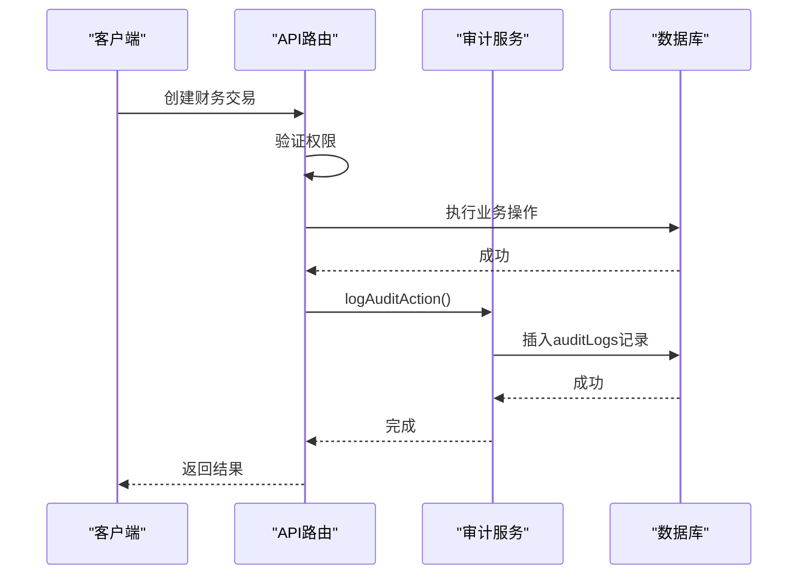

**Diagram sources**
- [audit.ts](file://backend/src/utils/audit.ts#L1-L92)
- [schema.ts](file://backend/src/db/schema.ts#L633-L643)

**Section sources**
- [audit.ts](file://backend/src/utils/audit.ts#L1-L92)
- [flows.ts](file://backend/src/routes/flows.ts#L75-L78)
- [schema.ts](file://backend/src/db/schema.ts#L633-L643)