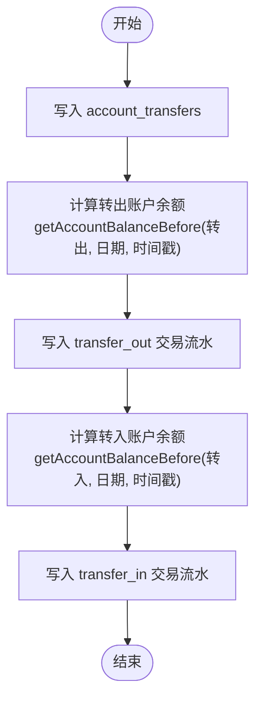

# 账户转账

<cite>
**本文引用的文件**
- [backend/src/routes/account-transfers.ts](file://backend/src/routes/account-transfers.ts)
- [backend/src/services/FinanceService.ts](file://backend/src/services/FinanceService.ts)
- [backend/src/db/schema.ts](file://backend/src/db/schema.ts)
- [backend/src/schemas/business.schema.ts](file://backend/src/schemas/business.schema.ts)
- [frontend/src/validations/accountTransfer.schema.ts](file://frontend/src/validations/accountTransfer.schema.ts)
- [frontend/src/features/finance/pages/AccountTransfer.tsx](file://frontend/src/features/finance/pages/AccountTransfer.tsx)
- [backend/test/routes/finance-core.test.ts](file://backend/test/routes/finance-core.test.ts)
- [backend/openapi.json](file://backend/openapi.json)
</cite>

## 目录
1. [简介](#简介)
2. [项目结构](#项目结构)
3. [核心组件](#核心组件)
4. [架构总览](#架构总览)
5. [详细组件分析](#详细组件分析)
6. [依赖关系分析](#依赖关系分析)
7. [性能考量](#性能考量)
8. [故障排查指南](#故障排查指南)
9. [结论](#结论)
10. [附录](#附录)

## 简介
本文件面向财务系统中的“账户转账”能力，围绕创建账户间转账记录的API进行完整说明。内容涵盖：
- 接口定义与请求/响应字段
- 数据库表结构与双记账机制
- 余额计算逻辑与时间序约束
- 多币种转账处理
- 使用示例（同币种与跨币种）
- 查询转账记录的方法

## 项目结构
账户转账相关的核心代码分布在后端路由、服务层、数据库模式与前端校验/页面中，形成前后端协作闭环。

图表来源
- [backend/src/routes/account-transfers.ts](file://backend/src/routes/account-transfers.ts#L1-L162)
- [backend/src/services/FinanceService.ts](file://backend/src/services/FinanceService.ts#L181-L244)
- [backend/src/db/schema.ts](file://backend/src/db/schema.ts#L183-L200)
- [frontend/src/features/finance/pages/AccountTransfer.tsx](file://frontend/src/features/finance/pages/AccountTransfer.tsx#L1-L120)
- [frontend/src/validations/accountTransfer.schema.ts](file://frontend/src/validations/accountTransfer.schema.ts#L1-L19)
- [backend/openapi.json](file://backend/openapi.json#L9359-L9729)

章节来源
- [backend/src/routes/account-transfers.ts](file://backend/src/routes/account-transfers.ts#L1-L162)
- [backend/src/services/FinanceService.ts](file://backend/src/services/FinanceService.ts#L181-L244)
- [backend/src/db/schema.ts](file://backend/src/db/schema.ts#L183-L200)
- [frontend/src/features/finance/pages/AccountTransfer.tsx](file://frontend/src/features/finance/pages/AccountTransfer.tsx#L1-L120)
- [frontend/src/validations/accountTransfer.schema.ts](file://frontend/src/validations/accountTransfer.schema.ts#L1-L19)
- [backend/openapi.json](file://backend/openapi.json#L9359-L9729)

## 核心组件
- 路由层：负责接收HTTP请求、参数校验、鉴权与调用服务层并返回结果。
- 服务层：封装转账业务逻辑，包括转账记录入库、双记账交易流水生成、余额计算与时间序约束。
- 数据模型：account_transfers（转账主表）、account_transactions（交易流水表）、accounts（账户基础信息）。
- 前端校验与页面：对用户输入进行前端校验与交互提示，提交时转换为后端期望的字段结构。

章节来源
- [backend/src/routes/account-transfers.ts](file://backend/src/routes/account-transfers.ts#L111-L162)
- [backend/src/services/FinanceService.ts](file://backend/src/services/FinanceService.ts#L181-L244)
- [backend/src/db/schema.ts](file://backend/src/db/schema.ts#L183-L200)
- [frontend/src/validations/accountTransfer.schema.ts](file://frontend/src/validations/accountTransfer.schema.ts#L1-L19)
- [frontend/src/features/finance/pages/AccountTransfer.tsx](file://frontend/src/features/finance/pages/AccountTransfer.tsx#L1-L120)

## 架构总览
下图展示从用户发起转账到数据库写入的完整流程。

图表来源
- [backend/src/routes/account-transfers.ts](file://backend/src/routes/account-transfers.ts#L111-L162)
- [backend/src/services/FinanceService.ts](file://backend/src/services/FinanceService.ts#L181-L244)

## 详细组件分析

### 路由与接口定义
- 路由支持：
  - GET /api/account-transfers：分页查询转账记录，支持按转出/转入账户、日期范围过滤。
  - POST /api/account-transfers：创建转账记录。
  - GET /api/account-transfers/{id}：查询单条转账详情。
- 请求体字段（POST）：
  - transferDate：转账日期
  - fromAccountId：转出账户ID
  - toAccountId：转入账户ID
  - fromAmountCents：转出金额（分）
  - toAmountCents：转入金额（分）
  - exchangeRate：汇率（可选）
  - memo：备注（可选）
  - voucherUrl：凭证URL（可选）
- 响应体字段（GET/GET {id}）：
  - 包含转账主表字段及关联账户名称与币种信息。

章节来源
- [backend/src/routes/account-transfers.ts](file://backend/src/routes/account-transfers.ts#L41-L108)
- [backend/src/routes/account-transfers.ts](file://backend/src/routes/account-transfers.ts#L111-L162)
- [backend/src/routes/account-transfers.ts](file://backend/src/routes/account-transfers.ts#L165-L209)
- [backend/openapi.json](file://backend/openapi.json#L9359-L9729)

### 服务层：转账业务逻辑
- 主要职责：
  - 写入 account_transfers 主表，记录转账基本信息（含币种）。
  - 生成两条 account_transactions 流水：
    - 转出账户：交易类型 transfer_out，amountCents 为负值，balanceBefore/balanceAfter 基于 getAccountBalanceBefore 计算。
    - 转入账户：交易类型 transfer_in，amountCents 为正值，balanceBefore/balanceAfter 基于 getAccountBalanceBefore 计算。
- 余额计算与时间序：
  - getAccountBalanceBefore(accountId, date, timestamp) 用于查找指定时间点前最后一条交易，若无则取账户期初余额。
  - 通过 transactionDate 和 createdAt 的组合排序，确保时序正确性。

章节来源
- [backend/src/services/FinanceService.ts](file://backend/src/services/FinanceService.ts#L181-L244)
- [backend/src/services/FinanceService.ts](file://backend/src/services/FinanceService.ts#L41-L69)

### 数据模型：表结构与关系
- account_transfers（转账主表）
  - 字段要点：transferDate、fromAccountId、toAccountId、fromCurrency、toCurrency、fromAmountCents、toAmountCents、exchangeRate、memo、voucherUrl、createdBy、createdAt。
- account_transactions（交易流水表）
  - 字段要点：accountId、flowId（指向转账ID）、transactionDate、transactionType（transfer_out/transfer_in）、amountCents、balanceBeforeCents、balanceAfterCents、createdAt。
- accounts（账户表）
  - 字段要点：id、name、type、currency、openingCents、active。

章节来源
- [backend/src/db/schema.ts](file://backend/src/db/schema.ts#L183-L200)
- [backend/src/db/schema.ts](file://backend/src/db/schema.ts#L406-L434)

### 前端：表单与校验
- 前端表单字段映射：
  - transfer_date -> transferDate
  - from_accountId -> fromAccountId
  - to_accountId -> toAccountId
  - from_amount -> fromAmountCents（前端将元转分为分）
  - to_amount -> toAmountCents（前端将元转分为分）
  - exchange_rate -> exchangeRate
  - memo -> memo
  - voucherUrls -> voucherUrl（取数组首元素）
- 前端校验规则：
  - 转账日期需有效
  - 转出/转入账户必选且不可相同
  - 金额必须大于0
  - 凭证必传（至少一张）

章节来源
- [frontend/src/features/finance/pages/AccountTransfer.tsx](file://frontend/src/features/finance/pages/AccountTransfer.tsx#L1-L120)
- [frontend/src/validations/accountTransfer.schema.ts](file://frontend/src/validations/accountTransfer.schema.ts#L1-L19)

### 多币种转账处理
- 币种记录：
  - 转账主表记录 fromCurrency 和 toCurrency。
  - 服务层通过 getAccountCurrency 获取账户币种，默认 CNY。
- 汇率使用：
  - exchangeRate 作为可选字段，用于跨币种场景下的金额换算。
  - 前端页面根据是否同币种显示不同提示与交互。

章节来源
- [backend/src/services/FinanceService.ts](file://backend/src/services/FinanceService.ts#L246-L249)
- [frontend/src/features/finance/pages/AccountTransfer.tsx](file://frontend/src/features/finance/pages/AccountTransfer.tsx#L232-L246)

### 双记账流程与余额计算逻辑
- 双记账：
  - 转出账户：插入 transfer_out，amountCents 为负，balanceAfter = balanceBefore - fromAmountCents。
  - 转入账户：插入 transfer_in，amountCents 为正，balanceAfter = balanceBefore + toAmountCents。
- 时间序约束：
  - 通过 getAccountBalanceBefore 在同一事务内按 transactionDate 与 createdAt 排序，保证余额计算的时序正确。
- 余额一致性：
  - 两条流水分别更新各自账户的余额，确保转账前后余额平衡。

图表来源
- [backend/src/services/FinanceService.ts](file://backend/src/services/FinanceService.ts#L181-L244)

## 依赖关系分析
- 路由依赖服务层：路由仅做参数校验与鉴权，实际业务逻辑在服务层完成。
- 服务层依赖数据库模型：读取账户币种、写入转账与流水。
- 前端依赖路由契约与校验：表单字段与校验规则与后端保持一致。

图表来源
- [backend/src/routes/account-transfers.ts](file://backend/src/routes/account-transfers.ts#L111-L162)
- [backend/src/services/FinanceService.ts](file://backend/src/services/FinanceService.ts#L181-L244)
- [backend/src/db/schema.ts](file://backend/src/db/schema.ts#L183-L200)
- [backend/openapi.json](file://backend/openapi.json#L9359-L9729)

## 性能考量
- 单次转账涉及两次余额查询与三次写入（一次转账主表+两次流水），属于轻量级事务。
- 若存在大量并发转账，建议：
  - 控制写入频率，避免在同一秒内产生过多交易。
  - 使用数据库事务包裹转账与流水写入，确保原子性。
  - 对查询接口添加索引优化（如按 transferDate、fromAccountId、toAccountId 过滤）。

## 故障排查指南
- 权限不足
  - 现象：返回 403 Forbidden
  - 处理：确认当前用户具备 finance.transfer.create/view 权限
- 参数校验失败
  - 现象：返回 400 Bad Request
  - 处理：检查 transferDate、fromAccountId、toAccountId、金额、凭证URL等字段是否满足要求
- 账户币种不匹配
  - 现象：跨币种转账未提供汇率或金额不一致
  - 处理：同币种转账金额需相等；跨币种转账需提供 exchange_rate 并按公式换算
- 余额异常
  - 现象：流水余额不连续
  - 处理：检查是否存在同一秒内的多笔交易；确认 getAccountBalanceBefore 的时序逻辑是否被破坏

章节来源
- [backend/src/routes/account-transfers.ts](file://backend/src/routes/account-transfers.ts#L137-L161)
- [frontend/src/validations/accountTransfer.schema.ts](file://frontend/src/validations/accountTransfer.schema.ts#L1-L19)
- [backend/src/services/FinanceService.ts](file://backend/src/services/FinanceService.ts#L41-L69)

## 结论
账户转账API通过“主表+双流水”的设计实现了严谨的双记账与余额时序控制。服务层在转账过程中自动记录转出与转入两条流水，并基于 getAccountBalanceBefore 确保余额计算的正确性。前端提供直观的表单与校验，支持同币种与跨币种转账场景。配合查询接口，可快速定位与核对转账记录。

## 附录

### API字段定义与示例

- POST /api/account-transfers（创建转账）
  - 请求体字段
    - transferDate：转账日期
    - fromAccountId：转出账户ID
    - toAccountId：转入账户ID
    - fromAmountCents：转出金额（分）
    - toAmountCents：转入金额（分）
    - exchangeRate：汇率（可选）
    - memo：备注（可选）
    - voucherUrl：凭证URL（可选）
  - 示例（同币种）
    - transferDate: "2025-04-01"
    - fromAccountId: "转出账户ID"
    - toAccountId: "转入账户ID"
    - fromAmountCents: 100000（即1000元）
    - toAmountCents: 100000（即1000元）
    - memo: "内部转账"
    - voucherUrl: "https://example.com/voucher.jpg"
  - 示例（跨币种）
    - transferDate: "2025-04-01"
    - fromAccountId: "USD账户ID"
    - toAccountId: "CNY账户ID"
    - fromAmountCents: 100000（即1000美元）
    - toAmountCents: 720000（即7200元，按汇率1 USD = 7.2 CNY）
    - exchangeRate: 7.2
    - memo: "美元兑换人民币"
    - voucherUrl: "https://example.com/voucher.jpg"

- GET /api/account-transfers（查询转账）
  - 查询参数
    - from_accountId：转出账户ID（可选）
    - to_accountId：转入账户ID（可选）
    - startDate：起始日期（可选）
    - endDate：结束日期（可选）
    - limit：最大返回条数（默认200）
  - 响应字段
    - results：转账列表，包含转账主表字段与关联账户名称/币种

章节来源
- [backend/src/routes/account-transfers.ts](file://backend/src/routes/account-transfers.ts#L41-L108)
- [backend/src/routes/account-transfers.ts](file://backend/src/routes/account-transfers.ts#L111-L162)
- [backend/src/schemas/business.schema.ts](file://backend/src/schemas/business.schema.ts#L233-L246)
- [backend/test/routes/finance-core.test.ts](file://backend/test/routes/finance-core.test.ts#L187-L225)
- [backend/openapi.json](file://backend/openapi.json#L9359-L9729)