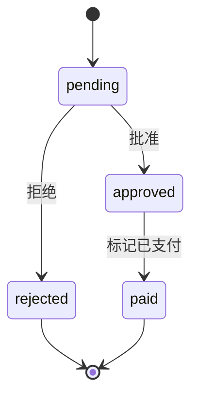
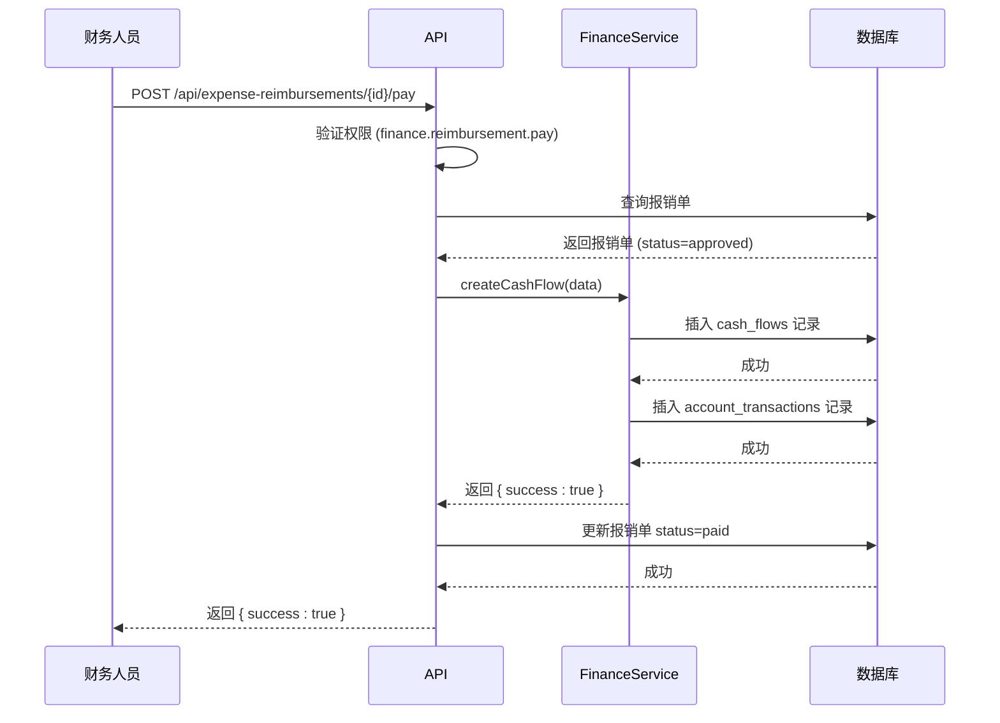
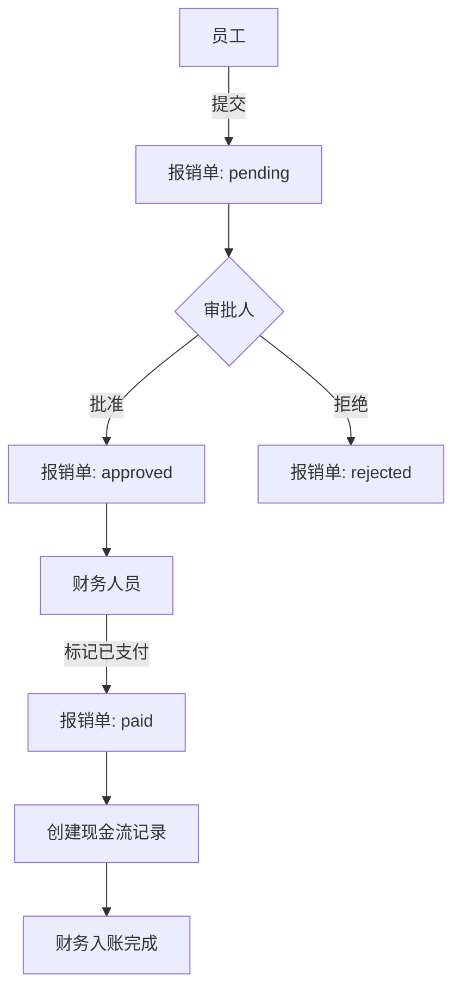

# 费用报销

<cite>
**本文档引用的文件**   
- [expense-reimbursements.ts](file://backend/src/routes/expense-reimbursements.ts)
- [FinanceService.ts](file://backend/src/services/FinanceService.ts)
- [business.schema.ts](file://backend/src/schemas/business.schema.ts)
- [expense.schema.ts](file://frontend/src/validations/expense.schema.ts)
- [schema.ts](file://backend/src/db/schema.ts)
- [permissions.ts](file://backend/src/utils/permissions.ts)
- [ExpenseReimbursement.tsx](file://frontend/src/features/hr/pages/ExpenseReimbursement.tsx)
- [useExpenses.ts](file://frontend/src/hooks/business/useExpenses.ts)
- [api.ts](file://frontend/src/config/api.ts)
- [errors.ts](file://backend/src/utils/errors.ts)
</cite>

## 目录
1. [创建费用报销](#创建费用报销)
2. [报销状态审批流程](#报销状态审批流程)
3. [财务入账与现金流关联](#财务入账与现金流关联)
4. [查询报销申请列表](#查询报销申请列表)
5. [完整业务流程示例](#完整业务流程示例)
6. [错误处理机制](#错误处理机制)

## 创建费用报销

通过向 `/api/expense-reimbursements` 发送 POST 请求来创建费用报销申请。请求体必须包含以下字段：

- **employeeId** (string): 员工ID，用于标识提交报销的员工。
- **expenseType** (string): 报销类型，例如 `travel`（差旅费）、`office`（办公用品）、`meal`（餐饮）、`transport`（交通）或 `other`（其他）。
- **amountCents** (number): 报销金额，以分为单位（例如，100元应表示为10000）。
- **currencyId** (string, 可选): 币种ID，如未提供则默认为 `CNY`。
- **expenseDate** (string): 报销日期，格式为 `YYYY-MM-DD`。
- **description** (string): 报销说明，详细描述费用用途。
- **voucherUrl** (string, 可选): 凭证附件的URL，通常为上传的图片凭证。
- **memo** (string, 可选): 备注信息。

当创建报销时，系统会自动设置以下字段：
- `status` 为 `pending`（待审批）
- `createdBy` 为当前用户ID
- `createdAt` 和 `updatedAt` 为当前时间戳

**Section sources**
- [expense-reimbursements.ts](file://backend/src/routes/expense-reimbursements.ts#L30-L39)
- [business.schema.ts](file://backend/src/schemas/business.schema.ts#L30-L39)
- [expense.schema.ts](file://frontend/src/validations/expense.schema.ts#L4-L13)

## 报销状态审批流程

费用报销的状态遵循一个明确的审批流程，状态转换如下：

**Diagram sources**
- [expense-reimbursements.ts](file://backend/src/routes/expense-reimbursements.ts#L42)
- [schema.ts](file://backend/src/db/schema.ts#L361)

### 状态说明
- **pending (待审批)**: 报销单已创建，等待审批。
- **approved (已批准)**: 报销单已通过审批，等待财务处理。
- **rejected (已拒绝)**: 报销单被拒绝。
- **paid (已支付)**: 报销款项已支付，此状态由财务人员通过 `POST /api/expense-reimbursements/{id}/pay` 接口设置。

审批操作通过 `PUT /api/expense-reimbursements/{id}/status` 接口完成，请求体包含：
- `status`: 新状态，必须为 `approved` 或 `rejected`。
- `memo` (可选): 审批备注。

只有具有 `hr.reimbursement.approve` 权限或 `can_manage_subordinates` 权限的用户才能审批报销。

**Section sources**
- [expense-reimbursements.ts](file://backend/src/routes/expense-reimbursements.ts#L159-L215)
- [ExpenseReimbursement.tsx](file://frontend/src/features/hr/pages/ExpenseReimbursement.tsx#L200-L213)
- [permissions.ts](file://backend/src/utils/permissions.ts#L88-L114)

## 财务入账与现金流关联

当报销单被批准后，财务人员可以将其与现金流记录关联，实现财务入账。这通过 `POST /api/expense-reimbursements/{id}/pay` 接口完成。

### 入账流程
1.  财务人员在审批通过的报销单上选择“标记已支付”。
2.  系统验证该报销单的状态必须为 `approved`。
3.  系统调用 `FinanceService.createCashFlow` 方法创建一条新的现金流记录。
4.  该现金流记录的类型为 `expense`，金额、日期、账户和类别均来自报销单信息。
5.  成功创建现金流后，原报销单的状态被更新为 `paid`。

此流程确保了所有已批准的报销都能准确地反映在财务账目中。

**Diagram sources**
- [expense-reimbursements.ts](file://backend/src/routes/expense-reimbursements.ts#L219-L262)
- [FinanceService.ts](file://backend/src/services/FinanceService.ts#L71-L128)

**Section sources**
- [expense-reimbursements.ts](file://backend/src/routes/expense-reimbursements.ts#L219-L262)
- [FinanceService.ts](file://backend/src/services/FinanceService.ts#L71-L128)

## 查询报销申请列表

通过 `GET /api/expense-reimbursements` 接口可以查询报销申请列表。该接口支持以下查询参数进行过滤：

- **employeeId** (string, 可选): 按员工ID过滤。
- **status** (string, 可选): 按状态过滤，例如 `pending`、`approved` 或 `rejected`。

返回结果是一个包含报销单信息的数组，按创建时间倒序排列。每个报销单对象包含 `id`, `employeeId`, `expenseType`, `amountCents`, `expenseDate`, `description`, `voucherUrl`, `status` 等字段。

前端通过 `useExpenses()` 钩子调用此API，并在“员工报销管理”页面展示数据。

**Section sources**
- [expense-reimbursements.ts](file://backend/src/routes/expense-reimbursements.ts#L47-L107)
- [useExpenses.ts](file://frontend/src/hooks/business/useExpenses.ts#L34-L42)
- [ExpenseReimbursement.tsx](file://frontend/src/features/hr/pages/ExpenseReimbursement.tsx#L47)

## 完整业务流程示例

以下是员工提交报销、管理员审批和财务处理的完整流程：

1.  **员工提交**:
    *   员工在“我的中心”或“人事管理”模块中点击“新建报销”。
    *   填写报销类型、金额、日期、说明，并上传凭证图片。
    *   提交后，报销单状态为 `pending`。

2.  **管理员审批**:
    *   具有审批权限的主管或HR在“待审批”列表中看到该报销单。
    *   点击“审批”，查看凭证，选择“批准”或“拒绝”。
    *   若批准，需选择支出账户和类别，状态变为 `approved`。

3.  **财务处理**:
    *   财务人员在“已批准”列表中找到该报销单。
    *   点击“标记已支付”，系统自动创建现金流记录并更新报销单状态为 `paid`。

**Diagram sources**
- [ExpenseReimbursement.tsx](file://frontend/src/features/hr/pages/ExpenseReimbursement.tsx#L46-L387)
- [useExpenses.ts](file://frontend/src/hooks/business/useExpenses.ts#L80-L102)

## 错误处理机制

系统内置了多种错误处理机制以确保数据的完整性和操作的安全性。

### 常见错误
- **权限不足 (403 FORBIDDEN)**: 当用户尝试执行无权限的操作时（如非审批人尝试审批）。
- **资源不存在 (404 NOT_FOUND)**: 当请求的报销单ID不存在时。
- **业务错误 (400 BUSINESS_ERROR)**: 当操作违反业务规则时，例如尝试支付一个未批准的报销单。

### 重复提交处理
系统目前**没有**在数据库层面强制防止完全相同的报销单重复提交。其主要依赖于业务流程和用户操作来避免：
- 前端表单在提交后会被重置。
- 用户通常不会重复提交相同的费用。
- 如果发生重复，管理员在审批时可以手动识别并拒绝。

**Section sources**
- [errors.ts](file://backend/src/utils/errors.ts#L34-L54)
- [expense-reimbursements.ts](file://backend/src/routes/expense-reimbursements.ts#L251)
- [ExpenseReimbursement.tsx](file://frontend/src/features/hr/pages/ExpenseReimbursement.tsx#L136-L164)